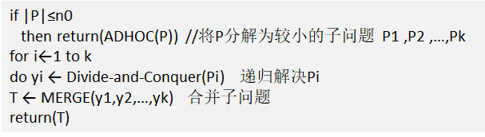
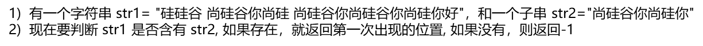
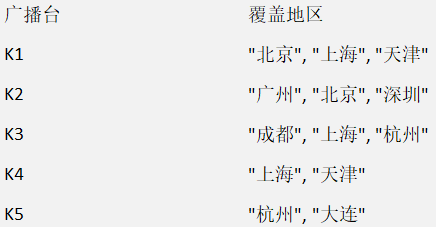
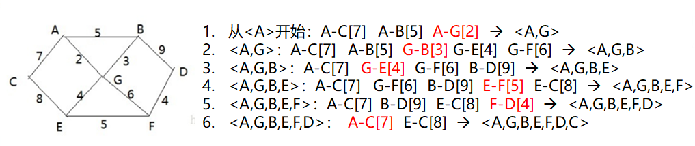
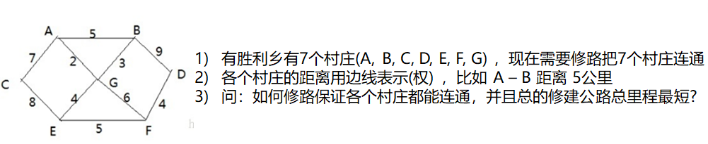
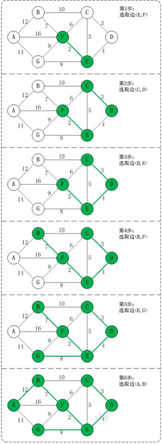
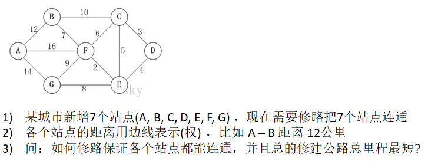

# 1. 二分查找(非递归)

## 1.1 二分查找(非递归)介绍

* 二分查找只适用于从有序数列中进行查找(比如字母和数字)，将数列排序后在进行查找
* 二分查找算法的运行时间为对数时间O(logn)，即查找目标最多需要logn步，假设从[0, 99]中查找30，则需要log100步，即最多需要查找7次(2^6 < 100 < 2^7)

## 1.2 二分查找(非递归)代码实现

```java
package Algorithms.十大经典算法.二分查找;

public class BinarySearchNoRecur {
    public static void main(String[] args) {
        int[] array = new int[]{1, 15, 159, 357, 1234, 1829, 78945};
        int index = binarySearchRecur(array, 2);
        System.out.println("index=" + index);
    }

    // 二分查找的非递归实现
    public static int binarySearchRecur(int[] array, int target) {
        int leftIndex = 0; // 左指针
        int rightIndex = array.length - 1; // 右指针
        while (leftIndex <= rightIndex) { // 循环
            int midIndex = (leftIndex + rightIndex) / 2; // 求中间指针
            if (array[midIndex] == target) { // 若找到，则输出
                return midIndex;
            }
            if (target < array[midIndex]) { // 向左查找
                rightIndex = midIndex - 1;
            } else { // 向右查找
                leftIndex = midIndex + 1;
            }
        }
        return -1; // 未找到
    }
}

```

# 2. 分治算法

## 2.1 分治算法介绍

分治算法，字面解释就是“分而治之”，就是把一个复杂的问题分解成两个或者更多的相同或者相似的子问题，再把子问题分解成更小的子问题……直到最后最后的子问题可以简单的直接求解，原问题的解即子问题的解的合并。这个技巧是很多高效算法的基础，如排序算法(快速排序、归并排序)、傅里叶变化(快速傅里叶变换)……

分治算法求解的经典问题：

二分搜索、大整数乘法、棋盘覆盖、合并排序、快速排序、线性时间选择、最接近点对问题、循环赛日程表、汉诺塔求解

## 2.2 分治算法的基本步骤

分支算法在每一层递归上都有三个步骤：

1. 分解：将原问题分解为若干个规模较小、相互独立、与原问题形式相同的子问题。
2. 解决：若子问题的规模较小而容易被直接解决，则直接进行求解，否则递归的求解各个子问题。
3. 合并：将各个子问题的解合并为原问题的解。

## 2.3 分治算法的设计模式

其中：

* |P|表示问题P的规模
* n0为一阈值，表示当问题P的规模不超过n0时，问题已容易直接解出，不必再继续分解。
* ADHOC(P)是该分治法中的基本子算法，用于直接解小规模的问题P。因此，当P的规模不超过n0时直接用算法ADHOC(P)求解。
* 算法MERGE(y1,y2,…,yk)是该分治法中的合并子算法，用于将P的子问题P1 ,P2 ,…,Pk的相应的解y1,y2,…,yk合并为P的解。

## 2.4 汉诺塔问题代码实现

```java
package Algorithms.十大经典算法.分治算法;

public class HanoiTower {
    public static void main(String[] args) {
        hanoiTower(5, 'A', 'B', 'C');
    }

    // 使用分治算法解决汉诺塔问题
    public static void hanoiTower(int num, char a, char b, char c) {
        // 如果只有一个盘
        if (num == 1) {
            System.out.println("把第1个盘从 " + a + " -> " + c);
        } else {
            // 如果是n>=2的情况
            // 1. 将上面所有盘从a移动到b
            hanoiTower(num - 1, a, c, b);
            // 2. 将最下面的盘从a移动到c
            System.out.println("把第" + num + "个盘从 " + a + " -> " + c);
            // 3. 将b塔所有的盘从b移动到c
            hanoiTower(num - 1, b, a, c);
        }
    }
}

```

# 3. 动态规划算法

## 3.1 动态规划算法介绍

1. 核心思想：将**大问题划分为小问题**进行解决，从而一步步的获取最优解的处理算法。
2. 动态规划算法与分治算法类似，其基本思想也是将待求解问题分解成若干个子问题，先求解子问题，然后从这些子问题的解中得到原问题的解。
3. 与分治算法不同的是，适用于动态规划求解的问题，经过分解得到的**子问题往往不是独立的**，即下一个阶段的求解是建立在上一个子阶段的解的基础上，进行进一步的求解。
4. 动态规划可以通过填表的方式来逐步推得，得到最优解。

### 3.2 动态规划算法的实践——背包问题


介绍：背包问题主要是指一个给定容量的背包、若干具有一定价值和重量的物品，如何选择物品放入背包使物品的价值最大。其中又分为01背包和完全背包(完全背包是指：每种物品都有无限件可用)

主要思路：利用动态规划来解决。每次遍历到第i个物品，根据w[i]和v[i]来确定是否需要将该物品放入背包中。即对于给定的n个物品，设w[i]和v[i]分别为第i个物品的价值和重量，C为背包的容量。再令v[i][j]为第i个物品中能够装入容量为j的背包中的最大价值。

图解：构建一张表，进行填表

|无物品|0|0   |0   |0   |0   |
|吉他  |0|1500|1500|1500|1500|
|音箱  |0|1500|1500|1500|3000|
|电脑  |0|1500|1500|2000|3500|

## 3.3 背包问题的代码实现

(1)v[i][0]=v[0][j]=0; //表示填入表，第一行和第一列是0

(2)当w[i] > j 时：v[i][j]=v[i-1][j];   // 当准备加入**新增的商品的容量大于当前背包的容量时，就直接使用上一行同列的数值**

(3)当j >=w [i]时： v[i][j]=max{v[i-1][j], v[i]+v[i-1][j-w[i]]}  // 当容量不超重时，若**上一行同列数据<当前物品价格 + 上一行剩余空间数值对应列**，则将当前表格的值设置为**当前物品价格 + 上一行剩余空间数值对应列**

代码：

```java
package Algorithms.十大经典算法.动态规划;

public class KnapsackProblem {
    public static void main(String[] args) {
        int[] weight = {1, 4, 3}; // 物品的重量
        int[] value = {1500, 3000, 2000}; // 物品的价值
        int capacity = 4; // 背包容量
        int amount = value.length; // 物品数量

        // 创建二维数组表示符合要求的背包中能够装入的物品的最大价值
        int[][] totalValue = new int[amount + 1][capacity + 1]; // +1是因为有一列0和一行0
        // 为记录放入商品的情况，定义一个二维数组
        int[][] path = new int[amount + 1][capacity + 1];

        // 动态规划处理
        for (int i = 1; i < amount + 1; i++) { // 不处理第一行，i从1开始
            for (int j = 1; j < capacity + 1; j++) { // 不处理第一列，j从1开始
                if (weight[i - 1] > j) { // 如果物品重量超过总容量，与之前相同，直接使用上一行同列数值
                    totalValue[i][j] = totalValue[i - 1][j];
                } else { // 若不超重
                    if (totalValue[i - 1][j] <
                            value[i - 1] + totalValue[i - 1][j - weight[i - 1]]) {
                        // (上一行同列 < 当前物品价格 + 上一行剩余空间数值对应列)
                        totalValue[i][j] = value[i - 1] + totalValue[i - 1][j - weight[i - 1]];
                        // 该情况下总金额大于之前，记录到path中
                        path[i][j] = 1;
                    } else {
                        // 否则就跟之前的情况相同
                        totalValue[i][j] = totalValue[i - 1][j];
                    }
                }
            }
        }

        // 输出表格查看
        for (int i = 0; i < amount + 1; i++) {
            for (int j = 0; j < capacity + 1; j++) {
                System.out.print(totalValue[i][j] + "  ");
            }
            System.out.println();
        }
        for (int i = 0; i < amount + 1; i++) {
            for (int j = 0; j < capacity + 1; j++) {
                System.out.print(path[i][j] + "  ");
            }
            System.out.println();
        }

        // 输出最终方案
        int i = path.length - 1; // 行最大下标
        int j = path[0].length - 1; // 列最大下标
        while (i > 0 && j > 0) { // 从path最后开始找
            if (path[i][j] == 1) {
                System.out.printf("第%d个商品放入到背包\n", i);
                j -= weight[i - 1];
            }
            i --;
        }
    }
}

```

# 4. KMP算法

## 4.1 KMP算法应用场景

字符串匹配问题：



### 4.2 暴力匹配算法

思路分析：

使用暴力匹配的思路，假设现在str1匹配到 i 位置，子串str2匹配到 j 位置，则：

1. 如果当前字符匹配成功(即str1[i] = str2[j])，则 i++，j++，继续匹配下一个字符。
2. 如果匹配失败(即str1[i] != str2[j])，令 i = i -(j - 1)，j = 0，相当于每一次匹配失败，i 回溯，j被置为0。
使用暴力匹配法会有大量的回溯，每次只移动一位，若是不匹配，则移动到下一位继续判断，浪费大量时间。

暴力匹配代码实现：

```java
package Algorithms.十大经典算法.KMP算法;

public class ViolenceMatch {
    public static void main(String[] args) {
        String str1 = "硅硅谷 尚硅谷你尚硅 尚硅谷你尚硅谷你尚硅你好";
        String str2 = "尚硅谷你尚硅你";
        int index = violenceMatch(str1, str2);
        System.out.println("index = " + index); // index = 15
    }

    // 暴力匹配算法
    public static int violenceMatch(String str1, String str2) {
        char[] s1 = str1.toCharArray();
        char[] s2 = str2.toCharArray();
        int s1Length = s1.length;
        int s2Length = s2.length;
        int i = 0;
        int j = 0;
        // 依次匹配
        while (i < s1Length && j < s2Length) {
            if (s1[i] == s2[j]) {
                i ++; // i指针后移
                j ++; // j指针后移
            } else {
                i = i - (j - 1); // i指针回退
                j = 0; // j指针回退
            }
        }
        // 判断是否匹配成功
        if (j == s2Length) {
            return i - j;
        } else {
            return -1;
        }
    }
}

```

## 4.3 KMP算法介绍

1. KMP(Kunth-Morris-Pratt)字符串查找算法，常用于在一个文本串S中查找一个模式串P的出现位置。
2. KMP算法利用之前判断过的信息，通过一个next数组，保存模式串中前后最长公共子序列的长度，每次回溯时，通过next数组找到前面匹配过的位置，节省大量时间。
3. 参考资料：https://www.cnblogs.com/ZuoAndFutureGirl/p/9028287.html
### 4.4 KMP算法的应用——字符串匹配问题

KMP思路分析：

1. 首先生成**next数组(根据前后缀生成)**
2. 当匹配**正确时，依次后移验证每一个字符**
3. 当匹配**出错时，i 回退位数 = 已匹配字符数 - 最后一个匹配字符对应的部分匹配值**
KMP算法解决字符串匹配问题代码实现：

```java
package Algorithms.十大经典算法.KMP算法;

import java.util.Arrays;

public class KMP {
    public static void main(String[] args) {
        String str1= "BBC ABCDAB ABCDABCDABDE";
        String str2="ABCDABD";
        System.out.println(Arrays.toString(kmpNext(str2))); // [0, 0, 0, 0, 1, 2, 0]
        System.out.println("index = " + kmpSearch(str1, str2, kmpNext(str2))); // index = 15
    }

    // KMP算法
    public static int kmpSearch(String str1, String str2, int[] next) {
        // 遍历
        for (int i = 0, j = 0; i < str1.length(); i++) {
            // KMP算法核心！
            // 当j>0且两个指针对应字符不相同时，指针j回退到next[j-1]
            // 直到找到相同字符或子串需要从头重新匹配(无对应字符)为止
            while (j > 0 && str1.charAt(i) != str2.charAt(j)) {
                j = next[j - 1];
            }
            // 若两个指针对应字符相同，j后移继续比较
            if (str1.charAt(i) == str2.charAt(j)) {
                j ++;
            }
            // 匹配成功，返回i-j+1
            if (j == str2.length()) {
                return i - j + 1;
            }
        }
        // 未匹配成功，返回-1
        return -1;
    }

    // 获取子串的部分匹配值表
    public static int[] kmpNext(String target) {
        // 创建数组保存部分匹配值
        int[] next = new int[target.length()];
        next[0] = 0; // 长度为1的字符串部分匹配值为0
        for (int i = 1, j = 0; i < target.length(); i++) {
            // KMP算法核心！
            // 指针i从1开始(因为next[0]=0)，指针j从0开始
            // 当j>0且两个指针对应字符不相同时，指针j回退到next[j-1]
            // 直到找到相同字符或子串需要从头重新匹配(无对应字符)为止
            while (j > 0 && target.charAt(i) != target.charAt(j)) {
                j = next[j - 1];
            }
            // 若两个指针对应字符相同，j后移，并将后移后的j写入next[i]
            if (target.charAt(i) == target.charAt(j)) {
                j ++;
            }
            next[i] = j;
        }
        return next;
    }
}

```

# 5. 贪心算法

## 5.1 贪心算法介绍

1. 贪心算法(贪婪算法)是指在对问题进行求解时，**在每一步的选择中都采取最好或者最优(即最有利)的选择**，从而希望能够到种子结果最好或者最优的算法。
2. 贪心算法所得到的的结果不一定是最优的结果(有时候会是最优解)，但都是相对近似最优解的结果。

## 5.2 贪心算法的应用——集合覆盖

假设存在如下表的付费广播台，以及广播台信号可以覆盖的地区。如何选择最少的广播台，让所有地区都可以接收到信号。



思路分析：

1. 遍历所有广播电台，寻找一个覆盖了最多未覆盖地区的电台(此电台可能包含一些已覆盖地区，但是没有关系)。
2. 将这个电台加入到一个集合中，并将该电台覆盖的地区在下次比较时去掉。
3. 重复第一步直到覆盖全部的地区。

## 5.3 集合覆盖问题代码实现

```java
package Algorithms.十大经典算法.贪心算法;

import java.util.ArrayList;
import java.util.HashMap;
import java.util.HashSet;

public class Greedy {
    public static void main(String[] args) {
        // 创建广播电台，放入到Map
        HashMap<String, HashSet<String>> broadcasts = new HashMap<>();
        // 将各个电台的信息加入到broadcasts
        HashSet<String> hashSet1 = new HashSet<>();
        hashSet1.add("北京");
        hashSet1.add("上海");
        hashSet1.add("天津");
        HashSet<String> hashSet2 = new HashSet<>();
        hashSet2.add("广州");
        hashSet2.add("北京");
        hashSet2.add("深圳");
        HashSet<String> hashSet3 = new HashSet<>();
        hashSet3.add("成都");
        hashSet3.add("上海");
        hashSet3.add("杭州");
        HashSet<String> hashSet4 = new HashSet<>();
        hashSet4.add("上海");
        hashSet4.add("天津");
        HashSet<String> hashSet5 = new HashSet<>();
        hashSet5.add("杭州");
        hashSet5.add("大连");
        broadcasts.put("K1", hashSet1);
        broadcasts.put("K2", hashSet2);
        broadcasts.put("K3", hashSet3);
        broadcasts.put("K4", hashSet4);
        broadcasts.put("K5", hashSet5);
        // 创建地区集合，存放所有地区
        HashSet<String> allAreas = new HashSet<>();
        allAreas.add("北京");
        allAreas.add("上海");
        allAreas.add("天津");
        allAreas.add("广州");
        allAreas.add("深圳");
        allAreas.add("成都");
        allAreas.add("杭州");
        allAreas.add("大连");
        // 创建电台集合，存放选择的电台
        ArrayList<String> selects = new ArrayList<>();
        // 定义临时集合，存放某电台覆盖地区与当前未覆盖地区的交集
        HashSet<String> tempSet = new HashSet<>();
        // 定义maxKey，保存能够覆盖最大未覆盖地区的电台名
        String maxKey = null;
        // 定义maxNum，保存能够覆盖最大未覆盖地区的数量
        int maxNum = 0;
        // 循环执行直到所有地区都被覆盖
        while (allAreas.size() != 0) {
            // 每进行一轮循环，清空maxKey与maxNum
            maxKey = null;
            maxNum = 0;
            for (String key: broadcasts.keySet()) {
                // 没进行一次for，清空临时集合
                tempSet.clear();
                // 取出当前电台所覆盖的区域，放入临时集合
                HashSet<String> areas = broadcasts.get(key);
                tempSet.addAll(areas);
                // 求当前电台覆盖区域与未覆盖区域的交集，结果存入tempSet
                tempSet.retainAll(allAreas);
                // 如果当前电台可覆盖的未覆盖区域的数量大于之前的
                // 体现贪心算法的核心：每次选择都是最优的！
                if (tempSet.size() > maxNum) {
                    maxKey = key;
                    maxNum = tempSet.size();
                }
            }
            // 如果maxKey存在，就将其加入选择集合selects
            if (maxKey != null) {
                selects.add(maxKey);
                // 将maxKey覆盖的地区从未覆盖地区集合中去掉
                allAreas.removeAll(broadcasts.get(maxKey));
            }
        }
        // 输出结果
        System.out.println("选择的结果是：" + selects);
    }
}

```

## 5.4 贪心算法注意事项

1. 贪心算法所得到的的结果不一定是最优的结果(有时候会是最优解)，但都是相对近似最优解的结果。
2. 上例中，K1, K2, K3, K5覆盖了全部的区域；同样的，我们发现K2, K3, K4, K5也可以覆盖全部的区域。倘若K2的使用成本低于K1，那么上述的K1, K2, K3, K5虽然满足条件，但并不是最优解。

# 6. Prim算法

## 6.1 Prim算法简介

Prim算法求最小生成树，也就是在包含n个顶点的连通图中，找出只有n-1条边包含所有n个顶点的连通子图，也就是所谓的极小连通子图。

## 6.2 图解Prim算法



## 6.3 Prim算法解决修路问题



Prim算法解决修路问题——代码实现：

图Graph类：

```java
package Algorithms.十大经典算法.Prim算法;

class Graph {
    int verxs; // 表示图的节点的个数
    char[] data; // 存放节点数据
    int[][] weight; // 存放边权值，即邻接矩阵

    public Graph(int verxs, char[] data, int[][] weight) {
        this.verxs = verxs;
        this.data = data;
        this.weight = weight;
    }
}

```

minTree最小生成树类：

```java
package Algorithms.十大经典算法.Prim算法;

import java.util.Arrays;

// 创建最小生成树
class MinTree {
    private Graph graph;

    public MinTree(Graph graph) {
        this.graph = graph;
    }

    // 显示图的邻接矩阵
    public void showGraph() {
        for (int[] row: graph.weight) {
            System.out.println(Arrays.toString(row));
        }
    }

    // 编写Prim算法，得到最小生成树
    public void prim(Graph graph, int v) {
        int[] visited = new int[graph.verxs]; // 记录已访问节点
        visited[v] = 1; // 将当前节点标记为已访问
        // h1和h2记录两个顶点的下标
        int h1 = -1;
        int h2 = -1;
        int minWeight = 10000; // 初始化权重为一个大数，之后会被替换
        for (int k = 1; k < graph.verxs; k++) { // 因为存在顶点，所以Prim算法结束后，有graph.verxs-1条边
            // 寻找每一次生成的子图，与哪一个节点的距离最近(权重最小)
            for (int i = 0; i < graph.verxs; i++) { // i表示已经访问过的节点
                for (int j = 0; j < graph.verxs; j++) { // j表示未访问的节点
                    if (visited[i] == 1 && visited[j] == 0
                            && graph.weight[i][j] < minWeight) {
                        minWeight = graph.weight[i][j];
                        h1 = i;
                        h2 = j;
                    }
                }
            }
            // 找到权值最小的边，输出
            System.out.println("边<" + graph.data[h1] + ","
                    + graph.data[h2] + "> 权值：" + minWeight);
            // 将当前节点标记为已访问
            visited[h2] = 1;
            // 将权重重新设置为大数10000
            minWeight = 10000;
        }
    }
}

```

primDemo测试类：

```java
package Algorithms.十大经典算法.Prim算法;

public class primDemo {
    public static void main(String[] args) {
        char[] data = new char[]{'A', 'B', 'C', 'D', 'E', 'F', 'G'};
        int verxs = data.length;
        int n = 10000;
        int[][] weight = new int[][]{
                {n, 5, 7, n, n, n, 2},
                {5, n, n, 9, n, n, 3},
                {7, n, n, n, 8, n, n},
                {n, 9, n, n, n, 4, n},
                {n, n, 8, n, n, 5, 4},
                {n, n, n, 4, 5, n, 6},
                {2, 3, n, n, 4, 6, n}
        };
        // 实例化图对象
        Graph graph = new Graph(verxs, data, weight);
        // 实例化树
        MinTree minTree = new MinTree(graph);
        // 输出
        minTree.showGraph();
        // 测试Prim算法
        minTree.prim(graph, 0);
    }
}

输出结果：
边<A,G> 权值：2
边<G,B> 权值：3
边<G,E> 权值：4
边<E,F> 权值：5
边<F,D> 权值：4
边<A,C> 权值：7
```

# 7. Kruskal算法

## 7.1 Kruskal算法简介

1. Kruskal算法，是用来求加权连通图最小的生成树的算法
2. 基本思想：按照权值从小到大的顺序选择 n - 1 条边，并保证这 n - 1 条边不构成回路
3. 具体实现：首先构造一个只含有 n 个顶点的森林，然后依照权值从小到大从连通网中选择边加入到森林中，并使森林中不产生回路，直至森林变成一棵树为止

## 7.2 Kruskal算法图解



关于是否构成回路的判断：

当顶点未加入最小生成树时，其终点为其本身；当顶点加入后，其终点为所能连通到的序号最大的顶点。若我们加入的边的两个顶点都指向同一个终点，则说明构成回路。

## 7.3 Kruskal算法解决公交站问题



Graph图类：

```java
package Algorithms.十大经典算法.Kruskal算法;

public class Graph {
    char[] vertexes;
    int[][] matrix;
    int edgeNum = 0;
    private static final int INF = Integer.MAX_VALUE;

    // 构造器
    public Graph(char[] vertexes, int[][] matrix) {
        this.vertexes = vertexes;
        this.matrix = matrix;

        for (int i = 0; i < vertexes.length; i++) {
            for (int j = i + 1; j < vertexes.length; j++) {
                if (this.matrix[i][j] != INF) {
                    edgeNum ++;
                }
            }
        }
    }

    // 返回顶点对应的下标
    public int getPosition(char target) {
        for (int i = 0; i < vertexes.length; i++) {
            if (vertexes[i] == target) {
                return i;
            }
        }
        return -1; // 未找到返回-1
    }
}

```

EdgeData边信息类：

```java
package Algorithms.十大经典算法.Kruskal算法;

public class EdgeData {
    char start; // 边的起始顶点
    char end; // 边的终止顶点
    int weight; // 边的权值

    public EdgeData(char start, char end, int weight) {
        this.start = start;
        this.end = end;
        this.weight = weight;
    }

    @Override
    public String toString() {
        return "EdgeData{" +
                "<" + start +
                ", " + end +
                "> 权重：" + weight +
                '}';
    }
}

```

MinTree最小生成树类：

```java
package Algorithms.十大经典算法.Kruskal算法;

public class MinTree {
    Graph graph;
    EdgeData[] edgeData;
    private static final int INF = Integer.MAX_VALUE;

    // 构造器
    public MinTree(Graph graph) {
        this.graph = graph;

        // 根据传入的图生成边集
        int index = 0;
        edgeData = new EdgeData[graph.edgeNum];
        for (int i = 0; i < graph.vertexes.length; i++) {
            for (int j = i + 1; j < graph.vertexes.length; j++) {
                if (graph.matrix[i][j] != INF) {
                    edgeData[index ++] = new EdgeData(
                            graph.vertexes[i], graph.vertexes[j], graph.matrix[i][j]);
                }
            }
        }
    }

    // 打印邻接矩阵
    public void print() {
        System.out.println("邻接矩阵为：");
        for (int i = 0; i < graph.vertexes.length; i++) {
            for (int j = 0; j < graph.vertexes.length; j++) {
                System.out.printf("%12d", graph.matrix[i][j]);
            }
            System.out.println();
        }
    }

    // ★kruskal算法核心：获取下标为 i 的顶点的终点★
    public int getEnd(int[] ends, int i) {
        while (ends[i] != 0) {
            i = ends[i];
        }
        return i;
    }

    // 按照权值对边集进行排序（冒泡排序）
    public void sortEdges() {
        for (int i = 0; i < edgeData.length - 1; i++) {
            for (int j = 0; j < edgeData.length - 1 - i; j++) {
                if (edgeData[j].weight > edgeData[j + 1].weight) {
                    EdgeData temp = edgeData[j];
                    edgeData[j] = edgeData[j + 1];
                    edgeData[j + 1] = temp;
                }
            }
        }
    }

    // kruskal算法
    public void kruskal() {
        int index = 0; // 表示最后结果数组的索引
        int[] ends = new int[graph.edgeNum]; // 用于保存在最小生成树集的顶点的终点
        EdgeData[] result = new EdgeData[graph.edgeNum]; // 保存生成的最小生成树
        this.sortEdges(); // 对边集按照权值进行排序
        // 遍历边集，将边添加到最小生成树中（判断如果准备加入的边形成回路，则不能加入，否则就加入）
        for (int i = 0; i < graph.edgeNum; i++) {
            int p1 = graph.getPosition(edgeData[i].start); // 获取第 i 条边的第一个顶点
            int p2 = graph.getPosition(edgeData[i].end); // 获取第 i 条边的第二个顶点
            int m = getEnd(ends, p1); // 获取 p1 的终点
            int n = getEnd(ends, p2); // 获取 p2 的终点
            // 判断是否构成回路(kruskal算法核心)
            if (m != n) {
                ends[m] = n; // 设置 m 在最小生成树中的终点为 n
                result[index ++] = edgeData[i];
            }
        }
        System.out.println("最小生成树为：");
        for (int i = 0; i < index; i++) {
            System.out.println(result[i]);
        }
    }
}

```

kruskal算法测试类kruskalDemo：

```java
package Algorithms.十大经典算法.Kruskal算法;

public class kruskalDemo {
    private static final int INF = Integer.MAX_VALUE;
    public static void main(String[] args) {
        char[] vertexes = new char[]{'A', 'B', 'C', 'D', 'E', 'F', 'G'};
        int[][] matrix = new int[][]{
                {0, 12, INF, INF, INF, 16, 14},
                {12, 0, 10, INF, INF, 7, INF},
                {INF, 10, 0, 3, 5, 6, INF},
                {INF, INF, 3, 0, 4, INF, INF},
                {INF, INF, 5, 4, 0, 2, 8},
                {16, 7, 6, INF, 2, 0, 9},
                {14, INF, INF, INF, 8, 9, 0}
        };
        Graph graph = new Graph(vertexes, matrix);
        MinTree minTree = new MinTree(graph);
        minTree.kruskal();
    }
}

结果：
最小生成树为：
EdgeData{<E, F> 权重：2}
EdgeData{<C, D> 权重：3}
EdgeData{<D, E> 权重：4}
EdgeData{<B, F> 权重：7}
EdgeData{<E, G> 权重：8}
EdgeData{<A, B> 权重：12}
```

# 8. Dijkstra算法

## 8.1 Dijkstra算法介绍

Dijkstra算法是典型的最短路径算法，用于计算一个节点到其他节点的最短路径。它最主要的特点是以起始点为中心向外层扩展(广度优先搜索的思想)，直到扩展到终点为止。

## 8.2 Dijkstra算法思路分析

1. 设置出发顶点v，顶点集合V{v1, v2, v3, vi, ......}，v到V中各顶点的距离构成距离集合Dis{d1, d2, d3, di, ......}，Dis集合记录着v到图中各顶点的距离(到自身的距离看做0)
2. 从Dis中选择值最小的di并移出Dis集合，同时移出V集合中对应的顶点vi，此时v到vi即为最短路径
3. 更新Dis集合，更新规则为：将v到V集合中顶点的距离值与v通过vi到V集合中顶点的距离值相比较，保留值较小的一个(同时更新顶点的前驱结点为vi，表明是通过vi到达的)
4. 重复执行直到最短路径顶点为目标顶点即可结束

## 8.3 Dijkstra算法的应用——最短路径


已访问顶点类：

```java
package Algorithms.十大经典算法.Dijkstra算法;

import java.util.Arrays;

// 已访问顶点集合
public class VisitedVertex {
    // 记录各个顶点是否访问过，1表示访问过，0表示未访问过
    public int[] already_arr;
    // 前驱结点数组，每个下白哦对应的值为前一个顶点的下标，动态更新
    public int[] pre_visited;
    // 记录出发顶点到其他所有顶点的距离，求得的最短距离存放到dis
    public int[] dis;

    // 构造器
    public VisitedVertex(int length, int index) {
        this.already_arr = new int[length];
        this.pre_visited = new int[length];
        this.dis = new int[length];
        // 初始化dis数组
        Arrays.fill(dis, 65535);
        this.already_arr[index] = 1; // 将起始顶点设置为已访问
        this.dis[index] = 0; // 设置出发顶点到自身的距离为0
    }

    // 判断index顶点是否被访问过
    public boolean isVisited(int index) {
        return already_arr[index] == 1;
    }

    // 更新出发顶点到index顶点的距离
    public void updateDis(int index, int distance) {
        dis[index] = distance;
    }

    // 更新某顶点的前驱结点为index顶点
    public void updatePre(int pre, int index) {
        pre_visited[pre] = index;
    }

    // 返回出发顶点到index顶点的距离
    public int getDis(int index) {
        return dis[index];
    }

    // 继续选择并返回新的访问节点
    public int updateArr() {
        int min = 65535, index = 0;
        for (int i = 0; i < already_arr.length; i++) {
            if (already_arr[i] == 0 && dis[i] < min) {
                min = dis[i];
                index = i;
            }
        }
        // 更新index节点为已访问
        already_arr[index] = 1;
        return index;
    }

    // 显示最后结果
    public void show() {
        System.out.println("=============================");
        // 输出already_arr
        for (int i: already_arr) {
            System.out.print(i + " ");
        }
        System.out.println();
        // 输出pre_visited
        for (int i: pre_visited) {
            System.out.print(i + " ");
        }
        System.out.println();
        // 输出already_arr
        for (int i: dis) {
            System.out.print(i + " ");
        }
    }
}

```

Graph图类：

```java
package Algorithms.十大经典算法.Dijkstra算法;

import java.util.Arrays;

public class Graph {
    private char[] vertex; // 顶点数组
    private int[][] matrix; // 邻接矩阵
    private VisitedVertex vv; // 已访问节点集合

    // 构造器
    public Graph(char[] vertex, int[][] matrix) {
        this.vertex = vertex;
        this.matrix = matrix;
    }

    // 显示结果
    public void showDijkstra() {
        vv.show();
    }

    // 显示图
    public void showGraph() {
        for (int[] link: matrix) {
            System.out.println(Arrays.toString(link));
        }
    }

    // 更新index顶点到周围顶点的距离和周围顶点的前驱结点
    private void update(int index) {
        int distance = 0;
        // 遍历邻接矩阵的matrix[index]行
        for (int j = 0; j < matrix[index].length; j++) {
            // distance = 出发顶点到index顶点的距离 + index顶点到j顶点的距离
            distance = vv.getDis(index) + matrix[index][j];
            // 如果j未访问，且distance小于从出发顶点到j顶点的距离，则更新
            if (!vv.isVisited(j) && distance < vv.getDis(j)) {
                vv.updatePre(j, index);
                vv.updateDis(j, distance);
            }
        }
    }

    // Dijkstra算法
    public void dijkstra(int index) {
        vv = new VisitedVertex(vertex.length, index);
        update(index); // 更新index顶点到周围节点的距离和前驱结点
        for (int j = 1; j < vertex.length; j++) {
            index = vv.updateArr(); // 选择并返回新的访问节点
            update(index); // 更新index顶点到周围顶点的距离和前驱结点
        }
    }
}

```

dijkstraDemo测试类：

```java
package Algorithms.十大经典算法.Dijkstra算法;

public class dijkstraDemo {
    public static void main(String[] args) {
        char[] vertex = {'A', 'B', 'C', 'D', 'E', 'F', 'G'};
        int[][] matrix = new int[vertex.length][vertex.length];
        final int N = 65535;
        matrix[0] = new int[]{N, 5, 7, N, N, N, 2};
        matrix[1] = new int[]{5, N, N, 9, N, N, 3};
        matrix[2] = new int[]{7, N, N, N, 8, N, N};
        matrix[3] = new int[]{N, 9, N, N, N, 4, N};
        matrix[4] = new int[]{N, N, 8, N, N, 5, 4};
        matrix[5] = new int[]{N, N, N, 4, 5, N, 6};
        matrix[6] = new int[]{2, 3, N, N, 4, 6, N};
        Graph graph = new Graph(vertex, matrix);
        graph.dijkstra(2);
        graph.showDijkstra();
    }
}
结果：
=============================
1 1 1 1 1 1 1 
2 0 0 5 2 4 0 
7 12 0 17 8 13 9 
```
