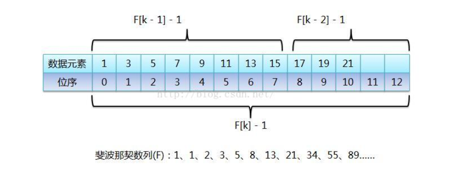

# 1. 查找算法介绍

常用的四种查找算法：

* 顺序(线性)查找
* 二分查找/折半查找
* 差值查找
* 斐波那契查找

# 2. 线性查找算法

## 2.1 基本介绍

遍历所有数据，若找到目标值，则返回索引；若没找到则返回-1

## 2.2 代码实现

```java
package DataStructures.查找算法;

public class SeqSearch {
    public static void main(String[] args) {
        int[] array = new int[]{1, 15, 159, 753, 75, 53, 3};
        int index = seqSearch(array, 3);
        if (index == -1) {
            System.out.println("没有找到!");
        } else {
            System.out.println(index);
        }
    }

    public static int seqSearch(int[] array, int findVal) {
        for (int i = 0; i < array.length; i++) {
            if (array[i] == findVal) {
                return i;
            }
        }
        return -1;
    }
}

```

# 3. 二分查找算法

## 3.1 基本介绍

二分查找思路分析：

1. 首先确定该数组的中间下标：mid = (left + right) / 2
2. 然后让需要查找的数findVal与arr[mid]进行比较    * 如果findVal > arr[mid]，说明要查找的数在mid右边，因此需要向右递归查找
    * 如果findVal < arr[mid]，说明要查找的数在mid左边，因此需要向左递归查找
    * 如果findVal = arr[mid]，说明找到

3. 结束递归的两种情况：    * 找到目标值
    * 递归完整个数组，仍然没有找到findVal(即left > right)
动态演示：


## 3.2 代码实现

```java
package DataStructures.查找算法;

// 使用二分查找的前提是数组有序！！！
public class BinarySearch {
    public static void main(String[] args) {
        int[] array = new int[]{1, 8, 10, 89, 1000, 1001, 1234};
        int index = binarySearch(array, 0, array.length - 1, 1234);
        System.out.println(index);
    }

    public static int binarySearch(int[] array, int left, int right, int findVal) {
        // 当left大于right时，说明已经递归遍历整个数组，还没有找到目标值
        if (left > right) {
            return -1;
        }
        // 计算中间索引，取得中间值
        int midIndex = (left + right) / 2;
        int midValue = array[midIndex];
        // 递归遍历
        if (findVal > midValue) { // 向右递归
            return binarySearch(array, midIndex + 1, right, findVal);
        } else if (findVal < midValue) { // 向左递归
            return  binarySearch(array, left, midIndex - 1, findVal);
        } else {
            return midIndex;
        }
    }
}

```

思考题：当有多个相同数值时，如何全部找到

```java
package DataStructures.查找算法;

import java.util.ArrayList;

// 使用二分查找的前提是数组有序！！！
public class BinarySearch {
    public static void main(String[] args) {
        int[] array1 = new int[]{1, 8, 10, 89, 1000, 1000, 1000, 1234};
        ArrayList<Integer> list = binarySearchAll(array1, 0, array1.length - 1, 1000);
        System.out.println(list);
    }
    /*
     * 思考题：当有多个相同数值时，如何全部找到
     * 思路：1. 找到minIndex时，不要立即返回
     *      2. 向midIndex左侧扫描，将所有满足的值的下标加入集合ArrayList
     *      3. 向midIndex右侧扫描，将所有满足的值的下标加入集合ArrayList
     *      4. 返回集合
     */
    public static ArrayList<Integer> binarySearchAll(int[] array, int left, int right, int findVal) {
        // 当left大于right时，说明已经递归遍历整个数组，还没有找到目标值
        if (left > right) {
            return new ArrayList<Integer>();
        }
        // 计算中间索引，取得中间值
        int midIndex = (left + right) / 2;
        int midValue = array[midIndex];
        // 递归遍历
        if (findVal > midValue) { // 向右递归
            return binarySearchAll(array, midIndex + 1, right, findVal);
        } else if (findVal < midValue) { // 向左递归
            return  binarySearchAll(array, left, midIndex - 1, findVal);
        } else {
            ArrayList<Integer> list = new ArrayList<>();

            int temp = midIndex - 1;
            while (true) {
                if (temp < 0 || array[temp] != findVal) {
                    break;
                }
                list.add(temp);
                temp -= 1;
            }

            list.add(midIndex);

            temp = midIndex + 1;
            while (true) {
                if (temp > array.length - 1 || array[temp] != findVal) {
                    break;
                }
                list.add(temp);
                temp += 1;
            }
            return list;
        }
    }
}

```

# 4. 插值查找算法

## 4.1 基本介绍

原理介绍：插值查找算法类似于二分查找，不同的是插值查找每次从自适应的midIndex开始查找

**midIndex = left + (right - left) * (findVal - array[ left ]) / (array[ right ] - array[ left ])**

插值查找注意事项：

1. 对于数据量较大，关键字分布较为均匀的查找表来说，采用插值查找速度较快
2. 关键字分布不均匀的情况下，该方法不一定比二分查找好

## 4.2 代码实现

```java
package DataStructures.查找算法;

public class InsertSearch {
    public static void main(String[] args) {
        int[] array = new int[100];
        for (int i = 0; i < 100; i++) {
            array[i] = i;
        }
        int index = insertSearch(array, 0, array.length - 1, 66);
        System.out.println(index);
    }

    public static int insertSearch(int[] array, int left, int right, int findVal) {
        // 注意该判断后两个条件，如果缺少会导致越界
        if (left > right || findVal > array[array.length - 1] || findVal < array[0]) {
            return -1;
        }
        // 计算midIndex，查出midValue
        int midIndex = left + (right - left) * (findVal - array[left]) / (array[right] - array[left]);
        int midValue = array[midIndex];
        // 类似二分查找
        if (findVal > midValue) { // 向右递归
            return insertSearch(array, midIndex + 1, right, findVal);
        } else if (findVal < midValue) { // 向左递归
            return insertSearch(array, left, midIndex - 1, findVal);
        } else {
            return midIndex;
        }
    }
}

```

# 5. 斐波那契查找(黄金分割法)

## 5.1 基本介绍

斐波那契数列，又称黄金分割数列，指的是这样一个数列：1、1、2、3、5、8、13、21、····，在数学上，斐波那契被递归方法如下定义：F(1)=1，F(2)=1，F(n)=f(n-1)+F(n-2) （n>=2）。该数列越往后相邻的两个数的比值越趋向于黄金比例值（0.618）。

斐波那契查找就是在二分查找的基础上根据斐波那契数列进行分割的。在斐波那契数列找一个等于略大于查找表中元素个数的数F[n]，将原查找表扩展为长度为F[n] (如果要补充元素，则补充重复最后一个元素，直到满足F[n]个元素)，完成后进行斐波那契分割，即F[n]个元素分割为前半部分F[n-1]个元素，后半部分F[n-2]个元素，找出要查找的元素在那一部分并递归，直到找到。

斐波那契查找的时间复杂度还是O(log 2 n )，但是 与折半查找相比，斐波那契查找的优点是它只涉及加法和减法运算，而不用除法，而除法比加减法要占用更多的时间，因此，斐波那契查找的运行时间理论上比折半查找小，但是还是得视具体情况而定。



## 5.2 代码实现

不太明白，记住！

```java
package DataStructures.查找算法;

import java.util.Arrays;

public class FibonacciSearch {
    public static void main(String[] args) {
        int[] array = new int[]{1, 8, 10, 89, 1000, 1234};
        System.out.println("index = " + fibSearch(array, 89));
    }

    public static int maxSize = 20;
    // 使用非递归方法获得一个斐波那契数列
    public static int[] fibonacci() {
        int[] fib = new int[maxSize];
        fib[0] = 1;
        fib[1] = 1;
        for (int i = 2; i < maxSize; i++) {
            fib[i] = fib[i - 1] + fib[i - 2];
        }
        return fib;
    }
    // 斐波那契查找算法
    public static int fibSearch(int[] array, int key) {
        int low = 0;
        int high = array.length - 1;
        int k = 0; // 表示斐波那契分割数值的下标
        int midIndex = 0;
        int[] fib = fibonacci(); // 获取斐波那契数列
        // 获取斐波那契分割数值的小标
        while (high > fib[k] - 1) {
            k ++;
        }
        // 因为fib[k]的值可能会大于array的长度，因此我们需要使用Arrays类，构造一个新数组，并指向temp[]
        int[] temp = Arrays.copyOf(array, fib[k]); // 不足fib[k]的位置默认用0补全
        for (int i = high + 1; i < temp.length; i++) { // 将不足fib[k]的位置用array的最后一个数补全
            temp[i] = array[high];
        }
        // while循环查找key
        while (low <= high) {
            midIndex = low + fib[k - 1] - 1;
            if (key < temp[midIndex]) { // 继续向数组前面查找
                high = midIndex - 1;
                k --;
            } else if (key > temp[midIndex]) { // 继续向数组后面查找
                low = midIndex + 1;
                k -= 2;
            } else {
                if (midIndex <= high) {
                    return midIndex;
                } else {
                    return high;
                }
            }
        }
        return -1;
    }

}

```
