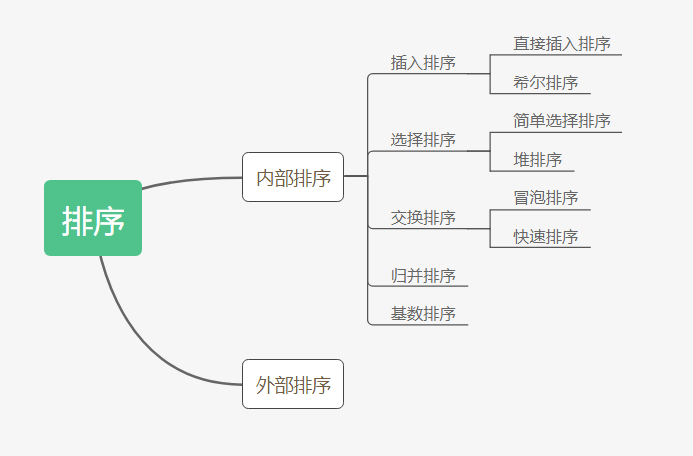
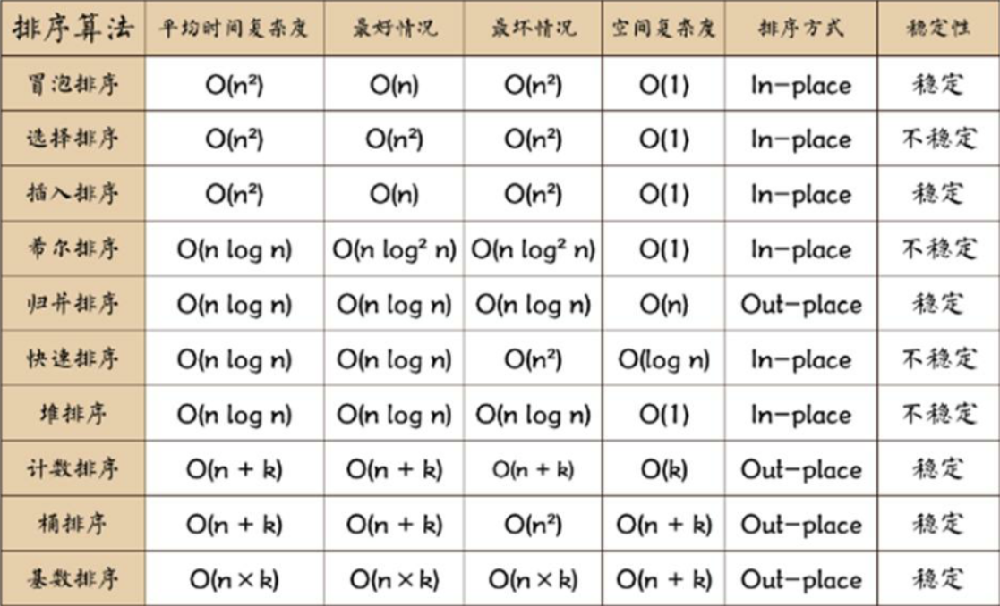
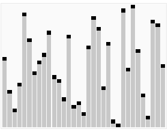
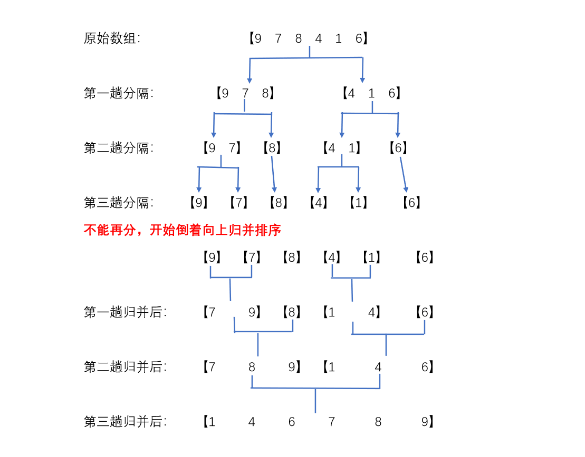

# 1. 排序算法简介

## 1.1 概述

排序也称排序算法，是将一组数据按照指定的顺序进行排列的过程。

## 1.2 排序的分类

* 内部排序：将需要处理的所有数据加载到内部处理器(内存)中进行排序
* 外部排序：数据量过大，无法全部加载到内存中，需要借助外部存储(文件等)进行排序
常见的排序算法分类：



## 1.3 算法的时间复杂度

### 时间频度

算法花费的时间与算法中语句执行次数成正比。一个算法中语句执行次数称为语句频度或事件频度。记T(n)。

### 时间复杂度

计算时间复杂度的方法：

1. 用常数1代替运行时间中所有的加法常数
2. 修改后的运行函数中，只保留最高阶项
3. 去除最高阶项的系数
常见的时间复杂度：

* 常数阶：O(1)
* 对数阶：O(log2n)
* 线性阶：O(n)
* 线性对数阶：O(nlog2n)
* 平方阶：O(n^2)
* 立方阶：O(n^3)
* k次方阶：O(n^k)
* 指数阶：O(2^n)

## 1.4 排序算法比较



说明：

* 稳定：如果a原本在b前面，而a=b，排序之后a仍然在b的前面。
* 不稳定：如果a原本在b的前面，而a=b，排序之后 a 可能会出现在 b 的后面。
* 时间复杂度：对排序数据的总的操作次数。反映当n变化时，操作次数呈现什么规律。
* 空间复杂度：是指算法在计算机内执行时所需存储空间的度量，它也是数据规模n的函数。
* 内排序：所有操作都在内存中完成。
* 外排序：有余数据太大，因此把数据放在磁盘中，排序通过磁盘和内存的数据传输才能进行。
* n：数据规模
* k：“桶”的个数
* In-place：不占用额外内存
* Out-place：占用额外内存

# 2. 冒泡排序

## 2.1 基本介绍

冒泡排序(Bubble Sorting)：通过对待排序序列从前向后（从下标小的元素开始），依次比较相邻元素的值，若发现逆序则交换，使值较大的元素逐渐从前移向后部，就像水底的气泡一样逐渐向上冒。

优化：

排序过程中，各元素不断接近自己的位置。若一趟比较下来没有进行过交换，就说明序列有序。因此要在排序过程中设置一个标志flag判断元素是否进行了交换，从而减少不必要的比较。

动态演示：


## 2.2 代码实现

```java
package DataStructures.排序算法;

import java.util.Arrays;

public class BubbleSort {
    public static void main(String[] args) {
        int[] array = new int[]{-9, 2, 1, 5, -2};
        bubbleSort(array);
        System.out.println(Arrays.toString(array));
    }

    public static void bubbleSort(int[] array) {
        int temp;
        boolean flag = false;

        // 有length-1个数冒泡，排序就完成
        for (int i = 0; i < array.length - 1; i++) {
            // 每冒泡一次，最后一位就固定，所以判断的次数减一
            for (int j = 0; j < array.length - 1 - i; j++) {
                if (array[j] > array[j + 1]) {
                    flag = true;
                    temp = array[j];
                    array[j] = array[j + 1];
                    array[j + 1] = temp;
                }
            }
            // 如果在一趟排序中没有发生顺序的调换，则证明排序已经完成
            if (!flag) {
                break;
            } else {
                flag = false;
            }
        }
    }
}

```

# 3. 选择排序

## 3.1 基本介绍

选择式排序也属于内部排序法，是从排序数据中按照指定规则选出某一元素，在依照规定交换位置后达到排序的目的。

选择排序的思想：

1. 第一次从array[0]~array[n-1]中选取最小值，与array[0]交换
2. 第二次从array[1]~array[n-1]中选取最小值，与array[1]交换

......
通过n-1次交换，得到一个按照马旭从小到大排列的有序序列

动态演示：


## 3.2 代码实现

```java
package DataStructures.排序算法;

import java.util.Arrays;

public class SelectSort {
    public static void main(String[] args) {
        int[] array = new int[]{9, 2, -1, 5, 3};
        selectSort(array);
        System.out.println(Arrays.toString(array));
    }

    public static void selectSort(int[] array) {
        // 有length-1次最小值确定，排序就完成（从array[0]开始确定）
        for (int i = 0; i < array.length - 1; i++) {
            int min = array[i]; // 假设最小值为当前array[0]
            int minIndex = i; // 假设最小值所在位置为i
            // 将array[i]的值与后续的数值依次比较，比较次数逐渐减少
            for (int j = i + 1; j < array.length; j++) {
                // 遍历比较取得最小值和最小值的位置索引
                if (min > array[j]) {
                    min = array[j];
                    minIndex = j;
                }
            }
            // 将当前位置的数值与最小值所在的位置交换
            if (minIndex != i) {
                array[minIndex] = array[i];
                array[i] = min;
            }
        }
    }
}

```

# 4. 插入排序

## 4.1 基本介绍

插入排序属于内部排序法，是对欲排序的元素以插入的方式寻找该元素的适当位置，以达到排序的目的

插入排序的思想：

把n个待排序的元素看成一个有序表和一个无序表，开始时有序表只包含一个元素，无序表包含有n-1个元素，排序过程中每次从无序表中取出第一个元素，将他依次与有序表中的元素进行比较，然后插入到有序表中适当的位置，使之成为新的有序表。

动态演示：


## 4.2 代码实现

```java
package DataStructures.排序算法;

import java.util.Arrays;

public class InsertSort {
    public static void main(String[] args) {
        int[] array = new int[]{5, 9, 2, 8, -6};
        insertSort(array);
        System.out.println(Arrays.toString(array));
    }

    public static void insertSort(int[] array) {
        int insertVal = 0;
        int insertIndex = 0;
        // 从索引为1的数开始，依次寻找插入位置，需寻找length-1次
        for (int i = 1; i < array.length; i++) {
            // 定义本次待插入的数和插入位置
            insertVal = array[i];
            insertIndex = i - 1;
            // 依次比较待插入的数和有序列表中的数，寻找插入位置
            // 当符合While条件时，证明还没有找到对应位置，需要继续向前查找，并将当前对比的数后移
            // 当比较到索引为-1或要插入的数大于当前比较的数时，将要插入的数插入当前比较的数的后面
            while (insertIndex >= 0 && insertVal < array[insertIndex]) {
                array[insertIndex + 1] = array[insertIndex];
                insertIndex --;
            }
            // 若插入的位置不是原来位置，执行插入操作
            if (insertIndex + 1 != i) {
                array[insertIndex + 1] = insertVal;
            }
        }
    }
}

```

# 5. 希尔排序

## 5.1 基本介绍

简单插入排序的问题：当需要插入的数是较小的数是，后移的次数明显的增多，会影响效率

希尔排序基本思想：

希尔排序是把数据按照下标的一定增量进行分组，对每一组使用直接插入排序算法进行排序；随着增量逐渐减少，每一组所包含的数据越来越多；当增量减少到1时，整个文件恰好被分为一组，算法便终止。

动态演示：


## 5.2 代码实现

```java
package DataStructures.排序算法;

import java.util.Arrays;

public class ShellSort {
    public static void main(String[] args) {
        int[] array = new int[]{9, 8, 7, 6, 5, 4, 3, 2, 1};
        shellSort1(array);
        System.out.println(Arrays.toString(array));
        System.out.println("----------------------------");
        shellSort1(array);
        System.out.println(Arrays.toString(array));
    }

    // 交换法希尔排序
    public static void shellSort1(int[] array) {
        int temp = 0;
        // 划分每一次分组的步长
        for (int gap = array.length / 2; gap > 0; gap /= 2) {
            // 根据步长对所有数据进行分组
            for (int i = gap; i < array.length; i++) {
                // 每一组内部采用交换法进行排序
                for (int j = i - gap; j >= 0; j -= gap) {
                    if (array[j] > array[j + gap]) {
                        temp = array[j];
                        array[j] = array[j + gap];
                        array[j + gap] = temp;
                    }
                }
            }
        }
    }

    // 移位法希尔排序
    public static void shellSort2(int[] array) {
        // 划分每一次分组的步长
        for (int gap = array.length / 2; gap > 0; gap /= 2) {
            // 根据步长对所有数据进行分组
            for (int i = gap; i < array.length; i++) {
                // 每一组内直接使用插入排序算法进行排序，每一次将新加进组的数插入到顺序的位置
                int insertIndex = i; // 定义本次待插入的位置
                int insertVal = array[insertIndex]; // 定义本次待插入的数
                // 如果待插入的数小于之前已经排好的有序数列的最后一个数，则对待插入的数进行插入
                // 否则当前位置就是要插入的位置(这是一个优化)
                if (array[insertIndex] < array[insertIndex - gap]) {
                    while (insertIndex - gap >= 0 && insertVal < array[insertIndex - gap]) {
                        array[insertIndex] = array[insertIndex - gap]; // 数值较大的数后移
                        insertIndex -= gap; // 继续向前比较
                    }
                    array[insertIndex] = insertVal; // 执行插入
                }
            }
        }
    }
}

```

# 6. 快速排序

## 6.1 基本介绍

快速排序是对冒泡排序的一种改进。

快速排序基本思想：

通过一趟排序将要排序的数据分割成独立的两部分，其中一部分的所有数据都比另外一部分的所有数据要小，然后按照此方法对这两部分数据分别快速排序，整个过程可以递归进行，将整个数据编程有序序列。

动态演示：



## 6.2 代码实现

```java
package DataStructures.排序算法;

import java.util.Arrays;

public class QuickSort {

    public static void main(String[] args) {
        int[] array = new int[]{4, 2, 3, 1, 0, -1, -3, -7, 0};
        quickSort(array, 0, array.length - 1);
        System.out.println(Arrays.toString(array));
    }

    public static void quickSort(int[] array, int left, int right) {
        int l = left; // 定义左下标
        int r = right; // 定义右下标
        int pivot = array[(left + right) / 2]; // 中轴值
        int temp = 0; // 临时变量，交换时使用

        // while循环，将小于中轴值的数放到中轴值左边，大于中轴值的数放到中轴值右边
        while (l < r) {
            // 在中轴值左侧一直找，直到找到大于等于中轴值的数
            while (array[l] < pivot) {
                l += 1;
            }
            // 在中轴值右边一直找，直到找到小于等于中轴值的数
            while (array[r] > pivot) {
                r -= 1;
            }
            // 若l>=r，则说明左侧已经全部都是小于中轴值的数，右侧已经全部都是大于中轴值的数
            if (l >= r) {
                break;
            }
            // 执行交换
            temp = array[l];
            array[l] = array[r];
            array[r] = temp;
            // 若不添加下列判断语句：则出现下列情况时，程序陷入死循环
            // [-7, -3, -1, 0, 0, 1, 3, 2, 4]，程序将一直交换两个0
            if (array[l] == pivot) {
                r -= 1;
            }
            if (array[r] == pivot) {
                l += 1;
            }
        }

        // 如果l==r，则需要执行l++,r--，否则会栈溢出
        if (l == r) {
            l += 1;
            r -= 1;
        }

        // 向左递归
        if (left < r) {
            quickSort(array, left, r);
        }
        // 向右递归
        if (right > l) {
            quickSort(array, l, right);
        }
    }
}

```

# 7. 归并排序

## 7.1 基本介绍

归并排序是利用归并的思想实现的排序算法，该算法采用经典的分治策略(divide-and-conquer)

分治法将问题分(divide)成y一些小的问题然后递归求解，而治(conquer)则是将分阶段得到的答案修补在一起

归并排序的基本思想：



动态演示：


## 7.2 代码实现

```java
package DataStructures.排序算法;

import java.util.Arrays;

public class MergeSort {
    public static void main(String[] args) {
        int[] array = new int[]{8, 4, 5, 6, 1, 3, 6, -2};
        int[] temp = new int[array.length];
        mergeSort(array, 0, array.length - 1, temp);
        System.out.println(Arrays.toString(array));
    }

    // 分+合的方法
    public static void mergeSort(int[] array, int left, int right, int[] temp) {
        if (left < right) {
            int mid = (left + right) / 2; // 计算中间索引
            // 向左递归进行分解
            mergeSort(array, left, mid, temp);
            // 向右递归进行分解
            mergeSort(array, mid + 1, right, temp);
            // 合并
            merge(array, left, mid, right, temp);
        }
    }

    // 合并的方法
    public static void merge(int[] array, int left, int mid, int right, int[] temp) {
        int i = left; // 初始化i为左侧有序序列的初始索引
        int j = mid + 1; // 初始化j为右侧有序序列的初始索引
        int t = 0; // temp数组索引

        // 先把左右两边(有序)的数据按照规则填充到temp数组，直到有一边的数据填充完为止
        while (i <= mid && j <= right) {
            if (array[i] < array[j]) {
                temp[t] = array[i];
                t += 1;
                i += 1;
            } else {
                temp[t] = array[j];
                t += 1;
                j += 1;
            }
        }
        // 将剩余数据的一边按照顺序填入temp数组
        while (i <= mid) {
            temp[t] = array[i];
            t += 1;
            i += 1;
        }
        while (j <= right) {
            temp[t] = array[j];
            t += 1;
            j += 1;
        }
        // 将temp数组拷贝到array（注意：并不是每一次都拷贝所有数据）
        t = 0;
        int tempLeft = left;
        while (tempLeft <= right) {
            array[tempLeft] = temp[t];
            t += 1;
            tempLeft += 1;
        }
    }
}

```

# 8. 基数排序(桶排序)

## 8.1 基本介绍

1. 基数排序属于“分配式排序”，又称桶排序。其是通过判断各个位的值，将要排序的元素分配至对应的桶中，达到排序的作用
2. 基数排序法属于稳定性的排序，是效率高的稳定排序法
3. 基数排序是桶排序的扩展
4. 基数排序是1887年赫尔曼发明的，通过将整数按位数切割成不同的数字，然后按每个数位分别比较实现
基数排序的基本思想：

将所有待比较的数值统一为同样的数位长度，数位较短的数前面补零。然后从最低位开始，依次进行一次排序。这样从最低位排序一直到最高位排序完成后，数列就变成一个有序数列。

动态演示：


## 8.2 代码实现

```java
package DataStructures.排序算法;

import java.util.Arrays;

public class RadixSort {
    public static void main(String[] args) {
        int[] array = new int[]{1024, 5678, 53, 3, 542, 748, 14, 214};
        radixSort(array);
        System.out.println(Arrays.toString(array));
    }

    private static void radixSort(int[] array) {
        // 获得最大数
        int max = array[0];
        for (int i = 0; i < array.length; i++) {
            if (array[i] > max) {
                max = array[i];
            }
        }
        // 计算最大数是几位数
        int maxLength = (max + "").length();

        // 定义一个二维数组，模拟桶
        int[][] bucket = new int[10][array.length];
        // 定义一个一位数组，记录每个桶中放置的数据的个数
        int[] bucketEleCount = new int[10];

        // 对每个元素的对应位进行处理，第一次循环处理个位，第二次处理十位，第三次处理百位......
        for (int i = 0, n = 1; i < maxLength; i++, n *= 10) {
            for (int j = 0; j < array.length; j++) {
                // 取出每个元素要处理的对应位
                int digitOfEle = array[j] / n % 10;
                // 根据上式结果将对应元素放入对应桶中
                bucket[digitOfEle][bucketEleCount[digitOfEle]] = array[j];
                bucketEleCount[digitOfEle] ++;
            }

            // 按照桶的顺序，依次取出数据放入原来的数组
            int index = 0; // 定义一个索引指示原数组位置
            // 遍历每一个桶，将桶中的数据取出放入原数组
            for (int x = 0; x < bucketEleCount.length; x++) {
                // 如果桶中有数据，才将其放入原来的数组
                if (bucketEleCount[x] != 0) {
                    // 循环遍历该桶，放入数据
                    for (int y = 0; y < bucketEleCount[x]; y++) {
                        array[index] = bucket[x][y];
                        index ++;
                    }
                }
                // 每一轮处理后，需要将桶清零！！！
                bucketEleCount[x] = 0;
            }
        }

    }
}

```

## 8.3 基数排序的说明

1. 基数排序是对传统桶排序的扩展，速度很快
2. 基数排序是经典的空间换时间的方式，占用内存很大。当对海量数据进行排序时，易造成OutOfMemoryError
3. 基数排序是稳定的
4. 有负数的数组，我们一般不使用基数排序来进行排序；如果需要支持负数，须修改代码，参考CSDN

# 9. 堆排序

## 9.1 基本介绍

基本介绍：

1. 堆排序是利用堆这种数据结构而设计的一种排序算法。堆排序是一种选择排序，它的最坏、最好、平均时间复杂度为O(nlogn)，它也是不稳定排序。
2. 堆是具有以下性质的完全二叉树：每个节点的值都大于等于其左右子节点的值，称为大顶堆。

注意：没有规定左右两个子节点值的大小关系。
3. 每个节点的值都小于等于其左右子节点的值，称为小顶堆。
4. 升序采用大顶堆；降序采用小顶堆
堆排序基本思想：

1. 将待排序序列构造成一个大顶堆
2. 此时整个序列的最大值就是堆顶的根节点
3. 将其与末尾元素进行交换，此时末尾就为最大值
4. 然后将剩余n-1个元素构成一个堆，这样会得到n个元素的次小值。如此反复执行，便能得到一个有序数列
动态演示：


## 9.2 代码实现

```java
package Algorithms.排序算法;

import java.util.Arrays;

public class HeapSort {
    public static void main(String[] args) {
        int[] array = new int[]{4, 6, 8, 5, 9};
        heapSort(array);
        System.out.println(Arrays.toString(array));
    }

    public static void heapSort(int[] array) {
        int temp = 0;
        // 将无序的数组调整成一个堆，根据升降序需求选择大顶堆或者小顶堆
        for (int i = array.length / 2 - 1; i >= 0; i--) {
            adjustHeap(array, i, array.length);
        }
        // 数组需要进行length - 1次调换，才能实现排序
        for (int j = array.length - 1; j > 0; j--) {
            temp = array[j];
            array[j] = array[0];
            array[0] = temp;
            // 每次剔除一个最大值后，剩余的数组需要重新调整，要调整的数据逐次递减
            adjustHeap(array, 0, j);
        }
    }

    // 将一个二叉树调整成一个大顶堆(将数组看做二叉树)
    // i表示非叶子结点在数组中的索引
    // length表示对多少个元素进行调整(length逐渐减小)
    public static void adjustHeap(int[] array, int i, int length) {
        int temp = array[i]; // 取出当前元素，保存在临时变量
        // 将当前元素与其左右两个子节点比较，把最大值交换到父节点
        for (int k = i * 2 + 1; k < length; k = k * 2 + 1) {
            if (k + 1 < length && array[k] < array[k + 1]) {
                k ++;
            }
            if (array[k] > temp) {
                array[i] = array[k];
                i = k;
            } else {
                break;
            }
        }
        // 将原本在父节点的值交换到最大值所在的节点
        array[i] = temp;
    }

}

```
