## 03. 数组中重复的数字

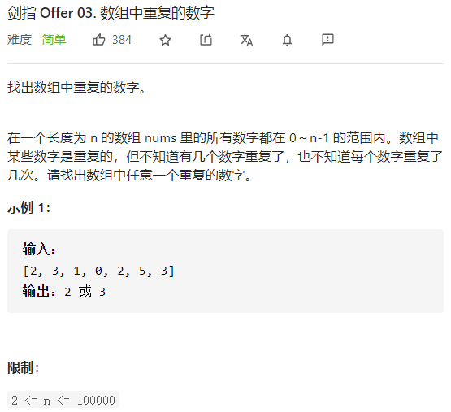

### 原地置换

长度为 n 的数组 nums 里的所有数字都在 0～n-1 的范围内，所以每一个数字都有其应该在的位置，遍历数组将所有的数组归位，若其位置上已经有相同的存在，则找到重复的数字。

**代码**

```java
class Solution {
    public int findRepeatNumber(int[] nums) {
        int temp = 0;
        for (int i = 0; i < nums.length; i ++) {
            while (i != nums[i]) {
                if (nums[i] == nums[nums[i]]) return nums[i];
                temp = nums[i];
                nums[i] = nums[temp];
                nums[temp] = temp;
            }
        }
        return -1;
    }
}
```

### HashSet辅助

利用 HashSet 的特性求解，代码略。

## 04. 二维数组中的查找

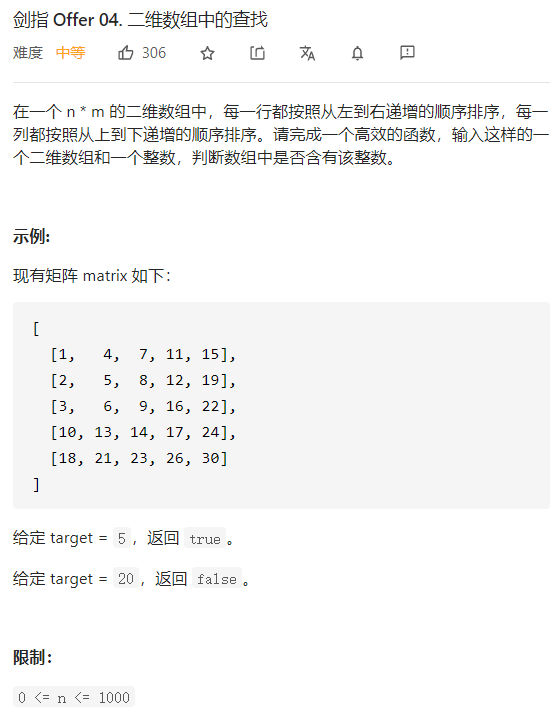

### 削行去列法

每一行最左边的数为该行最小值；每一列最下边的数为该行最大值。

从左下角位置的数开始与 target 进行比较：

1. 若大于 target，则 target 不可能在该行， i --
2. 若小于 target，则 target 不可能在该列， j ++
3. 若等于，则找到，返回 true
4. 若所有行列都被消去，则返回 false

**代码**

```java
class Solution {
    public boolean findNumberIn2DArray(int[][] matrix, int target) {
        int i = matrix.length - 1, j = 0;
        while (i >= 0 && j < matrix[0].length) {
            if (matrix[i][j] == target) return true;
            if (matrix[i][j] > target) i --;
            else j ++;
        }
        return false;
    }
}
```

## 05. 替换空格

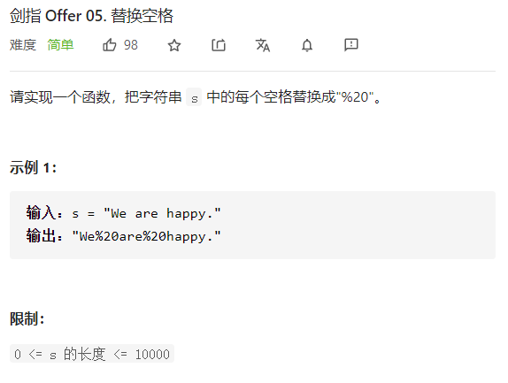

### StringBuilder

s.toCharArray()：字符串转换为字符数组

builder.append()：添加元素

builder.toString()：转换为字符串

**代码**

```java
class Solution {
    public String replaceSpace(String s) {
        StringBuilder builder = new StringBuilder();
        for (int i = 0; i < s.length(); i ++) {
            if (s.charAt(i) == ' ') builder.append("%20");
            else builder.append(s.charAt(i));
        }
        return builder.toString();
    }
}
```

## 06. 从尾到头打印链表

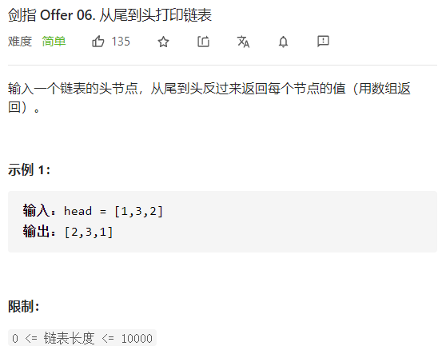

### 递归

直接看代码

**代码**

```java
/**
 * Definition for singly-linked list.
 * public class ListNode {
 *     int val;
 *     ListNode next;
 *     ListNode(int x) { val = x; }
 * }
 */
class Solution {
    List<Integer> list = new ArrayList<>();
    public int[] reversePrint(ListNode head) {
        recur(head);
        int[] res = new int[list.size()];
        for (int i = 0; i < list.size(); i ++) 
            res[i] = list.get(i);
        return res;
    }
    public void recur(ListNode head) {
        if (head == null) return;
        recur(head.next);
        list.add(head.val);
    }
}
```

## 07. 重建二叉树

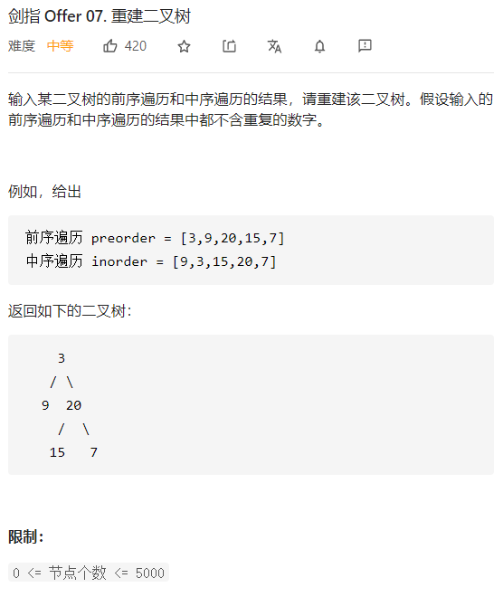

### 递归

首先明确：

* 前序遍历性质： 节点按照 [ 根节点 | 左子树 | 右子树 ] 排序
* 中序遍历性质： 节点按照 [ 左子树 | 根节点 | 右子树 ] 排序
采用分治算法的思想：

1. 首先在前序遍历中找到根节点，并在中序遍历中定位根节点的索引位置
2. 在中序遍历中，根节点将整个树分为左子树和右子树
3. 每一次递归中：    
	* 终止递归条件：left > right
    * 首先创建当前节点，其数值为前序遍历中 root 索引指向的数值
    * 其次获得当前根节点在中序遍历中的索引 i
    * 令其左子树为向左递归的结果，即 recur(root + 1, left, i -1)
    * 令其右子树为向右递归的结果，即 recur(i - left + root + 1, i + 1, right)
	
**代码**

```java
/**
 * Definition for a binary tree node.
 * public class TreeNode {
 *     int val;
 *     TreeNode left;
 *     TreeNode right;
 *     TreeNode(int x) { val = x; }
 * }
 */
class Solution {
    int[] preorder = null;
    Map<Integer, Integer> map = new HashMap<>();
    public TreeNode buildTree(int[] preorder, int[] inorder) {
        this.preorder = preorder;
        for (int i = 0; i < inorder.length; i ++)
            map.put(inorder[i], i);
        return recur(0, 0, preorder.length - 1);
    }
    public TreeNode recur(int root, int left, int right) {
        if (left > right) return null;
        TreeNode node = new TreeNode(preorder[root]);
        int i = map.get(node.val);
        node.left = recur(root + 1, left, i - 1);
        node.right = recur(root + i - left + 1, i + 1, right);
        return node;
    }
}
```

## 09. 用两个栈实现队列


### 辅助栈

维护两个栈作为辅助，利用栈先入后出的特性实现队列

**代码**

```java
class CQueue {

    Stack<Integer> stack1;
    Stack<Integer> stack2;

    public CQueue() {
        stack1 = new Stack();
        stack2 = new Stack();
    }
    
    public void appendTail(int value) {
        stack1.push(value);
    }
    
    public int deleteHead() {
        if (stack1.isEmpty()) return -1;
        while (!stack1.isEmpty()) stack2.push(stack1.pop());
        int res = stack2.pop();
        while (!stack2.isEmpty()) stack1.push(stack2.pop());
        return res;
    }
}

// leetcode 题解
class CQueue {
    LinkedList<Integer> A, B;
    public CQueue() {
        A = new LinkedList<Integer>();
        B = new LinkedList<Integer>();
    }
    public void appendTail(int value) {
        A.addLast(value);
    }
    public int deleteHead() {
        if(!B.isEmpty()) return B.removeLast();
        if(A.isEmpty()) return -1;
        while(!A.isEmpty())
            B.addLast(A.removeLast());
        return B.removeLast();
    }
}
```

## 10-1. 斐波那切数列

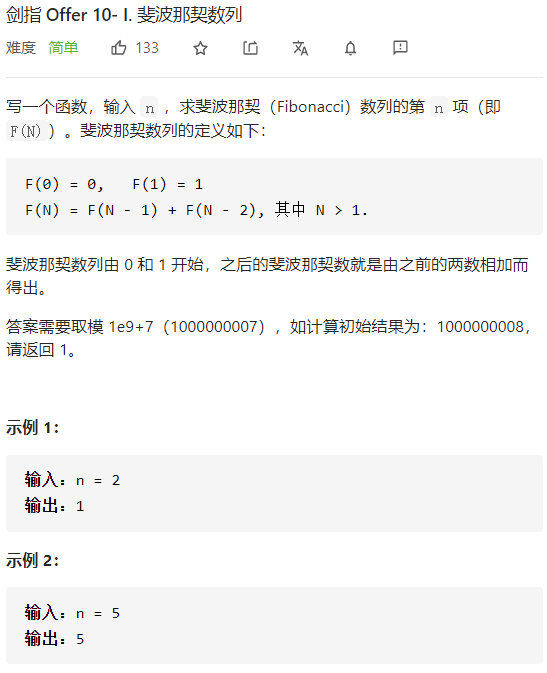

### 动态规划

本题采用普通递归将会超时。

采用动态规划的思想，一步一步推导记录，最终求的需求值。

其中：a 即 dp\[i - 2]，b 即 dp\[i - 1]。因为当前值只与 i - 1 和 i - 2 两个值有关，故省去动态数组的创建，直接使用两个变量记录两个有效值即可。

初始化 a = 0，b = 1，sum = 0（即 dp\[0] = 0, dp\[1] = 1）

每一次计算 sum = (a + b) %1000000007

记录结果 a = b，b = sum，用于下一次计算，省去冗余的重复计算

最终返回 a 即为所求

**代码**

```java
class Solution {
    public int fib(int n) {
        int a = 0, b = 1, res = 0;
        for (int i = 0; i < n; i ++) {
            res = (a + b) % 1000000007;
            a = b;
            b = res;
        }
        return a;
    }
}
```

## 10-2. 青蛙跳台阶问题

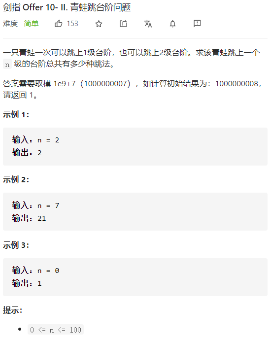

### 动态规划

本题实际上经过分析过后就是斐波那契数列的变形应用，知识初始化的值不同

* 青蛙跳台阶问题： f(0)=1 , f(1)=1 , f(2)=2
* 斐波那契数列问题： f(0)=0 , f(1)=1 , f(2)=1


**代码**

```java
class Solution {
    public int numWays(int n) {
        int a = 1, b = 1, res = 0;
        for (int i = 0; i < n; i ++) {
            res = (a + b) % 1000000007;
            a = b;
            b = res;
        }
        return a;
    }
}
```

## 11. 旋转数组的最小数字

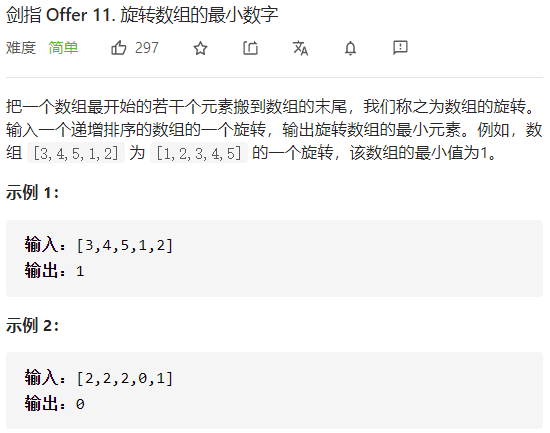

### 单指针遍历

遍历数组，找到旋转点（前一个数值大于后一个数值）即可

注意：存在未旋转的情况

**代码**

```java
class Solution {
    public int minArray(int[] numbers) {
        int index = 1;
        while (index < numbers.length) {
            if (numbers[index] < numbers[index - 1]) return numbers[index];
            index ++;
        }
        return numbers[0];
    }
}
```

## 12. 矩阵中的路径

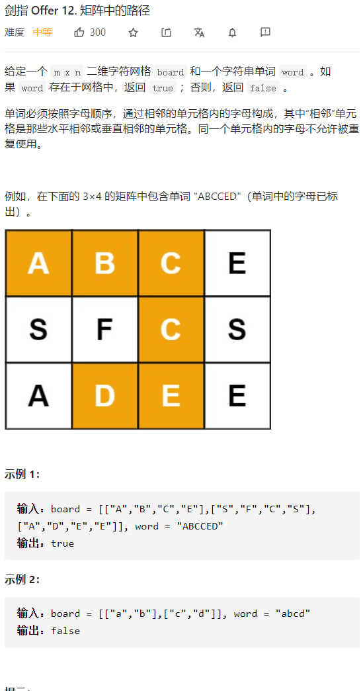

### DFS + 剪枝（去除错误路径）

通过遍历的方式，将矩阵中的每一个字符作为起始点，进行 DFS，产看是否能形成包含给定字符串的路径。

在每一次 DFS 中，需要明确返回 true 和 false 的条件：

* 若 i，j 越界，则返回 false
* 若当前矩阵中的字符与字符串对应位置的字符不相同，返回 false
* 若字符数组的索引 k = words.length - 1，则证明字符串全部匹配完毕，返回 true
* 若当前字符匹配成功，则先将当前字符置为 ‘ ’，证明当前字符已经被使用过，不能再次使用
* 匹配成功后，以当前位置为起始点，继续匹配字符数组中的下一个字符（四个方向递归）
* 在返回结果之前，本次递归已经全部完成，将字符重新恢复，以进行下一次的尝试


**代码**

```java
class Solution {
    public boolean exist(char[][] board, String word) {
        char[] words = word.toCharArray();
        for (int i = 0; i < board.length; i ++) {
            for (int j = 0; j < board[0].length; j ++) {
                if (dfs(board, words, i, j, 0)) return true;
            }
        }
        return false;
    }
    public boolean dfs(char[][] board, char[] words, int i, int j, int k) {
        if (i < 0 || i >= board.length || j < 0 || j >= board[0].length) return false;
        if (words[k] != board[i][j]) return false;
        if (k == words.length - 1) return true;
        board[i][j] = ' ';
        boolean res = dfs(board, words, i + 1, j, k + 1) || dfs(board, words, i - 1, j, k + 1) ||
                      dfs(board, words, i, j + 1, k + 1) || dfs(board, words, i, j - 1, k + 1);
        board[i][j] = words[k];
        return res;
    }
}
```

## 13. 机器人的运动范围


### DFS + 路径记录数组

从（0，0）开始，机器人每一次只能移动 1 格。让其尝试在整个 m ✖ n 的棋盘上走动

* 首先判断下一个格子能否站立，若可以，则向前；否则，则继续判断其他方向的格子能否站立；
* 当机器人站立在某个点，则在路径数组中将该点置为 1，表示该格子已经被计算过；
* 若当前站立的点的所有方向都无法前进，则退回前一个格子，重新查找其他可以前进的方向；
* 每找到一个可以站立的格子，则将计数 res 加一。

**代码**

```java
class Solution {
    int[][] path = null;
    int res = 0;
    public int movingCount(int m, int n, int k) {
        path = new int[m][n];
        dfs(0, 0, k);
        return res;
    }
    public void dfs(int i, int j, int k) {
        if (i < 0 || i >= path.length || j < 0 || j >= path[0].length) return;
        if (path[i][j] == 1) return;
        int limit = (i / 10) + (i % 10) + (j / 10) + (j % 10);
        if (limit > k) return;
        path[i][j] = 1;
        res ++;
        dfs(i + 1, j, k);
        dfs(i - 1, j, k);
        dfs(i, j + 1, k);
        dfs(i, j - 1, k);
    }
}
```

## 14-1. 剪绳子

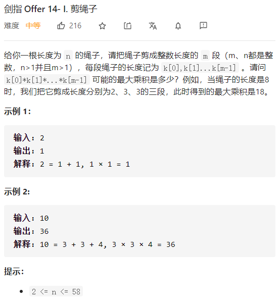

### 动态规划

采用动态规划的思想，构建一个动态规划数组 dp

* 初始状态：dp[2] = 1
* 转移方程：i 从 3 开始一直计算到所需要的 n，在每个值的计算过程中，遍历 j 的所有取值（ j 为剪的第一段绳子的长度）。此时有两种情况：    
	* 剩余的 i - j 长度的绳子不再剪切，此时乘积为 j * (i - j);
    * 剩余的 i - j 长度的绳子继续剪切，此时乘积为 j * dp\[i - j];
* 每一次计算完成后，更新当前 dp[i] 的值，遍历所有 j 的情况求得当前 dp[i] 的最大值。
* 最终返回 dp[n]


**代码**

```java
class Solution {
    public int cuttingRope(int n) {
        int[] dp = new int[n + 1];
        dp[2] = 1;
        for (int i = 3; i < n + 1; i ++) {
            for (int j = 2; j < i; j ++) {
                int temp = Math.max(j * (i - j), j * dp[i - j]);
                dp[i] = Math.max(dp[i], temp);
            }
        }
        return dp[n];
    }
}
```

## 14-2. 剪绳子Ⅱ

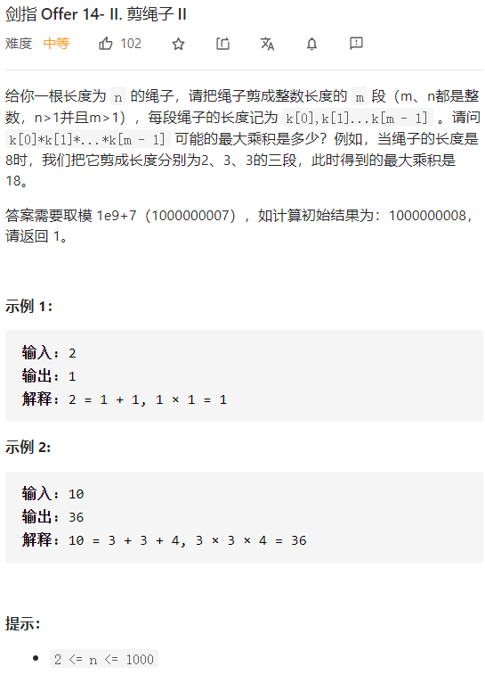

### 大数求余--循环取余

两个数学推论：

1. 将绳子以相等的长度等分为多段，乘积最大
2. 尽可能的将绳子以长度 3 等分为多段时，乘积最大

算法流程：

* 当 n ≤ 3 时，按照规则应不切分，但由于题目要求必须剪成 m > 1 段，因此必须剪出一段长度为 1 的绳子，即返回 n - 1
* 当 n > 3 时，求 n 除以 3 的 整数部分 a 和 余数部分 b （即 n = 3a + b），并分为以下三种情况：    
	* 当 b = 0 时，直接返回 3 ^ a % 1000000007;
    * 当 b = 1 时，要将一个 1 + 3 转换为 2 + 2，因此返回 (3 ^ (a - 1) * 4) % 1000000007;
    * 当 b = 2 时，返回 (3 ^ a * 2) % 1000000007;
	
为确保数值不越界，在每一次幂运算之后都进行一次求余操作，详见代码

**代码**

```java
class Solution {
    public int cuttingRope(int n) {
        if (n <= 3) return n - 1;
        int b = n % 3, lineNums = n / 3, p = 1000000007;
        long res = 1;
        // 计算前 lineNums - 1 个 3 乘积，最后一个 3 需要视余数 b 的情况而定
        for (int i = 0; i < lineNums - 1; i ++) 
            res = res * 3 % p; // 每一次幂运算都求余保证数值不越界
        if (b == 0) return (int)(res * 3 % p); // b = 0，则最后一个 3 直接乘再取余
        if (b == 1) return (int)(res * 4 % p); // b = 1，则将最后的 3 + 1 拆解为 2 * 2，相乘取余
        return (int)(res * 6 % p); // b = 2，则将最后的 2 * 3 乘上取余
    }
}
```

## 15. 二进制中1的个数

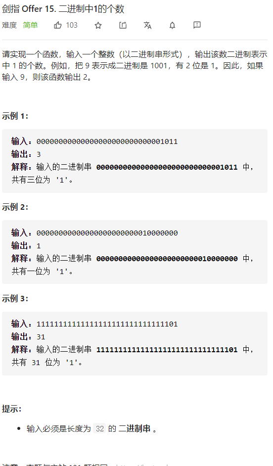

### 采用“消1法”（n & (n - 1)）

对于二进制数来说，每进行一次 n & (n - 1)，则可以消去其二进制数中的一个“1”

根据这个特点，有代码：

**代码**

```java
public class Solution {
    // you need to treat n as an unsigned value
    public int hammingWeight(int n) {
        int res = 0;
        while (n != 0) {
            res ++;
            n &= (n - 1);
        }
        return res;
    }
}
```

## 16. 数值的整数次方

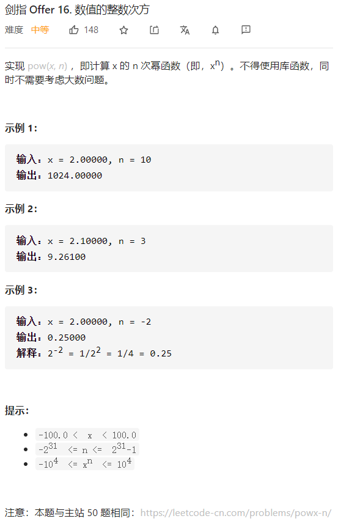

### 快速幂解析（二分法思想）

1. 当 x = 0 时：直接返回 0 。
2. 初始化 res = 1 ；
3. 当 n < 0 时：把问题转化至 n ≥ 0 的范围内，即执行 x = 1/x ，n = - n；
4. 循环计算：当 n = 0 时跳出；    
	* 当 n & 1 = 1 时：将当前 x 乘入 res；
    * 执行 x = x^2;
    * 执行 n 右移一位
5. 返回 res 。


**代码**

```java
class Solution {
    public double myPow(double x, int n) {
        double res = 1;
        long b = n;
        if (b < 0) {
            x = 1 / x;
            b = -b;
        }
        while (b > 0) {
            if ((b & 1) == 1) res *= x;
            x *= x;
            b >>= 1;
        }
        return res;
    }
}
```

## 17. 打印从1到最大的n位数

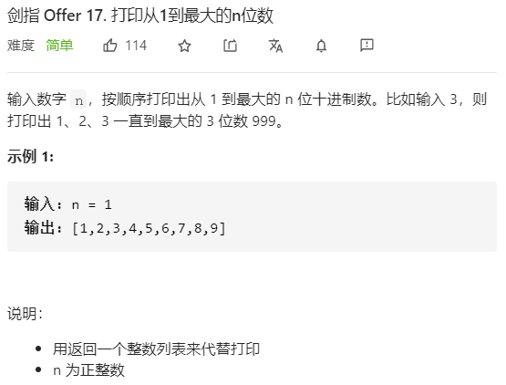

### 普通思路

按题目要求按部就班的执行程序

**代码**

```java
class Solution {
    public int[] printNumbers(int n) {
        int end = (int)Math.pow(10, n) - 1;
        int[] res = new int[end];
        for(int i = 0; i < end; i++)
            res[i] = i + 1;
        return res;
    }
}
```

## 18. 删除链表的节点

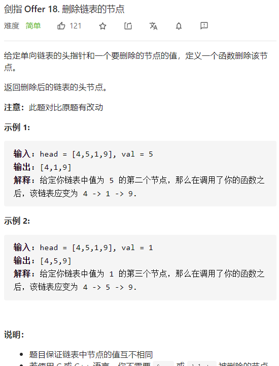

### 遍历查找并删除

遍历链表，定位带要删除节点的前一个节点，执行 cur.next = cur.next.next 即可

需要注意删除头结点的特殊情况

**代码**

```java
/**
 * Definition for singly-linked list.
 * public class ListNode {
 *     int val;
 *     ListNode next;
 *     ListNode(int x) { val = x; }
 * }
 */
class Solution {
    public ListNode deleteNode(ListNode head, int val) {
        if (head.val == val) return head.next;
        ListNode cur = head;
        while (cur != null && cur.next != null) {
            if (cur.next.val == val) {
                cur.next = cur.next.next;
                break;
            } 
            cur = cur.next;
        }
        return head;
    }
}
```

## 21. 调整数组顺序是奇数位于偶数前面

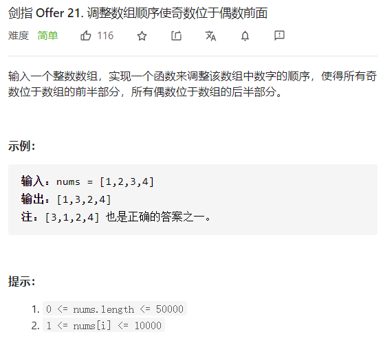

### 双指针法

定义头指针 left，尾指针 right，当头指针小于尾指针时，进入循环体

循环体中，由左指针向右查找第一个偶数；由右指针向左查找第一个奇数。

在这个过程中，需要注意指针不要越界（因为存在全奇全偶的情况）

当两个指针分别定为到目标后，在此比较此时的左右指针是否满足 left < right

* 如果满足，则交换两个目标，并进入下一次循环，继续查找
* 若不满足，说明此时已经完成奇数全部在偶数之前，则不会进入下一次循环


**代码**

```java
class Solution {
    public int[] exchange(int[] nums) {
        int left = 0, right = nums.length - 1;
        int temp = 0;
        while (left < right) {
            while (left < nums.length && nums[left] % 2 == 1) left ++;
            while (right > 0 && nums[right] % 2 == 0) right --;
            if (left < right) {
                temp = nums[left];
                nums[left] = nums[right];
                nums[right] = temp;
            }
        }
        return nums;
    }
}
```

## 22. 链表中倒数第 k 个节点

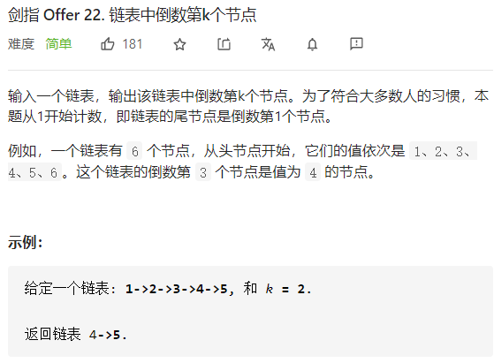

### 正序遍历查找

该方法的基本思路是定义两个指针：一个指针指向当前的节点，另一个指针指向 k 次 next 之后的节点

因为存在这样一个规律，倒数第 k 个节点，其 k 次 next 后的节点即为 null

若 temp 指针指向了 null，则说明当前节点 cur 即为倒数第 k 个节点

while 遍历链表查找即可

**代码**

```java
/**
 * Definition for singly-linked list.
 * public class ListNode {
 *     int val;
 *     ListNode next;
 *     ListNode(int x) { val = x; }
 * }
 */
class Solution {
    public ListNode getKthFromEnd(ListNode head, int k) {
        ListNode cur = head;
        while (cur != null) {
            ListNode temp = cur;
            for (int i = 0; i < k; i ++) 
                temp = temp.next;
            if (temp == null) break;
            cur = cur.next;
        }
        return cur;
    }
}
```

## 24. 反转链表

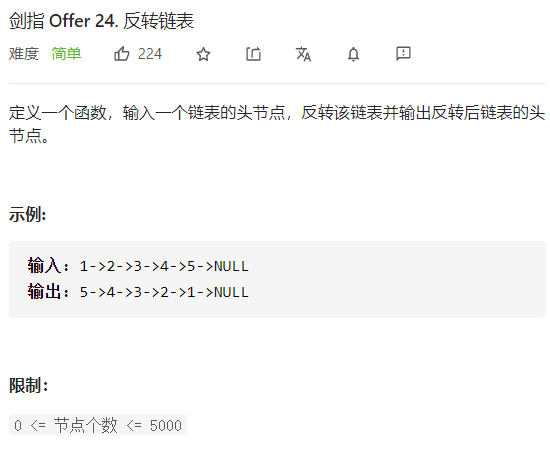

### 递归

1. return 条件：如果当前节点为 null 或者当前节点的 next 为 null，返回当前节点作为新头节点
2. 一直递归直到找到头节点
3. 每次递归方法中，将当前节点的 next 节点的 next 指向当前节点，当前节点的 next 指向 null，实现反转
4. 返回最终的头节点

**代码**

```java
/**
 * Definition for singly-linked list.
 * public class ListNode {
 *     int val;
 *     ListNode next;
 *     ListNode(int x) { val = x; }
 * }
 */
class Solution {
    public ListNode reverseList(ListNode head) {
        if (head == null || head.next == null) return head;
        ListNode newHead = reverseList(head.next);
        head.next.next = head;
        head.next = null;
        return newHead;
    }
}
```

### 双指针

定义两个指针：pre 指向当前节点的前一个节点，cur 指向当前节点

遍历链表，若当前节点不为 null：

* 记录当前节点的下一个结点 temp = cur.next;
* 将当前节点的 next 指向前一个节点 pre
* pre 指针后移至当前节点
* 当前节点 cur 后移继续遍历

**代码**

```java
/**
 * Definition for singly-linked list.
 * public class ListNode {
 *     int val;
 *     ListNode next;
 *     ListNode(int x) { val = x; }
 * }
 */
class Solution {
    public ListNode reverseList(ListNode head) {
        ListNode pre = null, cur = head;
        while (cur != null) {
            ListNode temp = cur.next;
            cur.next = pre;
            pre = cur;
            cur = temp;
        }
        return pre;
    }
}
```

## 25. 合并两个排序的链表

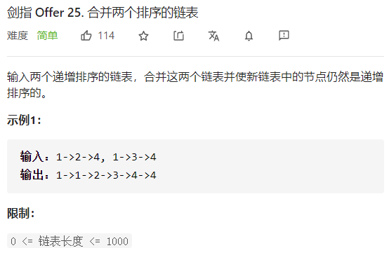

### 递归

1. 递归的终止条件：当两个链表的任意一个链表走完，终止递归
2. 在每一次递归中：比较当前两个节点的 val 的大小，若 l1 小，则当前节点应为 l1，否则当前节点为 l2


**代码**

```java
/**
 * Definition for singly-linked list.
 * public class ListNode {
 *     int val;
 *     ListNode next;
 *     ListNode(int x) { val = x; }
 * }
 */
class Solution {
    public ListNode mergeTwoLists(ListNode l1, ListNode l2) {
        if (l1 == null) return l2;
        if (l2 == null) return l1;
        if (l1.val < l2.val) {
            l1.next = mergeTwoLists(l1.next, l2);
            return l1;
        } else {
            l2.next = mergeTwoLists(l1, l2.next);
            return l2;
        }
    }
}
```

## 26. 树的子结构

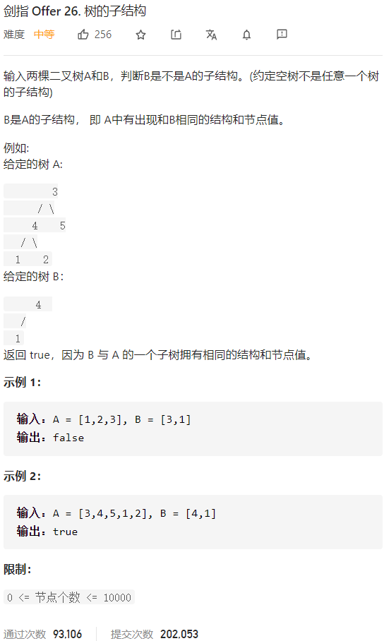

### 递归

总体思路：遍历 A 中每一个的节点当做是根节点，与 B 进行比较

递归终止条件：

* 若 B 节点为 null，则证明匹配成功，返回 true
* 若 B 节点不为null 但 A 节点为 null，则当前节点不匹配，返回 false
* 若 A.val != B.val，节点不匹配，返回 false
* 若 A.val == B.val，则继续判断左右子节点能否匹配

**代码**

```java
/**
 * Definition for a binary tree node.
 * public class TreeNode {
 *     int val;
 *     TreeNode left;
 *     TreeNode right;
 *     TreeNode(int x) { val = x; }
 * }
 */
class Solution {
    public boolean isSubStructure(TreeNode A, TreeNode B) {
        return (A != null && B != null) && (recur(A, B) // 比较当前节点
        || isSubStructure(A.left, B) || isSubStructure(A.right, B)); // 遍历 A 树的所有节点进行比较
    }
    public boolean recur(TreeNode A, TreeNode B) {
        if (B == null) return true;
        if (A == null || A.val != B.val) return false;
        return recur(A.left, B.left) && recur(A.right, B.right);
    }
}
```

## 27. 二叉树的镜像

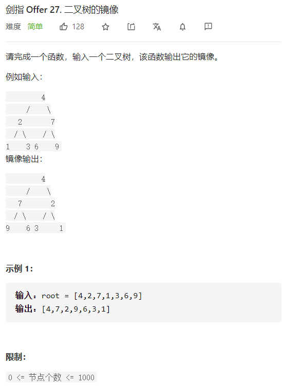

### 递归

递归终止条件：若当前节点为 null，则直接返回；

每一次递归中，将当前节点的左子树与右子树位置交换；

**代码**

```java
/**
 * Definition for a binary tree node.
 * public class TreeNode {
 *     int val;
 *     TreeNode left;
 *     TreeNode right;
 *     TreeNode(int x) { val = x; }
 * }
 */
class Solution {
    public TreeNode mirrorTree(TreeNode root) {
        recur(root);
        return root;
    }
    public void recur(TreeNode root) {
        if (root == null) return;
        recur(root.left);
        recur(root.right);
        TreeNode temp = root.left;
        root.left = root.right;
        root.right = temp;
    }
}
```

## 28. 对称的二叉树

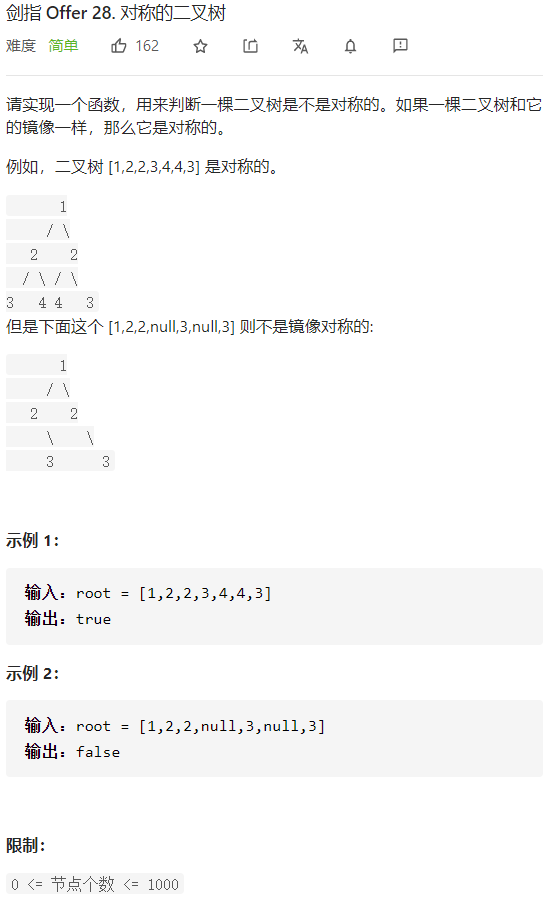

### 递归

基本思路：从左子树和右子树分别出发，判断左子树的左子树是否等于右子树的左子树；左子树的右子树是否等于右子树的左子树。

递归终止条件：

* 如果当前比较的两个节点均为 null，则返回 true
* 如果有一个为 null 或者 val 值不同，则返回 false
* 递归比较 t1 节点的左子树与 t2 节点的右子树 与 t1 节点的右子树与 t2 节点的左子树，返回最终判断结果


**代码**

```java
/**
 * Definition for a binary tree node.
 * public class TreeNode {
 *     int val;
 *     TreeNode left;
 *     TreeNode right;
 *     TreeNode(int x) { val = x; }
 * }
 */
class Solution {
    public boolean isSymmetric(TreeNode root) {
        if (root == null) return true;
        return recur(root.left, root.right);
    }
    public boolean recur(TreeNode t1, TreeNode t2) {
        if (t1 == null && t2 == null) return true;
        if (t1 == null || t2 == null || t1.val != t2.val) return false;
        return recur(t1.left, t2.right) && recur(t1.right, t2.left);
    }
}
```

## 29. 顺时针打印矩阵


### 划分边界，依次打印

设置左边界 l，右边界 r，上边界 t， 下边界 b

根据情况调整边界，依次打印输出。

**代码**

```java
class Solution {
    public int[] spiralOrder(int[][] matrix) {
        if(matrix.length == 0) return new int[0];
        int l = 0, r = matrix[0].length - 1, t = 0, b = matrix.length - 1, x = 0;
        int[] res = new int[(r + 1) * (b + 1)];
        while(true) {
            for(int i = l; i <= r; i++) res[x++] = matrix[t][i]; // left to right.
            if(++t > b) break;
            for(int i = t; i <= b; i++) res[x++] = matrix[i][r]; // top to bottom.
            if(l > --r) break;
            for(int i = r; i >= l; i--) res[x++] = matrix[b][i]; // right to left.
            if(t > --b) break;
            for(int i = b; i >= t; i--) res[x++] = matrix[i][l]; // bottom to top.
            if(++l > r) break;
        }
        return res;
    }
}
```

## 30. 包含min函数的栈

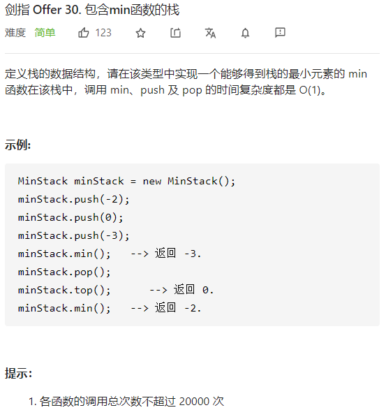

### 辅助栈

* 维护栈 a 负责栈正常的压入弹出
* 维护一个辅助栈 b 来存储最小元素，详见代码

大元素不入 b 栈的理解：后面加进来的数值，如果比 b 栈顶的数值小，就入栈；如果比栈顶的数值大，则直接舍弃。因为其在栈顶元素之后加入，则其一定在最小元素出栈之前出栈，故不需要如 b 栈。

**代码**

```java
class MinStack {
    Stack<Integer> A, B;
    public MinStack() {
        A = new Stack<>();
        B = new Stack<>();
    }
    public void push(int x) {
        A.add(x);
        if(B.empty() || B.peek() >= x) // peek(): 查看但不移除
            B.add(x);
    }
    public void pop() {
        if(A.pop().equals(B.peek()))
            B.pop();
    }
    public int top() {
        return A.peek();
    }
    public int min() {
        return B.peek();
    }
}
```

## 31. 栈的压入、弹出序列

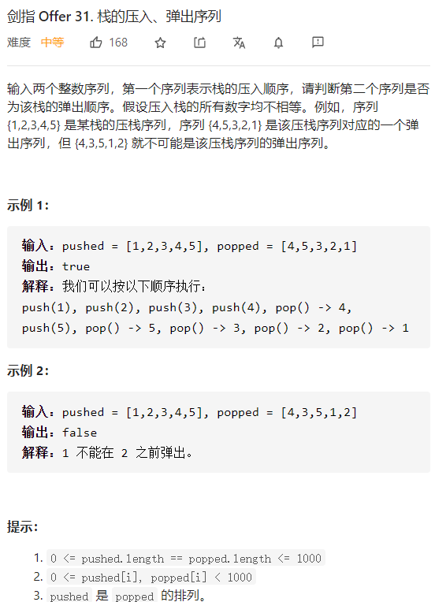

### 使用栈模拟过程

采用一个辅助栈，模拟出入栈的顺序。使用 for 循环将 pushed 数组依次加入栈中，每加入一个元素，就与出栈数组 popped 的对应元素进行比较，如果栈不为空且与当前栈顶元素相同，就弹出栈顶元素，同时指针 index++，继续判断下一个元素。

**代码**

```java
class Solution {
    public boolean validateStackSequences(int[] pushed, int[] popped) {
        Stack<Integer> stack = new Stack<>();
        int index = 0;
        for (int i = 0; i < pushed.length; i ++) {
            stack.push(pushed[i]);
            while (!stack.isEmpty() && stack.peek() == popped[index]) {
                stack.pop();
                index ++;
            }
        }
        return stack.isEmpty();
    }
}
```

## 32-1. 从上到下打印二叉树

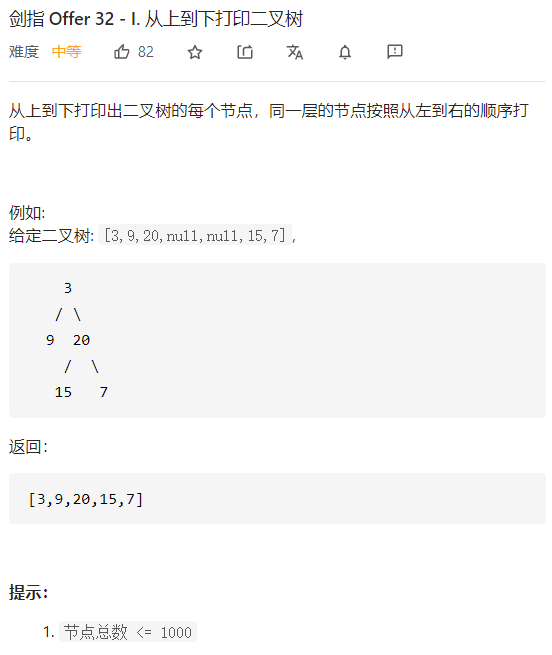

### 广度优先遍历 BFS

一般来说广度优先遍历的实现都会借助一个队列 queue

有关队列的方法：

offer，add 区别：

一些队列有大小限制，因此如果想在一个满的队列中加入一个新项，多出的项就会被拒绝。

这时新的 offer 方法就可以起作用了。它不是对调用 add() 方法抛出一个 unchecked 异常，而只是得到由 offer() 返回的 false。

poll，remove 区别：

remove() 和 poll() 方法都是从队列中删除第一个元素。remove() 的行为与 Collection 接口的版本相似， 但是新的 poll() 方法在用空集合调用时不是抛出异常，只是返回 null。因此新的方法更适合容易出现异常条件的情况。

peek，element区别：

element() 和 peek() 用于在队列的头部查询元素。与 remove() 方法类似，在队列为空时， element() 抛出一个异常，而 peek() 返回 null。

本题借助队列实现 BFS，每次将队列头的节点取出，将其 val 存入动态列表，并尝试将其左右子节点加入队列；当队列为空时结束循环，将动态列表转换为数组返回。

**代码**

```java
/**
 * Definition for a binary tree node.
 * public class TreeNode {
 *     int val;
 *     TreeNode left;
 *     TreeNode right;
 *     TreeNode(int x) { val = x; }
 * }
 */
class Solution {
    public int[] levelOrder(TreeNode root) {
        Queue<TreeNode> queue = new LinkedList<>();
        List<Integer> list = new ArrayList<>();
        if (root != null) queue.offer(root);
        while (!queue.isEmpty()) {
            TreeNode node = queue.poll();
            list.add(node.val);
            if (node.left != null) queue.offer(node.left);
            if (node.right != null) queue.offer(node.right);
        }
        int[] res = new int[list.size()];
        for (int i = 0; i < list.size(); i ++) {
            res[i] = list.get(i);
        }
        return res;
    }
}
```

## 32-2. 从上到下打印二叉树Ⅱ

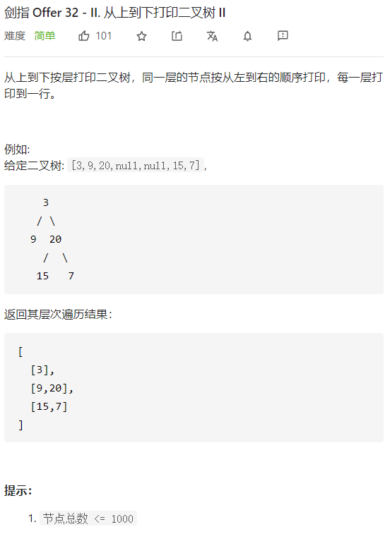

### 广度优先遍历 BFS

借助队列实现 BFS 搜索，与 32 - 1 基本思路一致。

不同的是此处需要分层级打印，所以每一次要记录当前队列的长度，输出对应个数的节点的值即可。

**代码**

```java
/**
 * Definition for a binary tree node.
 * public class TreeNode {
 *     int val;
 *     TreeNode left;
 *     TreeNode right;
 *     TreeNode(int x) { val = x; }
 * }
 */
class Solution {
    public List<List<Integer>> levelOrder(TreeNode root) {
        Queue<TreeNode> queue = new LinkedList<>();
        List<List<Integer>> res = new ArrayList<>();
        if (root != null) queue.add(root);
        while(!queue.isEmpty()) {
            List<Integer> temp = new ArrayList<>();
            int length = queue.size();
            for (int i = 0; i < length; i++) { 
                TreeNode node = queue.poll();
                temp.add(node.val);
                if (node.left != null) queue.add(node.left);
                if (node.right != null) queue.add(node.right);
            }
            res.add(temp);
        }
        return res;
    }
}
```

## 32-3. 从上到下打印二叉树Ⅲ

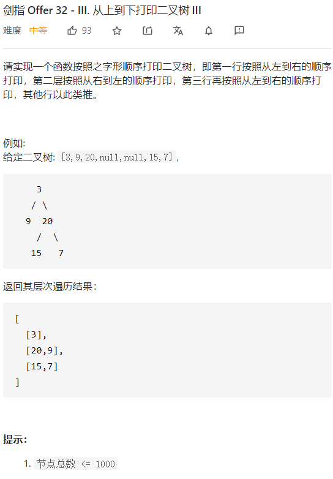

### 广度优先遍历 BFS

依旧是使用队列 queue 来辅助 BFS 遍历

不同的是，在结果集为奇数行时，按照从左向右添加元素，故临时列表 temp 从队列尾(右端)加入；当结果集为偶数行是，按照从从右向左添加元素，故临时列表 temp 从队列头(左端)加入。

**代码**

```java
/**
 * Definition for a binary tree node.
 * public class TreeNode {
 *     int val;
 *     TreeNode left;
 *     TreeNode right;
 *     TreeNode(int x) { val = x; }
 * }
 */
class Solution {
    public List<List<Integer>> levelOrder(TreeNode root) {
        Queue<TreeNode> queue = new LinkedList<>();
        List<List<Integer>> res = new ArrayList<>();
        if (root != null) queue.add(root);
        while(!queue.isEmpty()) {
            LinkedList<Integer> temp = new LinkedList<>();
            int length = queue.size();
            for (int i = 0; i < length; i ++) {
                TreeNode node = queue.poll();
                if (res.size() % 2 == 0) temp.addLast(node.val); // 偶数层 -> 队列头部
                else temp.addFirst(node.val);                    // 奇数层 -> 队列尾部
                if (node.left != null) queue.add(node.left);
                if (node.right != null) queue.add(node.right);
            }
            res.add(temp);
        }
        return res;
    }
}
```

## 33. 二叉搜索树的后序遍历序列

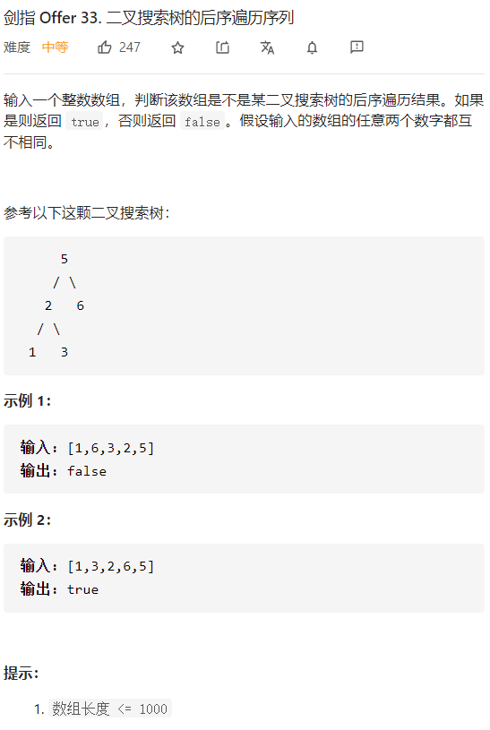

### 递归迭代

首先需要明确**二叉搜索树**和**后序遍历**的概念和特点

根据特点，本题的基本思路为：

首先根据根节点（最右侧），遍历数组找到第一个大于根节点的值，根据该节点的位置将数组划分成左子树和右子树，同时继续向右判断右子树的节点是否全部大于根节点。

若第一次划分没问题，则继续将两个子树按照相同的方法递归，从而求证是否为二叉搜索树的后续遍历序列。

**代码**

```java
class Solution {
    public boolean verifyPostorder(int[] postorder) {
        return recur(postorder, 0, postorder.length - 1);
    }
    public boolean recur(int[] postorder, int i, int j) {
        if (i >= j) return true;
        int x = i;
        while (postorder[x] < postorder[j]) x ++;
        int y = x;
        while (postorder[x] > postorder[j]) x ++;
        return x == j && recur(postorder, i, y - 1) && recur(postorder, y, j - 1);
    }
}
```

## 34. 二叉树中和为某一值的路径

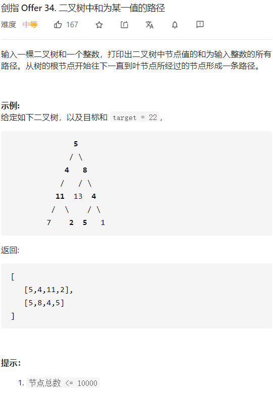

### 递归回溯

递归终止条件：root == null

递归内容：

* 每次递归中，将当前节点的值添加进列表
* 首先深度优先遍历找到最左端叶子结点，开始回溯
* 若当前递归节点的左右子节点均为 null (即叶子结点)，计算列表内数值的总和，若该值等于 target，则将当前列表添加进结果集
* 向右子树递归回溯

缺点：击败双 5% ......

**代码**

```java
/**
 * Definition for a binary tree node.
 * public class TreeNode {
 *     int val;
 *     TreeNode left;
 *     TreeNode right;
 *     TreeNode() {}
 *     TreeNode(int val) { this.val = val; }
 *     TreeNode(int val, TreeNode left, TreeNode right) {
 *         this.val = val;
 *         this.left = left;
 *         this.right = right;
 *     }
 * }
 */
class Solution {
    List<List<Integer>> res = new ArrayList<>();
    public List<List<Integer>> pathSum(TreeNode root, int target) {
        recur(root, target, new ArrayList<Integer>());
        return res;
    }
    public void recur(TreeNode root, int target, List<Integer> list) {
        if (root == null) return;
        list.add(root.val);
        recur(root.left, target, new ArrayList<Integer>(list));
        if (root.left == null && root.right == null) {
            int sum = 0;
            for (Integer n: list) sum += n;
            if (sum == target) res.add(list);
        }
        recur(root.right, target, new ArrayList<Integer>(list));
    }
}
```

**题解优化代码（高效）**

基本思路差不多，学习代码的优化，详见代码

```java
class Solution {
    LinkedList<List<Integer>> res = new LinkedList<>();
    LinkedList<Integer> path = new LinkedList<>(); 
    public List<List<Integer>> pathSum(TreeNode root, int sum) {
        recur(root, sum);
        return res;
    }
    void recur(TreeNode root, int tar) {
        if(root == null) return;
        path.add(root.val);
        tar -= root.val;
        if(tar == 0 && root.left == null && root.right == null)
            res.add(new LinkedList(path));
        recur(root.left, tar);
        recur(root.right, tar);
        path.removeLast();
    }
}
```

## 35. 复杂链表的复制

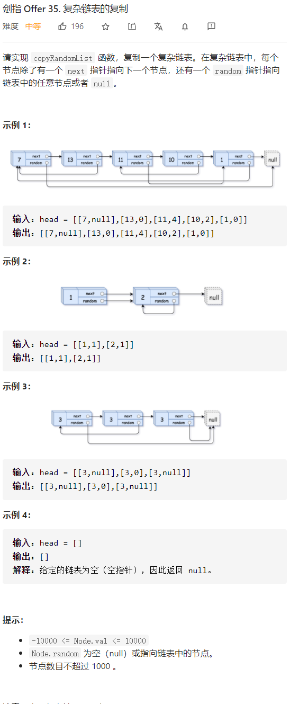

### 辅助哈希表

创建一个哈希表辅助存放旧节点与新节点：旧节点为键，新节点为值

两次遍历完成复杂链表的赋值，详见代码

**代码**

```java
/*
// Definition for a Node.
class Node {
    int val;
    Node next;
    Node random;

    public Node(int val) {
        this.val = val;
        this.next = null;
        this.random = null;
    }
}
*/
class Solution {
    public Node copyRandomList(Node head) {
        Map<Node, Node> map = new HashMap<>();
        Node cur = head;
        while (cur != null) {
            map.put(cur, new Node(cur.val));
            cur = cur.next;
        }
        cur = head;
        while (cur != null) {
            map.get(cur).next = map.get(cur.next);
            map.get(cur).random = map.get(cur.random);
            cur = cur.next;
        }
        return map.get(head);
    }
}
```

## 36. 二叉搜索树与双向链表

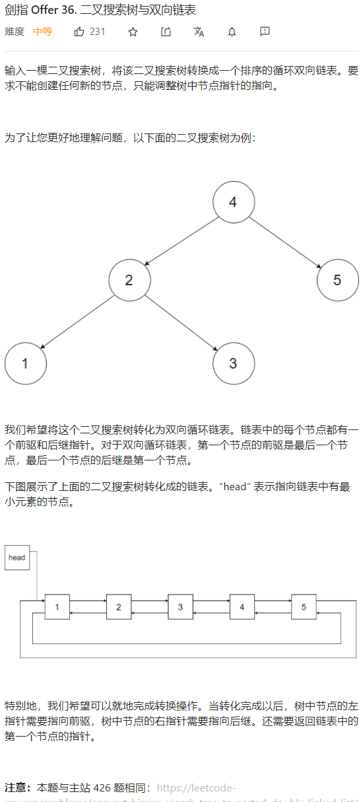

### 中序遍历思想 + dfs

观察不难发现，链表的顺序和树的中序遍历顺序相同，所以采用中序遍历的思想，定义两个节点 head 和 pre分别指示头节点和前驱结点。

在第一次 dfs 遍历时，前驱结点为 null，此时找到最深处的头节点 head，并将 pre 指向当前节点；

在后续的遍历中，每一次遍历都将前驱结点的右指针指向当前节点，当前节点的左指针指向前驱结点，实现双向链表的构建。然后将前驱结点指向当前节点，并向右遍历。

全部完成后，需要将头节点与尾节点相互连接，首尾相连，完成要求。

详见代码

**代码**

```java
/*
// Definition for a Node.
class Node {
    public int val;
    public Node left;
    public Node right;

    public Node() {}

    public Node(int _val) {
        val = _val;
    }

    public Node(int _val,Node _left,Node _right) {
        val = _val;
        left = _left;
        right = _right;
    }
};
*/
class Solution {
    Node pre, head;
    public Node treeToDoublyList(Node root) {
        if (root == null) return head;
        dfs(root);
        head.left = pre;
        pre.right = head;
        return head;
    }
    public void dfs(Node cur) {
        if (cur == null) return;
        dfs(cur.left);
        if (pre == null) head = cur;
        else pre.right = cur;
        cur.left = pre;
        pre = cur;
        dfs(cur.right);
    }
}
```

## 38. 字符串的排列

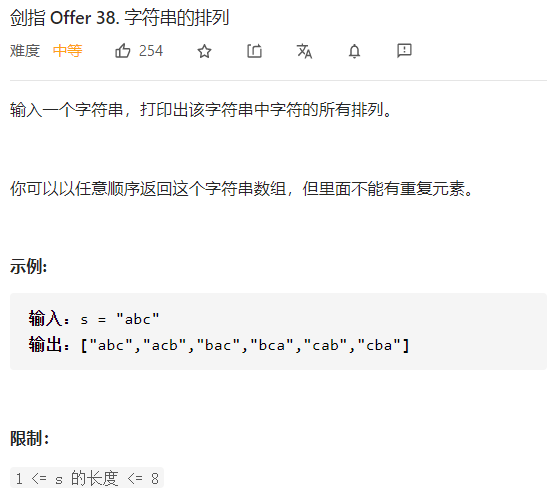

### 回溯 + 剪枝

采用回溯算法，每一次固定一个位置，递归回溯找到所有的情况。

利用 HashSet 完成剪枝去重。

当要固定的位置是最后一位时，记录数据。

参数：

* x -> 要固定位置的索引
* i -> 将哪个位置的数固定到当前 x 的位置

此题需要多看，代码背过！

**代码**

```java
class Solution {
    char[] c = null;
    List<String> list = new ArrayList<>();
    public String[] permutation(String s) {
        c = s.toCharArray();
        dfs(0);
        return list.toArray(new String[list.size()]);
    }
    public void dfs(int x) {
        if (x == c.length - 1) {
            list.add(String.valueOf(c));
            return;
        }
        Set<Character> set = new HashSet<>();
        for (int i = x; i < c.length; i ++) {
            if (set.contains(c[i])) continue;
            set.add(c[i]);
            swap(i, x);
            dfs(x + 1);
            swap(i, x);
        }
    }
    public void swap(int a, int b) {
        char temp = c[a];
        c[a] = c[b];
        c[b] = temp;
    }
}
```

## 39. 数组中出现次数超过一半的数字

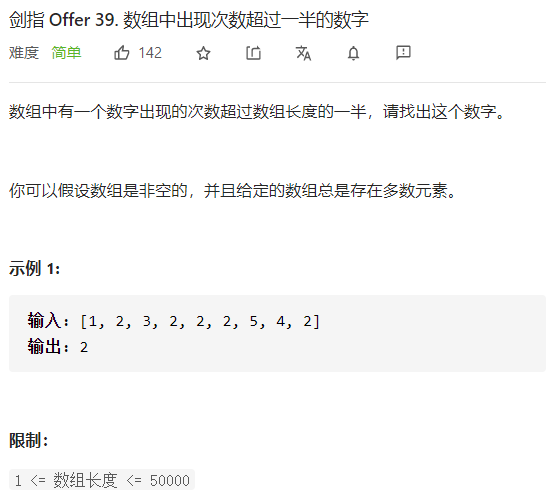

### 摩尔投票法

设置两个变量 x 和 votes，x 用于记录当前的候选者，votes 记录其票数。

遍历数组中的每一个数，若当前 votes == 0，则晋升为新候选者；

继续遍历后续的选票，若相同，则票数 votes + 1；若不同，则 -1；票数减到 0 则败选，x 指向下一票的候选者。

**代码**

```java
class Solution {
    public int majorityElement(int[] nums) {
        int x = 0, votes = 0;
        for (int num: nums) {
            if (votes == 0) x = num;
            votes += num == x ? 1 : -1;
        }
        return x;
    }
}
```

本题可采用的其他思路：

1. HashMap
2. 排序法：排序后的中位数一定为众数！
## 40. 最小的k个数

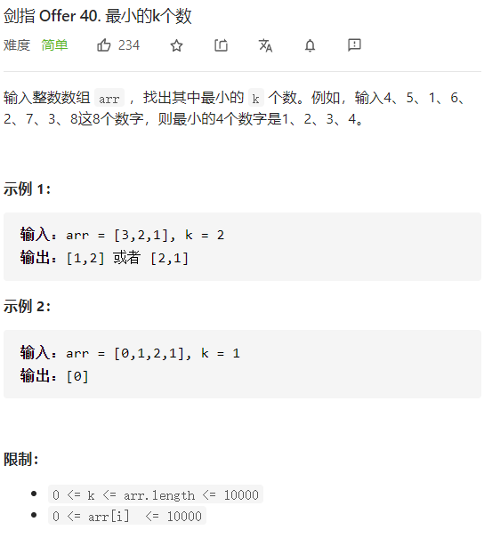

### 快排 quickSort

排序 + 取出前 k 个值

重点：快速排序算法！记住

**代码**

```java
class Solution {
    public int[] getLeastNumbers(int[] arr, int k) {
        quickSort(arr, 0, arr.length - 1);
        int[] res = new int[k];
        for (int i = 0; i < k; i ++) {
            res[i] = arr[i];
        }
        return res;
    }
    public void quickSort(int[] array, int left, int right) {
        int l = left;
        int r = right;
        int midVal = array[(left + right) / 2];
        int temp = 0;
        while (l < r) {
            while(array[l] < midVal) l ++;
            while(array[r] > midVal) r --;
            if (l >= r) break;
            temp = array[l];
            array[l] = array[r];
            array[r] = temp;
            if (array[l] == midVal) r --;
            if (array[r] == midVal) l ++;
        }
        if (l == r) {
            l ++;
            r --;
        }
        if (left < r) quickSort(array, left, r);
        if (l < right) quickSort(array, l, right);
    }
}
```

## 42. 连续子数组的最大和

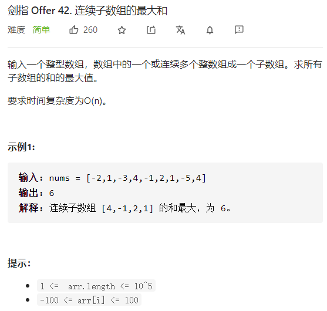

### 动态规划

**动态规划的核心是找到对应的转移方程和初始状态**

转移方程：dp\[i] = Math.max(dp\[i - 1] + nums\[i], nums\[i])

res 记录目前连续数组的最大和

**代码1**

```java
class Solution {
    public int maxSubArray(int[] nums) {
        int[] dp = new int[nums.length];
        dp[0] = nums[0];
        int res = dp[0];
        for (int i = 1; i < nums.length; i ++) {
            dp[i] = Math.max(dp[i - 1] + nums[i], nums[i]);
            res = res > dp[i] ? res : dp[i];
        }
        return res;
    }
}
```

**代码2 (省去dp数组)**

```java
class Solution {
    public int maxSubArray(int[] nums) {
        int temp = nums[0], res = nums[0];
        for (int i = 1; i < nums.length; i ++) {
            temp = Math.max(temp + nums[i], nums[i]);
            res = res > temp ? res : temp;
        }
        return res;
    }
}
```

## 44. 数字序列中某一位的数字

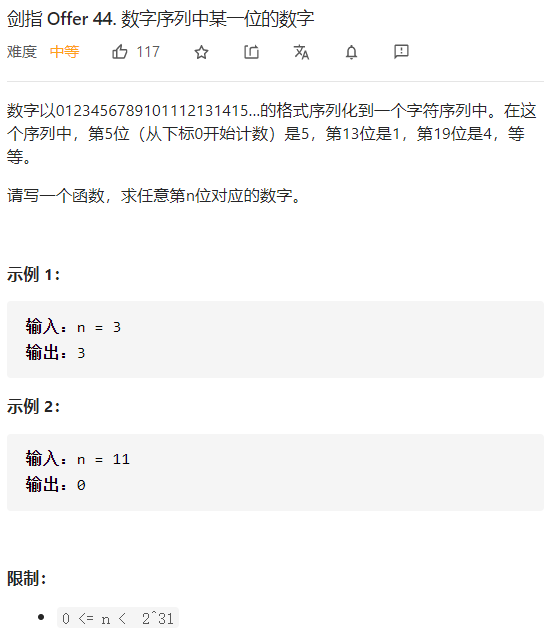

### 数学推导寻找规律

详见题解：[题解](https://leetcode-cn.com/problems/shu-zi-xu-lie-zhong-mou-yi-wei-de-shu-zi-lcof/solution/mian-shi-ti-44-shu-zi-xu-lie-zhong-mou-yi-wei-de-6/)

建议背一下代码！

**代码**

```java
class Solution {
    public int findNthDigit(int n) {
        int digit = 1;
        long start = 1;
        long count = 9;
        while (n > count) { // 1.确定所求数位的所在数字的位数
            n -= count;
            digit += 1;
            start *= 10;
            count = digit * start * 9;
        }
        long num = start + (n - 1) / digit; // 2.确定所求数位所在的数字
        return Long.toString(num).charAt((n - 1) % digit) - '0'; // 3.确定所求数位在 num 的哪一位
    }
}
```

## 45. 把数组排成最小的数


### 自定义字符串比较规则 + 排序算法(快排)

自定义字符串的比较规则：

* 若 x + y > y + x，则规定 x > y
* 若 x + y < y + x，则规定 x < y
* 若 x + y = y + x，则规定 x = y

根据上述规则，借助 compareTo 方法，采用快速排序算法，按照从小到大的顺序进行排序，然后利用 StringBuilder 将字符串数组转化为字符串输出。

**代码**

```java
class Solution {
    public String minNumber(int[] nums) {
        String[] strs = new String[nums.length];
        for (int i = 0; i < nums.length; i ++) {
            strs[i] = String.valueOf(nums[i]);
        }
        quickSort(strs, 0, strs.length - 1);
        StringBuilder res = new StringBuilder();
        for (String s: strs) {
            res.append(s);
        }
        return res.toString();
    }
    public void quickSort(String[] strs, int left, int right) {
        int l = left;
        int r = right;
        String midVal = strs[(left + right) / 2];
        String temp = null;
        while (l < r) {
            while ((strs[l] + midVal).compareTo(midVal + strs[l]) < 0) l ++;
            while ((strs[r] + midVal).compareTo(midVal + strs[r]) > 0) r --;
            if (l >= r) break;
            temp = strs[l];
            strs[l] = strs[r];
            strs[r] = temp;
            if ((strs[l] + midVal).compareTo(midVal + strs[l]) == 0) r -= 1;
            if ((strs[r] + midVal).compareTo(midVal + strs[r]) == 0) l += 1;
        }
        if (l == r) {
            l += 1;
            r -= 1;
        }
        if (left < r) quickSort(strs, left, r);
        if (l < right) quickSort(strs, l, right);
    }
}
```

## 46. 把数组翻译成字符串

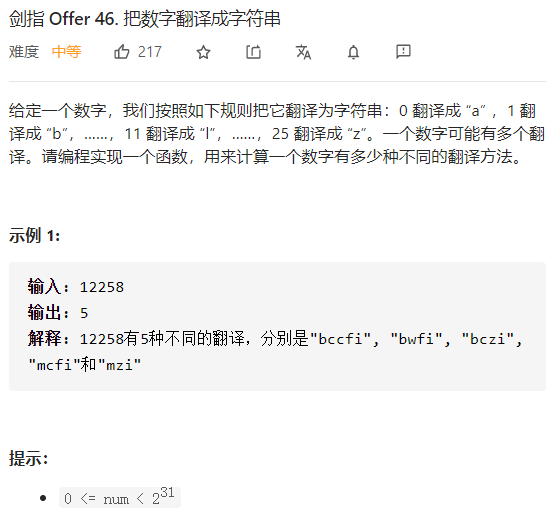

### 动态规划 DP

**动态规划的核心是找到对应的转移方程和初始状态**

**代码1**

```java
class Solution {
    public int translateNum(int num) {
        String s = String.valueOf(num);
        int[] dp = new int[s.length()+1]; // 创建 dp 数组
        dp[0] = 1;
        dp[1] = 1; // 初始化
        for(int i = 2; i <= s.length(); i ++){ // 转移方程
            String temp = s.substring(i-2, i);
            if(temp.compareTo("10") >= 0 && temp.compareTo("25") <= 0)
                dp[i] = dp[i-1] + dp[i-2];
            else
                dp[i] = dp[i-1];
        }
        return dp[s.length()];
    }
}
```

**代码2 (省去dp数组)**

```java
class Solution {
    public int translateNum(int num) {
        String s = String.valueOf(num);
        int a = 1, b = 1;
        for(int i = 2; i <= s.length(); i++) {
            String tmp = s.substring(i - 2, i);
            int c = tmp.compareTo("10") >= 0 && tmp.compareTo("25") <= 0 ? a + b : a;
            b = a;
            a = c;
        }
        return a;
    }
}
```

## 47. 礼物的最大价值

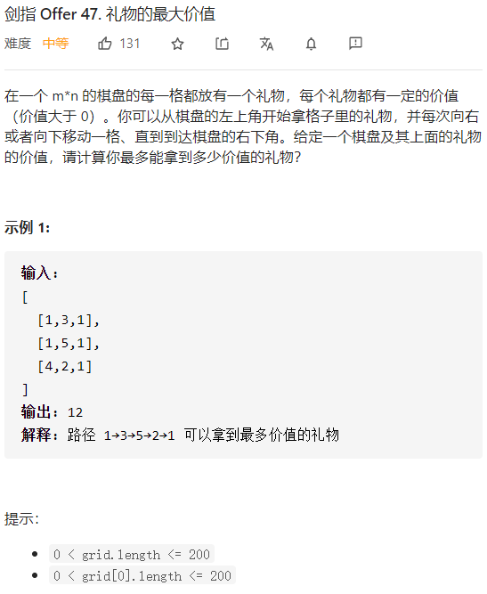

### 动态规划

本题的思路较好理解，采用一个动态规划二维数组，在每一个位置记录能到达该处的最大值，最终输出最右下角的数值即可。详见代码。

**代码**

```java
class Solution {
    public int maxValue(int[][] grid) {
        int[][] dp = new int[grid.length][grid[0].length];
        for (int i = 0; i < grid.length; i ++) {
            for (int j = 0; j < grid[0].length; j ++) {
                if (i == 0 && j == 0) dp[i][j] = grid[i][j];
                if (i != 0 && j == 0) dp[i][j] = grid[i][j] + dp[i - 1][j];
                if (i == 0 && j != 0) dp[i][j] = grid[i][j] + dp[i][j - 1];
                if (i != 0 && j != 0) dp[i][j] = grid[i][j] + 
                                      (dp[i - 1][j] > dp[i][j - 1] ? dp[i - 1][j] : dp[i][j - 1]);
            }
        }
        return dp[grid.length - 1][grid[0].length - 1];
    }
}
```

## 48. 最长不包含重复字符的子字符串

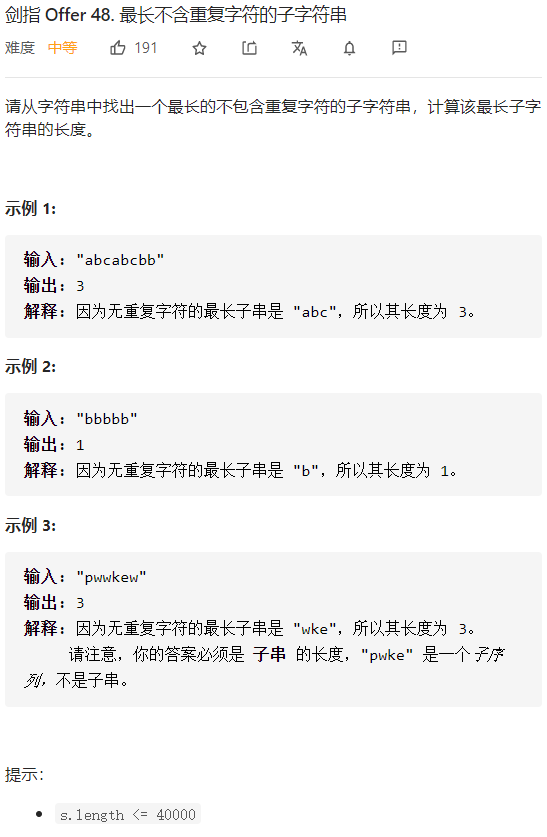

### 动态规划

遍历 + 动态规划，维护一个 dp 数组，采用 HashMap 辅助记录

首先完成初始化条件 `dp[0] = 1;` `map.put(c[0], 0);`

动态规划过程中，若当前字符不存在，则 `dp[i] = dp[i - 1] + 1` 并把新字符加入；

若字符已经存在，则 `dp[i] = Math.min((i - map.get(c[i])), dp[i - 1] + 1)` 并更新已经存在的字符的位置。

该代码逻辑说得通，但是效率不高，可以借鉴别人优秀思想。。

**代码**

```java
class Solution {
    public int lengthOfLongestSubstring(String s) {
        if (s.equals("")) return 0;
        char[] c = s.toCharArray();
        int[] dp = new int[c.length]; // 定义 dp 数组
        dp[0] = 1; // 初始化
        Map<Character, Integer> map = new HashMap<>();
        map.put(c[0], 0);
        for (int i = 1; i < dp.length; i ++) {
            if (!map.containsKey(c[i])) {
                dp[i] = dp[i - 1] + 1; // map 中不包含当前字符的情况
                map.put(c[i], i); // 将当前字符及其位置存入 map
            } else {
                dp[i] = Math.min((i - map.get(c[i])), dp[i - 1] + 1); // map 中包含当前字符的情况
                map.replace(c[i], i); // 更新当前字符的位置
            }
        }
        return Arrays.stream(dp).max().getAsInt(); // 流方法求最大值
    }
}
```

## 49. 丑数

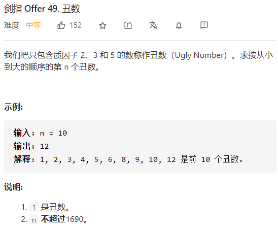

### 动态规划

感觉此题使用动态规划求解，但是转移方程的思路不太清晰，先暂时记住。

**代码**

```java
class Solution {
    public int nthUglyNumber(int n) {
        int[] dp = new int[n];
        dp[0] = 1;
        int a = 0, b = 0, c = 0;
        for (int i = 1; i < n; i ++) {
            int n2 = dp[a] * 2, n3 = dp[b] * 3, n5 = dp[c] * 5;
            dp[i] = Math.min(Math.min(n2, n3), n5);
            if (dp[i] == n2) a++;
            if (dp[i] == n3) b++;
            if (dp[i] == n5) c++;
        }
        return dp[n - 1];
    }
}
```

## 50. 第一个只出现一次的字符

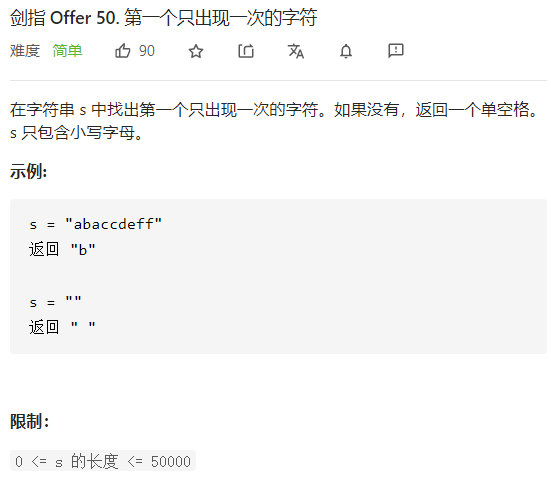

### 哈希表

维护一个哈希表辅助记录数据：

* 如果当前字符不存在于哈希表中，就表明该字符是首次出现，将其添加到哈希表中，键为字符本身，值为true；
* 如果当前字符已经存在于哈希表中，则表明该字符重复出现，将其值重置为 false

最终遍历字符，返回第一个在哈希表中的值为 true 的字符即可。

**代码**

```java
class Solution {
    public char firstUniqChar(String s) {
        Map<Character, Boolean> map = new HashMap<>();
        for (char c: s.toCharArray()) {
            if (!map.containsKey(c)) map.put(c, true);
            else map.replace(c, false);
        }
        for (char c: s.toCharArray()) {
            if (map.get(c)) return c;
        }
        return ' ';
    }
}
```

## 52. 两个链表的第一个公共节点

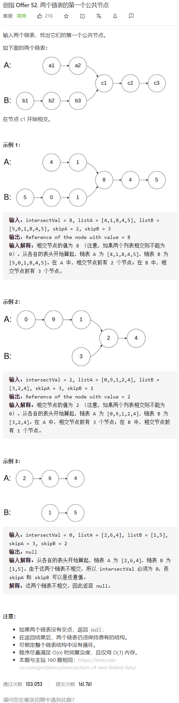

### 双指针

构建两个节点指针 A , B 分别指向两链表头节点 headA , headB ，做如下操作：

* 指针 A 先遍历完链表 headA ，再开始遍历链表 headB ，当走到 node 时，共走步数为：a + (b - c)
* 指针 B 先遍历完链表 headB ，再开始遍历链表 headA ，当走到 node 时，共走步数为：b + (a − c)

此时指针 A , B 重合，并有两种情况：a + (b - c) = b + (a - c)

* 若两链表有公共尾部 (即 c > 0 ) ：指针 A , B 同时指向「第一个公共节点」node 。
* 若两链表无公共尾部 (即 c = 0 ) ：指针 A , B 同时指向 null。


**代码**

```java
/**
 * Definition for singly-linked list.
 * public class ListNode {
 *     int val;
 *     ListNode next;
 *     ListNode(int x) {
 *         val = x;
 *         next = null;
 *     }
 * }
 */
public class Solution {
    public ListNode getIntersectionNode(ListNode headA, ListNode headB) {
        ListNode A = headA, B = headB;
        while (A != B) {
            A = (A == null) ? headB : A.next;
            B = (B == null) ? headA : B.next;
        }
        return A;
    }
}
```

## 53-1 在排序数组中查找数字Ⅰ


### 二分查找 binarySearch

思路：采用二分查找算法，找到对应的数值，然后从对应的索引的左右查找所有的 target

缺点：代码臃肿，内存消耗较大

注意：二分查找算法，记牢，背过！

**代码**

```java
class Solution {
    public int search(int[] nums, int target) {
        int res = 0;
        int index = binarySearch(nums, 0, nums.length - 1, target);
        if (index == -1) return res;
        for (int i = index; i < nums.length; i ++) {
            if (nums[i] == target) res ++;
            else break;
        }
        for (int i = index - 1; i >= 0; i --) {
            if (nums[i] == target) res ++;
            else break;
        }
        return res;
    }
    public int binarySearch(int[] arr, int left, int right, int target) {
        if (left > right) return -1;
        int midIndex = (left + right) >> 1;
        int midValue = arr[midIndex];
        if (target > midValue) return binarySearch(arr, midIndex + 1, right, target);
        else if (target < midValue) return binarySearch(arr, left, midIndex - 1, target);
        else return midIndex;
    }
}
```

## 53-2. 0~n-1中缺失的数字


### 暴力遍历

第二遍的时候看一下别人的好思路

[题解链接](https://leetcode-cn.com/problems/que-shi-de-shu-zi-lcof/solution/mian-shi-ti-53-ii-0n-1zhong-que-shi-de-shu-zi-er-f/)

**代码**

```java
class Solution {
    public int missingNumber(int[] nums) {
        if (nums.length == 0) return 0;
        int index = 0;
        while (index < nums.length && nums[index] == index) index += 1;
        return index;
    }
}
```

## 54. 二叉搜索树的第k大节点

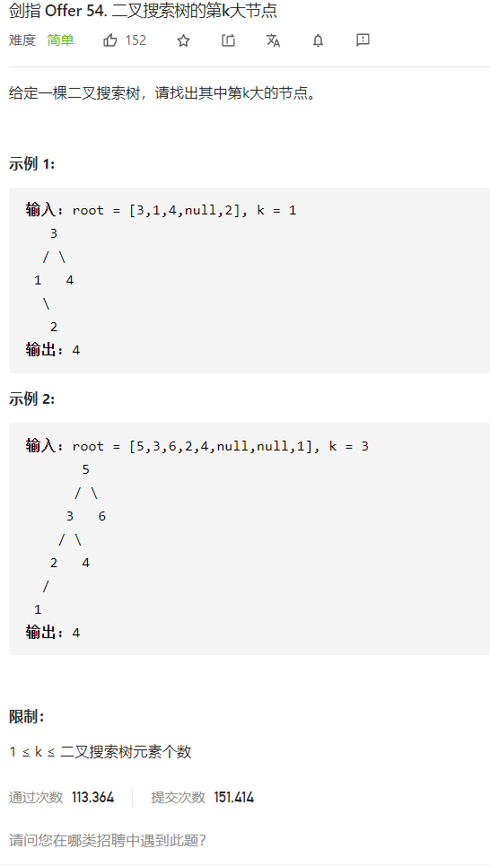

### 反向中序遍历

采用二叉树的中序遍历，结合二叉搜索树的特点，从最右边的节点开始查找。同时维护一个计数器 count，每扫过一个节点，计数器 + 1。当计数器的值与 k 相同时，当前节点即为第 k 大的结点，保存其 val 至 res。

为减少后续的遍历，每次递归中都检测 res 值是否找到，若找到则直接跳过。

**代码**

```java
/**
 * Definition for a binary tree node.
 * public class TreeNode {
 *     int val;
 *     TreeNode left;
 *     TreeNode right;
 *     TreeNode(int x) { val = x; }
 * }
 */
class Solution {
    int count = 0, res = 0;
    public int kthLargest(TreeNode root, int k) {
        dfs(root, k);
        return res;
    }
    public void dfs(TreeNode root, int k) {
        if (root == null) return;
        dfs(root.right, k);
        if (res != 0) return;
        count ++;
        //if (count > k) return;
        if (count == k) res = root.val;
        dfs(root.left, k);
    }
}
```

## 55-1. 二叉树的深度


### 递归

分别递归左右子树，当当前递归节点为 null 时，就返回 0 ，表示该节点处最大深度为 0；若不为 null，则比较左子节点和右子节点的最大深度，取其中的较大值 + 1 表示当前节点的深度。

递归回根节点即得到二叉树的深度。

**代码**

```java
/**
 * Definition for a binary tree node.
 * public class TreeNode {
 *     int val;
 *     TreeNode left;
 *     TreeNode right;
 *     TreeNode(int x) { val = x; }
 * }
 */
class Solution {
    public int maxDepth(TreeNode root) {
        return root == null ? 0 : Math.max(maxDepth(root.left), maxDepth(root.right)) + 1;
    }
}
```

## 55-2 平衡二叉树

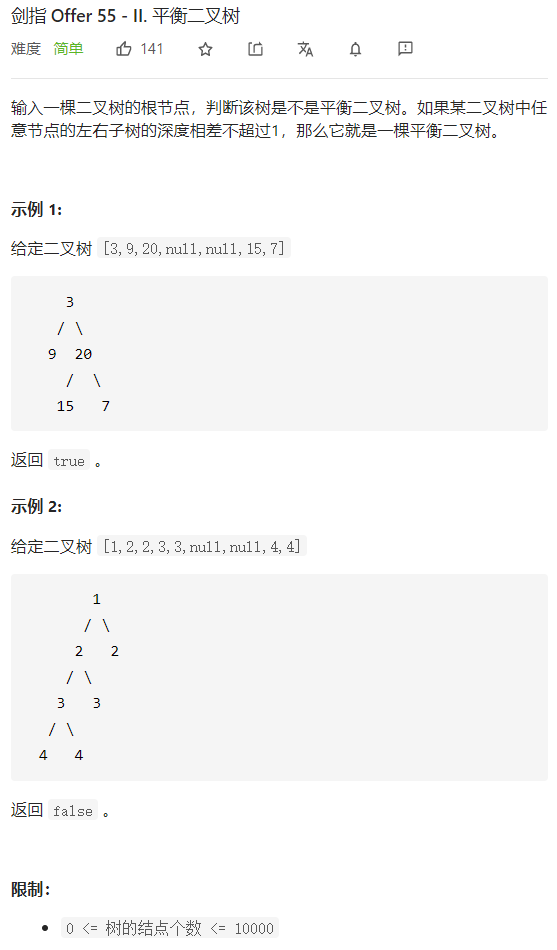

### 递归

利用上一题求深度的思路，判断每一个节点的左右节点深度差，从而判断是否为平衡二叉树。

对于每一个节点：

* 若为 null，则返回 true
* 若不为 null，则判断左右节点的深度差是否大于一，若大于，返回 false，证明以当前节点为根节点的树不是平衡二叉树，故整棵树不是平衡二叉树
* 递归判断每一个节点为根节点的树是否为平衡二叉树，返回 isBalanced(root.left) && isBalanced(root.right)


**代码**

```java
/**
 * Definition for a binary tree node.
 * public class TreeNode {
 *     int val;
 *     TreeNode left;
 *     TreeNode right;
 *     TreeNode(int x) { val = x; }
 * }
 */
class Solution {
    public boolean isBalanced(TreeNode root) {
        if (root == null) return true;
        if (Math.abs(depth(root.left) - depth(root.right)) > 1) return false;
        return isBalanced(root.left) && isBalanced(root.right);
    }
    public int depth(TreeNode root) {
        return root == null ? 0 : Math.max(depth(root.left), depth(root.right)) + 1;
    }
}
```

## 56-1. 数组中数字出现的次数

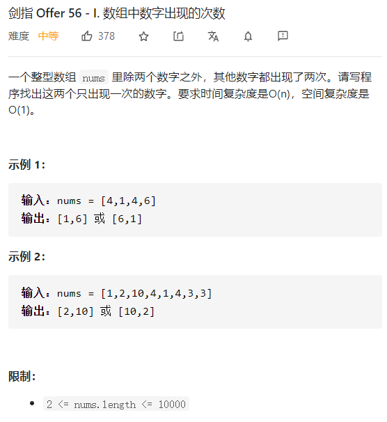

### 位运算

首先明确：

* 异或：相同为 0，不同为 1
* 同或：相同为 1，不同为 0

**代码**

```java
class Solution {
    public int[] singleNumbers(int[] nums) {
        int a = 0, x = 0, y = 0, m = 1;
        for (int num: nums) a ^= num;
        while ((a & m) == 0) m <<= 1; // 找不同的位作为区分位
        for (int num: nums) { // 按照区分为将 nums 分组进行异或运算
            if ((num & m) == 0) x ^= num;
            else y ^= num;
        }
        return new int[]{x, y};
    }
}
```

## 56-2. 数组中数字出现的次数Ⅱ

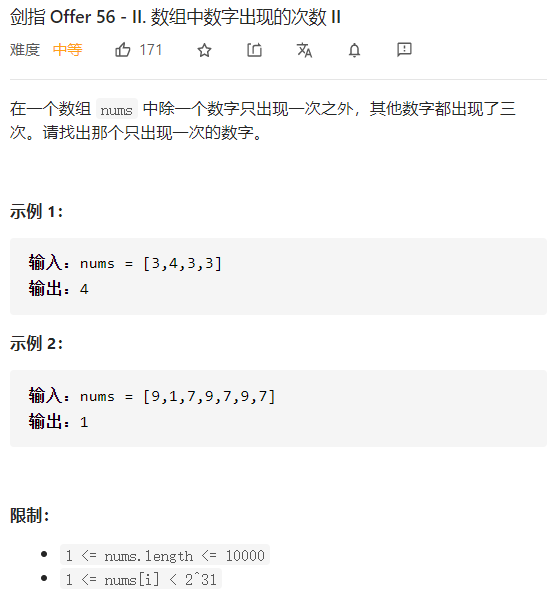

### 位运算

看[题解](https://leetcode-cn.com/problems/shu-zu-zhong-shu-zi-chu-xian-de-ci-shu-ii-lcof/solution/mian-shi-ti-56-ii-shu-zu-zhong-shu-zi-chu-xian-d-4/)

### HashMap + 遍历

**代码**

```java
class Solution {
    public int singleNumber(int[] nums) {
        Map<Integer, Boolean> map = new HashMap<>();
        for (int num: nums) {
            if (!map.containsKey(num)) map.put(num, true);
            else map.replace(num, false);
        }
        for (int num: nums) {
            if (map.get(num)) return num;
        }
        return 0;
    }
}
```

## 57. 和为s的两个数字


### 对撞双指针

利用本题数组为递增的特性，采用对撞双指针可以大幅提升效率。

（第一次思路采用的是遍历双指针，超时！）

定义头尾两个指针，当 x < y 时，遍历判断：

* sum = nums[x] + nums[y]
* 若 sum > target，则说明大的数太大，故 y--
* 若 sum < target，则说明小的数太小，故 x++
* 若 sum == target，则找到目标，返回数组


**代码**

```java
class Solution {
    public int[] twoSum(int[] nums, int target) {
        int x = 0, y = nums.length - 1;
        while (x < y) {
            int sum = nums[x] + nums[y];
            if (sum > target) y --;
            else if (sum < target) x ++;
            else return new int[]{nums[x], nums[y]};
        }
        return new int[0];
    }
}
```

## 57-2. 和为s的连续正数序列

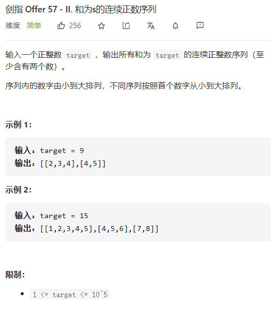

### 滑动窗口（双指针）

本体采用滑动窗口的思想，具体看代码。

（开始想维护一个队列作为滑动窗口，后来发现多此一举，会造成额外的空间占用。因为本题要求的是连续正整数序列，所以用两个指针即可）

**代码**

```java
class Solution {
    public int[][] findContinuousSequence(int target) {
        int x = 1, y = 2, sum = 3;
        List<int[]> res = new ArrayList<>();
        while (x < y) {
            if (sum == target) {
                int[] temp = new int[y - x + 1];
                for (int i = 0; i < temp.length; i ++) temp[i] = i + x;
                res.add(temp);
            }
            if (sum > target) {
                sum -= x;
                x ++;
            } else {
                y ++;
                sum += y;
            }
        }
        return res.toArray(new int[0][]);
    }
}
```

## 58-1. 反转单词顺序

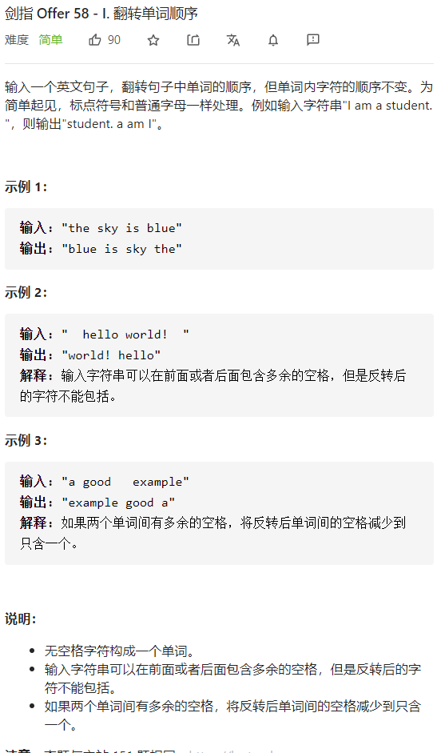

### 双指针

采用双指针的方式，一个指针从后向前搜索，另一个指针记录搜索起始的位置。

1. 首先让 i 遍历向前搜索，直到找到第一个空格；
2. 将 i + 1 到 j + 1 范围内的数据加入 StringBuilder；
3. 指针 i 继续向前搜索，跨越所有的空格，找到下一个不为空格的字符，将指针 j 指向这个位置；
4. 重复上述过程

注意涉及字符串的函数：

```
s.length()
s.substring()
s.charAt()
s.trim()
```

**代码**

```java
class Solution {
    public String reverseWords(String s) {
        StringBuilder res = new StringBuilder();
        s.trim();
        int i = s.length() - 1, j = i;
        while (i >= 0) {
            while (i >= 0 && s.charAt(i) != ' ') i --; // 查找第一个空格
            res.append(s.substring(i + 1, j + 1) + " "); // 添加单次
            while (i >= 0 && s.charAt(i) == ' ') i --; // 跳过中间空格
            j = i; // 记录位置
        }
        return res.toString().trim();
    }
}
```

### 正则表达式

思路清晰易懂，效率较低

**代码**

```java
class Solution {
    public String reverseWords(String s) {
        String[] strs = s.trim().split("\\s+");
        StringBuilder build = new StringBuilder();
        for (int i = strs.length - 1; i >= 0; i --) build.append(strs[i] + " ");
        return build.toString().trim();
    }
}
```

## 58-2. 左旋转字符串

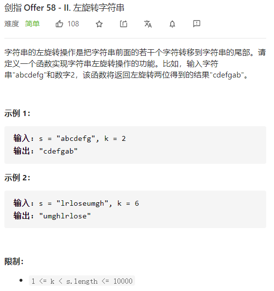

### 字符串切片

这是最先想到的思路

主要是字符串函数 substring() 的应用，直接看代码

**代码**

```java
class Solution {
    public String reverseLeftWords(String s, int n) {
        String str = s.substring(0, n);
        s += str;
        return s.substring(n, s.length());
    }
}
```

### 列表遍历拼接

采用遍历字符串的方式，将字符串依次加入 StringBuilder，直接看代码

**代码**

```java
class Solution {
    public String reverseLeftWords(String s, int n) {
        StringBuilder res = new StringBuilder();
        // for (int i = n; i < s.length(); i ++) res.append(s.charAt(i));
        // for (int i = 0; i < n; i ++) res.append(s.charAt(i));
        for (int i = n; i < n + s.length(); i ++) { // 采用取余运算可以简化上述两行代码
            res.append(s.charAt(i % s.length()));
        }
        return res.toString();
    }
}
```

### 字符串遍历拼接

若面试只允许使用 String，则采用字符串拼接的方法，直接看代码

**代码**

```java
class Solution {
    public String reverseLeftWords(String s, int n) {
        String res = "";
				// 下述两行代码同样可以用取余操作简化
        for (int i = n; i < s.length(); i ++) res += s.charAt(i);
        for (int i = 0; i < n; i ++) res += s.charAt(i);
        return res;
    }
}
```

## 59-2. 队列的最大值

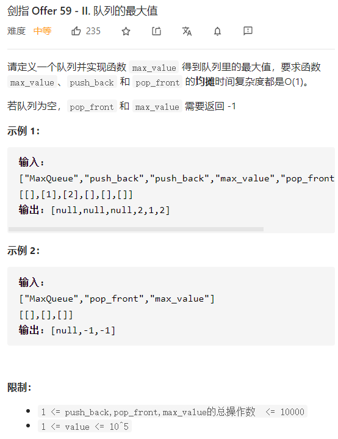

### 单调双向列表

本题采用空间换时间的方式，维护两个队列

* 普通队列 queue 存储元素
* 双向队列 deque 实现单调递减队列实现 O(1) 的最大值查询


各个函数设计：

* 构造器    
	* 初始化普通队列 ququq
    * 初始化双向队列 deque
* 添加元素 push_back()    
	* 将元素入队普通队列 queue：`queue.offer(value)`
    * 将双向队列队尾小于 value 的元素全部出队
    * 将该元素添加到双向队列 deque 的队尾：`deque.offerLast(value)`
* 删除元素 pop_front()    
	* 首先判断，若 queue 为空，则返回 -1
    * 比较 queue 队首元素和 deque 的队首元素是否相同，若相同，则将双向队列队首元素出队：`deque.pollFirst()`
    * 将 queue 队首元素出队：`queue.poll()`
* 查找最大值：    
	* 若维护的双端队列 deque 为空，则返回 -1
    * 否则返回 deque 的队首元素：`deque.peekFirst()`
	
	
此题中应注意队列各个函数的使用方法，包括

```
queue.offer();
ququq.peek();
queue.poll();

deque.offerFirst()/deque.offerLast();
deque.peekFirst()/deque.peekLast();
deque.pollFirst()/deque.pollLast();
```

**代码**

```java
class MaxQueue {

    Queue<Integer> queue;
    Deque<Integer> deque;

    public MaxQueue() {
        queue = new LinkedList<>();
        deque = new LinkedList<>();
    }
    
    public int max_value() {
        return deque.isEmpty() ? -1 : deque.peekFirst();
    }
    
    public void push_back(int value) {
        queue.offer(value);
        while (!deque.isEmpty() && deque.peekLast() < value) {
            deque.pollLast();
        }
        deque.offerLast(value);
    }
    
    public int pop_front() {
        if (queue.isEmpty()) return -1;
        if (queue.peek().equals(deque.peekFirst())) {
            deque.pollFirst();
        }
        return queue.poll();
    }
}

/**
 * Your MaxQueue object will be instantiated and called as such:
 * MaxQueue obj = new MaxQueue();
 * int param_1 = obj.max_value();
 * obj.push_back(value);
 * int param_3 = obj.pop_front();
 */
```

## 60. n个骰子的点数

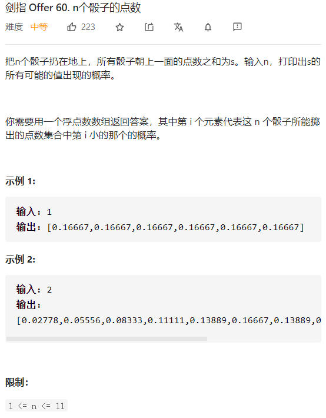

### 动态规划

使用遍历的方法也可以实现，但是时间复杂度无法接受

采用动态规划，过程可以参考题解中的图示。本题中有许多规律总结的东西，可以先背过在解析代码。（规律可以通过 n = 1, n = 2 的情况推导出）

**代码**

```java
class Solution {
    public double[] dicesProbability(int n) {
        double[] dp = new double[6];
        Arrays.fill(dp, 1.0 / 6.0); // 填充数组
        for (int i = 2; i <= n; i ++) {
            double[] temp = new double[i * 5 + 1];
            for (int j = 0; j < dp.length; j ++) {
                for (int k = 0; k < 6; k ++) {
                    temp[k + j] += dp[j] / 6.0;
                }
            }
            dp = temp; // dp 只与 dp - 1 有关，维护两个数组交替使用以节省空间复杂度
        }
        return dp;
    }
}
```

## 61. 扑克牌中的顺子

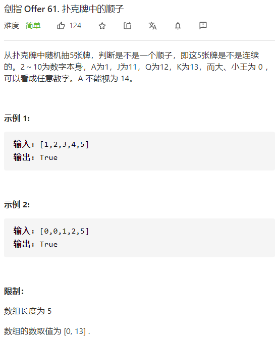

### 遍历 + HashSet

本题的核心思路是：遍历数组，找到最大值与最小值，若 max - min < 5，则可以构成顺子！

遍历过程中：

* 若遇到 0，直接跳过，因为 0 可以代表任何数
* 维护一个 set 用于查重，若有重复的数字（0 除外），则直接返回 false
* 寻找最大数 max 和最小数 min（`Math.max() / Math.min()`）


**代码**

```java
class Solution {
    public boolean isStraight(int[] nums) {
        Set<Integer> set = new HashSet<>();
        int max = 0, min = 14;
        for (int num: nums) {
            if (num == 0) continue;
            if (set.contains(num)) return false;
            set.add(num);
            max = Math.max(max, num);
            min = Math.min(min, num);
        }
        return max - min < 5;
    }
}
```

## 62. 圆圈中最后剩下的数字

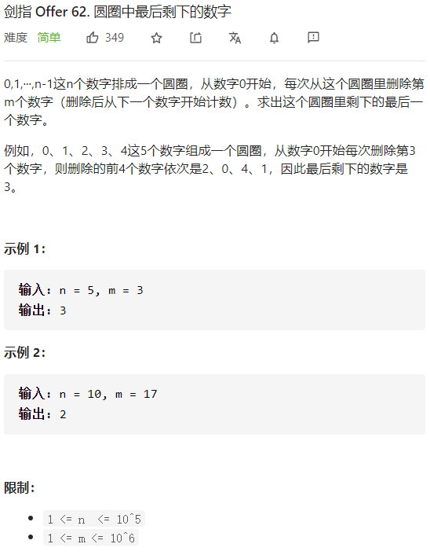

### 约瑟夫环（动态规划）

本题为著名的约瑟夫环问题，可以采用链表模拟删除过程，但是耗费空间巨大。

采用动态规划的方法解决该问题，转移方程：`dp[i] = (dp[i - 1] + m) % i`

按照该转移方程，正向计算便可以解得对应留下的数。按该过程倒着推回去便可以模拟整个删除过程。（具体过程忘了可以参看题解）

因为转移方程只与前一个值有关，故采用一个变量即可模拟。看代码。

**代码**

```java
class Solution {
    public int lastRemaining(int n, int m) {
        int res = 0;
        for (int i = 2; i <= n; i ++) {
            res = (res + m) % i;
        }
        return res;
    }
}
```

## 63. 股票的最大利润

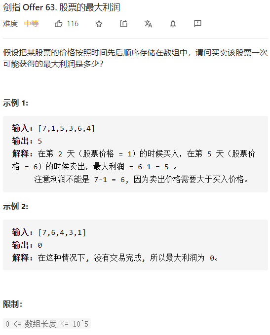

### 双指针

定义两个指针 in 和 out 分别指向买入与卖出的价格，定义利润 profit

遍历整个价格数组，in 首先指向第一天，out 指向第二天

* 若 out 当天的价格低于 in 当天的价格，则选择在当天买入，即将 in 指向 out
* 计算利润为 out 当天价格与 in 当天价格的差与之前利润的最大值中的较大值
* out 指针向后遍历数组，最终返回最大利润 profit

**代码**

```java
class Solution {
    public int maxProfit(int[] prices) {
        int in = 0, out = 1, profit = 0;
        while (out < prices.length) {
            if (prices[out] < prices[in]) in = out;
            profit = Math.max(profit, prices[out] - prices[in]);
            out ++;
        }
        return profit;
    }
}
```

### 动态规划

基本思路与双指针的思路相同，实现方式不同，详见代码

**代码**

```java
class Solution {
    public int maxProfit(int[] prices) {
        int cost = Integer.MAX_VALUE, profit = 0;
        for (int price : prices) {
            cost = Math.min(cost, price);
            profit = Math.max(profit, price - cost);
        }
        return profit;
    }
}
```

## 64. 求 1+2+3+…+ n

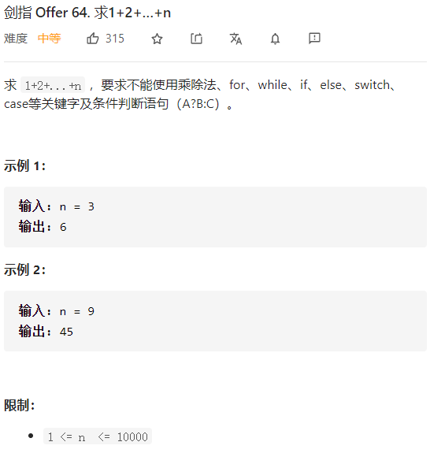

### 逻辑运算符的短路效应

使用**逻辑运算符的短路效应**来代替判断语句，使用递归

* if(A && B) // 若 A 为 false ，则 B 的判断不会执行（即短路），直接判定 A && B 为 false
* if(A || B) // 若 A 为 true ，则 B 的判断不会执行（即短路），直接判定 A || B 为 true

所以可以使用短路效应进行判断，从而进行递归求和，详见代码

**代码**

```java
class Solution {
    int res = 0;
    public int sumNums(int n) {
        boolean judge = n > 1 && sumNums(n - 1) > 0; // 当 n > 1 条件不满足时，程序便直接为 judge 赋值 false，而不会去执行后面的 sumNums(n - 1)
        res += n;
        return res;
    }
}
```

## 65. 不用加减乘除做加法

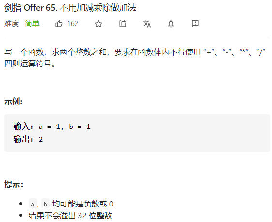

### 位运算——不用加减乘除做加法

记住公式：

* 无进位和 n = a ^ b
* 进位 c = a & b << 1
* 和 s = n + c

故代码如下，分为递归方式和非递归方式

**代码**

```java
// 递归
class Solution {
    public int add(int a, int b) {
        if (b == 0) return a;
        return add(a ^ b, (a & b) << 1);
    }
}

// 非递归
class Solution {
    public int add(int a, int b) {
        while (b != 0) {
            int c = (a & b) << 1;
            a ^= b;
            b = c;
        }
        return a;
    }
}
```

## 66. 构建乘积数组

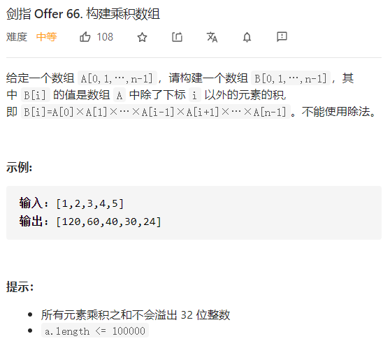

### 表格划分 + 动态规划

想像一个二维数组，以相同数字构成的线将表格划分为两部分，分别为每一部分维护一个数组，记录乘积。（若看不懂时画图分析！）

每一个表格采用动态规划的方法，具体转移方程见代码。

**代码**

```java
class Solution {
    public int[] constructArr(int[] a) {
        int len = a.length;
        if (len == 0) return new int[0];
        int[] left = new int[len];
        int[] right = new int[len];
        int[] res = new int[len];
        left[0] = 1;
        right[len - 1] = 1;
        for (int i = 1; i < len; i ++)
            left[i] = left[i - 1] * a[i - 1];
        for (int i = len - 2; i >= 0; i --) 
            right[i] = right[i + 1] * a[i + 1];
        for (int i = 0; i < len; i ++) 
            res[i] = left[i] * right[i];
        return res;
    }
}
```

**代码（优化）**

上述代码额外的空间占用大，可以按下述代码进行优化，无额外的空间占用

```java
class Solution {
    public int[] constructArr(int[] a) {
        int len = a.length;
        if (len == 0) return new int[0];
        int[] res = new int[len];
        res[0] = 1; // 初始化 res
        int temp = 1;
        for (int i = 1; i < len; i ++)
            res[i] = res[i - 1] * a[i - 1]; // 动态补全 res（此处即生成之前的 left 数组）
        for (int i = len - 2; i >= 0; i --) {
            temp *= a[i + 1]; // 利用变量 temp 代替了之前的数组 right（temp 初始化为1）
            res[i] *= temp; // 直接计算最终结果并保存在 res 中
        }  
        return res;
    }
}
```

## 67. 把字符串转换成整数

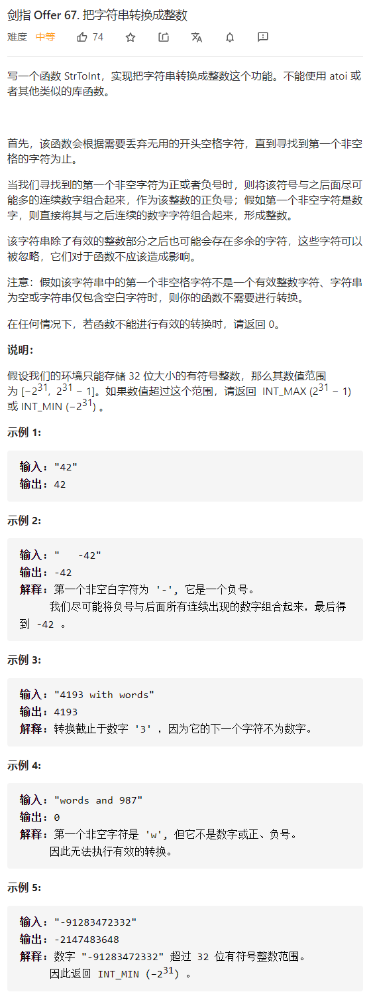

### 按条件遍历

详见代码注释

**代码**

```java
class Solution {
    public int strToInt(String str) {
        char[] c = str.trim().toCharArray(); // 裁剪首尾空格并转换为字符数组
        if (c.length == 0) return 0;
        int res = 0, limit = Integer.MAX_VALUE / 10; // 定义返回结果以及界限值
        int i = 1, sign = 1; // 定义起始指针和符号位标志
        if (c[0] == '-') sign = -1; // 若为负数，符号位置为 -1
        else if (c[0] != '+') i = 0; // 若首位不为'+'，则起始指针应该从 1 开始
        for (int j = i; j < c.length; j ++) { // 遍历
            if (c[j] < '0' || c[j] > '9') break; // 当不再是数字时，结束遍历
            if (res > limit || res == limit && c[j] > '7')  // 越界处理
                return sign == 1 ? Integer.MAX_VALUE : Integer.MIN_VALUE;
            res = res * 10 + (c[j] - '0'); // 每次保存结果
        }
        return sign * res; // 返回结果
    }
}
```

## 68-1. 二叉搜索树的最近公共祖先

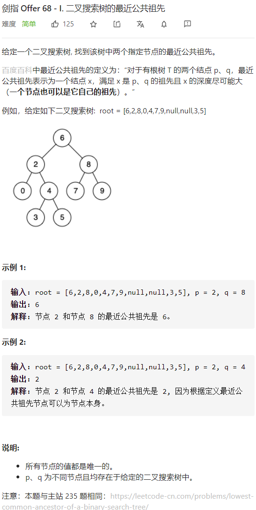

### 递归

采用递归的方式搜索二叉搜索树，利用二叉搜索树的性质，在每一次递归中：

* 若当前 root 节点的值大于 p, q 节点，则证明 p, q 均存在于其左子树中，故向其左子树递归搜索
* 若当前 root 节点的值小于 p, q 节点，则证明 p, q 均存在于其右子树中，故向其右子树递归搜索
* 若不满足上述两个条件，说明 p, q 两个节点存在于当前节点 root 的两侧，即当前节点就是 p, q 节点的最近公共节点，返回 root 即可


**代码**

```java
/**
 * Definition for a binary tree node.
 * public class TreeNode {
 *     int val;
 *     TreeNode left;
 *     TreeNode right;
 *     TreeNode(int x) { val = x; }
 * }
 */
class Solution {
    public TreeNode lowestCommonAncestor(TreeNode root, TreeNode p, TreeNode q) {
        if (root.val > p.val && root.val > q.val) 
            return lowestCommonAncestor(root.left, p, q);
        if (root.val < p.val && root.val < q.val)
            return lowestCommonAncestor(root.right, p, q);
        return root;
    }
}
```

## 68-2. 二叉树的最近公共祖先

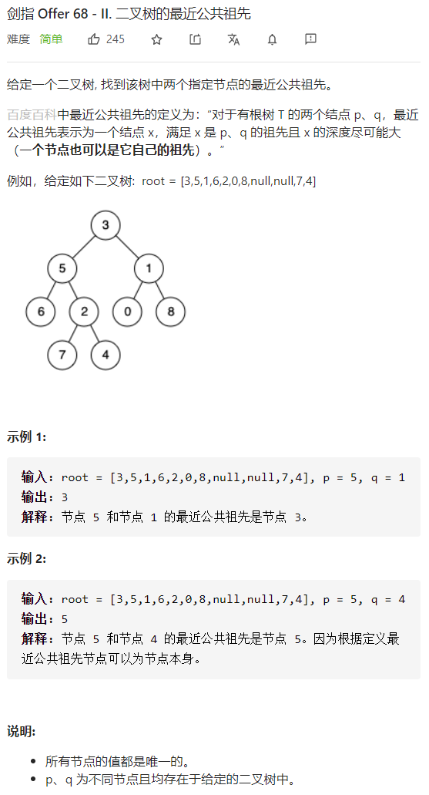

### 递归

终止条件：

* 当越过叶子结点，则直接返回 null
* 当 root = p 或 q，则直接返回 root


递推：

* 递归左子节点 left
* 递归右子节点 right


返回值：

* 当 left 和 right 同时为空 ：说明 root 的左 / 右子树中都不包含 p,q ，返回 null
* 当 left 和 right 同时不为空 ：说明 p, q 分列在 root 的 异侧 （分别在 左 / 右子树），因此 root 为最近公共祖先，返回 root
* 当 left 为空 ，right 不为空 ：p,q 都不在 root 的左子树中，直接返回 right
* 当 left 不为空 ， right 为空：p,q 都不在 root 的右子树中，直接返回 left


**代码**

```java
/**
 * Definition for a binary tree node.
 * public class TreeNode {
 *     int val;
 *     TreeNode left;
 *     TreeNode right;
 *     TreeNode(int x) { val = x; }
 * }
 */
class Solution {
    public TreeNode lowestCommonAncestor(TreeNode root, TreeNode p, TreeNode q) {
        if(root == null || root == p || root == q) return root;
        TreeNode left = lowestCommonAncestor(root.left, p, q);
        TreeNode right = lowestCommonAncestor(root.right, p, q);
        if(left == null && right == null) return null; // 1.
        if(left == null) return right; // 3.
        if(right == null) return left; // 4.
        return root; // 2. if(left != null and right != null)
    }
}
```

