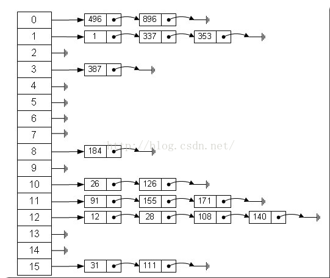

# 1. 哈希表--应用场景

一个公司， 当有新员工来报道时，要求将该员工的信息加入（id，性别，年龄，住址......），当输入该员工的id时，要求查到该员工的所有信息。

要求：不使用数据库，尽量节省内存，速度越快越好

# 2. 基本介绍

散列表（Hash Tab，也叫哈希表），是根据关键码值（Key Value）而直接进行访问的数据结构。也就是说，它通过把关键码值映射到表中的一个位置来访问记录，以加快查找的速度。这个映射函数叫做散列函数，存放记录的数组叫做散列表。

哈希表的存储图示：



# 3. 代码实现

```java
package DataStructures.哈希表;

import java.util.Scanner;

public class HashTab {

    public static void main(String[] args) {
        HashTable hashTable = new HashTable(7);

        String key = "";
        Scanner scanner = new Scanner(System.in);
        while (true) {
            System.out.println("");
            System.out.println("=========================");
            System.out.println("add：添加雇员");
            System.out.println("list：显示雇员");
            System.out.println("find：查找雇员");
            System.out.println("delete：删除雇员");
            System.out.println("exit：退出系统");
            System.out.println("=========================");
            System.out.println("");

            key = scanner.next();
            switch (key) {
                case "add":
                    System.out.println("请输入添加雇员的id：");
                    int id = scanner.nextInt();
                    System.out.println("请输入添加雇员的姓名：");
                    String name = scanner.next();
                    Emp emp = new Emp(id, name); // 创建雇员
                    hashTable.add(emp);
                    break;
                case "list":
                    hashTable.list();
                    break;
                case "find":
                    System.out.println("请输入查找雇员的id：");
                    id = scanner.nextInt();
                    hashTable.findEmpById(id);
                    break;
                case "delete":
                    System.out.println("请输入删除雇员的id：");
                    id = scanner.nextInt();
                    hashTable.deleteEmpById(id);
                    break;
                case "exit":
                    scanner.close();
                    System.exit(0);
                default:
                    break;
            }
        }
    }

    // 创建Hash Tab管理多条链表
    static class HashTable {
        private EmpLinkedList[] empLinkedLists;
        private int size; // 表示有多少条链表

        // 编写散列函数，使用一个简单取模法
        public int hashFun(int id) {
            return id % size;
        }

        //构造器
        public HashTable(int size) {
            this.size = size;
            // 初始化empLinkedLists
            empLinkedLists = new EmpLinkedList[size];
            for (int i = 0; i < size; i++) {
                empLinkedLists[i] = new EmpLinkedList();
            }
        }

        // 添加雇员
        public void add(Emp emp) {
            // 根据员工id得到该员工应该添加到哪条链表
            int empLinkedListNo = hashFun(emp.id);
            // 将emp添加到对应链表中
            empLinkedLists[empLinkedListNo].add(emp);
        }

        // 遍历所有链表
        public void list() {
            for (int i = 0; i < size; i++) {
                empLinkedLists[i].list(i);
            }
        }

        // 根据输入的id查找雇员
        public void findEmpById(int id) {
            // 使用散列函数确定在哪一条链表寻找
            int empLinkedListNo = hashFun(id);
            // 调用链表类
            Emp emp = empLinkedLists[empLinkedListNo].findEmpById(id);
            if (emp != null) {
                System.out.printf("在第%d条链表中找到，雇员id = %d", (empLinkedListNo + 1), id);
            } else {
                System.out.printf("未找到id为%d的雇员", id);
            }
        }

        // 根据输入的id删除雇员
        private void deleteEmpById(int id) {
            // 使用散列函数确定在哪一条链表寻找
            int empLinkedListNo = hashFun(id);
            // 调用链表类
            empLinkedLists[empLinkedListNo].deleteById(id);
        }
    }

    // 表示一个雇员
    static class Emp {
        public int id;
        public String name;
        public Emp next; // next默认为null
        public Emp(int id, String name) {
            super();
            this.id = id;
            this.name = name;
        }
    }

    // 创建EmpLinkedList表示链表
    static class EmpLinkedList {
        // 定义头指针，直接指向第一个Emp
        private Emp head;  // 默认null

        // 添加雇员到链表
        public void add(Emp emp) {
            if (head == null) { // 如果是添加的第一个雇员
                head = emp;
                return;
            }
            // 如果不是第一个雇员
            Emp curEmp = head; // 定义辅助指针
            while (true) {
                if (curEmp.next == null) {
                    break;
                }
                curEmp = curEmp.next;
            }
            curEmp.next = emp;
        }

        // 遍历链表的雇员信息
        public void list(int num) {
            if (head == null) {
                System.out.println("第" + (num + 1) + "条链表为空");
                return;
            }
            System.out.print("第" + (num + 1) + "条链表信息为=>");
            Emp curEmp = head; // 定义辅助指针
            while (true) {
                System.out.printf("id = %d, name = %s   ", curEmp.id, curEmp.name);
                if (curEmp.next == null) {
                    break;
                }
                curEmp = curEmp.next;
            }
            System.out.println();
        }

        // 根据id查找雇员
        public Emp findEmpById(int id) {
            if (head == null) {
                System.out.println("链表为空");
                return null;
            }
            Emp curEmp = head; // 定义辅助指针
            while (true) {
                if (curEmp.id == id) {
                    break;
                }
                if (curEmp.next == null) {
                    curEmp = null;
                    break;
                }
                curEmp = curEmp.next;
            }
            return curEmp;
        }

        // 根据id删除雇员
        public void deleteById(int id) {
            if (head == null) {
                System.out.println("链表为空");
                return;
            }
            if (head.id == id) {
                if (head.next == null) {
                    head = null;
                    return;
                } else {
                    head = head.next;
                    return;
                }
            }
            Emp curEmp = head; // 定义辅助指针
            while (true) {
                if (curEmp.next == null) {
                    break;
                }
                if (curEmp.next.id == id) {
                    break;
                }
                curEmp = curEmp.next;
            }
            if (curEmp.next == null) { // 避免空指针异常
                System.out.printf("未找到编号为%d的雇员", id);
            } else {
                curEmp.next = curEmp.next.next;
            }
        }
    }

}

```
