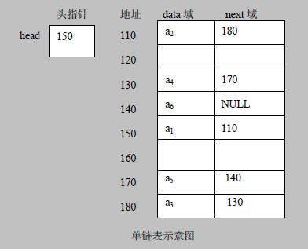
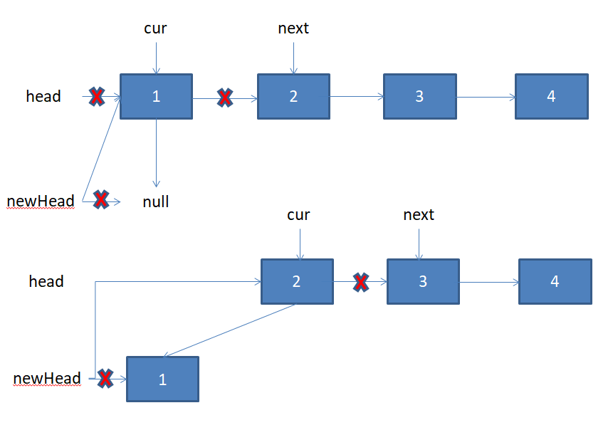

# 1. 链表简介

链表是有序的列表，其在内存中的存储如下：



特点：

* 链表是以节点的方式来存储，是**链式存储**
* 每个节点包含data域，next域
* 链表的**各个节点在内存中不一定是链式存储**
* 链表分为**带头节点的链表和不带头节点的链表**，根据实际的需求来确定
# 2. 单链表的应用实例

使用带头节点的单向链表实现“水浒英雄排行榜”，完成对英雄人物的增删改查操作

## 2.1 第一种添加方法：直接添加到链表的尾部

* 先创建一个head头节点，作用是表示单链表的头
* 找到当前链表的最后节点
* 将最后的节点的next指向要添加的节点
代码：

```java
// 在末尾添加新节点
    public void add(HeroNode heroNode) {
        HeroNode temp = head; // 创建辅助指针指向头节点
        while (true) { // 遍历链表找到最后一个节点
            if (temp.next == null) {
                break;
            }
            temp = temp.next;
        }
        temp.next = heroNode; // 将最后一个节点的next指向要添加的节点
    }
```

## 2.2 第二种添加方法：根据排名将英雄插入到指定位置

（如果该排名已经存在，则添加失败，并给出提示）

* 首先找到添加新节点的位置，通过辅助指针遍历找到
* 新的节点.next = temp.next
* text.next = 新的节点
代码：

```java
// 按照编号顺序添加新节点
public void addByOrder(HeroNode heroNode) {
        HeroNode temp = head; // 定义辅助指针指向头节点
        boolean flag = false; // 判断添加的编号是否已经存在，默认为false
        while (true) {
            if (temp.next == null) { // 遍历至链表最后
                break;
            }
            if (temp.next.number > heroNode.number) { // 遍历找到该节点的前一个节点的位置
                break;
            } else if (temp.next.number == heroNode.number) { // 要添加的节点的编号已经存在
                flag = true; // 说明编号存在
                break;
            }
            temp = temp.next; // 指针后移，循环遍历
        }
        if (flag) { // 编号已经存在
            System.out.printf("编号%d已经存在，添加失败\n", heroNode.number);
        } else { // 编号不存在
            heroNode.next = temp.next;
            temp.next = heroNode; 
        }
    }
```

## 2.3 修改节点

* 首先遍历找到该节点
* temp.name = newHeroNode.name
* temp.nickname = newHreoNode.nickname
代码：

```java
// 修改节点
    public void update(HeroNode newHeroNode) {
        if (head.next == null) {
            System.out.println("链表为空！");
        }
        boolean flag = false; // 设置是否找到对应编号节点的标志
        HeroNode temp = head.next;
        while (true) {
            if (temp.next == null) {
                break;
            }
            if (temp.number == newHeroNode.number) {
                flag = true; // 找到该节点
                break;
            }
            temp = temp.next; // 指针后移遍历
        }
        if (flag) { // 修改信息
            temp.name = newHeroNode.name;
            temp.nickname = newHeroNode.nickname;
        } else {
            System.out.printf("未找到编号为%d的数据", newHeroNode.number);
        }
    }
```

## 2.4 删除节点

* 首先遍历找到要删除节点的前一个节点
* temp.next = temp.next.next
* 被删除的节点，将不会有其他的引用指向，会被垃圾回收机制回收
代码：

```java
// 删除节点
    public void delete(int number) {
        if (head.next == null) {
            System.out.println("链表为空！");
        }
        HeroNode temp = head;
        boolean flag = false; // 设置是否找到指定编号的节点的标志
        while (true) {
            if (temp.next == null) {
                break;
            }
            if (temp.next.number == number) { // 需要找到指定编号节点的前一个节点
                flag = true;
                break;
            }
            temp = temp.next;
        }
        if (flag) { // 找到前一个节点，将前一个节点的next指向要删除节点的next
            temp.next = temp.next.next;
        } else {
            System.out.printf("未找到编号为%d的数据\n", number);
        }
    }
```

## 2.5 代码实现(ArrayCircleQueueDemo.java)

```java
public class SingleLinkedListDemo {
    public static void main(String[] args) {
        // 实例化链表对象
        SingleLinkedList list = new SingleLinkedList();
        // 创建英雄节点
        HeroNode hero1 = new HeroNode(1, "宋江", "及时雨");
        HeroNode hero2 = new HeroNode(2, "卢俊义", "玉麒麟");
        HeroNode hero3 = new HeroNode(3, "吴用", "智多星");
        HeroNode hero4 = new HeroNode(4, "林冲", "豹子头");
        // 在末尾添加
        // list.add(hero1);
        // list.add(hero3);
        // list.add(hero2);
        // list.add(hero4);
        // 按照编号添加
        list.addByOrder(hero3);
        list.addByOrder(hero1);
        list.addByOrder(hero4);
        list.addByOrder(hero2);
        // 更改节点信息
        HeroNode newhero = new HeroNode(1, "矮脚虎", "张顺");
        list.update(newhero);
        // 删除节点
        list.delete(1);
        // 展示链表
        list.show();
    }
}

class SingleLinkedList {
    private HeroNode head = new HeroNode(0, "", "");

    // 在末尾添加新节点
    public void add(HeroNode heroNode) {
        HeroNode temp = head; // 创建辅助指针指向头节点
        while (true) { // 遍历链表找到最后一个节点
            if (temp.next == null) {
                break;
            }
            temp = temp.next;
        }
        temp.next = heroNode; // 将最后一个节点的next指向要添加的节点
    }

    // 按照编号顺序添加新节点
    public void addByOrder(HeroNode heroNode) {
        HeroNode temp = head; // 定义辅助指针指向头节点
        boolean flag = false; // 判断添加的编号是否已经存在，默认为false
        while (true) {
            if (temp.next == null) { // 遍历至链表最后
                break;
            }
            if (temp.next.number > heroNode.number) { // 遍历找到该节点的前一个节点的位置
                break;
            } else if (temp.next.number == heroNode.number) { // 要添加的节点的编号已经存在
                flag = true; // 说明编号存在
                break;
            }
            temp = temp.next; // 指针后移，循环遍历
        }
        if (flag) { // 编号已经存在
            System.out.printf("编号%d已经存在，添加失败\n", heroNode.number);
        } else { // 编号不存在
            heroNode.next = temp.next;
            temp.next = heroNode;
        }
    }

    // 修改节点
    public void update(HeroNode newHeroNode) {
        if (head.next == null) {
            System.out.println("链表为空！");
        }
        boolean flag = false; // 设置是否找到对应编号节点的标志
        HeroNode temp = head.next;
        while (true) {
            if (temp.next == null) {
                break;
            }
            if (temp.number == newHeroNode.number) {
                flag = true; // 找到该节点
                break;
            }
            temp = temp.next; // 指针后移遍历
        }
        if (flag) { // 修改信息
            temp.name = newHeroNode.name;
            temp.nickname = newHeroNode.nickname;
        } else {
            System.out.printf("未找到编号为%d的数据\n", newHeroNode.number);
        }
    }

    // 删除节点
    public void delete(int number) {
        if (head.next == null) {
            System.out.println("链表为空！");
        }
        HeroNode temp = head;
        boolean flag = false; // 设置是否找到指定编号的节点的标志
        while (true) {
            if (temp.next == null) {
                break;
            }
            if (temp.next.number == number) { // 需要找到指定编号节点的前一个节点
                flag = true;
                break;
            }
            temp = temp.next;
        }
        if (flag) { // 找到前一个节点，将前一个节点的next指向要删除节点的next
            temp.next = temp.next.next;
        } else {
            System.out.printf("未找到编号为%d的数据\n", number);
        }
    }

    // 显示链表
    public void show() {
        HeroNode temp = head;
        while (true) {
            if (head.next == null) {
                System.out.println("链表为空！");
                break;
            }
            if (temp.next == null) {
                break;
            }
            temp = temp.next;
            System.out.println(temp);
        }
    }
}

class HeroNode {
    public int number;
    public String name;
    public String nickname;
    public HeroNode next;

    public HeroNode(int number, String name, String nickname) {
        this.name = name;
        this.nickname = nickname;
        this.number = number;
    }

    @Override
    public String toString() {
        return "HeroNode{" +
                "number=" + number +
                ", name='" + name + '\'' +
                ", nickname='" + nickname + '\'' +
                '}';
    }
}
```

# 3. 单链表的面试题

## 3.1 求单链表中有效节点的个数

```java
// 获取单链表节点的个数
    public int getLength(HeroNode head) {
        if (head.next == null) {
            return 0;
        }
        int length = 0;
        HeroNode cur = head.next;
        while (cur != null) {
            length ++;
            cur = cur.next;
        }
        return length;
    }
```

## 3.2 查找单链表中的倒数第K个节点

* 编写一个方法，接收head节点，同时接收一个index
* index表示倒数第几个节点
* 首先**遍历链表**，得到链表的总长度 (此处使用上一题中的getLength()方法)
* 得到链表长度后，**从链表的第一个节点遍历到(size-length)**，就可以得到
* 如果找到了，则返回该节点，否则返回null

```java
// 查找单链表中的倒数第K个节点
    public HeroNode getLastIndexNode(HeroNode head, int index) {
        if (head.next == null) {
            return null;
        }
        int size = getLength(head);
        HeroNode cur = head.next;
        if (index <= 0 || index > size) {
            System.out.println("越界！");
            return null;
        } else {
            for (int i = 0; i < size - index; i++) {
                cur = cur.next;
            }
        }
        return cur;
    }
```

## 3.3 单链表的反转

* 先定义一个新节点newHead
* 从头到尾遍历原来的链表，每遍历一个节点，就将其取出，并放在新链表newHead的最前端
* 将原来的头节点指向新的链表的next：head.next = newHead.next



```java
// 单链表的反转
    public void reverseList(HeroNode head) {
        if (head.next == null || head.next.next == null) {
            return;
        }
        HeroNode cur = head.next; 
        HeroNode next = null;
        HeroNode newHead = new HeroNode(0,"", "");
        while (cur != null) {
            next = cur.next; 
            cur.next = newHead.next; 
            newHead.next = cur; 
            cur = next;
        }
        head.next = newHead.next;
    }
```

## 3.4 从尾到头打印单链表

* 方式一：现将单链表进行**反转操作，然后遍历打印**即可。这样做的问题是会破坏原来的单链表的结构，不建议使用
* 方式二：可以利用栈，将各个节点压入栈中，**利用栈先进后出的特点**，实现逆序打印的效果。

```java
// 单链表的逆序打印
    public void reversePrint(HeroNode head) {
        if (head.next == null) {
            return;
        }
        HeroNode cur = head.next;
        Stack<HeroNode> stack = new Stack<>();
        while (cur != null) {
            stack.push(cur);
            cur = cur.next;
        }
        while (stack.size() > 0) {
            System.out.println(stack.pop());
        }
    }
```

## 3.5 合并两个有序的单链表，要求合并后的链表依然有序

* 创建一个新的头节点newHead
* 依次比较两个链表的每一个节点的标号，选取编号较小的链接到新头节点的后面。
* 被抽出节点的链表向后移动

```java
public HeroNode combineByOrder(HeroNode head1, HeroNode head2) {
        HeroNode newHead = new HeroNode(0, "", "");
        HeroNode cur1 = head1.next;
        HeroNode cur2 = head2.next;
        HeroNode cur = newHead;

        while (true) {
            if (cur1 == null) {
                cur.next = cur2;
                break;
            }
            if (cur2 == null) {
                cur.next = cur1;
                break;
            }
            if (cur1.number > cur2.number) {
                cur.next = cur2;
                cur2 = cur2.next;
            } else if (cur1.number < cur2.number) {
                cur.next = cur1;
                cur1 = cur1.next;
            } else {
                System.out.println("存在相同编号！无法合并！");
            }
            cur = cur.next;
        }
        return newHead.next;
    }
```

# 4. 双向链表的应用实例

使用带head头节点的双向链表实现水浒英雄排行榜

单向链表的缺点分析：

* 查找方向只能是一个方向；双向链表可以向前向后查找
* 单向链表不能自我删除，需要靠辅助节点；双向链表可以自我删除
## 4.1 添加：尾部添加

* 先找到双向链表的最后一个节点
* temp.next = newHeroNode
* newHeroNode.pre = temp
代码：

```java
// 添加元素(末尾添加)
    public void add(HeroNode2 hero) {
        HeroNode2 temp = head;
        while (true) {
            if (temp.next == null) {
                break;
            }
            temp = temp.next;
        }
        temp.next = hero;
        hero.pre = temp;
    }
```

## 4.2 添加：按编号顺序添加

```java
// 添加元素(按编号大小顺序添加)
    public void addByOrder(HeroNode2 hero) {
        HeroNode2 temp = head;
        while (true) {
            if (temp.next == null) { // 注意此处如果直接返回，则如果编号应添加到最后，会产生空指针异常
                temp.next = hero;
                hero.pre = temp;
                return;
            }
            if (temp.next.number > hero.number) {
                break;
            } else if (temp.next.number == hero.number) {
                System.out.printf("编号%d已存在！无法加入\n", hero.number);
                return;
            }
            temp = temp.next;
        }
        hero.next = temp.next;
        temp.next.pre = hero;
        temp.next = hero;
        hero.pre = temp;
    }
```

## 4.3 修改节点

```java
// 修改元素
    public void update(HeroNode2 newHeroNote) {
        HeroNode2 temp = head.next;
        boolean flag = false; // 设置标志表示是否找到对应编号的节点
        if (head.next == null) {
            System.out.println("链表为空，无法修改！");
            return;
        }
        while (true) {
            if (temp.number == newHeroNote.number) { // 注意此处两个if判断的前后顺序
                flag = true;
                break;
            }
            if (temp.next == null) { // 若该判断在前，则如果修改的是最后一个节点，会执行错误
                System.out.printf("未找到编号为%d的节点，无法更改\n", newHeroNote.number);
                break;
            }
            temp = temp.next;
        }
        if (flag) { // 找到对应编号的节点
            temp.name = newHeroNote.name;
            temp.nickname = newHeroNote.nickname;
        }
    }
```

## 4.4 删除节点

```java
// 删除元素
    public void delete(int n) {
        if (head.next == null) {
            System.out.println("链表为空，无法删除！");
            return;
        }
        HeroNode2 temp = head.next;
        boolean flag = false; // 设置标志表示是否找到对应编号的节点
        while (true) {
            if (temp.number == n) { // 找到对应编号节点
                flag = true;
                break;
            }
            if (temp.next == null) { // 未找到对应编号节点
                System.out.printf("未找到编号为%d的节点，无法删除\n", n);
                break;
            }
            temp = temp.next;
        }
        if (flag) { // 找到对应编号节点
            if (temp.next == null) { // 如果是最后一个节点，注意空指针异常
                temp.pre.next = null;
            } else { // 若是中间节点，自我删除即可
                temp.pre.next = temp.next;
                temp.next.pre = temp.pre;
            }
        }
    }
```

## 4.5 代码实现(DoubleLinkedListDemo.java)

```java
package DataStructures;

public class DoubleLinkedListDemo {
    public static void main(String[] args) {
        DoubleLinkedList list = new DoubleLinkedList();
        HeroNode2 hero1 = new HeroNode2(1, "宋江", "及时雨");
        HeroNode2 hero4 = new HeroNode2(4, "林冲", "豹子头");
        HeroNode2 hero6 = new HeroNode2(6, "杨志", "青面兽");
        HeroNode2 hero7 = new HeroNode2(7, "张顺", "浪里白条");
        HeroNode2 hero8 = new HeroNode2(8, "孙二娘", "母夜叉");

        // 末尾添加
        // list.add(hero1);
        // list.add(hero6);
        // list.add(hero4);
        // list.add(hero8);
        // list.add(hero7);

        // 按编号顺序添加
        list.addByOrder(hero4);
        list.addByOrder(hero1);
        list.addByOrder(hero7);
        list.addByOrder(hero6);
        list.addByOrder(hero8);

        // 修改节点
        HeroNode2 newHeroNode = new HeroNode2(8, "大刀", "关胜");
        list.update(newHeroNode);

        // 删除节点
        list.delete(1);
        list.show();
    }
}

class DoubleLinkedList {
    private HeroNode2 head = new HeroNode2(0,"", "");

    // 获取头节点
    public HeroNode2 getHead() {
        return head;
    }

    // 显示链表
    public void show() {
        if (head.next == null) {
            System.out.println("链表为空！");
            return;
        }
        HeroNode2 temp = head.next;
        while (temp != null) {
            System.out.println(temp);
            temp = temp.next;
        }
    }

    // 添加元素(末尾添加)
    public void add(HeroNode2 hero) {
        HeroNode2 temp = head;
        while (true) {
            if (temp.next == null) {
                break;
            }
            temp = temp.next;
        }
        temp.next = hero;
        hero.pre = temp;
    }

    // 添加元素(按编号大小顺序添加)
    public void addByOrder(HeroNode2 hero) {
        HeroNode2 temp = head;
        while (true) {
            if (temp.next == null) { // 注意此处如果直接返回，则如果编号应添加到最后，会产生空指针异常
                temp.next = hero;
                hero.pre = temp;
                return;
            }
            if (temp.next.number > hero.number) {
                break;
            } else if (temp.next.number == hero.number) {
                System.out.printf("编号%d已存在！无法加入\n", hero.number);
                return;
            }
            temp = temp.next;
        }
        hero.next = temp.next;
        temp.next.pre = hero;
        temp.next = hero;
        hero.pre = temp;
    }

    // 修改元素
    public void update(HeroNode2 newHeroNote) {
        HeroNode2 temp = head.next;
        boolean flag = false; // 设置标志表示是否找到对应编号的节点
        if (head.next == null) {
            System.out.println("链表为空，无法修改！");
            return;
        }
        while (true) {
            if (temp.number == newHeroNote.number) { // 注意此处两个if判断的前后顺序
                flag = true;
                break;
            }
            if (temp.next == null) { // 若该判断在前，则如果修改的是最后一个节点，会执行错误
                System.out.printf("未找到编号为%d的节点，无法更改\n", newHeroNote.number);
                break;
            }
            temp = temp.next;
        }
        if (flag) { // 找到对应编号的节点
            temp.name = newHeroNote.name;
            temp.nickname = newHeroNote.nickname;
        }
    }

    // 删除元素
    public void delete(int n) {
        if (head.next == null) {
            System.out.println("链表为空，无法删除！");
            return;
        }
        HeroNode2 temp = head.next;
        boolean flag = false; // 设置标志表示是否找到对应编号的节点
        while (true) {
            if (temp.number == n) { // 找到对应编号节点
                flag = true;
                break;
            }
            if (temp.next == null) { // 未找到对应编号节点
                System.out.printf("未找到编号为%d的节点，无法删除\n", n);
                break;
            }
            temp = temp.next;
        }
        if (flag) { // 找到对应编号节点
            if (temp.next == null) { // 如果是最后一个节点，注意空指针异常
                temp.pre.next = null;
            } else { // 若是中间节点，自我删除即可
                temp.pre.next = temp.next;
                temp.next.pre = temp.pre;
            }
        }
    }
}

class HeroNode2 {
    public int number;
    public String name;
    public String nickname;
    public HeroNode2 next;
    public HeroNode2 pre;

    public HeroNode2(int number, String name, String nickname) {
        this.name = name;
        this.nickname = nickname;
        this.number = number;
    }

    @Override
    public String toString() {
        return "HeroNode{" +
                "number=" + number +
                ", name='" + name + '\'' +
                ", nickname='" + nickname + '\'' +
                '}';
    }
}
```

# 5. 单向环形链表的应用实例

Josephu问题(约瑟夫问题、约瑟夫环)：

设编号为1，2，… n的n个人围坐一圈，约定编号为k（1<=k<=n）的人从1开始报数，数到m的那个人出列，它的下一位又从1开始报数，数到m的那个人又出列，依次类推，直到所有人出列为止，由此产生一个出队编号的序列。

## 5.1 环形链表的构建

* 先创建第一个节点，让first指向该节点，并形成环形
* 后面没创建一个新的节点，就把它加入到已有的环形列表中
代码：

```java
public void addBoy(int nums) {
        if (nums < 1) {
            System.out.println("数据值不正确！");
            return;
        }
        Boy cur = null;
        for (int i = 1; i < nums; i++) {
            Boy boy = new Boy(i); // 根据编号，生成小孩节点
            if (i == 1) { // 如果是第一个小孩
                first = boy;
                first.setNext(first); // 构成环
                cur = first; // 辅助指针指向第一个节点
            } else {
                cur.setNext(boy); // 将新节点添加到下一个节点
                boy.setNext(first); // 将新节点的下一个节点指向first节点
                cur = boy; // 当前节点后移至新节点
            }
        }
    }
```

## 5.2 环形链表的遍历

* 先让一个辅助指针cur指向first节点
* 然后通过while循环遍历该环形链表即可，直到cur.next==first时结束遍历
代码：

```java
public void show() {
        if (first == null) {
            System.out.println("链表为空！");
            return;
        }
        Boy cur = first; // 创建辅助节点，因为first节点不能移动
        while (true) {
            System.out.printf("编号%d\n", cur.getNumber());
            if (cur.getNext() == first) { // 遍历完毕
                break;
            }
            cur = cur.getNext(); // 指针后移
        }
    }
```

## 5.3 出圈形成队列

根据用户的输入，生成一个编号出圈的顺序。共n个人，从第k个人开始报数，数m下。

* 创建一个辅助变量helper，指向环形链表的最后一个节点
* 在报数前，让first和helper先向后移动k-1次
* 当小孩报数时，让first和helper指针同时移动m-1次
* 此时将first指向的节点出圈    * first = first.next
    * helper.next = first
    * first原来指向的节点没有任何引用，就会被回收
代码：

```java
public void countBoy(int startNumber, int countNum, int nums) {
        // 首先进行参数校验
        if (first == null || startNumber < 1 || startNumber > nums) {
            System.out.println("参数输入有误，请重新输入");
            return;
        }
        // 设置辅助指针，指向最后一个节点(即环形链表中first的前一个节点)
        Boy helper = first;
        while (true) {
            if (helper.getNext() == first) { // 当helper的下一个节点为first时，退出
                break;
            }
            helper = helper.getNext(); // 循环后移helper
        }
        // 将first和helper移动到起始编号处
        for (int i = 0; i < startNumber - 1; i++) {
            first = first.getNext();
            helper = helper.getNext();
        }
        // 遍历输出编号
        while (true) {
            if (helper == first) { // 若只有一个节点，直接退出
                break;
            }
            // 依次报数找到要输出的节点
            for (int i = 0; i < countNum - 1; i++) {
                first = first.getNext();
                helper = helper.getNext();
            }
            // 输出节点编号
            System.out.printf("编号%d\n", first.getNumber());
            // 将该节点移出环形链表
            first = first.getNext();
            helper.setNext(first);
        }
        // 输出最后一个节点编号
        System.out.printf("最后一个编号为：%d", first.getNumber());
    }
```

## 5.4 代码实现

```java
package DataStructures.链表;

public class Josepfu {
    public static void main(String[] args) {
        // 实例化环形链表类
        CircleSingleLinkedList list = new CircleSingleLinkedList();
        // 添加节点
        list.addBoy(5);
        // list.show();
        // 输出编号
        list.countBoy(1, 2, 5);
    }
}

// 环形链表类
class  CircleSingleLinkedList {
    private Boy first = null;
    // 添加节点
    public void addBoy(int nums) {
        if (nums < 1) {
            System.out.println("数据值不正确！");
            return;
        }
        Boy cur = null;
        for (int i = 1; i <= nums; i++) {
            Boy boy = new Boy(i); // 根据编号，生成小孩节点
            if (i == 1) { // 如果是第一个小孩
                first = boy;
                first.setNext(first); // 构成环
                cur = first; // 辅助指针指向第一个节点
            } else {
                cur.setNext(boy); // 将新节点添加到下一个节点
                boy.setNext(first); // 将新节点的下一个节点指向first节点
                cur = boy; // 当前节点后移至新节点
            }
        }
    }
    // 遍历展示链表
    public void show() {
        if (first == null) {
            System.out.println("链表为空！");
            return;
        }
        Boy cur = first; // 创建辅助节点，因为first节点不能移动
        while (true) {
            System.out.printf("编号%d\n", cur.getNumber());
            if (cur.getNext() == first) { // 遍历完毕
                break;
            }
            cur = cur.getNext(); // 指针后移
        }
    }
    // 按规则输出编号
    public void countBoy(int startNumber, int countNum, int nums) {
        // 首先进行参数校验
        if (first == null || startNumber < 1 || startNumber > nums) {
            System.out.println("参数输入有误，请重新输入");
            return;
        }
        // 设置辅助指针，指向最后一个节点(即环形链表中first的前一个节点)
        Boy helper = first;
        while (true) {
            if (helper.getNext() == first) { // 当helper的下一个节点为first时，退出
                break;
            }
            helper = helper.getNext(); // 循环后移helper
        }
        // 将first和helper移动到起始编号处
        for (int i = 0; i < startNumber - 1; i++) {
            first = first.getNext();
            helper = helper.getNext();
        }
        // 遍历输出编号
        while (true) {
            if (helper == first) { // 若只有一个节点，直接退出
                break;
            }
            // 依次报数找到要输出的节点
            for (int i = 0; i < countNum - 1; i++) {
                first = first.getNext();
                helper = helper.getNext();
            }
            // 输出节点编号
            System.out.printf("编号%d\n", first.getNumber());
            // 将该节点移出环形链表
            first = first.getNext();
            helper.setNext(first);
        }
        // 输出最后一个节点编号
        System.out.printf("最后一个编号为：%d", first.getNumber());
    }
}

// 节点类
class Boy {
    private int number; // 编号
    private Boy next; // 指向下一个节点，默认为null

    public Boy(int number) {
        this.number = number;
    }

    public Boy getNext() {
        return next;
    }

    public void setNext(Boy next) {
        this.next = next;
    }

    public int getNumber() {
        return number;
    }

    public void setNumber(int number) {
        this.number = number;
    }
}

```

