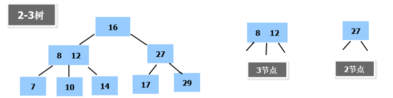
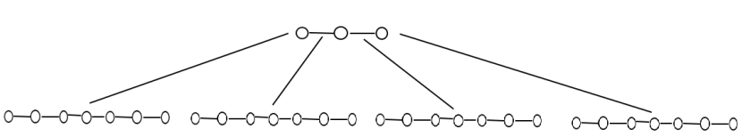
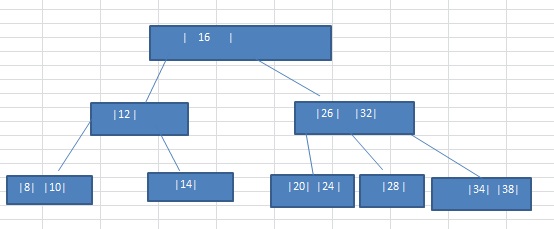
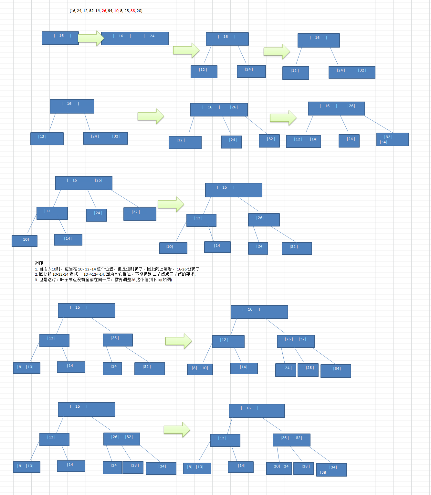
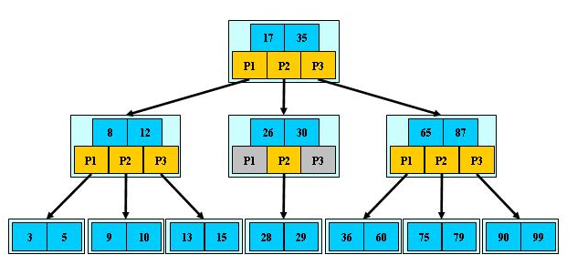
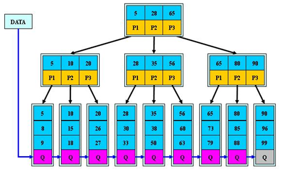
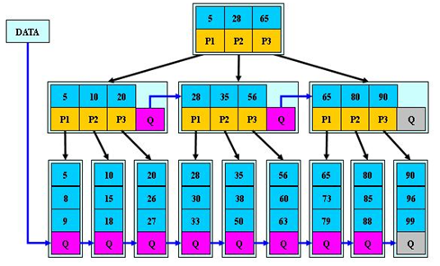

# 1. 二叉树与B树

## 1.1 二叉树的问题

二叉树的操作效率高，其需要加载到内存。如果二叉树的节点少，问题不大；如果二叉树的几点很多，则会存在如下问题：

1. 在构建二叉树时，需要进行多次io操作(海量数据存储在数据库或者文件中)，海量的节点在构建二叉树时会对速度产生影响
2. 节点海量，也会造成二叉树的高度很大，降低操作速度
## 1.2 多叉树

在二叉树中，每个节点最多存在两个子节点。如果允许每个节点可以有更多的数据项和更多的子节点，就是多叉树(multiway tree)。

多叉树通过重新组织节点，减少树的高度，能对二叉树进行优化。

## 1.3 B树

B树通过重新组织节点，降低了数的高度，并且减少了io读写次数来提升效率

1. 文件系统以及数据库系统的设计者利用磁盘预读原理，将一个节点的大小设置为等于一个页(页的大小通常为4K)，这样每一个节点只需要一次io就可以完全载入。
2. 将树的度M设置为1024，在600亿个元素中最多只需要4次io操作就可以读取到想要的元素，B树被广泛的用于文件存储系统以及数据库系统中。
# 2. 2-3树

## 2.1 2-3树的特点

2-3树是最简单的B树，其具有以下特点：

* 2-3树的所有叶子结点都在同一层(只要是B树都满足这一要求)
* 有两个子节点的节点叫做二节点，二节点要么没有子节点，要么就有两个子节点
* 有三个子节点的节点叫做三节点，三节点要么没有子节点，要么就有三个子节点
* 2-3树是由二节点和三节点构成的树

## 2.2 2-3树的插入规则

1. 2-3树的所有叶子节点都在同一层。
2. 有两个子节点的节点叫做二节点，二节点要么没有子节点，要么就有两个子节点。
3. 有三个子节点的节点叫做三节点，三节点要么没有子节点，要么就有三个子节点。
4. 当按照规则插入一个数到某个节点时，如果不能满足上面三个要求，就需要拆，先向上拆，如果上层满，则拆本层。拆后仍需要满足上述三个条件。
5. 对于三节点的子树的值仍然需要遵守二叉排序树(BST)的规则。

# 3. B树、B+树、B*树

## 3.1 B树

B-tree即B树，B即Balanced(平衡)。

1. B树的阶：节点的最多子节点个数。比如2-3树的阶是3，2-3-4树的阶是4。
2. B树的搜索：从根节点开始，对节点内的关键字(有序)序列进行二分查找，如果命中则结束，否则进入查询关键字所属范围的子节点；重复上述过程直到对应的子指针为空，或者已经是叶子结点。
3. 关键字集合分布在整棵树中，即叶子结点和非叶子结点都存放数据。
4. 搜索有可能在非叶子结点结束。
5. 其搜索性能相当于在关键字全集内做一次二分查找。

## 3.2 B+树

B+树是B树的变体，也是一种多路搜索树。

1. B+树的搜索和B树基本相同，区别是B+树只有到达叶子结点时才会命中，其性能也等价于在关键字全集中做一次二分查找。
2. 所有关键字都出现在叶子结点的链表中(即数据只能在叶子结点(也称稠密索引))，且链表中的关键字(数据)恰好是有序的。
3. 不可能在非叶子结点命中。
4. 非叶子结点相当于叶子结点的索引(稀疏索引)，叶子结点相当于是存储数据的数据层。
5. B+树更适合文件索引系统。
6. B树和B+树各有自己的应用场景，不能说B+树完全比B树好。

## 3.3 B*树

B*树是B+树的变体，在B+树的非根和非叶子结点在增加指向兄弟节点的指针。

1. B*树定义了非叶子结点的关键字个数至少为(2/3)*M，即块的最低使用率为2/3，而B+树的块的最低使用率为1/2。
2. 从1可以看出，B*树分配新节点的概率比B+树要低，空间使用率更高。
