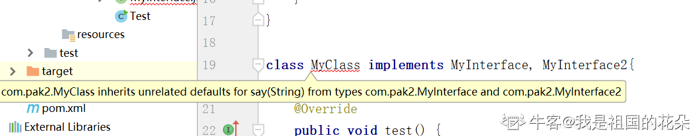
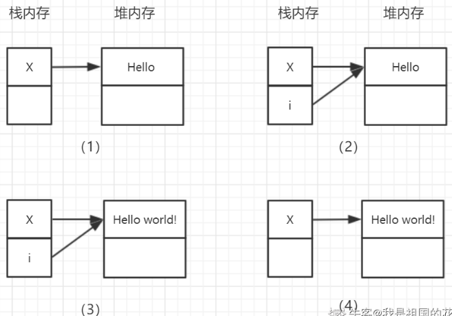
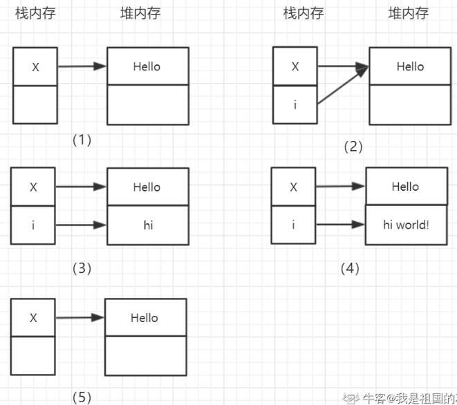
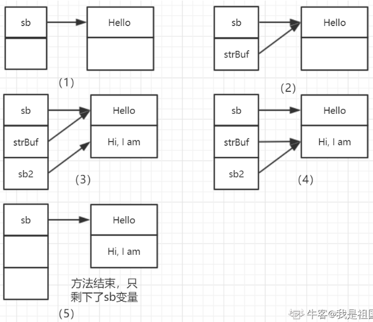
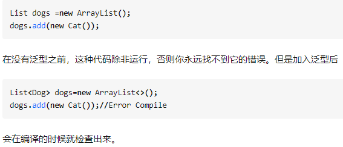

# 1. 面向对象可以解释下么？都有哪些特性？

面向对象是一种思想，可以将复杂问题简单化，让我们从执行者变为了指挥者。面向对象的三大特性为：封装，继承与多态。

* **封装**：将事物封装成一个类，**减少耦合，隐藏细节**。保留特定的接口与外界联系，当接口内部发生改变时，不会影响外部调用方。
* **继承**：**从一个已知的类中派生出一个新的类**，新类可以拥有已知类的行为和属性，并且可以通过**重写来增强已知类的能力**。
* **多态**：多态的本质就是**一个程序中存在多个同名的不同方法**，主要通过三种方式来实现：    
	* 通过子类对父类的**重写**来实现
    * 通过在一个类中对方法的**重载**来实现
    * 通过将**子类对象作为父类对象使用**来实现

## 关于封装

封装主要是为了**增加程序的可读性，解耦合并且隐藏部分实现细节**。我们可以将封装的类中的属性私有化，只有通过公共的`get()/set()`方法才能进行访问，在`get()/set()`方法中我们可以对内部逻辑进行封装处理，外部的调用方不必关心我们的处理逻辑。

## 关于继承

我们需要注意Java中不支持多继承，即一个类只可以有一个父类存在。另外Java中的构造函数是不可以继承的。如果构造函数被private修饰，那么就是不明确的构造函数，则该类是不可以被其它类继承的，具体原因我们可以先来看下Java中类的初始化顺序：

* 初始化父类中的静态成员变量和静态代码块
* 初始化子类中的静态成员变量和静态代码块
* 初始化父类中的普通成员变量和代码块，再执行父类的构造方法
* 初始化子类中的普通成员变量和代码块，再执行子类的构造方法

如果父类构造函数是私有(private)的，则初始化子类的时候不可以被执行，所以解释了为什么该类不可以被继承，也就是说其不允许有子类存在。我们知道，子类是由其父类派生产生的，那么**子类有哪些特点**呢？

* 子类**拥有父类非private的属性和方法**
* 子类可以添加自己的方法和属性，即**对父类进行扩展**
* 子类可以重新定义父类的方法，即**方法的重写**

### 重写(@Override)

重写也叫覆盖，是指在父子类中**子类中的方法与父类中继承的方法有完全相同的返回值类型、方法名、参数个数以及参数类型**。

子类重写方法的返回值范围应小于等于父类，抛出的异常范围小于等于父类，访问修饰符的范围大于等于父类。

若父类方法的访问修饰符为 private，则子类不能重写该方法。

## 关于多态

通过方法的**重写、重载、子类对象作为父类对象使用**可以实现多态。

### 重载

重载是指在**一个类中（包括父类）存在多个同名的不同方法，这些方法的参数个数、顺序以及类型不同均可以构成方法的重载**。如果仅仅是修饰符、返回值、抛出的异常不同，那么这是两个相同的方法。

### 面试官追问：如果只有方法返回值不同，可以构成重载吗？

不可以。因为我们调用某个方法，有时候并不关心其返回值，这个时候编译器根据方法名和参数无法确定我们调用的是哪个方法。

举例：如果我们分别定义了如下的两个方法：

* `public String Test(String userName){ }`
* `public void Test(String userName){ }`

在调用的时候，直接 Test(“ZQF”)； 那么就会存在歧义。

### 子类对象作为父类对象使用

把不同的子类对象都当作父类对象来看，可以屏蔽不同子类对象之间的差异，写出通用的代码，做出通用的编程，以适应需求的不断变化。这样操作之后，父类的对象就可以根据当前赋值给它的子类对象的特性以不同的方式运作。

对象的引用型变量具有多态性，因为**一个引用型变量可以指向不同形式的对象**，即：子类的对象作为父类的对象来使用。在这里涉及到了向上转型和向下转型。

在向上转型的时候我们可以直接转，但是在向下转型的时候我们必须强制类型转换。并且，该父类必须实际指向了一个子类对象才可强制类型向下转型，即其是以这种方式Father f = new Son（）创建的父类对象。若以Father f = new Father（）这种方式创建的父类对象，那么不可以转换向下转换为子类的Son对象，运行会报错，因为其本质还是一个Father对象。

#### 向上转型

子类对象转为父类，父类可以是接口。

公式：`Father f = new Son();`Father是父类或接口，Son是子类。

#### 向下转型

父类对象转为子类。

公式：`Son s = (Son) f;`

# 2. JDK，JRE和JVM的区别与联系有哪些？

三者的基本概念可以概括如下：

* JDK (Java Development Kit) 是一个开发工具包，是 Java 开发环境的核心组件，并且**提供编译、调试和运行一个 Java 程序所需要的所有工具**，可执行文件和二进制文件，是一个平台特定的软件
* JRE (Java Runtime Environment) 是指 Java 运行时环境，是 JVM 的实现，**提供了运行 Java 程序的平台**。JRE 包含了 JVM，但是不包含 Java 编译器/调试器之类的开发工具
* JVM (Java Virtual Machine) 是指 Java 虚拟机，当我们运行一个程序时，**JVM 负责将字节码转换为特定机器代码，JVM 提供了内存管理/垃圾回收和安全机制等**

## 区别与联系

* JDK是开发工具包，用来开发Java程序，而JRE是Java的运行时环境
* JDK和JRE中都包含了JVM
* JVM是Java编程的核心，独立于硬件和操作系统，具有**平台无关性**，而这也是**Java程序可以一次编写，多处执行**的原因

## 什么是字节码？字节码的好处是什么？

在java中，虚拟机能够理解的代码叫做字节码，即class文件，他不面向任何特定的处理器，只面向虚拟机

其优势是：java通过字节码的方式，在一定程度上，解决了传统解释性语言执行效率低的问题。同时又保留了，解释性语言可以移植的特点。

## Java的跨平台性是如何实现的呢？

* JVM屏蔽了操作系统和底层硬件的差异
* Java面向JVM编程，先编译生成字节码文件，然后交给JVM解释成机器码执行
* 通过规定基本数据类型的取值范围和行为

## Java语言是编译型还是解释型语言？

Java的执行经历了编译和解释的过程，是一种**先编译，后解释执行**的语言，不可以单纯归到编译性或者解释性语言的类别中。

# 3. 抽象类和接口有什么区别？

* **抽象方法**：抽象类中可以没有抽象方法，也可以抽象方法和非抽象方法共存；接口中的方法在 JDK8 之前只能是抽象的，JDK8 版本开始提供了接口中方法的default实现
* **继承**：抽象类和类一样是单继承的；接口可以实现多个父接口
* **成员变量**：抽象类中可以存在普通的成员变量；接口中的变量必须是 static final 类型的，必须被初始化，接口中只有常量，没有变量
* **设计目的**：抽象类的设计目的是代码复用，其设计难度和成本较高；接口的设计目的是对类的行为进行约束

## 抽象类和接口应该如何选择？分别在什么情况下使用呢？

根据抽象类和接口的不同之处，当我们**仅仅需要定义一些抽象方法而不需要其余额外的具体方法或者变量**的时候，我们可以使用接口。反之，则需要使用抽象类，因为抽象类中可以有非抽象方法和变量。

## 默认方法

default方法的具体实现：

```java
public interface MyInterface {
    // 定义一个已经实现的方法，使用default表明
    default void say(String message){
        System.out.println("Hello "+message);
    }
    // 普通的抽象方法
    void test();
}
```

当一个类实现该接口时，可以继承到该接口中的默认方法：

```java
public interface MyInterface {
    // 定义一个已经实现的方法，使用default表明
    default void say(String message){
        System.out.println("Hello "+message);
    }
    // 普通的抽象方法
    void test();
}

class MyClass implements MyInterface{
    @Override
    public void test() {
        System.out.println("test...");
    }
}
class Main{
    public static void main(String[] args) {
        MyClass client = new MyClass();
        client.test();
        client.say("World...");
    }
}
```

如果两个接口中存在同样的默认方法，实现类继承的是哪一个呢？这个时候，实现类那里会编译错误，错误如下：



这个编译错误的大概意思就是说：有两个相同的方法，编译器不知道该如何选择了。我们有两种处理方式，如下所示：

* 重写多个接口中的相同的默认方法
```java
class MyClass implements MyInterface, MyInterface2{
    @Override
    public void say(String message) {
        System.out.println("[Client]-Hello "+message);
    }
    @Override
    public void test() {
        System.out.println("test...");
    }
}
```

* 在实现类中指定要使用哪个接口中的默认方法
```java
class MyClass implements MyInterface, MyInterface2{
    // 手动指定哪个默认方法生效
    public void say(String message) {
        MyInterface.super.say(message);
    }
    @Override
    public void test() {
        System.out.println("test...");
    }
}
```

## JDK8中为什么会出现默认方法呢？

使用接口，使得我们可以面向抽象编程，但是其有一个缺点就是当接口中有改动的时候，需要修改所有的实现类。在JDK8中，为了给已经存在的接口**增加新的方法并且不影响已有的实现**，所以引入了接口中的默认方法实现。

# 4. Java中的8种基本数据类型及其取值范围

Java种的8种基本数据类型分别是：**byte，short，int，long，float，double，char以及boolean**。

* byte：8位(1Byte)，最大存储数据量是255，存放的数据范围是-128~127之间。
* short：16位(2Byte)，最大数据存储量是65536，数据范围是-32768~32767之间。
* int：32位(4Byte)，最大数据存储容量是2的32次方减1，数据范围是负的2的31次方到正的2的31次方减1。
* long：64位(8Byte)，最大数据存储容量是2的64次方减1，数据范围为负的2的63次方到正的2的63次方减1。
* float：32位(4Byte)，数据范围在3.4e-45~1.4e38，直接赋值时必须在数字后加上f或F。
* double：64位(8Byte)，数据范围在4.9e-324~1.8e308，赋值时可以加d或D也可以不加。
* boolean：只有true和false两个取值。
* char：16位(2Byte)，存储Unicode码，用单引号赋值。

# 5. Java中的元注解有哪些？

Java中提供了4个元注解，元注解的作用是负责注解其它注解。

## @Target

说明注解所修饰的对象范围，关键源码如下：

```java
public @interface Target {  
    ElementType[] value();  
}  
public enum ElementType {  
TYPE,FIELD,METHOD,PARAMETED,CONSTRUCTOR,LOCAL_VARIABLE,ANNOCATION_TYPE,PACKAGE,TYPE_PARAMETER,TYPE_USE  
}  
```

例如，如下的注解使用`@Target`标注，表明MyAnn注解就只能作用在类/接口和方法上。

```java
@Target({ElementType.TYPE, ElementType.METHOD})  
public @interface MyAnn {  
}
```

## @Retention(保留策略)

保留策略定义了该注解被保留的时间长短。关键源码如下：

```java
public @interface Retention {  
    RetentionPolicy value();  
}  
public enum RetentionPolicy {  
    SOURCE, CLASS, RUNTIME  
} 
```

其中：

* **SOURCE**：表示在源文件中有效（即源文件保留）
* **CLASS**：表示在class文件中有效（即class保留）
* **RUNTIME**：表示在运行时有效（即运行时保留）

例如，`@Retention(RetentionPolicy.RUNTIME)`标注表示该注解在运行时有效。

## @Documented

该注解用于描述其它类型的annotation应该被作为被标注的程序成员的公共API，因此可以被javadoc此类的工具文档化。Documented是一个标记注解，没有成员。关键源码如下：

```java
public @interface Documented {
}
```

## @Inherited

该注解是一个标记注解，`@Inherited`阐述了某个被标注的类型是被继承的。如果一个使用了`@Inherited`修饰的annotation类型被用于一个class，则这个annotation将被用于该class的子类。关键源码如下：

```java
public @interface Inherited {
}
```

## 注解的作用及定义

代替繁杂的配置文件，简化开发。

### 如何定义一个注解

定义注解类不能使用class、enum以及interface，必须使用`@interface`。下边是一个简单的注解定义：

```java
public @interface MyAnn{} 
```

### 如何定义注解的属性

```java
public @interface MyAnn {  
    String value();  
    int value1();  
}
// 使用注解MyAnn，可以设置属性
@MyAnn(value1=100,value="hello")  
public class MyClass {  
} 
```

定义注解时候的value就是属性，看着是一个方法，但我们称它为属性。当为注解指定属性后，那么在使用注解时就必须要给属性赋值了。

### 扩展：注解处理器

上边仅仅是对注解进行了一个定义，当定义一个注解之后，还需要一个注解处理器来执行注解的内部逻辑。注解处理器定义了注解的处理逻辑，涉及到反射机制和线程机制等。

# 6. 说说Java中反射机制

反射机制是指在运行中，对于任意一个类，都能够知道这个类的所有属性和方法。对于任意一个对象，都能够调用它的任意一个方法和属性。即**动态获取信息和动态调用对象方法的功能称为反射机制**。

## 反射机制的作用

* 在运行时判断任意一个对象所属的类
* 在运行时构造一个类的对象
* 在运行时判断任意一个类所具有的成员变量和方法
* 在运行时调用任意一个对象的方法，生成动态代理

## 与反射相关的类

* **Class：表示类**，用于获取类的相关信息
* **Field：表示成员变量**，用于获取实例变量和静态变量等
* **Method：表示方法**，用于获取类中的方法参数和方法类型等
* **Constructor：表示构造器**，用于获取构造器的相关参数和类型等

## 获取Class类的三种基本方式

* 通过类名称 **.class** 来获取Class类对象
```java
Class c = int.class；
Class c = int[ ].class；
Class c = String.class
```

* 通过对象 **.getClass( )** 方法来获取Class类对象
```java
Class c = obj.getClass( );
```

* 通过类名称加载类 **Class.forName( )**，只要有类名称就可以得到Class
```java
Class c = Class.forName("com.zqf.User");
```

通过反射方式创建对象的示例：

```java
package com.zqf;

public class Demo {
    public static void main(String[] args) throws Exception {
        String className = "com.zqf.User";
        // 获取Class对象
        Class clazz = Class.forName(className);
        // 创建User对象
        User user = (User)clazz.newInstance();
        // 和普通对象一样，可以设置属性值
        user.setUsername("zqf");
        user.setPassword("123456");

        System.out.println(user);
    }
}

class User {
    private String username;
    private String password;
    
    public String getUsername() {
        return username;
    }
    public void setUsername(String username) {
        this.username = username;
    }
    public String getPassword() {
        return password;
    }
    public void setPassword(String password) {
        this.password = password;
    }
    @Override
    public String toString() {
        return "User [username=" + username + ", password=" + password + "]";
    }
}
```

# 7. Java中的Exception和Error有什么区别？

* Exception是程序正常运行中**预料到可能会出现的错误**，并且应该**被捕获并进行相应的处理**，是一种异常现象
* Error是正常情况下**不可能发生的错误**，Error会导致JVM处于一种**不可恢复的状态**，不需要捕获处理

## Exception又分为了运行时异常和编译时异常

* **编译时异常**（受检异常）表示当前调用的方法体内部抛出了一个异常，所以编译器检测到这段代码在运行时可能会出异常，所以要求我们**必须对异常进行相应的处理，可以捕获异常或者抛给上层调用方**。常见的编译时异常包括：`ClassNotFoundException`、`FileNotFoundException`、`IOException`
* **运行时异常**（非受检异常）表示在运行时出现的异常。常见的运行时异常包括：`NullPointerException`、`ArithmeticException`、`IndexOutOfBoundsException`、`ClassCastException`

## 那么我们捕获异常应该遵循哪些原则呢？

* 尽可能捕获比较详细的异常，而不是使用 Exception 一起捕获。
* 当本模块不知道捕获之后该怎么处理异常时，可以将其抛给上层模块。上层模块拥有更多的业务逻辑，可以进行更好的处理。
* 捕获异常后至少应该有日志记录，方便之后的排查。
* 不要使用一个很大的 try – catch 包住整段代码，不利于问题的排查。

## NoClassDefFoundError 和 ClassNotFoundException 有什么区别？

* ClassNotFoundException 一般是类名传入有误导致的
* NoClassDefFoundError 是要查找的类在编译的时候是存在的，但运行的时候找不到了。一般是由于打包时漏掉了部分类或者 jar 包损坏导致

# 8. JIT编译器有了解吗？

JIT 编译器全名叫 **Just In Time Compile** 也就是即时编译器，**把经常运行的代码作为"热点代码"编译成与本地平台相关的机器码**，并进行各种层次的优化。JIT编译除了具有缓存的功能外，还会对代码做各种优化，包括逃逸分析、锁消除、 锁膨胀、方法内联等。

## 逃逸分析

逃逸分析的基本行为就是分析对象动态作用域：当一个对象在方法中被定义后，它可能被外部方法所引用，例如作为调用参数传递到其他地方中，称为方法逃逸。

示例：

```java
public static StringBuffer craeteStringBuffer(String s1, String s2) {
    StringBuffer sb = new StringBuffer();
    sb.append(s1);
    sb.append(s2);
    return sb; // 此处 sb 被返回，可能被其他的方法修改，产生逃逸
}

public static String createStringBuffer(String s1, String s2) {
    StringBuffer sb = new StringBuffer();
    sb.append(s1);
    sb.append(s2);
    return sb.toString(); // 此处的 sb 没有产生逃逸
}
```

使用逃逸分析，编译器可以对代码做如下优化：

**同步省略**

在动态编译同步块的时候，JIT 编译器可以借助逃逸分析来判断同步块所使用的锁对象是否只能够被一个线程访问而没有被发布到其他线程。

如果同步块所使用的锁对象通过这种分析被证实只能够被一个线程访问，那么 JIT 编译器在编译这个同步块的时候就会取消对这部分代码的同步。这个取消同步的过程就叫同步省略，也叫锁消除

示例：

```java
public void f() {
    Object hollis = new Object();
    synchronized(hollis) {
        System.out.println(hollis);
    }
}
// 代码中对hollis这个对象进行加锁，但是hollis对象的生命周期只在f()方法中，并不会被其他线程所访问到，所以在JIT编译阶段就会被优化掉。优化成：
public void f() {
    Object hollis = new Object();
    System.out.println(hollis);
}
```

**标量替换**

* 标量：指一个无法再分解成更小的数据的数据。Java中的原始数据类型就是标量。
* 聚合量：还可以分解的数据。Java中的对象就是聚合量，因为他可以分解成其他聚合量和标量。

在 JIT 阶段，如果经过逃逸分析，发现一个对象不会被外界访问的话，那么经过 JIT 优化，就会把这个对象拆解成若干个其中包含的若干个成员变量来代替。这个过程就是标量替换。

示例：

```java
public static void main(String[] args) {
   alloc();
}

private static void alloc() {
   Point point = new Point（1,2）;
   System.out.println("point.x="+point.x+"; point.y="+point.y);
}
class Point{
    private int x;
    private int y;
}
// 以上代码中，point 对象并没有逃逸出 alloc 方法，并且 point 对象是可以拆解成标量的。那么，JIT 就会不会直接创建Point对象，而是直接使用两个标量 int x ，int y 来替代 Point 对象。
// 以上代码，经过标量替换后，就会变成：
private static void alloc() {
   int x = 1;
   int y = 2;
   System.out.println("point.x="+x+"; point.y="+y);
}
// 标量替换的好处就是对象可以不在堆内存进行分配，为栈上分配提供了良好的基础。
```

**逃逸分析技术的缺点**

技术不是特别成熟，分析的过程也很耗时，如果所有对象都是逃逸的，那么就得不偿失了。

# 9. Java中的值传递和引用传递可以解释下吗？

* 值传递，意味着**传递对象的副本**，即使副本被改变，也不会影响源对象。
* 引用传递，意味着**传递对象的引用**。因此，外部对引用对象的改变会反映到所有的对象上。

示例1：

```java
public class Test {
    public static void main(String[] args)  {
        int x=0;
        change(x);
        System.out.println(x); // x = 0
    }
    static void change(int i){
        i=7;
    }
}
// 因为如果参数是基本数据类型，那么是属于值传递的范畴，传递的其实是源对象的一个copy副本，不会影响源对象的值。
```

示例2：

```java
public class Test {
    public static void main(String[] args)  {
        StringBuffer x = new StringBuffer("Hello");
        change(x);
        System.out.println(x); // Hello world
    }
    static void change(StringBuffer i) {
        i.append(" world!");
    }
}
```

解析：



示例3：

```java
public class Test {
    public static void main(String[] args)  {
        StringBuffer x = new StringBuffer("Hello");
        change2(x);
        System.out.println(x); // Hello
    }
    static void change2(StringBuffer i) {
        i = new StringBuffer("hi");
        i.append(" world!");
    }
}
```

解析：



示例4：

```java
public class Test {
    public static void main(String[] args)  {
        StringBuffer sb = new StringBuffer("Hello ");
        System.out.println("Before change, sb = " + sb);
        changeData(sb);
        System.out.println("After change, sb = " + sb); // Hello
    }
    public static void changeData(StringBuffer strBuf) {
        StringBuffer sb2 = new StringBuffer("Hi，I am ");
        strBuf = sb2;
        sb2.append("World!");
    }
}
```

解析：



# 10. String、StringBuffer与StringBuilder的区别？

**线程安全**：

* StringBuilder是线程不安全的，效率较高。
* StringBuffer是线程安全的，其方法都是被 synchronized 修饰的，故效率较低。

**数据可变和不可变**：

* String的值不可变的，其是被 final 修饰的。每次对 String 的操作都会产生新的对象。
* StringBuffer 和 StringBuilder 的值是可变的，两者都是在原对象上进行操作。他们底层使用的是可变字符数组：char[] value。

**使用场景**：

* 如果需要操作少量的数据用 String
* 需要改变字符串内容时使用后两个。单线程使用 StringBuilder，多线程使用 StringBuffer。

# 11. Java中的泛型的理解

**泛型的本质是参数化类型**

**泛型的作用**：

* 使用泛型能写出更加灵活通用的代码
* 泛型将代码安全性检查提前到编译期

使用泛型后，能让编译器在编译的时候借助传入的类型参数检查对容器的插入，获取操作是否合法，从而**将运行时ClassCastException转移到编译时**



* 泛型能够省去类型强制转换

在JDK1.5之前，Java容器都是通过将类型向上转型为Object类型来实现的，因此在从容器中取出来的时候需要手动的强制转换。

加入泛型后，由于编译器知道了具体的类型，因此编译期会自动进行强制转换，使得代码更加优雅。


# 12. Java序列化与反序列化的过程

## 序列化和反序列化的概念

**把对象转换为字节序列的过程称为对象的序列化。**

**把字节序列恢复为对象的过程称为对象的反序列化。**

对象的序列化主要有两种用途：

1. 把对象的字节序列永久地保存到硬盘上，通常存放在一个文件中；
2. 在网络上传送对象的字节序列。

## JDK类库中的序列化API

`java.io.ObjectOutputStream`代表对象输出流，它的`writeObject(Object obj)`方法可对参数指定的obj对象进行序列化，把得到的字节序列写到一个目标输出流中。

`java.io.ObjectInputStream`代表对象输入流，它的`readObject()`方法从一个源输入流中读取字节序列，再把它们反序列化为一个对象，并将其返回。

只有**实现了 Serializable 和 Externalizable 接口的类的对象才能被序列化**。

Externalizable 接口继承自 Serializable 接口，**实现 Externalizable 接口的类完全由自身来控制序列化的行为，而仅实现 Serializable 接口的类可以 采用默认的序列化方式**。

对象序列化包括如下步骤：

1. 创建一个对象输出流，它可以包装一个其他类型的目标输出流，如文件输出流；
2. 通过对象输出流的`writeObject()`方法写对象。

对象反序列化的步骤如下：

1. 创建一个对象输入流，它可以包装一个其他类型的源输入流，如文件输入流；
2. 通过对象输入流的`readObject()`方法读取对象。

示例：

```java
import java.io.File;
import java.io.FileInputStream;
import java.io.FileNotFoundException;
import java.io.FileOutputStream;
import java.io.IOException;
import java.io.ObjectInputStream;
import java.io.ObjectOutputStream;
import java.text.MessageFormat;

/**
 * ClassName: TestObjSerializeAndDeserialize
 * Description: 测试对象的序列化和反序列
 */
public class TestObjSerializeAndDeserialize {

    public static void main(String[] args) throws Exception {
        SerializePerson();//序列化Person对象
        Person p = DeserializePerson();//反序列Perons对象
        System.out.println(MessageFormat.format("name={0},age={1},sex={2}", p.getName(), p.getAge(), p.getSex()));
    }

    /**
     * MethodName: SerializePerson
     * Description: 序列化Person对象
     * @throws FileNotFoundException
     * @throws IOException
     */
    private static void SerializePerson() throws FileNotFoundException, IOException {
        Person person = new Person();
        person.setName("gacl");
        person.setAge(25);
        person.setSex("男");
        // ObjectOutputStream 对象输出流，将Person对象存储到E盘的Person.txt文件中，完成对Person对象的序列化操作
        ObjectOutputStream oo = new ObjectOutputStream(new FileOutputStream(
                new File("E:/Person.txt")));
        oo.writeObject(person);
        System.out.println("Person对象序列化成功！");
        oo.close();
    }

    /**
     * MethodName: DeserializePerson
     * Description: 反序列Perons对象
     * @return
     * @throws Exception
     * @throws IOException
     */
    private static Person DeserializePerson() throws Exception, IOException {
        ObjectInputStream ois = new ObjectInputStream(new FileInputStream(
                new File("E:/Person.txt")));
        Person person = (Person) ois.readObject();
        System.out.println("Person对象反序列化成功！");
        return person;
    }

}
```

# 13. equals和hashCode方法的关系？

1. 如果两个**对象相等，则hashcode一定也是相同的**
2. 两个**对象相等,对两个对象分别调用equals方法都返回true**
3. 两个**对象有相同的hashcode值，它们也不一定是相等的**
4. **equals 方法被覆盖过，则 hashCode 方法也必须被覆盖**
5. hashCode() 的默认行为是对**堆上的对象产生独特值**。如果没有重写 hashCode()，则该 class 的两个对象无论如何都不会相等（即使这两个对象指向相同的数据）

## hashCode()介绍

hashCode() 的作用是获取哈希码，也称为散列码；它实际上是返回一个 int 整数。这个哈希码的作用是确定该对象在哈希表中的索引位置。

散列表存储的是键值对(key-value)，它的特点是：能根据 key 快速的检索出对应的 value。这其中就利用到了散列码！（可以快速找到所需要的对象）

## 为什么要有 hashCode

以“HashSet 如何检查重复”为例子来说明为什么要有 hashCode： 当你把对象加入 HashSet 时，HashSet 会**先计算对象的 hashcode 值来判断对象加入的位置**，同时也会与其他已经加入的对象的 hashcode 值作比较，如果没有相符的hashcode，HashSet会假设对象没有重复出现。但是如果发现**有相同 hashcode 值的对象，这时会调用 equals()方法来检查 hashcode 相等的对象是否真的相同**。如果两者相同，HashSet 就不会让其加入操作成功。如果不同的话，就会重新散列到其他位置。这样我们就大大减少了 equals 的次数，相应就大大提高了执行速度。

因此我们可以看出：**hashCode() 的作用就是获取哈希码**，也称为散列码；它实际上是返回一个int整数。这个哈希码的作用是快速确定该对象在哈希表中的索引位置。

# 14. Java和C++的区别有哪些？

* 都是面向对象的语言，都支持**封装、继承和多态**
* **Java 不提供指针来直接访问内存**，程序内存更加安全
* **Java 的类是单继承的**，C++ 支持多重继承；虽然 Java 的类不可以多继承，但是**接口可以多继承**。
* **Java 有自动内存管理机制**，不需要程序员手动释放无用内存
* 在 C 语言中，字符串或字符数组最后都会有一个额外的字符‘\0’来表示结束。但是，**Java 语言中没有结束符这一概念**。

# 15. 静态与非静态的区别？

1. 静态方法**不需要类实例化**就可以调用；反之非静态方法需要**实例化**后才能调用；
2. 静态方法只能**访问静态成员和方法**；非静态方法都可以访问；
3. **静态方法不能标记为override**，导致派生类不能重写，但是可以访问；
4. **静态成员是在第一次使用时进行初始化**。**非静态的成员是在创建对象的时候初始化**，从内存分配上来说静态是连续的，非静态在内存的存储上是离散的，因此静态方法和非静态方法，在调用速度上，静态方法速度一定会快点，因为非静态方法需要实例化，分配内存，但静态方法不用，但是这种速度上差异可以忽略不计

# 16. Java中equals方法和==的区别？

== 对于基本类型来说是值比较，对于引用类型来说是比较的是引用；而 equals 默认情况下是 ==比较，只是很多类重写了 equals 方法，比如 String、Integer 等把它变成了值比较，所以一般情况下 equals 比较的是值是否相等。


# 17. 请简述final的作用

* final 修饰类：表示类不能被继承
* final 修饰方法：表示该方法不能被子类重写，但是可以重载
* final 修饰变量：表示变量一旦被赋值，其值便不能再被更改。对于基本类型的变量，数值一旦初始化，便不能改变；对于引用类型的变量，其指向的引用地址不能再改变，但其引用的值可改变
	* 修饰类变量(static修饰)：只能在静态代码块中或者在声明该类变量时指定初始值
	* 修饰成员变量：可以在非静态代码块、声明该变量以及在构造器中指定初始值
	* 修饰局部变量：可以指定默认值，也可以不指定默认值
	
## 为什么局部内部类和匿名内部类只能访问局部final变量？

其根本原因就是作用域中变量的生命周期导致的。

首先明确一点：内部类与外部类是属于同一级别的，内部类不回应定义在方法之中就随着方法执行完毕而销毁。

这里就会产生问题：当外部类的方法结束时，局部变量销毁，但内部类对象可能还存在。此时，内部类就可能访问了一个不存在的变量！为了解决这个问题，就将局部变量复制一份作为内部类的成员变量。这样当局部变量被回收后，内部类仍然可以访问到这个局部变量的拷贝，这样就好像延长了局部变量的生命周期。

将局部变量复制为内部类的成员变量时，必须保证两个变量是一样的。如果我们在内部类中修改了成员变量，则方法中的局部变量也应该跟着改变。

为解决这个问题，便将局部变量设置为 final 以保证该变量被初始化后无法修改，从而保证内部类成员变量和方法的局部变量的一致性。这实际上也是一种妥协。


