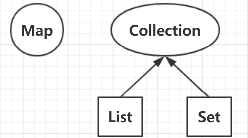
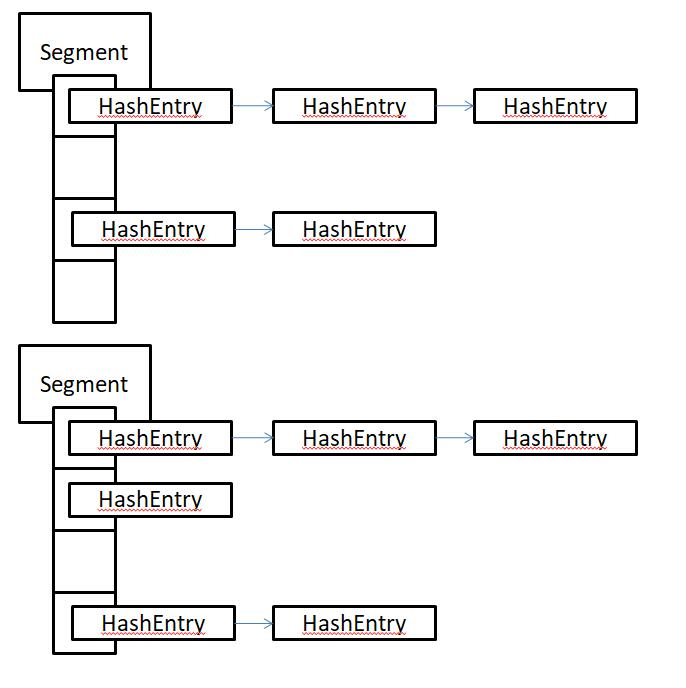
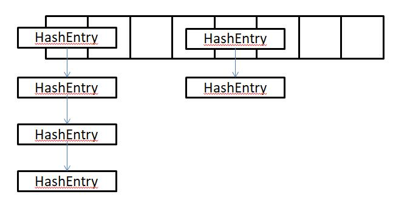

# 1. Map，List和Set都是Collection的子接口吗？

Map 是和 Collection 并列的集合上层接口，没有继承关系；List 和 Set 是 Collection 的子接口

# 2. 说说Java中常见的集合吧

Java中的常见集合可以概括如下。

* Map 的实现类主要有：HashMap、TreeMap、Hashtable、LinkedHashMap、ConcurrentHashMap以及Properties等
* Set 的实现类主要有：HashSet、TreeSet、LinkedHashSet等
* List 的实现类主要有：ArrayList、LinkedList、Stack以及Vector等

# 3. HashMap和Hashtable的区别有哪些？

* **线程安全**：HashMap 没有考虑同步，是线程不安全的；Hashtable 使用了 synchronized 关键字，是线程安全的；
* **键值是否可以为 null**：HashMap 允许 null 作为 Key；Hashtable 不允许 null 作为 Key，Hashtable 的 value 也不可以为 null

## HashMap是线程不安全的是吧？你可以举一个例子吗？

* HashMap 线程不安全主要是考虑到了**多线程环境下进行扩容可能会出现 HashMap 死循环**
* Hashtable 线程安全是由于其内部实现在 put 和 remove 等方法上使用 synchronized 进行了同步，所以对单个方法的使用是线程安全的。但是对**多个方法进行复合操作时，线程安全性无法保证**。 

比如一个线程在进行 get 然后 put 更新的操作，这就是两个复合操作，在两个操作之间，可能别的线程已经对这个 key 做了改动，所以，你接下来的 put 操作可能会不符合预期。

## Java集合中的快速失败（fast-fail）机制

快速失败是Java集合的一种错误检测机制，当多个线程对集合进行结构上的改变的操作时，有可能会产生 fail-fast。

例如：假设存在两个线程，线程1通过 Iterator 在遍历集合A中的元素，在某个时候线程2修改了集合A的结构（是结构上面的修改，而不是简单的修改集合元素的内容），那么这个时候程序就可能会抛出 ConcurrentModificationException 异常，从而产生 fast-fail 快速失败。

### fast-fail 的底层实现：

```java
/**
* 迭代器在遍历时直接访问集合中的内容，并且在遍历过程中使用一个 modCount 变量。集合在被遍历期间如果内容发生变化，就会改变modCount的值。当迭代器使用hashNext()/next()遍历下一个元素之前，都会检测modCount变量是否为expectedModCount值，是的话就返回遍历；否则抛出异常，终止遍历。
*/
        final Node<K,V> nextNode() {
            Node<K,V>[] t;
            Node<K,V> e = next;
            if (modCount != expectedModCount)
                throw new ConcurrentModificationException();
            if (e == null)
                throw new NoSuchElementException();
            if ((next = (current = e).next) == null && (t = table) != null) {
                do {} while (index < t.length && (next = t[index++]) == null);
            }
            return e;
        }
```

# 4. HashMap底层实现结构有了解吗？

HashMap 底层实现数据结构为**数组+链表**的形式，JDK8 及其以后的版本中使用了**数组+链表+红黑树**实现，解决了链表太长导致的查询速度变慢的问题。（链表高度达到 8、数组长度超过 64，链表转换为红黑树。）

## HashMap的初始容量，加载因子，扩容增量是多少？

HashMap 的**初始容量16**，**加载因子为0.75**，**扩容增量是原容量的1倍**。如果 HashMap 的容量为16，一次扩容后容量为32。HashMap 扩容是指元素个数（包括数组和链表+红黑树中）超过了 16\*0.75=12 之后开始扩容。

## HashMap 的扩容长度为什么是 2^n？

* 我们将一个键值对插入 HashMap 中，通过将 Key 的 hash 值与 length-1 进行 & 运算，实现了当前 Key 的定位，2 的幂次方可以**减少冲突（碰撞）的次数，提高 HashMap 查询效率**。
* 如果 length 为 2 的幂次方，则 length-1 转化为二进制必定是 11111……的形式，在与 hash 值的二进制 & 操作效率会非常的快，而且空间不浪费。
* 如果 length 不是 2 的幂次方，比如 length 为 15，则 length-1 为 14，对应的二进制为 1110，在与 hash 值 & 操作，最后一位都为 0，而 0001，0011，0101，1001，1011，0111，1101 这几个位置永远都不能存放元素了，空间浪费相当大；可用空间的减少进一步增加了碰撞的几率！

## HasMap的存储和获取原理

当调用 put() 方法传递键和值来存储时，先对键调用 hashCode() 方法，返回的 hashCode 用于找到 bucket 位置来储存 Entry 对象，也就是找到了该元素应该被存储的桶中（数组）。

当两个键的 hashCode 值相同时，bucket 位置发生了冲突，也就是发生了 Hash 冲突，此时会在每一个 bucket 后边接上一个链表（JDK8及以后的版本中还会加上红黑树）来解决，将新存储的键值对放在表头（也就是bucket中）。

当调用 get 方法获取存储的值时，首先根据键的 hashCode 找到对应的 bucket，然后根据 equals 方法来在链表和红黑树中找到对应的值。

## HasMap的扩容步骤

HashMap里面默认的负载因子大小为 0.75，也就是说，当 Map 中的元素个数（包括数组，链表和红黑树中）超过了 16\*0.75=12 之后开始扩容。将会创建原来 HashMap 大小的两倍的 bucket 数组，来重新调整 map 的大小，并将原来的对象放入新的 bucket 数组中。这个过程叫作 rehashing，因为它调用 hash 方法找到新的 bucket 位置。

上述的扩容机制是比较低效的。JDK开发人员在 1.8 版本中做了一个扩容效率方面的优化。因为是 2 的N次幂扩容，所以一个元素要么在原位置不动，要么移动到当前位置+2的N次幂（也就是oldIndex+OldCap的位置）。

说白了，就是通过新增的bit位置上是 0 还是 1 来判断。0 则是原位置，1则是 oldIndex + OldCap 位置。

## 解决Hash冲突的方法有哪些？

* 拉链法 （HashMap使用的方法）
* 线性探测再散列法
* 二次探测再散列法
* 伪随机探测再散列法

## 哪些类适合作为HashMap的键？

String 和 Interger 这样的包装类很适合做为 HashMap 的键，因为他们是 final 类型的类，而且重写了**equals和hashCode方法**，避免了键值对改写，有效提高 HashMap 性能。

# 5. ConcurrentHashMap和Hashtable的区别

ConcurrentHashMap 结合了 HashMap 和 Hashtable 二者的优势。HashMap 没有考虑同步，Hashtable 考虑了同步的问题。但是Hashtable 在每次同步执行时都要锁住整个结构。

ConcurrentHashMap 锁是**微细粒度**的，ConcurrentHashMap 将 hash 表分为16个桶，诸如 get，put，remove 等常用操作只锁上当前需要用到的桶。

## ConcurrentHashMap的原理（JDK7和JDK8的区别）

* JDK7
	* 数据结构：ReentrantLock + Segment + HashEntry；一个 Segment 中包含一个数组，数组的每个位置存储的又是一个链表结构。其 get() 方法无需加锁，Node.val 使用 volatile 保证可见性
	* 元素查询：需要二次 hash。第一次定位到 Segment，第二次定位到元素所在链表的头部
	* 锁：采用 Segment 分段锁，Segment 继承 ReentrantLock，只锁定操作的 Segment，其他的 Segment 不受影响。并发度为 Segment 的个数，可以通过构造函数指定。数组扩容不会影响其他 Segment



* JDK8
	* 数据结构：sychronized + CAS + HashEntry + 红黑树；Node 的 val 和 next 都使用 voltaile 修饰以保证可见性，数组使用 voltaile 修饰以保证扩容时被读线程感知
	* 其元素的查找、替换、赋值操作都使用 CAS 实现
	* 锁：只锁住链表的 head 节点，不影响其他元素的读写，细粒度更细，效率更高。扩容时阻塞所有的读写操作，并发扩容。



# 6. TreeMap有哪些特性？

TreeMap 底层使用**红黑树**实现，TreeMap 中存储的键值对按照键来排序。

* 如果 Key 存入的是字符串等类型，那么会按照字典默认顺序排序
* 如果传入的是自定义引用类型，比如说 User，那么该对象必须实现 Comparable 接口，并且覆盖其 compareTo 方法；或者在创建 TreeMap 的时候，我们必须指定使用的比较器 Comparator。如下所示：

```java
// 方式一：定义该类的时候，就指定比较规则
class User implements Comparable{
    @Override
    public int compareTo(Object o) {
        // 在这里边定义其比较规则：0判定为相同，1为不同
        return 0;
    }
}

// 方式二：创建TreeMap的时候，可以指定比较规则
public static void main(String[] args) {
    new TreeMap<User, Integer>(new Comparator<User>() {
        @Override
        public int compare(User o1, User o2) {
            // 在这里边定义其比较规则：0判定为相同，1为不同
            return 0;
        }
    });
}
```

## 那么Comparable接口和Comparator接口有哪些区别呢？

* Comparable 实现比较简单，但是当需要重新定义比较规则的时候，必须修改源代码，即修改 User 类里边的 compareTo 方法
* Comparator 接口不需要修改源代码，只需要在创建 TreeMap 的时候重新传入一个具有指定规则的比较器 Comparator 即可。

# 7. ArrayList和LinkedList有哪些区别？

常用的 ArrayList 和 LinkedList 的区别总结如下。

* ArrayList
	* 基于动态数组，连续内存存储，适合下标访问
	* 扩容机制：超出长度存储数据时需要新建数组，然后将老数组的数据拷贝到新数组
	* 使用尾插法并指定初始容量时可以极大提升性能（甚至超过LinkedList）
* LinkedList
	* 基于链表，在分散的内存中存储，适合做数据的增删操作，不适合查询（查询需要逐一遍历）
	* 必须使用 Iterator 遍历而不能使用 for，因为每一次 for 循环通过 get() 方法取得元素时都需要重新遍历！

# 8. HashSet和TreeSet有哪些区别？

HashSet和TreeSet的区别总结如下。

* HashSet 底层使用了 Hash 表实现。保证元素唯一性的原理：判断元素的 hashCode 值是否相同。如果相同，还会继续判断元素的 equals 方法是否为true
* TreeSet 底层使用了红黑树来实现。保证元素唯一性：通过 Comparable 或者 Comparator 接口实现

# 9. LinkedHashMap和LinkedHashSet有了解吗？

LinkedHashMap 可以记录下元素的插入顺序和访问顺序，具体实现如下：

* LinkedHashMap 内部的 Entry 继承于 HashMap.Node，这两个类都实现了 Map.Entry<K,V>
* LinkedHashMap的 Entry 不光有 value，next，还有 before 和 after 属性，这样通过一个双向链表，保证了各个元素的插入顺序
```java
// 源码：
static class Entry<K,V> extends HashMap.Node<K,V> {
        Entry<K,V> before, after;
        Entry(int hash, K key, V value, Node<K,V> next) {
            super(hash, key, value, next);
        }
    }
```
* 通过构造方法 public LinkedHashMap(int initialCapacity,float loadFactor, boolean accessOrder)，accessOrder 传入 true 可以实现 LRU 缓存算法（访问顺序）
```java
// 源码：
public LinkedHashMap(int initialCapacity,
                         float loadFactor,
                         boolean accessOrder) {
        super(initialCapacity, loadFactor);
        this.accessOrder = accessOrder;
    }
```
* LinkedHashSet 底层使用 LinkedHashMap 实现，两者的关系类似与 HashMap 和 HashSet 的关系

## 什么是LRU算法？LinkedHashMap如何实现LRU算法？

**LRU（Least recently used，最近最少使用）** 算法根据数据的历史访问记录来进行淘汰数据，其核心思想是“如果数据最近被访问过，那么将来被访问的几率也更高”。

由于LinkedHashMap可以记录下Map中元素的访问顺序，所以可以轻易的实现LRU算法。**只需要将构造方法的 accessOrder 传入 true，并且重写 removeEldestEntry 方法即可**。具体实现参考如下：

```java
public class test {

    private static int size = 5;

    public static void main(String[] args) {
        Map<String, String> map = new LinkedHashMap<String, String>(size, 0.75f, true) {
            @Override
            protected boolean removeEldestEntry(Map.Entry<String, String> eldest) {
                return size() > size;
            }
        };
        map.put("1", "1");
        map.put("2", "2");
        map.put("3", "3");
        map.put("4", "4");
        map.put("5", "5");
        System.out.println(map.toString()); // {1=1, 2=2, 3=3, 4=4, 5=5}

        map.put("6", "6");
        System.out.println(map.toString()); // {2=2, 3=3, 4=4, 5=5, 6=6}
        map.get("3");
        System.out.println(map.toString()); // {2=2, 4=4, 5=5, 6=6, 3=3}
        map.put("7", "7");
        System.out.println(map.toString()); // {4=4, 5=5, 6=6, 3=3, 7=7}
        map.get("5");
        System.out.println(map.toString()); // {4=4, 6=6, 3=3, 7=7, 5=5}
    }

}
```

# 10. List和Set的区别？

List和Set的区别可以简单总结如下。

* List是有序可重复。其可以使用 Iterator 取出所有元素，在逐一遍历；也可以使用 get(int index) 方法获取指定下标的元素。
* Set是无序（LinkedHashSet除外）不可重复。其取元素时只能通过 Iterator 接口取得所有元素再逐一遍历。

（此处的有序和无序是指放入顺序和取出顺序是否保持一致）

# 11. Iterator和ListIterator的区别是什么？

常见的两种迭代器的区别如下。

* Iterator 可以遍历 list 和 set 集合；ListIterator 只能用来遍历 list 集合
* Iterator 只能前向遍历集合；ListIterator 可以前向和后向遍历集合ListIterator 其实就是实现了前者，并且增加了一些新的功能。

Iterator其实就是一个迭代器，在遍历集合的时候需要使用。Demo实现如下：

```java
        ArrayList<String> list =  new ArrayList<>();
        list.add("zhangsan");
        list.add("lisi");
        list.add("yangwenqiang");
        // 创建迭代器实现遍历集合
        Iterator<String> iterator = list.iterator();
        while(iterator.hasNext()){
            System.out.println(iterator.next());
        }
```

# 12. 数组和集合List之间的转换

数组和集合List的转换在我们的日常开发中是很常见的一种操作

* 集合=》数组：`Arrays.asList(array)`
* 数组=》集合：`list.toArray(array)`

# 13. Collection和Collections有什么关系？

* Collection 是一个顶层集合接口，其子接口包括 List 和 Set
* Collections 是一个集合工具类，可以操作集合，比如说排序，二分查找，拷贝，寻找最大最小值等。

总而言之：带s的大都是工具类。

## Collections常用方法

* `Collections.sort(list)`：集合排序
* `Collections.reverse(list)`：反转集合
* `Collections.shuffle(list)`：对集合进行随机排序
* `Collections.fill(List list, Object obj)`：用对象 obj 替代集合中的所有元素
* `Collections.copy(List m, List n)`：将 n 中的元素全部复制到 m 中，并覆盖对应索引的元素
* `Collections.max(List list, Comparator c)`：求最大值
* `Collections.min(List list, Comparator c)`：求最小值
* `Collections.rotate(List list, int m)`：元素后移 m 个位置，后面的元素循环到前面
* `Collections.swap(List list, int i, int j)`：交换指定索引的元素

## Arrays常用方法
* `Arrays.sort(array)`：数组排序
* `Arrays.file(array, obj)`：填充数组
* `Arrays.equals(array1, array2)`：数组比较
* `Arrays.copyOf(array)`：数组拷贝
* `Arrays.binarySearch(array， num)`：二分查找返回下标


