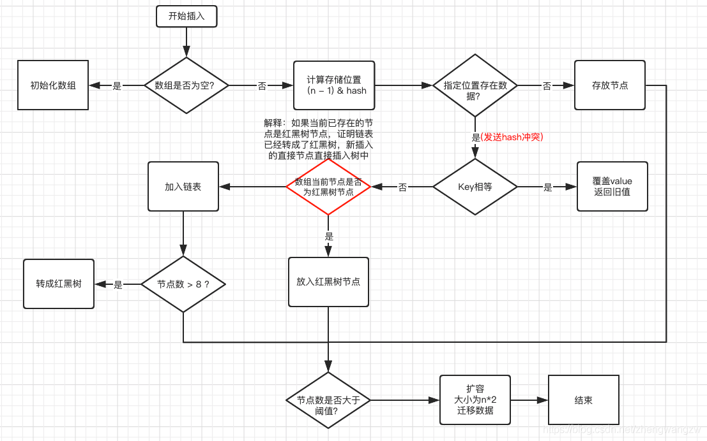

# 1. Map，List 和 Set 都是 Collection 的子接口吗？

Map 是和 Collection 并列的集合上层接口，没有继承关系；List 和 Set 是 Collection 的子接口

* Collection
	* Set：HashSet、TreeSet
	* List：ArrayList、LinkedList、Vector
* Map: HashMap、HashTable、TreeMap

# 2. 说说 Java 中常见的集合吧

Java 中的常见集合可以概括如下。

* Map 的实现类主要有：HashMap、TreeMap、Hashtable、LinkedHashMap、ConcurrentHashMap 等
* Set 的实现类主要有：HashSet、TreeSet、LinkedHashSet 等
* List 的实现类主要有：ArrayList、LinkedList、Stack、Vector 等

# 3. HashMap 和 Hashtable 的区别有哪些？
| | HashMap | HashTable |
| --- | --- | --- |
| 线程安全 | HashMap 没有考虑同步，是线程不安全的 | Hashtable 使用了 synchronized 关键字，是线程安全的 |
| 键值是否可以为 null | HashMap 允许 null 作为 Key | Hashtable 的 key 和 value 均不可为 null |
| 容量、扩容 | 默认的容量为 16，2 倍扩容 | 初始容量为 11，为 2 倍 + 1 扩容 |

## HashMap 是线程不安全的是吧？你可以举一个例子吗？

* HashMap 线程不安全主要是考虑到了多线程环境下进行扩容可能会出现 HashMap 死循环
* Hashtable 线程安全是由于其内部实现在 put 和 remove 等方法上使用 synchronized 进行了同步，所以对单个方法的使用是线程安全的。但是对多个方法进行复合操作时，线程安全性无法保证。
  * 比如一个线程在进行 get 然后 put 更新的操作，这就是两个复合操作，在两个操作之间，可能别的线程已经对这个 key 做了改动，所以，你接下来的 put 操作可能会不符合预期。

## Java 集合中的快速失败（fast-fail）机制

快速失败是Java集合的一种错误检测机制，当多个线程对集合进行结构上的改变的操作时，有可能会产生 fail-fast。

例如：假设存在两个线程，线程1通过 Iterator 在遍历集合A中的元素，在某个时候线程2修改了集合A的结构（是结构上面的修改，而不是简单的修改集合元素的内容），那么这个时候程序就可能会抛出 ConcurrentModificationException 异常，从而产生 fast-fail 快速失败。

### fast-fail 的底层实现：

```java
/*
*迭代器在遍历时直接访问集合中的内容，并且在遍历过程中使用一个 modCount 变量。集合在被遍历期间如果内容发生变化，就会改变modCount的值。当迭代器使用hashNext()/next()遍历下一个元素之前，都会检测modCount变量是否为expectedModCount值，是的话就返回遍历；否则抛出异常，终止遍历。
*/
final Node<K, V> nextNode(){
	Node<K, V>[]t;
	Node<K, V> e=next;
	if(modCount!=expectedModCount)
		throw new ConcurrentModificationException();
	if(e==null)
		throw new NoSuchElementException();
	if((next=(current=e).next)==null&&(t=table)!=null){
		do{}while(index<t.length&&(next=t[index++])==null);
	}
	return e;
}
```

# 4. HashMap 底层实现结构有了解吗？

HashMap 底层实现数据结构为数组+链表的形式，JDK8 及其以后的版本中使用了数组+链表+红黑树实现，解决了链表太长导致的查询速度变慢的问题。（链表高度达到 8、数组长度超过 64，链表转换为红黑树。）

## HashMap 的初始容量，加载因子，扩容增量是多少？

HashMap 的初始容量16，加载因子为0.75，扩容增量是原容量的1倍。如果 HashMap 的容量为16，一次扩容后容量为32。HashMap 扩容是指元素个数（包括数组和链表+红黑树中）超过了`16*0.75=12`之后开始扩容。

* `static final int DEFAULT_INITIAL_CAPACITY = 1 << 4;`：初始化大小默认 16，2 倍扩容
* `static final float DEFAULT_LOAD_FACTOR = 0.75f;`：负载因子 0.75
* `transient Node<K,V>[] table;`：初始化的默认数组
* `transient int size;`：Map 大小
* `int threshold;`：判断是否需要调整 HashMap 容量

## HashMap 的扩容长度为什么是 2^n？

* 我们将一个键值对插入 HashMap 中，通过将 Key 的 hash 值与 length-1 进行 & 运算，实现了当前 Key 的定位，2 的幂次方可以减少冲突（碰撞）的次数，提高 HashMap 查询效率。
* 如果 length 为 2 的幂次方，则 length-1 转化为二进制必定是 11111……的形式，在与 hash 值的二进制 & 操作效率会非常的快，而且空间不浪费。
* 如果 length 不是 2 的幂次方，比如 length 为 15，则 length-1 为 14，对应的二进制为 1110，在与 hash 值 & 操作，最后一位都为 0，而 0001，0011，0101，1001，1011，0111，1101 这几个位置永远都不能存放元素了，空间浪费相当大；可用空间的减少进一步增加了碰撞的几率！

## HasMap 的存储和获取原理

当调用 put() 方法传递键和值来存储时，先对键调用 hashCode() 方法，返回的 hashCode 用于找到 bucket 位置来储存 Entry 对象，也就是找到了该元素应该被存储的桶中（数组）。

当两个键的 hashCode 值相同时，bucket 位置发生了冲突，也就是发生了 Hash 冲突，此时会在每一个 bucket 后边接上一个链表（JDK8及以后的版本中还会加上红黑树）来解决，将新存储的键值对放在表头（也就是bucket中）。

当调用 get 方法获取存储的值时，首先根据键的 hashCode 找到对应的 bucket，然后根据 equals 方法来在链表和红黑树中找到对应的值。

## HashMap 的扩容步骤

HashMap里面默认的负载因子大小为 0.75，也就是说，当 Map 中的元素个数（包括数组，链表和红黑树中）超过了 `16*0.75=12` 之后开始扩容。将会创建原来 HashMap 大小的两倍的 bucket 数组，来重新调整 map 的大小，并将原来的对象放入新的 bucket 数组中。这个过程叫作 rehashing，因为它调用 hash 方法找到新的 bucket 位置。

上述的扩容机制是比较低效的。JDK开发人员在 1.8 版本中做了一个扩容效率方面的优化。因为是 2 的N次幂扩容，所以一个元素要么在原位置不动，要么移动到当前位置+2的N次幂（也就是oldIndex+OldCap的位置）。

说白了，就是通过新增的bit位置上是 0 还是 1 来判断。0 则是原位置，1则是 oldIndex + OldCap 位置。

## 解决 Hash 冲突的方法有哪些？

* 拉链法（HashMap使用的方法）
* 线性探测再散列法
* 二次探测再散列法
* 伪随机探测再散列法

## 哪些类适合作为 HashMap 的键？

String 和 Integer 这样的包装类很适合做为 HashMap 的键，因为他们是 final 类型的类，而且重写了equals和hashCode方法，避免了键值对改写，有效提高 HashMap 性能。

## 如何解决 HashMap 线程不安全的问题？
Java 提供了 HashTable、SynchronizedMap、ConcurrentHashMap 三种实现线程安全的 Map：
* HashTable：直接在相关方法上添加 synchronized 关键字，锁住整个数组，粒度较大
* SynchronizedMap：是使用 Collections 工具类的方法传入 Map 封装成的线程安全的集合，内部维护了一个对象锁，方法内通过对象锁实现
* ConcurrentHashMap：使用分段锁(CAS + synchronized)，降低了锁的细粒度，大大提高并发度

## 如何实现 HashMap 有序？
可以采用 LinkedHashMap 或者 TreeMap。

### LinkedHashMap
内部维护了一个单链表，有头尾节点。其节点 Entry 内部除了继承了 HashMap 的 Node 属性，还维护了 before 和 after 用于标识其前置节点和后置节点，因此可以实现按照插入的顺序或者访问的顺序排序。

源码分析：
```java
transient LinkedHashMap.Entry<K,V> head; // 头节点
transient LinkedHashMap.Entry<K,V> tail; // 尾节点

// 将加入的 p 节点添加到链表末尾
private void linkNodeLast(LinkedHashMap.Entry<K,V> p) {
  LinkedHashMap.Entry<K,V> last = tail;
  tail = p;
  if (last == null)
    head = p;
  else {
    p.before = last;
    last.after = p;
  }
}

// LinkedHashMap 的节点类
static class Entry<K,V> extends HashMap.Node<K,V> {
  Entry<K,V> before, after;
  Entry(int hash, K key, V value, Node<K,V> next) {
    super(hash, key, value, next);
  }
}
```

### TreeMap
TreeMap 实现了 SortedMap 接口，是一个 key 有序的 Map 类。
TreeMap 按照 key 的自然顺序或 Comparator 的排序规则进行排序，其内部通过红黑树实现。
TreeMap 比较规则的制定有两种方法：要么 Key 所存储的类实现 Comparable 接口；要么 TreeMap 自定义实现一个 Comparator 比较器，用于 key 的比较

## put 方法的原理是什么？



源码分析：
```java
/**
 * 将指定参数key和指定参数value插入map中，如果key已经存在，那就替换key对应的value
 * @param key 指定 key
 * @param value 指定 value
 * @return 如果 value 被替换，则返回旧的 value；否则返回 null。当然，可能 key 对应的 value 就是 null
 */
public V put(K key, V value) {
    //putVal方法的实现就在下面
    return putVal(hash(key), key, value, false, true);
}
```
```java
/**
 * Map.put和其他相关方法的实现需要的方法
 * @param hash 指定参数 key 的哈希值
 * @param key 指定参数 key
 * @param value 指定参数 value
 * @param onlyIfAbsent 如果为 true，即使指定参数 key 在 map 中已经存在，也不会替换 value
 * @param evict 如果为false，数组table在创建模式中
 * @return 如果 value 被替换，则返回旧的 value，否则返回 null；当然，可能key对应的 value 就是 null
 */
final V putVal(int hash, K key, V value, boolean onlyIfAbsent,boolean evict) {
    Node<K,V>[] tab; Node<K,V> p; int n, i;
    //如果哈希表为空，调用resize()创建一个哈希表，并用变量n记录哈希表长度
    if ((tab = table) == null || (n = tab.length) == 0)
        n = (tab = resize()).length;
    //如果指定参数hash在表中没有对应的桶，即为没有碰撞
    if ((p = tab[i = (n - 1) & hash]) == null)
        //直接将键值对插入到map中即可
        tab[i] = newNode(hash, key, value, null);
    else {
        Node<K,V> e; K k;
        //如果碰撞了，且桶中的第一个节点就匹配了
        if (p.hash == hash &&
            ((k = p.key) == key || (key != null && key.equals(k))))
            //将桶中的第一个节点记录起来
            e = p;
        //如果桶中的第一个节点没有匹配上，且桶内为红黑树结构，则调用红黑树对应的方法插入键值对
        else if (p instanceof TreeNode)
            e = ((TreeNode<K,V>)p).putTreeVal(this, tab, hash, key, value);
        //不是红黑树结构，那么就肯定是链式结构
        else {
            //遍历链式结构
            for (int binCount = 0; ; ++binCount) {
                //如果到了链表尾部
                if ((e = p.next) == null) {
                    //在链表尾部插入键值对
                    p.next = newNode(hash, key, value, null);
                    //如果链的长度大于TREEIFY_THRESHOLD这个临界值，则把链变为红黑树
                    if (binCount >= TREEIFY_THRESHOLD - 1) // -1 for 1st
                        treeifyBin(tab, hash);
                    //跳出循环
                    break;
                }
                //如果找到了重复的key，判断链表中结点的key值与插入的元素的key值是否相等，如果相等，跳出循环
                if (e.hash == hash &&
                    ((k = e.key) == key || (key != null && key.equals(k))))
                    break;
                //用于遍历桶中的链表，与前面的e = p.next组合，可以遍历链表
                p = e;
            }
        }
        //如果key映射的节点不为null
        if (e != null) { // existing mapping for key
            //记录节点的vlaue
            V oldValue = e.value;
            //如果onlyIfAbsent为false，或者oldValue为null
            if (!onlyIfAbsent || oldValue == null)
                //替换value
                e.value = value;
            //访问后回调
            afterNodeAccess(e);
            //返回节点的旧值
            return oldValue;
        }
    }
    //结构型修改次数+1
    ++modCount;
    //判断是否需要扩容
    if (++size > threshold)
        resize();
    //插入后回调
    afterNodeInsertion(evict);
    return null;
}
```

# 5. ConcurrentHashMap 和 Hashtable 的区别

ConcurrentHashMap 结合了 HashMap 和 Hashtable 二者的优势。HashMap 没有考虑同步，Hashtable 考虑了同步的问题。但是 Hashtable 在每次同步执行时都要锁住整个结构。

ConcurrentHashMap 锁是微细粒度的，ConcurrentHashMap 将 hash 表分为 16 个桶，诸如 get，put，remove 等常用操作只锁上当前需要用到的桶。

## 什么选择 ConcurrentHashMap？
* 线程不安全的 HashMap：多线程环境下进行 put 操作会引起死循环（多线程环境下会导致 HashMap 的 Entry 链表形成环形数据结构），导致 CPU 的利用率接近 100%，所以在并发的情况下不能使用 HashMap。
* 效率低下的 HashTable：HashTable 使用 synchronized 来保证线程安全，但是在线程竞争激烈的情况下 HashTable 的效率非常低下（类似于数据库中的串行化隔离级别）。当一个线程访问 HashTable 的同步方法时，其他访问该同步方法的线程会进入阻塞或轮询状态。

ConcurrentHashMap 采用分段锁技术，既保证了多线程的数据安全，又提升了多线程并发访问率。其容器内存在多把锁，每一把锁用于锁容器中的某一部分数据。这样线程之间就不会存在严重的锁竞争，从而有效提高并发访问效率。

## ConcurrentHashMap 的原理（JDK7 和 JDK8 的区别）

* JDK7
	* 数据结构：ReentrantLock + Segment + HashEntry；一个 Segment 中包含一个数组，数组的每个位置存储的又是一个链表结构。其 get() 方法无需加锁，Node.val 使用 volatile 保证可见性
	* 元素查询：需要二次 hash。第一次定位到 Segment，第二次定位到元素所在链表的头部
	* 锁：采用 Segment 分段锁，Segment 继承 ReentrantLock，只锁定操作的 Segment，其他的 Segment 不受影响。并发度为 Segment 的个数，可以通过构造函数指定。数组扩容不会影响其他 Segment


* JDK8
	* 数据结构：synchronized + CAS + HashEntry + 红黑树；Node 的 val 和 next 都使用 volatile 修饰以保证可见性，数组使用 volatile 修饰以保证扩容时被读线程感知
	* 其元素的查找、替换、赋值操作都使用 CAS 实现
	* 锁：只锁住链表的 head 节点，不影响其他元素的读写，细粒度更细，效率更高。扩容时阻塞所有的读写操作，并发扩容。


## JDK 1.8 中为什么使用 synchronized 来代替 ReentrantLock？
* 锁的粒度降低，而在低粒度的加锁时，synchronized 的性能不比 ReentrantLock 差。在粗锁粒度中，ReentrantLock 可以通过 Condition 来控制各个低粒度边界，更加灵活；而在低粒度锁中，其优势就不存在了。
* 基于 JVM 的 synchronized 的优化空间更大，使用内嵌的关键字比使用 API 更加自然。
* 大量数据操作的前提下，基于 API 的 ReentrantLock 会导致更多的内存开销。

## 说一下ConcurrentHashMap 初始化、存储和获取数据的过程
### JDK 1.7
* init：基于位运算来初始化 Segment 的大小。
* put：Segment 继承了 ReentrantLock，具有锁的功能。当进行 put 操作时通过第一次 hash 定位 Segment 的位置，然后通过第二次 hash 找到对应的 HashEntry 的位置。此时会利用锁的特性，在指定位置尾端插入数据。
  这个过程中会通过 tryLock() 方法去尝试获取锁，拿到锁就直接插入数据；若锁已被别的线程占用，则会以自旋的方式继续调用 tryLock() 方法去获取锁，若超过指定次数就挂起，等待唤醒。
* get：通过两次 hash 定位到指定的 HashEntry，然后遍历其下的链表进行对比，匹配则返回，否则返回 null。

### JDK 1.8
* init：其构造器是一个空实现，真正的初始化操作在 put 操作中实现。
* put：(观察源码过程) 遍历当前的 table
	* 如果还没有进行初始化，就执行 initTable() 方法进行初始化。
	* 若不存在 hash 冲突，就直接通过 CAS 插入数据。
	* 如果还在进行扩容操作，那么就先执行扩容。
	* 如果存在 hash 冲突，就加锁保证线程安全。
	* 若该链表的数量大于阈值 8，就需要先转化为红黑树的数据结构，然后 break 再次进入循环。
	* 如果数据添加成功，就调用 addCount() 方法统计 size
* get：
	* 计算 hash 值，定位到 table 的位置，若首节点符合就返回。
	* 如果遇到扩容的情况，会调用标志正在扩容节点 ForwardingNode 的 find() 方法查找该节点，匹配就返回。
	* 若上述都不符合，则向下遍历节点，匹配则返回，否则返回 null。
	
## ConcurrentHashMap 的 get 方法是否需要加锁？
get 方法不需要加锁。因为 Node 的元素 value 和指针 next 是用 volatile 修饰的（可见性），在多线程环境下线程 A 修改节点的 value 或者新增节点的时候是对线程 B 可见的。这也是它比其他并发集合比如 Hashtable、用 Collections.synchronizedMap() 包装的 HashMap 效率高的原因之一。

## ConcurrentHashMap 存在哪些缺陷？
ConcurrentHashMap 是设计为非阻塞的。在更新时会局部锁住某部分数据，但不会把整个表都锁住。同步读取操作则是完全非阻塞的。

这种设计的优点是在保证合理的同步的前提下，效率很高；但严格来说读取操作不能保证反映最近的更新。例如线程 A 调用 putAll() 写入大量数据，期间线程 B 调用 get，则只能 get 到目前为止已经顺利插入的部分数据，而未必是最新的数据。

因此，若需要严格按照串行事务定需求的话，如转账、支付类业务还是使用HashTable。

# 6. TreeMap 有哪些特性？

TreeMap 底层使用红黑树实现，TreeMap 中存储的键值对按照键来排序。

* 如果 Key 存入的是字符串等类型，那么会按照字典默认顺序排序
* 如果传入的是自定义引用类型，比如说 User，那么该对象必须实现 Comparable 接口，并且覆盖其 compareTo 方法；或者在创建 TreeMap 的时候，我们必须指定使用的比较器 Comparator。如下所示：

```java
// 方式一：定义该类的时候，就指定比较规则
class User implements Comparable{
    @Override
    public int compareTo(Object o) {
        // 在这里边定义其比较规则：0判定为相同，1为不同
        return 0;
    }
}

// 方式二：创建TreeMap的时候，可以指定比较规则
public static void main(String[] args) {
    new TreeMap<User, Integer>(new Comparator<User>() {
        @Override
        public int compare(User o1, User o2) {
            // 在这里边定义其比较规则：0判定为相同，1为不同
            return 0;
        }
    });
}
```

### Comparable 接口和 Comparator 接口有哪些区别呢？

* Comparable 实现比较简单，但是当需要重新定义比较规则的时候，必须修改源代码，即修改 User 类里边的 compareTo 方法
* Comparator 接口不需要修改源代码，只需要在创建 TreeMap 的时候重新传入一个具有指定规则的比较器 Comparator 即可。

# 7. ArrayList 和 LinkedList 有哪些区别？

常用的 ArrayList 和 LinkedList 的区别总结如下：
* ArrayList
	* 基于动态数组，连续内存存储，适合下标访问
	* 扩容机制：超出长度存储数据时需要新建数组，然后将老数组的数据拷贝到新数组
	* 使用尾插法并指定初始容量时可以极大提升性能（甚至超过LinkedList）
* LinkedList
	* 基于链表，在分散的内存中存储，适合做数据的增删操作，不适合查询（查询需要逐一遍历）
	* 必须使用 Iterator 遍历而不能使用 for，因为每一次 for 循环通过 get() 方法取得元素时都需要重新遍历！

# 8. HashSet 和 TreeSet 有哪些区别？
HashSet和TreeSet的区别总结如下：
* HashSet 底层使用了 Hash 表实现。保证元素唯一性的原理：判断元素的 hashCode 值是否相同。如果相同，还会继续判断元素的 equals 方法是否为true
* TreeSet 底层使用了红黑树来实现。保证元素唯一性：通过 Comparable 或者 Comparator 接口实现

# 9. LinkedHashMap 和 LinkedHashSet 有了解吗？
LinkedHashMap 可以记录下元素的插入顺序和访问顺序，具体实现如下：
* LinkedHashMap 内部的 Entry 继承于 `HashMap.Node`，这两个类都实现了 `Map.Entry<K,V>`
* LinkedHashMap的 Entry 不光有 value，next，还有 before 和 after 属性，这样通过一个双向链表，保证了各个元素的插入顺序
```java
// 源码：
static class Entry<K,V> extends HashMap.Node<K,V> {
        Entry<K,V> before, after;
        Entry(int hash, K key, V value, Node<K,V> next) {
            super(hash, key, value, next);
        }
    }
```
* 通过构造方法 public LinkedHashMap(int initialCapacity,float loadFactor, boolean accessOrder)，accessOrder 传入 true 可以实现 LRU 缓存算法（访问顺序）
```java
// 源码：
public LinkedHashMap(int initialCapacity,
                         float loadFactor,
                         boolean accessOrder) {
        super(initialCapacity, loadFactor);
        this.accessOrder = accessOrder;
    }
```
* LinkedHashSet 底层使用 LinkedHashMap 实现，两者的关系类似与 HashMap 和 HashSet 的关系

## 什么是 LRU 算法？LinkedHashMap 如何实现 LRU 算法？

LRU（Least recently used，最近最少使用） 算法根据数据的历史访问记录来进行淘汰数据，其核心思想是“如果数据最近被访问过，那么将来被访问的几率也更高”。

由于LinkedHashMap可以记录下Map中元素的访问顺序，所以可以轻易的实现LRU算法。只需要将构造方法的 accessOrder 传入 true，并且重写 removeEldestEntry 方法即可。具体实现参考如下：

```java
public class test {

    private static int size = 5;

    public static void main(String[] args) {
        Map<String, String> map = new LinkedHashMap<String, String>(size, 0.75f, true) {
            @Override
            protected boolean removeEldestEntry(Map.Entry<String, String> eldest) {
                return size() > size;
            }
        };
        map.put("1", "1");
        map.put("2", "2");
        map.put("3", "3");
        map.put("4", "4");
        map.put("5", "5");
        System.out.println(map.toString()); // {1=1, 2=2, 3=3, 4=4, 5=5}

        map.put("6", "6");
        System.out.println(map.toString()); // {2=2, 3=3, 4=4, 5=5, 6=6}
        map.get("3");
        System.out.println(map.toString()); // {2=2, 4=4, 5=5, 6=6, 3=3}
        map.put("7", "7");
        System.out.println(map.toString()); // {4=4, 5=5, 6=6, 3=3, 7=7}
        map.get("5");
        System.out.println(map.toString()); // {4=4, 6=6, 3=3, 7=7, 5=5}
    }

}
```

# 10. List 和 Set 的区别？
### List
Java 中有两种 List，一种是 ArrayList，其优点在于随机访问元素；另一种是 LinkedList，它并不是为快速随机访问而设计的，其特点是快速的插入和删除。

* ArrayList：底层由数组实现。其允许对元素进行快速的随机访问，但是向 List 中插入与删除元素的速度很慢；
* LinkedList：对访问顺序进行了优化，向 List 中插入与删除的开销不大，但随机访问相对较慢；
  其具有下列方法：`addFirst() / addLast() / getFirst() / GetLast() / removeFirst() / removeLast`，这些方法使得 LinkedList 可以当做堆栈、队列和双向队列使用。

### Set
Set 具有与 Collection 完全相同的接口，因此没有任何额外的功能。实际上 Set 就是 Collection，只是行为不同。

存入 Set 的元素都必须是唯一的，Set 不存储重复元素。加入 Set 的元素必须定义 equals() 方法来保证对象的唯一性。Set 不维护元素的次序。

* HashSet：为快速查找而设计的 Set。加入 Set 的对象必须定义 hashcode()；
* TreeSet：维护元素次序的 Set，底层为树结构，使用 TreeSet 可以从 Set 中获取有序的序列；

### List 与 Set 的区别
* 两者均继承自 Collection 接口
* List 特点：有序可重复；Set 特点：无需不可重复
* List 支持 for 循环下标遍历或者迭代器；Set 只能使用迭代器（因为无序）
* List 与数组相似，可以动态增长，查找元素效率高，插入删除元素效率低（因为会引起其他元素位置的改变）；Set 检索元素效率低，插入和删除元素效率高（不会引起其他元素位置的改变）

# 11. Iterator 和 ListIterator 的区别是什么？

常见的两种迭代器的区别如下。

* Iterator 可以遍历 list 和 set 集合；ListIterator 只能用来遍历 list 集合
* Iterator 只能前向遍历集合；ListIterator 可以前向和后向遍历集合 ListIterator 其实就是实现了前者，并且增加了一些新的功能。

Iterator其实就是一个迭代器，在遍历集合的时候需要使用。

Demo实现如下：
```java
        ArrayList<String> list =  new ArrayList<>();
        list.add("zhangsan");
        list.add("lisi");
        list.add("yangwenqiang");
        // 创建迭代器实现遍历集合
        Iterator<String> iterator = list.iterator();
        while(iterator.hasNext()){
            System.out.println(iterator.next());
        }
```

ListIterator 新增的方法：
* add(E e)：将指定的元素插入列表，插入位置为迭代器当前位置之前
* set(E e)：迭代器返回的最后一个元素替换参数 e
* hasPrevious()：迭代器当前位置，反向遍历集合是否含有元素
* previous()：迭代器当前位置，反向遍历集合，下一个元素
* previousIndex()：迭代器当前位置，反向遍历集合，返回下一个元素的下标
* nextIndex()：迭代器当前位置，返回下一个元素的下标

# 12. 数组和集合之间的转换
数组和集合List的转换在我们的日常开发中是很常见的一种操作
* 集合=》数组：`Arrays.asList(array)`
* 数组=》集合：`list.toArray(array)`

# 13. Collection 和 Collections 有什么关系？
* Collection 是一个顶层集合接口，其子接口包括 List 和 Set
* Collections 是一个集合工具类，可以操作集合，比如说排序，二分查找，拷贝，寻找最大最小值等。

总而言之：带s的大都是工具类。

### Collections常用方法
* `Collections.sort(list)`：集合排序
* `Collections.reverse(list)`：反转集合
* `Collections.shuffle(list)`：对集合进行随机排序
* `Collections.fill(List list, Object obj)`：用对象 obj 替代集合中的所有元素
* `Collections.copy(List m, List n)`：将 n 中的元素全部复制到 m 中，并覆盖对应索引的元素
* `Collections.max(List list, Comparator c)`：求最大值
* `Collections.min(List list, Comparator c)`：求最小值
* `Collections.rotate(List list, int m)`：元素后移 m 个位置，后面的元素循环到前面
* `Collections.swap(List list, int i, int j)`：交换指定索引的元素

### Arrays常用方法
* `Arrays.sort(array)`：数组排序
* `Arrays.file(array, obj)`：填充数组
* `Arrays.equals(array1, array2)`：数组比较
* `Arrays.copyOf(array)`：数组拷贝
* `Arrays.binarySearch(array， num)`：二分查找返回下标

# 14. 队列和栈是什么？有何区别？
* 队列先进先出；栈先进后出；
* 遍历数据的速度不同
	* 栈只能从头部取数据，即最先放入的数据需要遍历整个栈才能取出，且在遍历时还需要开辟额外空间以保持数据在遍历前后的一致性；
	* 队列基于地址指针进行遍历，可以从头部或者尾部开始遍历，但不可同时遍历，其无需开辟额外空间，查询速度快得多；

# 15. 如何确保一个集合不可被修改？
首先这个问题很容易想到 final 关键字。final 关键字修饰类，则该类不可被继承；修饰方法，则该方法不可被重写；修饰成员变量，则该成员变量必须有初始化值，若该变量为基本数据类型，则变量值不能改变，若为引用变量，则其引用地址不可改变，但是其值可以改变！

因此为解决这个问题，Collections 包中提供了 unmodifiableMap(Map) 方法，通过该方法返回的 map 是不可以被修改的。若执行修改则会产生 java.lang.UnsupportedOperationException。

同理，Collections 也提供了对应的 List 和 Set 方法：Collections.unmodifiableList(List)、Collections.unmodifiableSet(Set)

# 16. 在队列 Queue 中，poll() 和 remove() 有什么区别？
* `offer()` VS `add()`
	* `offer()`：添加新元素时，若队列满，返回 false；
	* `add()`：添加新元素时，若队列满，抛出异常；
* `poll()` VS `remove()`
	* `poll()`：从队列中删除第一个元素，若队列空，返回 null；
	* `remove()`：从队列中删除第一个元素，若队列空，抛出异常；
* `peek()` VS `element()`
	* `peek()`：查询队列头元素，若队列空，返回 null；
	* `element()`：查询队列头元素，若队列空，抛出异常；