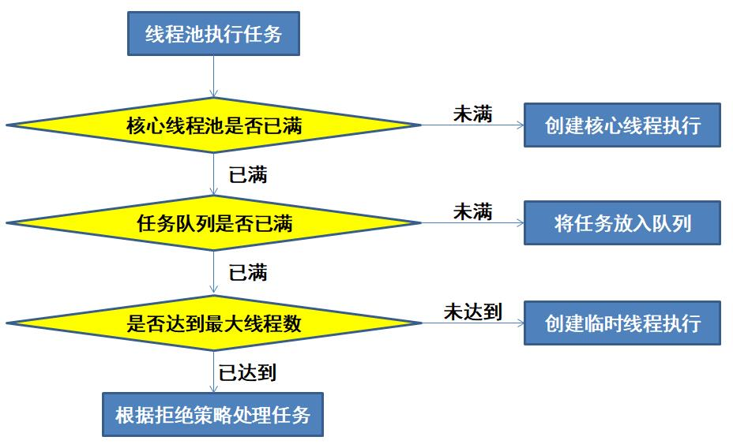
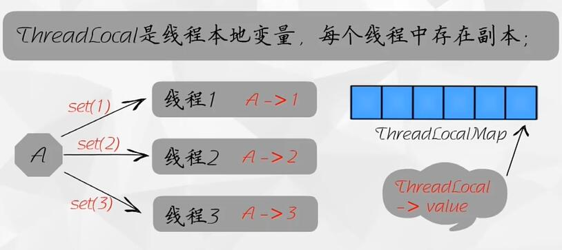

# 1. 进程与线程的区别

* 进程是一个“执行中的程序”，是系统进行资源分配和调度的一个独立单位
* 线程是进程的一个实体，一个进程中一般拥有多个线程。线程之间共享地址空间和其它资源（所以通信和同步等操作,线程比进程更加容易）
* 线程一般不拥有系统资源，但是也有一些必不可少的资源（使用 ThreadLocal 存储）
* 线程上下文的切换比进程上下文切换要快很多。

## 线程上下文切换比进程上下文切换快的原因

* 进程切换时，涉及到当前进程的 CPU 环境的保存和新被调度运行进程的 CPU 环境的设置
* 线程切换时，仅需要保存和设置少量的寄存器内容，不涉及存储管理方面的操作

## 进程之间常见的通信方式

* 通过套接字Socket
* 通过可以被多个进程访问的共享内存
* 通过写进程和读进程利用管道进行通信

# 2. 多线程与单线程的关系

* 多线程是指在一个进程中，并发执行了多个线程，每个线程都实现了不同的功能
* 多线程会存在线程上下文切换，反而会降低速度。但是对于用户来说，可以减少用户的等待响应时间，提高了资源的利用效率

## 对于线程安全你如何理解？

所谓线程安全是指由于内存中存在一块共享的内存区域，即所谓的堆。当多线程共同操作堆中的对象时，返回的结果可能与单线程操作的结果不同，即所谓的线程安全问题。其本质其实就是内存安全问题。

# 3. 线程的状态包括哪些

* **NEW**：
一个已经创建的线程，但是还没有调用 start 方法启动的线程所处的状态。

* **RUNNABLE**：
该状态包含两种可能。有可能正在运行，或者正在等待 CPU 资源。

* **BLOCKED**：
阻塞状态，当线程准备进入 synchronized 同步块或同步方法的时候，需要申请一个锁而进行的等待，会使线程进入 BLOCKED 状态。

* **WAITING**：
该状态的出现是因为调用了`Object.wait()`或者`Thread.join()`。处于该状态下的线程在等待另一个线程将其唤醒。

* **TIMED_WAITING**：
该状态和上一个状态其实是一样的，是不过其等待的时间是明确的。

* **TERMINATED**：
消亡状态。`run()`方法执行结束表示线程处于消亡状态了。

# 4. 多线程编程中常用的函数比较

* **sleep方法**：
是 Thread 类的静态方法，当前线程将睡眠 n 毫秒，线程进入阻塞状态。当睡眠时间到了，会解除阻塞，进入可运行状态，等待 CPU 的到来。睡眠不释放锁（如果有的话）。

* **wait方法**：
是 Object 的方法，必须与 synchronized 关键字一起使用，线程进入阻塞状态，当`notify()`或者`notifyall()`被调用后，会解除阻塞。但是，只有重新占用互斥锁之后才会进入可运行状态。睡眠时，会释放互斥锁。

* **join 方法**：
线程调用该方法后，会进入阻塞，等待被调用`join()`的线程执行完毕，再继续执行。 

* **yield 方法**：
该方法使得线程放弃当前分得的 CPU 时间。但是不使线程阻塞，即线程仍处于可执行状态，随时可能再次分得 CPU 时间。

# 5. 线程活性故障有哪些？

由于资源的稀缺性或者程序自身的问题导致线程**一直处于非Runnable状态**，并且其处理的**任务一直无法完成的现象**被称为是线程活性故障。常见的线程活性故障包括**死锁，锁死，活锁与线程饥饿**

## 线程死锁

死锁是最常见的一种线程活性故障。死锁的起因是**多个线程之间相互等待对方而被永远暂停**（处于非Runnable）。

### 死锁的产生必须满足如下四个必要条件：

* 资源互斥：一个资源每次只能被一个线程使用
* 请求与保持条件：一个线程因请求资源而阻塞时，对已获得的资源保持不放
* 不剥夺条件：线程已经获得的资源，在未使用完之前，不能强行剥夺
* 循环等待条件：若干线程之间形成一种头尾相接的循环等待资源关系

### 如何避免死锁的发生？

* **粗锁法**：使用一个粒度粗的锁来消除“请求与保持条件”，缺点是会明显降低程序的并发性能并且会导致资源的浪费。
* **锁排序法**：通过指定锁的获取顺序，比如规定，只有获得A锁的线程才有资格获取B锁，按顺序获取锁就可以避免死锁。这通常被认为是解决死锁很好的一种方法。
* 使用**显式锁**中的`ReentrantLock.try(long,TimeUnit)`来申请锁

## 线程锁死

线程锁死的定义：**线程锁死是指等待线程由于唤醒其所需的条件永远无法成立，或者其他线程无法唤醒这个线程而一直处于非运行状态（线程并未终止）导致其任务一直无法进展。**

线程死锁和线程锁死的外部表现是一致的，即故障线程一直处于非运行状态使得其所执行的任务没有进展。但是锁死的产生条件和线程死锁不一样，即使产生死锁的4个必要条件都没有发生，线程锁死仍然可能已经发生。

### 线程锁死的分类

* 信号丢失锁死：信号丢失锁死是因为没有对应的通知线程来将等待线程唤醒，导致等待线程一直处于等待状态。**典型例子**是等待线程在执行`Object.wait( )/Condition.await( )`前**没有对保护条件进行判断，而此时保护条件实际上可能已经成立**，此后可能并无其他线程更新相应保护条件涉及的共享变量使其成立并通知等待线程，这就使得等待线程一直处于等待状态，从而使其任务一直无法进展。
* 嵌套监视器锁死：嵌套监视器锁死是由于嵌套锁导致等待线程永远无法被唤醒的一种故障。

比如一个线程，只释放了内层锁 Y.wait()，但是没有释放外层锁 X；但是通知线程必须先获得外层锁X，才可以通过 Y.notifyAll() 来唤醒等待线程，这就导致出现了嵌套等待现象。

## 活锁

活锁是一种特殊的线程活性故障。**当一个线程一直处于运行状态，但是其所执行的任务却没有任何进展称为活锁**。比如，一个线程一直在申请其所需要的资源，但是却无法申请成功。

## 线程饥饿

线程饥饿是指**线程一直无法获得其所需的资源导致任务一直无法运行的情况**。线程调度模式有公平调度和非公平调度两种模式。**在线程的非公平调度模式下，就可能出现线程饥饿的情况**

* 线程饥饿发生时，如果线程处于可运行状态，也就是其一直在申请资源，那么就会转变为活锁
* 只要存在一个或多个线程因为获取不到其所需的资源而无法进展就是线程饥饿，所以线程死锁其实也算是线程饥饿

# 6. 原子性、可见性、有序性

多线程环境下的线程安全主要体现在原子性，可见性与有序性方面。

### 原子性和可见性考虑 i ++ 例子：

1. 读取 i 到工作内存
2. 执行  i++ 计算
3. 将计算结果写回工作内存（即将结果赋值给 i）
4. 将工作内存结果刷入主存

原子性即保证上述 1.2.3 三步为一个整体，不可分割；可见性保证 3.4 为一个整体

## 原子性

定义：对于涉及到共享变量访问的操作，若该操作从执行线程以外的任意线程来看是不可分割的，那么该操作就是原子操作，该操作具有原子性。即，其它线程不会看到该操作执行了部分的中间结果。

举例：银行转账流程中，A 账户减少了 100 元，那么 B 账户就会多 100 元，这两个动作是一个原子操作。我们不会看到 A 减少了 100 元，但是 B 余额保持不变的中间结果。

### 原子性的实现方式

* 利用**锁的排他性**，保证同一时刻只有一个线程在操作一个共享变量（sychronized 关键字）
* 利用 **CAS(Compare And Swap)** 保证
* Java语言规范中，保证了**除long和double型以外的任何变量的写操作都是原子操作**
* Java语言规范中规定，volatile关键字修饰的变量可以保证其**写操作的原子性**

### 关于原子性

* 原子性针对的是多个线程的共享变量，所以对于局部变量来说不存在共享问题，也就无所谓是否是原子操作
* 单线程环境下讨论是否是原子操作没有意义
* volatile关键字仅仅能保证变量写操作的原子性，不保证复合操作，比如说读写操作的原子性

## 可见性

定义：可见性是指一个线程对于共享变量的更新，对于后续访问该变量的线程是否可见的问题。

### 可见性如何保证

* 当前处理器需要**刷新处理器缓存**，使得其余处理器对变量所做的更新可以同步到当前的处理器缓存中
* 当前处理器对共享变量更新之后，需要**冲刷处理器缓存**，使得该更新可以被写入处理器缓存中

使用 锁(sychronized)、volatile 关键字、final 关键字均可保证可见性

## 有序性

定义：有序性是指一个处理器上运行的线程所执行的内存访问操作在另外一个处理器上运行的线程来看是否有序的问题。

### 重排序

为了提高程序执行的性能，Java编译器在其认为不影响程序正确性的前提下，可能会对源代码顺序进行一定的调整，导致程序运行顺序与源代码顺序不一致。

重排序是对内存读写操作的一种优化，在单线程环境下不会导致程序的正确性问题，但是多线程环境下可能会影响程序的正确性。

举例：`Instance instance = new Instance()` 都发生了什么？

具体步骤如下所示三步：

1. 在堆内存上分配对象的内存空间
2. 在堆内存上初始化对象
3. 设置 instance 指向刚分配的内存地址

第二步和第三步可能会发生重排序，导致引用型变量指向了一个不为 null 但是也不完整的对象。（**在多线程下的单例模式中，我们必须通过volatile来禁止指令重排序**）

## 总结

* **原子性**是一组操作要么完全发生，要么没有发生，其余线程不会看到中间过程的存在。注意，**原子操作+原子操作不一定还是原子操作**。
* **可见性**是指一个线程对共享变量的更新**对于另外一个线程是否可见**的问题。
* **有序性**是指一个线程对共享变量的更新在其余线程看起来是**按照什么顺序执行**的问题。

# 7. 谈谈你对Synchronized关键字的理解

**synchronized 是 Java 中的一个关键字，是一个内部锁**。它可以使用在方法上和方法块上，表示同步方法和同步代码块。在多线程环境下，同步方法或者同步代码块在同一时刻只允许有一个线程在执行，其余线程都在等待获取锁，也就是实现了整体并发中的局部串行。

## 内部锁底层实现

* 进入时，执行`monitorenter()`，将计数器+1，释放锁时，执行`monitorexit()`，计数器-1
* 当一个线程判断到计数器为 0 时，则当前锁空闲，可以占用；反之，当前线程进入等待状态

## synchronized  对原子性、可见性、有序性的保证

### synchronized内部锁对原子性的保证

锁通过互斥来保障原子性，互斥是指一个锁一次只能被一个线程所持有，所以，临界区代码只能被一个线程执行，即保障了原子性。

### synchronized内部锁对可见性的保证

synchronized内部锁通过写线程冲刷处理器缓存和读线程刷新处理器缓存保证可见性。

* **获得锁之后，需要刷新处理器缓存**，使得前面写线程所做的更新可以同步到本线程。
* **释放锁需要冲刷处理器缓存**，使得当前线程对共享数据的改变可以被推送到下一个线程处理器的高速缓冲中。

### synchronized内部锁对有序性的保证

由于原子性和可见性的保证，使得写线程在临界区中所执行的一系列操作在读线程所执行的临界区看起来像是完全按照源代码顺序执行的，即保证了有序性。

# 8. JVM对资源的调度

## 公平调度与非公平调度

* 公平调度：按照申请的先后顺序授予资源的独占权。
* 非公平调度：在该策略中，资源的持有线程释放该资源的时候，等待队列中一个线程会被唤醒，而该线程从被唤醒到其继续执行可能需要一段时间。在该段时间内，新来的线程（活跃线程）可以先被授予该资源的独占权。

### 优缺点分析

* 公平调度    
	* 优点：吞吐率较高，单位时间内可以为更多的申请者调配资源
    * 缺点：资源申请者申请资源所需的时间偏差可能较大，并可能出现线程饥饿的现象

* 非公平调度    
	* 优点：线程申请资源所需的时间偏差较小；不会出现线程饥饿的现象；适合在资源的持有线程占用资源的时间相对长或者资源的平均申请时间间隔相对长的情况下，或者对资源申请所需的时间偏差有所要求的情况下使用；
    * 缺点：吞吐率较小

## JVM对synchronized内部锁的调度

JVM对内部锁的调度是一种**非公平的调度方式**，JVM会给每个内部锁分配一个**入口集(Entry Set)**，用于记录等待获得相应内部锁的线程。

当锁被持有的线程释放的时候，该锁的入口集中的任意一个线程将会被唤醒，从而得到再次申请锁的机会。被唤醒的线程等待占用处理器运行时可能还有其他新的活跃线程与该线程抢占这个被释放的锁。

# 9. 谈谈你对volatile关键字的理解

volatile关键字是一个轻量级的锁，可以**保证可见性和有序性，但是不保证原子性**。

* volatile 可以保证主内存和工作内存直接产生交互，进行读写操作，保证可见性
* volatile 仅能保证变量写操作的原子性，不能保证读写操作的原子性。
* volatile 可以禁止指令重排序（通过插入内存屏障），典型案例是在单例模式中使用。

## volatile在什么情况下可以替代锁？

volatile是一个轻量级的锁，适合多个线程共享一个状态变量，锁适合多个线程共享一组状态变量。可以将多个线程共享的一组状态变量合并成一个对象，用一个 volatile 变量来修饰，从而替代锁。

# 10. ReentrantLock和synchronized的区别

* ReentrantLock 是显示锁，其提供了一些内部锁不具备的特性。**显式锁支持公平和非公平的调度方式，默认采用非公平调度**。显示锁支持在一个方法内申请锁，并且在另一个方法里释放锁。显示锁定义了一个`tryLock()`方法，尝试去获取锁，成功返回true，失败并不会导致其执行的线程被暂停而是直接返回false，即可以避免死锁。
* synchronized 内部锁简单，但是不灵活。


# 11. Java中的线程池有了解吗？

java.util.concurrent.ThreadPoolExecutor类就是一个线程池。线程池的优势体现如下：

* **降低资源损耗**：线程池可以重复利用已创建的线程，一次创建可以执行多次任务，有效降低线程创建和销毁所造成的资源消耗；
* **提高响应速度**：线程池技术使得请求可以快速得到响应，节约了创建线程的时间；
* **方便管理**：线程的创建需要占用系统内存，消耗系统资源，使用线程池可以更好的管理线程，做到统一分配、调优和监控线程，提高系统的稳定性。

## 线程池复用的原理

线程池将线程和任务进行解耦，线程是线程，任务是任务，摆脱了通过 Thread 创建线程时一个线程必须对应一个任务的限制。

在线程池中，同一个线程可以从阻塞队列中不断的获取新任务来执行。其核心原理是线程池对 Thread 进行了封装，每次执行任务时并不是调用`Thread.start()`方法来创建线程（这样就成了在线程池中创建子线程了）,而是让每个线程去执行一个循环任务，在这个循环任务中不停地检查是否有任务需要被执行，有则直接执行（即调用任务中的`run()` 方法）。

## 线程池的创建：七大参数

```java
    /**
     * corePoolSize：核心线程池大小
     * maximumPoolSize：最大核心线程池大小
     * keepAliveTime：超时时间(超过这个时间没人调用就会释放)
     * unit：超时单位
     * workQueue：阻塞队列
     * threadFactory：线程工厂(创建线程使用，一般不用动)
     * defaultHandler：拒绝策略
     */
    public ThreadPoolExecutor(int corePoolSize,
                              int maximumPoolSize,
                              long keepAliveTime,
                              TimeUnit unit,
                              BlockingQueue<Runnable> workQueue,
                              ThreadFactory threadFactory) {
        this(corePoolSize, maximumPoolSize, keepAliveTime, unit, workQueue,
             threadFactory, defaultHandler);
    }
```

## 线程池的处理流程

当我们向线程池提交任务的时候，需要遵循一定的排队策略，具体策略如下：

* 如果运行的线程少于corePoolSize，则Executor始终首选添加新的线程，而不进行排队
* 如果运行的线程等于或者多于corePoolSize，则Executor始终首选将请求加入队列，而不是添加新线程
* 如果无法将请求加入队列，即队列已经满了，则创建新的线程，除非创建此线程超出maxinumPoolSize，在这种情况下，任务默认将被拒绝。



### 为什么当有任务到来时要先添加队列而不是先创建最大线程？

因为线程的创建和销毁是十分消耗资源的，会影响整体效率。

举例：

一个企业有 10 个正式工 (core)，当任务数量超过正式工人数时，工厂领导( 线程池) 首先不是扩招工人，而是还是使用这 10 个人，将任务稍微积压一下，即先放到队列中 (代价低)。10 个正式工慢慢干，迟早可以完成。

如果任务继续增加，超过正式工的加班忍耐度 (队列满了)，此时就需要招聘外包 (临时工) 来协助工作。

若外包 + 正式工还是不能完成任务，此时就会根据拒绝策略进行相应的处理。

## 常见的线程池类型

* **newCachedThreadPool( )**    
	* 核心线程池大小为0，最大线程池大小不受限，来一个创建一个线程
    * 适合用来执行大量耗时较短且提交频率较高的任务

* **newFixedThreadPool( )**    
	* 固定大小的线程池
    * 当线程池大小达到核心线程池大小，就不会增加也不会减小工作者线程的固定大小的线程池

* **newSingleThreadExecutor( )**    
	* 便于实现单（多）生产者-消费者模式

## 常见的阻塞队列

* **ArrayBlockingQueue**    
	* 内部使用一个**数组**作为其存储空间，数组的存储空间是**预先分配**的
    * 优点是 **put 和 take操作不会增加GC的负担**（因为空间是预先分配的）
    * 缺点是 **put 和 take操作使用同一个锁**，可能导致锁争用，导致较多的上下文切换。
    * ArrayBlockingQueue适合在生产者线程和消费者线程之间的**并发程序较低**的情况下使用。

* **LinkedBlockingQueue**    
	* 是一个**无界队列**（其实队列长度是Integer.MAX_VALUE）
    * 内部存储空间是一个**链表**，并且链表节点所需的存储空间是**动态分配**的
    * 优点是 **put 和 take 操作使用两个显式锁**（putLock和takeLock）
    * 缺点是**增加了GC的负担**，因为空间是动态分配的。
    * LinkedBlockingQueue适合在生产者线程和消费者线程之间的**并发程序较高**的情况下使用。

* **SynchronousQueue**    
	* SynchronousQueue可以被看做一种特殊的有界队列。
    * 生产者线程生产一个产品之后，会等待消费者线程来取走这个产品，才会接着生产下一个产品，适合在生产者线程和消费者线程之间的处理能力相差不大的情况下使用。
	
### 线程池中阻塞队列的作用

队列用先进先出的特点。当放入一个元素时，会放在队列的末尾；取出元素时，会在队列的头部取出。

而当队列为空或队列满的时候，采用阻塞队列会自动帮我们处理这种情况：

* 当队列为空时，从队列中取出元素的操作就会被阻塞
* 当阻塞队列满时，往队列中放入元素的操作就会被阻塞
* 一旦空队列有数据了或者满队列有空余位置了，被阻塞的线程就会自动唤醒

所以，采用阻塞队列，我们不需要关心线程何时被阻塞何时被唤醒，一切有阻塞队列自动帮我们完成，我们只需要关心具体的业务逻辑即可。
	
## 拒绝策略

使用 ThreadPoolExecutor 创建线程池的最后一个参数，拥有四种拒绝策略。如下：

```java
/**
* ThreadPoolExecutor.AbortPolicy(): 直接抛出异常
* ThreadPoolExecutor.CallerRunsPolicy(): 哪来的回哪去（交由主进程处理）
* ThreadPoolExecutor.DiscardPolicy(): 直接丢掉任务，不会抛出异常
* ThreadPoolExecutor.DiscardOldestPolicy(): 尝试与最早的进行竞争，不会抛出异常
*/
```

# 12. CountDownLatch和CyclicBarrier有了解吗？

* CountDownLatch 是一个倒计时协调器，它可以实现一个或者多个线程等待其余线程完成一组特定的操作之后，继续运行。
* CyclicBarrier 是一个栅栏，可以实现多个线程相互等待执行到指定的地点，这时候这些线程会再接着执行，在实际工作中可以用来模拟高并发请求测试。

## CountDownLatch的内部实现

* CountDownLatch 内部维护一个**计数器**，`CountDownLatch.countDown()`每被执行一次都会使计数器值减少1。
* 当**计数器不为 0 时，`CountDownLatch.await()`方法的调用将会导致执行线程被暂停**，这些线程就叫做该 CountDownLatch 上的等待线程。
* `CountDownLatch.countDown()`相当于一个通知方法，当**计数器值达到0时，唤醒所有等待线程**。当然对应还有指定等待时间长度的`CountDownLatch.await(long , TimeUnit)`方法。

## CyclicBarrier的内部实现

* 使用 CyclicBarrier 实现等待的线程被称为**参与方**，参与方只需要执行**`CyclicBarrier.await()`就可以实现等待**，该栅栏维护了一个**显示锁**，可以识别出最后一个参与方，当**最后一个参与方调用`await()`方法时，前面等待的参与方都会被唤醒**，并且该最后一个参与方也不会被暂停。
* CyclicBarrier 内部维护了一个**计数器变量 count = 参与方的个数，调用`CyclicBarrier.await()`可以使得count - 1**。**当判断到是最后一个参与方时，唤醒所有线程**。

# 13. ThreadLocal有了解吗？

使用 ThreadLocal 维护变量时，其为每个使用该变量的线程提供独立的变量副本，所以每一个线程都可以独立的改变自己的副本，而不会影响其他线程对应的副本。

## ThreadLocal内部实现机制

* 每个线程内部都会维护一个类似 HashMap 的对象，称为 ThreadLocalMap，里边会包含若干了 Entry (K-V键值对)，相应的线程被称为这些 Entry 的属主线程
* Entry 的 Key 是一个 ThreadLocal 实例，Value 是一个线程特有对象。Entry 的作用是为其属主线程建立起一个 ThreadLocal 实例与一个线程特有对象之间的对应关系
	* 当执行 set() 方法时，Threadlocal 首先获取当前线程对象，然后获取当前线程的 ThreadlocalMap 对象。在以当前 ThreadLocal 对象为 Key，将 value 存储禁 ThreadLocalMmap 对象中。
	* 当执行 get() 方法时，Threadlocal 首先会获取当前线程对象，然后获取当前线程 ThreadLocalMap 对象。在以当前ThreadLocal对象为 Key，获取对应的值 value
* Entry 对 Key 的引用是弱引用；Entry 对 Value 的引用是强引用。



## ThreadLocal应用场景

1. 线程数据隔离
2. 在进行对象跨层传输时，使用 ThreadLocal 可以避免对此传递，打破层次间的约束
3. 进行实物操作，用于村塾线程事务信息（Spring 框架事务开始时会为当前线程绑定一个 JDBC Connection，就是使用 ThreadLocal 实现的）

## ThreadLocal内存泄漏

### 内存泄漏的原因

threadLocalMap 使用 ThreadLocal 的弱引用作为 key，如果一个 ThreadLocal 不存在外部强引用时，ThreadLocal 势必会被 GC 回收，这样就会导致 ThreadLocalMap 中 key 为 null， 而 value 还存在着强引用，只有 thead 线程退出以后，value 的强引用链条才会断掉。

但如果当前线程再迟迟不结束的话，这些 key 为 null 的 Entry 的 value 就会一直存在一条强引用链：`Thread Ref -> Thread -> ThreaLocalMap -> Entry -> value`，所以永远无法回收，造成内存泄漏。

### 避免内存泄漏

当 ThreadLocalMap 的 key 为弱引用回收 ThreadLocal 时，由于 ThreadLocalMap 持有 ThreadLocal 的弱引用，即使没有手动删除，ThreadLocal 也会被回收。当 key 为 null，在下一次 ThreadLocalMap 调用 set()、get()、remove() 方法的时候会被清除 value 值。

即使用弱引用可以多一层保障：弱引用 ThreadLocal 不会内存泄漏，对应的 value 在下一次 ThreadLocalMap 调用 set()、get()、remove() 的时候会被清除。

### ThreadLocal正确的使用方法

* 每次使用完 ThreadLocal 都调用它的 remove() 方法清除数据
* 将 ThreadLocal 变量定义成 private static，这样就一直存在 ThreadLocal 的强引用（延长 ThreadLocal 的生命周期），也就能保证任何时候都能通过 ThreadLocal 的引用访问到 Entry 的 value 值，进而清除掉 。

# 14. Atmoic有了解吗？

JDK在**java.util.concurrent.atomic包**下的 AtomicInteger 等原子类了。**AtomicInteger 类提供了`getAndIncrement()`和`incrementAndGet()`等原子性的自增自减等操作**。Atomic 等原子类内部使用了**CAS来保证原子性**。

# 15. 什么是happened-before原则？

happened-before 约束了编译器的优化行为，虽然允许编译器优化，但是编译器优化后一定要遵循 happened-before 原则。

1. 程序顺序规则
2. 传递性
3. volatile 变量规则
4. 锁规则
5. 线程 start() 规则
6. 线程 join() 规则
7. 线程 interrupt() 规则
8. finalize() 规则

# 16. JVM虚拟机对内部锁有哪些优化？

答：锁消除、锁粗化、偏向锁、适应性锁

## 锁消除

锁消除是JIT编译器对内部锁的具体实现所做的一种优化。

在动态编译同步块的时候，JIT编译器可以借助逃逸分析来判断同步块所使用的锁对象是否只能够被一个线程访问。如果同步块所使用的锁对象只能够被一个线程访问，那么JIT编译器在编译这个同步块的时候并不生成synchronized所表示的锁的申请与释放对应的机器码，而仅生成原临界区代码对应的机器码，即消除了锁的使用。

## 锁粗化

锁粗化是JIT编译器对内部锁的具体实现所做的一种优化。

对于相邻的几个同步块，如果这些同步块使用的是同一个锁实例，那么JIT编译器会将这些同步块合并为一个大同步块，从而避免了一个线程反复申请、释放同一个锁所导致的开销。

## 偏向锁

偏向锁是Java虚拟机对锁的实现所做的一种优化。

这种优化基于大多数锁并没有被争用，并且这些锁在其整个生命周期内至多只会被一个线程持有。

偏向锁的目标是，减少无竞争且只有一个线程使用锁的情况下，使用轻量级锁产生的性能消耗。轻量级锁每次申请、释放锁都至少需要一次 CAS，但偏向锁只有初始化时需要一次 CAS。

## 适应性锁

适应性锁是JIT编译器对内部锁实现所做的一种优化。

存在锁争用的情况下，一个线程申请一个锁的时候如果这个锁恰好被其他线程持有，那么这个线程就需要等待该锁被其持有线程释放。

对于一个具体的锁实例，Java 虚拟机会根据其运行过程中收集到的信息来判断这个锁是属于被线程持有时间“较长”的还是“较短”的。对于被线程持有时间“较长”的锁，Java 虚拟机会选用**暂停等待策略**；而对于被线程持有时间“较短”的锁，Java虚拟机会选用**忙等等待策略**。Java虚拟机**也可能先采用忙等等待策略，在忙等失败的情况下再采用暂停等待策略**。Java虚拟机的这种优化就被称为适应性锁，这种优化同样也需要JIT编译器介入。

# 17. 如何进行无锁化编程？

* 针对计数器，可以使用原子加
* 只有一个生产者和一个消费者，那么就可以做到免锁访问环形缓冲区（Ring Buffer）
* RCU（Read-Copy-Update），新旧副本切换机制，对于旧副本可以采用延迟释放的做法
* CAS（Compare-and-Swap），如无锁栈，无锁队列等待

# 18. CAS以及如何解决ABA问题？

使用原子类解决（乐观锁的思想）

# 19. AQS（AbstractQueuedSynchronizer）的原理与实现

# 20. Thread、Runable的区别

二者没有本质区别，就是接口和类的区别，其只有使用方式上的不同。

1. Runnable 的使用是实现其接口即可，接口支持多继承（基本不会这么用）
2. Thread 的实现方式是继承该类，Thread 实现了 Runnable 接口并进行了扩展

# 21. 谈谈你对守护线程的理解

守护线程为所有非守护线程提供服务，任何一个守护线程都是整个 JVM 中所有非守护线程的保姆。守护线程的生死无关紧要，它依赖整个进程运行；当其他线程都结束了，没有要执行的线程时，守护线程自动中断。

## 守护线程的作用

GC 垃圾回收线程就是一个经典的守护线程，当我们的程序中不再有任何进程，GC 线程便自动断开。其始终在低级别的状态中运行，用于实时监控和管理系统中的可回收资源。

## 守护线程的应用场景

1. 为其他线程提供服务支持
2. 在任何情况下，程序结束时，该进程必须立即关闭，那么就可以当做守护进程来使用；否则就只能作为用户线程
