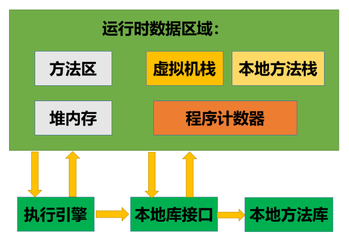
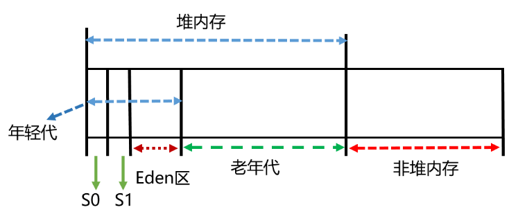
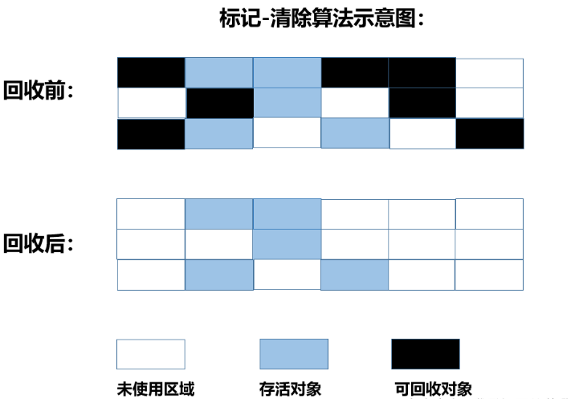
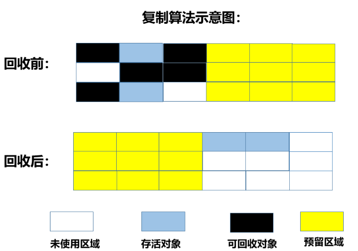
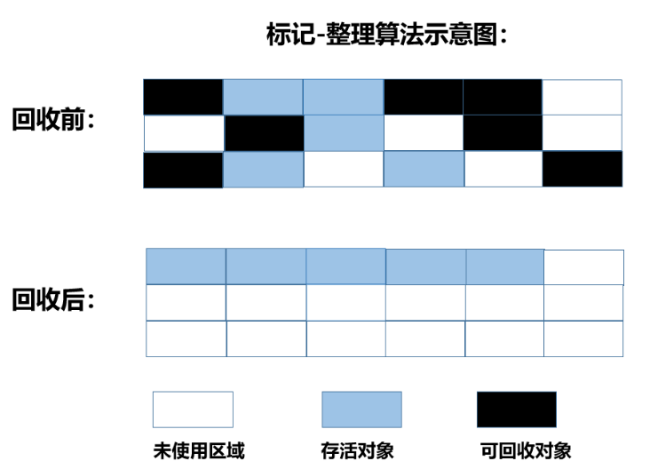
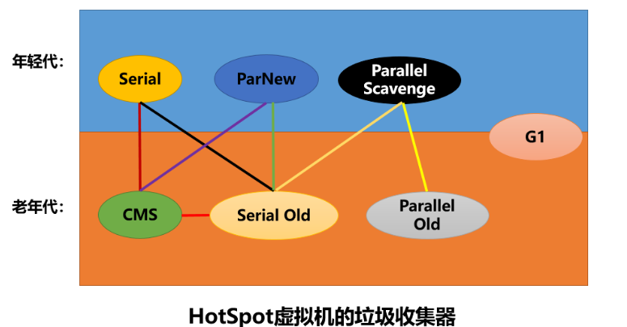
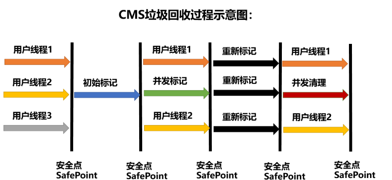
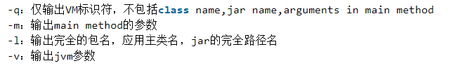
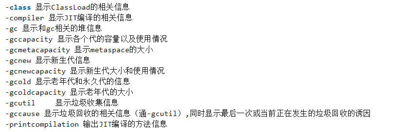
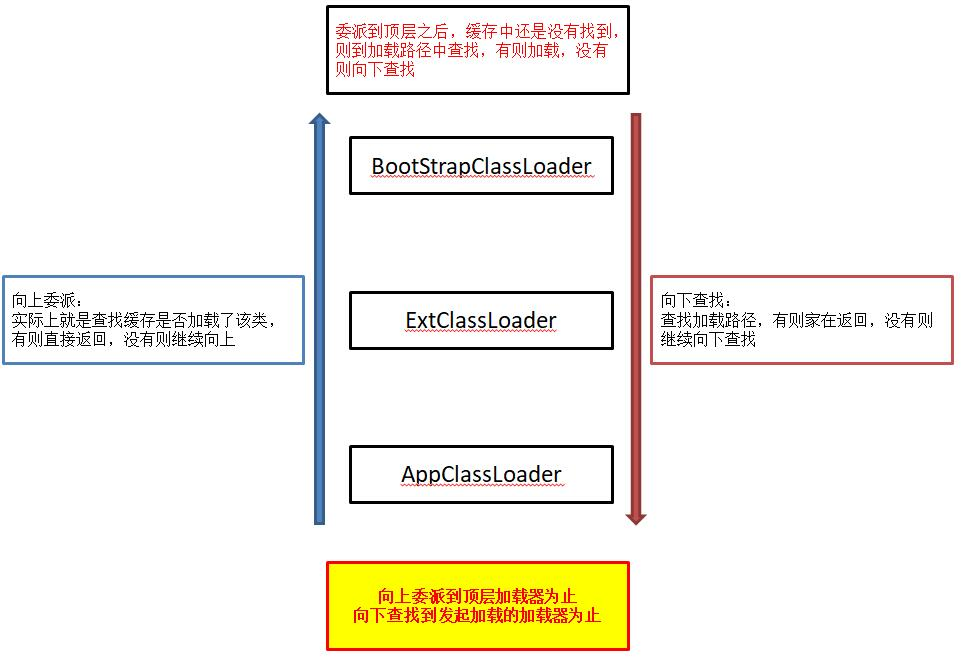

# 1. JVM 中的内存是怎么划分的？

JVM 中的内存主要划分为5个区域，即方法区、堆内存、程序计数器、虚拟机栈、本地方法栈

| 内存区域 | 描述 |
| --- | --- |
| 方法区 | 方法区是一个线程共享的区域。常量、静态变量以及 JIT 编译后的代码都在方法区。其主要用于存储已经被虚拟机加载的类信息，也称永久代。可以通过 `-XX：MaxPermSize` 来控制上限 |
| 堆内存 | 堆内存是垃圾回收的主要场所，也是线程共享的区域。主要用来存储创建的对象实例。可通过 `-Xmx 和 -Xms` 来控制大小 |
| 虚拟机栈 | 虚拟机栈内存中主要保存局部变量、基本数据类型变量以及堆内存中某个对象的引用变量。每个方法在执行的同时都会创建一个栈帧（Stack Frame）用于存储局部变量表、操作数栈、方法出入口信息等。栈中的栈帧随着方法的进入和退出有条不紊的执行着入栈和出栈的操作 |
| 程序计数器 | 程序计数器是当前线程执行的字节码的位置指示器。字节码解释器工作时就是通过改变这个计数器的值来选取下一条需要执行的字节码指令。这是内存当中唯一一个没有规定任何OutOfMemoryError的区域 |
| 本地方法栈 | 为 JVM 提供 native 方法的服务 |

# 2. 可以说一下对象创建过程中的内存分配么？

一般情况下，我们通过 new 指令来创建对象，当虚拟机遇到 new 指令的时候，会去检查这个指令的参数能否在常量池中定位到某个类的符号引用，并且检查这个符号引用的代表类是否已经被加载、解析和初始化。若没有，则会执行类加载过程。

通过执行类的加载、验证、准备、解析、初始化等步骤，完成类的加载，此时就会为该对象进行内存分配，即把一块确定大小的内存从Java堆中划分出来，在所分配的内存上完成对象的创建工作。

## 对象的内存分配的两种方式

* 指针碰撞方式：
假设Java堆中的内存是绝对规整的，用过的内存在一边，未使用的内存在一边，中间有一个指示指针，那么所有的内存分配就是把这个指针向空闲内存的方向移动一段与要创建的对象大小相等的一段区域。

* 空闲列表方式：
如果Java堆内存中不是规整的，已使用和未使用的内存相互交错，那么虚拟机就必须维护一个列表来记录哪一块内存是可用的，在分配内存的时候通过查表的方式找到一块足够大的空间来分配对象实例，并更新列表上的记录。

注意：Java堆内存是否规整是由所使用的垃圾收集器是否拥有压缩功能来决定的。

## 内存的分配如何保证线程安全？

* 对分配内存空间的动作进行同步处理，通过CAS + 失败重试的方式保证更新指针操作的原子性。
* 把分配内存的动作按照线程分配在不同的空间之中，即预先给每一个线程都划分一小段的内存空间，称为本地线程分配缓存 (TLAB)，只有当 TLAB 用光并重新分配 TLAB 的时候，才需要同步锁定。虚拟机是否使用 TLAB 可以通过 `-XX: +/-UserTLAB` 参数来确定。

# 3. 对象被访问到的时候是如何被找到的？

当创建一个对象的时候，栈内存中会有一个引用变量。指向堆内存中的某个对象实例。

Java虚拟机中并没有规定这个引用变量应该以何种方式去访问和定位堆内存中的具体对象，目前常见的对象访问方式有两种：句柄访问和直接指针访问

* 句柄访问：
在JVM堆内存中划分一块区域作为句柄池，句柄中包含了对象实例数据与类型数据各自的具体地址信息。引用变量中存储的就是对象的句柄地址。句柄访问方式不直接，访问速度较慢。

* 直接指针访问：
引用变量中存储的就是对象的直接地址，通过指针可以直接访问对象。直接指针访问方式节省了一次指针定位的时间开销，速度较快。HotSpot虚拟机采用直接指针方式进行对象的访问。

# 4. 内存分配与垃圾回收

JVM的内存可以分为堆内存和非堆内存，其中堆内存又可以分为老年代和年轻代，其中年轻代又可以进一步分为一个 Eden(伊甸园区) 和两个 Survivor(幸存区)。

## JVM堆内存的分配

JVM初始分配的堆内存由 `-Xms` 指定，默认为物理内存的1/64；JVM最大分配的堆内存由 `-Xmx` 指定，默认为物理内存的1/4。

默认当空余的堆内存小于40%时，JVM就会增大堆直到 -Xmx 的最大限制；当空余的堆内存小大于70%时，JVM就会减少堆直到 -Xms 的最小限值。因此，我们一般设置 -Xms 与 -Xmx 相等，以避免在每一次GC之后都调整堆的大小。

通过参数 `-Xmn2G` 可以设置年轻代的大小为2G。通过参数 `-XX:SurvivorRatio` 可以设置年轻代中伊甸区与幸存区的比值（设置为8就表示伊甸区：幸存区from：幸存区to = 8：1：1）

## JVM非堆内存的分配

JVM使用 `-XX:PermSize` 设置非堆内存初始值，默认为物理内存地址的1/64；

使用 `-XX:MaxPermSize` 设置最大非堆内存的大小，默认为物理内存的1/4

## 堆内存上对象的分配与回收

我们创建的对象会优先在Eden区分配，如果是较大的对象则可以直接进入老年代存放。虚拟机提供一个 `-XX:PretenureSize Threshold` 参数，当对象大于该阈值时，就直接在老年代中分配，以避免在 Eden 区和 Survivor 区发生大量的内存拷贝。

长期存活的对象将进入老年代，每一次的 MinorGC，进入幸存区的对象的年龄就+1。通过参数 `-XX:MaxTenuring Threshold` 可以设置晋升年龄，默认为15。

## 堆内存上的对象回收(垃圾回收)

垃圾回收主要是完成清理对象，整理内存的工作，主要分为年轻代区域发生的 MinorGC 以及老年代发生的 FullGC。

* Minor GC：
对象优先在 Eden 区域中分配，当 Eden 区空间不足时，虚拟机将发生一次 Minor GC。因为 Java 大多数对象都是朝生夕灭的，故 Minor GC 发生非常频繁，速度也很快。

* Full GC：
当老年代没有足够的空间时就会发生 Full GC，发生 Full GC 一般都会伴随着一次 Minor GC。

### 动态对象年龄判断

如果 Survivor 空间中相同年龄所有对象的大小总和大于 Survivor 空间的一半，则所有年龄大于该年龄的对象就可以晋升到老年代而不必等到阈值年龄。

### 空间分配担保

发生 Minor GC 时，虚拟机会检测之前每一次晋升到老年代的对象的平均大小是否大于老年代的剩余空间大小。如果大于，则进行一次 Full GC；如果小于，则首先查看 HandlePromitionFailure 设置是否允许担保失败，如果允许，则只会进行一次 Minor GC，若不允许，则进行一次 Full GC。

# 5. JVM如何判断一个对象是否应该被回收？

判断一个对象是否应该被回收，主要看该对象是否还有引用。判断对象是否还存在引用的方法包括引用计数法、root根搜索法

## 引用计数法

一种古老的回收算法。某对象有一个引用，就增加一个计数；删除一个引用，就减少一个计数。

垃圾回收时，只需要回收计数为 0 的对象。

该算法的致命问题是无法处理循环引用问题

## root 根搜索法

该方法的基本思路就是通过一系列的可以作为 root 的对象作为起始点，以这些节点为根向下搜索。若一个对象没有任何 root 节点向下搜索的引用时，则证明该对象是可以被回收的。

以下对象会被认为是 root 对象：

* 栈内存中引用的对象
* 方法区中静态引用和常量引用指向的对象
* 被启动类加载的类和创建的对象
* native 方法中 JNI 引用的对象

注意：可达性算法中的不可达对象不是立即死亡的。对线被系统宣告死亡要经历两次标记过程：

1. 经可达性计算发现没有与 GC root 相连接的引用链
2. 在虚拟机自动建立的 Finalizer 队列中判断是否需要执行 finalize() 方法

当对象不可达时，GC 首先会判断该对象是否覆盖了 finalize() 方法，若未覆盖，则直接回收；否则，若对象未执行过 finalize() 方法（每个对象只能触发一次），则将其放入 Finalizer 队列，由一低优先级线程执行该队列中对象的 finalize() 方法。执行完毕后，GC 会在此判断对象是否可达，若不可达，执行回收；否则的对象复活

由于 finalize() 方法运行代价高，不确定性大，无法保证各个对象的调用顺序，故不推荐使用。

# 6. 对象的引用

如果 reference 类型的数据中存储的数值代表的是另外一块内存的起始地址，就称这块内存代表一个引用。

JDK1.2 以后将引用分为强引用、软引用、弱引用和虚引用四种。

* 强引用：只要强引用存在，垃圾收集器就永远不会回收掉被引用的对象
* 软引用：通过 SoftReference 类来实现软引用，当内存不足时，软引用会被垃圾回收
* 弱引用：通过 WeakReference 类来实现弱引用，每一次垃圾回收都会回收掉弱引用
* 虚引用：又称为幽灵引用或幻影引用，通过 PhantomRefeence 类实现。设置虚引用只是为了对象被回收时会收到一个系统通知。（典型体现：释放直接内存所分配的内存）

# 7. JVM的垃圾回收算法有哪些？

HotSpot 虚拟机采用 root根搜索方法 来进行内存回收，常见的算法有标记-清除算法、复制算法、标记-整理算法

年轻代 GC 一般采用复制算法；老年代 GC 采用标记-清除和标记-清理算法。

## 标记-清除算法(Mark-Sweep)

标记-清除算法执行分两个阶段：

* 第一阶段从引用根节点开始标记所有被引用的对象
* 第二阶段遍历整个堆，把未标记的对象清除

此算法需要暂停整个应用(STW)，并且会产生内存碎片。

## 复制算法

复制算法将内存空间划分为两个相等的区域，每次只使用其中一个区域。

垃圾回收时，遍历当前正在使用的区域，把正在使用的对象复制到另一个区域当中。

复制算法每次只处理正在使用中的对象，因此复制成本较小，同时该算法将对象复制过去之后还可以进行相应的内存整理，不会出现“碎片”问题。

该算法的缺点就是需要两倍的内存空间。

## 标记-整理算法

标记-清理算法整合了标记-清除算法和复制算法的优点，同样分为两阶段：

* 第一阶段从根节点开始标记所有的被引用对象
* 第二阶段遍历整个堆，清除未标记对象并把存活的对象“压缩”到堆中的一块，顺序排放。

此算法避免了标记-清除算法的“碎片问题”，同时也解决了复制算法“空间占用”的问题。

# 8. JVM中的垃圾收集器有了解么？

JVM中的垃圾收集器主要包括7种：Serial, Serial Old, ParNew, Parallel Scavenge, Parallel Old, CMS, G1

## Serial

Serial 是一个单线程的垃圾收集器，在执行垃圾回收的时候需要Stop The World。

Serial 是当虚拟机运行在Client模式下时默认采用的新生代收集器。

Serial 的优点是简单高效，对于限定的单个CPU环境来说，Serial 收集器没有多线程交互的开销。

## Serial Old

Serial Old 是 Serial 的老年代版本，同样是一个单线程收集器。

Serial Old 主要也是给Client模式下的虚拟机使用。

在 Server 模式下存在主要是作为 CMS 垃圾回收器的后备预案，当 CMS 并发收集发生 Concurrent Mode Failure 时使用

## ParNew

ParNew 是 Serial 收集器的多线程版本

其新生代收集是并行的(多线程)，采用复制算法；老年代收集是串行的(单线程)，采用标记-整理算法。

可以使用 `-XX:UserParNewGC` 指令使用该收集器；使用 `-XX:ParallelGCThreads` 限制线程数量。

## Parallel Scavenge

Parallel Scavenge 是一种新生代收集器，使用复制算法，是并行的多线程收集器。

Parallel Scavenge 的特点是更加关注吞吐量（吞吐量理解为cpu用于执行用户代码的时间与cpu总消耗时间的比值）。

可以通过 `-XX:MaxGCPauseMilis` 参数控制最大垃圾收集停顿时间；通过 `-XX: GCTimeRatio` 参数直接设置吞吐量大小； 通过 `-XX:+UseAdaptiveSizePolicy` 参数可以打开GC自适应调节策略。

GC自适应调节策略是 Paraller Scavenge 与 ParNew 的主要区别之一，该参数开启后虚拟机会根据系统的运行情况收集性能监控信息，动态的调整虚拟机参数以提供最合适的停顿时间或者最大的吞吐量。

## Parallel Old

Parallel Old 是 Parallel Scavenge 收集器的老年代版本，使用多线程和标记-整理算法。

## CMS(Concurrent Mark Sweep) ★

CMS 收集器是一种以获取最短回收停顿时间为目标的收集器，基于标记-清除算法实现，是一种老年代收集器，通常与 ParNew 一起使用。

### CMS 收集器的垃圾回收过程

1. 初始标记：需要 STW，初始标记仅仅是标记一下 GC root 可以直接关联到的对象，速度很快。
2. 并发标记：这是主要的标记过程，该过程与用户线程并发执行。
3. 重新标记：需要STW，为了修正并发标记器件因用户线程继续运行导致标记变动的那一部分对象的标记记录。
4. 并发清除：和用户线程并发执行，基于标记结果来清理对象。

### 如果在重新标记之前刚好发生了一次MinorGC，会不会导致重标记阶段的STW时间太长？

不会。在并发标记阶段其实还包括了一次并发的预清理阶段，虚拟机会主动等待年轻代发生垃圾回收，这样就可以将重新标记对象的引用关系的步骤放在并发标记阶段，有效降低重标记阶段的STW。

### CMS 垃圾回收器的优缺点分析

CMS 以降低垃圾回收的停顿时间为目的，具有并发收集，停顿时间低的优点。

缺点主要包括：

* 对CPU资源敏感，并发标记与并发清理阶段与用户线程一起运行，当CPU数较小是，性能容易出现问题

* 收集过程中会产生浮动垃圾。不可以在老年代的内存不够用的时候才进行垃圾回收，必须提前进行垃圾收集。
可以通过参数 `-XX:CMSInitiatingOccupancyFraction` 的值来控制内存使用的百分比。如果该值设置的过高，那么 CMS 运行期间预留的内存可能无法满足程序的需要，会出现 Concurrent Mode Failure，之后就会使用 Serial Old 作为老年代收集器，这将导致更长时间的停顿。

* 标记-清除算法会产生内存碎片。
可以使用 `-XX:UseCMSCompactAtFullCollection` 来控制是否开启内存整理（无法并发，默认开启）。
参数 `-XX:CMSFullGCsBeforeCompaction` 用于设置执行多少次不压缩的 FullGC 后就要进行一次带压缩的内存碎片整理（默认为0）。

### 浮动垃圾

由于在清理阶段垃圾回收是与用户进程并发执行，所以有些垃圾可能会在回收完成的时候产生，即所谓的Floating Garbage，这些垃圾需要在下次垃圾回收的时候才能被清理。

所以，并发收集器一般需要20%的预留空间用于这些浮动垃圾。

## G1(Garbage-First)

G1 取消了新生代和老年代，而是将堆划分为若干的区域，但其仍然属于分代收集器，区域的一部分包含新生代，新生代采用复制算法，老年代采用标记-整理算法。

通过将JVM堆内存划分成一个个的区域(region)，G1 可以避免在 Java 堆中进行全区域的垃圾收集。G1 会根据各个 region 内的垃圾堆积的价值大小（回收所获得的的空间大小以及回收所需时间的经验预估值），在后台维护一个优先列表，每一次都优先回收价值最大的region。

G1 收集器的特点：

* 并行与并发：G1 能充分利用多 CPU、多核环境下的硬件优势以缩短 STW，是并发的收集器
* 分代收集：G1 不需要其他收集器就可以独立管理整个GC堆，能够采取不同的方式去处理新建对象、存活一段时间的对象以及熬过多次GC的对象
* 空间整合：G1 从整体来看属于标记-整理算法；从局部上看是基于复制算法。G1 运作期间不会产生内存空间碎片。
* 可预测的停顿：能够建立可以预测的停顿时间模型，预测停顿时间

与 CMS 类似，G1 的垃圾回收工作也分为四个阶段：

* 初始标记
* 并发标记
* 最终标记
* 筛选回收：该阶段首先对各个 region 的回收价值和成本进行预估计算，根据用户期望的GC停顿时间来制定回收计划

# 9. JVM 常用的内存调优命令

JVM 在内存调优方面，提供了几个常用命令，分别为 jps、jinfo、jstack、jmap、jstat

* jps：主要用来输出 JVM 中运行的进程状态信息。一般使用 jps 命令来查看进程的状态信息，包括 JVM 启动参数等

* jinfo：主要用来观察进程环境参数等信息
* jstack：主要用来查看某个 Java 进程内的线程堆栈信息。`jstack pid` 可以看到当前进程中各个线程的状态信息，包括其持有的锁和等待的锁
* jmap：用来查看堆内存的使用情况。`jmap -heap pid` 可以看到当前进程的堆信息和使用的GC收集器，包括年轻代和老年代的大小分配等
* jstat：进行实时命令行的监控，包括堆信息以及实时GC信息等。可以使用 `jstat -gcutil pid1000` 来设置每隔一秒查看当前的GC信息

# 10. JDK8在内存管理上的变化

JDK8中出现了元空间代替了永久代。元空间与永久代类似，都是对 JVM 规范中方法区的实现。其区别在于元空间不在虚拟机中，而是使用本地内存，默认情况下元空间的大小收本地内存的限制。可以通过 `-XX:MetaspaceSize` 指定元空间的大小。

## 为什么要使用元空间代替永久代

字符串在永久代中，容易出现性能问题和内存溢出问题。永久代的大小指定困难，太小容易出现永久代溢出。元空间则使用本地内存。

# 11. Java中的类加载机制

## Java中的类加载机制有了解么？

Java 中的类加载机制指虚拟机吧描述类的数据从 Class 文件加载到内存，并对数据进行校验、转换、解析和初始化，最终形成可以被虚拟机直接使用的 Java 类型的过程。

类从被加载到内存到卸载出内存为止，其整个生命周期包括加载、验证、准备、解析、初始化、使用、卸载7个阶段。类加载机制包含前五个阶段。

### 加载

加载是指将类的 .class 文件中的二进制数据读取到内存当中，将其放在运行时数据区的方法区内，然后在堆中创建一个 java.lang.Class 对象，用来封装类在方法区内的数据结构。

### 验证

验证的作用是确保被加载的类的正确性，包括文件格式验证，元数据验证，字节码验证以及符号引用验证。

### 准备

准备阶段是为类的静态变量分配内存，并将其初始化为默认值。

（假设一个类变量的定义为public static int val = 3;那么变量val在准备阶段过后的初始值不是3而是0。）

### 解析

解析阶段将类中的符号引用转换为直接引用。

符号引用以一组符号来描述所引用的目标，只要使用时能够无歧义的定位到目标即可。

### 初始化

初始化阶段为类的静态变量赋予正确的初始值。JVM 负责对类进行初始化，主要对类变量进行初始化。

## 类加载器的分类有哪些？

* 启动类加载器(Bootstrap ClassLoader)
启动类加载器负责加载存放在 `JDK\jre\lib`下（JDK代表JDK安装目录）或被 `-Xbootclasspath` 参数指定的路径中的类

* 扩展类加载器(ExtClassLoader)
扩展类加载器负责加载 `JDK\jre\lib\ext` 目录下或者由 `java.ext.dirs` 系统变量指定的路径中的所有类库（如 javax.* 开头的类）

* 应用类加载器(AppClassLoader)
应用类加载器负责加载`用户路径 ClassPath` 中所指定的类，开发者可以直接使用该类加载器。

## 类加载器的职责有哪些？

* 全盘负责：
当一个类加载器负责加载某个 class 时，该 class 锁依赖和引用的其他类也由该类加载器负责载入，除非显式的使用另外一个类加载器来载入。

* 父类委托：
类加载机制优先让父类加载器尝试加载该类，只有当父类加载器无法加载该类是才尝试从自己的类路径中加载该类。
父类委托机制是为了防止内存中出现多份同样的字节码，以保证 java 程序安全稳定的运行。

* 缓存机制：
缓存机制保证所有加载过的 class 都会被缓存。
当程序中需要使用某个 class 时，优先从缓存区中寻找该 class，只有当缓存区不存在时，系统才会读取该类对应的二进制数据，并将其转换为 Class 对象，存入缓存区。

## 双亲委派机制

双亲委派模型的好处：
1. 提高了安全性，避免用户自己编写的类动态替换 Java 的核心类，比如 String
2. 避免了类的重复加载，JVM 中区分不同的类，是依靠全类名和类加载器共同判断的，相同的 .class 文件被不同的类加载器加载就是两个不同的类

