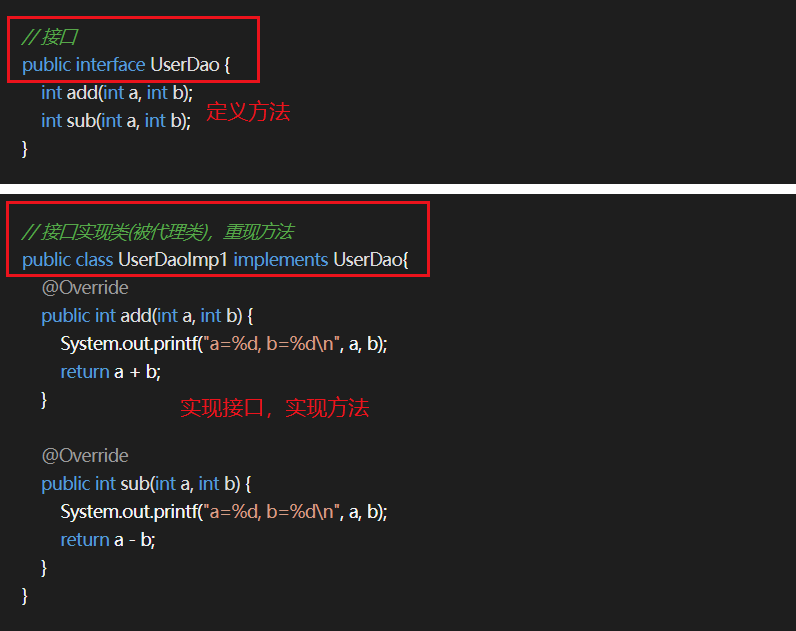

# 0. Spring 是什么？

Spring 是一个轻量级的控制反转和面向切面的容器框架。

* 从大小和开销两方面来说 Spring 都是轻量级的
* 通过控制反转 IOC 技术可以达到松耦合的目的
* 通过面向切面编程 AOP 可以分离应用的业务逻辑并对系统级服务进行内聚性开发
* Spring 管理应用对象 Bean 的配置和生命周期，在这个角度来说它是一个容器
* Spring 将简单的组件配置组合为复杂的应用，在这个角度来说它是一个框架

# 1. 说一下 Spring 中的控制反转(IOC)

IOC又称**控制反转，是将对象间的依赖关系交给 Spring 容器进行管理**，使用**配置文件/注解**来创建依赖的对象，有主动创建对象改为了被动的方式，实现**解耦合**。

## 如何实现一个IOC容器

1. 使用配置文件配置包扫描路径
2. 从配置文件中获取需要扫描的包的路径，将当前路径下的所有 .class 文件添加到一个 Set 中进行存储
3. 遍历这个 Set 集合，获取在类上有指定注解的类，将其交给 IOC 容器，定义一个安全的 Map 来存储这些对象
4. 遍历 IOC 容器，获取每一个类的实例，判断依赖进行注入

# 2. Spring 中的面向切面编程(AOP)有了解么

AOP即**面向切面编程**，指当需要在一个方法执行的前后需要做一些额外的功能（如日志记录、权限判断、异常统计）时，可以利用 AOP **将功能代码从业务逻辑中分离出来**。

## AOP操作术语

* **Joinpoint(连接点)** ：类中可以被增强的方法，称连接点
* **Pointcut(切入点)** ：实际上被真正增强的方法，称切入点
* **Advice(通知/增强)** ：方法中实际增强的逻辑部分，称通知/增强
* **Aspect(切面)** ：将通知应用到切入点的过程，称切面

## Spring 中 AOP 的实现方式

### JDK 动态代理

只能对**实现了接口的类**生成代理。其并不是针对某一个类，而是将目标类型实现的所有接口全部代理。

其原理是通过在运行期间创建一个接口的实现类来完成对目标对象的代理。

基本步骤：

* 首先创建接口并创建实现该接口的类，即实际被代理的类
* 定义一个实现 InvocationHandler 接口的类    
	* 在该类中通过构造器的方式注入要被代理的类的实例
    * 实现 invoke 方法，进行增强

* 通过 Proxy.newProxyInstance 方法创建代理对象    
	* 参数1：类加载器
    * 参数2：被代理接口集
    * 参数3：处理器
* 使用代理对象调用各种方法

示例：

### cglib

**cglib 主要针对类实现代理，对其是否实现接口无要求。**

其原理是对指定的类生成一个子类，覆盖其中的方法。因为是继承，所以被代理的类或者方法不币可以声明为 final 类型。

基本步骤：
* 创建一个普通的类作为代理类
* 创建多个类实现 MethodInterceptor 接口    
	* 重写 intercept 方法，编写增强逻辑
    * 在 intercept 中调用 proxy.invokeSuper 执行原生方法的逻辑
* 创建一个类实现 CallbackFilter 接口作为回调拦截器，重写 accept 方法指定对应的调用
* 实例化一个 Enhancer 类对象    
	* 使用 setSuperclass 方法设置要代理的父类
    * 使用 setCallbacks 方法设置回调的拦截器数组
    * 使用 setCallbackFilter 方法设置回调选择器
    * 使用 create 方法创建代理对象
* 使用代理对象调用各种方法

示例：

## Spring 对于两种代理方式的选择

* 如果目标对象实现了接口，默认情况下会采用 JDK 的动态代理实现 AOP，但也可以强制使用 cglib 实现
* 如果目标对象没有实现接口，必须采用 cglib 库，Spring 会自动在 JDK 动态代理和 cglib 之间转换

# 3. IOC 容器的初始化过程

IOC 容器的初始化主要包括 **Resource定位、载入和注册**三个步骤

* **Resource资源定位**

Resource 定位指 BeanDefinition 的资源定位，即 IOC 容器寻找数据的过程。

Spring 使用外部资源来描述一个 Bean 对象，IOC 容器第一步就是定位 Resource 的外部资源。

该过程由 ResourceLoader 通过统一的 Resource 接口完成定位。

* **BeanDefinition载入**

载入过程即将一个定义好的 Bean 封装成 IOC 容器内部的数据结构 BeanDefinition。

配置文件中的每一个 Bean 都对应着一个 BeanDefinition 对象。

该过程通过 BeanDefinitionReader 读取，解析 Resource 定位的资源，将用户定义好的 Bean 封装成 BeanDefinition。

在 IOC 内部维护着一个 BeanDefinitionMap 的数据结构，通过该结构可以更好的管理 Bean。

* **BeanDefinition注册**

注册即将 BeanDefinition 保存到 BeanDefinitionMap 的过程。

该过程通过 BeanDefinitionRegistry 接口实现。
注意：

IOC 容器的初始化过程并不会对 Bean 进行依赖注入。

lazy-init=false：表示不开启延迟加载，在容器启动的时候就创建 Bean

lazy-init=true：表示开启延迟加载，只有当应用程序**第一次向容器索取Bean**时才创建，通过 getBean() 方法调用完成。

## BeanFactory 和 FactoryBean 的区别

* **BeanFactory**：**Bean工厂**，是 Spring IOC 容器的顶层接口，其作用是**管理Bean**，即实例化、定位、配置应用程序中的对象以及建立对象间的依赖。
* **FactoryBean**：**工厂Bean**，是一个 Bean，其作用是**产生其他的Bean实例**。其需要提供一个工厂方法，该方法返回其他 Bean 实例。

## BeanFactory 和 ApplicationContext 有什么区别？

* **BeanFactory**：
Spring 中最顶层的接口，是 IOC 的基本实现。
**采用延迟加载来注入Bean**，加载配置文件时不会创建对象，在获取对象(使用)时才去创建对象。这样带来的问题就是不能发现一些存在于 Spring 配置中的问题，如果某个 Bean 没有注入成功，只有当调用它时才会抛出异常。

* **ApplicationContext**：
ApplicationContext 在**容器启动时，一次性创建了所有 Bean**。这样就可以发现 Spring 中存在的配置错误。
ApplicationContext 是 BeanFactory 的子接口，它除了 BeanFactory 所具有的功能外，还提供了更完整的框架功能。    
	* 支持国际化
	* 提供了统一的资源文件的访问方式
	* 提供Listener中注册Bean的事件
	* 提供同时加载多个配置文件的功能
	* 载入多个有继承关系的上下文

## ApplicationContext 的常见实现方式

* **FileSystemXmlApplicationContext**：
此容器从一个 XML 文件中加载 Bean 的定义，XML Bean 配置文件中需要提供的 Bean 的全路径名

* **ClassPathXmlApplicationContext**：
此容器也从一个 XML 文件中加载 Bean 的定义，需要正确设置 classpath。

* **WebXmlApplicationContext**：
此容器加载一个 XML 文件，定义了一个 WEB 应用的所有 Bean

## BeanFactory和ApplicationContext的优缺点分析

* **BeanFactory**
    * 优点：应用启动时占用的资源少，对资源要求较高的应用比较有优势
    * 缺点：运行速度相对较慢，且有可能出现空指针异常错误；通过 Bean 工厂创建的 Bean 生命周期相对简单

* **ApplicationContext**
    * 优点：所有的 Bean 在启动时进行加载，系统运行时速度快；在启动的时候就可以发现系统中的配置问题
    * 缺点：所有的 Bean 全部预加载，内存占用较大
	
# 4. Spring Bean 的生命周期

1. 解析类得到 BeanDefinition
2. 推断构造方法（一般使用无参构造），实例化得到一个对象，并根据注解进行属性的注入
3. 回调 Aware 方法（Aware系列接口，主要用于辅助Spring bean访问Spring容器）
4. 调用 Bean 后置处理器方法 postProcessBeforeInitialization
5. 调用初始化方法
6. 调用 Bean 后置处理器方法 postProcessAfterInitialization
7. 使用 Bean
8. 调用 Bean 的销毁方法

# 5. Spring 中 Bean 的作用域有哪几种？

Spring 框架支持一下5种 Bean 的作用域：

* **singleton**：Bean 在 Spring IOC 容器中只有一个实例，默认作用域
* **prototype**：一个 Bean 的定义可以有多个实例
* **request**：每次 http 请求都会创建一个 Bean。该作用域仅在基于 web 的 Spring ApplicationContext 情形下有效
* **session**：在一个 http session 中，一个 Bean 定义对应着一个实例。该作用域仅在基于 web 的 Spring ApplicationContext 情形下有效

## 单例 Bean 是线程安全的么？

**单例 Bean 与线程安全没有必然的联系**。

大部分 Spring Bean 并没有**可变的状态**(如 Service 和 DAO，不保存具体数据，只是依赖一些其他 Bean)，所以在一定程度上可以说 Spring 的单例 Bean 是线程安全的。

如果 Bean 有多种状态(如 View Model 对象)，则需要自行保证线程安全。推荐使用 ThreadLocal。

**一般情况下，只有无状态的 Bean 才可以在多线程环境下共享，有状态的 Bean 需要自行保证线程安全**。

## 循环依赖

如果A对象创建的过程需要使用到B对象，但是B对象创建的时候也需要A对象，也就是构成了循环依赖的现象，那么Spring会如何解决？

答：这是一种**构造器循环依赖**，通过构造器注入构成的循环依赖，是**无法解决的**，只能**抛出 BeanCurrentlyInCreationException异常**表示循环依赖。

# 6. Spring 中应用了哪些设计模式？

* 简单工厂模式（不属于23种常用设计模式）：Spring 中的 BeanFactory 就是简单工厂模式的体现，根据传入一个唯一的标识来获得 bean 对象。
* 工厂模式：Spring使用工厂模式可以通过 BeanFactory 或 ApplicationContext 创建 bean 对象。
* 单例模式：Spring 中 bean 的默认作用域就是 singleton 的。
* 代理模式：Spring 中的 AOP 就是基于代理模式，有 JDK 动态代理和 cglib 两种方式。
* 适配器模式：在 Spring MVC 中，DispatcherServlet 根据请求信息调用 HandlerMapping，解析请求对应的 Handler。解析到对应的 Handler（也就是我们平常说的 Controller 控制器）后，开始由 HandlerAdapter 适配器处理。HandlerAdapter 作为期望接口，具体的适配器实现类用于对目标类进行适配，Controller 作为需要适配的类。

# 7. Spring 事务有了解么？

Spring 支持**编程式事务管理**和**声明式事务管理**。

* **编程式事务管理**：使用TransactionTemplate 实现
* **声明式事务管理**：底层使用 AOP 原理。其本质是通过 AOP 在方法的前后进行拦截，将事务处理的功能添加到拦截方法中，即在目标方法开始之前加入一个事务，执行方法之后提交或回滚事务。

## 声明式事务管理的优点

不需要在业务代码中掺杂事务管理的代码，只需要在配置文件中声明然后使用 `@Tansactional` 注解即可。

## 事务选择

声明式事务管理优于编程式事务管理，这是 Spring 倡导的**非侵入式开发方式**，可以是业务代码不受污染，只添加注解即可获得事务支持。

不足之处在于声明式事务管理的最细粒度只能作用到方法级别，而编程式事务管理可以作用到代码块级别。

## 事务传播行为

指一个被事务管理的方法在被另一个被事务管理的方法调用时，前者将如何进行。

| 传播行为 | 解释 |
| -- | -- |
| REQUIRED(默认) | 如果当前存在事务，则加入当前事务；如果当前没有事务，则自己创建一个事务 |
| SUPPORTS | 如果当前存在事务，则加入当前事务；如果当前没有事务，就以非事务方法执行 |
| MANDATORY | 如果当前存在事务，则加入当前事务；如果当前没有事务，则抛出异常 |
| REQUIRED_NEW | 创建一个新事物，若当前存在事务，则挂起该事物 |
| NOT_SUPPORTED | 以非事务方式执行，如果当前存在事务，则挂起当前事务 |
| NEVER | 不使用事务，如果当前存在事务，则抛出异常 |
| NESTED | 如果当前事务存在，则嵌套在事务中执行(子事务)，否则就自己开启一个事务 |

## Spring 事务什么时候会失效？

Spring 事务管理的原理是 AOP，那么事务失效的根本原因就是 AOP 失效，常见失效情况如下：

1. 发生自调用，类中调用本类的方法，那么意味着这个方法不是通过代理类调用，而是通过自身类调用，所以导致 AOP 失效。解决方法：在该类中注入自身。
2. 方法不是 public 修饰的
3. 数据库不支持事务（MyISAM引擎）
4. 当前类没有被 Spring 管理
5. 异常被捕获，事务不会回滚

# 8. Spring、Spring MVC 和 SpringBoot 的区别

* Spring 是一个 IOC 容器，用来管理 Bean，使用依赖注入实现控制反转，可以很方便的整合各种框架；提供 AOP 机制弥补 OOP 的代码重复问题
* Spring MVC 是 Spring 对 web 框架的一个解决方案，提供一个总的前端控制区 DispatcherServlet 用来接收请求，并定义了一整套路由策略 (url 到 handler 的映射) 以及适配器执行 handler，将 handler 的执行结果使用视图解析器生成视图展示给前端
* SpringBoot 是 Spring 提供的快速开发包，简化了配置，整个了一系列的解决方案（start 机制）

# 9. SpringMVC 的消息处理流程有了解么？

SpringMVC 是一种轻量级的 web 层框架，是一个基于请求驱动的 web 框架，使用 **前端控制器(DispatcherServlet)** 模型进行设计，再根据请求的映射规则分发给相应的页面控制器进行处理。

具体流程：

实线表示SpringMVC框架提供的技术，不需要开发者实现；虚线表示需要开发者实现

1. DispatcherServlet表示前置控制器，是整个SpringMVC的控制中心。用户发出请求，DispatcherServlet接收请求并拦截请求

假设请求的URL为`http://localhost:8080/Spring01/hello`，将被拆解为三部分

    * http://localhost:8080 表示服务器域名
    * Spring01 表示部署在服务器上的web站点
    * hello 表示控制器
	
故上述的URL表示为：请求位于服务器`http://localhost:8080上的Spring01站点的hello控制器`

2. HandlerMapping为处理器映射器。DispatcherServlet调用HandlerMapping，HandlerMapping根据请求url查找Handler。

3. HandlerExecution表示具体的Handler，其主要作用是根据url查找控制器。如上述url被查找的控制器为hello。

4. HandlerExecution将解析后的信息传递给DispatcherServlet。

5. HandlerAdapter表示处理器适配器，其按照特定的规则去执行Handler。

6. Handler让具体的Controller执行。

7. Controller将具体的执行信息返回给HandlerAdapter，如ModelAndView。

8. HandlerAdapter将视图逻辑名或模型传递给DispatcherServlet。

9. DispatcherServlet调用ViewResolver(视图解析器)来解析HandlerAdapter传递的逻辑视图名。

10. ViewResolver将解析的逻辑视图名返回给DispatcherServlet。

11. DispatcherServlet根据ViewResolver解析的视图结果，调用具体的视图。

12. 最终视图呈现给用户。

## SpringMVC的三大组件

* **处理器映射器HandlerMapping**：用户请求路径到 Controller 方法的映射
* **处理器适配器HandlerAdapter**：根据 handler(controlelr类) 的开发方式（注解开发/其他开发） 方式的不同区寻找不同的处理器适配器
* **视图解析器ViewResolver**：根据 handler 返回的 view 地址文件类型(jsp/pdf….)去寻找相应的视图解析器来进行解析

# 10. 简单说下 SpringBoot

Spring Boot 是 Spring 开源组织下的子项目，是 Spring 组件**一站式解决方案**，其省去了繁杂的配置，**提供各种 stater**。

Spring Boot 的优点包括可以独立运行、自动配置、应用监控等...

下属内容详见 SpringBoot 笔记！

## 自动配置原理

详见 微服务开发-SpringBoot-自动配置原理

## 如何理解 SpringBoot 中的 Starter

starter 就是定义一个 starter 的 jar 包，编写一个`@Configuration`配置类，将需要使用的 Bean 定义在里面，然后在 starter 包下的 META-INF/spring.factories 中写入该配置类，SpringBoot 会按照约定来加载该配置类。

开发人员只需要将相应的 starter 包依赖引入应用，进行相应的配置，就可以直接进行代码开发，使用相应的功能，比如 mybaties-spring-boot-starter、spring-boot-starter-redis...

