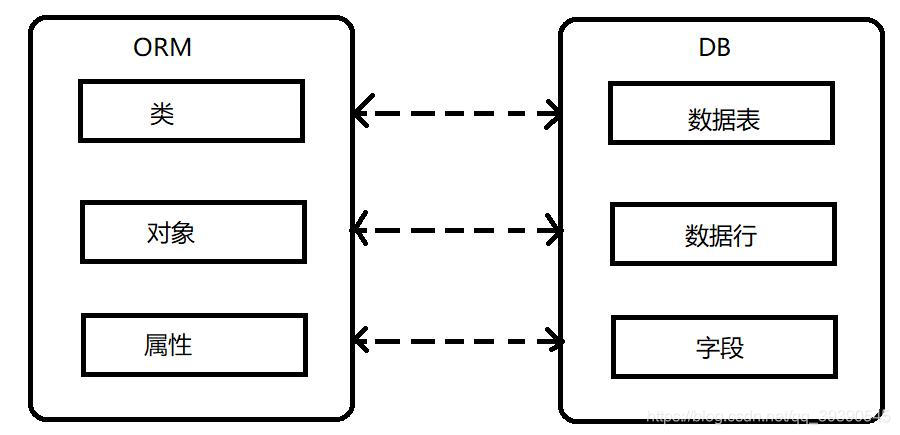

# 1. MyBatis 是什么？

MyBatis 是一个半ORM（对象关系映射）框架，其内部封装了 JDBC，开发是只需要关注 SQL 语句本身，不需要花费精力去处理加载驱动、创建连接、创建 statement 等复杂的过程。

通过直接编写原生态 SQL，可以严格控制 SQL 语句的执行性能，支持动态 SQL，灵活度高。

MyBatis 使用 XML 或注解来配置和映射原生信息，将实体类映射成数据库中的记录，避免了 JDBC 代码手动设置参数以及获取结果集的繁琐步骤。

MyBatis 通过 XML 或注解将要执行的各种 statement 进行配置，通过 Java 对象和 statement 中的动态参数进行映射并最终形成执行的 SQL 语句。最后由 MyBatis 框架执行 SQL 语句，并将结果映射为 Java 对象返回。

### ORM 框架



ORM (Object Relational Mapping) 即对象关系映射，其主要实现对象到关系型数据库数据的映射。

因为原生的 JDBC 方式效率低，且需要写一大堆模板代码。ORM 是对 JDBC 的封装，我们可以直接使用，不需要重复的造轮子。

目前比较常见的 ORM 框架有 MyBatis、Hibernate、JPA 等...

## MyBatis 的优缺点

优点：
* 基于 SQL 语句编程，十分灵活；SQL 语句写在 XML 文件中，解除 SQL 与业务代码的耦合，便于统一管理；提供 XML 标签，支持编写动态 SQL ，可重用
* 与 JDBC 相比，消除了大量冗余的代码，不需要手动开关连接
* 可以很好的与各种数据库兼容
* 可以很好地与 Spring 集成

缺点：
* SQL 编写工作量大，对开发人员的 SQL 功底有一定要求
* SQL 语句依赖数据库，故数据库移植性差，不能随意更换

## MyBatis 和 Hibernate 的对比

MyBatis 和 Hibernate 都支持 JDBC 和事务，两者都可以通过 SessionFactoryBuilder 由 XML 配置文件生成 SessionFactory，然后由SessionFactory 生成 Session，由 Session 来开启和执行事务和 SQL 操作。

* 针对简单逻辑，Hibernate 和 MyBatis 都有相应的代码生成工具，可以生成简单基本的 DAO 层方法。
* 针对高级查询，Mybatis 需要手动编写 SQL 语句，以及 ResultMap；而 Hibernate 有良好的映射机制，开发者无需关心 SQL 的生成与结果映射，可以更专注于业务流程。Hibernate 也可以自己写 SQL 来指定需要查询的字段，但这样就破坏了 Hibernate 开发的简洁性。

举个形象的比喻：
* Mybatis：机械工具，使用方便，拿来就用，但工作还是要自己来作，不过工具是活的，怎么使由我决定。
* Hibernate：智能机器人，但研发它（学习、熟练度）的成本很高，工作都可以拜托他了，但仅限于它能做的事。

# 2. 说一下 MyBatis 的原理和工作流程
1. 读取 MyBatis 配置文件：mybatis-config.xml 提供 MyBatis 的全局配置文件
2. 加载映射文件xml：加载 SQL 映射文件，该文件配置了操作数据库的 SQL 语句
3. 构造会话工厂：通过配置信息构造会话工厂 SqlSessionFactory
4. 创建会话对象：由 SqlSessionFactory 创建 SqlSession 对象，该对象包含执行 SQL 语句的所有方法
5. Executor 执行器：MyBatis 底层定义了一个 Executor 接口来操作数据库，它将根据 SqlSession 提供的参数动态的生成需要执行的 SQL 语句，同时负责查询缓存的维护
6. MappedStatement 对象：在 Executor 接口的执行方法中有一个 MappedStatement 类型的参数，该参数封装映射信息，存储要映射的 SQL 语句的 id、参数等信息
7. 输入参数映射：输入参数类型可以是 Map、List 等集合类型，也可以是基本数据类型和 POJO 类型。输入参数映射过程类似于 JDBC 对 preparedStatement 对象设置参数的过程
8. 输出参数映射：输出结果类型可以是 Map、 List 等集合类型，也可以是基本数据类型和 POJO 类型。输出结果映射过程类似于 JDBC 对结果集的解析过程

图示：


## 列举几个 MyBatis 的核心组件，并解释一下用处
| 组件 | 功能 |
| --- | --- |
| SqlSessionFactory | 根据配置文件构造会话工厂 SqlSession |
| SqlSession | MyBatis 的顶层 API，用于和数据库交互的会话，完成必要的数据库增删改查功能 | 
| Executor | MyBatis 执行器，是调度核心，负责 SQL 语句的生成和查询缓存的维护 | 
| MappedStatement | 维护一条`<insert>/<update>/<delete>/<select>`节点的封装 |


# 3. MyBatis 的动态 SQL 有了解么？

MyBatis 可以在 xml 映射文件中以标签的形式实现动态 SQL，其原理是根据表达式的值完成逻辑判断并动态拼接 SQL 语句。

### 动态 SQL 标签

* if：单条件分支的判断语句
* choose, when, otherwise：多条件的分支判断语句
* foreach：列举条件，遍历集合，实现循环语句
* trim,where,set：是一些辅助元素，可以对拼接的SQL进行处理
* bind：进行模糊匹配查询的时候使用，提高数据库的可移植性

# 4. Mybatis 的 Mapper 中常用标签有哪些？

* | select | insert | update | delete |
* | resultMap | resultType |
* | where | if | foreach | sql |

# 5. MyBatis 的 DAO 接口的工作原理有了解么？

DAO 接口即 Mapper 接口。接口的全限名就是映射文件中 namespace 的值；接口的方法名，就是映射文件中的 id 值；接口方法内的参数，就是传递给 SQL 的参数。

Mapper 接口没有实现类，调用接口方法的时候，使用接口全限名 + 方法名拼接字符串作为 key 值，可唯一定位一个 MapperStatement。在 MyBatis 中，每一个`<select>、<insert>、<update>、<delete>`标签，都会被解析为一个 MapperStatement对象。

Mapper 接口的工作原理是 JDK 动态代理，MyBatis 运行时会使用 JDK 动态代理为 Mapper 接口生成代理对象 proxy，代理对象会拦截接口方法，转而执行 MapperStatement 所代表的 SQL，然后将 SQL 执行结果返回。

## DAO 接口中的方法可以重载么？

不可以。因为 xml 文件中使用的是全限名 + 方法名的保存和寻找策略。

## 不同映射文件 xml 中的 id 可以重复么？

如果配置了 namespace，那么 id 可以重复； 如果没有配置，则不可以重复。

## MyBatis 都存在哪些映射形式？
1. sql 列别名，将列的别名定义为对象的属性名，使查询返回结果列名与实体类的属性名保持一致，缺点是不方便维护。
2. 使用 resultMap 标签，逐一定义查询返回结果的列明与对象属性名之间的映射关系，处理起来比较清晰，但相对麻烦。

示例：
```sql
<resultMap type="com.xxxx.entity.Task" id="task">
	<id column="taskId" property="id"/>
	<result column="create_by" property="createBy"/>
	<result column="create_time" property="createTime"/>
	<result column="update_by" property="updateBy"/>
	<result column="update_time" property="updateTime"/>
</resultMap>
```

## MyBatis 的接口绑定是什么？有哪些方式？

接口绑定即 MyBatis 代理 DAO 接口，将接口里的方法和 xml 映射文件中 SQL 语句绑定。我们在使用的时候直接调用接口方法即可。

* 在接口上直接使用`@Select/@Update`等包含 sql 语句的注解来绑定，适用于 sql 语句比较简单的情况。
* Mapper 标签绑定，使用`<namespace> + <id>`对接口进行唯一绑定。

# 6. MyBatis 中 # 和 $ 的区别

能用 # 就尽量不用 $

* \# 是预编译处理，是占位符；$ 是字符串替换，是拼接符
* Mybatis 在处理 # 时，会将 sql 中的 \# 替换为 ？，并调用 PreparedStatement 来赋值；在处理 $ 时，就是把 $ 替换成变量的值，调用 Statement 来赋值
* \# 变量替换替换后，对应的变量会自定添加单引号；$ 变量替换后，对应变量不会添加单引号
* \# 一般用于拼接查询参数；$ 一般用于拼接数据库对象，如表名等
* 使用 \# 可以有效防止 SQL 注入，提高系统安全性

# 7. MyBatis 的缓存机制有了解么？

### 一级缓存
一级缓存是 SqlSession 级别的缓存。在操作数据库是需要构造 sqlSession 对象，该对象中存在一个数据结构用于存储缓存数据。不同的 sqlSession 中缓存数据的区域互不影响。

用户发起查询请求，sqlSession 会先从缓存中查找，如果命中缓存则立即返回，如果没有就执行数据库查询，将查询数据放入一级缓存并返回。如果 sqlSession 执行 commit 即增删改的操作，则会清空缓存，避免脏读。

### 二级缓存
二级缓存是 mapper 级别的缓存，多个 SqlSession 可以操作同一个 mapper 的 sql 语句，故多个 SqlSession 可以共用二级缓存。

在实际开发中，Spring 整合 MyBatis，Spring 将事务放在 Service 中管理，对于每一个 service 来说，其中的 sqlSession 是不同的，因为是通过 mybatis-spring 中的 org.mybatis.spring.mapper.MapperScannerConfigure 创建 sqlSession 自动注入到 service 中的。
每次查询之后都要进行关闭 sqlSession，关闭之后数据即被清空。所以 Spring 整合之后，如果没有事务，一级缓存是没有意义的。

## 二级缓存的配置方式？
MyBatis 对二级缓存的支持粒度很细，它可以指定一条查询语句是否使用二级缓存。

二级缓存的3个必要配置：
1. MyBatis 支持二级缓存的总开关，全局配置变量：`cacheEnable = true`
2. 该 select 语句所在的 Mapper，配置`<cache>`或`cached-ref`节点
3. 该 select 语句参数`useCache = true`

## MyBatis 和 Hibernate 的缓存机制有哪些区别？
* 相同点：
	* Hibernate 和 Mybatis 的二级缓存除了采用系统默认的缓存机制外，都可以通过实现你自己的缓存或为其他第三方缓存方案，创建适配器来完全覆盖缓存行为。
* 不同点：
	* Hibernate 的二级缓存配置在 SessionFactory 生成的配置文件中进行详细配置，然后再在具体的表-对象映射中配置是那种缓存。
	* MyBatis 的二级缓存配置都是在每个具体的表-对象映射中进行详细配置，这样针对不同的表可以自定义不同的缓存机制。并且 Mybatis 可以在命名空间中共享相同的缓存配置和实例，通过 Cache-ref 来实现。


# 8. MyBatis 插件的原理及应用

### 什么是插件？

插件是 Mybatis 中的最重要的功能之一，能够对特定组件的特定方法进行增强。

MyBatis 允许我们在映射语句执行过程中的某一点进行拦截调用。默认情况下，MyBatis 允许使用插件来拦截的方法调用包括：

* 「Executor」：update, query, flushStatements, commit, rollback, getTransaction, close, isClosed

* 「ParameterHandler」: getParameterObject, setParameters

* 「ResultSetHandler」：handleResultSets, handleOutputParameters

* 「StatementHandler」: prepare, parameterize, batch, update, query

### 如何自定义插件？

插件的实现其实很简单，只需要实现 Mybatis 提供的 Interceptor 接口即可，源码如下：

```java
public interface Interceptor {
	//拦截的方法
	Object intercept(Invocation invocation) throws Throwable;
	//返回拦截器的代理对象
	Object plugin(Object target);
	//设置一些属性
	void setProperties(Properties properties);
}
```

自定义插件使用的注解：

* `@Intercepts`：标注在实现类上，表示这个类是一个插件的实现类。
* `@Signature`：作为`@Intercepts`的属性，表示需要增强 Mybatis 的某些组件中的某些方法（可以指定多个）。常用的属性如下：
	* `Class<?> type()`：指定哪个组件（Executor、ParameterHandler、ResultSetHandler、StatementHandler）
	* `String method()`：指定增强组件中的哪个方法，直接写方法名称。
	* `Class<?>[] args()`：方法中的参数，必须一一对应，可以写多个；这个属性非常重用，区分重载方法。

完成 Interceptor 接口的实现类后，创建一个配置类，在其中注册该接口实现类的 Bean 并注入 IOC 容器即可。


