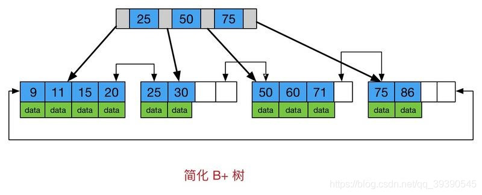
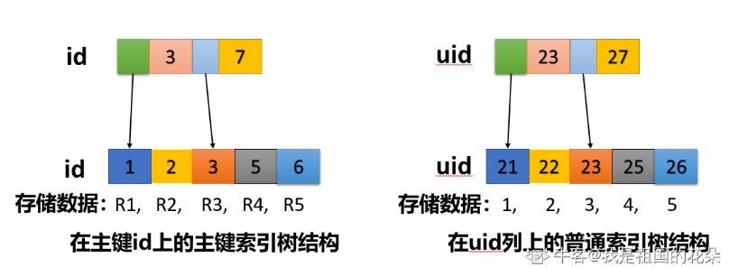
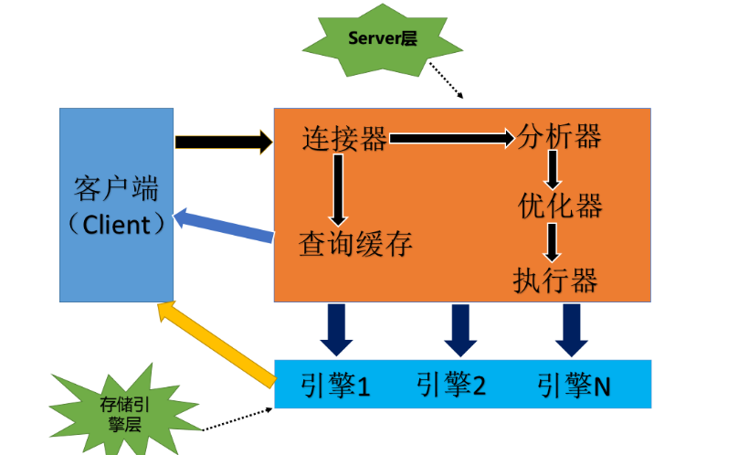

# 1. MySQL 索引有了解么？

索引是对数据库表中一列或多列的值进行排序的一种结构，使用索引可快速访问数据库表中的特定信息，就像一本书的目录一样，可以加快查询速度。InnoDB 存储引擎的索引模型底层实现数据结构为 B+ 树，所有数据都是存储在 B+ 树中的。

## 谈一谈对 B 树和 B+ 树的理解？

### B树



B 树是一种多路自平衡搜索树。它类似普通二叉树，但其允许每个节点拥有更多的子节点。B 树的非叶子节点和叶子节点的 data 都是分开存放的，不利于范围查询和排序。

B 树的特点：
* 所有键值分布在整个树中，任何关键字出现且只出现在一个节点当中；
* 搜索有可能在非叶子节点中结束；
* 在关键字全集内做一次查找，性能逼近二分查找算法；

### B+树


相比于 B 树，B+ 树的不同在于：
* 所有的关键字存储在叶子节点，非叶子节点不存储真正的 data，从而可以快速的定位到叶子节点；
* 所有的叶子节点添加了一个链指针，意味着所有的值都是顺序存储的，且每一个叶子节点到根节点的距离相同，适合范围查找和排序；

因此，B+ 树可以对`<、<=、=、>、>=、BETWEEN、IN、不以通配符开始的LIKE`使用索引。且如果用到了该索引，排序功能的消耗大大减少。

B+ 树的优点：比较的次数均衡，减少了 IO 的次数，提高了查找速度，查找更加稳定。

## 什么是 MySQL 回表？

* 如果语句是主键查询方式，则只需要搜索 主键索引树。
* 如果语句是普通索引查询方式，则需要先搜索普通索引树，得到其对应的主键值，再到主键索引树搜索一次。这个过程称为回表。

## 什么是覆盖索引？

如果在普通索引树上的查询已经直接提供了结果，不需要回表操作，这样的普通索引叫做覆盖索引。

覆盖索引的使用可以显著提高查询效率，是常见的 MySQL 性能优化手段。

## 聚簇索引和非聚簇索引有了解么？

* 聚簇索引 (主键索引) ：将数据存储与索引放在一起，并按照一定的顺序组织，找到了索引也就找到了数据，其叶子结点就是数据节点，数据的物理存放顺序与索引顺序一致，即索引相邻，对应的数据在磁盘上的存储也是相邻的。
* 非聚簇索引 (普通索引) ：叶子结点不存储数据，而是存储数据行地址，其叶子结点仍然是索引节点。即根据索引查找到数据行的位置后在根据地址去磁盘中进行查找，类似于书的目录。



| 聚簇索引 | 非聚簇索引 |
| --- | --- |
| 单表中只能有一个聚簇索引 | 单表中可以存在多个非聚簇索引 |
| 索引中键值的逻辑顺序决定了表中相应行的物理顺序 | 索引的逻辑顺序与磁盘上行的物理存储顺序不同 | 
| 索引的叶子节点就是数据节点 | 索引的叶子节点仍然是索引节点，只不过有一个指针指向对应的数据块 |

### 为什么聚簇索引可以创建在任何一列上？即使有重复行数据
如果没有使用 UNIQUE 创建聚簇索引，数据库引擎将向表自动添加一个四字节的 uniqueifier 列。必要时，数据库引擎将向每一行自动添加一个 uniqueifier 值，使每个键唯一。
此列和列值仅供内部使用，用户不能查看或者访问。

### 聚簇索引一定比非聚簇索引好么？
存在这样一个场景：查询年龄在 20-30 区间的员工姓名和年龄。

针对上述场景，在年龄上创建聚簇索引并不是最优解。因为结果只需要输出两列，那么可以在年龄和姓名上创建联合非聚簇索引，此时索引就变成了覆盖索引，即索引存储的内容就是最终输出的内容。

## 什么是索引最左前缀规则？

最左匹配原则：
* MySQL 建立多列索引（联合索引）有最左匹配的原则，即最左优先：
    * 如果有一个 2 列的索引 (a, b)，则已经对 (a)、(a, b) 上建立了索引；
    * 如果有一个 3 列索引 (a, b, c)，则已经对 (a)、(a, b)、(a, b, c) 上建立了索引；

最左原则失效的情况：以 abc_index:(a,b,c) 为例
* 查询条件缺少优先级最高的索引 a 时，索引失效；
* 查询条件缺少优先级居中的索引 b 时，索引失效；
* 范围查询时会导致索引失效；

## 什么是索引下推？

在 MySQL5.6 之前，只能从根据最左前缀查询到 ID 开始一个个回表。到主键索引上找出数据行，再对比字段值。

MySQL5.6 引入的索引下推优化，（联合索引前提）可以在索引遍历过程中，对索引中包含的其余字段先做判断，直接过滤掉不满足条件的记录，减少回表次数，提升查询效率。

## 哪些列上适合创建索引？创建索引的开销有哪些？

经常需要作为条件查询的列上适合创建索引，并且该列上也必须有一定的区分度。

创建索引需要维护，在插入数据的时候会重新维护各个索引树，对性能造成影响。

# 2. MySQL 常见的存储引擎有哪些？

MySQL 中最常见的存储引擎有 InnoDB 和 MyISAM，它们的主要区别如下：

* MyISAM 不支持事务；InnoDB 是事务类型的存储引擎。
* MyISAM 只支持表级锁；InnoDB 支持行级锁和表级锁，默认为行级锁。
* MyISAM 引擎不支持外键；InnoDB 支持外键。

### MySQL 逻辑架构



由 MySQL 的逻辑架构图我们可以看出，逻辑架构包括 Server 层和存储引擎层。其中 Server 层包括连接器，分析器，优化器以及执行器；存储引擎层包括多种支持的存储引擎。各个逻辑部件的作用如下：

* 连接器：验证客户端权限，建立和断开 MySQL 连接
* 分析器：进行 SQL 语句的语法分析
* 优化器：选择索引，生成具体的 SQL 语句执行计划
* 执行器：操作存储引擎，执行 SQL，返回执行结果
* 存储引擎层：各个不同的存储引擎都提供了一些读写接口来操作数据库

# 3. MySQL 中 where、group by、having 关键字？

这三个 MySQL 关键字作用可以总结如下：

* where 子句用来筛选 from 子句中指定的操作所产生的的行
* group by 子句用来分组where子句的输出
* having 子句用来从分组的结果中筛选行

### having 和 where 的区别

* 语法类似，where 搜索条件在进行分组操作之前应用；having 搜索条件在进行分组操作之后应用
* having 可以包含聚合函数 sum、avg、max等
* having 子句限制的是组，而不是行

# 4. MySQL 的日志模块 binlog 和 redo log 有了解吗？

在 MySQL 的使用中，更新操作也是很频繁的，如果每一次更新操作都根据条件找到对应的记录，然后将记录更新，再写回磁盘，那么IO 成本以及查找记录的成本都很高。

所以，出现了日志模块，即我们的 update 更新操作是先写日志，在合适的时间才会去写磁盘，日志更新完毕就将执行结果返回给了客户端。

MySQL中的日志模块主要有 redo log（重做日志）和 binlog（归档日志）。

### redo log（重做日志）

redo log 是 InnoDB 引擎特有的日志模块，redo log 是物理日志，记录了某个数据页上做了哪些修改。InnoDB 的 redo log 是固定大小的，比如可以配置为一组4个文件，每个文件的大小是 1GB，那么 redo log 总共就可以记录 4GB 的操作。从头开始写，写到末尾就又回到开头循环写。

InnoDB 的 redo log 保证了数据库发生异常重启之后，之前提交的记录不会丢失，这个能力称 为crash-safe。

### binlog（归档日志）

binlog 是 Server 层自带的日志模块，binlog 是逻辑日志，记录本次修改的原始逻辑，说白了就是SQL语句。binlog 是追加写的形式，可以写多个文件，不会覆盖之前的日志。

通过 mysql binlog 可以解析查看 binlog 日志。

binlog 日志文件的格式：statement，row，mixed。

* statement 格式的 binlog 记录的是完整的 SQL 语句，优点是日志文件小，性能较好，缺点是准确性差，遇到SQL语句中有now()等函数会导致不准确
* row 格式的 binlog 中记录的是数据行的实际数据的变更，优点就是数据记录准确，缺点是日志文件较大。（业界推荐使用）
* mixed 格式的 binlog 是前面两者的混合模式

## 为什么 MySQL 会突然变慢一下？

当内存数据页和磁盘数据页内容不一致的时候，这个内存页就是“脏页”。内存数据写入到磁盘后，内存和磁盘上的数据页的内容就一致了，这个时候的内存页就是”干净页“。

更新数据库的时候是先写日志，当合适的机会（空闲）出现的时候才会更新磁盘。但是当 redo log 写满了，要 flush 脏页，也就是把内存里的数据写入磁盘，会导致 MySQL 执行速度突然变慢一瞬间。

# 5. 说一下什么是 MySQL 事务？
事务就是一组原子性的 SQL 执行单元，其中的操作要么全部执行成功 (commit)，要么全部执行失败(rollback)。

使用`START TRANSACTION`开启事务，使用`COMMIT`提交事务。

## 说一下你对事务 ACID 四大特性的理解
* 原子性 (Atomicity)：单个事务是一个不可分割的最小工作单元，整个事务中的操作要么全部提交 commit，要么全部失败回滚 rollback。
* 一致性 (Consistency)：数据库总是从一个一致性状态转换到另外一个一致性状态。如果事务没有最终提交，那么事务中所做的修改就不会保存到数据库中。
* 隔离性 (Isolation)：一个事务所做的更改再提交之前对其他事务是不可见的。
* 持久性 (Durability)：一旦事务提交，其所作的修改就会永久保存在数据库中。

事务该回滚的回滚，该提交的提交；提交后的事务该持久化的持久化，该写缓冲池的就写缓冲池 + 日志；通过四种隔离级别控制数据的可见性，保证事务的有序操作，在保证正确性的前提下提高并发度；从而保证数据的一致性。


## 从原理上说明一下 ACID 是如何实现的
对于 MySQL 数据库来说，逻辑备份日志(binlog)、重做日志(redo log)、回滚日志(undo log)、锁 + MVCC 就是实现事务的基础。

* 原子性：回滚日志(undo log)
* 持久性：备份日志(binlog)、重做日志(redo log)
* 隔离性：锁 + MVCC
* 一致性：通过原子性、持久性、隔离性保证

### 原子性原理
事务通常通过`START TRANSACTION`开启事务，使用`COMMIT`提交事务，使用`ROLLBACK`回滚事务(undo log)。

#### 回滚日志 undo log：
* 每条数据变更 (INSERT/UPDATE/DELETE/REPLACE) 操作都会生成一条 undo log 记录，在 SQL 执行前先于数据持久化到磁盘
* 当数据需要回滚时，MySQL 会根据回滚日志对事务中已经执行的 SQL 做逆向操作

### 持久性原理
在将这个问题之前，先了解一下 MySQL 的数据存储机制。MySQL 的表数据都是持久化到磁盘当中的，但是如果每次操作都去操作磁盘，在高并发量下会导致处理速度非常缓慢。
为解决此问题，MySQL 引入了缓冲池(Buffer Pool)的概念，在缓冲池中包含了磁盘中部分数据页的映射，可以当作缓存来使用。
这样有修改表的操作时，会吧操作记录首先写入 Buffer Pool，并标记事务已经完成，当 MySQL 空闲时，再将更新操作持久化到磁盘当中，从而缓解 MySQL 的并发压力。

但是缓冲池的机制也带来了新的问题，如果我们的数据提交到缓冲池中之后，还未来得及持久化到磁盘，此时 MySQL 宕机，那么我们的数据就丢失了。
所以，为应对这种情况，需要一种机制来保存已经提交的数据，为恢复数据使用，即 redo log + binlog。

#### 重做日志 redo log
MySQL InnoDB 引擎中，提供了 redo log 机制用来实现事务的持久化，即在事务提交时，必须先将该事务的所有操作日志写入磁盘的 redo log 进行持久化，即常说的 WAL(Write Ahead Log) 策略。
有了 redo log，在数据库宕机时，即使内存中的数据还没来得及持久化到磁盘上，我们也可以通过 redo log 来完成数据的恢复，避免数据的丢失。

#### 备份日志 binlog
在 MySQL 中，binlog 记录了数据库系统所有的更新操作，其作用是用来实现数据恢复和主从复制的。一方面，MySQL 集群可以利用 binlog 中的更新操作保持主从数据库的数据一致性；
另一方面，数据库可以利用 binlog 进行数据的恢复。

#### redo log 和 binlog 的区别
| | redo log | binlog |
| --- | --- | --- |
| 产生方式 | 产生于物理存储引擎层(InnoDB) | 产生于数据库 Server 层，数据库中任何引擎对数据库的更改都会记录在 binlog 当中 |
| 记录形式 | 物理日志，记录对于磁盘当中每一个数据页的修改 | 逻辑日志，记录的是 SQL 语句 |
| 记录时间点 | 在事务进行的过程中不断写入 | 在事务提交完成后进行一次写入 |

#### redo log 和 binlog 的一致性问题
综合上面的叙述，redo log 和 binlog 都是在事务的提交阶段进行记录的，那么到底是先写 redo log 还是先写 binlog 呢？
* 如果先写 redo log 后写 binlog：若一个系统在写完一个事务的 redo log 时宕机，而此时事务的 binlog 还未持久化。那么在数据库恢复后，主库会根据 redo log 中的记录去完成事务的重做，故主库中就恢复了这个事务的数据。
  但是因为事务并没有产生 binlog，主库恢复该事务后，该事务对数据的修改不能同步到从库上，产生主从不一致的错误。
* 如果先写 binlog 后写 redo log：若一个系统在写完一个数据的 binlog 后宕机，而此时事务的 redo log 还未持久化完毕(没有记录 commit)。那么数据库阿紫恢复之后，从库就会根据主库的 binlog 去完成事务的数据修改。
  但是因为此事务并没有将完整的事务记录在 redo log 当中，所以主库在恢复之后会回滚该事务，由此同样导致主从不一致的错误。

所以，不论先写 redo log 还是 binlog，都可能会产生主从不一致的错误，那么 MySQL 到底是怎样满足 redo log 和 binlog 的一致性的呢？

这里就需要先介绍一下 MySQL 的 XA-2PC(two phase commit，两阶段提交)

#### XA-2PC(two phase commit，两阶段提交)
XA 是由 X/OPEN 组织提出的分布式事务的规范。其主要定义了全局事务管理器 TM(Transaction Manager) 和局部资源管理器 RM(Resource Manager) 之间的接口。
XA 为了实现分布式事务，将事务的提交分成了两个阶段，即 2PC：
* prepare 阶段：事务管理器向所有涉及到的数据库管理器发出 prepare“准备提交” 的请求，各数据库收到请求之后执行数据的修改和日志的记录等操作，处理完成后将事务的状态置为“可以提交”，然后将结果返回给事务管理器。
* commit 阶段：事务管理器收到回应后进入第二阶段。若在第一阶段执行期间有任何一个数据库的操作发生了错误，或事务管理器没有收到某一个数据库的回应信息，则事务管理器认为事务失败，回滚所有数据库事务。同样的，若各个数据库收不到第二阶段的确认提交请求，也会将“可以提交”状态的事务回滚。
  若第一阶段的数据库响应全部成功，则事务管理器会向各个数据库发出“确认提交”请求，此时个数据库将事务的“可以提交”状态置为“提交完成”，然后返回应答。

MySQL 中的 XA 实现分为外部 XA 和内部 XA。前者指分布式事务的实现，而后者指单台 MySQL 服务器中，由 Server 层作为事务管理器，各个数据库实例作为资源管理器而进行的一种分布式事务，即 MySQL 跨库事务。

而内部 XA-2PC 同时也帮助我们解决了 redo log 和 binlog 的一致性问题：
* 第一阶段：InnoDB prepare 阶段。此时已经成功执行 SQL 语句，生成事务 id 信息以及 redo log 和 undo log。但是此时的 redo log 只是记录了事务的所有操作日志，并没有记录“提交 commit”。
  因此，此时事务的状态仍然是“准备提交”，且在此阶段 binlog 不会有任何记录。
* 第二阶段：在此阶段中首先写 binlog 并进行持久化，然后完成事务的提交，并在 redo log 中将事务的状态修改为“确认提交”(即增加 “commit”标签)。

需要注意：在这个过程中，以 binlog 是否写入作为事务是否成功的标志！通过上述的 2PC 过程即可解决 redo log 和 binlog 的一致性问题。

### 隔离性原理
原子性、持久性、隔离性都是为了保证一致性。
前两个的目的是为了保证数据正确、可用，如宕机后的恢复、事物的回滚等；隔离性要做的是管理多个并发的事务的执行顺序。当出现多个事务操作一条数据时，维持事务执行的次序，保证数据和事务的相对隔离。

#### 并发场景事务问题
首先需要了解并发场景下事务存在的问题：

| 问题 | 描述 |
| --- | --- |
| 脏读 | 事务 A 修改了数据，但是还未提交，而事务 B 查询到了 A 已经修改但是还未提交的数据 (问题：事务 A 可能回滚) | 
| 不可重复读 | 事务 A 执行了一次查询，而事务 B 在事务 A 查询过后对相应的数据进行了修改并提交，此时如果事务 A 再一次查询，则会查到不同的结果 (问题：一次事务中的查询结果不一致，违反一致性) |
| 幻读 | 事务 A 将某张表的某个字段全部修改，但未提交，而事务 B 在此时新增了一条记录并提交，此时事务 A 再一次查询发现还有一条未处理的记录，即幻读 (问题：一次事务中前后两次查询到的记录不同) | 

简单来说：
* “脏读”就是看到了自己不该看的数据；
* “不可重复读”就是一个人在查询数据时，另一个人可以修改，但前者不知道数据已经被修改，仍然执行之前的操作
* “幻读”就是我修改了数据，但再次查询时发现还有未修改的数据。

#### 事务的隔离级别
| 隔离级别 | 效果 |
| --- | --- |
| 读未提交(RU) | 一个事务还未提交时，其所作的修改就能被其他事务看到 | 
| 都已提交(RC) | 一个事务所作的修改提交之后才能被其他事务看到 |
| 可重复读(RR) | 一个事务在执行过程中看到的数据，总是跟这个事务在启动时看到的数据一致 |
| 串行化(S) | 单线路执行，即同一时刻只有一个事务允许执行 |

四种隔离级别解决的问题：

|  | 脏读 | 不可重复读 | 幻读 |
| --- | --- | --- | --- |
| 读未提交 | × | × | × |
| 读已提交 | √ | × | × | 
| 可重复读 | √ | √ | × |
| 串行化 | √ | √ | √ |

越低的隔离级别可以执行越高的并发，但复杂度和开销也越大。

### 一致性原理
通过前三个特性共同保证了一致性，使数据库中的增删改查操作将数据库不断的从一个一致性的状态转换到另一个一致性的状态。

## 并发场景下事务都存在哪些问题？
脏读、不可重复读、幻读。

简单来说
* “脏读”就是看到了自己不该看的数据；
* “不可重复读”就是一个人在查询数据时，另一个人可以修改，但前者不知道数据已经被修改，仍然执行之前的操作；
* “幻读”就是我修改了数据，但再次查询时发现还有未修改的数据。

### InnoDB 是如何解决幻读问题的？
InnoDB 在可重复读(RR)的隔离级别下解决了幻读问题，该方法通过 next-key lock 在当前事务开始时：
* 给涉及到的行加写锁防止其它事务的写操作
* 给涉及到的行两端加间隙锁(gap lock)防止新增行写入

#### next-key lock
将行锁 + 间隙锁的组合称为 next-key lock，其解决了幻读的问题。这样在事务开始的时候，不仅仅对涉及的 x 条数据行加 x 个行锁，同时也添加了 x + 1 个间隙锁锁住数据之间的间隙，不允许添加数据。

### 幻读问题能只依靠行锁解决么？
仅仅依靠行锁无法解决幻读问题。即使在事务开始的时候给所有涉及到的行全部加上行锁，也无法阻止其他事务新增数据行。因为在为数据加锁的时候，这个新添加的行压根就不存在。
所以，要解决幻读问题，就必须解决新增行的问题，因此引入间隙锁锁住两条记录之间的间隙。


# 6. 说一下你都知道 MySQL 中的哪些锁？
* 按照锁的细粒度，从大到小存在 表锁、页锁、行锁；以及特殊场景下使用的 全局锁
* 按照锁级别分类，有 共享锁(读锁)、排他锁(写锁)、意向共享锁、意向排他锁
* InnoDB 引擎为解决幻读等并发场景下事务存在的数据问题，引入了 Record Lock(行记录锁)、Gap Lock(间隙锁)、Next Key Lock 等
* 面向编程的两种锁思想：悲观锁、乐观锁

## 谈一谈你对表锁和行锁的理解
* 表锁：表锁是 MySQL 各存储引擎中最大颗粒度的锁，其实现逻辑非常简单，带来的系统负面影响小，故锁的获取和释放速度很快。表锁一次会将整个表全部锁定，可以很好的避免死锁问题。
  但是其带来的问题就是出现锁资源争用的概率也会很高，大大降低并发度。使用表锁的主要是 MyISAM/MEMORY 等一些非事务性存储引擎
* 行锁：行锁的细粒度很小，故发生资源争用的概率也最小，可以提供良好的并发处理能力从而提升系统的整体性能。
  但是由于其细粒度很小，所以每次获取锁和释放锁要做的事情也更多，带来的损耗更大。此外，行锁也最容易发生死锁。
  使用行锁的主要是 InnoDB 引擎

从锁的角度来说：
* 表锁更适合于以查询为主，只有少量按照索引条件更新数据的应用，如 web
* 行级锁更适合于有大量索引条件并发更新数据的情况，同时也存在并发查询的应用场景。

### 死锁如何解决？

* 业务逻辑上解决死锁
    * 指定锁的获取顺序
    * 大事务拆分成各个小事务
    * 在同一个事务中，一次锁定尽量多的资源，减少死锁概率
    * 给表建立合适的索引以及降低事务的隔离级别等

* 数据库设置解决死锁
    * 通过参数 innodb_lock_wait_timeout 根据实际业务场景来设置超时时间，InnoDB 引擎默认值是 50s。
    * 发起死锁检测，发现死锁后，主动回滚死锁链条中的某一个事务，让其他事务得以继续执行。将参数 innodb_deadlock_detect 设置为 on，表示开启这个逻辑（默认是开启状态）。

### 行级锁什么时候会锁住整个表？

当不通过索引进行数据检索时，InnoDB 将会对表中的所有数据加锁

## 全局锁一般在何时使用？
全局锁对整个数据库实例加锁，一啊不能在全库逻辑备份时使用。

MySQL 提供全局加锁的命令：`Flush tables with read lock`，该命令使整个库处于只读状态。使用该命令之后，数据更新语句、数据定义语句以及事务的提交语句等修改数据库的操作都将被阻塞。

使用全局锁的风险：
* 若主库在备份，那么备份期间不能更新，业务停摆；
* 若从库备份，备份期间不能同步主库的 binlog，导致主从延迟同步

还有一种全局锁的方式：`set global readonly = true`，将整个库设置为只读状态。该方式与上述方式的不同之处在于：
* `Flush tables with read lock`执行后，若客户端断开，MySQL 会自动释放这个全局锁，整个数据库回到可以正常更新的状态；
* `set global readonly = true`设置后，若客户端断开，整个库仍旧会保持只读状态，这会导致数据库长时间处于不可写的状态。

## 说一下按锁级别划分的几种锁的理解
按照锁级别分类，有 共享锁(读锁)、排他锁(写锁)、意向共享锁、意向排他锁

| 锁 | 说明 |
| --- | --- |
| 共享锁(读锁) | 执行读取操作时创建的锁。被读锁锁定的数据，可以被其他事务读取，但不能对这些数据进行更改 |
| 排他锁(写锁) | 执行修改操作使创建的锁。被写锁锁定的数据，不能被其他事务读取，更不能被其他事务更改 |
| 意向共享锁 | 属于表级锁，表示事务准备给数据行加共享锁，即某数据行在加共享锁之前必须先加意向共享锁 |
| 意向排他锁 | 属于表级锁，表示书屋准备给数据行加排他锁，即某数据行在加排他锁之前必须先加意向排他锁 |

个人理解：上述几种锁可以理解为租房时的各种行为。

* 对于共享锁，即我们在租房之前，应该去所有的房源考察，在此期间，其他的租客也可以对这些房源进行考察
* 对于排他锁，即我们决定租住某一套出租房，与房东完成签约并入住，此时，其他的租客不能参观此房源，更不能再次租住
* 意向共享锁、意向排他锁，不是真正意义上的锁，可以理解为租房中介的房源信息维护系统，当我们看中一套房子的时候，可以先交纳订金，此时该房源就被房屋中介记录已被预定，后续就不能再被参观。
  如果没有意向锁，那么我们再参观房源的时候，必须去每一套房源登门拜访看看是否被出租，这样效率极其低下

对于 InnoDB 引擎：
* 意向锁是自动添加的，不需要开发者干预
* 对于 INSERT / UPDATE / DELETE，会自动的给涉及到的数据添加排他锁。可以通过`SELECT ... FOR UPDATE;`显式的添加排他锁；
* 对于一般的 SELECT 语句，不会添加任何锁。可以通过`SELECT ... LOCK IN SHARE MODE;`显式的添加共享锁；

## 谈一谈悲观锁与乐观锁

从程序员的角度看，数据库中的锁又可以分为悲观锁和乐观锁。

* 悲观锁：利用数据库的锁机制实现，在整个数据处理过程中都加入了锁，以保持排他性。
* 乐观锁：乐观锁可以利用 CAS 实现，在操作数据的时候进行一个比较，按照当前事务中的数据和数据库表中的该数据是否一致来决定是否要执行本次操作。

### 乐观锁的 ABA 问题有了解吗？如何解决？

ABA问题可以通过基于数据版本（Version）记录机制来解决。也就是为数据增加一个版本标识。读取出数据时，将此版本号一同读出，之后更新时，对此版本号加一。根据当前事务的数据版本号和数据库中数据的版本号对比来决定是否更新数据。

# 7. 有 SQL 优化或者 MySQL 故障排查经历吗？

通过 explain 查看当前 SQL 语句的执行情况。

# 8. MySQL建表的约束条件有哪些？

* 主键约束 (Primary Key Constraint) ：唯一性，非空性
* 唯一约束 (Unique Constraint) ：唯一性，可以空，但只能有一个
* 检查约束 (Check Constraint) ：对该列数据的范围、格式的限制
* 默认约束 (Default Constraint) ：该数据的默认值
* 外键约束 (Foreign Key Constraint) ：需要建立两表间的关系并引用主表的列

# 9. limit 分页查询使用方式

语句：`select * from [表名] limit [偏移值],[每页数据行数];`

第 n 页的偏移值 = (n - 1) * 每页数据行数

limit 在所有查询条件最后使用

# 10. 你对数据库优化有了解么？


针对上述性价比图，我们针对数据库的优先级大致如下：
* 高：从 SQL 优化、索引优化入手，优化慢 SQL ，利用好索引
* 中：SQL 优化过后，是对数据表结构设计、横纵分表分库、数据量级的处理
* 低：修改数据库系统配置，最大化利用服务器内存资源
* 低：上述方法都不行的话，即服务器资源到达瓶颈，需要加机器

## 你对 SQL 优化有哪些了解？
对于 SQL 的优化可以简单总结为三点：
* 最大化利用索引
* 尽可能避免全表扫描
* 减少无效数据的查询

### SQL 优化策略：
#### 1. 避免不走索引的场景
A. 尽量避免在字段的开头使用模糊查询，这会导致数据库引擎放弃索引而进行全表扫描。

如`select * from table where username like '%朱%';`

优化方式：尽量在字段后使用模糊查询(原因：B+ Tree 索引的最左匹配原则)。`select * from table where username like '朱%';`

如果业务需求一定要在前面使用模糊查询：
* 使用 MySQL 内置函数 INSTR(str, substr) 来匹配，其作用类似于 java 中的 indexOf()
* 使用 FullText 全文索引，用 match against 检索
* 数据量较大时使用 ElasticSearch 等，亿级数据量检索速度秒级
* 数据量较小时直接使用 like %str%

B. 尽量避免使用 or，这会导致数据库引擎放弃索引而进行全表扫描

如：`select * from table where id = 1 or id = 3;`

优化方式：使用 union 代替 or。`select * from table where id = 1 union select * from table where id = 3;`

C. 尽量避免对 null 值进行判断，这会导致数据库引擎放弃索引而进行全表扫描

如：`select * from table where score is null`

优化方式：可以给字段添加默认值 0 继而进行判断。`select * from table where score = 0;`

D. 尽量避免在 where 条件的等号左侧进行表达式、函数操作，这会导致数据库引擎放弃索引而进行全表扫描

如：`select * from table where score / 10 = 9;`

优化方式：将表达式、函数操作等移到等号右边。`select * from table where score = 9 * 10;`

E. 使用索引列作为条件进行查询时，查询条件不要使用`<> 或者 !=`

如果业务确实需要使用不等号进行判断，那么需要重新评估索引建立，避免在此字段上建立索引。

F. 避免 where 条件仅包含复合索引的非前置列

如果某联合索引(id, name, age)按照下列 SQL 进行查询，根据 MySQL 来奶和索引的最左匹配原则，将不会命中索引。

`select * from table where name = 'zqf' and age = 25;`

G. 避免隐式类型转换

如果索引列的类型为 varchar，但使用下列语句查询时的查询条件为数值，则涉及隐式类型转换，会导致不能命中索引。

`select * from table where col_varchar = 1;`

H. order by 的条件要与 where 的条件一致，否则 order by 不会利用索引进行排序

如：`select * from table order by age;`则不会命中 age 索引

优化方式：`select * from table where age > 0 order by age;`

只有当 order by 中的字段出现在 where 的查询条件中时，才会利用索引而不再进行二次排序。该结论对于 group by、union、distinct 等同样有效。

#### 2. select 语句的其他优化

A. 避免出现`select *`

建议根据实际的业务需求查询对应的字段，以指定列名代替全部查询。

B. 避免出现不确定结果的函数

主要针对主从复制这类业务场景，使用不确定结果的函数很容易导致主库和从库的相应数据不一样。

C. 多表关联查询时，小表在前，大表在后

MySQL 中，执行 form 后的表关联查询是从左往右执行的，第一张表会涉及到全表扫描，故将小表放在前面，先扫描小表，效率快。

D. 使用表的别名

在 SQL 语句中连接多个表时，尽量为每张表赋予别名，这样可以减少解析时间并减少列名歧义引起的语法错误。

E. 用 where 替换 having

避免使用 having 语句，应为 having 只会在检索出所有记录之后才对结果集进行过滤，而 where 则是在聚合之前筛选结果。
having 一般用于聚合函数的过滤，除此之外的条件应该在 where 中过滤。

F. 调整 where 的连接顺序

MySQL 按照自左向右，自上而下的顺序解析 where 语句，根据这个原理，应该将过滤数据多的条件往前放，以最快速度缩小结果集。

## 为什么不建议使用`select *`?
阿里 java 开发手册中明确规定：一律不要使用 * 作为查询的字段列表，需要哪些字段必须明确写出。

* 不需要的列会增加数据传输时间和网络开销
* 对于无用的大字段，如 varchar、blob、text，会增加 io 操作
* 失去 MySQL 优化器“覆盖索引”策略优化的可能性

# 11. 如何理解分库分表？
* 分库：将单个数据库拆分成多个数据库实例，将数据分散到多个数据库实例当中。分库的目的时减轻单台 MySQL 实例的存储压力。
* 分表：将单张数据表拆分成多张数据表，将数据划分到多张表内。分表的目的是解决单张表数据过大以后查询效率低的问题。

常用的分库分表策略：
* 垂直分表
    * 特点：
        * 每个表结构不同、数据不同
        * 存在一个关联字段
        * 所有兄弟表的并集是该表的全部数据
    * 场景：
        * 某几个字段属于热点数据，更新频率很高
        * 由大字段，如 text
        * 有明显的业务区分，或表结构设计时存在冗余字段
* 水平分表
    * 特点:
        * 每个表的结构相同，数据不同，没有交集
        * 所有表的并集是该表的全部数据
    * 场景：
        * 单表的数据量过大或者增长速度很快，影响 SQL 查询效率，加重 CPU 负担
        * 例如存储手机号，可按照手机号前三位进行水平分表存储
* 垂直分库
    * 特点：
        * 每个库的表都不一样
        * 每个库相对独立，更加模块化
    * 场景：
        * 可以抽象出单独的业务模块或者可以抽象出公共区(如字典、公共配置等)时
* 水平分库
    * 特点：
        * 每个库的结构都相同，数据不同，没有交集
        * 所有库的并集是全部数据
    * 场景：
        * 系统并发量大，CPU 内存压力大，分表难以从根本上解决数据量大的问题
    
# 12. MySQL 删除数据的方式有哪些？
* DELETE
    * 属于数据库 DML 语言，只删除数据不删除表结构，会走事务，会将删除数据缓存到 rollback segment 中，待事务 commit 之后生效，执行时触发 trigger。
    * 在 InnoDB 中，DELETE 不会将数据真的删除，而是将删除数据做一个标记，因此删除后表文件在磁盘上所占据的空间不变，只是删除的数据不再可见。当下次插入新数据时，这部分空间会被覆盖。
    * 对于带限制条件 where 的删除，无论 InnoDB 还是 MyISAM 都不会立即释放磁盘空间。
    * DELETE 操作之后执行 `optimize table table_name` 会立即释放磁盘空间，不论什么引擎。
    * DELETE 是一行一行执行删除的，同时会将改行的删除操作日志记录在 redo 和 undo 表中以便回滚，生成的大量日志也会占用磁盘空间。
* TRUNCATE
    * 属于数据库 DDL 语言，不走事务，元数据不会放到 rollback segment 中，操作不触发 trigger。
    * TRUNCATE 执行后立刻释放磁盘空间，该操作可以快速清空一个表并重置 auto_increment 的值。
* DROP
    * 属于数据库 DDL 语言，同 TRUNCATE。
    * DROP 执行后立即释放磁盘空间。
    * DROP 会删除表结构所依赖的约束、触发器、索引等。  

# 13. MySQL 有哪些数据类型？
### 数值类型
| 类型 | 大小 | 表示范围 |
| --- | --- | --- |
| TINYINT | 1 bytes | (-128, 127) |
| SMALLINT | 2 bytes | (-32768, 32767) |
| MEDIUMINT | 3 bytes | (-8388608, 8388607) |
| INT | 4 bytes | (-2^32, 2^32-1) |
| BIGINT | 8 bytes | (-2^64, 2^64-1) |
| FLOAT | 4 bytes | |
| DOUBLE | 8 bytes | |
| DECIMAL(M,D) | M > D ? (M + 2) : (D + 2) | 依赖于 M，D |

### 日期和时间类型
| 类型 | 大小 | 范围 | 格式 |
| --- | --- | --- | --- |
| DATE | 3 | 1000-01-01/9999-12-31 | YYYY-MM-DD |
| TIME | 3 | -838:59:59/838:59:59 | HH:MM:SS |
| YEAR | 1 | 1902/2155 | YYYY |
| DATETIME | 8 | 1000-01-01 00:00:00/9999-12-31 23:59:59 | YYYY-MM-DD HH:MM:SS |
| TIMESTAMP | 4 | 1970-01-01 00:00:00/结束时间是第 2147483647 秒 | YYYYMMDD HHMMSS | 

### 字符串类型
| 类型 | 大小 | 用途 |
| --- | --- | --- |
| CHAR | 0-255 bytes | 定长字符串 |
| VARCHAR | 0-65535 bytes | 变长字符串 |
| TINYBLOB | 0-255 bytes | 不超过 255 个字符的二进制字符串 |
| TINYTEXT | 0-65535 bytes | 短文本字符串 |
| BLOB | 0-65535 bytes | 二进制长文本数据 |
| TEXT | 0-65535 bytes | 长文本数据 | 
| MEDIUMBLOB | 0-16777215 bytes | 二进制中长文本数据 |
| MEDIUMTEXT | 0-16777215 bytes | 中长文本数据 | 
| LONGBLOB | 0-4294967295 bytes | 二进制超长文本数据 |
| LONGTEXT | 0-4294967295 bytes | 超长文本数据 |

## char 和 varchar 的区别是什么？
| | char | varchar |
| --- | --- | --- |
| 长度 | 固定长度，存储 char 值时 MySQL 会删除字符串中的末尾空格，而在前面用空格进行填充 | 可变长度 |
| 存储方式 | char 适合存储很短(不需要额外长度)或长度近似的字符串，或者经常改变的值(不易产生碎片) | varchar 需要使用额外的 1 or 2 个字节(根据长度是否大于 255 决定)来记录字符串的长度 |
| 存储容量 | 最大存放的字符个数为 255，与编码无关 | MySQL 行默认的最大字节限制为 65535 字节，且为所有列共享。在单列字段的情况下，varchar 一般最多只能存放 65535 - 3 个字节 |

注意：
* varchar 存储容量的计算：(行最大存储字节数 - NULL 标识列占用字节数 - 长度表示字节数) / 字符集单字符最大字节数
    * NULL 标识列占用字节数：允许 NULL 时，占 1 个字节
    * 长度标识符：额外标识 varchar 的长度，占 1 或 2 个字节
* MySQL 在 4.0 版本前，varchar 长度是按照字节展示的；在 5.0 版本后，是按照字符展示的。但行的总长度还是 65535，故根据编码方式的不同，最大容量产生差异

## char(50) 和 varchar(50) 的含义是什么？
对于 char 和 varchar，声明的长度表示能保存的最大字符数。MySQL 4.0 之前 varchar(50) 指的是 50 个字节，在 5.0 之后指 50 个字符。 对于 MyISAM 引擎，推荐使用 char 类型；对于 InnoDB 引擎推荐使用 varchar。

## int(10) 的含义是什么？
int(10) 的意思是能显示的宽度的位数。比如我给 id 输入 10，那么 MySQL 会默认存储为 0000000010，即当输入不足 10 位时，会自动补全位数。

# 14. MySQL 内连接、左连接、右连接有什么区别？
* 内连接
    * 又称等值连接，返回的是两张表公共的满足条件的部分
    * `select e.ename, e.sal, d.dname from emp e inner dept d on e. deptno = d.deptno;`
* 外连接
    * 取左边表的全部和左右表公共的满足条件的部分
    * `select e.ename, e.sal, d.dname from emp e right join dept d on e. deptno = d.deptno;`
    * `select e.ename, e.sal, d.dname from dept d left join emp e on e. deptno = d.deptno;`
  
# 15. 聊一聊 MySQL 的隐式转换
官方对于隐式转换的说明(翻译)：
* 不做类型转换的情况：
    * 若两个参数至少有一个是 null 时，比较的结果也为 null，此情况不做类型转换。(注意：使用`<=>`对两个 null 进行比较时会返回 1)
    * 若两个参数都是字符串，会按照字符串进行比较，此情况不做类型转换。
    * 若两个参数都是整数，会按照整数进行比较，此情况不做类型转换。
* 类型转换的情况：
    * 若十六进制的值与非数字进行比较，会被当作二进制串进行比较！
    * 若一个参数为 TIMESTAMP 或 DATETIME，另一个参数为常量，则常量会被转换为时间戳 TIMESTAMP 进行比较！
    * 若一个参数为 DECIMAL，另一个参数为整数，则会将整数转换为 DECIMAL 进行比较！若另一个参数为浮点数，则会将 DECIMAL 转换为浮点数进行比较！
    * 其他情况下，两个参数都会被转化成浮点数 DOUBLE 进行比较！

示例：
```sql
# 0：false；1：true
mysql> SELECT '1234abcd' = '1234';
+---------------------+
| '1234abcd' = '1234' |
+---------------------+
|                   0 |
+---------------------+
1 row in set (0.00 sec)

# 0：false；1：true
mysql> SELECT '1234abcd' = 1234;
+-------------------+
| '1234abcd' = 1234 |
+-------------------+
|                 1 |
+-------------------+
1 row in set, 1 warning (0.00 sec)
```

### 隐式转换会导致的问题：
* 隐式转换会导致 SQL 注入的问题
* 隐式转换会导致索引失效
* 隐式转换会导致查询结果不准确

# 16. MySQL 中你使用过哪些插入方式？
MySQL 中又下列几种常见的插入方式：普通插入、插入或更新、插入或替换、插入或忽略。

### 普通插入
`insert into table (`a`, `b`, `c`, ...) values (`a`, `b`, `c`, ...);`

普通插入只需要注意字段的顺序即可，不多赘述。

### 插入或更新
需求：希望插入一条新数据，如果该记录已经存在，就更新记录。使用`insert into ... on duplicate key update...`语句实现。

注意：该语句是基于唯一索引或逐渐来判断唯一(是否存在)的，如下述的例子中，就需要在 username 字段上建立唯一索引 unique，transId 设置自增即可。
```sql
-- 用户 zqf 充值 30 元
INSERT INTO total_transaction (t_transId,username,total_amount,last_transTime,last_remark) 
VALUES (null, 'zqf', 30, '2021-08-6 20:00:20', '充会员') 
ON DUPLICATE KEY UPDATE  total_amount=total_amount + 30, last_transTime='2021-08-06 20:00:20', last_remark ='充会员';
```

### 插入或替换
需求：希望插入一条新数据，如果记录已经存在，就删除原纪录再插入新数据。使用`replace into ...`语句实现。

注意：该语句是基于唯一索引或主键来判断唯一(是否存在)的，如下述的例子中，就需要在 username 字段上建立唯一索引 unique，transId 设置自增即可。
```sql
-- 充值记录，只记录最近的一条充值信息
REPLACE INTO last_transaction (transId,username,amount,trans_time,remark) 
   VALUES (null, 'zqf', 30, '2020-06-11 20:00:20', '会员充值');
```

replace into 在使用时会对每一个索引都有影响，所以可能会导致误删数据的情况，因此不建议在多唯一索引的表中使用该语句。

### 插入或忽略
需求：希望插入一条新纪录，若记录已经存在，就什么也不做。使用`insert ignore into ...`语句实现。

注意：该语句是基于唯一索引或主键来判断唯一(是否存在)的，如下述的例子中，就需要在 username 字段上建立唯一索引 unique，transId 设置自增即可。
```sql
-- 用户首次添加
INSERT IGNORE INTO users_info (id, username, sex, age ,balance, create_time) 
   VALUES (null, 'zqf', '男', 26, 0, '2020-06-11 20:00:20');
 
-- 二次添加，直接忽略
INSERT IGNORE INTO users_info (id, username, sex, age ,balance, create_time) 
   VALUES (null, 'zqf', '男', 26, 0, '2020-06-11 21:00:20');
```

# 17. 大量数据同时插入的场景应该怎么处理？你会如何设计？
### 单条循环插入
有多少条数据就循环多少次，每次插入一条数据。效率极低。

### 批量插入
修改 SQL 语句，利用动态 sql 进行批量插入。
```sql
<insert id="insertListUser" parameterType="java.util.List">
    INSERT INTO `db`.`user_info`
        ( `id`,
          `username`,
          `password`,
          `price`,
          `hobby`) 
     values
    <foreach collection="list" item="item" separator="," index="index">
        (null,
        #{item.userName},
        #{item.password},
        #{item.price},
        #{item.hobby})
    </foreach>
</insert>
```

### 分批次多次循环插入
如果不方便修改数据库配置或需要插入的内容太多时，也可以通过后端代码控制，比如插入 10w 条数据，分 100 次，每次插入 1000 条即可

## 如果插入速度依旧很慢，还有没有其它的优化手段？
1. 通过`show processlist;`命令，查询是否有其它长进程或大量短进程抢占线程池资源，看能否将部分进程转移到备库从而减轻主库压力，或者将没用的进程 kill 掉一些。
2. 大批量导入数据时，可以先关闭索引，数据导入完毕后再打开。

# 18. 建表时为什么不建议使用 null？
观察下面三个例子：
```sql
mysql> select * from demo;
+----+------------+-------+------+
| id | name       | money | age  |
+----+------------+-------+------+
|  1 | 111        |   100 | NULL |
|  2 | 222        |  NULL | NULL |
|  3 | 333        |   100 | NULL |
+----+------------+-------+------+
3 rows in set (0.00 sec)

mysql> SELECT SUM(age) from demo;
+----------+
| SUM(age) |
+----------+
|     NULL |
+----------+
1 row in set (0.00 sec)

mysql> SELECT count(name) from demo;
+-------------+
| count(name) |
+-------------+
|           2 |
+-------------+
1 row in set (0.00 sec)

mysql> SELECT * FROM demo WHERE money=null;
Empty set (0.00 sec)
```

* 示例一：通过 sum 函数统计一个只有 NULL 值的列的总和，比如 SUM(age) -- MySQL 中 sum 函数没有统计到任何记录时，会返回 null 而不是 0，这里可以使用 IFNULL(NULL, 0) 进行转换；
* 示例二：select 记录数量，count 使用一个允许 NULL 的字段，比如 COUNT(name) -- MySQL 中 count(字段) 不会统计 null 值，count(*) 才能统计所有行；
* 示例三：使用 =NULL 条件查询字段值为 NULL 的记录，比如 money=null 条件 -- MySQL 中使用比较操作符比较 null 的结果都是 null，需要使用 IS NULL 或 IS NOT NULL 进行比较；

