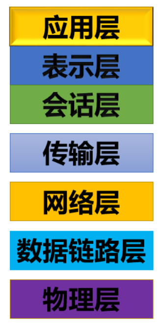
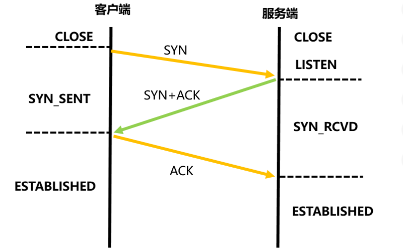
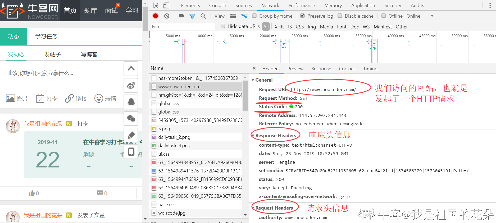
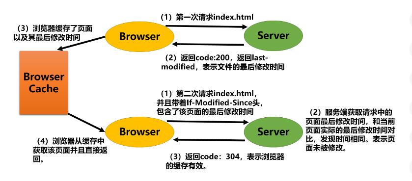
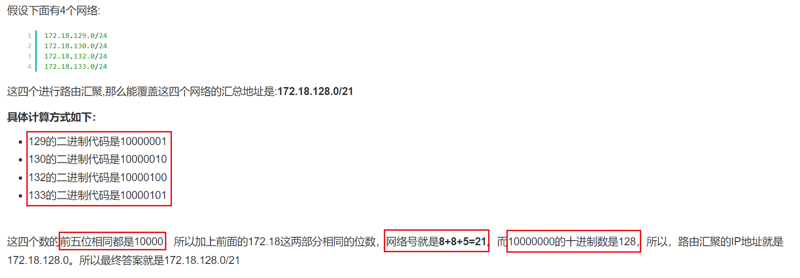
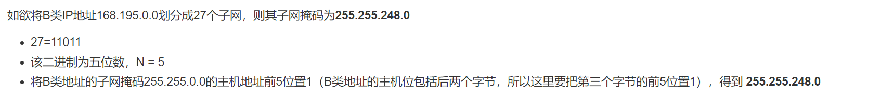
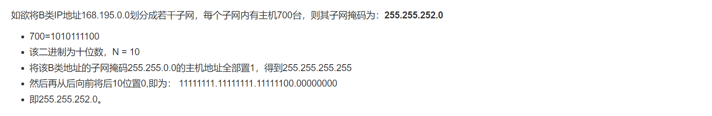

# 1. 简单说下OSI七层协议模型吧

答：OSI 七层模型自上而下分别为应用层、表示层、会话层、传输层、网络层、数据链路层、物理层

* 应用层：
由用户自己规定各个应用之间消息传递的方式等。
包括各机互访协议、分布式数据库协议等。
常见的应用层协议有 HTTP、FTP 等。

* 表示层：
该层是在满足用户基本需求的基础上，为尽可能的节省传输费用而设置的。
比如：传输压缩文件、jepg或加密文件等格式。

* 会话层：
用于建立和拆除会话。

* 传输层：
负责将来自会话层的消息传递给网络层。
常见协议有 TCP 和 UDP。

* 网络层：
规定通信网内的路由选择方式，建立用户间的信息报传输设施。
常见网络层协议有 IP、ICMP、ARP

* 数据链路层：
与建立数据传输链路相关。

* 物理层：
规定一些机电性能，也包括工作方式(单双工、双工、单工)，建立通信的启动和终止等。

# 2. TCP/IP协议有了解么？

答：TCP/IP 协议是一系列网络协议的总称，是网络通信的基本骨架。TCP/IP 协议模型在 OSI 七层模型的基础上通过合并的方式简化为四层：应用层、传输层、网络层、链路层。

我们使用的应用程序都工作在应用层，当哥哥应用之间通信时：

* 传输层的 TCP 模块负责给 HTTP 数据添加 TCP 头部信息
* 网络层的 IP 模块负责给 HTTP 数据添加 IP 头部信息
* 链路层添加以太网头部信息，并通过电信号来传输数据包

经过处理后的数据包会依次经过目标通信对象的链路层、网络层、传输层、应用层，实现数据的通信。

## IP 协议

IP 协议指定了一套网络地址，即 IP 地址，根据 IP 协议可以区分两台主机是否属于同一个网络（子网）。

## ARP 协议（地址解析协议）

该协议通过 IP 地址获取 MAC 地址。

其将通信目标的 IP 地址在链路层进行包装，生成以太网数据包，在同一个子网进行广播。各个主机拿到 IP 地址，与自己的 IP 地址对比，若相通，则返回自己的 MAC 地址。

注意：MAC 地址与对应的 IP 地址会存入本机 ARP 缓存中并保留一定时间。

## 路由协议

ARP 的寻址必须唯一同一个子网内，可以通过 IP 协议来判断与通信目标是否属于同一个子网。

若不是同一个子网，则需要通过网将数据包多次转发到对应子网中，完成这个路由协议的物理设备是路由器。

# 3. 可以详细的说一下三次握手四次挥手么？

答：TCP 协议是一种可靠的协议，在正式传输数据之前必须通过三次握手来建立连接并交换窗口大小；在传输结束之后通过四次挥手来确认双方都结束数据交互。

三次握手

* 第一次握手：

客户端发送 SYN 表示请求连接，并发送 seq 序号（可以理解为用于同步）。

此时客户端由 CLOSE 状态变为 SYN_SENT 状态。

* 第二次握手：

服务端发送 SYN 和 ACK 表示同意建立连接，并发送 ack = x + 1 表示收到 seq 序列号，同时将自己的 seq 序列号发送。

此时服务端由 LISTEN 状态转换为 SYN_RCVD 状态。

* 第三次握手

客户端发送 ACK 表示收到，开始建立连接。

此时客户端由 SYN_SENT 状态转换为 ESTABLISHED 状态。

服务端收到后由 SYN_RCVD 状态转换为 ESTABLISHED 状态。

四次挥手

* 第一次挥手

客户端发送 FIN 表示想要释放连接，同时发送 seq。

此时客户端从 ESTABLISHED 状态进入

FIN-WAIT-1 状态。

* 第二次挥手

服务器发送 ACK 表示收到客户端发送的释放连接的请求，同时发送 seq 和 ack。

此时服务器从 ESTABLISHED 状态进入 CLOSE-WAIT 状态。

在此期间继续传送未发送完毕的数据。

客户端收到该信号后从 FIN-WAIT-1 状态转换为 FIN-WAIT-2 状态。

* 第三次挥手

服务端数据已经发送完毕，此时发送 FIN 和 ACK 表示已经准备好释放连接。

此时服务器由 CLOSE-WAIT 状态进入 LAST-ACK 状态。

* 第四次挥手

客户端发送 ACK 表示收到服务器发送的准备好释放连接的信号。

此时客户端由 FIN-WAIT-2 状态进入 TIME-WAIT 状态，并在等待 2MSL 后关闭。

服务器收到信号之后由 LAST-ACK 状态转换为关闭状态。

## 为什么需要三次握手？两次可以么？

答：不可以。如果只有两次握手，那么服务端只能够确认从客户端到服务器的连接正常，而不知道从服务器到客户端的连接是否正常。此时服务器若直接进入工作状态，如果返回给客户端的 SYN+ACK 丢失，则会造成资源白白浪费。

## 为什么断开连接要四次挥手？

答：因为当客户端请求终止连接时，服务端收到信号并返回 ACK 表示收到终止连接的请求，但此时可能还有一些数据没有传输完毕，所以不能立即关闭。等到这些数据处理完毕后，由服务器向客户端回复 FIN 表示我已经准备好断开连接，所以断开需要四次。

## 四次挥手主动方为什么需要等待2MSL？

答：主动关闭方在收到被动关闭方的 FIN 信号后会立刻发送 ACK 确认信号，之后状态转换为 TIME_WAIT，在等待 2MSL（MSL：最大报文生存周期，任何报文在网络上存活的最长时间，超过这个时间报文将被丢弃） 后进入 CLOSE 状态。这是为了防止最后一次的 ACK 没有正确的传递给被动关闭方，导致被动关闭方会在此发送第三次的 FIN 信号。

## 滑动窗口

位于传输层的TCP协议是面向连接的，可靠的传输协议，拥有着确认机制。

理论上，每发一个数据包都会收到其对应的确认包，然后才可以继续发送数据。

在三次握手阶段，双方互相将自己的最大可接收的数据量告诉对方，也就是自己的数据接收缓冲池的大小。这样对方可以根据已发送的数据量来计算是否可以接着发送。

在处理过程中，当接收缓冲池的大小发生变化时，要给对方发送更新窗口大小的通知，利用滑动窗口机制有效提高通信效率。

# 4. TCP 和 UDP 协议的区别？

答： TCP 和 UDP 协议都是传输层常见的协议。UDP 协议传输不需要建立连接，资源消耗较小。常用在视频或者语音传输中，域名解析服务DNS都使用了UDP协议。

* TCP 协议在进行数据通信前需要三次握手建立连接；UDP 协议不需要建立连接也能发送数据。
* TCP 有确认机制，丢包可以重发，保证数据的准确性；UDP 不保证正确性，只是单纯的负责发送数据包。
* TCP 会对大的数据包进行拆分，并在接收方进行重组；UDP 协议是面向报文的，不会进行分片和重组，故需要注意传输的报文大小。
* TCP 的头部为 20 字节；UDP 头部 8 字节。

# 5. 一个网络数据包包括哪些？

答：网络数据包一般包括头部和数据部分，在 TCP 协议中，要发送的数据经过 TCP 模块添加 TCP 头部；然后 IP 模块添加 IP 头部和 MAC 头部；然后在最前面加上报头/起始帧分界符以及末尾假如 FCS（帧校验序列），这样就构成了一个完成的数据包。

# 6. TCP 协议中的数据报分片与重组功能有了解么？

答：

当 TCP 传输的数据包比较大时，在接收方会进行分片，在接收方进行数据包的重组。

发送方：

将数据包分为多个 TCP 头部+数据包的组合，TCP 头部中存着不同的数据序号；之后将多个组合交由 IP 模块，统一添加 IP 头部和 MAC 头部，IP 头部的ID 号设为统一的。

接收方：

IP 模块具有分片重组的功能，如果接收到的包是经过分片的，那么 IP 模块会将它们还原成原始的包。

分片的包会在 IP 头部的标志字段中进行标记，当收到分片的包时，IP 模块会将其暂时存在内部的内存空间中，然后等待 IP 头部中具有相同 ID 的包全部到达，因为同一个包的所有分片都具有相同的 ID。此外，IP 头部还有一个分片偏移量的字段，它表示当前分片在整个包中所处的位置。根据这些信息，在所有的分片全部收到之后，就可以将它们还原成原始的包。

数据包的分片和重组里边还涉及到了 MTU 和 MSS 的概念，介绍如下：

* MTU: Maxitum Transmission Unit 最大传输单元
* MSS: Maxitum Segment Size 最大分段大小，MSS 就是 TCP 数据包每次能够传输的最大数据分段。

# 7. TCP 协议的拥塞避免算法有哪些？

## 慢启动+拥塞避免

## 快重传+快恢复

# 8. HTTP 和 HTTPS 的主要区别有哪些？

答：主要区别如下：

* HTTP 是超文本传输协议，数据明文传输；HTTPS 在 HTTP 的基础上加入了 SSL 协议，实现数据的加密传输。
* HTTPS 需要区申请书，一般是收费的。
* HTTP 默认使用 80 端口；HTTPS 默认使用 443 端口。

## HTTP 协议

HTTP 是超文本传输协议，是一种无状态(每一次请求都是一个独立的会话)的协议，是最常见的一种应用层协议。

HTTP 是一个通信规则，规定了客户端和服务器相互通信的内容格式。

HTTP 请求信息：HTTP 请求头中可以看到当前请求支持的语言、压缩格式、编码以及何种类型的返回文件、Connection、Cookie、Content-Type 等信息......

HTTP 返回信息：HTTP 返回信息中包括相应协议、HTTP Code、Content-Type、时间、Cookie 等信息......

打开任意网址，F12 即可查看每一个具体的 HTTP 请求的请求信息和返回信息

## HTTP 中的 Get 和 Post 方法有哪些区别？

答：

* Get 一般用于从服务器上查询获取资源；POST 一般用来更新服务器上的资源。
* Get 将参数直接拼接在 URL 后面，明文显示，可以通过浏览器地址栏直接访问；Post 请求用于提交表单，数据不是明文的，安全性更高。
* Get 有长度限制；Post 没有长度限制；

## 常见的 HTTP Code 有哪些？

答：

* 1xx：临时响应
* 2xx：成功
* 3xx：重定向，表示要完成请求需要进一步的操作
* 4xx：错误，表示请求可能出错，妨碍了我服务器的处理
* 5xx：服务器错误，表示服务器在尝试处理请求时发生内部错误

常见HTTP协议的状态码：
* 200（成功）
* 302（重定向）：请求重定向到指定网页
* 304（未修改）：自从上次请求后，请求的网页未修改过。服务器返回此响应时，不会返回网页内容
* 401（未授权）：请求要求身份验证
* 403（禁止）：服务器拒绝请求（比如死循环了，一直访问）
* 404（未找到）：服务器找不到请求的网页
* 405（方法禁用）：Post请求当成了Get请求直接访问
* 500（服务器内部错误）：有bug导致程序嗝屁了
* 502（错误网关）：服务器从上游接到了无效响应
* 504（ 网关超时）：nginx请求超时，请求一直没有返回

HTTP Code 返回 304 的示意图：

## Cookie 和 Session 有了解么？

答：

HTTP 是一种无状态的协议，我们可以使用 Cookie 和 Session 来保持会话状态。

用户发起请求，服务器收到请求处理后可以生成一个 SessionID，并且将 SessionID 存入 Cookie 中返回客户端，同时将 Session 的内容存储在服务器上。

下一次请求时，客户端携带着 Cookie 来请求服务器，服务端从 Cookie 中 取出 SessionID，实现了用户会话状态的保持。

这样的缺点是在用户量较大的情况下，服务器容量会不足。

Session 保存在服务端；Cookie保存在客户端，并且cookie有大小限制。

## SSL 协议

HTTPS 协议在 HTTP 的基础上加入了 SSL(安全套接字层) 协议。

SSL 协议在传输控制层的基础上建立了安全的连接，它作为一种通用可靠的安全解决方案，可与多种应用层协议结合使用，实现应用数据的安全传输。SSL 协议分为记录协议，握手协议，警告协议和密码规范改变协议：

* 记录协议
接收上层协议或下层协议的消息并进行一系列的处理，然后再将处理后的消息继续向下或向上传递。主要包括对消息进行加解密，压缩解压缩，分段或者重组等操作。

* 握手协议
建立在三次握手之后，为通信双方确立安全连接所需要的安全参数，通常也会在此阶段对通信双方身份的真实性进行验证。

* 警告协议
无论是在握手阶段还是在对应用层数据的传输阶段，都有可能出现差错。警告协议规定了在 SSL 协议工作过程中可能出现的差错、错误的严重等级以及相应的处理方式。

* 密码规范改变协议
在 SSL 握手刚开始的时候，加密参数还没确定，消息都是明文传送的。双方协商好加密参数之后，在发送握手结束消息之前，需要发送一个密码规范改变消息（Change Cipher Message）来通知对方随后的消息都使用刚刚协商好的加密算法和加密密钥进行加密。

# 9. HTTP 1.0，HTTP 1.1以及 HTTP 2.0 协议的区别？

答：

* HTTP1.0：HTTP1.0 是一种无状态，无连接的协议。浏览器的每次请求都需要与服务器建立一个 TCP 连接，服务器处理完成后立即断开 TCP 连接（无连接），服务器不跟踪每个客户端也不记录过去的请求（无状态）。也就是默认使用Connection: close
* HTTP1.1：HTTP/1.1 中默认使用Connection: keep-alive，避免了连接建立和释放的开销。但服务器必须按照客户端请求的先后顺序依次回送相应的结果，以保证客户端能够区分出每次请求的响应内容。通过Content-Length字段来判断当前请求的数据是否已经全部接收。不允许同时存在两个并行的响应。
* HTTP2.0：HTTP2.0 协议新增了二进制分帧，多路复用，头部压缩和服务器推送等功能，进一步提高了传输效率。

# 10. 路由汇聚

答：路由汇聚是指把一组路由汇聚为一个单个的路由广播。路由汇聚优点是可以缩小网络上的路由表的尺寸。

算法实现：

* 将各子网地址的网段以二进制写出。
* 比较，从第1位比特开始进行比较，将从开始不相同的比特到末尾位填充为0。由此得到的地址为汇总后的网段的网络地址，其网络位为连续的相同的比特的位数。

示例：

# 11. 子网掩码的求法

## 根据划分的子网数

算法实现：在求子网掩码之前必须先搞清楚要划分的子网数目，以及每个子网内的所需主机数目。

* 将子网数目转化为二进制来表示
* 取得该二进制的位数，为 N
* 取得该 IP 地址的类子网掩码，将其主机地址部分的前 N 位置 1 即得出该 IP 地址划分子网的子网掩码。

示例：

## 根据每个子网中的主机数

算法实现：利用主机数来计算。

* 将主机数目转化为二进制来表示
* 如果主机数小于或等于 254（注意去掉保留的两个IP地址），则取得该主机的二进制位数，为 N，这里肯定 N < 8。如果大于 254，则 N>8，这就是说主机地址将占据不止 8 位。
* 使用 255.255.255.255 来将该类 IP 地址的主机地址位数全部置 1，然后从后向前的将 N 位全部置为 0，即为子网掩码值。

示例：

# 12. 从浏览器中输入一个网址之后都发生了什么？请尽可能详细的阐述。

答：

在浏览器中输入一个网址，首先要做的就是域名的解析，也就是域名转换为 ip 的解析，依次查看了浏览器缓存，系统缓存， hosts 文件，路由器缓存，递归搜索根域名服务器，直到找到最终的 ip 地址。

然后就是 TCP协议的三次握手建立连接。

由浏览器发送一个 HTTP 请求；经过路由器的转发，通过服务器的防火墙，该 HTTP 请求到达了服务器；服务器处理该 HTTP 请求，返回一个 HTML 文件；浏览器解析该 HTML 文件，并且渲染显示在浏览器端。

## HTTP 协议和 TCP 协议的关系和区别？

HTTP 协议是一种基于 TCP/IP 的应用层协议，进行 HTTP 数据请求必须先建立 TCP/IP 连接。HTTP 协议提供了封装或者显示数据的具体形式；

TCP 协议提供了网络通信的能力。

两个计算机之间的交流其实就是是两个端口之间的数据通信,具体的数据会以什么样的形式展现是以不同的应用层协议来定义的。

