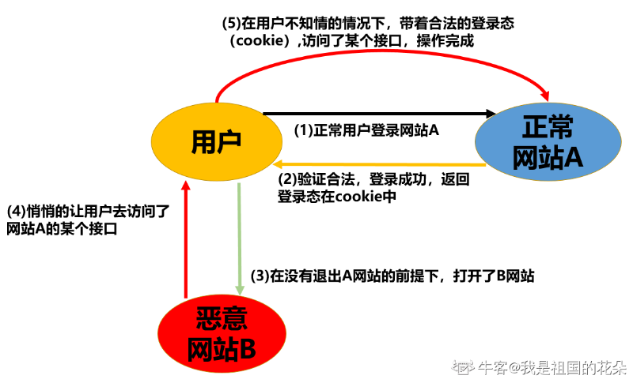
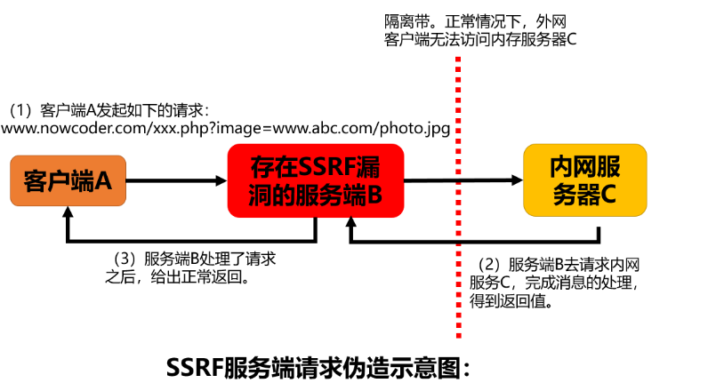

# 1. XSS 跨站脚本攻击

答：**XSS(Cross-Site Scripting)** 跨站脚本攻击是一种常见的安全漏洞，恶意攻击者在用户提交的数据中加入一些代码，将代码嵌入到了Web页面中，从而可以盗取用户资料，控制用户行为或者破坏页面结构和样式等。

## XSS 产生的原因

XSS 产生的原因是过于信任客户端的数据，没有做好过滤或者转义等工作。如果客户端上传的数据中插入一些符号以及 javascript 代码，那么这些数据将会成为应用代码中的一部分了，这样就造成了 XSS 攻击。

## XSS 分类

* **存储型**：攻击者将恶意代码存储到了数据库中，在响应浏览器请求的时候返回恶意代码，并且执行。这种攻击常见于带有用户保存数据的网站功能；
* **反射型**：将恶意代码放在 URL 中，将参数提交到服务器。服务器解析后响应，在响应结果中存在 XSS 代码，最终通过浏览器解析执行；
* **DOM 型**：取出和执行恶意代码由浏览器端完成，属于前端 JavaScript 的安全漏洞。

## XSS 防御

* 对重要的 cookie 设置 httpOnly, 防止客户端通过document.cookie读取 cookie；
* 对输入内容的特定字符进行编码，前端后端都可以对传入的内容进行过滤，去掉带 javascript 等字段的输入

# 2. CSRF 跨站请求伪造

答：**CSRF(Cross-site request forgery)** 跨站请求伪造，也是一种常见的安全漏洞。XSS 相当于是控制了站点内的信任用户，而 CSRF 则通过伪装成受信任用户的请求来利用受信任的网站。

## CSRF 流程

## CSRF 防御

* **Referer 头验证**：在 HTTP 头中有一个字段叫 Referer，它记录了该 HTTP 请求的来源地址。不靠谱，Referer可以被改变；
* **Token验证**：服务器发送给客户端一个 Token，客户端提交的表单中（或者 URL 上）带着这个 Token。如果这个 Token 不合法，那么服务器拒绝这个请求；
* **双重Cookie验证**：利用恶意网站无法获取 cookie 信息，仅可冒用的特点，我们将 cookie 中的参数取出来，加入到请求参数中，服务端进行校验，如果参数中没有附加额外的 cookie 中的参数，那么就拒绝请求。

# 3. SSRF 服务端请求伪造

答：SSRF 是一种由攻击者构造请求，利用服务端发起的一种安全漏洞。一般情况下， SSRF 攻击的目标是外网无法访问的内部系统，借助于公网上的服务器来访问了内网系统。

## SSRF 产生原因

SSRF 形成的原因大都是由于服务端提供了从其他服务器应用获取数据的功能，且没有对目标地址做过滤与限制。

比如指定 URL 地址获取网页文本内容，加载指定地址的图片和文档等。

## SSRF 漏洞出现场景

* 分享场景，通过URL地址分享网页内容。
* 转码服务，在线翻译场景。
* 地址加载或下载图片。
* 图片、文章收藏功能。
* 未公开的api实现以及其他调用URL的功能等。

## SSRF 漏洞危害

因为外网借助了服务端来实现了对内网服务器的访问，所以很多操作都可以进行，包括如下的危害：

* 对服务器所在的内网进行端口扫描，获取一些服务的banner信息等。
* 攻击运行在内网或者本地的应用程序。
* 对内网WEB应用进行指纹识别，通过访问默认文件实现。
* 下载内网的一些资源文件等。

## SSRF 防御措施

* 对错误信息进行统一处理，避免用户可以根据错误信息来判断远端服务器的端口状态。
* 对请求的端口进行限制，限定为 HTTP 常用的端口，比如，80，443 和 8080 等。
* 设定 IP 黑名单。避免应用被用来获取内网数据，攻击内网。
* 禁用不需要的协议。
* 仅仅允许 HTTP 和 HTTPS 请求。对返回信息进行有效过滤等。

# 4. SQL 注入

答：

SQL 注入是指通过把 SQL 命令插入到 Web 表单提交或输入域名或页面请求的查询字符串，最终达到欺骗服务器，执行恶意的 SQL 命令。

比如说用户在登录的时候，使用了 or 1=1 来完成身份验证和授权。

## 常见防御手段

* 使用**预编译语句**，比如 MyBatis 中的 SQL 语句使用 # 号代替 $ 符号。
* 使用安全的**存储过程**来防止 SQL 注入。
* 对客户端的输入进行**数据类型的检查**等。

