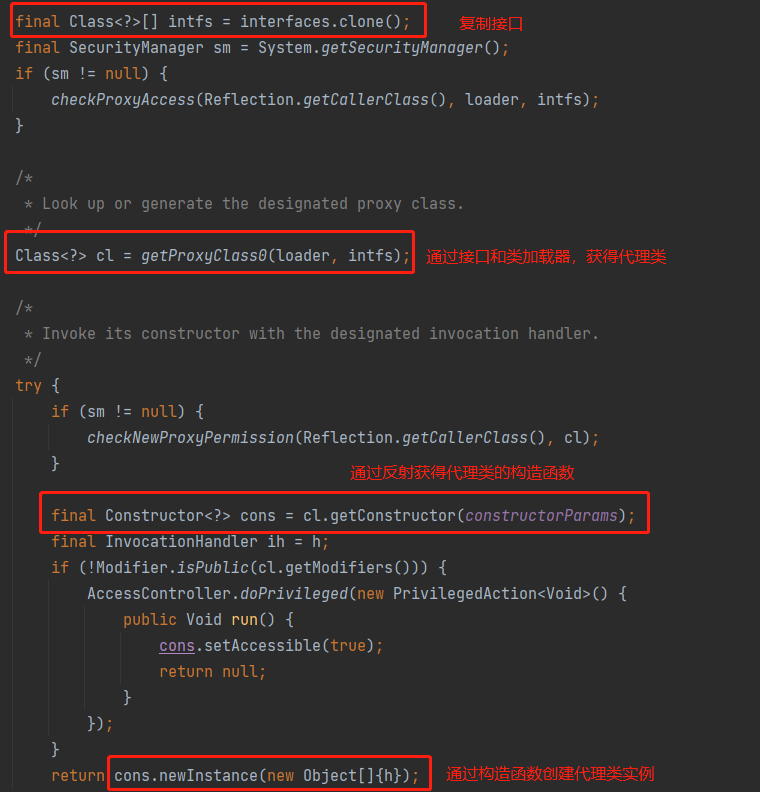

# 1. 动态代理的小实例
1. 定义一个程序员接口 Develop，它可以开发代码并进行调试。

```java
package JavaBase;

/**
 * 定义抽象角色
 */
public interface Developer {

    public void code();

    public void debug();

}
```

2. 定义一个 Java 程序员 JavaDeveloper，以开发和调试 Java 代码。

```java
package JavaBase;

/**
 * 创建真实角色
 */
public class JavaDeveloper implements Developer {

    private String name;

    public JavaDeveloper(String name) {
        this.name = name;
    }

    @Override
    public void code() {
        System.out.println(this.name + " is coding java !");
    }

    @Override
    public void debug() {
        System.out.println(this.name + " is debugging java !");
    }
}
```

3. 而我本人，作为一个 java 后端开发，在写代码之前必须要吃饱！在调试代码之前必须要祈祷！但不是每一个 java 程序员都有这些习惯，每个人的习惯也不尽相同，此时就需要动态的去实现这些特性，而不是一个一个的去实现每一个特性。

```java
package JavaBase;

import java.lang.reflect.Proxy;

/**
 * 动态代理的实现
 */
public class DynamicProxy {

    public static void main(String[] args) {
        // 创建实际角色
        JavaDeveloper leo = new JavaDeveloper("Leo");

        // 获取代理对象
        Developer leoProxy = (Developer) Proxy.newProxyInstance(leo.getClass().getClassLoader(), leo.getClass().getInterfaces(), ((proxy, method, args1) -> {
            if (method.getName().equals("code")) {
                System.out.println("编码之前要吃饭！");
                method.invoke(leo, args);
            }
            if (method.getName().equals("debug")) {
                System.out.println("调试之前要祈祷！");
                method.invoke(leo, args);
            }
            return null;
        }));

        // 使用代理对象执行方法查看代理结果
        leoProxy.code();
        leoProxy.debug();
    }

}
```

# 2. 动态代理的简介
如上述实例，动态代理中主要存在三个角色：抽象角色、真实角色和代理角色。其中，抽象角色一般是一个接口或者抽象类，用来声明某些动作(方法)；真实角色是抽象角色的实现类，它真正实现了一个对象，定义了对应的动作；
而代理角色是对真实角色的一个代理，它类似于一个中介，我们可以使用代理对象来为真实对象添加不同的特性(比如在某一动作前后执行其他动作)，而在真正执行动作的时候还是调用真实角色去处理。
这样做的好处是可以在不改变原来代码的基础上对之前定义的方法进行扩展，其重要的运用就是 Spring 中的 AOP。

# 3. 静态代理与动态代理
所谓静态代理，就是首先创建一个接口，然后创建一个类实现该接口。之后再手动创建一个代理类，这个代理类同样实现之前的接口，并将实现类注入到这个代理类当中(可以通过构造器注入)，这样就实现了静态代理。

静态代理与动态代理的区别：
* 静态代理：需要由程序员手动创建代理类并对其进行编译，在程序运行之前代理类的 .class 文件就已经存在了
* JavaBase：在程序运行的过程中运用反射的机制动态的创建生成代理类

# 4. 动态代理原理

## 4.1 newProxyInstance() 方法
```java
    @CallerSensitive
    public static Object newProxyInstance(ClassLoader loader,
                                          Class<?>[] interfaces,
                                          InvocationHandler h)
        throws IllegalArgumentException{}
```
* loader：选用的类加载器，一般代理谁就用谁的类加载器
* interfaces：被代理类实现的接口，该接口可以是多个
* h：绑定代理类的方法

## 4.2 InvocationHandler 接口
```java 
public interface InvocationHandler {
    public Object invoke(Object proxy, Method method, Object[] args)
        throws Throwable;
}
```
这个接口用来定义与被代理对象绑定的方法，其 invoke() 方法接收 3 个参数：
* proxy：被代理后的实例对象
* method：被调用的方法
* args：调用时的参数

## 4.3 动态代理流程
1. 通过实现 InvocationHandler 接口创建自己的调用处理器(即定义与被代理对象绑定的方法)
2. 通过为 Proxy 类指定 ClassLoader 对象和一组 interfaces 以及设置指定调用处理器来创建动态代理类
3. 通过反射机制获得动态代理类的构造函数，其唯一参数类型是调用处理器接口类型
4. 通过构造函数创建动态代理类实例，构造时调用处理器对象作为参数被传入

