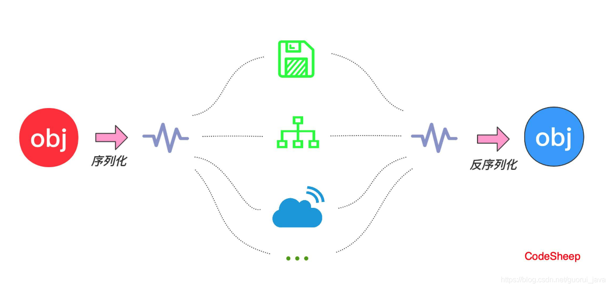
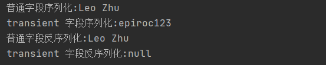

# 1. 序列化与反序列化
## 1.1 序列化与反序列化定义
* 序列化：Java 序列化是指将 Java 对象转换为字节序列的过程
* 反序列化：Java 反序列化是指将字节序列恢复为 Java 对象的过程

## 1.2 序列化与反序列化作用
* 序列化：可以在传递和保存对象的时候保持对象的完整性和可传递性。将对象转换为有序字节流，可以在网络上传输或者保存在本地文件中(json/xml文件)
* 反序列化：根据字节流中保存的对象状态以及描述信息，可以通过反序列化重建对象



## 1.3 序列化与反序列化的优缺点
* 优点
  * 可以永久性的保存对象(保存在硬盘上)
  * 序列化为字节流形式的对象可以进行网络传输
  * 通过序列化可以在进程间传递对象
* 缺点
  * 无法跨语言
  * 序列化后流的长度比通过缓冲区处理要大的多
  * 序列化性能较低  

# 2. 序列化的使用场景
1. 分布式传递对象或者网络传输对象时，需要序列化；
2. 我需要调用你的 JVM 的方法并将结果返回到我的 JVM 上进行处理；
3. 需要保持对象的状态的情况。例如：tomcat 关闭后会把 session 对象序列化到 SESSIONS.ser 文件当中，等下次启动时将这些 session 重新加载到内存当中；
4. 数据需要传输并复原。比如一个人员名单的列表需要保存，就可以将该列表序列化并传输到后台，经反序列化后直接进行对象的保存；
5. 分布式存储、缓存存储等。

# 3. 序列化使用的注意事项
## 3.1 Java 序列化的方式
* 实现 Serializable 接口：可以自定义 writeObject()/readObject()/writeResole()/readResole() 方法，通过反射调用；
* 实现 Externalizable 接口：需要实现 writeExternal() 和 readExternal() 方法。

## 3.2 序列化的 id 问题
虚拟机是否允许反序列化，不仅取决于类路径和功能代码是否一致，还要比较两个类的序列化 id 是否一致。即 `private static final long serialVersionUID`

## 3.3 静态字段不会被序列化
在序列化时不会保存静态变量，因为序列化保存的是对象的状态，而静态变量属于类的状态，因此在序列化时不会保存静态字段。

注意：当一个对象的实例变量引用了其他对象，则该对象序列化时同时也会将引用对象进行序列化。

## 3.4 transient 关键字
被 transient 字段修饰的数据代表对象的临时数据。如果我们在对对象进行序列化时，不想让其中的某一个成员被序列化，此时就可以使用 transient 关键字修饰该成员，这样该成员在该对象被序列化时就不会被保存。
transient 修饰的成员变量在经反序列化后被默认赋值为 0 或者 null。

有时对于银行卡号、密码等信息字段，我们不希望他们可以在网络上传播，就可以使用 transient 关键字修饰。transient 的作用就是将字段的生命周期限制在调用者的内存而不会写入磁盘进行持久化！

## 3.5 父类的序列化
当一个父类实现序列化，其子类自动实现序列化；而当一个子类实现了 Serializable 接口，其父类也必须实现这个接口！

## 3.6 并非所有的对象都可以序列化
1. 安全方面，如一个对象拥有 private、public 等 field。而需要传输该对象时，在序列化传输的过程中，这个对象的 private 域是不受保护的。
2. 资源分配方面，对于 socket、thread 类，即使可以进行序列化保存或者传输，也无法对他们进行重新的资源分配。

## 3.7 序列化可以解决深拷贝问题
如果一个对象的成员变量是一个引用对象，那么在序列化时这个引用对象的数据同样会被保存。这也是序列化可以解决深拷贝问题的原因。

# 4. 序列化使用示例
实体类 User：
```java
public class User implements Serializable {

    private static final long serialVersionUID = 1L;

    private String username;

    private transient String password;

    public User(String username, String password) {
        this.username = username;
        this.password = password;
    }
    // set、get 略
}
```

序列化示例：
```java
public class TransientTest {

    public static void main(String[] args) {
        try {
            SerializeUser();
            DeSerializeUser();
        } catch (Exception e) {
            e.printStackTrace();
        }
    }

    // 序列化
    public static void SerializeUser() throws IOException {
        User user = new User("Leo Zhu", "epiroc123");
        ObjectOutputStream oos = new ObjectOutputStream(new FileOutputStream("/data.txt"));
        oos.writeObject(user);
        oos.close();
        System.out.println("普通字段序列化:" + user.getUsername());
        System.out.println("transient 字段序列化:" + user.getPassword());
    }

    // 反序列化
    public static void DeSerializeUser() throws IOException, ClassNotFoundException {
        File file = new File("/data.txt");
        ObjectInputStream ois = new ObjectInputStream(new FileInputStream(file));
        User user = (User) ois.readObject();
        System.out.println("普通字段反序列化:" + user.getUsername());
        System.out.println("transient 字段反序列化:" + user.getPassword());
    }

}
```

测试代码结果：




