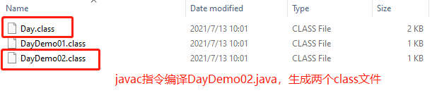
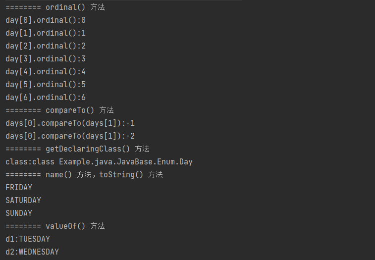
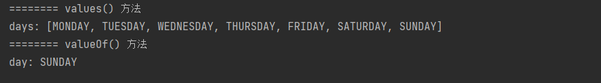

# 1. 理解枚举类型
枚举类型是 Java 5 中新增的特性，它是一种特殊的存在，因为它既是一种类但又比普通类多了一些特殊的约束。

## 1.1 枚举的定义
首先回忆一下在没有枚举类型时我们是如何定义常量的：
```java
/**
 * 普通类定义日期常量
 */
public class DayDemo01 {

    public static final int MONDAY = 1;
    
    public static final int TUESDAY = 2;
    
    public static final int WEDNESDAY = 3;
    
    public static final int THURSDAY = 4;
    
    public static final int FRIDAY = 5;
    
    public static final int SATURDAY = 6;
    
    public static final int SUNDAY = 7;
    
}
```
上述的定义方式称为 int 枚举模式，这种定义方式没有错误，但存在许多的不足（比如在类型安全方面和使用方便性上）。
下面使用枚举类型来重新定义上述变量：
```java
/**
 * 枚举类型定义变量
 */
public class DayDemo02 {

    public static void main(String[] args) {
        // 直接引用
        Day day = Day.THURSDAY;
    }
    // 定义枚举类型
    enum Day {
        MONDAY, TUESDAY, WEDNESDAY, THURSDAY,
        FRIDAY, SATURDAY, SUNDAY
    }
    
}
```
使用枚举定义常量则相当简洁，使用关键字 enum 即可，与 class 关键字类似。枚举类型 Day 中定义了从周一到周日的值，需要注意，枚举中的值一般是大写的字母，多个值之间以逗号隔开。
枚举类型可以像 class 一样定义为一个单独的文件，也可以在其他类的内部定义。最重要的是，枚举常量在类型安全性和便捷性方面都有保证，如果出现问题编译器也会提醒我们改正。
另外，必须注意的是，枚举类型的取值必须是有限个的，即每个值都可以枚举出来。


## 1.2 枚举的实现原理
实际上，在使用关键字 enum 创建枚举类型并进行编译后，编译器会为我们创建一个相关的类，这个类继承了 Java API 中的 java.lang.Enum 类。
也就是说，通过关键字 enum 创建的枚举类型在编译之后也是一个 class 类型，并且该类继承自 java.lang.Enum 类。



经过反编译 Day.class 后(去语法糖，使用 Xjad 反编译工具)，结果如下：

```java
//反编译Day.class
final class Day extends Enum {
    // 定义的 7 中枚举实例，他们都为 Day 枚举类
    public static final Day MONDAY;
    public static final Day TUESDAY;
    public static final Day WEDNESDAY;
    public static final Day THURSDAY;
    public static final Day FRIDAY;
    public static final Day SATURDAY;
    public static final Day SUNDAY;
    private static final Day $VALUES[];

    // 编译器为我们添加的静态方法：values()
    public static Day[] values() {
        return (Day[]) $VALUES.clone();
    }

    // 编译器为我们添加的静态方法：valueOf()，其调用了 Enum 父类的 valueOf() 方法
    public static Day valueOf(String name) {
        return (Day) Enum.valueOf(JAVA.Example / java / JavaBase / Enum / Day, name);
    }

    // 私有构造函数
    private Day(String s, int i) {
        super(s, i);
    }

    static {
        // 在静态代码块中实例化枚举实例
        MONDAY = new Day("MONDAY", 0);
        TUESDAY = new Day("TUESDAY", 1);
        WEDNESDAY = new Day("WEDNESDAY", 2);
        THURSDAY = new Day("THURSDAY", 3);
        FRIDAY = new Day("FRIDAY", 4);
        SATURDAY = new Day("SATURDAY", 5);
        SUNDAY = new Day("SUNDAY", 6);
        $VALUES = (new Day[]{
                MONDAY, TUESDAY, WEDNESDAY, THURSDAY, FRIDAY, SATURDAY, SUNDAY
        });
    }
}
```
对反编译的代码进行分析：
1. `final class Day extends Enum`，证明 enum 实际上确实是一个继承自 Enum 的 class 类（Enum 是一个抽象类），并且其被 final 修饰，将无法被继承。
2. 编译器帮我们生成了 7 个 Day 类型的枚举实例，说明我们使用 enum 关键字定义的 Day 类型中的枚举常量也是 Day 实例对象。
3. 编译器还为我们创建了两个静态方法：values() 和 valueOf(String name)，这两个方法稍后分析。

# 2. 枚举的常用方法
## 2.1 Enum 抽象类的常见方法
| 返回类型 | 方法名称 | 方法说明 |
| --- | --- | --- |
| int | compareTo(E o) | 比较此枚举与指定对象的顺序 |
| boolean | equals(Object other) | 当指定对象等于此枚举常量时，返回 true | 
| Class<?> | getDeclaringClass() | 返回与此枚举常量的枚举类型相对应的 Class 对象 |
| String | name() | 返回此枚举常量的名称，在其枚举声明中对其进行声明 | 
| int | ordinal() | 返回枚举常量的序数(即其在枚举常量中的位置，其中初始常量序数为零) |
| String | toString() | 返回枚举常量的名称，它包含在声明中 |
| static<T extends Enum<T>> T | static valueOf(Class<T> enumType, String name) | 返回指定名称的指定类型的枚举常量 |

测试代码：
```java
/**
 * 枚举类型定义变量
 */
public class DayDemo02 {

    public static void main(String[] args) {
        // 创建枚举数组
        Day[] days = new Day[]{Day.MONDAY, Day.TUESDAY, Day.WEDNESDAY, Day.THURSDAY,
                Day.FRIDAY, Day.SATURDAY, Day.SUNDAY};
        // ordinal() 方法
        System.out.println("======== ordinal() 方法");
        for (int i = 0; i < days.length; i ++ ) {
            System.out.println("day[" + i + "].ordinal():" + days[i].ordinal());
        }
        // compareTo() 方法
        System.out.println("======== compareTo() 方法");
        System.out.println("days[0].compareTo(days[1]):" + days[0].compareTo(days[1]));
        System.out.println("days[0].compareTo(days[1]):" + days[0].compareTo(days[2]));
        // getDeclaringClass() 方法
        System.out.println("======== getDeclaringClass() 方法");
        Class<Day> clazz = days[3].getDeclaringClass();
        System.out.println("class:" + clazz);
        // name() 方法，toString() 方法
        System.out.println("======== name() 方法，toString() 方法");
        System.out.println(days[4].name());
        System.out.println(days[5].name());
        System.out.println(days[6].toString());
        // valueOf() 方法
        System.out.println("======== valueOf() 方法");
        Day d1 = Enum.valueOf(Day.class, days[1].name());
        Day d2 = Day.valueOf(days[2].name());
        System.out.println("d1:" + d1);
        System.out.println("d2:" + d2);
    }
}

// 定义枚举类型
enum Day {
    MONDAY, TUESDAY, WEDNESDAY, THURSDAY,
    FRIDAY, SATURDAY, SUNDAY
}
```

测试结果：



进一步观察 Enum 源码(此处略)，可以发现：
* Enum 实现了 Comparable 接口，这也是其可以使用 compareTo 进行比较的原因
* Enum 存在构造函数，但其被 private 修饰，只能由编译器调用。我们只需要通过关键字 enum 定义枚举，其他的交给表一起就好(语法糖？)

## 2.2 values() 与 valueOf() 方法
```java
public class DayDemo03 {

    public static void main(String[] args) {
        Day[] days = Day.values();
        System.out.println("======== values() 方法");
        System.out.println("days: " + Arrays.toString(days));
        Day day = Day.valueOf("SUNDAY");
        System.out.println("======== valueOf() 方法");
        System.out.println("day: " + day);
    }

}
```
测试结果：



从结果可知道，values() 方法的作用就是获取枚举类中的所有变量，并作为数组返回；
valueOf(String name) 方法与 Enum 类中的 valueOf() 方法的作用类似，也是根据名称获取枚举变量，只不过编译器生成的 valueOf() 方法更简洁，只需传递一个参数。

# 3. 枚举的进阶用法
## 3.1 向 enum 类中添加方法和自定义构造函数
```java
/**
 * 向 enum 类中添加方法和自定义构造函数
 */
public class DayDemo04 {

    public enum Year {
        SPRING("春"), SUMMER("夏"), AUTUMN("秋"), WINTER("冬");

        // 定义属性：中文描述
        private String desc;

        // 私有化构造函数，禁止外部调用
        private Year(String desc) {
            this.desc = desc;
        }

        // desc 的 get() 方法
        public String getDesc() {
            return desc;
        }
    }

    public static void main(String[] args) {
        for (Year year: Year.values()) {
            System.out.println("name：" + year.name() + "；desc：" + year.getDesc());
        }
    }
    
    /**
     * 运行结果：
     * name：SPRING；desc：春
     * name：SUMMER；desc：夏
     * name：AUTUMN；desc：秋
     * name：WINTER；desc：冬
     */

}
```

## 3.2 覆盖 Enum 类方法
```java
/**
 * 覆盖 Enum 类方法
 */
public class DayDemo05 {

    public enum Color {
        RED("红"), YELLOW("黄"), BLUE("蓝");

        private String desc;

        private Color(String desc) {
            this.desc = desc;
        }

        // 重写父类 Enum 的 toString() 方法
        @Override
        public String toString() {
            return this.desc;
        }
    }

    public static void main(String[] args) {
        for (Color color: Color.values()) {
            System.out.println("toString：" + color.toString());
        }
    }

    /**
     * 运行结果：
     * toString：红
     * toString：黄
     * toString：蓝
     */

}
```

## 3.3 enum 类中定义抽象方法
```java
/**
 * enum 类中定义抽象方法
 */
public class DayDemo06 {

    public enum Plant {
        GREEN {
            @Override
            public String getDesc() {
                return "小草";
            }
        }, TREE {
            @Override
            public String getDesc() {
                return "小树";
            }
        }, FLOWER {
            @Override
            public String getDesc() {
                return "小花";
            }
        };
        
        // 定义抽象方法
        public abstract String getDesc();
    }

    public static void main(String[] args) {
        for (Plant plant: Plant.values()) {
            System.out.println("desc：" + plant.getDesc());
        }
    }

    /**
     * 运行结果：
     * desc：小草
     * desc：小树
     * desc：小花
     */
}
```

# 4. enum 类与 Class 对象和接口
## 4.1 enum 与 Class 对象
当我们将枚举实例向上转型为 Enum 类型后，其 values() 方法将会失效，也就无法一次性的获取到所有的枚举实例变量。
但是由于 Class 的存在，即使不使用 values() 方法，也可以一次性的获取到所有枚举实例变量，因为在 Class 对象中存在如下方法：

| 返回类型 | 方法名称 | 方法说明 | 
| --- | --- | --- |
| T[] | getEnumConstants() | 返回该枚举类型的所有元素，如果该元素不是枚举类型则返回 null |
| boolean | isEnum() | 当且仅当该类声明为源代码中的枚举时返回 true |

```java
public class DayDemo07 {

    public static void main(String[] args) {
        // 未向上转型时，正常调用
        Day[] days = Day.values();
        Enum<Day> e = Day.MONDAY;
        // e.values() 无法调用，无此方法。
        Class<?> declaringClass = e.getDeclaringClass();
        if (declaringClass.isEnum()) {
            Day[] dsz = (Day[]) declaringClass.getEnumConstants();
            System.out.println("dsz：" + Arrays.toString(dsz));
        }
    }

    /**
     * 运行结果：
     * dsz：[MONDAY, TUESDAY, WEDNESDAY, THURSDAY, FRIDAY, SATURDAY, SUNDAY]
     */
}
```

## 4.2 enum 与接口
由于 Java 是单继承的，enum 类并不能再继承其它类，但这并不妨碍它实现接口。

```java
public class DayDemo08 {
    
    public enum Person implements Eat, Sport{
        EAT, SPORT, PLAY, SLEEP;

        @Override
        public void eat() {
            System.out.println("eat......");
        }

        @Override
        public void sport() {
            System.out.println("sport......");
        }
    }
    
}

interface Eat {
    void eat();
}

interface Sport {
    void sport();
}
```

# 5. 枚举与 switch
使用 switch 进行条件判断时，枚举类型也被支持进行判断，枚举与 switch 的使用如下：
```java
/**
 * 枚举与 switch
 */
public class DayDemo09 {

    public static void printName(DayDemo05.Color color) {
        switch (color) {
            case RED:
                System.out.println("红色");
                break;
            case BLUE:
                System.out.println("蓝色");
                break;
            case YELLOW:
                System.out.println("黄色");
                break;
        }
    }

    public static void main(String[] args) {
        printName(DayDemo05.Color.BLUE); // 蓝色
        printName(DayDemo05.Color.RED); // 红色
        printName(DayDemo05.Color.YELLOW); // 黄色
    }

}
```

# 6. 枚举与单例模式


# 7. EnumMap
## 7.1 EnumMap 的基本用法
案例：统计所有衣服各种颜色的数量
```java
/**
 * EnumMap
 */
public class DayDemo10 {

    public static void main(String[] args) {
        List<Clothes> clothesList = new ArrayList<>();
        clothesList.add(new Clothes("C001", DayDemo05.Color.BLUE));
        clothesList.add(new Clothes("C002", DayDemo05.Color.RED));
        clothesList.add(new Clothes("C003", DayDemo05.Color.YELLOW));
        clothesList.add(new Clothes("C004", DayDemo05.Color.BLUE));
        clothesList.add(new Clothes("C005", DayDemo05.Color.YELLOW));
        clothesList.add(new Clothes("C006", DayDemo05.Color.BLUE));
        clothesList.add(new Clothes("C007", DayDemo05.Color.RED));
        clothesList.add(new Clothes("C008", DayDemo05.Color.BLUE));
        clothesList.add(new Clothes("C009", DayDemo05.Color.RED));
        clothesList.add(new Clothes("C010", DayDemo05.Color.RED));
        // 方案1：HashMap
        Map<String, Integer> HashMap = new HashMap<>();
        for (Clothes clothes: clothesList) {
            String color = clothes.getColor().name();
            Integer count = HashMap.get(color);
            if (count != null) {
                HashMap.put(color, count + 1);
            } else {
                HashMap.put(color, 1);
            }
        }
        System.out.println("==========方案1：HashMap");
        System.out.println(HashMap.toString()); // {RED=4, BLUE=4, YELLOW=2}
        // 方案2：EnumMap
        Map<DayDemo05.Color, Integer> EnumMap = new EnumMap<>(DayDemo05.Color.class);
        for (Clothes clothes: clothesList) {
            DayDemo05.Color color = clothes.getColor();
            Integer count = EnumMap.get(color);
            if (count != null) {
                EnumMap.put(color, count + 1);
            } else {
                EnumMap.put(color, 1);
            }
        }
        System.out.println("==========方案2：EnumMap");
        System.out.println(HashMap.toString()); // {RED=4, BLUE=4, YELLOW=2}
    }

}

class Clothes {

    private String name;
    private DayDemo05.Color color;

    public Clothes(String name, DayDemo05.Color color) {
        this.name = name;
        this.color = color;
    }

    public String getName() {
        return name;
    }

    public DayDemo05.Color getColor() {
        return color;
    }
}
```
在上述的案例中，我们使用两种方案解决了问题。两种方式的结果相同，但是 EnumMap 作为枚举的专属集合，其要求 Key 必须为 Enum 类型，且其效率更高。
所以对于诸如上述问题的解决，我们没有必要再使用 HashMap。

## 7.2 EnumMap 原理分析
见源码以及注释
```java
/**
 * EnumMap 继承了 AbstractMap 类，因此其具有一般 map 的方法
 */
public class EnumMap<K extends Enum<K>, V> extends AbstractMap<K, V>
    implements java.io.Serializable, Cloneable
{
    
    /**
     * Class 对象引用，表示类型信息
     */
    private final Class<K> keyType;
    
    /**
     * 存储 Key 值的数组，存储着所有可能的枚举值
     */
    private transient K[] keyUniverse;
    
    /**
     * 存储 Value 值的数组
     */
    private transient Object[] vals;

    /**
     * map 的 size，表示键值对的个数
     */
    private transient int size = 0;

    /**
     * 构造函数
     * 通过 getKeyUniverse 函数初始化了 keyUniverse 数组
     * 接着根据 keyUniverse 的长度初始化存储值的数组 vals，其大小与枚举实例个数相同
     */
    public EnumMap(Class<K> keyType) {
        this.keyType = keyType;
        keyUniverse = getKeyUniverse(keyType);
        vals = new Object[keyUniverse.length];
    }

    /**
     * 返回枚举数组
     * 最终调用到枚举类型的 values() 方法返回所有可能的枚举值
     */
    private static <K extends Enum<K>> K[] getKeyUniverse(Class<K> keyType) {
        return SharedSecrets.getJavaLangAccess()
                .getEnumConstantsShared(keyType);
    }

    /**
     * put() 方法源码
     * 其中，maskNull() 方法：如果值为空，返回 NULL 对象，否则返回 value
     * unmaskNull() 方法：将 NULL 对象转换为 null 值
     * maskNull() 方法和 unmaskNull() 方法正是用于 null 的包装和解包装的
     * EnumMap 还是允许存放 null 值的，但 key 绝对不能为 null
     */
    public V put(K key, V value) {
        // 检测key的类型，判断是否为枚举类型，若不是则抛出异常
        typeCheck(key); 
        // 获取存放 value 值的数组下标，这里就解释了为什么 EnumMap 能维持与枚举实例相同存储顺序的原因
        int index = key.ordinal();
        // 获取旧值
        Object oldValue = vals[index];
        // 设置 value 值
        vals[index] = maskNull(value);
        if (oldValue == null)
            size++;
        return unmaskNull(oldValue); // 返回旧值
    }

    /**
     * get() 方法
     * 其中，isValidKey() 方法：对Key值的有效性和类型信息进行判断
     * key 有效的话，直接通过 ordinal() 方法取索引，然后在值数组 vals 里通过索引获取值返回
     */
    public V get(Object key) {
        return (isValidKey(key) ?
                unmaskNull(vals[((Enum<?>)key).ordinal()]) : null);
    }

    /**
     * remove() 方法
     * key 值有效，通过 key 获取下标索引值，把 vals[] 对应下标值设置为 null，size 减一
     */
    public V remove(Object key) {
        //判断key值是否有效
        if (!isValidKey(key))
            return null;
        //直接获取索引
        int index = ((Enum<?>)key).ordinal();
        
        Object oldValue = vals[index];
        //对应下标元素值设置为null
        vals[index] = null;
        if (oldValue != null)
            size--;//减size
        return unmaskNull(oldValue);
    }

    /**
     * 判断是否包含某 value
     * 判断 value 直接通过遍历数组实现
     */
    public boolean containsValue(Object value) {
        value = maskNull(value);
        //遍历数组实现
        for (Object val : vals)
            if (value.equals(val))
                return true;

        return false;
    }
    
    /**
     * 判断是否包含 key
     * 判断 key 就更简单了，判断 key 是否有效和对应 vals[] 中是否存在该值
     */
    public boolean containsKey(Object key) {
        return isValidKey(key) && vals[((Enum<?>)key).ordinal()] != null;
    }

}
```
