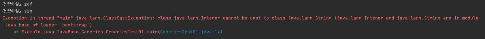
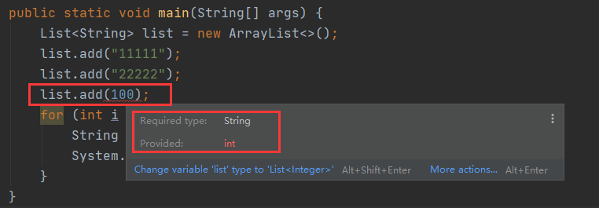

# 1. 泛型的简介和提出背景
Java 泛型是 JDK 1.5 提出的新特性，其本质是将类型参数化，即将操作的数据类型指定为一个参数，这个参数可以在类、接口、方法的创建和使用时指定，分别称为泛型类、泛型接口和泛型方法。

在不适用泛型的情况下，某些参数类型是任意化的，比如使用集合时。任意化参数的缺点是我们在使用内部存储的对象时必须进行显式的参数类型的转换，而这个类型转换的前提是程序员必须知道实际的参数类型，从而进行转换。
而且对于强制类型转换，如果出现错误的情况，编译器也无法预知，只有在运行的时候才出现异常，这将会导致安全隐患。

如下列代码，在本段代码中，对于 List ，在创建时没有使用泛型，最终导致内部存储的数据类型任意，在使用时便出现了异常：
```java
public class GenericsTest01 {
    public static void main(String[] args) {
        List list = new ArrayList();
        list.add("zqf");
        list.add("szn");
        list.add(100);
        for (int i = 0; i < list.size(); i ++) {
            String str = (String) list.get(i);
            System.out.println("泛型测试：" + str);
        }
    }
}
```


为了解决上述问题，泛型便应运而生。我们只需要在创建 List 时定义好泛型，编译器就可以在编译阶段为我们发现问题：



# 2. 泛型的优点
* 类型安全：泛型的主要目的就是提高 Java 类的类型安全。通过声明泛型就可以知道变量的类型限制，使编译器可以帮助我们验证类型。如果不使用泛型，这些类型就只能存在于程序员的大脑里。
* 消除强制类型转换：这会提高代码的可读性，减少出错的概率，使得代码更加清晰和简洁。
* 更高的效率：非泛型编程中，将简单类型作为 Object 类进行传递时会引起 Boxing(装箱) 和 UnBoxing(拆箱) 操作，这两个过程的开销很大。引入泛型后就可以减少这种操作，获得更高的效率。

# 3. 使用泛型的注意事项
1. 定义泛型类时，在`<>`之间定义形式类型参数。例如：`class Test<K, V>`，其中的 K，V 不代表值，而是表示类型；
2. 实例化泛型对象时，要在类后边指定类型参数；
3. 泛型类型必须为引用数据类型，不能为基本数据类型；
4. 不可以定义泛型数组；
5. static 方法中不可以使用泛型；泛型变量也不可以用 static 关键字来修饰；
6. instanceof 不允许存在泛型参数

# 4. 泛型的使用
## 4.1 泛型类
```java
/**
 * 此处T可以随便写为任意标识，常见的如T、E、K、V等形式的参数常用于表示泛型
 * 在实例化泛型类时，必须指定T的具体类型
 */
public class GenericsClass<T> {
    // 成员变量 key 的类型为 T，T 的类型由外部指定
    private T key;

    public GenericsClass(T key) {
        this.key = key;
    }

    public T getKey() {
        return key;
    }

    // 主方法测试
    public static void main(String[] args) {
        GenericsClass<String> genericsClass01 = new GenericsClass<>("Leo Zhu");
        GenericsClass<Integer> genericsClass02 = new GenericsClass<>(123456);
        System.out.println("泛型测试，key=" + genericsClass01.getKey());
        System.out.println("泛型测试，key=" + genericsClass02.getKey());
    }

}
```

## 4.2 泛型接口
泛型接口与泛型类的定义及使用基本相同。泛型接口常被用在各种类的生产器中。
```java
public interface GenericsInterface<T> {
    public T next();
}
```
```java
public class GenericsInterfaceImpl implements GenericsInterface<String>{

    String[] animals = new String[]{"cat", "dog", "frog", "fish"};
    int count;
    @Override
    public String next() {
        if (count == animals.length) count = 0;
        return animals[count ++];
    }

    // 主测试程序
    public static void main(String[] args) {
        GenericsInterfaceImpl genericsInterfaceImpl = new GenericsInterfaceImpl();
        System.out.println(genericsInterfaceImpl.next());
        System.out.println(genericsInterfaceImpl.next());
        System.out.println(genericsInterfaceImpl.next());
        System.out.println(genericsInterfaceImpl.next());
        System.out.println(genericsInterfaceImpl.next());
        System.out.println(genericsInterfaceImpl.next());
    }
}
```

## 4.3 泛型方法
```java
public class GenericsMethod {

    public static void main(String[] args) {
        try {
            Object test01 = genericMethod(GenericsTest01.class);
            System.out.println(test01);
            Object test02 = genericMethod(GenericsTest02.class);
            System.out.println(test02);
        } catch (Exception e) {
            e.printStackTrace();
        }
    }

    // 使用泛型构造一个类的实例对象
    public static <T> T genericMethod(Class<T> tClass) throws InstantiationException, IllegalAccessException {
        T instance = tClass.newInstance();
        return instance;
    }
}
```

# 5. 泛型的上下界
* 设定通配符上限：`? extend T`
* 设定通配符下限：`? super T`

# 6. 泛型的其他特性
## 6.1 兼容性
当把带有泛型特性的集合赋值给老版本的集合时候，会把泛型给擦除了。值得注意的是，它保留的是类型参数的上限。

## 6.2 泛型擦除
泛型是提供给 javac 编译器使用的，它用于限定集合的输入类型，让编译器在源代码级别上，即挡住向集合中插入非法数据。
但编译器编译完带有泛形的 java 程序后，生成的 class 文件中将不再带有泛形信息，以此使程序运行效率不受到影响，这个过程称之为“擦除”。

# 7. 泛型的应用
Mybatis-plus 中 Mapper 可以继承 `BaseMapper<T>`
