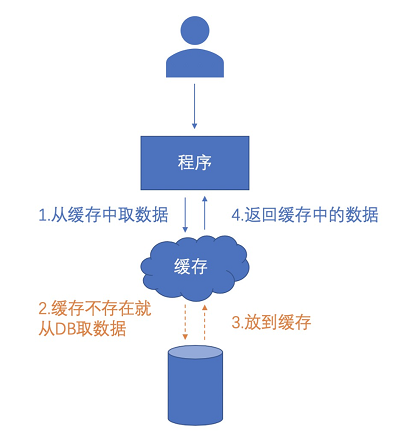
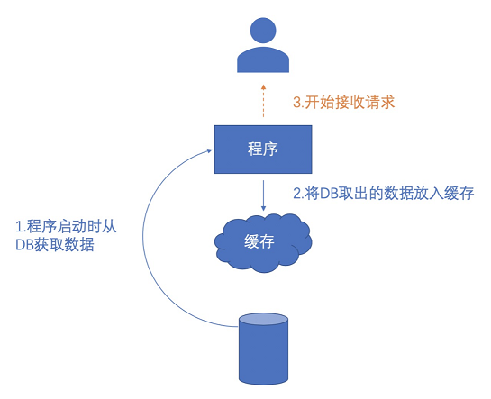
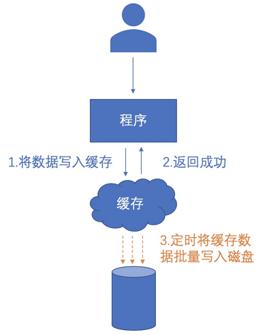
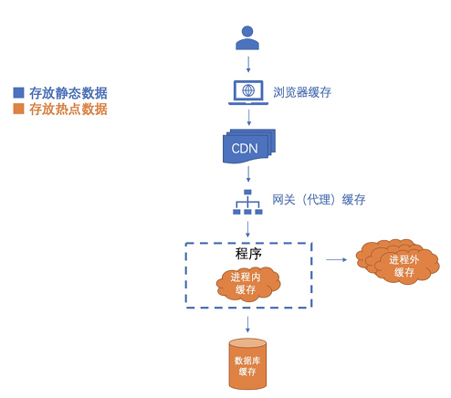

# 1. 缓存的作用
缓存之所以速度快是因为其是基于内存创建的，内存的读写速度比硬盘快很多倍，所以用内存代替磁盘作为读写的介质可以大大提高访问数据的速度。

缓存使用的过程如下，通过在内存中存储访问过的数据以供后续的访问使用，从而达到提高速度的效果。

# 2. 缓存的运用方式
## 2.1 预读取
预读取就是预先读取将要载入的数据，也可以称作“预存预热”，它是在系统中先将硬盘中的一部分加载到内存中，然后再对外提供服务。
有些系统一旦启动就要面临数以万计的请求进来，如果直接让这些请求打到数据库上，非常大的可能是数据库压力暴增，直接被反扒下，无法正常响应。
为了缓解这个问题，就需要通过“预读取”来解决。

## 2.2 延迟写
数据库的写入速度是慢于读取速度的，因为写入的时候有一系列的保证数据准确性的机制。所以，如果想提升写入速度的话，要么做分库分表，要么就是通过缓存来进行一道缓冲，再一次性批量写到磁盘，以此来提速。

通过缓存机制来加速“写”的过程就可以称作“延迟写”，它是预先将需要写入磁盘或数据库的数据，暂时写入到内存，然后返回成功，再定时将内存中的数据批量写入到磁盘。

# 3. 缓存的分类
首先要搞清楚什么样的数据需要缓存？
1. 热点数据：被高频访问
2. 静态数据：很少变化，读多于写

缓存本身相当于一个防御性的机制，其保护数据库，相当于对请求做一个筛选，类似路障。以终端用户为起点，系统数据库为重点，缓存可以设立在如下位置：

## 3.1 浏览器缓存
借助用户的资源，将缓存存储在用户的终端设备上。该方式性价比高，让用户帮忙分担压力。 比如用户的浏览器就会缓存一些图片、js、css 等静态数据。

但浏览器缓存是在用户侧的缓存点，所以我们对它的掌控力比较差，在没有发起新请求的情况下，无法主动去更新数据。

## 3.2 CDN 缓存
提供 CDN 服务的服务商，在各地部署着大量的服务器节点。我们可以将数据分发到这些服务器上作为缓存，让用户就近访问服务器获取数据，起到分摊压力和加速的效果。

但是需要注意的是，由于节点众多，更新缓存数据比较缓慢，一般至少是分钟级别，所以一般仅适用于不经常变动的静态数据。

## 3.3 网关缓存
网关是业务无关的，它对请求进行拦截对背后的服务器有很大的收益，减少大量 CPU 运算。

常见的网关缓存有 Varnish、Squid 与 Ngnix。

## 3.4 进程内缓存
从这里开始对缓存的引入成本比前面3种大大增加，因为对缓存与数据库之间的“数据一致性”要求更高了。

## 3.5 进程外缓存
进程外缓存即 Redis 与 Memcached 之类。

## 3.6 数据库缓存
数据库本身也是自带缓存模块的，可以通过设置缓存空间大小进行干预。

# 4. 缓存的一些问题
## 4.1 缓存雪崩
概述：缓存雪崩指缓存在同一时间大面积的失效，而此时又有大量的请求发送到数据库上，导致数据库连接异常。

解决方法：可以给缓存设置不同的缓存时间，更新数据使用互斥锁，或者通过双缓存避免缓存雪崩。

## 4.2#缓存击穿
概述：redis 中存储的是热点数据，当高并发请求访问 redis 中的热点数据时，若 redis 中的数据过期了，就会造成缓存击穿现象，请求穿过缓存直接打在了数据库上。

解决方法：使用互斥锁，只让一个请求去 load DB，成功之后重新写缓存。而其他的请求没有获取到互斥锁，可以尝试重新获取缓存中的数据。

## 4.3 缓存穿透
概述：故意去请求缓存中不存在的数据，导致请求全部打在数据库上，导致数据库异常。

解决方法：可以使用互斥锁，或者无论是否取到结果都将结果存入缓存，还可以使用有效的机制（例如布隆过滤器）来拦截不合法的 key 值。

## 4.4 数据库和缓存的双写一致性问题
概述：在高并发请求下容易导致数据不一致的问题，若业务需要强一致性，建议不使用缓存。在数据库中和缓存数据的删除或者写入过程中，如果有失败的情况，会导致数据的不一致。