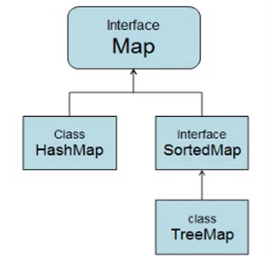

# 1. 集合框架源码分析

[资料](https://lazydog036.gitee.io/2020/10/29/JAVA%E9%9B%86%E5%90%88%E6%A1%86%E6%9E%B6/#%E9%9B%86%E5%90%88%E6%A6%82%E8%BF%B0)




## 1.1 HashMap

```java
    /**
     * 默认初始化容量：1000 --> 16
     */
    static final int DEFAULT_INITIAL_CAPACITY = 1 << 4; // aka 16
    
    /**
     * 默认最大容量
     */
    static final int MAXIMUM_CAPACITY = 1 << 30;
    
     /**
     * 默认加载因子
     * 判断数组是否扩容的一个因子。假如数组容量为100，如果HashMap的存储元素个数超过了100*0.75=75，那么就会进行扩容
     */
    static final float DEFAULT_LOAD_FACTOR = 0.75f;
    
    /**
     * 链表调整为红黑树的的链表长度阈值
     */
    static final int TREEIFY_THRESHOLD = 8;

    /**
     * 红黑树调整为链表的链表长度阈值
     */
    static final int UNTREEIFY_THRESHOLD = 6;

    /**
     * 链表调整为红黑树的数组最小阈值
     * 并不是只要链表长度大于8就可以转换成红黑树，在前者条件成立的情况下，数组的容量必须大于等于64才会进行转换。
     */
    static final int MIN_TREEIFY_CAPACITY = 64;
    
    /**
     * HashMap 中维护的链表节点
     */
    static class Node<K,V> implements Map.Entry<K,V> {
        final int hash;
        final K key;
        V value;
        Node<K,V> next;

        Node(int hash, K key, V value, Node<K,V> next) {
            this.hash = hash;
            this.key = key;
            this.value = value;
            this.next = next;
        }
    
    /**
     * HashMap 中维护的数组
     */
    transient Node<K,V>[] table;

    /**
     * HashMap 中元素的个数
     */
    transient int size;
    
    /**
     * HashMap 的无参构造方法
     * 只是赋值了一个默认加载因子；而源码中table和size都没有赋予初始值，说明刚创建的HashMap对象没有分配容量，并不拥有默认的16个空间大小，这样做的目的是为了节约空间，此时table为null，size为0
     */
    public HashMap() {
        this.loadFactor = DEFAULT_LOAD_FACTOR; // all other fields defaulted
    }
    
    /**
     * 添加元素的方法
     */
    public V put(K key, V value) {
        return putVal(hash(key), key, value, false, true);
    }

    /**
     * 添加元素最终调用的方法
     */
    final V putVal(int hash, K key, V value, boolean onlyIfAbsent,
                   boolean evict) {
        Node<K,V>[] tab; Node<K,V> p; int n, i;
        if ((tab = table) == null || (n = tab.length) == 0)
            n = (tab = resize()).length;
        if ((p = tab[i = (n - 1) & hash]) == null)
            tab[i] = newNode(hash, key, value, null);
        else {
            Node<K,V> e; K k;
            if (p.hash == hash &&
                ((k = p.key) == key || (key != null && key.equals(k))))
                e = p;
            else if (p instanceof TreeNode)
                e = ((TreeNode<K,V>)p).putTreeVal(this, tab, hash, key, value);
            else {
                for (int binCount = 0; ; ++binCount) {
                    if ((e = p.next) == null) {
                        p.next = newNode(hash, key, value, null);
                        if (binCount >= TREEIFY_THRESHOLD - 1) // -1 for 1st
                            treeifyBin(tab, hash);
                        break;
                    }
                    if (e.hash == hash &&
                        ((k = e.key) == key || (key != null && key.equals(k))))
                        break;
                    p = e;
                }
            }
            if (e != null) { // existing mapping for key
                V oldValue = e.value;
                if (!onlyIfAbsent || oldValue == null)
                    e.value = value;
                afterNodeAccess(e);
                return oldValue;
            }
        }
        ++modCount;
        if (++size > threshold)
            resize();
        afterNodeInsertion(evict);
        return null;
    }
```

## 1.2 ArrayList

```java
    /**
     * 默认初始容量
     */
    private static final int DEFAULT_CAPACITY = 10;
    
    /**
     * 使用无参构造是的默认空数组
     */
    private static final Object[] DEFAULTCAPACITY_EMPTY_ELEMENTDATA = {};

    /**
     * 存放数据的数组
     */
    transient Object[] elementData; // non-private to simplify nested class access

    /**
     * 实际元素个数
     */
    private int size;
    
    /**
     * 有参构造：指定初始的容量
     */
    public ArrayList(int initialCapacity) {
        if (initialCapacity > 0) {
            this.elementData = new Object[initialCapacity];
        } else if (initialCapacity == 0) {
            this.elementData = EMPTY_ELEMENTDATA;
        } else {
            throw new IllegalArgumentException("Illegal Capacity: "+
                                               initialCapacity);
        }
    }

    /**
     * 无参构造：初始容量为0
     */
    public ArrayList() {
        this.elementData = DEFAULTCAPACITY_EMPTY_ELEMENTDATA;
    }

    /**
     * 添加元素的方法
     */
    public boolean add(E e) {
        modCount++;
        add(e, elementData, size);
        return true;
    }
    
    /**
     * 真正调用的添加元素的方法
     */
    private void add(E e, Object[] elementData, int s) {
        if (s == elementData.length)
            elementData = grow();
        elementData[s] = e;
        size = s + 1;
    }
    
    /**
     * 初始化以及扩容机制
     */
    private Object[] grow(int minCapacity) {
        int oldCapacity = elementData.length;
        if (oldCapacity > 0 || elementData != DEFAULTCAPACITY_EMPTY_ELEMENTDATA) {
            int newCapacity = ArraysSupport.newLength(oldCapacity,
                    minCapacity - oldCapacity, /* minimum growth */
                    oldCapacity >> 1           /* preferred growth */);
            return elementData = Arrays.copyOf(elementData, newCapacity);
        } else {
            return elementData = new Object[Math.max(DEFAULT_CAPACITY, minCapacity)];
        }
    }

    private Object[] grow() {
        return grow(size + 1);
    }
    
    /**
     * 扩容代码：每次扩容 1.5 倍
     */
    public static int newLength(int oldLength, int minGrowth, int prefGrowth) {
        // assert oldLength >= 0
        // assert minGrowth > 0

        int newLength = Math.max(minGrowth, prefGrowth) + oldLength;
        if (newLength - MAX_ARRAY_LENGTH <= 0) {
            return newLength;
        }
        return hugeLength(oldLength, minGrowth);
    }
```

## 1.3 LinkedList

```java
    /**
     * 链表大小
     */
    transient int size = 0;

    /**
     * 头节点指针
     */
    transient Node<E> first;

    /**
     * 尾节点指针
     */
    transient Node<E> last;
    
    /**
     * 尾内部维护的 Node 节点类
     */
    private static class Node<E> {
        E item;
        Node<E> next;
        Node<E> prev;

        Node(Node<E> prev, E element, Node<E> next) {
            this.item = element;
            this.next = next;
            this.prev = prev;
        }
    }
    
    /**
     * 添加元素
     */
    public boolean add(E e) {
        linkLast(e);
        return true;
    }
    
    /**
     * 组成双向链表
     */
    void linkLast(E e) {
        final Node<E> l = last;
        final Node<E> newNode = new Node<>(l, e, null);
        last = newNode;
        if (l == null)
            first = newNode;
        else
            l.next = newNode;
        size++;
        modCount++;
    }
```

## 1.4 HashSet

```java
    /**
     * 底层就是一个 HashMap
     */
    public HashSet() {
        map = new HashMap<>();
    }
```

