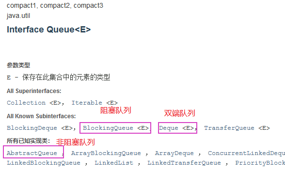
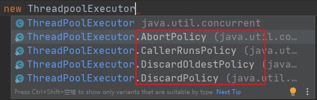
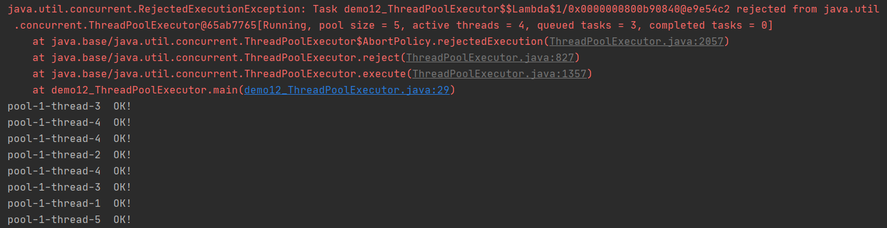
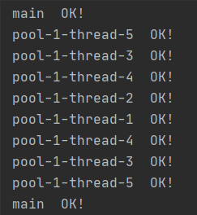
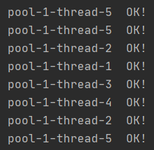
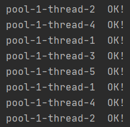

# 1. JUC 概述

## 1.1 什么是 JUC


## 1.2 线程和进程

* 进程就是一个程序，可以在任务管理器中查看
* 线程由进程控制开启，Java 默认有两个线程：main 主线程以及 GC 线程

Java 可以开启线程么？

答：不可以。底层调用C++的 `start0()` 方法实现，Java 无法直接操作硬件

## 1.3 并发与并行

* 并发：多线程操作同一个资源：单核 CPU，模拟多条线程，即在很短的时间块内让各个线程交替执行
* 并行：多核多线程同时执行

并发编程的本质：充分利用 CPU 资源！

## 1.4 线程的几个状态

```java
    public enum State {
        NEW, // 新生
        RUNNABLE, // 运行
        BLOCKED, // 阻塞
        WAITING, // 等待，死死的等
        TIMED_WAITING, // 超时等待
        TERMINATED; // 终止
    }
```

## 1.5 wait 和 sleep 的区别

1. 来自不同的类：
wait -- Object； sleep -- Thread
2. 关于锁的释放：
wait 会释放锁； sleep 抱着锁睡觉，不会释放
3. 使用范围：
wait 必须在同步代码块当中； sleep 可以到处睡
4. 异常的捕获：
wait 不需要捕获异常； sleep 需要捕获异常

# 2. Lock锁

## 2.1 传统 Synchronized

```java
public class demo01_synchronized {
    public static void main(String[] args) {
        // 实例化资源类
        final Ticket ticket = new Ticket();

        // 创建三个线程执行方法，三个线程抢夺 CPU，即抢到钥匙后可以在给定的 CPU 时间块内执行相应的方法
        new Thread(()->{
            for (int i = 0; i < 1000; i ++) {
                ticket.sale();
            }
        }, "售票窗口1").start();

        new Thread(()->{
            for (int i = 0; i < 1000; i ++) {
                ticket.sale();
            }
        }, "售票窗口2").start();

        new Thread(()->{
            for (int i = 0; i < 1000; i ++) {
                ticket.sale();
            }
        }, "售票窗口3").start();

    }
}

// 资源类
class Ticket {

    private int number = 1000;

    public synchronized void sale() {
        if (number > 0) {
            System.out.println(Thread.currentThread().getName() + "卖出了第" + (number--) + "张票，剩余" + number);
        }
    }

}
```

## 2.2 Lock 锁

Interface Lock 已知实现类：

* ReentrantLock（可重入锁，常用）
* ReentrantReadWriteLock.ReadLock
* ReentrantReadWriteLock.WriteLock

ReentrantLock 构造方法

```java
    // 非公平锁：可以插队
    public ReentrantLock() {
        sync = new NonfairSync();
    }
    // 公平锁：存在先来后到
    public ReentrantLock(boolean fair) {
        sync = fair ? new FairSync() : new NonfairSync();
    }
```

ReentrantLock 的使用

```java
import java.util.concurrent.locks.Lock;
import java.util.concurrent.locks.ReentrantLock;

public class demo02_reentrantLock {

    public static void main(String[] args) {
        // 实例化资源类
        final Ticket2 ticket = new Ticket2();

        // 创建三个线程执行方法
        new Thread(()->{
            for (int i = 0; i < 1000; i ++) {
                ticket.sale();
            }
        }, "售票窗口1").start();

        new Thread(()->{
            for (int i = 0; i < 1000; i ++) {
                ticket.sale();
            }
        }, "售票窗口2").start();

        new Thread(()->{
            for (int i = 0; i < 1000; i ++) {
                ticket.sale();
            }
        }, "售票窗口3").start();

    }

}

// 资源类
class Ticket2 {

    private int number = 1000;

    /**
     * Lock锁的使用：
     * 1. new ReentrantLock()
     * 2. lock.lock(); // 加锁
     * 3. lock.unlock(); // 解锁
     */
    Lock lock = new ReentrantLock();

    public synchronized void sale() {
        lock.lock(); // 加锁
        try {
            // 业务代码
            if (number > 0) {
                System.out.println(Thread.currentThread().getName() + "卖出了第" + (number--) + "张票，剩余" + number);
            }
        } catch (Exception e) {
            e.printStackTrace();
        } finally {
            lock.unlock(); // 解锁
        }
    }

}
```

## 2.3 Synchronized 和 Lock 的区别

1. Synchronized 是 Java 内置的关键字；Lock 是一个 Java 类
2. Synchronized 无法判断获取锁的状态；Lock 可以判断是否获取了锁
3. Synchronized 会自动释放锁；Lock 必须要手动释放锁，否则会形成死锁
4. Synchronized 中，线程1获得锁并阻塞时，线程2一直会处于等待状态；Lock 中，线程2则不一定会等待下去
5. Synchronized 是非公平锁；Lock 可以设置公平与非公平
6. Synchronized 适合锁少量的代码同步问题；Lock 适合锁大量的同步代码

# 3. 生产者和消费者问题

## 3.1 Synchronized 实现

```java
public class demo03_synchronized_PCmodel {

    public static void main(String[] args) {

        Data data = new Data();

        new Thread(()->{
            for (int i = 0; i < 10; i++) {
                try {
                    data.increment();
                }catch (InterruptedException e) {
                    e.printStackTrace();
                }
            }
        }, "A线程").start();

        new Thread(()->{
            for (int i = 0; i < 10; i++) {
                try {
                    data.decrement();
                }catch (InterruptedException e) {
                    e.printStackTrace();
                }
            }
        }, "B线程").start();
    }

}

class Data {
    private int number = 0;

    // +1操作
    public synchronized void increment() throws InterruptedException {
        if (number != 0) wait(); // 等待
        number ++;
        System.out.println(Thread.currentThread().getName() + "-->" + number);
        this.notifyAll(); // 唤醒其他线程
    }

    // -1操作
    public synchronized void decrement() throws InterruptedException {
        if (number == 0) wait(); // 等待
        number --;
        System.out.println(Thread.currentThread().getName() + "-->" + number);
        this.notifyAll(); // 唤醒其他线程
    }
}

```

存在的问题：当存在ABCD四个线程时，虚假唤醒！！！

解决虚假唤醒问题：用 while 替换 if (官方文档)

```java
public class demo03_synchronized_PCmodel {

    public static void main(String[] args) {

        Data data = new Data();

        new Thread(()->{
            for (int i = 0; i < 5; i++) {
                try {
                    data.increment();
                }catch (InterruptedException e) {
                    e.printStackTrace();
                }
            }
        }, "A线程").start();

        new Thread(()->{
            for (int i = 0; i < 5; i++) {
                try {
                    data.decrement();
                }catch (InterruptedException e) {
                    e.printStackTrace();
                }
            }
        }, "B线程").start();

        new Thread(()->{
            for (int i = 0; i < 5; i++) {
                try {
                    data.increment();
                }catch (InterruptedException e) {
                    e.printStackTrace();
                }
            }
        }, "C线程").start();

        new Thread(()->{
            for (int i = 0; i < 5; i++) {
                try {
                    data.decrement();
                }catch (InterruptedException e) {
                    e.printStackTrace();
                }
            }
        }, "D线程").start();
    }

}

class Data {
    private int number = 0;

    // +1操作
    public synchronized void increment() throws InterruptedException {
        while (number != 0) wait(); // 等待
        number ++;
        System.out.println(Thread.currentThread().getName() + "-->" + number);
        this.notifyAll(); // 唤醒其他线程
    }

    // -1操作
    public synchronized void decrement() throws InterruptedException {
        while (number == 0) wait(); // 等待
        number --;
        System.out.println(Thread.currentThread().getName() + "-->" + number);
        this.notifyAll(); // 唤醒其他线程
    }
}

```

## 3.2 Lock 实现

```java
import java.util.concurrent.locks.Condition;
import java.util.concurrent.locks.Lock;
import java.util.concurrent.locks.ReentrantLock;

public class demo04_lock_PCmodel {

    public static void main(String[] args) {
        Data2 data = new Data2();

        new Thread(()->{
            for (int i = 0; i < 5; i++) {
                data.increment();
            }
        }, "A线程").start();

        new Thread(()->{
            for (int i = 0; i < 5; i++) {
                data.decrement();
            }
        }, "B线程").start();

        new Thread(()->{
            for (int i = 0; i < 5; i++) {
                data.increment();
            }
        }, "C线程").start();

        new Thread(()->{
            for (int i = 0; i < 5; i++) {
                data.decrement();
            }
        }, "D线程").start();
    }

}

class Data2 {
    private int number = 0;
    Lock lock = new ReentrantLock();
    Condition condition = lock.newCondition();

    // +1操作
    public void increment() {
        lock.lock();
        try {
            while (number != 0) condition.await(); // 等待
            number ++;
            System.out.println(Thread.currentThread().getName() + "-->" + number);
            condition.signalAll();
        } catch (InterruptedException e) {
            e.printStackTrace();
        } finally {
            lock.unlock();
        }
    }

    // -1操作
    public void decrement() {
        lock.lock();
        try {
            while (number == 0) condition.await(); // 等待
            number --;
            System.out.println(Thread.currentThread().getName() + "-->" + number);
            condition.signalAll();
        } catch (InterruptedException e) {
            e.printStackTrace();
        } finally {
            lock.unlock();
        }
    }
}
```

Lock 锁实现精准唤醒

```java
import java.util.concurrent.locks.Condition;
import java.util.concurrent.locks.Lock;
import java.util.concurrent.locks.ReentrantLock;

public class demo04_lock_PCmodel2 {

    public static void main(String[] args) {
        Data3 data = new Data3();

        new Thread(() -> {
            for (int i = 0; i < 5; i++) {
                data.printA();
            }
        }, "A线程").start();

        new Thread(() -> {
            for (int i = 0; i < 5; i++) {
                data.printB();
            }
        }, "B线程").start();

        new Thread(() -> {
            for (int i = 0; i < 5; i++) {
                data.printC();
            }
        }, "C线程").start();
    }
}

class Data3 {
    private int number = 1;

    Lock lock = new ReentrantLock();
    Condition condition1 = lock.newCondition();
    Condition condition2 = lock.newCondition();
    Condition condition3 = lock.newCondition();

    // 实现A执行完调用B，B执行完调用C，C执行完调用A
    public void printA() {
        lock.lock();
        try {
            while (number != 1) condition1.await(); // 等待
            number = 2;
            System.out.println("A线程执行完毕...");
            condition2.signalAll();
        } catch (InterruptedException e) {
            e.printStackTrace();
        } finally {
            lock.unlock();
        }
    }

    public void printB() {
        lock.lock();
        try {
            while (number != 2) condition2.await(); // 等待
            number = 3;
            System.out.println("B线程执行完毕...");
            condition3.signalAll();
        } catch (InterruptedException e) {
            e.printStackTrace();
        } finally {
            lock.unlock();
        }
    }

    public void printC() {
        lock.lock();
        try {
            while (number != 3) condition3.await(); // 等待
            number = 1;
            System.out.println("C线程执行完毕...");
            condition1.signalAll();
        } catch (InterruptedException e) {
            e.printStackTrace();
        } finally {
            lock.unlock();
        }
    }
}
```

# 4. 八锁问题！

[参考](https://blog.csdn.net/sand_wich/article/details/107747429)

## 4.1 synchronized锁的是方法的调用者

**下面两个demo证明，synchronized锁的是方法的调用者，即实例化的对象，故两个方法使用的是一把锁，故谁先拿到，谁先执行！**

```java
import java.util.concurrent.TimeUnit;

/**
 * 8锁问题
 * 1. 标准情况下，两个线程是先执行“发短信”还是先执行“打电话”？
 * 答：1--发短信，2--打电话
 */

public class demo05_8questions01 {
    public static void main(String[] args) {
        phone01 phone = new phone01();

        new Thread(()->{
            phone.sendMsg();
        }).start();

        try {
            TimeUnit.SECONDS.sleep(1);
        } catch (InterruptedException e) {
            e.printStackTrace();
        }

        new Thread(()->{
            phone.call();
        }).start();
    }
}

class phone01 {
    public synchronized void sendMsg() {
        System.out.println("发短信");
    }
    public synchronized void call() {
        System.out.println("打电话");
    }
}

```

```java
import java.util.concurrent.TimeUnit;

/**
 * 8锁问题
 * 2. “发短信”延迟4s，两个线程是先执行“发短信”还是先执行“打电话”？
 * 答：1--发短信，2--打电话
 */

public class demo05_8questions02 {
    public static void main(String[] args) {
        phone02 phone = new phone02();

        new Thread(()->{
            phone.sendMsg();
        }).start();

        try {
            TimeUnit.SECONDS.sleep(1);
        } catch (InterruptedException e) {
            e.printStackTrace();
        }

        new Thread(()->{
            phone.call();
        }).start();
    }
}

class phone02 {
    public synchronized void sendMsg() {
        try {
            TimeUnit.SECONDS.sleep(1);
        } catch (InterruptedException e) {
            e.printStackTrace();
        }
        System.out.println("发短信");
    }
    public synchronized void call() {
        System.out.println("打电话");
    }
}

```

## 4.2 普通方法不受锁的影响

**此demo中，普通方法不受锁的影响，故执行普通方法的线程可以立即执行，而不需要等待获取锁**

```java
import java.util.concurrent.TimeUnit;

/**
 * 8锁问题
 * 3. 增加一个普通方法hello后，先执行发短信还是普通方法hello？
 * 答：先执行普通方法hello
 */

public class demo05_8questions03 {
    public static void main(String[] args) {
        phone03 phone = new phone03();

        new Thread(()->{
            phone.sendMsg();
        }).start();

        try {
            TimeUnit.SECONDS.sleep(1);
        } catch (InterruptedException e) {
            e.printStackTrace();
        }

        new Thread(()->{
            phone.hello();
        }).start();
    }
}

class phone03 {
    public synchronized void sendMsg() {
        try {
            TimeUnit.SECONDS.sleep(4);
        } catch (InterruptedException e) {
            e.printStackTrace();
        }
        System.out.println("发短信");
    }
    public synchronized void call() {
        System.out.println("打电话");
    }
    public void hello() {
        System.out.println("hello");
    }
}

```

## 4.3 两个对象，两把锁

**因为synchronized锁的是实例化的对象，所以两个对象对应着两把锁**

```java
import java.util.concurrent.TimeUnit;

/**
 * 8锁问题
 * 4. 两个对象，两个同步方法，两个线程是先执行“发短信”还是先执行“打电话”？
 * 答：1--打电话，2--发短信
 */

public class demo05_8questions04 {
    public static void main(String[] args) {
        phone04 phone1 = new phone04();
        phone04 phone2 = new phone04();

        new Thread(()->{
            phone1.sendMsg();
        }).start();

        try {
            TimeUnit.SECONDS.sleep(1);
        } catch (InterruptedException e) {
            e.printStackTrace();
        }

        new Thread(()->{
            phone2.call();
        }).start();
    }
}

class phone04 {
    public synchronized void sendMsg() {
        try {
            TimeUnit.SECONDS.sleep(4);
        } catch (InterruptedException e) {
            e.printStackTrace();
        }
        System.out.println("发短信");
    }
    public synchronized void call() {
        System.out.println("打电话");
    }
}

```

## 4.4 静态的同步方法，锁的是Class

**下面两个demo证明，static修饰的静态同步方法，锁的是Class类**

```java
import java.util.concurrent.TimeUnit;

/**
 * 8锁问题
 * 5. 两个静态的同步方法，只有一个对象，两个线程是先执行“发短信”还是先执行“打电话”？
 * 答：1--发短信，2--打电话
 */

public class demo05_8questions05 {
    public static void main(String[] args) {
        phone05 phone = new phone05();

        new Thread(()->{
            phone.sendMsg();
        }).start();

        try {
            TimeUnit.SECONDS.sleep(1);
        } catch (InterruptedException e) {
            e.printStackTrace();
        }

        new Thread(()->{
            phone.call();
        }).start();
    }
}

class phone05 {
    public static synchronized void sendMsg() {
        try {
            TimeUnit.SECONDS.sleep(4);
        } catch (InterruptedException e) {
            e.printStackTrace();
        }
        System.out.println("发短信");
    }
    public static synchronized void call() {
        System.out.println("打电话");
    }
}

```

```java
import java.util.concurrent.TimeUnit;

/**
 * 8锁问题
 * 6. 两个静态的同步方法，两个对象，两个线程是先执行“发短信”还是先执行“打电话”？
 * 答：1--发短信，2--打电话
 */

public class demo05_8questions06 {
    public static void main(String[] args) {

        phone06 phone1 = new phone06();
        phone06 phone2 = new phone06();

        new Thread(()->{
            phone1.sendMsg();
        }).start();

        try {
            TimeUnit.SECONDS.sleep(1);
        } catch (InterruptedException e) {
            e.printStackTrace();
        }

        new Thread(()->{
            phone2.call();
        }).start();
    }
}

class phone06 {
    public static synchronized void sendMsg() {
        try {
            TimeUnit.SECONDS.sleep(4);
        } catch (InterruptedException e) {
            e.printStackTrace();
        }
        System.out.println("发短信");
    }
    public static synchronized void call() {
        System.out.println("打电话");
    }
}

```

## 4.5 静态同步方法和普通同步方法锁的目标不同

**下面连个demo证明，静态同步方法和普通同步方法锁的目标不同，其争抢的锁不同，故不会互相产生影响**

```java
import java.util.concurrent.TimeUnit;

/**
 * 8锁问题
 * 7. 一个静态的同步方法，一个普通的同步方法，一个对象，两个线程是先执行“发短信”还是先执行“打电话”？
 * 答：1--打电话，2--发短信
 */

public class demo05_8questions07 {
    public static void main(String[] args) {

        phone07 phone = new phone07();

        new Thread(()->{
            phone.sendMsg();
        }).start();

        try {
            TimeUnit.SECONDS.sleep(1);
        } catch (InterruptedException e) {
            e.printStackTrace();
        }

        new Thread(()->{
            phone.call();
        }).start();
    }
}

class phone07 {
    public static synchronized void sendMsg() {
        try {
            TimeUnit.SECONDS.sleep(4);
        } catch (InterruptedException e) {
            e.printStackTrace();
        }
        System.out.println("发短信");
    }
    public synchronized void call() {
        System.out.println("打电话");
    }
}

```

```java
import java.util.concurrent.TimeUnit;

/**
 * 8锁问题
 * 7. 一个静态的同步方法，一个普通的同步方法，两个对象，两个线程是先执行“发短信”还是先执行“打电话”？
 * 答：1--打电话，2--发短信
 */

public class demo05_8questions08 {
    public static void main(String[] args) {

        phone08 phone1 = new phone08();
        phone08 phone2 = new phone08();

        new Thread(()->{
            phone1.sendMsg();
        }).start();

        try {
            TimeUnit.SECONDS.sleep(1);
        } catch (InterruptedException e) {
            e.printStackTrace();
        }

        new Thread(()->{
            phone2.call();
        }).start();
    }
}

class phone08 {
    public static synchronized void sendMsg() {
        try {
            TimeUnit.SECONDS.sleep(4);
        } catch (InterruptedException e) {
            e.printStackTrace();
        }
        System.out.println("发短信");
    }
    public synchronized void call() {
        System.out.println("打电话");
    }
}

```

# 5. 不安全的集合类

## 5.1 List

**问题及解决方法：**

```java
import java.util.*;
import java.util.concurrent.CopyOnWriteArrayList;

public class demo06_list {

    public static void main(String[] args) {
        List<String> list = new ArrayList<>();
        /**
         * List<String> list = new ArrayList<>(); 并发不安全
         * 导致 java.util.ConcurrentModificationException 异常
         *
         * 解决方法：
         * 1. List<String> list1 = new Vector<>();
         * 2. List<String> list2 = Collections.synchronizedList(new ArrayList<>());
         * 3. List<String> list3 = new CopyOnWriteArrayList<>();
         */
        List<String> list1 = new Vector<>();
        List<String> list2 = Collections.synchronizedList(new ArrayList<>());
        List<String> list3 = new CopyOnWriteArrayList<>();
        for (int i = 0; i < 80; i++) {
            new Thread(()->{
                list3.add(UUID.randomUUID().toString().substring(0, 5));
                System.out.println(list3);
            }, "线程" + i).start();
        }
    }

}

```

**CopyOnWriteArrayList 中 add 方法源码分析：**

```java
    // 在写入的时候采取复制的方式，避免覆盖
    public boolean add(E e) {
        synchronized (lock) {
            Object[] es = getArray();
            int len = es.length;
            es = Arrays.copyOf(es, len + 1);
            es[len] = e;
            setArray(es);
            return true;
        }
    }
```

## 5.2 Set

**问题及解决方法：**

```java
import java.util.Collections;
import java.util.HashSet;
import java.util.Set;
import java.util.UUID;
import java.util.concurrent.CopyOnWriteArraySet;

public class demo06_set {

    public static void main(String[] args) {
        Set<String> set = new HashSet<>();
        /**
         * Set<String> set = new HashSet<>(); 并发不安全
         * 导致异常 java.util.ConcurrentModificationException
         *
         * 解决方法：
         * 1. Set<String> set1 = Collections.synchronizedSet(new HashSet<>());
         * 2. Set<String> set2 = new CopyOnWriteArraySet<>();
         */
        Set<String> set1 = Collections.synchronizedSet(new HashSet<>());
        Set<String> set2 = new CopyOnWriteArraySet<>();
        for (int i = 0; i < 50; i++) {
            new Thread(()->{
                set2.add(UUID.randomUUID().toString().substring(0, 5));
                System.out.println(set2);
            }, "线程" + i).start();
        }
    }

}

```

**CopyOnWriteArraySet 中 add 方法源码分析：**

```java
    private boolean addIfAbsent(E e, Object[] snapshot) {
        synchronized (lock) {
            Object[] current = getArray();
            int len = current.length;
            if (snapshot != current) {
                // Optimize for lost race to another addXXX operation
                int common = Math.min(snapshot.length, len);
                for (int i = 0; i < common; i++)
                    if (current[i] != snapshot[i]
                        && Objects.equals(e, current[i]))
                        return false;
                if (indexOfRange(e, current, common, len) >= 0)
                        return false;
            }
            Object[] newElements = Arrays.copyOf(current, len + 1);
            newElements[len] = e;
            setArray(newElements);
            return true;
        }
    }
```

## 5.3 Map

**问题及解决方法：**

```java
import java.util.Collections;
import java.util.HashMap;
import java.util.Map;
import java.util.concurrent.ConcurrentHashMap;

public class demo06_map {

    public static void main(String[] args) {
        Map<String, String> map = new HashMap<>();
        /**
         * Map<String, String> map = new HashMap<>(); 并发不安全
         * 导致异常 java.util.ConcurrentModificationException
         *
         * 解决方法：
         * 1. Map<String, String> map1 = Collections.synchronizedMap(new HashMap<>());
         * 2. Map<String, String> map2 = new ConcurrentHashMap<>();
         */
        Map<String, String> map1 = Collections.synchronizedMap(new HashMap<>());
        Map<String, String> map2 = new ConcurrentHashMap<>();
        for (int i = 0; i < 10; i++) {
            final int temp = i;
            new Thread(()->{
                map2.put("线程" + temp, "线程" + temp);
                System.out.println(map2);
            }, "线程" + i).start();
        }
    }

}

```

**ConcurrentHashMap 中 put 方法源码分析：**

```java
final V putVal(K key, V value, boolean onlyIfAbsent) {
        if (key == null || value == null) throw new NullPointerException();
        int hash = spread(key.hashCode());
        int binCount = 0;
        for (Node<K,V>[] tab = table;;) {
            Node<K,V> f; int n, i, fh; K fk; V fv;
            if (tab == null || (n = tab.length) == 0)
                tab = initTable();
            else if ((f = tabAt(tab, i = (n - 1) & hash)) == null) {
                if (casTabAt(tab, i, null, new Node<K,V>(hash, key, value)))
                    break;                   // no lock when adding to empty bin
            }
            else if ((fh = f.hash) == MOVED)
                tab = helpTransfer(tab, f);
            else if (onlyIfAbsent // check first node without acquiring lock
                     && fh == hash
                     && ((fk = f.key) == key || (fk != null && key.equals(fk)))
                     && (fv = f.val) != null)
                return fv;
            else {
                V oldVal = null;
                synchronized (f) {
                    if (tabAt(tab, i) == f) {
                        if (fh >= 0) {
                            binCount = 1;
                            for (Node<K,V> e = f;; ++binCount) {
                                K ek;
                                if (e.hash == hash &&
                                    ((ek = e.key) == key ||
                                     (ek != null && key.equals(ek)))) {
                                    oldVal = e.val;
                                    if (!onlyIfAbsent)
                                        e.val = value;
                                    break;
                                }
                                Node<K,V> pred = e;
                                if ((e = e.next) == null) {
                                    pred.next = new Node<K,V>(hash, key, value);
                                    break;
                                }
                            }
                        }
                        else if (f instanceof TreeBin) {
                            Node<K,V> p;
                            binCount = 2;
                            if ((p = ((TreeBin<K,V>)f).putTreeVal(hash, key,
                                                           value)) != null) {
                                oldVal = p.val;
                                if (!onlyIfAbsent)
                                    p.val = value;
                            }
                        }
                        else if (f instanceof ReservationNode)
                            throw new IllegalStateException("Recursive update");
                    }
                }
                if (binCount != 0) {
                    if (binCount >= TREEIFY_THRESHOLD)
                        treeifyBin(tab, i);
                    if (oldVal != null)
                        return oldVal;
                    break;
                }
            }
        }
        addCount(1L, binCount);
        return null;
    }
```

# 6. Callable

Callable 的特点：

* 可以有返回值
* 可以抛出异常
* 线程开启方法不同

```java
import java.util.concurrent.Callable;
import java.util.concurrent.ExecutionException;
import java.util.concurrent.FutureTask;

public class demo07_callable {

    public static void main(String[] args) throws ExecutionException, InterruptedException {
        /**
         * Runnable 开启线程的格式：new Thread(new Runnable()).start();
         * Callable 开启线程的格式：如下所示
         */
        MyThread myThread = new MyThread();
        FutureTask futureTask = new FutureTask(myThread);

        new Thread(futureTask, "线程A").start();
        new Thread(futureTask, "线程B").start();

        String str = (String) futureTask.get(); // 获取返回值，该方法可能会产生阻塞
        System.out.println(str);
    }

}

class MyThread implements Callable<String> {
    @Override
    public String call() throws Exception{
        System.out.println("Callable执行");
        return "成功！";
    }
}

```

# 7. 常用的辅助类

## 7.1 CountDownLatch

```java
import java.util.concurrent.CountDownLatch;

public class demo08_CountDownLatch {
    /**
     * 重要方法：
     * countDownLatch.countDown(); 计数 -1
     * countDownLatch.await(); 等待计数器归零再向下执行
     */

    public static void main(String[] args) throws InterruptedException {
        CountDownLatch countDownLatch = new CountDownLatch(6);
        for (int i = 1; i <= 6; i++) {
            new Thread(()->{
                System.out.println(Thread.currentThread().getName() + "下机了");
                countDownLatch.countDown(); // 计数 -1
            }, String.valueOf(i)).start();
        }
        countDownLatch.await(); // 等待计数器归零再向下执行
        System.out.println("锁门！");
    }

}

```

## 7.2 CyclicBarrier

```java
import java.util.concurrent.BrokenBarrierException;
import java.util.concurrent.CyclicBarrier;

public class demo08_CyclicBarrier {
    /**
     * 重要方法：
     * CyclicBarrier cyclicBarrier = new CyclicBarrier(num, ()->{
     *      计数达到 num 次后要执行的方法;
     * });
     * cyclicBarrier.await(); 等待计数器达到 num 再向下执行
     */

    public static void main(String[] args) {
        CyclicBarrier cyclicBarrier = new CyclicBarrier(7, ()->{
            System.out.println("集齐七颗龙珠召唤神龙！");
        });

        for (int i = 1; i <= 7; i++) {
            final int temp = i;
            new Thread(()->{
                System.out.println(temp + "龙珠，Get!");
                try {
                    cyclicBarrier.await();
                } catch (InterruptedException e) {
                    e.printStackTrace();
                } catch (BrokenBarrierException e) {
                    e.printStackTrace();
                }
            }, String.valueOf(i)).start();
        }

    }

}

```

## 7.3 Semaphore

```java
import java.util.concurrent.Semaphore;
import java.util.concurrent.TimeUnit;

public class demo08_Semaphore {
    /**
     * 重要方法：
     * semaphore.acquire(); 抢夺资源。如果已经满了，则等待资源被释放
     * semaphore.release(); 释放资源
     * 作用：
     * 多个共享资源互斥的使用！并发限流，控制最大的线程数
     */

    public static void main(String[] args) {
        Semaphore semaphore = new Semaphore(3);
        for (int i = 1; i <= 6; i++) {
            new Thread(()->{
                try {
                    semaphore.acquire();
                    System.out.println(Thread.currentThread().getName() + "抢到了电脑");
                    TimeUnit.SECONDS.sleep(2);
                    System.out.println(Thread.currentThread().getName() + "下机了");
                } catch (InterruptedException e) {
                    e.printStackTrace();
                } finally {
                    semaphore.release();
                }
            }, "线程" + i).start();
        }
    }

}

```

# 8. 读写锁 ReadWriteLock

ReadWriteLock 维护一对关联的locks，一个用于只读操作，一个用于写入。read lock 可以由多个阅读器线程同时进行，write lock 是独家的。

```java
import java.util.HashMap;
import java.util.Map;
import java.util.concurrent.locks.ReadWriteLock;
import java.util.concurrent.locks.ReentrantReadWriteLock;

public class demo09_ReadWriteLock {

    public static void main(String[] args) {
        MyCache cache = new MyCache(); // 未加锁时，存在写入读取混乱，有多线程同时写入的问题
        MyCacheLock cache1 = new MyCacheLock(); // 加读写锁，只允许单线程写，允许多线程读

        for (int i = 1; i <= 5; i++) {
            final int temp = i;
            new Thread(()->{
                cache1.put(temp + "", temp);
            }, "写入线程" + i).start();
        }

        for (int i = 1; i <= 5; i++) {
            final int temp = i;
            new Thread(()->{
                cache1.get(temp + "");
            }, "读取线程" + i).start();
        }

    }

}

class MyCacheLock {
    private volatile Map<String, Object> map = new HashMap<>();

    private ReadWriteLock readWriteLock = new ReentrantReadWriteLock();

    public void put(String key, Object value) {
        readWriteLock.writeLock().lock(); // 存入。在写入的时候，只允许一个线程写入
        try {
            System.out.println(Thread.currentThread().getName() + "写入" + key);
            map.put(key, value);
            System.out.println(Thread.currentThread().getName() + "写入完成...");
        } catch (Exception e) {
            e.printStackTrace();
        } finally {
            readWriteLock.writeLock().unlock();
        }
    }

    public void get(String key) {
        readWriteLock.readLock().lock(); // 读取数据，允许多线程同时读
        try {
            System.out.println(Thread.currentThread().getName() + "读取" + key);
            map.get(key);
            System.out.println(Thread.currentThread().getName() + "读取完成...");
        } catch (Exception e) {
            e.printStackTrace();
        } finally {
            readWriteLock.readLock().unlock();
        }
    }

}

class MyCache {
    private volatile Map<String, Object> map = new HashMap<>();

    public void put(String key, Object value) {
        System.out.println(Thread.currentThread().getName() + "写入" + key);
        map.put(key, value);
        System.out.println(Thread.currentThread().getName() + "写入完成...");
    }

    public void get(String key) {
        System.out.println(Thread.currentThread().getName() + "读取" + key);
        map.get(key);
        System.out.println(Thread.currentThread().getName() + "读取完成...");
    }
}

```

# 9. 阻塞队列

阻塞队列的使用场景：多线程并发处理，线程池



## 9.1 队列的使用 -- 四组API

| 方式 | 抛出异常 | 有返回值，不抛出异常 | 阻塞等待 | 超时等待 |
| --- | --- | --- | --- | --- |
| 添加 | add | offer | put | offer |
| 移除 | remove | poll | take | poll |
| 检测队首元素 | element | peek | - | - |

```java
import java.util.concurrent.ArrayBlockingQueue;

public class demo10_Queqe01 {
    /**
     * 抛出异常
     */
    public static void main(String[] args) {
        ArrayBlockingQueue<Object> blockingQueue = new ArrayBlockingQueue<>(3);
        System.out.println(blockingQueue.add("a"));
        System.out.println(blockingQueue.add("b"));
        System.out.println(blockingQueue.add("c"));
        System.out.println(blockingQueue.add("d")); // java.lang.IllegalStateException: Queue full
        System.out.println("====================");
        System.out.println(blockingQueue.remove());
        System.out.println(blockingQueue.remove());
        System.out.println(blockingQueue.remove());
        System.out.println(blockingQueue.remove()); // java.util.NoSuchElementException
    }

}

```

```java
import java.util.concurrent.ArrayBlockingQueue;

public class demo10_Queqe02 {
    /**
     * 有返回值，没有异常
     */
    public static void main(String[] args) {
        ArrayBlockingQueue<Object> blockingQueue = new ArrayBlockingQueue<>(3);
        System.out.println(blockingQueue.offer("a")); // true
        System.out.println(blockingQueue.offer("b")); // true
        System.out.println(blockingQueue.offer("c")); // true
        System.out.println(blockingQueue.offer("d")); // false
        System.out.println("====================");
        System.out.println(blockingQueue.poll()); // a
        System.out.println(blockingQueue.poll()); // b
        System.out.println(blockingQueue.poll()); // c
        System.out.println(blockingQueue.poll()); // null
    }

}

```

```java
import java.util.concurrent.ArrayBlockingQueue;

public class demo10_Queqe03 {
    /**
     * 等待，阻塞
     */
    public static void main(String[] args) throws InterruptedException {
        ArrayBlockingQueue<Object> blockingQueue = new ArrayBlockingQueue<>(3);
        blockingQueue.put("a");
        blockingQueue.put("b");
        blockingQueue.put("c");
        blockingQueue.put("d"); // 队列没有位置了，一直阻塞
        System.out.println("====================");
        System.out.println(blockingQueue.take());
        System.out.println(blockingQueue.take());
        System.out.println(blockingQueue.take());
        System.out.println(blockingQueue.take()); // 没有值可以删除，一直阻塞
    }

}

```

```java
import java.util.concurrent.ArrayBlockingQueue;
import java.util.concurrent.TimeUnit;

public class demo10_Queqe04 {
    /**
     * 等待，阻塞（超时）
     */
    public static void main(String[] args) throws InterruptedException {
        ArrayBlockingQueue<Object> blockingQueue = new ArrayBlockingQueue<>(3);
        blockingQueue.offer("a");
        blockingQueue.offer("b");
        blockingQueue.offer("c");
        blockingQueue.offer("d", 2, TimeUnit.SECONDS); // 阻塞，等待超过两秒就退出
        System.out.println("====================");
        System.out.println(blockingQueue.poll());
        System.out.println(blockingQueue.poll());
        System.out.println(blockingQueue.poll());
        System.out.println(blockingQueue.poll(2, TimeUnit.SECONDS)); // 阻塞，等待超过两秒就退出
    }

}

```

## 9.2 SynchronousQueue 同步队列

SynchronousQueue 同步队列没有容量，当放入一个元素，必须等待该元素取出之后，才能再往里存放元素。

方法：put 、take

```java
import java.util.concurrent.SynchronousQueue;
import java.util.concurrent.TimeUnit;

public class demo11_SynchronousQueue {

    public static void main(String[] args) {

        SynchronousQueue<Object> synchronousQueue = new SynchronousQueue<>();
        new Thread(()->{
            try {
                System.out.println(Thread.currentThread().getName() + "put 1");
                synchronousQueue.put("1");
                TimeUnit.SECONDS.sleep(1);
                System.out.println(Thread.currentThread().getName() + "put 2");
                synchronousQueue.put("2");
                TimeUnit.SECONDS.sleep(1);
                System.out.println(Thread.currentThread().getName() + "put 3");
                synchronousQueue.put("3");
            } catch (Exception e) {
                e.printStackTrace();
            }
        }, "线程1").start();
        new Thread(()->{
            try {
                TimeUnit.SECONDS.sleep(3);
                System.out.println(Thread.currentThread().getName() + "==>" + synchronousQueue.take());
                TimeUnit.SECONDS.sleep(3);
                System.out.println(Thread.currentThread().getName() + "==>" + synchronousQueue.take());
                TimeUnit.SECONDS.sleep(3);
                System.out.println(Thread.currentThread().getName() + "==>" + synchronousQueue.take());
            } catch (Exception e) {
                e.printStackTrace();
            }
        }, "线程2").start();

    }

}

```

# 10. 线程池

**3大方法，7大参数，4种拒绝策略**

线程池的优势：**线程复用、可以控制最大并发数、管理线程**

1. 降低资源的消耗
2. 提高响应速度
3. 方便管理

## 10.1 三大方法

```java
import java.util.concurrent.ExecutorService;
import java.util.concurrent.Executors;

public class demo12_Executors {
    /**
     * Executors 工具类，三大方法
     */
    public static void main(String[] args) {
        ExecutorService threadPool = Executors.newSingleThreadExecutor(); // 创建单个线程
        ExecutorService threadPool1 = Executors.newFixedThreadPool(5); // 创建一个固定大小的线程池
        ExecutorService threadPool2 = Executors.newCachedThreadPool(); // 创建一个大小可伸缩的线程池，遇强则强遇弱则弱

        try {
            for (int i = 0; i < 100; i++) {
                threadPool.execute(()->{ // 使用线程池来创建线程
                    System.out.println(Thread.currentThread().getName() + " OK!");
                });
            }
        } catch (Exception e) {
            e.printStackTrace();
        } finally {
            threadPool.shutdown(); // 线程池使用完毕释放资源，关闭线程池
        }
    }

}

```

源码分析：

```java
/**
* 分析：
* 三种创建线程池的方法，底层都是调用 ThreadPoolExecutor 创建
*/
    public static ExecutorService newFixedThreadPool(int nThreads, ThreadFactory threadFactory) {
        return new ThreadPoolExecutor(nThreads, nThreads,
                                      0L, TimeUnit.MILLISECONDS,
                                      new LinkedBlockingQueue<Runnable>(),
                                      threadFactory);
    }

    public static ExecutorService newSingleThreadExecutor(ThreadFactory threadFactory) {
        return new FinalizableDelegatedExecutorService
            (new ThreadPoolExecutor(1, 1,
                                    0L, TimeUnit.MILLISECONDS,
                                    new LinkedBlockingQueue<Runnable>(),
                                    threadFactory));
    }

    public static ExecutorService newCachedThreadPool() {
        return new ThreadPoolExecutor(0, Integer.MAX_VALUE,
                                      60L, TimeUnit.SECONDS,
                                      new SynchronousQueue<Runnable>());
    }
```

## 10.2 七大参数

使用 ThreadPoolExecutor 创建线程池的 7 大参数

```java
    /**
     * corePoolSize：核心线程池大小
     * maximumPoolSize：最大核心线程池大小
     * keepAliveTime：超时时间(超过这个时间没人调用就会释放)
     * unit：超时单位
     * workQueue：阻塞队列
     * threadFactory：线程工厂(创建线程使用，一般不用动)
     * defaultHandler：拒绝策略
     */
    public ThreadPoolExecutor(int corePoolSize,
                              int maximumPoolSize,
                              long keepAliveTime,
                              TimeUnit unit,
                              BlockingQueue<Runnable> workQueue,
                              ThreadFactory threadFactory) {
        this(corePoolSize, maximumPoolSize, keepAliveTime, unit, workQueue,
             threadFactory, defaultHandler);
    }
```

使用 ThreadPoolExecutor 创建线程池

```java
import java.util.concurrent.Executors;
import java.util.concurrent.LinkedBlockingDeque;
import java.util.concurrent.ThreadPoolExecutor;
import java.util.concurrent.TimeUnit;

public class demo12_ThreadPoolExecutor {
    /**
     * 类似银行柜台办理业务的场景
     */
    public static void main(String[] args) {
        ThreadPoolExecutor threadPool = new ThreadPoolExecutor(
                2, // 当前开放的柜台数
                5, // 所有的柜台总数
                3, // 某一柜台的等待时间，超过后就自动关闭
                TimeUnit.SECONDS,
                new LinkedBlockingDeque<>(3), // 等待区座位数
                Executors.defaultThreadFactory(),
                new ThreadPoolExecutor.DiscardPolicy() // 所有人数（正在办理业务 + 等待区）满了之后，如何处置再来的顾客
        );

        try {
            for (int i = 1; i <= 10; i++) {
                threadPool.execute(()->{
                    System.out.println(Thread.currentThread().getName() + "  OK!");
                });
            }
        } catch (Exception e) {
            e.printStackTrace();
        } finally {
            threadPool.shutdown();
        }

    }

}

```

## 10.3 四种拒绝策略

使用 ThreadPoolExecutor 创建线程池的最后一个参数，拥有四种拒绝策略。如下图：



```java
/**
* ThreadPoolExecutor.AbortPolicy(): 直接抛出异常
* ThreadPoolExecutor.CallerRunsPolicy(): 哪来的回哪去（交由主进程处理）
* ThreadPoolExecutor.DiscardPolicy(): 直接丢掉任务，不会抛出异常
* ThreadPoolExecutor.DiscardOldestPolicy(): 尝试与最早的进行竞争，不会抛出异常
*/
```

ThreadPoolExecutor.AbortPolicy()



ThreadPoolExecutor.CallerRunsPolicy()



ThreadPoolExecutor.DiscardPolicy()



ThreadPoolExecutor.DiscardOldestPolicy()



## 10.4 小结 -- 池的最大大小应该如何设置

了解：IO密集型 与 CPU密集型

```java
import java.util.concurrent.Executors;
import java.util.concurrent.LinkedBlockingDeque;
import java.util.concurrent.ThreadPoolExecutor;
import java.util.concurrent.TimeUnit;

public class demo12_Test {
    /**
     * 最大线程数应该如何定义
     * CPU密集型：电脑几核，就设定为几，可以保证CPU的效率最高
     * IO密集型：判断程序中十分消耗IO资源的线程有几个
     */
    public static void main(String[] args) {
        ThreadPoolExecutor threadPool = new ThreadPoolExecutor(
                2, // 当前开放的柜台数
                Runtime.getRuntime().availableProcessors(), // 所有的柜台总数
                3, // 某一柜台的等待时间，超过后就自动关闭
                TimeUnit.SECONDS,
                new LinkedBlockingDeque<>(3), // 等待区座位数
                Executors.defaultThreadFactory(),
                new ThreadPoolExecutor.CallerRunsPolicy() // 所有人数（正在办理业务 + 等待区）满了之后，如何处置再来的顾客
        );

        try {
            for (int i = 1; i <= 16; i++) {
                threadPool.execute(()->{
                    System.out.println(Thread.currentThread().getName() + "  OK!");
                });
            }
        } catch (Exception e) {
            e.printStackTrace();
        } finally {
            threadPool.shutdown();
        }

    }

}

```