# 11. 四大函数式接口

函数式接口：只有一个方法的接口

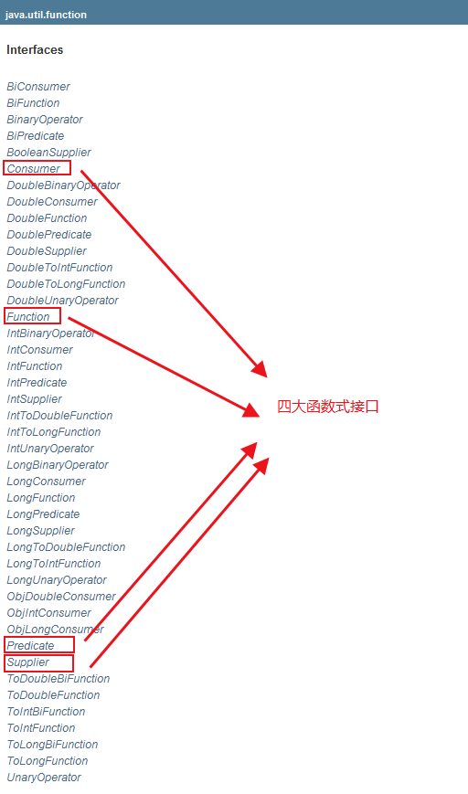

## 11.1 Function -- 函数式接口

```java
@FunctionalInterface
public interface Function<T, R> {
    /**
     * 传入参数T，返回类型R
     */
    R apply(T t);
```

```java
import java.util.function.Function;

public class demo13_Function {

    public static void main(String[] args) {

        Function<String, String> function = (str)->{return str + "收到！";};
        System.out.println(function.apply("洞拐"));

    }

}
```

## 11.2 Predicate -- 断定式接口

```java
@FunctionalInterface
public interface Predicate<T> {
    /**
     * 只有一个输入参数，返回值为布尔值
     */
    boolean test(T t);
```

```java
import java.util.function.Predicate;

public class demo13_Predicate {

    public static void main(String[] args) {
        Predicate<String> predicate = (str)->{return str.isEmpty();};
        System.out.println(predicate.test(""));
    }

}

```

## 11.3 Consumer -- 消费型接口

```java
@FunctionalInterface
public interface Consumer<T> {
    /**
     * 只有输入，没有返回值
     */
    void accept(T t);
```

```java
import java.util.function.Consumer;

public class demo13_Consumer {

    public static void main(String[] args) {
        Consumer<String> consumer = (str)->{
            System.out.println(str);
        };
        consumer.accept("Hello World !");
    }

}

```

## 11.4 Supplier -- 供给型接口

```java
@FunctionalInterface
public interface Supplier<T> {
    /**
     * 没有参数，只有返回值
     */
    T get();
}
```

```java
import java.util.function.Supplier;

public class demo13_Supplier {

    public static void main(String[] args) {
        Supplier supplier = ()->{return "Hello world !";};
        System.out.println(supplier.get());
    }

}
```

# 12. Stream 流式计算

什么是流式计算：集合、MySQL的本质是用来存储东西的，所有计算相关的问题应该交给流来操作。

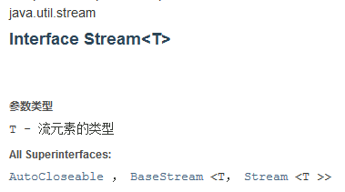

```java
import lombok.AllArgsConstructor;
import lombok.Data;
import lombok.NoArgsConstructor;

import java.util.Arrays;
import java.util.List;

public class demo14_Stream {
    /**
     * 需求：一分钟内一行代码实现
     * 现有五个用户，筛选：
     * 1. ID 必须为偶数
     * 2. 年龄大于 23 岁
     * 3. 用户名转为大写字母
     * 4. 用户名按字母倒序排序
     * 5. 只输出一个用户
     */
    public static void main(String[] args) {
        User u1 = new User(1, "a", 21);
        User u2 = new User(2, "b", 22);
        User u3 = new User(3, "c", 23);
        User u4 = new User(4, "d", 24);
        User u5 = new User(5, "e", 25);
        // 集合用来存储
        List<User> list = Arrays.asList(u1, u2, u3, u4, u5);
        // 计算交给Stream流(链式编程)
        list.stream()
                .filter((user)->{return user.getID() % 2 == 1;})
                .filter((user)->{return user.getAge() > 23;})
                .map((user)->{return user.getUsername().toUpperCase();})
                .sorted((user1, user2)->{return user2.compareTo(user1);})
                .limit(1)
                .forEach(System.out::println); // 输出 E
    }
}

@Data
@AllArgsConstructor
@NoArgsConstructor
class User {
    private int ID;
    private String username;
    private int age;
}

```

# 13. ForkJoin

什么是 ForkJoin：在大数据量时，将大人物拆分成小任务并行执行，从而提高效率。

ForkJoin 的特点：工作窃取。其中维护的都是双端队列。当某一线程任务执行完毕后，其会从其它未完成任务的线程尾部窃取工作协助其完成。

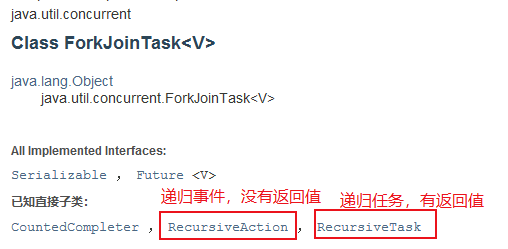

```java
import java.util.concurrent.ExecutionException;
import java.util.concurrent.ForkJoinPool;
import java.util.concurrent.ForkJoinTask;
import java.util.concurrent.RecursiveTask;
import java.util.stream.LongStream;

public class demo15_ForkJoin {

    public static void main(String[] args) throws ExecutionException, InterruptedException {
        /**
         * test1: 普通循环遍历求和 
         * test2: 使用 ForkJoin
         * test3: 使用 Stream 并行流
         */
        test1(); // sum = 500000000500000000   time = 7780
        test2(); // sum = 500000000500000000   time = 7924
        test3(); // sum = 500000000500000000   time = 120
    }

    public static void test1() {
        Long sum = 0L;
        Long start = System.currentTimeMillis();
        for (Long i = 1L; i <= 10_0000_0000; i++) {
            sum += i;
        }
        Long end = System.currentTimeMillis();
        System.out.println("sum = " + sum + "   time = " + (end - start));
    }

    public static void test2() throws ExecutionException, InterruptedException {
        Long start = System.currentTimeMillis();
        ForkJoinPool forkJoinPool = new ForkJoinPool();
        ForkJoinTask<Long> task = new ForkJoinDemo(0L, 10_0000_0000L);
        ForkJoinTask<Long> submit = forkJoinPool.submit(task);
        Long sum = submit.get();
        Long end = System.currentTimeMillis();
        System.out.println("sum = " + sum + "   time = " + (end - start));
    }

    public static void test3() {
        Long start = System.currentTimeMillis();
        Long sum = LongStream.rangeClosed(0L, 10_0000_0000L)
                .parallel()
                .reduce(0, Long::sum);
        Long end = System.currentTimeMillis();
        System.out.println("sum = " + sum + "   time = " + (end - start));
    }
}

class ForkJoinDemo extends RecursiveTask<Long> {
    private Long start;
    private Long end;
    private Long threshold = 10000L;

    public ForkJoinDemo(Long start, Long end) {
        this.start = start;
        this.end = end;
    }

    @Override
    protected Long compute() {
        if ((end - start) < threshold) {
            Long sum = 0L;
            for (Long i = start; i <= end; i++) {
                sum += i;
            }
            return sum;
        } else { // ForkJoin 递归
            Long mid = (start + end) >> 1;
            ForkJoinDemo task1 = new ForkJoinDemo(start, mid);
            task1.fork(); // 拆分任务，将任务压入线程队列
            ForkJoinDemo task2 = new ForkJoinDemo(mid + 1, end);
            task2.fork(); // 拆分任务，将任务压入线程队列
            return task1.join() + task2.join();
        }
    }
}
```

# 14. Future 异步回调

当某一线程运行较慢，程序又急需向下运行时，可以使用异步回调的方法，异步的执行主线程和运行较慢的线程，同时可以在后面异步的回调较慢线程的执行结果。

```java
import java.util.concurrent.CompletableFuture;
import java.util.concurrent.ExecutionException;
import java.util.concurrent.TimeUnit;

public class demo16_Future {
    /**
     * runAsync(): 无返回值的异步回调
     * supplyAsync(): 有返回值的异步回调
     */
    public static void main(String[] args) throws ExecutionException, InterruptedException {
        runAsync();
        supplyAsync();
    }

    public static void runAsync() throws ExecutionException, InterruptedException {
        CompletableFuture<Void> completableFuture = CompletableFuture.runAsync(()->{
            try {
                TimeUnit.SECONDS.sleep(3);
            } catch (InterruptedException e) {
                e.printStackTrace();
            }
            System.out.println(Thread.currentThread().getName() + "runAsync ==> void");
        });
        System.out.println("1111");
        completableFuture.get(); // 获取阻塞执行的结果
    }

    public static void supplyAsync() throws ExecutionException, InterruptedException {
        CompletableFuture<Integer> completableFuture = CompletableFuture.supplyAsync(()->{
            System.out.println(Thread.currentThread().getName() + "supplyAsync ==> Integer");
            int i = 10/0;
            return 1024;
        });
        System.out.println(completableFuture.whenComplete((t, u)->{
            System.out.println("t -> " + t); // 正常运行的返回结果
            System.out.println("u -> " + u); // 错误执行的异常信息
        }).exceptionally((e)->{
            e.getMessage();
            return 233; // 错误执行的返回结果
        }).get());
    }
}

```

# 15. JMM

什么是 JMM ：java 内存模型，是一种不存在的东西，是一个概念，一中约定。

关于 JMM 的一些同步的约定：

1. 线程解锁前，必须把共享的变量立刻刷新回主存
2. 线程加锁前，必须读取主存中的最新值到工作内存中
3. 加锁和解锁是同一把锁

内存交互操作

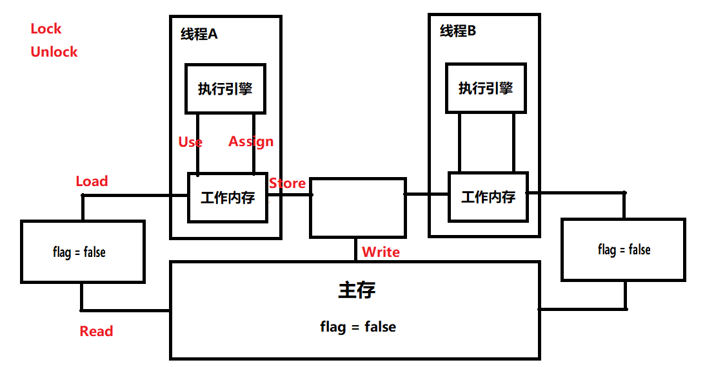

**ava内存模型中定义了以下8种操作来完成，虚拟机实现时必须保证下面提及的每一种操作都是原子的、 不可再分的（对于double和long类型的变量来说，load、 store、 read和write操作在某些平台上允许有例外）**

* lock（锁定）：作用于主内存的变量，它把一个变量标识为一条线程独占的状态。
* unlock（解锁）：作用于主内存的变量，它把一个处于锁定状态的变量释放出来，释放后的变量才可以被其他线程锁定。
* read（读取）：作用于主内存的变量，它把一个变量的值从主内存传输到线程的工作内存中，以便随后的load动作使用。
* load（载入）：作用于工作内存的变量，它把read操作从主内存中得到的变量值放入工作内存的变量副本中。
* use（使用）：作用于工作内存的变量，它把工作内存中一个变量的值传递给执行引擎，每当虚拟机遇到一个需要使用到变量的值的字节码指令时将会执行这个操作。
* assign（赋值）：作用于工作内存的变量，它把一个从执行引擎接收到的值赋给工作内存的变量，每当虚拟机遇到一个给变量赋值的字节码指令时执行这个操作。
* store（存储）：作用于工作内存的变量，它把工作内存中一个变量的值传送到主内存中，以便随后的write操作使用。
* write（写入）：作用于主内存的变量，它把store操作从工作内存中得到的变量的值放入主内存的变量中


**操作规则**

* 不允许read和load、 store和write操作之一单独出现，即不允许一个变量从主内存读取了但工作内存不接受，或者从工作内存发起回写了但主内存不接受的情况出现。
* 不允许一个线程丢弃它的最近的assign操作，即变量在工作内存中改变了之后必须把该变化同步回主内存。
* 不允许)一个线程无原因地（没有发生过任何assign操作）把数据从线程的工作内存同步回主内存中。
* 一个新的变量只能在主内存中“诞生”，不允许在工作内存中直接使用一个未被初始化（load或assign）的变量，换句话说，就是对一个变量实施use、 store操作之前，必须先执行过了assign和load操作。
* 一个变量在同一个时刻只允许一条线程对其进行lock操作，但lock操作可以被同一条线程重复执行多次，多次执行lock后，只有执行相同次数的unlock操作，变量才会被解锁。
* 如果对一个变量执行lock操作，那将会清空工作内存中此变量的值，在执行引擎使用这个变量前，需要重新执行load或assign操作初始化变量的值。
* 如果一个变量事先没有被lock操作锁定，那就不允许对它执行unlock操作，也不允许去unlock一个被其他线程锁定住的变量。
* 对一个变量执行unlock操作之前，必须先把此变量同步回主内存中（执行store、 write操作）

# 16. Volatile

Volatile 是 Java虚拟机 提供的**轻量级的同步机制**，其作用：

1. 保证可见性
2. 不保证原子性
3. 禁止指令重排

## 16.1 保证可见性

```java
import java.util.concurrent.TimeUnit;

public class demo17_Volatile01 {

    static volatile int num = 0;
    public static void main(String[] args) throws InterruptedException {
        new Thread(()->{
            while (num == 0) {
                /**
                 * 不加 volatile，此处陷入死循环，线程对主内存内的修改不可见！
                 * 踩坑：此处不可以有 System.out.println();
                 * 原因：println 加锁了，根据 JMM 的约定，线程加锁前，必须读取主存中的最新值到工作内存中
                 *     public void println(String x) {
                 *         if (getClass() == PrintStream.class) {
                 *             writeln(String.valueOf(x));
                 *         } else {
                 *             synchronized (this) {
                 *                 print(x);
                 *                 newLine();
                 *             }
                 *         }
                 *     }
                 */
            }
        }).start();
        TimeUnit.SECONDS.sleep(1);
        num = 1;
        System.out.println(num);
    }

}

```

## 16.2 不保证原子性

```java
public class demo17_volatile02 {
    /**
     * 原子性：
     * 线程A在执行任务的时候，不能被打扰，也不能被分割。
     * 要么同时成功，要么同时失败
     * volatile 不保证原子性
     */
    private volatile static int num = 0;

    public static void add() {
        /**
         * num ++; 不是原子性操作，底层执行时分为三步
         * 1. 获得这个值
         * 2. 执行加一
         * 3. 写回这个值
         */
        num ++;
    }

    public static void main(String[] args) {
        for (int i = 0; i < 20; i++) {
            new Thread(()->{
                for (int j = 0; j < 1000; j++) {
                    add();
                }
            }).start();
        }

        while (Thread.activeCount() > 2) Thread.yield();
        System.out.println(Thread.currentThread().getName() + "   " + num); // main   17923
    }

}

```

保证原子性：

1. 使用**lock锁**或者**synchronized**关键字
2. 使用**原子类**

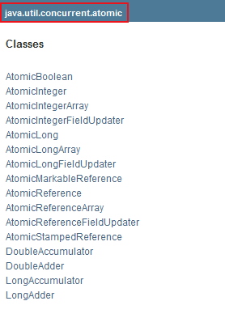

```java
import java.util.concurrent.atomic.AtomicInteger;

public class demo17_volatile03 {
    /**
     * 原子类保证原子性
     * 其底层实现直接与操作系统挂钩，在内存中修改值
     */
    private volatile static AtomicInteger num = new AtomicInteger();

    public static void add() {
        num.getAndIncrement();
    }

    public static void main(String[] args) {
        for (int i = 0; i < 20; i++) {
            new Thread(()->{
                for (int j = 0; j < 1000; j++) {
                    add();
                }
            }).start();
        }

        while (Thread.activeCount() > 2) Thread.yield();
        System.out.println(Thread.currentThread().getName() + "   " + num); // main   20000
    }

}

```

## 16.3 指令重排

什么是指令重排：我们所写的程序，计算机执行的时候并不是按照我们所写的顺序去执行。

一个程序的执行：源代码-》编译器优化的重排-》指令并行也可能重排-》内存系统重排-》执行

处理器在进行指令重排的时候，会考虑数据之间的依赖性。

**volatile 可以避免指令重排：volatile 通过在写操作的前后分别添加一层内存屏障，禁止上面的指令与下面的指令顺序交换，从而保证特定的操作的执行顺序！**

# 17. 彻底玩转单例模式

## 17.1 饿汉式

```java
public class demo18_Hungry {
    /**
     * 饿汉式单例
     * 存在问题：可能会浪费空间
     */
    
    // 因为无论是否用到单例对象，下面的代码都会初始化，所以会造成空间浪费
    private byte[] data1 = new byte[1024*2024]; 
    private byte[] data2 = new byte[1024*2024];
    private byte[] data3 = new byte[1024*2024];
    private byte[] data4 = new byte[1024*2024];

    private demo18_Hungry(){}; // 构造方法私有化

    private final static demo18_Hungry hungry = new demo18_Hungry();
    
    public static demo18_Hungry getInstance() {
        return hungry;
    }
    
}

```

## 17.2 懒汉式

### DCL 饿汉式

```java
import java.lang.reflect.Constructor;
import java.lang.reflect.InvocationTargetException;

public class demo18_Lazy01 {
    /**
     * DCL懒汉式单例
     * 问题：可以通过反射破解单例
     */

    private demo18_Lazy01(){};

    private volatile static demo18_Lazy01 lazy01; // 使用volatile关键字来避免指令重排

    // 双重检测锁模式的懒汉式单例
    public static demo18_Lazy01 getInstance() {
        if (lazy01 == null) {
            synchronized (demo18_Lazy01.class) {
                if (lazy01 == null) {
                    lazy01 = new demo18_Lazy01(); // 该操作不是一个原子操作！
                }
            }
        }
        return lazy01;
    }

    public static void main(String[] args) throws Exception {
        /**
         * 使用反射破解单例
         */
        demo18_Lazy01 instance1 = demo18_Lazy01.getInstance();
        Constructor<demo18_Lazy01> lazy01Constructor =
                demo18_Lazy01.class.getDeclaredConstructor(null);
        lazy01Constructor.setAccessible(true);
        demo18_Lazy01 instance2 = lazy01Constructor.newInstance();

        System.out.println(instance1); // demo18_Lazy01@2ff4acd0
        System.out.println(instance2); // demo18_Lazy01@54bedef2
    }

}
```

### 三重锁饿汉式

```java
import java.lang.reflect.Constructor;
import java.lang.reflect.Field;

public class demo18_Lazy02 {
    /**
     * 懒汉式单例 -- 添加特定标识符
     * 问题：可以通过反射破解单例
     */

    private static boolean zqf = false;

    private demo18_Lazy02() {
        if (zqf == false) {
            zqf = true;
        } else {
            throw new RuntimeException("不要尝试使用反射破解！");
        }
    };

    private volatile static demo18_Lazy02 lazy01; // 使用volatile关键字来避免指令重排
    
    // 双重检测锁模式的懒汉式单例
    public static demo18_Lazy02 getInstance() {
        if (lazy01 == null) {
            synchronized (demo18_Lazy02.class) {
                if (lazy01 == null) {
                    lazy01 = new demo18_Lazy02(); // 该操作不是一个原子操作！
                }
            }
        }
        return lazy01;
    }   
```

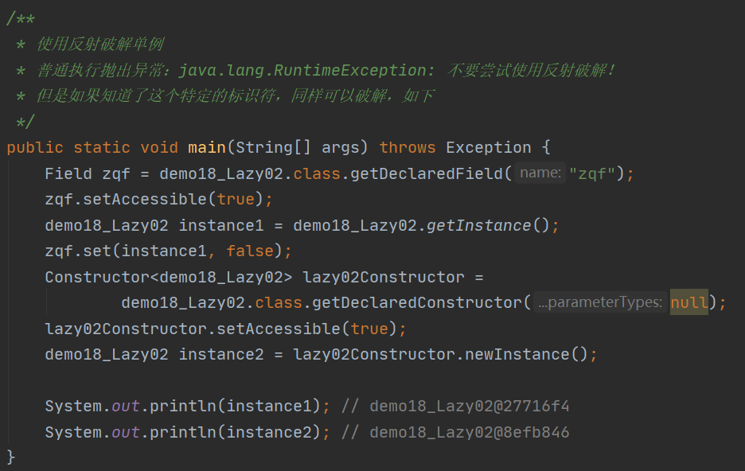

### 静态内部类

```java
public class demo18_Holder {
    /**
     * 单例模式：使用静态内部类实现
     */
    private demo18_Holder() {};
    
    public static demo18_Holder getInstance() {
        return InnerClass.holder;
    }
    
    public static class InnerClass {
        private static final demo18_Holder holder = new demo18_Holder();
    }
    
}

```

### 枚举

```java
import java.lang.reflect.Constructor;

public enum demo18_Enum {
    /**
     * 单例模式：使用枚举实现
     */
    INSTANCE;

    public demo18_Enum getInstance() {
        return INSTANCE;
    }

}

class Test {
    public static void main(String[] args) throws Exception{
        demo18_Enum instance1 = demo18_Enum.INSTANCE;
        /**
         * 枚举类型最终反编译的源码中，构造器为：
         * private demo18_Enum(String s, int i) {
         *   super(s, i);
         * }
         */
        Constructor<demo18_Enum> constructor =
                demo18_Enum.class.getDeclaredConstructor(String.class, int.class);
        constructor.setAccessible(true);
        demo18_Enum instance2 = constructor.newInstance();

        /**
         * java.lang.IllegalArgumentException: Cannot reflectively create enum objects
         */
        System.out.println(instance1);
        System.out.println(instance2);
    }
}

```

# 18. 深入理解CAS

## 18.1 什么是CAS

CAS：比较当前工作内存中的值和主内存中的值，如果这个值是所期望的，就执行操作；否则就一直循环(自旋锁)。

缺点：

1. 循环会耗时
2. 一次性只能保证一个共享变量的原子性
3. ABA问题

```java
import java.util.concurrent.atomic.AtomicInteger;

public class demo19_CAS {
    /**
     * CAS：比较并交换
     */
    public static void main(String[] args) {
        AtomicInteger atomicInteger = new AtomicInteger(2020);
        /**
         * public final boolean compareAndSet(int expectedValue, int newValue)
         * expectedValue：期望值
         * newValue：要设置的值
         * 作用：如果是当前期望的值，就更新，如果不是就不更新
         */
        System.out.println(atomicInteger.compareAndSet(2020, 2021)); // true
        System.out.println(atomicInteger.get()); // 2021

        System.out.println(atomicInteger.compareAndSet(2020, 2021)); // false
        System.out.println(atomicInteger.get()); // 2021
    }
}

```

## 18.2 ABA问题

ABA问题(狸猫换太子)：一个线程不能知道另一个线程对数据进行的操作

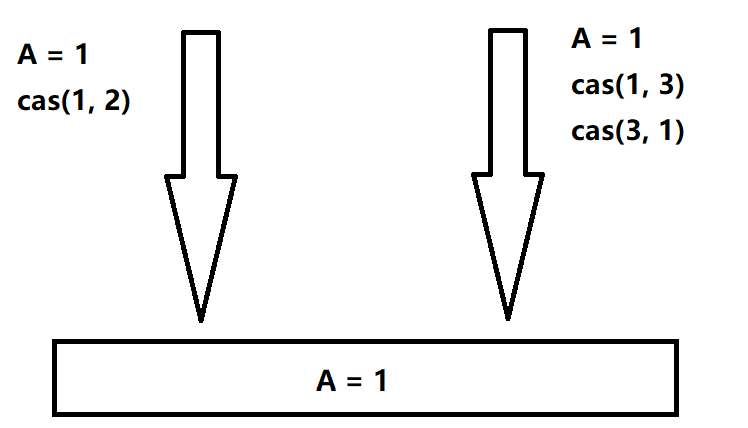

```java
import java.util.concurrent.atomic.AtomicInteger;

public class demo19_CAS02 {
    /**
     * CAS —— ABA 问题
     */
    public static void main(String[] args) {
        AtomicInteger atomicInteger = new AtomicInteger(2020);

        // 捣乱的线程
        System.out.println(atomicInteger.compareAndSet(2020, 2021)); // true
        System.out.println(atomicInteger.get()); // 2021

        System.out.println(atomicInteger.compareAndSet(2021, 2020)); // true
        System.out.println(atomicInteger.get()); // 2020

        // 期望的线程
        System.out.println(atomicInteger.compareAndSet(2020, 2021)); // ftrue
        System.out.println(atomicInteger.get()); // 2021
    }
}

```

## 18.3 原子引用——解决ABA问题

其对应的思想为**乐观锁**

```java
import java.util.concurrent.TimeUnit;
import java.util.concurrent.atomic.AtomicStampedReference;

public class demo19_CAS03 {
    /**
     * 原子引用解决 ABA 问题
     */
    public static void main(String[] args) {
        /**
         * 正常的业务操作，里面比较的是一个个的对象
         * 注意：AtomicStampedReference 如果泛型是一个包装类，要注意对象的引用问题
         */
        AtomicStampedReference<Integer> atomicStampedReference =
                new AtomicStampedReference<>(1, 1);

        // CAS：比较并交换
        new Thread(()->{
            int stamp = atomicStampedReference.getStamp();
            System.out.println("a1==>" + stamp);
            try {
                TimeUnit.SECONDS.sleep(1);
            } catch (InterruptedException e) {
                e.printStackTrace();
            }
            atomicStampedReference.compareAndSet(1, 2,
                    atomicStampedReference.getStamp(), atomicStampedReference.getStamp() + 1);
            System.out.println("a2==>" + atomicStampedReference.getStamp());
            atomicStampedReference.compareAndSet(2, 1,
                    atomicStampedReference.getStamp(), atomicStampedReference.getStamp() + 1);
            System.out.println("a3==>" + atomicStampedReference.getStamp());
        }, "a").start();

        new Thread(()->{
            int stamp = atomicStampedReference.getStamp();
            System.out.println("b1==>" + stamp);
            try {
                TimeUnit.SECONDS.sleep(2);
            } catch (InterruptedException e) {
                e.printStackTrace();
            }
            atomicStampedReference.compareAndSet(1, 6,
                    stamp, stamp + 1);
            System.out.println("b2==>" + atomicStampedReference.getStamp());
        }, "b").start();
    }
}

```

结果：

通过原子引用，解决了ABA问题，其本质是一个乐观锁的原理

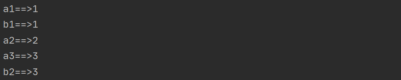

# 19. 各种锁的理解

## 19.1 公平锁、非公平锁

* 公平锁：非常公平，遵循先来后到，不能插队！
* 非公平锁：非常不公平，可以插队（默认为非公平锁）

```java
public ReentrantLock() {
        sync = new NonfairSync();
    }

 public ReentrantLock(boolean fair) {
     sync = fair ? new FairSync() : new NonfairSync();
}
```

## 19.2 可重入锁(递归锁)

即锁的内部还有锁，拿到外部的锁之后，就可以自动获得内部的锁。

**Synchronized版本**

```java
public class demo20_ReentrantLock01 {
    /**
     * synchronized 版本
     */
    public static void main(String[] args) {
        Phone phone = new Phone();

        new Thread(()->{
            phone.sms();
        }, "A").start();

        new Thread(()->{
            phone.sms();
        }, "B");
    }

}

class Phone {
    public synchronized void sms() {
        System.out.println(Thread.currentThread().getName() + "发短信");
        call(); // 此处还有锁
    }

    public synchronized void call() {
        System.out.println(Thread.currentThread().getName() + "打电话");
    }
}
```

**Lock版本**

```java
import java.util.concurrent.locks.Lock;
import java.util.concurrent.locks.ReentrantLock;

public class demo20_ReentrantLock02 {
    /**
     * Lock版
     */
    public static void main(String[] args) {
        Phone2 phone = new Phone2();

        new Thread(()->{
            phone.sms();
        }, "A").start();

        new Thread(()->{
            phone.sms();
        }, "B");
    }
}

class Phone2 {
    Lock lock = new ReentrantLock();

    public void sms() {
        lock.lock(); // lock锁必须配对！
        try {
            System.out.println(Thread.currentThread().getName() + "发短信");
            call(); // 这里也有锁
        } catch (Exception e) {
            e.printStackTrace();
        } finally {
            lock.unlock();
        }
    }

    public void call() {
        lock.lock();
        try {
            System.out.println(Thread.currentThread().getName() + "打电话");
        } catch (Exception e) {
            e.printStackTrace();
        } finally {
            lock.unlock();
        }
    }
}

```

## 19.3 自旋锁

```java
import java.util.concurrent.TimeUnit;
import java.util.concurrent.atomic.AtomicReference;

public class demo21_SpinLock {
    /**
     * 自旋锁
     */
    public static void main(String[] args) throws InterruptedException {
        SpinLock spinLock = new SpinLock();

        new Thread(()->{
            spinLock.myLock();
            try {
                TimeUnit.SECONDS.sleep(5);
            } catch (InterruptedException e) {
                e.printStackTrace();
            } finally {
                spinLock.myUnLock();
            }
        }, "A").start();

        TimeUnit.SECONDS.sleep(1);
        new Thread(()->{
            spinLock.myLock();
            try {
                TimeUnit.SECONDS.sleep(1);
            } catch (InterruptedException e) {
                e.printStackTrace();
            } finally {
                spinLock.myUnLock();
            }
        }, "B").start();
    }
}

class SpinLock {
    AtomicReference<Thread> atomicReference = new AtomicReference<>();

    // 加锁
    public void myLock() {
        Thread thread = Thread.currentThread();
        System.out.println(Thread.currentThread().getName() + "==> mylock");
        // 自旋锁
        while (!atomicReference.compareAndSet(null, thread)) {

        }
    }

    // 解锁
    public void myUnLock() {
        Thread thread = Thread.currentThread();
        System.out.println(Thread.currentThread().getName() + "==>myUnlock");
        atomicReference.compareAndSet(thread, null);
    }
}
```

## 19.4 死锁

```java
import java.util.concurrent.TimeUnit;

public class demo22_DeadLock {
    /**
     * 死锁：两个进程持有自己的锁，但都想要获取对方的锁
     */
    public static void main(String[] args) {
        String lockA = "lockA";
        String lockB = "lockB";

        new Thread(new MyThread2(lockA, lockB), "T1").start();
        new Thread(new MyThread2(lockB, lockA), "T2").start();
    }
}

class MyThread2 implements Runnable {
    private String lockA;
    private String lockB;

    public MyThread2(String lockA, String lockB) {
        this.lockA = lockA;
        this.lockB = lockB;
    }

    @Override
    public void run() {
        synchronized (lockA) {
            System.out.println(Thread.currentThread().getName() + "  lock：" + lockA + "==> get" + lockB);
            try {
                TimeUnit.SECONDS.sleep(2);
            } catch (InterruptedException e) {
                e.printStackTrace();
            }
            synchronized (lockB) {
                System.out.println(Thread.currentThread().getName() + "  lock：" + lockB + "==> get" + lockA);

            }
        }
    }
}

```

结果测试：

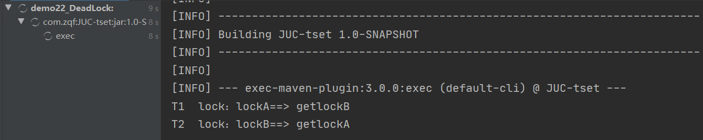

**死锁问题的排查**

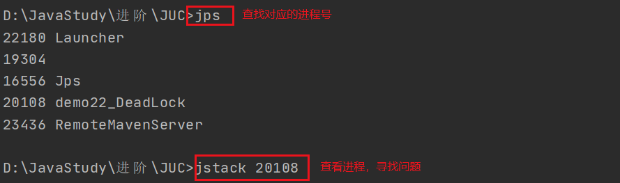

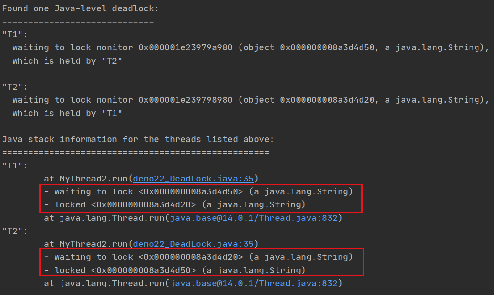

