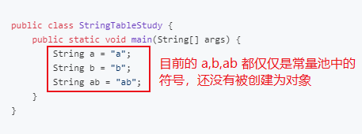

# 1. JVM 概述

## 1.1 JVM 的定义

Java Virtual Machine，JAVA程序的运行环境（JAVA二进制字节码的运行环境）

## 1.2 JVM 的优势

* 一次编写，到处运行
* 自动内存管理，垃圾回收机制
* 数组下标越界检查

## 1.3 JVM、JRE、JDK 的比较


# 2. JVM 内存结构

整体架构：


## 2.1 程序计数器

### 作用

用于保存 JVM 中下一条所要执行的指令的地址

### 特点

* 线程私有    
	* CPU 会为每个线程分配时间片，当当前线程的时间片使用完以后，CPU 就会去执行另一个线程中的代码
    * 程序计数器是每个线程所私有的，当另一个线程的时间片用完，又返回来执行当前线程的代码时，通过程序计数器可以知道应该执行哪一句指令
* 不存在内存溢出

## 2.2 虚拟机栈

### 定义

* 每个线程运行需要的内存空间，称为虚拟机栈
* 每个栈由多个栈帧组成，对应着每次调用方法时所占用的内存
* 每个线程只能有一个活动栈帧，对应着当前正在执行的方法

代码演示：当一个线程调用一个方法，对应方法所占的内存便形成一个栈帧入栈

```java
public class Main {
    public static void main(String[] args) {
        method1();
    }

    private static void method1() {
        method2(1, 2);
    }

    private static int method2(int a, int b) {
        int c = a + b;
        return c;
    }
}
```


### 几个问题

* 垃圾回收是否涉及栈内存？    
	* 不需要。因为虚拟机栈中是由一个个栈帧组成的，在方法执行完毕后，对应的栈帧就会被弹出栈。所以无需通过垃圾回收机制去回收内存。


* 栈内存的分配越大越好吗？    
	* 不是。因为物理内存是一定的，栈内存越大，可以支持更多的递归调用，但是可执行的线程数就会越少。


* 方法内的局部变量是否是线程安全的？（**逃逸分析**）    
	* 如果方法内局部变量没有逃离方法的作用范围，则是线程安全的
    * 如果如果局部变量引用了对象，并逃离了方法的作用范围，则需要考虑线程安全问题
	
### 栈内存溢出
`Java.lang.stackOverflowError 栈内存溢出`

发生原因：

* 虚拟机栈中，栈帧过多（递归调用没有设置正确的退出条件）
* 每个栈帧所占用的内存过大

### 线程运行诊断

CPU占用过高：Linux环境下运行某些程序的时候，可能导致CPU的占用过高，这时需要定位占用CPU过高的线程

* `top`命令，查看是哪个进程占用CPU过高
* `ps H -eo pid, tid（线程id）, %cpu | grep` 刚才通过top查到的进程号 通过ps命令进一步查看是哪个线程占用CPU过高
* `jstack 进程id` 通过查看进程中的线程的nid，刚才通过ps命令看到的tid来对比定位，注意jstack查找出的线程id是16进制的，需要转换

## 2.3 本地方法栈

本地方法：一些带有**native关键字**的方法。就是需要JAVA去调用本地的C或者C++方法，因为JAVA有时候没法直接和操作系统底层交互，所以需要用到本地方法

## 2.4 堆 Heap

### 定义

通过**new关键字创建的对象**都会被放在堆内存

### 特点

* **所有线程共享**，堆内存中的对象都需要**考虑线程安全问题**
* 有**垃圾回收机制**

### 堆内存溢出

`java.lang.OutofMemoryError ：java heap space`

## 2.5 方法区


### 内存溢出

* 1.8以前会导致永久代内存溢出
* 1.8以后会导致元空间内存溢出

### 字节码文件

二进制的字节码的组成包括：类的基本信息、常量池、类的方法定义(包含了虚拟机指令)

类的基本信息：


常量池：


虚拟机中执行编译的方法(方框内为真正编译执行的内容，#号后的内容需要在常量池中查找)：


### 常量池与运行时常量池

* 常量池    
	* 就是一张表（如上图中的constant pool），虚拟机指令根据这张常量表找到要执行的类名、方法名、参数类型、字面量信息
* 运行时常量池    
	* 常量池是.class文件中的，当该类被加载以后，它的常量池信息就会放入运行时常量池，并把里面的符号地址变为真实的内存地址

### 常量池与串池StringTable的关系

**串池StringTable：用来存放字符串对象且元素不重复，底层为HashTable数据结构**

#### 创建字符串对象并放入串池的过程




注意：字符串对象的创建都是懒惰的，只有当运行到那一行字符串且在串池中不存在的时候（如 ldc #2）时，该字符串才会被创建并放入串池中。

#### 使用拼接字符串变量对象创建字符串的过程

在上述过程中，虽然 ab2 的字符串与 ab 字符串的样子相同，但 ab2 是通过字符串拼接产生的新字符串，存在于堆内存中，而 ab 存在于串池当中，所以是两个不同的字符串！


结果：`System.out.println(ab == ab2); // false`

#### 使用拼接字符串常量对象的方法创建字符串

使用拼接字符串常量的方法来创建新的字符串时，因为内容是常量，javac在编译期会进行优化，结果已在编译期确定为ab；使用拼接字符串变量的方法来创建新的字符串时，因为内容是变量，只能在运行期确定它的值，所以需要使用StringBuilder来创建


结果：`System.out.println(ab == ab2); // true`

#### intern方法 jdk1.8

调用字符串对象的intern方法，会将该字符串对象尝试放入到串池中

* 如果串池中**没有该字符串对象，则放入成功**
* 如果**有该字符串对象，则放入失败**
* 无论放入是否成功，都会**返回串池中的字符串对象**

注意：此时如果调用intern方法**成功，堆内存与串池中的字符串对象是同一个对象；如果失败，则不是同一个对象**

示例：

```java
public class Main {
    public static void main(String[] args) {
        //"a" "b" 被放入串池中，str则存在于堆内存之中
        String str = new String("a") + new String("b");
        //调用str的intern方法，这时串池中没有"ab"，则会将该字符串对象放入到串池中，此时堆内存与串池中的"ab"是同一个对象
        String st2 = str.intern();
        //给str3赋值，因为此时串池中已有"ab"，则直接将串池中的内容返回
        String str3 = "ab";
        //因为堆内存与串池中的"ab"是同一个对象，所以以下两条语句打印的都为true
        System.out.println(str == st2); //true
        System.out.println(str == str3); // true
    }
}
```

```java
public class Main {
    public static void main(String[] args) {
        //此处创建字符串对象"ab"，因为串池中还没有"ab"，所以将其放入串池中
        String str3 = "ab";
        //"a" "b" 被放入串池中，str则存在于堆内存之中
        String str = new String("a") + new String("b");
        //此时因为在创建str3时，"ab"已存在与串池中，所以放入失败，但是会返回串池中的"ab"
        String str2 = str.intern();
        System.out.println(str == str2);  //false
        System.out.println(str == str3);  //false
        System.out.println(str2 == str3); //true
    }
}
```

#### intern方法 jdk1.6

调用字符串对象的intern方法，会将该字符串对象尝试放入到串池中

* 如果串池中**没有该字符串对象，会将该字符串对象复制一份，再放入到串池中**
* 如果**有该字符串对象，则放入失败**
* 无论放入是否成功，都会**返回串池中的字符串对象**

注意：此时无论调用intern方法**成功与否，串池中的字符串对象和堆内存中的字符串对象都不是同一个对象**

#### 总结

* 常量池中的字符串仅是符号，只有在**被用到时才会转化为对象**
* 利用串池的机制，来避免重复创建字符串对象
* **字符串变量**拼接的原理是**StringBuilder**
* **字符串常量**拼接的原理是**编译器优化**
* 可以使用**intern方法**，主动将串池中还没有的字符串对象放入串池中
* **注意：无论是串池还是堆里面的字符串，都是对象**

### StringTable

#### StringTable垃圾回收

StringTable在内存紧张时，会发生垃圾回收

#### StringTable调优

* 因为StringTable是由HashTable实现的，所以可以适当**增加HashTable桶的个数**，来减少字符串放入串池所需要的时间

代码： `-XX:StringTableSize=xxxx`
* 考虑是否需要将字符串对象入池：可以**通过intern方法减少重复入池**

## 2.6 直接内存

### 直接内存简介

* 属于操作系统，常见于NIO操作时，用于数据缓冲区
* 分配回收成本较高，但读写性能高
* 不受JVM内存回收管理

普通的文件读写流程：

使用直接内存：


**直接内存是操作系统和Java代码都可以访问的一块区域**，无需将代码从系统内存复制到Java堆内存，从而提高了效率

### 直接内存释放原理

直接内存的回收不是通过JVM的垃圾回收来释放的，而是通过**unsafe.freeMemory手动释放**

```java
//通过ByteBuffer申请1M的直接内存
ByteBuffer byteBuffer = ByteBuffer.allocateDirect(1024*1024);
```

```java
/**
* allocateDirect 的实现
*/
public static ByteBuffer allocateDirect(int capacity) {
    return new DirectByteBuffer(capacity);
}
```

```java
/**
* DirectByteBuffer 类
*/
DirectByteBuffer(int cap) {
        super(-1, 0, cap, cap, null);
        boolean pa = VM.isDirectMemoryPageAligned();
        int ps = Bits.pageSize();
        long size = Math.max(1L, (long)cap + (pa ? ps : 0));
        Bits.reserveMemory(size, cap);

        long base = 0;
        try {
            base = UNSAFE.allocateMemory(size); // 申请内存
        } catch (OutOfMemoryError x) {
            Bits.unreserveMemory(size, cap);
            throw x;
        }
        UNSAFE.setMemory(base, size, (byte) 0);
        if (pa && (base % ps != 0)) {
            address = base + ps - (base & (ps - 1));
        } else {
            address = base;
        }
        /**
        * 这里调用了一个Cleaner的create方法，且后台线程还会对虚引用的对象监测，如果虚引用的实际对象（这里是DirectByteBuffer）被回收以后，就会调用Cleaner的clean方法，来清除直接内存中占用的内存
        */
        cleaner = Cleaner.create(this, new Deallocator(base, size, cap));
        att = null;
}
```

```java
/**
* Cleaner的clean方法
*/
public void clean() {
    if (!remove(this))
        return;
    try {
        thunk.run();
    } catch (final Throwable x) {
        AccessController.doPrivileged(new PrivilegedAction<>() {
                public Void run() {
                    if (System.err != null)
                        new Error("Cleaner terminated abnormally", x).printStackTrace();
                    System.exit(1);
                    return null;
                }});
        }
}
```

```java
/**
* 对应的 run 方法 
*/
public void run() {
      if (address == 0) {
           return;
      }
      UNSAFE.freeMemory(address); //释放直接内存中占用的内存
      address = 0;
      Bits.unreserveMemory(size, capacity);
}
```

### 直接内存的回收机制总结

* 使用了Unsafe类来完成直接内存的分配回收，回收需要主动调用freeMemory方法
* ByteBuffer的实现内部使用了Cleaner（虚引用）来检测ByteBuffer。一旦ByteBuffer被垃圾回收，那么会由ReferenceHandler来调用Cleaner的clean方法调用freeMemory来释放内存
