# 1. 如何判断对象可以回收？

## 1.1 引用计数法

当一个对象被引用时，计数+1；当不再被引用时，引用-1。当该计数为 0 时，该对象不再被引用，将会被回收。

弊端：当存在循环引用时，两个对象都无法被回收（A 对象中引用 B 对象，B 对象中引用 A 对象）

## 1.2 可达性分析算法

JVM 中的垃圾回收器通过可达性分析来探索所有存活的对象。

扫描堆中的对象，看能否沿着以 GC root 对象为起点的引用链找到该对象。如果找不到，则表示该对象可以被回收。

可以作为 GC root 的对象：

* 虚拟机栈中引用的对象
* 方法区中类静态属性引用的对象
* 方法区中常量引用的对象
* 本地方法栈中 JNI(即一般说的Native方法)引用的对象

# 2. 五种引用

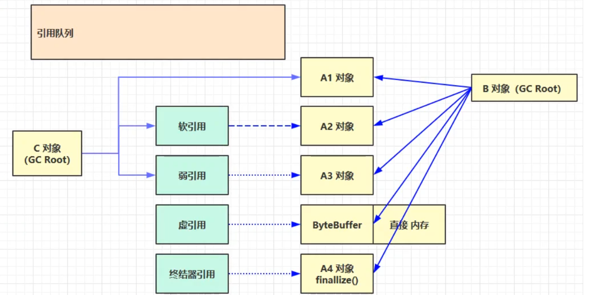

## 2.1 强引用

只有全部的GC root对象都不引用该对象，才会回收强引用对象。

上图中当 A, B 对象都不引用 A1 对象时，A1 才会被回收。

## 2.2 软引用

GC root对象软引用的对象，在内存不足时会被回收

上图中 B 对象不再引用 A2 对象且内存不足时，软引用所引用的 A2 对象就会被回收。

注意，当软引用所指向的对象被回收清理时，对象被回收，但软引用不会被回收。

若想回收软引用，需要利用引用队列（如果不回收软引用，则最终清理过后 list 中被清理的软引用的对象的位置为 null）

```java
public class Demo1 {
	public static void main(String[] args) {
		final int _4M = 4*1024*1024;
		//使用引用队列，用于移除引用为空的软引用对象
		ReferenceQueue<byte[]> queue = new ReferenceQueue<>();
		//使用软引用对象 list和SoftReference是强引用，而SoftReference和byte数组则是软引用
		List<SoftReference<byte[]>> list = new ArrayList<>();
		SoftReference<byte[]> ref= new SoftReference<>(new byte[_4M]);

		//遍历引用队列，如果有元素，则移除
		Reference<? extends byte[]> poll = queue.poll();
		while(poll != null) {
			//引用队列不为空，则从集合中移除该元素
			list.remove(poll);
			//移动到引用队列中的下一个元素
			poll = queue.poll();
		}
	}
}
```

## 2.3 弱引用

GC root对象弱引用的对象在垃圾回收时，无论内存是否充足，都会被回收

上图如果 B 对象不再引用 A3 对象，则 A3 对象会被回收

与软引用类似，若想回收弱引用，需要利用引用队列

## 2.4 虚引用

当虚引用的对象被回收之后，虚引用就会被放入引用队列当中

虚引用的一个体现就是释放直接内存所分配的内存。当引用对象 ByteBuffer 被垃圾回收之后，虚引用对象 Cleaner 就会被放入引用队列，然后调用其 clear 方法来释放直接内存。

如上图，B 对象不再引用 ByteBuffer 对象，ByteBuffer 就会被回收。但是直接内存中的内存还未被回收。这时需要将虚引用对象 Cleaner 放入引用队列中，然后调用它的 clean 方法来释放直接内存

## 2.5 终结器引用

当某一个对象不再被其他对象所引用时，会先将其终结器引用对象放入引用队列当中，然后根据终结器引用对象找到其所引用的对象，调用对象的 finalize 方法（所有的类都继承自Object类，Object类有一个finalize方法）。调用之后，该对象就可以被垃圾回收了

如上图，B 对象不再引用 A4 对象。此时终结器引用对象就会被放入引用队列中，引用队列会根据它，找到它所引用的对象。然后调用被引用对象的 finalize 方法。调用以后，该对象就可以被垃圾回收了

## 2.6 引用队列小结

* 软引用和弱引用可以配合引用队列：在软引用对象和弱引用对象所引用的对象被垃圾回收之后，会将软引用对象和弱引用对象放入引用队列当中，方便回收
* 虚引用和终结器引用必须配合引用队列：虚引用和终结器引用在使用时必须关联一个引用队列，以便进行垃圾回收

# 3. 垃圾回收算法

## 3.1 标记-清除

**定义**：标记-清除算法是指在虚拟机执行垃圾回收的过程中，首先采用标记算法确定可回收的对象，然后垃圾收集器会根据标识清除对应的内容，给堆中腾出响应的空间。

**注意**：这里的腾出内存空间并不是将标记的内存空间字节清零，而是记录下这段内存的起始地址与结束地址。当下次分配内存时，新的内容会直接覆盖这段内存。

**缺点**：标记-清除算法会产生大量的内存碎片，因此可能无法满足大对象的内存分配。一旦对象的内存无法分配，就会导致 jvm 启动 GC，GC 的启动会到值应用程序暂停，导致应用的响应速度变慢。

**图示**：

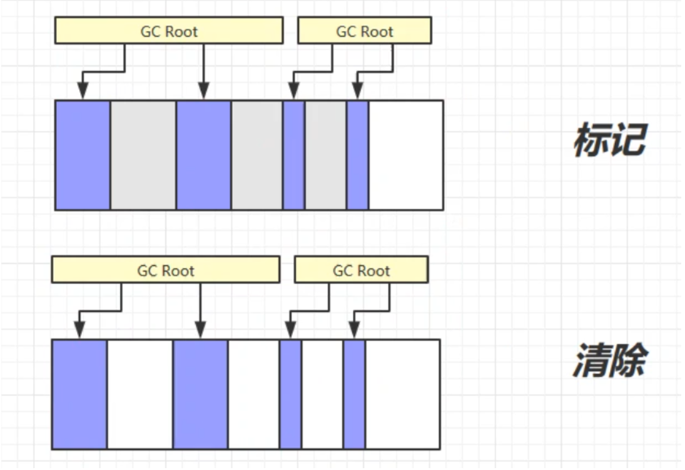

## 3.2 标记-整理

**定义**：标记-整理算法会将不被GC root引用的对象回收，清除其占用的内存空间，然后整理剩余的对象，可以有效避免因内存碎片而导致的问题

**缺点**：整理需要消耗的时间较多，所以效率比较低

**图示**：

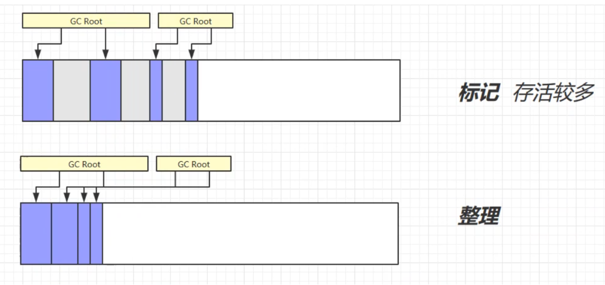

## 3.3 复制

**定义**：将内存分为等大小的两个区域 FROM 和 TO，其中 TO 为空。首先将被GC root引用的对象从 FROM 复制到 TO 中，然后将不被引用的对象回收。完成后，交换 FROM 和 TO 的指示地址，为下一次复制做准备。

**缺点**：复制可以有效避免内存碎片的问题，但是会占用双倍的空间

**图示**：

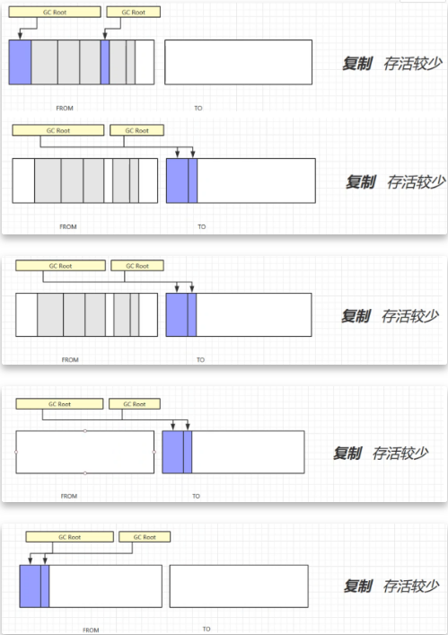

# 4. 分代回收

分带回收的思想：创建两块内存空间--新生代和老年代。在新生代中，又分为三块区域--伊甸园区，幸存区From和幸存区To。如图：

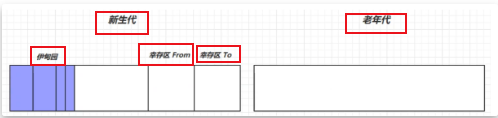

当新对象被创建时，会将它们全部存放在伊甸园区。随着对象的创建，伊甸园区内存不足时，就会进行垃圾回收，此时的垃圾回收称为 Minor GC

Minor GC 会将伊甸园区中的还正在被引用着的幸存对象复制到幸存区To中，并使他们的寿命+1。全部转移完成后，再将两个幸存区From和To的指示地址交换为下一次垃圾回收做准备。如图：

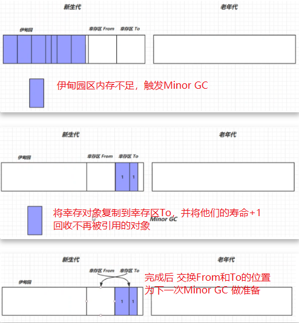

当伊甸园区内存又满了时，则会再次触发Minor GC（会触发stop the world，暂停其他用户进程，只允许垃圾回收线程工作）。此时，不仅会回收伊甸园区中的垃圾，还会回收幸存区中的垃圾。同样的也是将幸存的活跃对象复制到幸存区To，并将他们的寿命+1。然后回收伊甸园区和幸存区中的垃圾，最后交换From和To。

不断的重复上述过程的垃圾回收时，如果某个对象的寿命超过了某个阈值(最大为15，由4个bit控制)，就会被放入老年代中。如图：

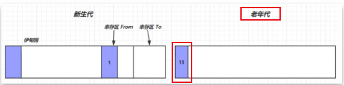

如果新生代和老年代中的空间都满了，就会先触发Minor GC，再触发Full GC，将新生代和老年代中的不再被引用的对象全部回收。

注意：当遇到一个比较大的对象（新生代装不下）时，会将该对象直接晋升到老年代存储。

当新生代和老年代的内存空间被全部占满且通过垃圾回收也无法存放下新的对象时，会抛出out of memory异常(OOM)。如果某个线程内存溢出而抛出了OOM，它不会让其他的线程结束运行。这是因为当一个线程抛出OOM异常后，他所占据的内存会全部被释放，从而不影响其他进程。

# 5. 垃圾回收器

## 5.1 串行垃圾回收器


* 单线程
* 适用于内存小、CPU核数较少的个人电脑
* 安全点：让其他的用户线程在安全点全部停下来，以免因为垃圾回收而移动对象地址时，其他的线程找不到被移动的对象
* 因为是串行的，所以只有一个垃圾回收的线程在运行，其他线程全部进入阻塞状态

### Serial收集器

Serial收集器是最基本、发展历史最久的串行垃圾收集器。

特点：单线程、简单高效，采用复制算法。对于限定单个CPU的环境来说，Serial收集器由于没有线程交互的开销，所以有最高的单线程收集效率。收集器在进行垃圾回收时，必须暂停其他的所有工作线程(stop the world)，直到垃圾回收结束。

### Serial Old收集器

Serial Old收集器是Serial收集器的老年代版本。

特点：单线程收集器，采用标记-整理算法。

## 5.2 吞吐量优先垃圾回收器

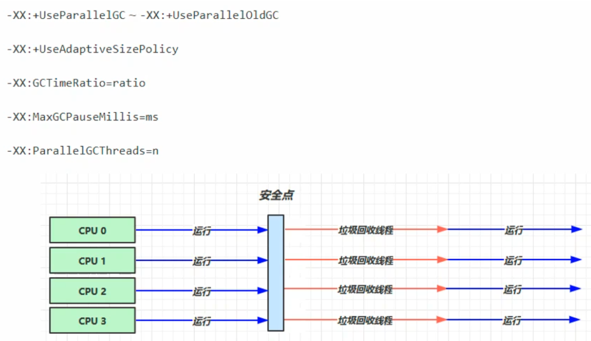

* 多线程
* 适用于堆内存较大、多核CPU
* 在单位时间内，STW(stop the world/停掉其他工作线程)的时间最短
* JDK 1.8默认使用的垃圾回收器

### Parallel Scavenge 收集器

特点：属于新生代垃圾收集器，采用复制算法，是并行的多线程收集器

该收集器的目标是达到一个可控制的吞吐量，并采取GC自适应调节策略

### Parallel Old 收集器

Parallel Scavenge 收集器的老年代版本。

特点：多线程，采用标记-整理算法

## 5.3 响应时间优先垃圾回收器

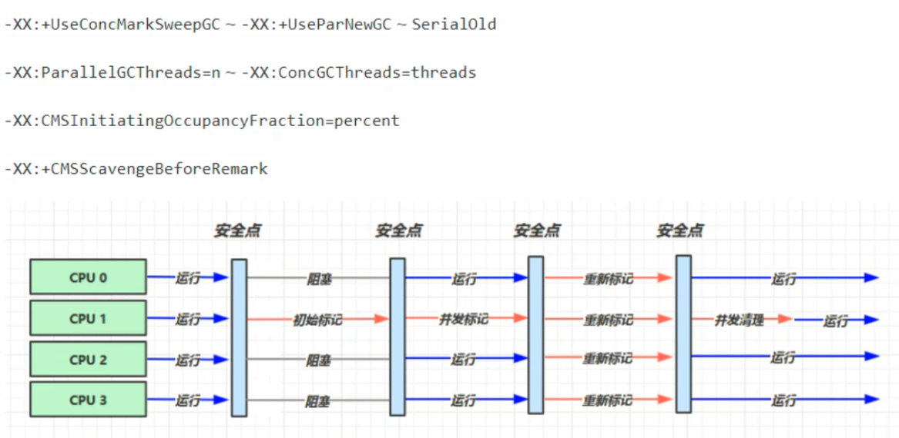

* 多线程
* 适用于堆内存较大、多核CPU
* 尽可能让单次的STW时间最短(尽量不影响其他线程运行)

### CMS垃圾收集器

Concurrent Mark Sweep，一种以获取最短停顿时间为目标的老年代收集器。

特点：采用标记-清除算法。并发收集、低停顿，但是会产生内存碎片

CMS收集器的运行步骤：

1. 初始标记：标记GC root可以直接引用到的对象。速度很快，但是依然存在STW问题。
2. 并发标记：进行GC Roots Tracing的过程，找出存活对象且用户线程可以并发执行。
3. 重新标记：为了修正并发标记期间因用户程序继续执行而导致的标记产生变动的那一部分对象的标记记录。该过程仍然存在STW问题
4. 并发清除：对标记的对象进行清除回收

# 6. Garbage First (G1)

G1垃圾收集器，JDK 9以后默认使用，替代了CMS收集器

运行示意图：

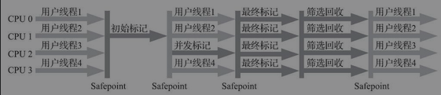

适用场景：

* 同时注重吞吐量和低响应时间
* 超大堆内存（会将堆内存划分为多个大小相等的区域）
* 整体上采用标记-整理算法，两个区域之间采用复制算法

相关参数：在JDK 8中需要手动设置参数开启

* `-XX:+UseG1GC`
* `-XX:G1HeapRegionSize=size`
* `-XX:MaxGCPauseMillis=time`

G1的垃圾回收步骤：

新生代伊甸园垃圾回收--》内存不足时，新生代回收+并发标记--》回收新生代伊甸园、幸存区、老年代内存--》新生代伊甸园垃圾回收（循环往复）

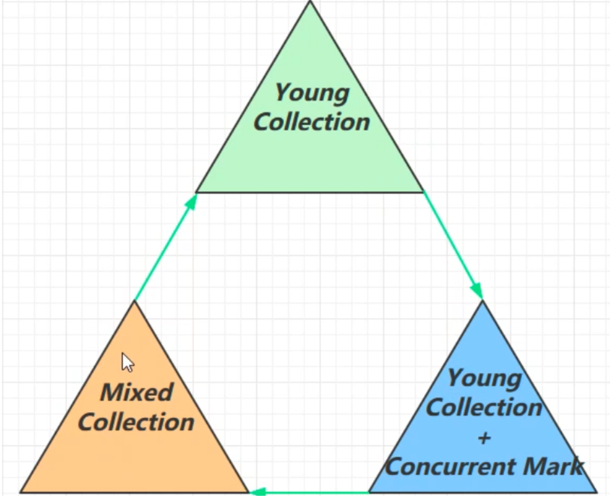

# 7. GC调优

**确定目标**：依据需求（低延迟？高吞吐量？）选择合适的GC回收器

**最快的GC是不发生GC**：首先减少因自身编写的代码而引发的内存问题

查看Full GC 前后的内存占用，考虑数据是不是太多？数据的表示是否太臃肿？是否存在内存泄漏？

**新生代调优**

新生代的特点：

* new操作分配的内存都是非常廉价的
* 死亡对象回收零代价
* 大部分对象用过即死
* Minor GC的时间远小于Full GC

**新生代内存越大越好么？**

答：不是

* 新生代内存太小，会频繁的触发Minor GC，会产生STW，使得吞吐量下降
* 新生代内存太大，会导致老年代的内存占比降低，会频繁的触发Full GC。而且触发Minor GC时，清理新生代的内存所花费的时间会更长
* 新生代的内存设置为容纳`[并发量*(请求-响应)]`的数据为宜

**幸存区调优**

* 幸存区需要能够保存当前活跃对象+需要晋升的对象的空间
* 晋升的阈值要配置得当，让长时间存活的对象尽快得到晋升
