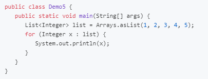

Oracle 提供了 javap 工具来反编译 class 文件

`javap -v [filename.java]`

# 1. 图解方法的执行流程

**常量池载入运行时常量池**

**方法字节码载入方法区**

**执行引擎开始执行字节码**

bipush 10

istore 1

ldc #3

istore 2

iload1 iload2

iadd

istore 3

getstatic #4

iload 3

invokevirtual 5

# 2. 通过字节码指令分析问题

## 2.1 自增自减原理

分析字节码

## 2.2 构造方法原理

**cinit()V**

**init()V**

## 2.3 方法调用原理

## 2.4 多态原理

因为普通成员方法需要在运行时才能确定具体的内容，所以虚拟机需要调用invokevirtual指令

在执行invokevirtual指令时，经历了以下几个步骤：

* 先通过栈帧中对象的引用找到对象
* 分析对象头，找到对象实际的Class
* Class结构中有vtable
* 查询vtable找到方法的具体地址
* 执行方法的字节码

## 2.5 异常处理原理

**try-catch**

**single-catch**

**try-catch-finally**

**finally中的return**

## 2.6 Synchronized原理

# 3. 编译期处理

编译器处理即所谓的语法糖，是指java编译器在把java源码编译成class字节码的时候，自动生成和转换的一些代码，其目的是是为了减轻程序员的负担，是java编译器提供给我们的额外福利。

下面的例子中，给出了我们书写的java源码和经过编译器与处理后的字节码对应的java源码，从中可以看出编译期处理的作用。

## 3.1 默认构造函数

经过编译期优化后

## 3.2 自动拆装箱

经过编译期优化后

## 3.3 泛型集合取值

对应的字节码

## 3.4 可变参数

经过编译期优化后

## 3.5 foreach(增强for)

经过编译期优化后

如果是集合使用foreach

经过编译期优化后

## 3.6 switch字符串

经过编译期优化后

## 3.7 switch枚举

经过编译期优化后

## 3.8 枚举类

经过编译期优化后

## 3.9 匿名内部类

经过编译期优化后

# 4. 类加载阶段

## 4.1 加载阶段

* 将类的字节码载入方法区(jdk 1.8后为元空间，在本地内存中)，内部采用的是instanceKlass描述java类，它重要的field有：    
	* `_java_mirror`：java 的类镜像（例如 String，它的类镜像就是 String.class），起作用是把 klass 暴露给 java 使用
    * `_super`：父类
    * `_fields`：成员变量
    * `_methods`：方法
    * `_constance`：常量池
    * `_class_loader`：类加载器
    * `_vtable`：虚方法表
    * `_itable`：接口方法

* 如果某类还有父类没有加载，则先加载其父类
* 加载和链接的阶段可能是交替运行的
* instanceKlass 保存在方法区；_java_mirror保存在堆内存中
* instanceKlass 和 类镜像 _java_mirror 中互相保存了对方的地址
* 类的对象在对象头中保存了类镜像 _java_mirror 的地址，让对象可以通过类镜像找到方法区中的 instanceKlass，从而获得类的各种信息

## 4.2 链接阶段

**验证**

验证类是否符合 JVM 规范，还有安全性检查

**准备**

为 static 变量分配空间，设置为默认值

* static 在 JDK7 之前存储在 instanceKlass 末尾；JDK7 之后存储在 _java_mirror 末尾
* static 变量分配空间和赋值是在两个阶段完成的：分配空间是在准备阶段；赋值是在初始化阶段
* 如果 static 变量是 final 的基本类型或者字符串常量，那么编译阶段值就已经确定了，故赋值也在准备阶段完成
* 如果 static 变量是 final 的引用类型，则赋值再初始化阶段完成

**解析**

解析的过程是将常量池中的符号引用解析为直接引用（在未解析时，常量池中看到的对象仅仅是符号，并未真正的存在于内存当中）

## 4.3 初始化阶段

初始化阶段就是执行类构造器 clinit() 方法的过程，虚拟机会保证这个类的构造方法线程安全。

clinit() 方法时由编译器自动收集类中的所有类变量的赋值动作和静态语句块(static{})中的语句合并产生的。

类的初始化是懒惰的，以下情况会引发初始化：

* main 方法所在的类，总首先被初始化
* 首次访问该类的静态变量或者静态方法时
* 子类初始化时，若其父类还未被初始化，则会引发初始化
* 子类访问父类的静态变量时，只会导致父类的初始化
* Class.forName
* new 会导致初始化

以下情况不会产生初始化：

* 访问此类的 static final 静态常量(基本类型和字符串)
* 执行类对象.class不会触发初始化
* 创建该类对象的数组
* 类加载器的.loadClass方法
* Class.forName 的参数2=false

验证类是否被初始化，可以通过看该类的静态代码块中的语句是否执行来判断！

# 5. 类加载器

定义：在类加载阶段中的“通过一个类的全限定名来获取到描述该类的二进制字节流”。实现这个动作的代码被称为类加载器(classLoader)

## 5.1 类与类加载器

比较两个类是否相等，只有在这两个类是由同一个类加载器加载的前提下才有意义。

类加载器的分类

| 名称 | 加载的类 | 说明 |
| --- | --- | --- |
| Bootstrap ClassLoader (启动类加载器) | JAVA_HOME/jre/lib | 无法直接访问 |
| Extension ClassLoader (扩展类加载器) | JAVA_HOME/jre/lib/ext | 上级为Bootstrap，显示为null |
| Application ClassLoader (应用类加载器) | classpath | 上级为Extension |
| 自定义类加载器 | 自定义 | 上级为Application |

## 5.2 启动类加载器

可以通过在控制台输入指令，使得类被启动类加载器加载

## 5.3 拓展类加载器

若 `classpath` 和 `JAVA_HOME/jre/lib/ext` 目录下有同名类，加载时会使用拓展类加载器加载。当应用类加载器发现拓展类加载器已经将同名类加载过了，则不会再次加载

## 5.4 自定义类加载器

**使用场景**

* 想要加载非 classpath 路径中的类文件
* 通过接口来使用实现，希望解耦时。常用于框架设计
* 某些类希望予以隔离，不同应用的同名类都可以加载，不冲突。常见于 tomcat 容器

**使用步骤**

1. 继承 ClassLoader 父类
2. 要遵从双亲委派机制，重写 findClass 方法
3. 读取类文件的字节码
4. 调用父类的 defineClass 方法来加载类
5. 使用者调用该类加载器的 loadClass 方法

## 5.5 双亲委派模式

双亲委派模式是指在调用类加载器 ClassLoader 的 loadClass 方法时，查找类的一种规则。

loadClass源码

**破坏双亲委派模式**

* 双亲委派模型的第一次“被破坏”其实发生在双亲委派模型出现之前——即JDK1.2面世以前的“远古”时代    
	* 建议用户重写findClass()方法，在类加载器中的loadClass()方法中也会调用该方法
* 双亲委派模型的第二次“被破坏”是由这个模型自身的缺陷导致的    
	* 如果有基础类型又要调用回用户的代码，此时也会破坏
* 双亲委派模式双亲委派模型的第三次“被破坏”是由于用户对程序动态性的追求而导致的    
	* 这里所说的“动态性”指的是一些非常“热”门的名词：代码热替换（Hot Swap）、模块热部署（Hot Deployment）等
	
# 6. 运行期优化

## 6.1 分层编译

JVM 将执行状态分成了 5 个层次：

* 0层：解释执行，用解释器将字节码翻译成机器码
* 1层：使用 C1 即时编译器编译执行(不带 profiling)
* 2层：使用 C1 即时编译器编译执行(带基本的 profiling)
* 3层：使用 C1 即时编译器编译执行(带完全的 profiling)
* 4层：使用 C2 即时编译器编译执行

其中 profiling 是指在运行过程当中收集的一些程序执行的状态，例如方法的调用次数、循环的次数等

**即时编译器(JIT)与解释器的区别**
* 解释器：    
	* 将字节码解释为机器码，下次遇到相同的字节码，仍然执行重复的解释
    * 是将字节码解释为针对所有平台都通用的机器码
* 即时编译器JIT    
	* 将一些字节码编译为机器码，并存入 Code Cache，下次遇到同样的代码直接执行，无需重复编译
    * 根据平台类型，生成平台特定的机器码
	
对于大部分不常用的代码，我们无须耗费时间将其编译为机器码，而是采取解释执行的方式运行；对于仅占小部分的热点代码，我们可以将其编译为机器码，已达到理想的运行速度。

在执行效率上，`Interpreter < C1 < C2`，总目标是发现热点代码(hotspot)，并优化这些代码。

**逃逸分析**

逃逸分析是指虚拟机可以分析新创建对象的使用范围，从而决定是否在栈上分配内存的一项技术。

逃逸分析的 JVM 参数：

* 开启逃逸分析：`-XX:+DoEscapeAnalysis`
* 关闭逃逸分析：`-XX:-DoEscapeAnalysis`
* 显示分析结果：`-XX:+PrintEscapeAnalysis`

**逃逸分析优化**

当一个对象没有逃逸时，可以得到以下几个优化

* 锁消除：线程同步锁是非常牺牲性能的，当编译器确定当前对象只有当前线程在使用，那么就会移除该对象的同步锁。    
	* 开启锁消除：`-XX:+EliminateLocks`
    * 关闭锁消除：`-XX:-EliminateLocks`
* 标量替换：如果一个对象没有发生逃逸，那么压根就不需要创建它，只需要在栈或者寄存器上创建它用到的成员变量即可。这样节省了空间，也提升了应用程序的性能。    * 开启标量替换：-XX:+EliminateAllocations
    * 关闭标量替换：`-XX:-EliminateAllocations`
    * 显示标量替换详情：`-XX:+PrintEliminateAllocations`
* 栈上分配：当对象没有发生逃逸时，该对象可以通过标量替换分解成成员标量分配在栈内存中，和方法的生命周期一致，随着栈帧的出栈而销毁，减少了 GC 压力，提高了应用程序性能

## 6.2 方法内联

方法内联指程序在编译时，编译器将程序中出现的内联函数的调用表达式用内联函数的函数体直接替换的过程。

Java 中的内联函数由编译器决定（C++中由用户决定）

Java 不支持直接声明为内联函数。如果你想让函数内联，只能够向编译器提出请求：使用关键字 final 来指明你希望被编译器内联的函数。

总的来说，一般的函数不会被当做内联函数，只有声明了 final 后，编译器才会考虑是否要将函数变成内联函数。

