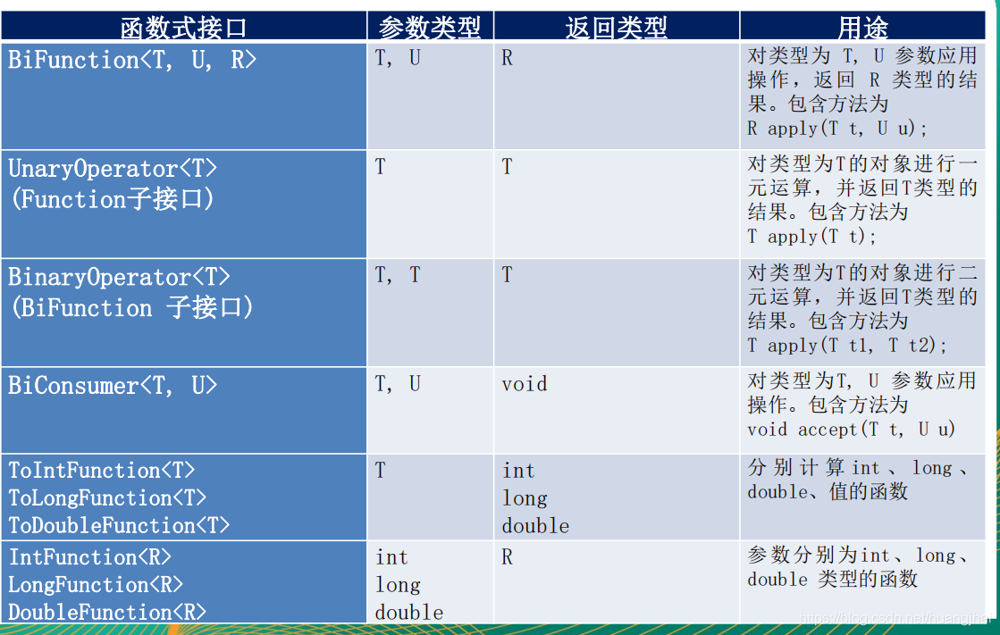

# 1. Lambda 表达式的简介
Lambda 表达式，也可称为闭包。类似于 JavaScript 中的闭包，它是推动 Java8 发布的最重要的新特性。

我们可以把 Lambda 表达式理解为一段可以传递的代码。Lambda 允许把函数作为一个方法的参数，将动作(行为)作为参数进行传递。
使用 Lambda 表达式可以写出更简洁、更灵活的代码，而其作为一种更紧凑的代码风格，使 Java 的语言表达能力得到了提升。

代码示例：分别使用局部内部类、静态内部类、匿名内部类以及 Lambda 表达式方式实现 Runnable 的 run() 方法并创建和启动线程
```java
public class LambdaDemo01 {

    class MyThread01 implements Runnable {
        @Override
        public void run() {
            System.out.println("我是“局部内部类”创建的线程...");
        }
    }

    static class MyThread02 implements Runnable {
        @Override
        public void run() {
            System.out.println("我是“静态内部类”创建的线程...");
        }
    }

    public static void main(String[] args) {
        // 1. 使用匿名内部类创建线程
        new Thread(new Runnable() {
            @Override
            public void run() {
                System.out.println("我是“匿名内部类“创建的线程...");
            }
        }).start(); // 我是“匿名内部类“创建的线程...

        // 2. 使用局部内部类创建线程
        LambdaDemo01 lambdaDemo01 = new LambdaDemo01();
        MyThread01 myThread01 = lambdaDemo01.new MyThread01();
        new Thread(myThread01).start(); // 我是“局部内部类”创建的线程...

        // 3. 使用静态内部类创建线程
        MyThread02 myThread02 = new MyThread02();
        new Thread(myThread02).start(); // 我是“静态内部类”创建的线程...

        // 4. 使用 Lambda 表达式创建线程
        new Thread(() -> {
            System.out.println("我是”Lambda表达式“创建的线程...");
        }).start(); // 我是”Lambda表达式“创建的线程...
    }
}
```

# 2. Lambda 表达式语法
Lambda 表达式在 Java 语言中引入了一个操作符`->`，该操作符被称为 Lambda 操作符或箭头操作符。它将 Lambda 分为两个部分：
* 左侧：指定了 Lambda 表达式需要的所有参数
* 右侧：制定了 Lambda 体，即 Lambda 表达式要执行的功能（动作）

Lambda 表达式的重要特征：
* 可选类型声明：不需要声明参数类型，编译器可以统一识别参数值。
* 可选的参数圆括号：一个参数无需定义圆括号，但多个参数需要定义圆括号。
* 可选的大括号：如果主体包含了一个语句，就不需要使用大括号。
* 可选的返回关键字：如果主体只有一个表达式返回值则编译器会自动返回值，大括号需要指定明表达式返回了一个数值。

# 3. 函数式接口
只包含一个抽象方法的接口，称为函数式接口，我们可以通过 Lambda 表达式来创建该接口的实现对象。

我们可以在任意函数式接口上使用`@FunctionalInterface`注解，这样可以用于检测它是否是一个函数式接口。同时 javadoc 也会包含一条声明，说明这个接口是一个函数式接口。

## 3.1 自定义函数式接口
```java
/**
 * 自定义函数式接口
 */
@FunctionalInterface
public interface MyFuncInterf<T> {
    public T getValue(String origin);
}
```
```java
/**
 * 自定义接口式函数的使用
 */
public class LambdaDemo02 {

    // 定义一个方法将函数式接口作为方法参数
    public static String toLowerString(MyFuncInterf<String> myFuncInterf, String origin) {
        return myFuncInterf.getValue(origin);
    }

    public static void main(String[] args) {
        // 将 Lambda 表达式实现的接口作为参数传递
        String value = toLowerString((str) -> {
            return str.toLowerCase(Locale.ROOT);
        }, "ZQF");
        System.out.println(value); // zqf
    }

}
```

## 3.2 Java 内置的函数式接口
四大函数式接口：

| 函数式接口 | 参数类型 | 返回类型 | 用途 |
| --- | --- | --- | --- |
| Consumer<T> 消费型接口 | T | void | 对类型为 T 的对象应用操作，包含方法：`void accept(T t)` | 
| Supplier<T> 供给型接口 |   | T | 返回类型为 T 的对象，包含方法：`T get()` |
| Function<T, R> 函数型接口 | T | R | 对类型为 T 的对象应用操作，并返回类型为 R 的对象，包含方法：`R apply(T t)` | 
| Predication<T> 断定型接口 | T | boolean | 确定类型为 T 的对象是否满足某约束，并返回 boolean 值，包含方法：`boolean test(T t)` |

使用示例：
```java
/**
 * 四大函数式接口的使用示例
 */
public class LambdaDemo03 {

    /**
     * 消费型接口 Consumer
     */
    public static void makeMoney(int num, Consumer<Integer> consumer) {
        consumer.accept(num);
    }

    /**
     * 供给型接口 Supplier：随机产生整数加入集合中
     */
    public static List<Integer> addNumInList(int size, Supplier<Integer> supplier) {
        List<Integer> list = new ArrayList<>();
        for (int i = 0; i < size; i ++) {
            list.add(supplier.get());
        }
        return list;
    }

    /**
     * 函数型接口 Function
     */
    public static String handleStr(String str, Function<String, String> function) {
        return function.apply(str);
    }

    /**
     * 断言型接口 Predicate：自定义条件过滤字符串集合
     */
    public static List<String> filterStr(List<String> strList, Predicate<String> predicate) {
        List<String> result = new ArrayList<>();
        for (int i = 0; i < strList.size(); i ++) {
            if (predicate.test(strList.get(i))) {
                result.add(strList.get(i));
            }
        }
        return result;
    }

    public static void main(String[] args) {
        // 消费型接口 Consumer
        makeMoney(200, (num) -> System.out.println("今天捡了" + num + "元！"));

        // 供给型接口 Supplier
        List<Integer> list = addNumInList(5, () -> (int) (Math.random() * 100));
        list.forEach((x) -> System.out.println(x));

        // 函数型接口 Function
        String str = handleStr("ABCDEF", (s) -> s.toLowerCase(Locale.ROOT));
        System.out.println(str);

        // 断言型接口 Predicate
        List<String> strings = Arrays.asList("啊啊啊", "2333", "666", "?????????");
        List<String> resList = filterStr(strings, (s) -> s.length() > 3);
        resList.forEach((x) -> System.out.println(x));
    }

    /**
     * 运行结果：
     * 今天捡了200元！
     * 50
     * 25
     * 52
     * 71
     * 47
     * abcdef
     * 2333
     * ?????????
     */

}
```

其它函数式接口：




# 4. 几种引用
## 4.1 方法引用
当要传递给Lambda体的操作，已经有实现的方法了，就可以使用方法引用！方法引用可以理解为方法引用是 Lambda 表达式的另外一种表现形式。

方法引用的语法：使用操作符“::”将对象或类和方法名分隔开。

方法引用的使用情况共分为以下三种：
* 对象::实例方法名
* 类::静态方法名
* 类::实例方法名

```java
public class LambdaDemo04 {

    public static void main(String[] args) {

        // 对象::实例方法名
        PrintStream out = System.out;
        Consumer<String> consumer = out::println;
        consumer.accept("hello world！"); // hello world！

        // 类::静态方法名
        Comparator<Integer> comparator = Integer::compare;
        System.out.println(comparator.compare(2, 1)); // 1

        // 类::实例方法名
        BiPredicate<String, String> biPredicate = String::equals;
        System.out.println(biPredicate.test("1", "3")); // false
    }

}
```

## 4.2 构造器引用
与函数式接口相结合，自动与函数式接口中方法兼容，可以把构造器引用赋值给定义的方法。需要注意构造器参数列表要与接口中抽象方法的参数列表一致。

格式：类名::new

```java
public class LambdaDemo05 {

    public static void main(String[] args) {
        // 引用无参构造
        Supplier<Programmer> supplier = Programmer::new;
        System.out.println(supplier.get()); // Programmer{name='null', age=0}
        // 引用有参构造
        BiFunction<String, Integer, Programmer> biFunction = Programmer::new;
        System.out.println(biFunction.apply("zqf", 25)); // Programmer{name='zqf', age=25}
    }

}
```

## 4.3 数组引用
数组引用的格式：type[]:new

```java
public class LambdaDemo06 {

    public static void main(String[] args) {
        Function<Integer, String[]> function = String[]::new;
        String[] apply = function.apply(10);
        System.out.println(apply.length); // 10
    }

}
```

# 5. Lambda 表达式的优缺点
* 优点
  * 代码简洁
  * 可以使用并行流来并行处理，充分利用多核 CPU 的优势
  * 有利于 JIT 编译器对代码进行优化
* 缺点
  * 非并行计算情况下，其计算速度没有比传统的 for 循环快
  * 不容易调试
  * 若其他程序员没有学过 Lambda 表达式，代码不容易看懂
  * 在 Lambda 语句中强制类型转换不方便
