# 0. 编写代码前的设计工作

## 0.1 WEB 项目后端开发步骤

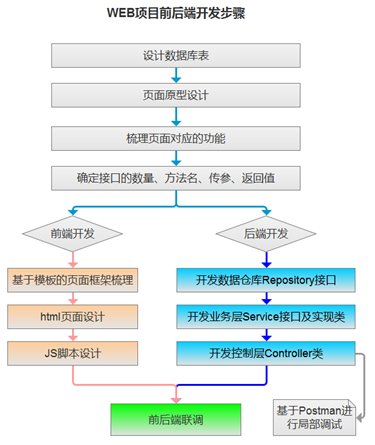

## 0.2 数据库表的设计

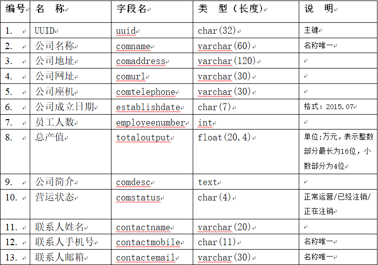

## 0.3 页面原型设计

对具体页面，包含的功能等有一个总体设计

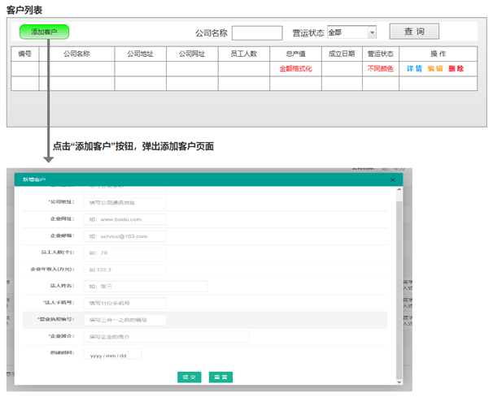

## 0.4 功能梳理

* 客户分页列表展示
* 添加客户
* 查看客户详情
* 编辑客户信息
* 删除客户
* 复杂查询

## 0.5 接口梳理

接口管理方式有多种，在线管理的也挺多（如阿里巴巴的RAP2，功能相当强大，另外DOClever也不错），这里简洁起见，采用最基本的方式来管理接口，下面的有的接口不是必然的，是为了演示相关的知识点而增加的。

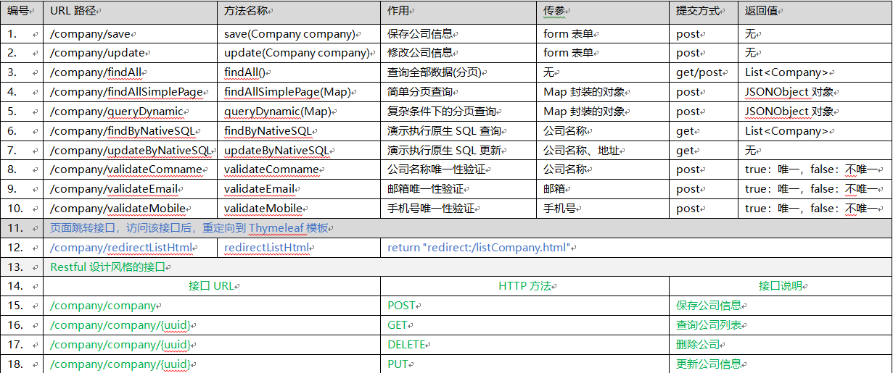

# 1. 项目构建与基本配置

## 1.1 POM 文件

springboot 版本 2.4.2，本模块主要用到的依赖有 JPA、MySQL、Druid、FastJSON

```xml
<?xml version="1.0" encoding="UTF-8"?>
<project xmlns="http://maven.apache.org/POM/4.0.0" xmlns:xsi="http://www.w3.org/2001/XMLSchema-instance"
         xsi:schemaLocation="http://maven.apache.org/POM/4.0.0 https://maven.apache.org/xsd/maven-4.0.0.xsd">
    <modelVersion>4.0.0</modelVersion>
    <parent>
        <groupId>org.springframework.boot</groupId>
        <artifactId>spring-boot-starter-parent</artifactId>
        <version>2.4.2</version>
        <relativePath/> <!-- lookup parent from repository -->
    </parent>
    <groupId>com.zqf</groupId>
    <artifactId>mydemo</artifactId>
    <version>0.0.1-SNAPSHOT</version>
    <name>mydemo</name>
    <description>Demo project for Spring Boot</description>
    <properties>
        <java.version>14</java.version>
    </properties>
    <dependencies>
        <dependency>
            <groupId>org.springframework.boot</groupId>
            <artifactId>spring-boot-starter-thymeleaf</artifactId>
        </dependency>
        <dependency>
            <groupId>org.springframework.boot</groupId>
            <artifactId>spring-boot-starter-web</artifactId>
        </dependency>
        <dependency>
            <groupId>org.springframework.boot</groupId>
            <artifactId>spring-boot-devtools</artifactId>
            <scope>runtime</scope>
            <optional>true</optional>
        </dependency>
        <dependency>
            <groupId>org.springframework.boot</groupId>
            <artifactId>spring-boot-configuration-processor</artifactId>
            <optional>true</optional>
        </dependency>
        <dependency>
            <groupId>org.projectlombok</groupId>
            <artifactId>lombok</artifactId>
            <optional>true</optional>
        </dependency>
        <dependency>
            <groupId>org.springframework.boot</groupId>
            <artifactId>spring-boot-starter-test</artifactId>
            <scope>test</scope>
        </dependency>

        <!--JPA-->
        <dependency>
            <groupId>org.springframework.boot</groupId>
            <artifactId>spring-boot-starter-data-jpa</artifactId>
        </dependency>

        <!--MySQL-->
        <dependency>
            <groupId>mysql</groupId>
            <artifactId>mysql-connector-java</artifactId>
            <scope>runtime</scope>
        </dependency>

        <!--druid-->
        <dependency>
            <groupId>com.alibaba</groupId>
            <artifactId>druid-spring-boot-starter</artifactId>
            <version>1.1.17</version>
        </dependency>

        <!--fastjson-->
        <dependency>
            <groupId>com.alibaba</groupId>
            <artifactId>fastjson</artifactId>
            <version>[1.2.31,)</version>
        </dependency>

    </dependencies>

    <build>
        <plugins>
            <plugin>
                <groupId>org.springframework.boot</groupId>
                <artifactId>spring-boot-maven-plugin</artifactId>
                <configuration>
                    <excludes>
                        <exclude>
                            <groupId>org.projectlombok</groupId>
                            <artifactId>lombok</artifactId>
                        </exclude>
                    </excludes>
                </configuration>
            </plugin>
        </plugins>
    </build>
</project>

```

## 1.2 配置文件yml

多个配置文件对应着多种环境（测试环境，开发环境...），可以方便的切换

主配置文件(application.yml)：只负责引入对应环境下的配置文件

```yml
spring:
  profiles:
    active: dev
```

application-dev.yml：

```yml
server:
  port: 8080  # 指定端口号

logging:
  level:
    root: info  # 系统的日志级别
    com.zqf.mydemo: debug  # 具体工程的日志级别
  file:
    name: logs/system.log  # 设置日志的保存文件

spring:
  jpa:
    hibernate:
      ddl-auto: update
    show-sql: true

  datasource:  # 配置数据库连接池基本信息
    driver-class-name: com.mysql.cj.jdbc.Driver
    url: jdbc:mysql://127.0.0.1:3306/mydemo?serverTimezone=UTC&useSSL=false
    username: root
    password: 961231zqf
    type: com.alibaba.druid.pool.DruidDataSource

    druid:
      initial-size: 5  # 初始化时建立物理连接的个数
      min-idle: 5  # 最小连接池数量
      max-active: 20  # 最大连接池数量
      max-wait: 60000  # 获取连接时最大等待时间，单位毫秒
      time-between-eviction-runs-millis: 60000  # 配置间隔多久才进行一次检测，检测需要关闭的空闲连接，单位是毫秒
      min-evictable-idle-time-millis: 300000  # 配置一个连接在池中最小生存的时间，单位是毫秒
      validation-query: select 1   # 用来检测连接是否有效的sql
      test-while-idle: true  # 申请连接的时候检测，如果空闲时间大于timeBetweenEvictionRunsMillis，执行validationQuery检测连接是否有效
      test-on-borrow: false  # #申请连接时执行validationQuery检测连接是否有效，如果为true会降低性能
      test-on-return: false  # #归还连接时执行validationQuery检测连接是否有效，如果为true会降低性能
      pool-prepared-statements: true  # 打开PSCache，并且指定每个连接上PSCache的大小
      max-pool-prepared-statement-per-connection-size: 20  # 要启用PSCache，必须配置大于0，当大于0时，poolPreparedStatements自动触发修改为true。在Druid中，不会存在Oracle下PSCache占用内存过多的问题，可以把这个数值配置大一些，比如说100
      filters: stat,wall,slf4j  # 配置监控统计拦截的filters，去掉后监控界面sql无法统计，'wall'用于防火墙
      connect-properties: druid.stat.mergeSql\=true;druid.stat.slowSqlMillis\=5000  # #通过connectProperties属性来打开mergeSql功能；慢SQL记录

      web-stat-filter:  # 配置DruidStatFilter，用于采集web-jdbc关联监控的数据
        enabled: true
        url-pattern: "/*"  # 定义过滤路径
        exclusions: "*.js,*.gif,*.jpg,*.bmp,*.png,*.css,*.ico,/druid/*"  # 排除不必要的过滤

      stat-view-servlet:  # # 配置DruidStatViewServlet
        enabled: true
        url-pattern: "/druid/*"
        allow:   # IP白名单(没有配置或者为空，则只能在本地访问)
        deny: # IP黑名单 (存在共同时，deny优先于allow)
        reset-enable: false  # 禁用HTML页面上的“Reset All”功能
        login-username: admin  # 可视化界面：登录名
        login-password: admin  # 可视化界面：登录密码

```

## 1.3 主启动类

```java
package com.zqf.mydemo;

import org.springframework.boot.SpringApplication;
import org.springframework.boot.autoconfigure.SpringBootApplication;

@SpringBootApplication
public class MydemoApplication {

    public static void main(String[] args) {
        SpringApplication.run(MydemoApplication.class, args);
    }

}

```

# 2. 编写实体类(domain)，在数据库中创建对应的表

实体类采用`@Entity`注解，同时使用`@Table`注解使其在数据库中自动生成对应的表。注意，需要提供各个属性的 get()/set() 方法（此处使用 lombok 的 `@Data`实现）

```java
package com.zqf.mydemo.domain;

import lombok.Data;
import org.hibernate.annotations.GenericGenerator;

import javax.persistence.*;

/**
 * company 实体类
 */

@Data
@Entity
@Table(name = "company")
public class Company {

    @Id
    @GeneratedValue(generator = "myuuid")
    @GenericGenerator(name = "myuuid", strategy = "uuid")
    @Column(length = 32)
    private String uuid;

    @Column(length = 60)
    private String comname;

    @Column(length = 120)
    private String comaddress;

    @Column(length = 30)
    private String comurl;

    @Column(length = 30)
    private String comtelephone;

    @Column(columnDefinition = "char(7)")
    private String establishdate;

    @Column
    private int employeenumber;

    @Column(columnDefinition = "float(20,4) default '0.00'")
    private float totaloutput;

    @Column(columnDefinition = "text")
    private String comdesc;

    @Column(columnDefinition = "char(4)")
    private String comstatus;

    @Column(length = 20)
    private String contactname;

    @Column(columnDefinition = "char(11)")
    private String contactmobile;

    @Column(length = 30)
    private String contactemail;

    @Column(length = 500)
    private String upload;

}

```

# 3. 编写数据仓库接口(xxxRepo)，继承并拓展业务功能

创建的数据仓库类是一个接口(不是抽象类、也不是普通类)，针对这个接口添加注解`@Repository`。

## 3.1 数据仓库接口的作用

* Repository 原意指的是仓库，即数据仓库的意思。
* Repository居于业务层和数据层之间，将两者隔离开来，在它的内部封装了数据查询和存储的逻辑。

## 3.2 Repository和DAO的区别

DAO 是传统 MVC 中 Model 的关键角色，全称是 Data Access Object。DAO 直接负责数据库的存取工作，乍一看两者非常类似，但从架构设计上讲两者有着本质的区别：**Repository 是相对对象而言，DAO 则是相对数据库而言**，虽然可能是同一个东西 ，但侧重点完全不同。

## 3.3 Repository接口

* CrudRepository
* PagingAndSortingRepository
* JpaRepository
* JpaSpecificationExecutor

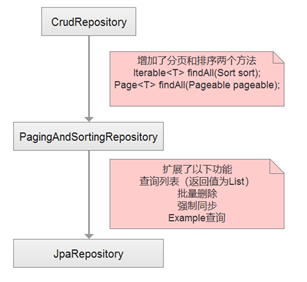

## 3.4 代码

通过继承接口，不仅可以使用封装好的 SQL 语句，还可以对功能进行扩展

涉及到数据变动的，如删除和更新，必须加注解`@Modifying`

```java
package com.zqf.mydemo.repository;

import com.zqf.mydemo.domain.Company;
import org.springframework.data.jpa.repository.JpaRepository;
import org.springframework.data.jpa.repository.JpaSpecificationExecutor;
import org.springframework.data.jpa.repository.Modifying;
import org.springframework.data.jpa.repository.Query;
import org.springframework.stereotype.Repository;

/**
 * company 数据仓库
 */
@Repository
public interface CompanyRepo extends JpaRepository<Company, String>, JpaSpecificationExecutor {

    // 原生sql语句查询
    @Query(value = "select * from company where comname=?1", nativeQuery = true)
    Company findByName(String comname);

    // 原生sql语句操作（涉及到数据变动的，如删除和更新，必须加注解@Modifying）
    @Modifying
    @Query(value = "delete from company where comname=?1", nativeQuery = true)
    void deleteByName(String comname);

    // 原生sql语句操作（涉及到数据变动的，如删除和更新，必须加注解@Modifying）
    @Modifying
    @Query(value = "update company set comaddress=?1,comurl=?2,comtelephone=?3,establishdate=?4,employeenumber=?5," +
            "totaloutput=?6,comdesc=?7,comstatus=?8,contactname=?9,contactmobile=?10,contactemail=?11 where comname=?12", nativeQuery = true)
    void updateByName(String comaddress, String comurl, String comtelephone, String establishdate,
                      int employeenumber, float totaloutput, String comdesc, String comstatus, String contactname,
                      String contactmobile, String contactemail, String comname);

    //公司唯一性验证(如果已经存在，返回0，否则返回1)
    @Query(value = "select count(*) from company where comname=?1",nativeQuery = true)
    int validateComname(String comname);

    //邮箱号唯一性验证(如果已经存在，返回0，否则返回1)
    @Query(value = "select count(*) from company where contactemail=?1",nativeQuery = true)
    int validateEmail(String email);

    //手机号唯一性验证(如果已经存在，返回0，否则返回1)
    @Query(value = "select count(*) from company where contactmobile=?1",nativeQuery = true)
    int validateMobile(String mobile);

}

```

# 4. 编写服务层接口(xxxService)，定义要实现的方法

服务层接口及实现类命名方式，接口 XXXService，实现类： XXXServiceImpl

```java
package com.zqf.mydemo.service;

import com.zqf.mydemo.domain.Company;
import org.springframework.data.domain.Page;
import org.springframework.data.domain.Pageable;

import javax.transaction.Transactional;
import java.util.List;
import java.util.Map;

/**
 * company 服务层接口
 */
public interface CompanyService {

    // 保存
    void save(Company company);

    // 查询全部数据
    List<Company> findAll();

    // 根据comname删除记录
    @Transactional
    void delete(String comname);

    //根据公司名称更新公司信息
    @Transactional
    void updateByName(String comaddress, String comurl, String comtelephone, String establishdate,
                      int employeenumber, float totaloutput, String comdesc, String comstatus, String contactname,
                      String contactmobile, String contactemail, String comname);

    // 执行原生SQL语句的查询
    Company findByName(String companyname);

    // 验证公司名称唯一性
    boolean validateComname(String comname);

    // 验证邮箱唯一性
    boolean validateEmail(String email);

    // 验证手机号唯一性
    boolean validateMobile(String mobile);

    // 更新数据时验证邮箱唯一性
    boolean validateEmailForUpdate(String email);

    // 更新数据时验证手机号唯一性
    boolean validateMobileForUpdate(String mobile);

    //多条件动态查询
    Page<Company> queryDynamic(Map<String,Object> reqMap, Pageable pageable);

}

```

# 5. 编写服务层实现类(xxxServiceImpl)，在这里实现接口中的方法，编写业务逻辑

* 实现类XXXServiceImpl需添加注解`@Service`，并指明名称，如 `@Service("companyService")`
* 在实现类中，通过注解`@Autowired`，注入数据仓库层 Repository接口
* 当实现的接口涉及数据库数据的删除或修改时，方法上一定要添加注解`@Transactional`，否则会执行不成功

```java
package com.zqf.mydemo.service.impl;

import com.zqf.mydemo.domain.Company;
import com.zqf.mydemo.repository.CompanyRepo;
import com.zqf.mydemo.service.CompanyService;
import org.springframework.beans.factory.annotation.Autowired;
import org.springframework.data.domain.Page;
import org.springframework.data.domain.Pageable;
import org.springframework.data.jpa.domain.Specification;
import org.springframework.stereotype.Service;

import javax.persistence.criteria.CriteriaBuilder;
import javax.persistence.criteria.CriteriaQuery;
import javax.persistence.criteria.Predicate;
import javax.persistence.criteria.Root;
import javax.transaction.Transactional;
import java.util.ArrayList;
import java.util.List;
import java.util.Map;

/**
 * company 服务层逻辑实现类
 */

@Service("companyServiceImpl")
public class CompanyServiceImpl implements CompanyService {

    @Autowired
    private CompanyRepo companyRepo;

    @Override
    public List<Company> findAll() {
        return companyRepo.findAll();
    }

    @Override
    public void save(Company company) {
        companyRepo.save(company);
    }

    @Transactional
    @Override
    public void delete(String comname) {
        companyRepo.deleteByName(comname);
    }

    @Transactional
    @Override
    public void updateByName(String comaddress, String comurl, String comtelephone, String establishdate, 
                             int employeenumber, float totaloutput, String comdesc, String comstatus, 
                             String contactname, String contactmobile, String contactemail, String comname) {
        companyRepo.updateByName(comaddress, comurl, comtelephone, establishdate, employeenumber, 
                totaloutput, comdesc, comstatus, contactname, contactmobile, contactemail, comname);
    }

    @Override
    public Company findByName(String companyname) {
        return companyRepo.findByName(companyname);
    }

    @Override
    public boolean validateComname(String comname) {
        /**
         * 查询对应的公司名称是否存在（服务层用于唯一性验证）,如果公司名称已经存在返回false，否则返回true
         */
        int intNumber = companyRepo.validateComname(comname);
        if(intNumber == 0){return true;}
        else{return false;}
    }

    @Override
    public boolean validateEmail(String email) {
        /**
         * 查询联系人邮箱是否存在（服务层用于唯一性验证）,如果联系人邮箱已经存在返回false，否则返回true
         */
        int intNumber = companyRepo.validateEmail(email);
        if(intNumber == 0){return true;}
        else{return false;}
    }

    @Override
    public boolean validateMobile(String mobile) {
        /**
         * 查询联系人手机号是否存在（服务层用于唯一性验证）,如果联系人手机号已经存在返回false，否则返回true
         */
        int intNumber = companyRepo.validateMobile(mobile);
        if(intNumber == 0){return true;}
        else{return false;}
    }

    @Override
    public boolean validateEmailForUpdate(String email) {
        /**
         * 在更新数据时查询联系人邮箱是否存在（服务层用于唯一性验证）,如果联系人手机号已经存在返回false，否则返回true
         */
        int intNumber = companyRepo.validateEmail(email);
        if(intNumber == 0 || intNumber == 1){return true;}
        else{return false;}
    }

    @Override
    public boolean validateMobileForUpdate(String mobile) {
        /**
         * 在更新数据时查询联系人手机号是否存在（服务层用于唯一性验证）,如果联系人手机号已经存在返回false，否则返回true
         */
        int intNumber = companyRepo.validateMobile(mobile);
        if(intNumber == 0|| intNumber == 1){return true;}
        else{return false;}
    }

    @Override
    public Page<Company> queryDynamic(Map<String, Object> reqMap, Pageable pageable) {
        /**
         * 多条件动态查询，
         * 常用查询：equal(等于)，notEqual(不等于)， gt(大于)， ge(大于等于)，lt(小于)， le(小于等于)，between(闭区间中的值)，like(模糊)等
         */
        Specification querySpecifi=new Specification<Company>()
        {
            @Override
            public Predicate toPredicate(Root<Company> root, CriteriaQuery<?> criteriaQuery, CriteriaBuilder cb)
            {
                List<Predicate> predicates = new ArrayList<>();
                //条件设置部分，查询‘CriteriaBuilder’源码，查询的分类
                if(!reqMap.get("comname").toString().equals(""))//公司名称，like 模糊查询
                {
                    predicates.add(cb.like(root.get("comname"),"%"+reqMap.get("comname").toString()+"%"));
                }
                if(!reqMap.get("comstatus").toString().equals("全部"))//运营状态，精确查询
                {
                    predicates.add(cb.equal(root.get("comstatus"),reqMap.get("comstatus").toString()));
                }
                if(!reqMap.get("employeenumber").toString().equals(""))//大于员工人数
                {
                    predicates.add(cb.gt(root.get("employeenumber"),Integer.parseInt(reqMap.get("employeenumber").toString())));
                }
                return cb.and(predicates.toArray(new Predicate[predicates.size()]));
            }
        };
        return this.companyRepo.findAll(querySpecifi,pageable);//这里利用的是JpaSpecificationExecuto接口的分页查询方法
    }
}

```

# 6. 编写控制层方法(xxxCtl)，接收处理请求

## 6.1 控制层类上的注解

* `@Controller`：创建的类上添加注解`@Controller`表示这是一个控制层类，返回数据的方式既可以是 JSON/xml 数据，也可以是页面模板；
* `@RestController`：创建的类上添加注解`@Controller`表示这是一个控制层类，返回数据的方式只能是 JSON/xml 数据；

两者的关系：**@Controller+@ResponseBody=@RestController**

## 6.2 业务层的注入

* `@Resource`：默认byName 注入的方式，适用于接口只能有一个实现类，名称是`@Service`注解中标定的名称；如果通过 byName 的方式匹配不到，再按 byType 的方式去匹配

* `@Qualifier`：byName 注入的方式，但名称是类名，适用于接口有多个实现类的场景，如`@Qualifier(name="CompanyService")`

* `@Autowired`： byType 注入方式，要求接口只能有一个实现类，Spring 会按 byType 的方式寻找接口的实现类，如果有多个实现类，Spring 不知道要引入哪个类，就会报错

## 6.3 URL映射

* `@RequestMapping`：表示将特定的URL映射到指定的方法；如：`@RequestMapping("/CompanyModule")`
* `@GetMapping`：只接收Get方式的URL映射，相当于`@RequestMapping(value = "/test/hello",method = RequestMethod.Get)`
* `@PostMapping`：只接收Post方式的URL映射，相当于`@RequestMapping(value = "/test/hello",method = RequestMethod.POST)`

注意：URL映射中带不带“/”的问题，带不带都行，规范要求来说应该带，不加“/”会去当前路径下找

## 6.4 参数接收

* `JavaBean 对象`：没有任何注释，直接通过 JavaBean 对象来封装表单参数或者是请求 url 路径中的参数，如：`public void save(Company company)`
* `@RequestParam`：用于获取 Request 参数，也就是URL中的最后一部分，形如：?xx=yy&zz=ww；
* `@PathVariable`：用于获取 URL 变量：一般{ }中的变量名与方法中的形参名一致，用于 RESTful 设计风格；
* `@RequestBody`：直接以 String 方式接收前端以 Post 方式传过来的 JSON 数据，在需要传递大量参数时，很有用，类似于 JavaBean 对象，差别在于，这种方式传递参数，不需要 JavaBean 对象来封装参数，适用于多条件查询场景，一般用Map集合来处理接收的参数，如`public String findAllSimplePageMap(@RequestBody(required = false) Map<String,Object> reqMap)`

## 6.5 返回数据及网页模板

* `@ResponseBody`：返回JSON格式的数据，方法上不加该注解，返回的就是templates文件夹下面的网页    
	* 返回公共网页：如`return "redirect:/newdemo.html";` 资源文件中，resources、static、public这三个文件夹可以直接访问
    * 返回安全文件夹 templates 文件夹下的网页：不区分是 Thymeleaf 网页模板还是普通网页，如`return "mydemo.html";`
	
## 6.6 RESTful设计风格

* PostMapping 用于增删改查的**增**
* GetMapping 用于增删改查的**查**
* PutMapping 用于增删改查的**改**
* DeleteMapping 用于增删改查的**删**

## 6.7 代码

```java
package com.zqf.mydemo.controller;

import com.alibaba.fastjson.JSONObject;
import com.zqf.mydemo.domain.Company;
import com.zqf.mydemo.service.CompanyService;

import com.zqf.mydemo.utils.ReceiveUploadFile;
import org.springframework.beans.factory.annotation.Autowired;
import org.springframework.data.domain.Page;
import org.springframework.data.domain.PageRequest;
import org.springframework.data.domain.Sort;
import org.springframework.stereotype.Controller;
import org.springframework.ui.Model;
import org.springframework.web.bind.annotation.*;
import org.springframework.web.multipart.MultipartFile;

import javax.annotation.Resource;
import java.util.ArrayList;
import java.util.List;
import java.util.Map;

@Controller
@RequestMapping("/CompanyModule")
public class CompanyCtl {

    // *****************************************响应跳转页面*****************************************
    @Resource(name = "companyServiceImpl")
    private CompanyService cs;

    @RequestMapping("/addCompany")
    public String addCompany() {
        /**
         * 处理 /addCompany 请求
         */
        return "company/AddCompany";
    }

    @RequestMapping("/updateCompany/{comname}")
    public String updateCompany(@PathVariable String comname, Model model) {
        /**
         * 处理 /addCompany 请求
         */
        Company company = cs.findByName(comname);
        model.addAttribute("company", company);
        return "company/UpdateCompany";
    }

    @RequestMapping("/listCompany")
    public String listCompany() {
        /**
         * 处理 /listCompany 请求
         */
        return "company/ListCompany";
    }


    // *****************************************增删改查*****************************************
    @RequestMapping("/save")
    @ResponseBody
    public void save(Company company) {
        /**
         * 接收表单，保存数据
         */
        cs.save(company);
    }

    @PostMapping("/delete/{comname}")
    @ResponseBody
    public void delete(@PathVariable String comname) {
        /**
         * 使用 restfull 风格：根据获取的 comname 执行删除命令
         */
        cs.delete(comname);
    }

    @PostMapping("/update")
    @ResponseBody
    public void update(Company company) {
        /**
         * 根据获取的 comname 更新数据
         */
        System.out.println(company);
        cs.updateByName(company.getComaddress(), company.getComurl(), company.getComtelephone(), company.getEstablishdate(), company.getEmployeenumber(),
                company.getTotaloutput(), company.getComdesc(), company.getComstatus(), company.getContactname(), company.getContactmobile(), company.getContactemail(),
                company.getComname());
    }

    @PostMapping("/queryDynamic")
    @ResponseBody
    public String queryDynamic(@RequestBody(required = false) Map<String, Object> reqMap) {
        /**
         * 多条件排序及多条件分页查询
         */
        int page = 0;
        int size = 3;
        if (reqMap != null) {
            if (reqMap.get("page").toString() != null) {
                page = Integer.parseInt(reqMap.get("page").toString());
            }
            if (reqMap.get("size").toString() != null) {
                size = Integer.parseInt(reqMap.get("size").toString());
            }
        }

        List<Sort.Order> orders = new ArrayList<>();
        orders.add(new Sort.Order(Sort.Direction.DESC, "comname"));
        orders.add(new Sort.Order(Sort.Direction.ASC, "comaddress"));

        Page<Company> pageinfo = cs.queryDynamic(reqMap, PageRequest.of(page, size, Sort.by(orders)));
        List<Company> companies = pageinfo.getContent();
        JSONObject result = new JSONObject();//maven中配置alibaba的fastjson依赖
        //"rows"和"total"这两个属性是为前端列表插件"bootstrap-table"服务的
        result.put("rows", companies);
        result.put("total", pageinfo.getTotalElements());
        return result.toJSONString();
    }

    @RequestMapping("/validateComname")
    @ResponseBody
    public String validateComname(@RequestParam String comname) {
        /**
         * 验证公司名是否唯一，唯一:{"valid":true},不唯一：{"valid"：false}
         */
        boolean blStatus = cs.validateComname(comname);
        JSONObject result = new JSONObject();
        result.put("valid", blStatus);
        return result.toJSONString();
    }

    @RequestMapping("/validateMobile")
    @ResponseBody
    public String validateMobile(@RequestParam String contactmobile) {
        /**
         * 验证手机号是否唯一，唯一:{"valid":true},不唯一：{"valid"：false}
         */
        boolean blStatus = cs.validateMobile(contactmobile);
        JSONObject result = new JSONObject();
        result.put("valid", blStatus);
        return result.toJSONString();
    }

    @RequestMapping("/validateEmail")
    @ResponseBody
    public String validateEmail(@RequestParam String contactemail) {
        /**
         * 验证邮箱是否唯一，唯一:{"valid":true},不唯一：{"valid"：false}
         */
        boolean blStatus = cs.validateEmail(contactemail);
        JSONObject result = new JSONObject();
        result.put("valid", blStatus);
        return result.toJSONString();
    }

    @RequestMapping("/validateMobileForUpdate")
    @ResponseBody
    public String validateMobileForUpdate(@RequestParam String contactmobile) {
        /**
         * 更新数据时验证手机号是否唯一，唯一:{"valid":true},不唯一：{"valid"：false}
         */
        boolean blStatus = cs.validateMobileForUpdate(contactmobile);
        JSONObject result = new JSONObject();
        result.put("valid", blStatus);
        return result.toJSONString();
    }

    @RequestMapping("/validateEmailForUpdate")
    @ResponseBody
    public String validateEmailForUpdate(@RequestParam String contactemail) {
        /**
         * 更新数据时验证邮箱是否唯一，唯一:{"valid":true},不唯一：{"valid"：false}
         */
        boolean blStatus = cs.validateEmailForUpdate(contactemail);
        JSONObject result = new JSONObject();
        result.put("valid", blStatus);
        return result.toJSONString();
    }


    // *****************************************文件上传*****************************************
    @Autowired
    ReceiveUploadFile receiveUploadFile;

    @PostMapping("/upload")
    @ResponseBody
    public String upload(@RequestParam MultipartFile file) {
        /**
         * 接收上传文件，反馈回服务器端的文件保存路径（全路径）
         */
        return receiveUploadFile.receiveFile(file, "myfile");
    }


}


```

# 7. 接口测试

使用 postman 对各个接口进行测试

## 7.1 网页跳转接口

**@RequestMapping("/addCompany")**

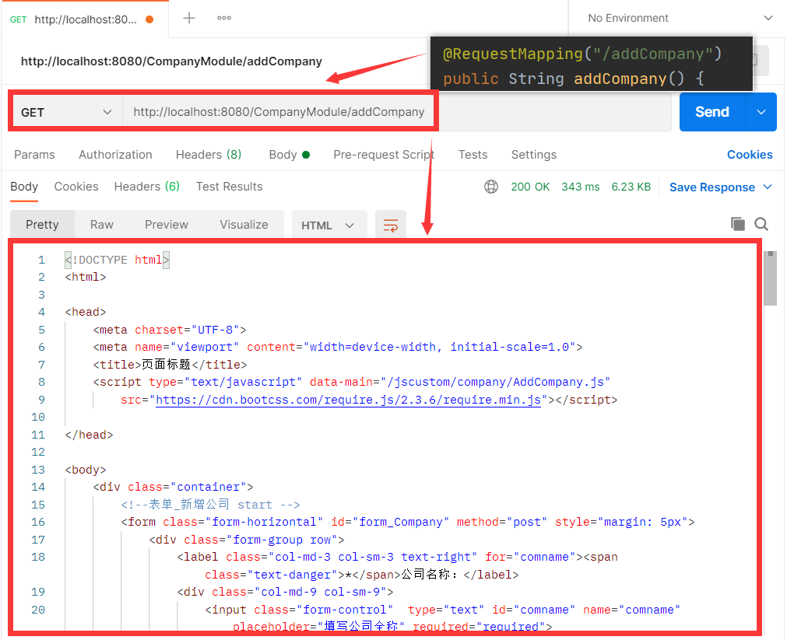

**@RequestMapping("/updateCompany/{comname}")**

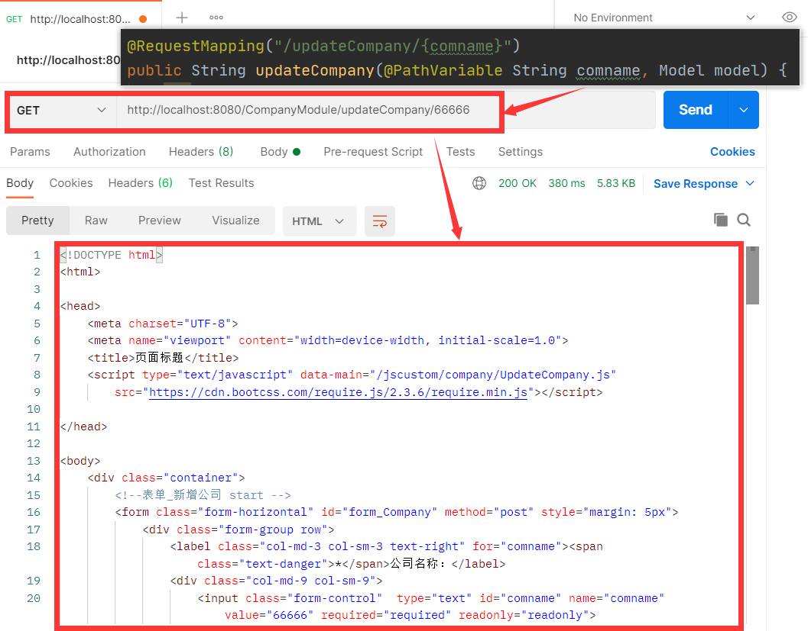

**@RequestMapping("/listCompany")**

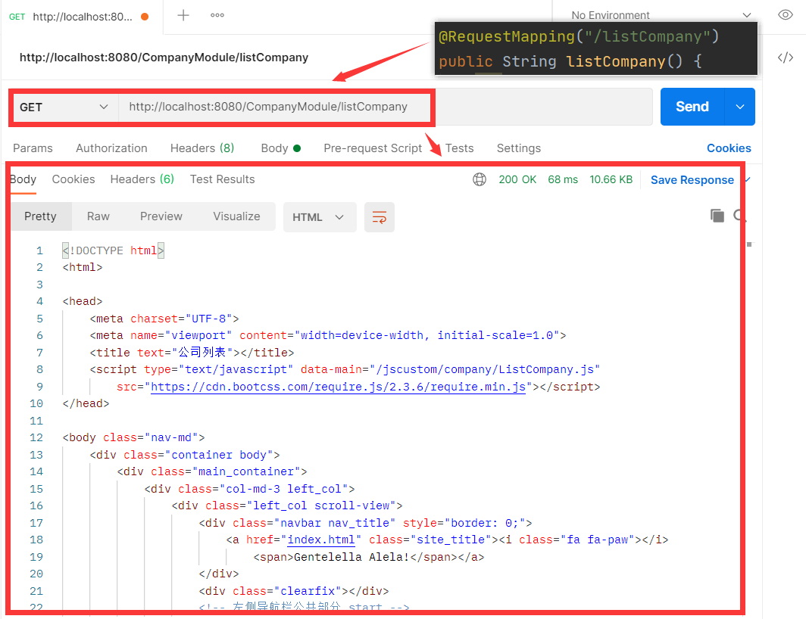

## 7.2 数据库请求接口

**@RequestMapping("/save")**

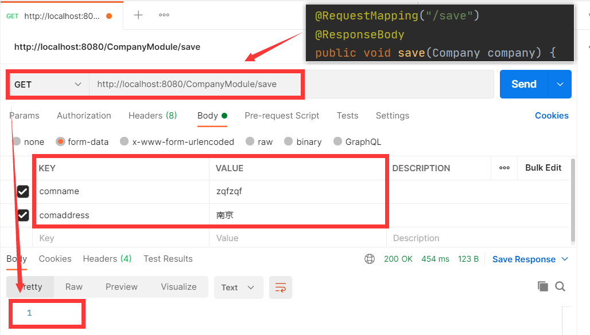

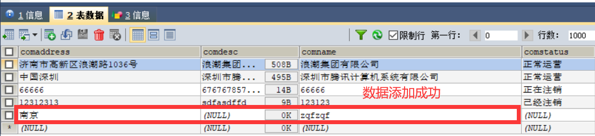

**@PostMapping("/delete/{comname}")**

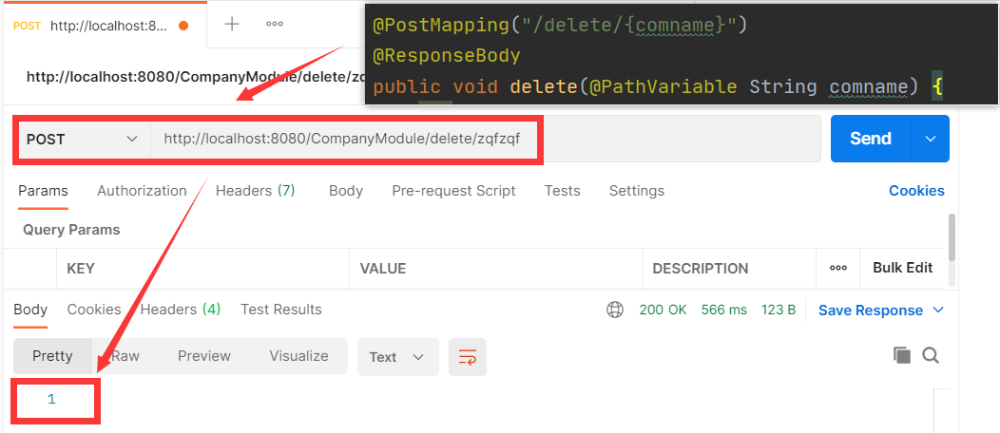

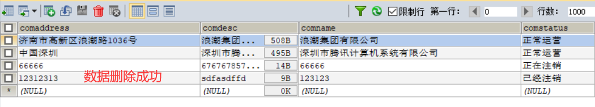

**@PostMapping("/update")**

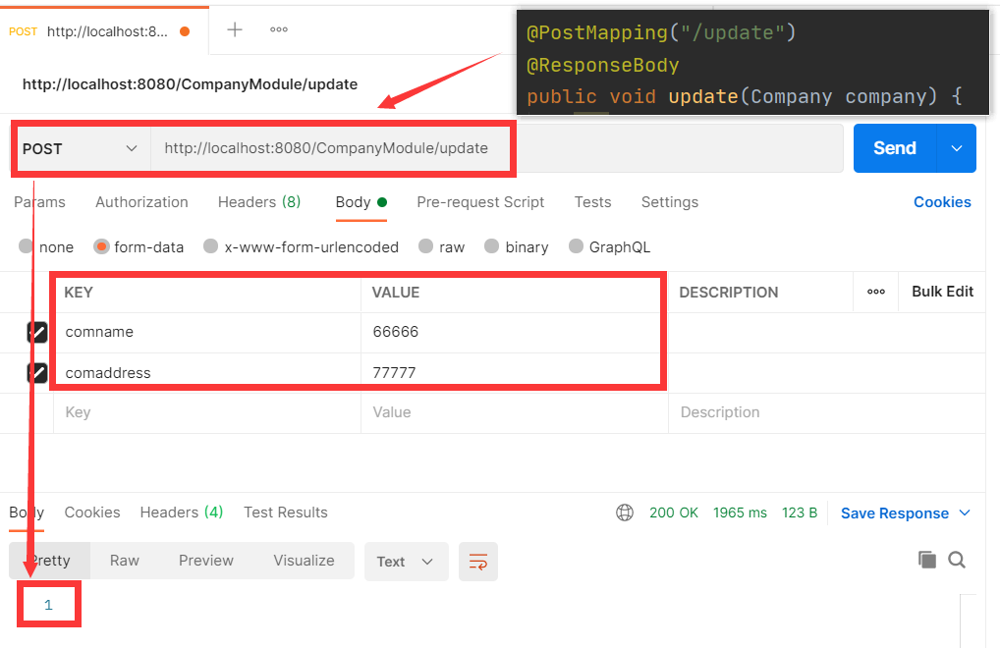

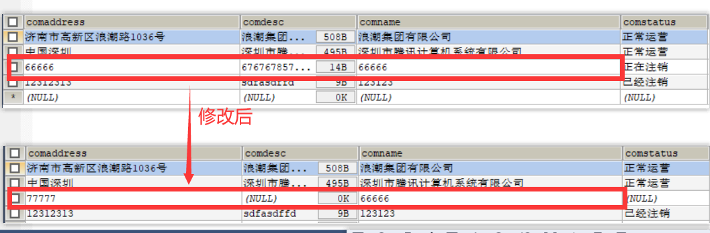

**@PostMapping("/queryDynamic")**

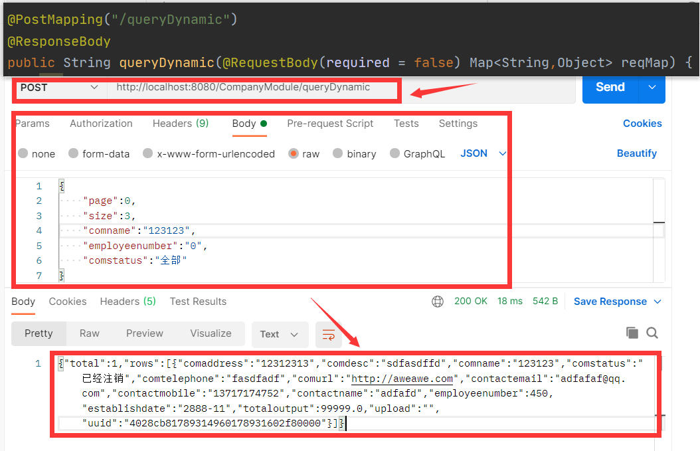

**@RequestMapping("/validateComname")**

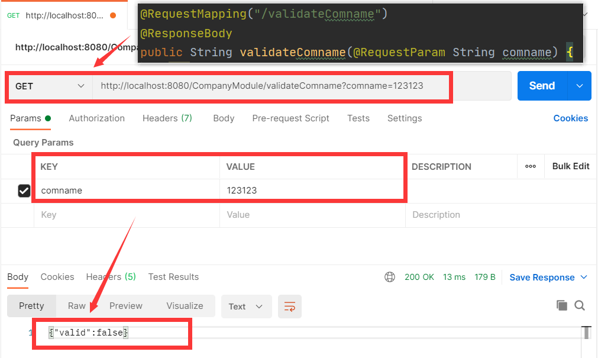

**@RequestMapping("/validateMobile")**

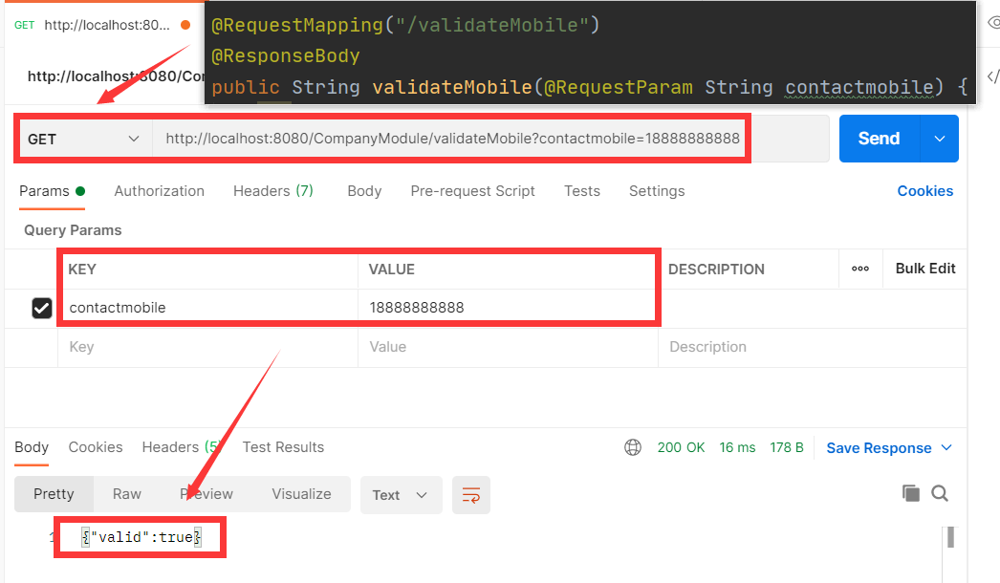

**@RequestMapping("/validateEmail")**

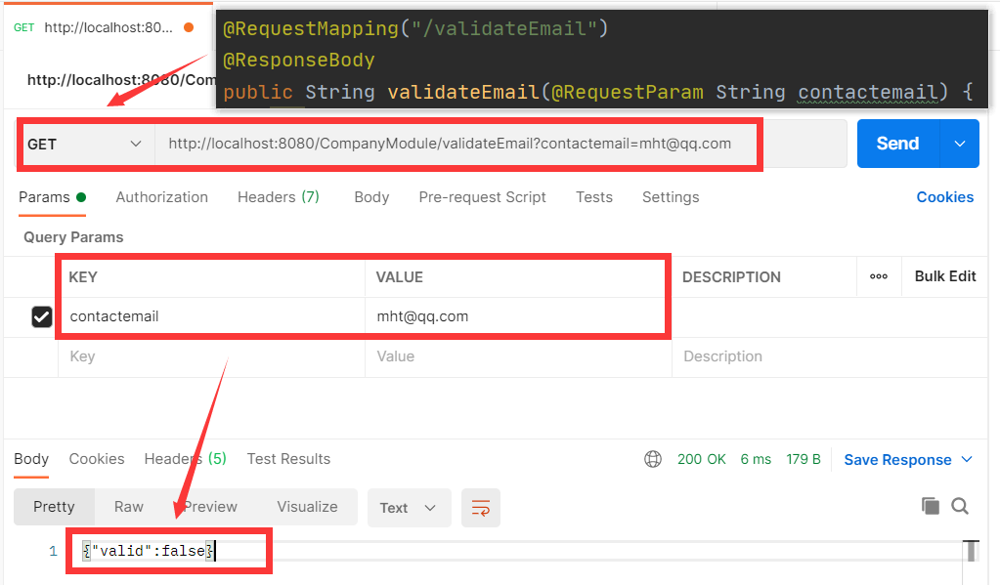

**@RequestMapping("/validateMobileForUpdate")**

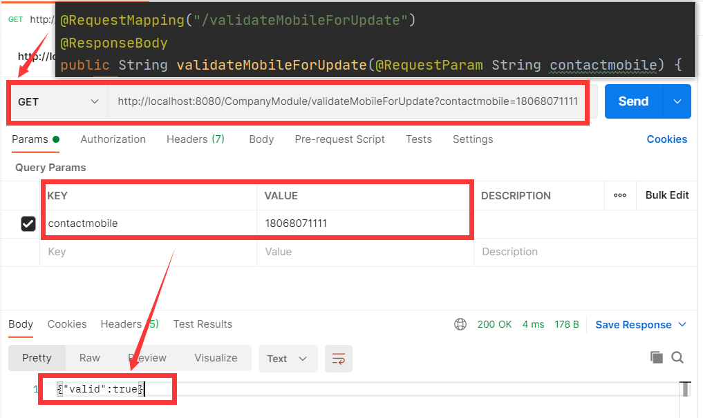

**@RequestMapping("/validateEmailForUpdate")**

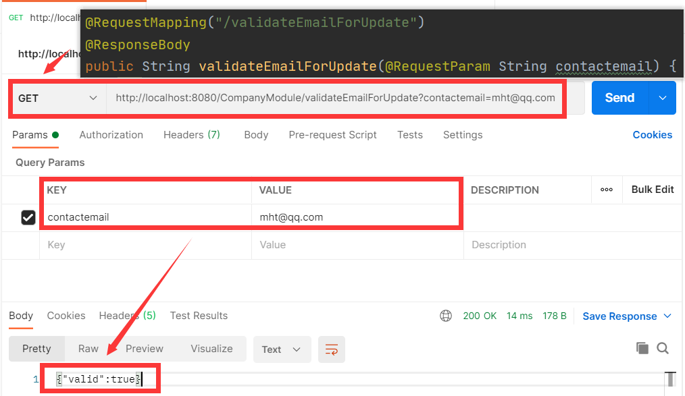

