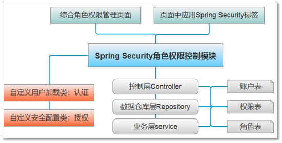
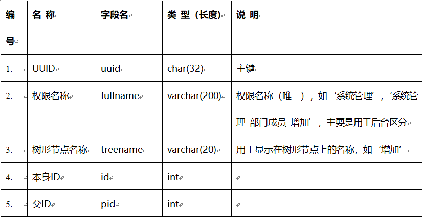
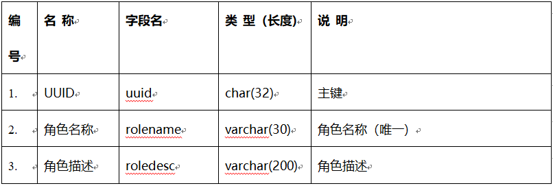
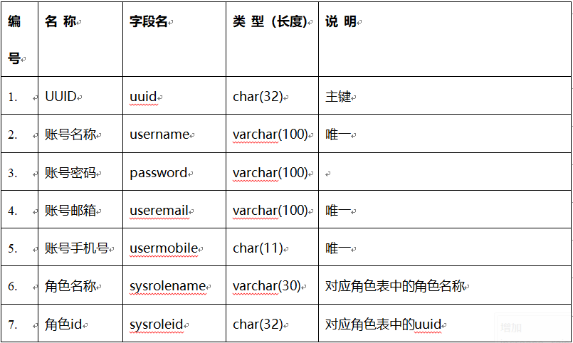
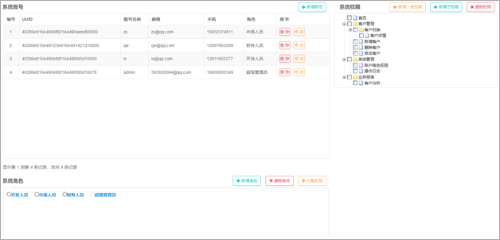

# 0. 编码前的设计工作

## 0.1 整体设计



## 0.2 数据库表

**权限表：sysauth**



**角色表：sysrole**



**账户表：sysuser**



说明：

为了查询数据时的简洁清爽，在账户实体类、角色实体类中增加了映射关系，分别如下：

* 账户实体类中需要与角色配置Hibrenate一对一映射，这样在获取到账户时，就获得了角色，这里为了简洁，一个账户对应一个角色；
* 角色实体类中需要与权限配置一个Hibrenate多对多映射，这样可以方便获取角色对应的全部权限。

## 0.3 页面整体布局及功能

**整体布局**



**功能**

* 账号部分：账号列表展示、添加账号、修改账号、删除账号
* 角色部分：角色单选项形式展示、添加角色、删除角色
* 权限部分：权限树形展示、添加一级权限、添加子权限、删除权限

# 1. 编写实体类domain

Hibernated映射配置属性说明：

* `CascadeType.PERSIST`：级联保存，当A实体中有B实体这个属性，数据库操作，保存A时，如果B不存在，则也会自动保存B；
* `CascadeType.REMOVE`：级联删除，当A实体中有B实体这个属性，数据库操作，删除A时，B也会删除；
* `CascadeType.MERGE`：级联更新，当A实体中有B实体这个属性，数据库操作，更新A时，会相应的更新B中的数据；
* `CascadeType.DETACH`：级联脱管，如果你要删除一个实体，但是它有外键无法删除，你就需要这个级联权限了，它会撤销所有相关的外键关联；
* `CascadeType.REFRESH`：级联刷新，当A实体中有B实体这个属性，数据库操作，更新A时，会先刷新B，再将A和B保存；
* `CascadeType.ALL`：拥有以上所有级联操作权限。

## 1.1 系统权限实体类SysAuth

```java
package com.zqf.mydemo.domain;

import lombok.Data;
import org.hibernate.annotations.GenericGenerator;

import javax.persistence.*;

/**
 * 用户权限实体类
 */
@Data
@Entity
@Table(name = "sysauth")
public class SysAuth {
    @Id
    @GeneratedValue(generator = "myuuid")
    @GenericGenerator(name = "myuuid", strategy = "uuid")
    @Column(length = 32)
    private String uuid;

    @Column(length = 200)
    private String fullname; // 权限名称

    @Column(length = 20)
    private String treename; // 树形节点名称

    @Column
    private int id; // 自身 id

    @Column
    private int pid; // 父节点 id
}

```

## 1.2 系统角色实体类SysRole

```java
package com.zqf.mydemo.domain;

import lombok.Data;
import org.hibernate.annotations.GenericGenerator;

import javax.persistence.*;
import java.util.List;

/**
 * 用户角色实体类
 */
@Data
@Entity
@Table(name = "sysrole")
public class SysRole {
    @Id
    @GeneratedValue(generator = "myuuid")
    @GenericGenerator(name = "myuuid", strategy = "uuid")
    @Column(length = 32)
    private String uuid;

    @Column(length = 30)
    private String rolename; // 角色名称

    @Column(length = 200)
    private String roledesc; // 角色描述

    @ManyToMany(cascade = {CascadeType.REFRESH}, fetch = FetchType.EAGER)
    private List<SysAuth> sysAuths; // 角色对应权限（一对多，会自动生成中间表记录角色和权限的对应关系）

}

```

## 1.3 系统用户实体类SysUser

```java
package com.zqf.mydemo.domain;

import lombok.Data;
import org.hibernate.annotations.GenericGenerator;

import javax.persistence.*;

/**
 * 用户实体类
 */
@Data
@Entity
@Table(name = "sysuser")
public class SysUser {
    @Id
    @GeneratedValue(generator = "myuuid")
    @GenericGenerator(name = "myuuid", strategy = "uuid")
    @Column(length = 32)
    private String uuid;

    @Column(length = 100)
    private String username; // 用户名

    @Column(length = 100)
    private String password; // 登录密码

    @Column(length = 100)
    private String useremail; // 用户邮箱

    @Column(length = 100)
    private String usermobile; // 用户手机

    @Column(length = 30)
    private String sysrolename; // 用户对应角色

    @Column(length = 32)
    private String sysroleid; // 用户对应角色id

    @OneToOne
    @JoinColumn(name = "sysroleid", referencedColumnName = "uuid", insertable = false, updatable = false)
    private SysRole sysRole; // 用户与角色关联列（一对一）
    // referencedColumnName 对应关联的角色表的uuid列
}

```

## 1.4 Ztree

```java
package com.zqf.mydemo.domain;

import lombok.Data;

/**
 * zTree树形节点实体，不对应数据库表
 */
@Data
public class Ztree
{
    public int id;
    public int pId;
    public String name;
    public boolean open;
    public boolean checked;
}
```

# 2. 编写数据仓库层XxxRepo

## 2.1 系统权限数据仓库

```java
package com.zqf.mydemo.repository;

import com.zqf.mydemo.domain.SysAuth;
import org.springframework.data.jpa.repository.JpaRepository;
import org.springframework.data.jpa.repository.Modifying;
import org.springframework.data.jpa.repository.Query;

import java.util.List;

public interface SysAuthRepo extends JpaRepository<SysAuth, String> {

    //根据节点id查找权限信息
    SysAuth findById(int id);

    //根据节点的全称（不是树形节点名称）查询节点名称，主要用于验证对应的节点信息是否存在
    SysAuth findByFullname(String fullname);

    //根据父节点的id，获取其子节点的最大id
    @Query(value = "select max(id) from sysauth where pid=?1",nativeQuery = true)
    int findMaxId(int pid);

    //根据父节点的id，获取其全部的子节点
    @Query(value = "select * from sysauth where pid=?1",nativeQuery = true)
    List<SysAuth> findAllChildByPid(int pid);

    //根据节点的id删除节点及子节点
    @Modifying
    @Query(value = "delete from sysauth where id=?1",nativeQuery = true)
    String deleteByChild(int id);

    //根据name删除指定的节点及子节点
    @Modifying
    @Query(value = "delete from sysauth where fullname LIKE ?1",nativeQuery = true)
    void deleteByName(String name);

    //(用于删除关联表中的记录)根据name查找指定的节点及子节点
    @Query(value = "select * from sysauth where fullname LIKE ?1",nativeQuery = true)
    List<SysAuth> findAllByFullname(String name);

    //根据权限uuid，删除角色权限关联表中角色对应的记录
    @Modifying
    @Query(value = "delete from sysrole_sys_auths where sys_auths_uuid=?1",nativeQuery = true)
    void deleteMaptabByUuid(String uuid);

}

```

## 2.2 系统角色数据仓库

```java
package com.zqf.mydemo.repository;

import com.zqf.mydemo.domain.SysRole;
import org.springframework.data.jpa.repository.JpaRepository;
import org.springframework.data.jpa.repository.Modifying;
import org.springframework.data.jpa.repository.Query;

public interface SysRoleRepo extends JpaRepository<SysRole, String> {

    //根据uuid查找角色信息
    SysRole findByUuid(String uuid);

    //账号唯一性验证(如果已经存在，返回0，否则返回1)
    @Query(value = "select count(*) from sysuser where username=?1",nativeQuery = true)
    int validateUsername(String username);

    //根据uuid，删除角色
    @Modifying
    @Query(value = "delete from sysrole where uuid=?1",nativeQuery = true)
    void deleteByUuid(String uuid);

    //根据角色uuid，删除角色权限关联表中角色对应的记录
    @Modifying
    @Query(value = "delete from sysrole_sys_auths where sys_role_uuid=?1",nativeQuery = true)
    void deleteMaptabByUuid(String uuid);

}

```

## 2.3 系统用户数据仓库

```java
package com.zqf.mydemo.repository;

import com.zqf.mydemo.domain.SysUser;
import org.springframework.data.jpa.repository.JpaRepository;
import org.springframework.data.jpa.repository.JpaSpecificationExecutor;
import org.springframework.data.jpa.repository.Query;

public interface SysUserRepo extends JpaRepository<SysUser, String>, JpaSpecificationExecutor {

    //使用SpringDataJPA方法定义查询,根据用户名/邮件/手机号，查询用户信息
    SysUser findByUsernameOrUseremailOrUsermobile(String username,String email,String mobile);

    //账号唯一性验证(如果已经存在，返回0，否则返回1)
    @Query(value = "select count(*) from sysuser where username=?1",nativeQuery = true)
    int validateUsername(String username);

    //邮箱号唯一性验证(如果已经存在，返回0，否则返回1)
    @Query(value = "select count(*) from sysuser where useremail=?1",nativeQuery = true)
    int validateEmail(String email);

    //手机号唯一性验证(如果已经存在，返回0，否则返回1)
    @Query(value = "select count(*) from sysuser where usermobile=?1",nativeQuery = true)
    int validateMobile(String mobile);

}

```

# 3. 编写业务层接口 XxxService

## 3.1 系统权限业务层接口

```java
package com.zqf.mydemo.service;

import com.zqf.mydemo.domain.SysAuth;
import com.zqf.mydemo.domain.Ztree;

import java.util.List;

/**
 * 系统权限业务层接口
 */
public interface SysAuthService {

    /**
     * //查找全部权限
     *
     * @return List<SysAuth>
     */
    List<SysAuth> findAll();

    /**
     * 查找全部权限（为zTree准备的集合）,并且和角色对应的权限进行比较，以便判断是否展开和勾选，默认传入的roleid为‘nouuid’
     *
     * @return List<Ztree>
     */
    List<Ztree> findALLToZtree(String roleid);

    /**
     * 添加节点的子节点；1）首先根据节点id查询到对应的节点信息；2）再根据该节点信息和新的节点名称进行名称组合，以该组合名称查询对应的节点信息是否存在；3）如果新节点信息不存在，则保存该新节点
     * id是当前选定节点的id，name是需要新增加子节点的名称
     */
    String saveChildAuth(int id, String childname);

    /**
     * 根据id查找对应的权限信息
     */
    SysAuth findById(int id);

    /**
     * 根据节点的全称，查找对应的权限信息
     */
    SysAuth findByFullname(String fullname);

    /**
     * 根据父节点的id，获取其子节点的最大id
     */
    int findMaxId(int pid);

    /**
     * 根据节点的id删除节点及子节点
     */
    String deleteByChild(int id);

    /**
     * 根据name删除指定的节点及子节点
     */
    void deleteByName(String name);

    /**
     * 给选定的角色赋予权限,其中‘authsinfo’是以$分割的节点id字符串
     */
    void editRole(String uuid, String authsinfo);

}

```

## 3.2 系统角色业务层接口

```java
package com.zqf.mydemo.service;

import com.zqf.mydemo.domain.SysRole;

import java.util.List;

/**
 * 系统角色业务层接口
 */
public interface SysRoleService {

    //根据uuid查找角色
    SysRole findByUuid(String uuid);

    //查询全部的权限
    List<SysRole> findALL();

    //保存角色
    void save(SysRole sysRole);

    //根据uuid，删除角色
    void deleteByUuid(String uuid);

    //根据角色uuid，删除角色权限关联表中角色对应的记录
    void deleteMaptabByUuid(String uuid);

}

```

## 3.3 系统用户业务层接口

```java
package com.zqf.mydemo.service;

import com.zqf.mydemo.domain.SysUser;
import org.springframework.data.domain.Page;
import org.springframework.data.domain.Pageable;

import java.util.Map;

/**
 * 系统用户业务层接口
 */
public interface SysUserService {

    //新添加账号
    void save(SysUser sysUser);

    //根据账号/邮箱/手机号三者之一查询账号
    SysUser findByUsernameOrUseremailOrUsermobile(String username, String email, String mobile);

    //带查询条件的分页查询
    Page<SysUser> queryDynamic(Map<String, Object> reqMap, Pageable pageable);

    //账号名称唯一性验证(如果已经存在，返回false，否则返回true)
    boolean validateUsername(String username);

    //邮箱号唯一性验证(如果已经存在，返回false，否则返回true)
    boolean validateEmail(String email);

    //手机号唯一性验证(如果已经存在，返回false，否则返回true)
    boolean validateMobile(String mobile);

}

```

# 4. 编写业务层实现类 XxxServiceImpl

## 4.1 系统权限业务层实现类

```java
package com.zqf.mydemo.service.impl;

import com.alibaba.fastjson.JSON;
import com.alibaba.fastjson.JSONObject;
import com.zqf.mydemo.domain.SysAuth;
import com.zqf.mydemo.domain.SysRole;
import com.zqf.mydemo.domain.Ztree;
import com.zqf.mydemo.repository.SysAuthRepo;
import com.zqf.mydemo.repository.SysRoleRepo;
import com.zqf.mydemo.service.SysAuthService;
import org.springframework.beans.factory.annotation.Autowired;
import org.springframework.stereotype.Service;

import javax.transaction.Transactional;
import java.util.ArrayList;
import java.util.List;

/**
 * 系统权限业务层实现类
 */
@Service("sysAuthService")
public class SysAuthServiceImpl implements SysAuthService {

    @Autowired
    private SysAuthRepo sysAuthRepo;

    @Autowired
    private SysRoleRepo sysRoleRepo;

    @Override
    public List<SysAuth> findAll() {
        return sysAuthRepo.findAll();
    }

    @Override
    public List<Ztree> findALLToZtree(String roleid) {
        List<Ztree> listztree = new ArrayList<Ztree>();

        //根据角色uuid获取角色对应的权限
        SysRole sysRole = sysRoleRepo.findByUuid(roleid);

        //查询全部的权限
        List<SysAuth> sysAuths = findAll();

        //以全部权限为基准进行循环，并和角色对应的权限进行比较，用来设定权限的open和checked属性
        for (SysAuth sa : sysAuths) {
            //遍历角色对应的权限，比较是否在全部权限之中（在其中时，则勾选属性为true）
            boolean blChecked = false;
            if (!roleid.equals("nouuid")) {
                String strRoleAuthName = sa.getFullname();
                for (SysAuth roleAuth : sysRole.getSysAuths()) {
                    if (roleAuth.getFullname().equals(strRoleAuthName)) {
                        blChecked = true;
                        break;
                    }
                }
            }

            Ztree z = new Ztree();
            z.id = sa.getId();
            z.pId = sa.getPid();
            z.name = sa.getTreename();
            z.open = true;
            z.checked = blChecked;
            listztree.add(z);
        }

        return listztree;
    }

    @Override
    public String saveChildAuth(int id, String childname) {
        if (id == 0)//一级权限
        {
            SysAuth sysAuth_Child = sysAuthRepo.findByFullname(childname);
            if (sysAuth_Child != null)//子节点已经存在
            {
                JSONObject result = new JSONObject();
                result.put("msg", "exist");
                return result.toJSONString();
            } else//节点未存在
            {
                SysAuth newAuth = new SysAuth();
                newAuth.setFullname(childname);//一级节点的全称和树型显示名称一致
                newAuth.setPid(id);
                newAuth.setId(findMaxId(id));
                newAuth.setTreename(childname);//一级节点的全称和树型显示名称一致
                sysAuthRepo.save(newAuth);

                JSONObject result = new JSONObject();
                result.put("msg", "ok");
                return result.toJSONString();
            }
        } else//非一级权限
        {
            SysAuth sysAuth_Parent = sysAuthRepo.findById(id);
            String strChildName = sysAuth_Parent.getFullname() + "_" + childname;
            SysAuth sysAuth_Child = sysAuthRepo.findByFullname(strChildName);
            if (sysAuth_Child != null)//子节点已经存在
            {
                JSONObject result = new JSONObject();
                result.put("msg", "exist");
                return result.toJSONString();
            } else//子节点未存在
            {
                SysAuth newAuth = new SysAuth();
                newAuth.setFullname(strChildName);
                newAuth.setPid(id);
                newAuth.setId(findMaxId(id));
                newAuth.setTreename(childname);
                sysAuthRepo.save(newAuth);

                JSONObject result = new JSONObject();
                result.put("msg", "ok");
                return result.toJSONString();
            }
        }

    }

    @Override
    public SysAuth findById(int id) {
        return sysAuthRepo.findById(id);
    }

    @Override
    public SysAuth findByFullname(String fullname) {
        return sysAuthRepo.findByFullname(fullname);
    }

    @Override
    public int findMaxId(int pid) {
        //判断是否有子节点
        List<SysAuth> sysAuths = sysAuthRepo.findAllChildByPid(pid);
        if (sysAuths.size() == 0)//没有子节点
        {
            int intNewId = pid * 10 + 1;
            return intNewId;
        } else//有子节点
        {
            return sysAuthRepo.findMaxId(pid) + 1;
        }
    }

    @Override
    @Transactional
    public String deleteByChild(int id) {
        SysAuth sysAuth = sysAuthRepo.findById(id);
        //先批量删除角色权限中间表对应的记录
        List<SysAuth> list = sysAuthRepo.findAllByFullname(sysAuth.getFullname() + "%");
        for (SysAuth sa : list) {
            sysAuthRepo.deleteMaptabByUuid(sa.getUuid());
        }

        //批量删除本身节点及子节点
        sysAuthRepo.deleteByName(sysAuth.getFullname() + "%");
        return JSON.toJSONString(sysAuth);//这里有返回值，主要是为后面的基于AOP的日志捕捉服务的
    }

    @Override
    @Transactional
    public void deleteByName(String name) {
        sysAuthRepo.deleteByName(name + "%");
    }

    @Override
    public void editRole(String uuid, String authsinfo) {
        /**
         * 处理前端传过来的字符串形式组装的多权限信息，建立角色和权限的映射关系
         */
        //得到角色信息
        SysRole sysRole = sysRoleRepo.findByUuid(uuid);

        //根据勾选的权限节点id，得到对应的权限对象，并给角色中的权限集合属性赋值
        List<SysAuth> list = new ArrayList<SysAuth>();
        String[] arrAuthid = authsinfo.split("\\$");
        for (int i = 0, num = arrAuthid.length; i < num; i++) {
            SysAuth sysAuth = sysAuthRepo.findById(Integer.parseInt(arrAuthid[i]));
            list.add(sysAuth);
        }
        sysRole.setSysAuths(list);

        //保存或者更新角色信息
        sysRoleRepo.save(sysRole);
    }
}

```

## 4.2 系统角色业务层实现类

```java
package com.zqf.mydemo.service.impl;

import com.zqf.mydemo.domain.SysRole;
import com.zqf.mydemo.repository.SysRoleRepo;
import com.zqf.mydemo.service.SysRoleService;
import org.springframework.beans.factory.annotation.Autowired;
import org.springframework.stereotype.Service;

import javax.transaction.Transactional;
import java.util.List;

/**
 * 系统角色业务层实现类
 */
@Service("sysRoleService")
public class SysRoleServiceImpl implements SysRoleService {

    @Autowired
    private SysRoleRepo sysRoleRepo;

    public SysRole findByUuid(String uuid) {
        return sysRoleRepo.findByUuid(uuid);
    }

    @Override
    public List<SysRole> findALL() {
        return sysRoleRepo.findAll();
    }

    @Override
    public void save(SysRole sysRole) {
        sysRoleRepo.save(sysRole);
    }

    @Override
    @Transactional
    public void deleteByUuid(String uuid) {
        sysRoleRepo.deleteByUuid(uuid);
    }

    @Override
    @Transactional
    public void deleteMaptabByUuid(String uuid) {
        sysRoleRepo.deleteMaptabByUuid(uuid);
    }

}

```

## 4.3 系统用户业务层实现类

```java
package com.zqf.mydemo.service.impl;

import com.zqf.mydemo.domain.SysRole;
import com.zqf.mydemo.domain.SysUser;
import com.zqf.mydemo.repository.SysRoleRepo;
import com.zqf.mydemo.repository.SysUserRepo;
import com.zqf.mydemo.service.SysUserService;
import org.springframework.beans.factory.annotation.Autowired;
import org.springframework.data.domain.Page;
import org.springframework.data.domain.Pageable;
import org.springframework.data.jpa.domain.Specification;
import org.springframework.security.crypto.bcrypt.BCryptPasswordEncoder;
import org.springframework.stereotype.Service;

import javax.persistence.criteria.CriteriaBuilder;
import javax.persistence.criteria.CriteriaQuery;
import javax.persistence.criteria.Predicate;
import javax.persistence.criteria.Root;
import java.util.ArrayList;
import java.util.List;
import java.util.Map;

/**
 * 系统用户业务层实现类
 */
@Service("sysUserService")
public class SysUserServiceImpl implements SysUserService {

    @Autowired
    private SysUserRepo sysUserRepo;

    @Autowired
    private SysRoleRepo sysRoleRepo;

    //新添加用户
    @Override
    public void save(SysUser sysUser) {
        //密码进行BCrypt强哈希加密
        BCryptPasswordEncoder passwordEncoder = new BCryptPasswordEncoder();
        String hashPassword = passwordEncoder.encode(sysUser.getPassword());
        sysUser.setPassword(hashPassword);

        //根据账号对应的角色id（sysroleid），得到角色信息
        SysRole sysRole = sysRoleRepo.findByUuid(sysUser.getSysroleid());
        sysUser.setSysrolename(sysRole.getRolename());
        sysUser.setSysRole(sysRole);

        sysUserRepo.save(sysUser);
    }

    @Override
    public SysUser findByUsernameOrUseremailOrUsermobile(String username, String email, String mobile) {
        return sysUserRepo.findByUsernameOrUseremailOrUsermobile(username, email, mobile);
    }

    //带查询条件的分页查询
    @Override
    public Page<SysUser> queryDynamic(Map<String, Object> reqMap, Pageable pageable) {
        Specification querySpecifi = new Specification<SysUser>() {
            @Override
            public Predicate toPredicate(Root<SysUser> root, CriteriaQuery<?> criteriaQuery, CriteriaBuilder criteriaBuilder) {
                List<Predicate> predicates = new ArrayList<>();
                if (!(reqMap.get("username") == null || reqMap.get("username").toString().equals("")))//账号名称，like 模糊查询
                {
                    predicates.add(criteriaBuilder.like(root.get("username"), "%" + reqMap.get("username").toString() + "%"));
                }
                return criteriaBuilder.and(predicates.toArray(new Predicate[predicates.size()]));
            }
        };
        return this.sysUserRepo.findAll(querySpecifi, pageable);
    }

    //查询对应的账号名称是否存在（服务层用于唯一性验证）,如果用户已经存在返回false，否则返回true
    @Override
    public boolean validateUsername(String username) {
        int intCount = sysUserRepo.validateUsername(username);
        if (intCount == 0) {
            return true;
        } else {
            return false;
        }
    }

    //邮箱号唯一性验证(如果已经存在，返回false，否则返回true)
    @Override
    public boolean validateEmail(String email) {
        int intCount = sysUserRepo.validateEmail(email);
        if (intCount == 0) {
            return true;
        } else {
            return false;
        }
    }

    //手机号唯一性验证(如果已经存在，返回false，否则返回true)
    @Override
    public boolean validateMobile(String mobile) {
        int intCount = sysUserRepo.validateMobile(mobile);
        if (intCount == 0) {
            return true;
        } else {
            return false;
        }
    }

}

```

# 5. 编写控制层 XxxCtl

```java
package com.zqf.mydemo.controller;

import com.alibaba.fastjson.JSONObject;
import com.zqf.mydemo.domain.SysRole;
import com.zqf.mydemo.domain.SysUser;
import com.zqf.mydemo.domain.Ztree;
import com.zqf.mydemo.service.SysAuthService;
import com.zqf.mydemo.service.SysRoleService;
import com.zqf.mydemo.service.SysUserService;
import org.springframework.data.domain.Page;
import org.springframework.data.domain.PageRequest;
import org.springframework.data.domain.Sort;
import org.springframework.stereotype.Controller;
import org.springframework.ui.Model;
import org.springframework.web.bind.annotation.*;

import javax.annotation.Resource;
import java.util.ArrayList;
import java.util.List;
import java.util.Map;

@Controller
@RequestMapping("/security")
public class UserRoleAuthCtl {

    @Resource(name = "sysUserService")
    private SysUserService sus;

    @Resource(name = "sysRoleService")
    private SysRoleService srs;

    @Resource(name = "sysAuthService")
    private SysAuthService sas;

    @RequestMapping("/ListUserRoleAuthHTML")
    public String findAllRole(Model model) {
        /**
         * 查询全部的角色，然后跳转到页面，利用了Thymeleaf模板中的迭代器进行页面数据的输出
         */
        List<SysRole> list = srs.findALL();
        model.addAttribute("sysRoles", list);
        return "security/ListUserRoleAuth.html";
    }

    @PostMapping("/listuser")
    @ResponseBody
    // @AOPLog(operatetype="查询",operatedesc="浏览了一下账号列表")
    public String queryDynamic(@RequestBody Map<String, Object> reqMap) {
        /**
         * 系统账号分页查询
         */

        //固定不变的两个分页参数
        int page = 0;
        if (reqMap.get("page").toString() != null) {
            page = Integer.parseInt(reqMap.get("page").toString());
        }
        int size = 3;
        if (reqMap.get("size").toString() != null) {
            size = Integer.parseInt(reqMap.get("size").toString());
        }

        List<Sort.Order> orders = new ArrayList<>();
        orders.add(new Sort.Order(Sort.Direction.DESC, "username"));

        Page<SysUser> pageinfo = sus.queryDynamic(reqMap, PageRequest.of(page, size, Sort.by(orders)));
        List<SysUser> sysUsers = pageinfo.getContent();
        JSONObject result = new JSONObject();
        result.put("rows", sysUsers);
        result.put("total", pageinfo.getTotalElements());
        return result.toJSONString();
    }

    @RequestMapping("/listauth")
    @ResponseBody
    public List<Ztree> findALLToZtree(String roleid) {
        /**
         * 返回全部权限（zTree结构形式的树形节点）
         */
        return sas.findALLToZtree(roleid);
    }

    //保存角色
    @PostMapping("/saveRole")
    @ResponseBody
    // @AOPLog(operatetype="新增",operatedesc="增加了一个角色")
    public String save(SysRole sysRole) {
        srs.save(sysRole);
        return "OK";
    }

    //删除角色
    @PostMapping("/deleteRole")
    @ResponseBody
    // @AOPLog(operatetype="删除角色",operatedesc="删除了一个角色")
    public String deleteRole(String uuid) {
        srs.deleteByUuid(uuid);
        srs.deleteMaptabByUuid(uuid);
        return "OK";
    }

    //保存子节点（需要判断是否有重复，如果没有重复,保存信息,id是当前选定节点的id，name是需要新增加子节点的名称）
    @PostMapping("/saveChildAuth")
    @ResponseBody
    public String saveChildAuth(@RequestParam int id, String name) {
        return sas.saveChildAuth(id, name);
    }

    //根据节点的id删除节点及子节点
    @PostMapping("/deleteByChild")
    @ResponseBody
    public String deleteByChild(@RequestParam int id) {
        sas.deleteByChild(id);
        return "OK";
    }

    //保存角色对应的权限信息,其中‘authinfo’是以$分割的节点id字符串
    @PostMapping("/editRole")
    @ResponseBody
    public String editRole(@RequestParam String uuid, String authinfo) {
        sas.editRole(uuid, authinfo);
        return "OK";
    }

    //查询全部的角色(填充添加用户中的下拉列表)
    @RequestMapping("/findAllRoles")
    @ResponseBody
    public List<SysRole> findAllRoles() {
        List<SysRole> list = srs.findALL();
        return list;
    }

    //用户名唯一性验证(如果已经存在，返回false，否则返回true；返回json数据，格式为{"valid",true})
    @PostMapping("/validateUsername")
    @ResponseBody
    public String validateUsername(@RequestParam String username) {
        boolean blStatus = sus.validateUsername(username);
        JSONObject result = new JSONObject();
        result.put("valid", blStatus);
        return result.toJSONString();
    }

    //邮箱号唯一性验证(如果已经存在，返回false，否则返回true；返回json数据，格式为{"valid",true})
    @PostMapping("/validateEmail")
    @ResponseBody
    public String validateEmail(@RequestParam String useremail) {
        boolean blStatus = sus.validateEmail(useremail);
        JSONObject result = new JSONObject();
        result.put("valid", blStatus);
        return result.toJSONString();
    }

    //手机号唯一性验证(如果已经存在，返回false，否则返回true；返回json数据，格式为{"valid",true})
    @PostMapping("/validateMobile")
    @ResponseBody
    public String validateMobile(@RequestParam String usermobile) {
        boolean blStatus = sus.validateMobile(usermobile);
        JSONObject result = new JSONObject();
        result.put("valid", blStatus);
        return result.toJSONString();
    }

    //返回AddSysUser.html页面
    @RequestMapping("/ridirectAddSysUserHtml")
    public String ridirectAddSysUserHtml() {
        return "security/AddSysUser.html";
    }

    //保存系统账户
    @RequestMapping("/saveSysUser")
    @ResponseBody
    // @AOPLog(operatetype="新增",operatedesc="添加了一个系统账号")
    public String saveSysUser(SysUser sysUser) {
        sus.save(sysUser);
        return "OK";
    }

}

```

# 6. 自定义用户加载类和安全配置类

引入 security 依赖

```xml
        <!--security-->
        <dependency>
            <groupId>org.springframework.boot</groupId>
            <artifactId>spring-boot-starter-security</artifactId>
        </dependency>
```

前面的基础工作都做好后，只需做两项工作，后台类就算全部做完：

* 自定义用户加载类(把我们自己定义账号转化为 Spring Security 体系内的账号)，即实现 UserDetailsService 接口；
* 自定义安全配置类：继承 WebSecurityConfigurerAdapter 类。

## 6.1 自定义用户加载类：MyUserDetailsService.java

自定义用户加载类，用于验证用户，在验证通过的情况下，加载用户所对应的全部权限。

说明如下：

1. 该类重写了用户加载方法，实现用户验证、创建 session，获取用户对应角色所包含的全部全部权限，这里之所以要实现 UserDetailsService 接口，是因为在Spring Security 中我们配置相关参数需要 UserDetailsService 类型的数据。
2. 在获取角色权限时，区分是否为‘超级管理员’，这样做是为了在系统又新增加了新权限项时，作为系统管理员则自动拥有该权限。
3. GrantedAuthority（已授予的权限），注意 GrantedAuthority 接口的默认实现是 SimpleGrantedAuthority，所以在创建对象时是：`GrantedAuthority grantedAuthority=new SimpleGrantedAuthority(sysAuth.getName())`。
4. 用户验证完毕后，返回值是 userdetails.User，查看源码可知这里的 User 有两个构造方法，我们这里采用最常用也是最简洁的一个构造方法：`User(String username, String password, Collection<? extends GrantedAuthority> authorities)`，三个参数：账号名、密码、权限集合。

```java
package com.zqf.mydemo.security;

import com.zqf.mydemo.domain.SysAuth;
import com.zqf.mydemo.domain.SysUser;
import com.zqf.mydemo.service.SysAuthService;
import com.zqf.mydemo.service.SysUserService;
import org.springframework.beans.factory.annotation.Autowired;
import org.springframework.security.core.GrantedAuthority;
import org.springframework.security.core.authority.SimpleGrantedAuthority;
import org.springframework.security.core.userdetails.User;
import org.springframework.security.core.userdetails.UserDetails;
import org.springframework.security.core.userdetails.UserDetailsService;
import org.springframework.security.core.userdetails.UsernameNotFoundException;
import org.springframework.stereotype.Service;

import javax.annotation.Resource;
import javax.servlet.http.HttpSession;
import java.util.ArrayList;
import java.util.List;

/**
 * 自定义用户加载类，用于验证用户，在验证通过的情况下，加载用户所对应的全部权限
 */
@Service
public class MyUserDetailsService implements UserDetailsService {
    @Resource(name = "sysUserService")
    private SysUserService sus;

    @Resource(name = "sysAuthService")
    private SysAuthService sas;

    @Autowired
    private HttpSession session;

    @Override
    public UserDetails loadUserByUsername(String s) throws UsernameNotFoundException {
        /**
         * 把我们自己定义账号转化为Spring Security体系内的账号
         */

        //根据账号名称、邮箱、手机号进行搜索（用的是JPA方式,参数是名称/邮箱/手机号之一），三者有其一，则验证通过
        SysUser sysUser = sus.findByUsernameOrUseremailOrUsermobile(s, s, s);
        if (sysUser == null) {
            throw new UsernameNotFoundException("用户名/密码错误");
        }

        //根据登录的用户，创建session,方便其他应用
        session.setAttribute("userinfo", sysUser);

        //获取该用户对应角色的权限，如果角色是‘超级管理员’，则直接获取全部的权限
        List<SysAuth> sysAuths = new ArrayList<SysAuth>();
        if (sysUser.getSysRole().getRolename().equals("超级管理员")) {
            sysAuths = sas.findAll();
        } else {
            for (SysAuth sysAuth : sysUser.getSysRole().getSysAuths()) {
                sysAuths.add(sysAuth);
            }
        }

        //将权限信息添加到GrantedAuthority对象中，在后面进行权限验证时会使用GrantedAuthority对象
        List<GrantedAuthority> grantedAuthorities = new ArrayList<GrantedAuthority>();
        for (SysAuth sysAuth : sysAuths) {
            if (sysAuth != null && sysAuth.getFullname() != null) {
                GrantedAuthority grantedAuthority = new SimpleGrantedAuthority(sysAuth.getFullname());
                grantedAuthorities.add(grantedAuthority);
            }
        }

        return new User(sysUser.getUsername(), sysUser.getPassword(), grantedAuthorities);
    }
}

```

## 6.2 自定义安全配置类：MyWebSecurityConfigurerAdapter.java

继承了 WebSecurityConfigurerAdapter 之后，再加上几行代码，我们就能实现以下的功能：

* 访问任何 url 之前都进行验证；
* 设置所有人都可以访问的资源，如登录页面，公共页面等；
* 设置登录页面、登陆后默认前往页面、登录失败后页面；
* 某些 url 只能指定的 IP 才能访问；
* 单点登录，强制让之前登录的同一账号下线。

在该类中我们一般通过重写三个方法来自定义我们的安全访问策略，这三个方法是：

* 认证管理器配置方法：`void configure(AuthenticationManagerBuilder auth)用来配置认证管理器AuthenticationManager`。说白了就是所有 UserDetails 相关的它都管，包含 PasswordEncoder 密码机。
* 核心过滤器配置方法：`void configure(WebSecurity web) 用来配置 WebSecurity`。而 WebSecurity 是基于 ServletFilter 用来配置 springSecurityFilterChain，我们一般不会自定义 WebSecurity , 使用较多的使其 ignoring() 方法用来忽略 Spring Security 对静态资源的控制，但由于在下面的“安全过滤器链配置方法”中可以通过authorizeRequests()方法来进行设置，所以实际使用中该方法不需重写。
* 安全过滤器链配置方法：`void configure(HttpSecurity http)` 这个是我们使用最多的，用来配置 HttpSecurity，所有的url控制都由该方法来进行。该配置常用的一些方法如下：


```java
package com.zqf.mydemo.security;

import org.springframework.context.annotation.Bean;
import org.springframework.context.annotation.Configuration;
import org.springframework.security.config.annotation.authentication.builders.AuthenticationManagerBuilder;
import org.springframework.security.config.annotation.method.configuration.EnableGlobalMethodSecurity;
import org.springframework.security.config.annotation.web.builders.HttpSecurity;
import org.springframework.security.config.annotation.web.configuration.WebSecurityConfigurerAdapter;
import org.springframework.security.core.userdetails.UserDetailsService;
import org.springframework.security.crypto.bcrypt.BCryptPasswordEncoder;

/**
 * 自定义安全配置类，访问任何url之前进行验证
 */
@EnableGlobalMethodSecurity(securedEnabled = true, prePostEnabled = true)
@Configuration
public class MyWebSecurityConfigurerAdapter extends WebSecurityConfigurerAdapter {
    @Bean
    UserDetailsService UDS() {
        return new MyUserDetailsService();
    }

    @Override
    protected void configure(AuthenticationManagerBuilder amb) throws Exception {
        /**
         * 配置认证管理器AuthenticationManager
         */
        amb.userDetailsService(UDS()).passwordEncoder(new BCryptPasswordEncoder());
    }

    @Override
    protected void configure(HttpSecurity http) throws Exception {
        /**
         * 配置安全过滤器HttpSecurity
         */
        http.csrf().disable();// 关闭csrf防护
        http
                .authorizeRequests()
                .antMatchers("/jscustom/**", "/jslib/**", "/druid/**").permitAll()     // 允许访问的静态资源，注意这里的根目录是指public/static/templates
                .anyRequest().authenticated()
                .and()
                .headers().frameOptions().disable()//允许iframe嵌套（springSecurty使用X-Frame-Options防止网页被Frame，默认是deny，拒绝iframe嵌套）
                .and()
                .formLogin()
                .loginPage("/login")       // 设置登录页面（这里不是页面，而是登录控制类中相应的路径，下同）
                .successForwardUrl("/index") //登录成功后forward到参数指定的url
                .failureUrl("/login")      //登录失败后就forward到参数指定的url
                .permitAll()
                .and() // 注销成功跳转路径url
                .logout()
                .permitAll();

        http.sessionManagement()//配置session的功能实现单点登录
                .maximumSessions(1)
                .maxSessionsPreventsLogin(false)//强制让之前登录的同一账号被挤出去
                .expiredUrl("/login");//session过期后跳转的url
        http.headers().contentTypeOptions().disable();//设置允许加载静态资源文件,如css
    }

}

```

# 7. 两种方式应用权限控制

通过前面的工作，现在权限已经起作用，但还是仅限于用户登录验证，还没有体现在我们的页面或者后台的权限控制上。

权限控制可以从两方面来进行：

* 基于注解的权限控制，
* 在 Thymeleaf 中使用 Spring Security 的标签。

## 7.1 基于注解的权限控制

Spring Security默认是禁用注解的，要想开启注解， 需要在继承 WebSecurityConfigurerAdapter 的类上加 `@EnableGlobalMethodSecurity` 注解

注解方法主要有以下几种：

* `@PreAuthorize`（使用最多）：在调用前进行权限检查；
* `@PostAuthorize`（较少使用）：调用完后进行权限检查；
* `@PreFilter和@PostFilter`（较少使用），与上相同，不同的是这两者可以对集合类型的参数或返回值进行过滤，就是其对应的不再是权限检查，而是集合过滤。

## 7.2 在Thymeleaf模板中使用Spring Security的标签

第一步：在pom.xml中配置依赖，这样就可以在 html 页面中使用 sec 标签，如下：

```xml
<dependency>
   <groupId>org.thymeleaf.extras</groupId>
   <artifactId>thymeleaf-extras-springsecurity5</artifactId>
</dependency>
```

第二步：在页面中通过 xmlns 属性定义 sec 命名空间，sec 标签加载对应的网页元素上，如果没有该权限，则改网页元素不显示，添加 sec 标签如下：
如：`sec:authorize="hasAuthority('客户管理_客户列表')"`

