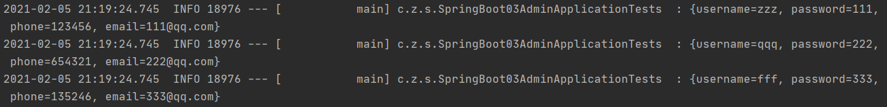
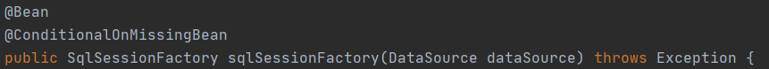
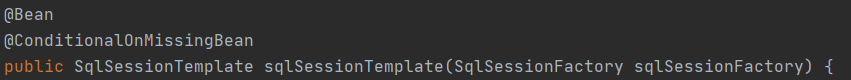
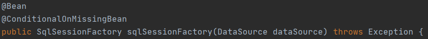
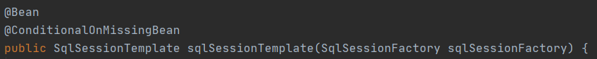

# 1. SQL

## 1.1 数据源的自动配置 -- HikariDataSource

### 1. 导入 JDBC 场景以及 mysql-connector

```xml
        <dependency>
            <groupId>org.springframework.boot</groupId>
            <artifactId>spring-boot-starter-data-jdbc</artifactId>
        </dependency>
        
         <dependency>
            <groupId>mysql</groupId>
            <artifactId>mysql-connector-java</artifactId>
        </dependency>
```

不需要版本号，因为 SpringBoot 自动配置了版本仲裁（`<mysql.version>8.0.22</mysql.version>`）

如果安装的数据库版本与仲裁版本不匹配，可以手动添加版本号（如：`<version>5.1.49</version>`）

### 2. 自动配置的分析

#### 2.1 DataSourceAutoConfiguration：数据源的自动配置

* 配置项：spring.datasource
* 数据库连接池在容器中没有 DataSource 的情况下才自动配置
* 底层配置好的连接池是 HikarDataSource
```java
@Configuration(proxyBeanMethods = false)
@ConditionalOnClass({DataSource.class, EmbeddedDatabaseType.class})
@ConditionalOnMissingBean(type = {"io.r2dbc.spi.ConnectionFactory"})
@EnableConfigurationProperties({DataSourceProperties.class})
@Import({DataSourcePoolMetadataProvidersConfiguration.class, DataSourceInitializationConfiguration.class})
public class DataSourceAutoConfiguration {...}
```

#### 2.2 DataSourceTransactionManagerAutoConfiguration：事务管理器的自动配置

* 配置项：spring.datasource
* 在 JdbcTemplate 和 TransactionManager 存在的情况下才自动配置
```java
@Configuration(proxyBeanMethods = false)
@ConditionalOnClass({JdbcTemplate.class, TransactionManager.class})
@AutoConfigureOrder(2147483647)
@EnableConfigurationProperties({DataSourceProperties.class})
public class DataSourceTransactionManagerAutoConfiguration {...}
```

#### 2.3 JdbcTemplateAutoConfiguration：JDBC Template 的自动配置

* 对数据库进行增删改查（crud）
* 配置项：spring.jdbc
* 在容器中注册了 JdbcTemplate 这个组件， id 为 jdbcTemplate
```java
@Configuration(proxyBeanMethods = false)
@ConditionalOnClass({DataSource.class, JdbcTemplate.class})
@ConditionalOnSingleCandidate(DataSource.class)
@AutoConfigureAfter({DataSourceAutoConfiguration.class})
@EnableConfigurationProperties({JdbcProperties.class})
@Import({JdbcTemplateConfiguration.class, NamedParameterJdbcTemplateConfiguration.class})
public class JdbcTemplateAutoConfiguration {...}
```

#### 2.4 JndiDataSourceAutoConfiguration：Jndi 的自动配置

```java
@Configuration(proxyBeanMethods = false)
@AutoConfigureBefore({XADataSourceAutoConfiguration.class, DataSourceAutoConfiguration.class})
@ConditionalOnClass({DataSource.class, EmbeddedDatabaseType.class})
@ConditionalOnProperty(
    prefix = "spring.datasource",
    name = {"jndi-name"}
)
@EnableConfigurationProperties({DataSourceProperties.class})
public class JndiDataSourceAutoConfiguration {...}
```

#### 2.5 XADataSourceAutoConfiguration：分布式事务相关的自动配置

```java
@Configuration(proxyBeanMethods = false)
@AutoConfigureBefore({DataSourceAutoConfiguration.class})
@EnableConfigurationProperties({DataSourceProperties.class})
@ConditionalOnClass({DataSource.class, TransactionManager.class, EmbeddedDatabaseType.class})
@ConditionalOnBean({XADataSourceWrapper.class})
@ConditionalOnMissingBean({DataSource.class})
public class XADataSourceAutoConfiguration implements BeanClassLoaderAware {...}
```

### 3. 修改配置项

配置数据库连接的属性：

```yml
spring:
  datasource:
    username: root
    password: 961231zqf
    url: jdbc:mysql://localhost:3306/test1?serverTimezone=GMT%2B8
    driver-class-name: com.mysql.jdbc.Driver
```

### 4. 测试以及结果

```java
@SpringBootTest
@Slf4j
class SpringBoot03AdminApplicationTests {
    @Autowired
    JdbcTemplate jdbcTemplate;
    @Test
    void contextLoads() {
        List<Map<String, Object>> list = jdbcTemplate.queryForList("select * from user");
        for (Map<String, Object> map: list) {
            log.info(map.toString());
        }
    }
}
```

查询结果：



## 1.2 Druid 数据源的整合

[druid官方github地址](https://github.com/alibaba/druid)

整合第三方技术的两种方式：自定义(不推荐)、starter(推荐)

### 1. 引入 druid-start

```xml
        <dependency>
            <groupId>com.alibaba</groupId>
            <artifactId>druid-spring-boot-starter</artifactId>
            <version>1.1.17</version>
        </dependency>
```

### 2. 自动配置的分析

#### 2.1 DruidDataSourceAutoConfigure：Druid 数据源的自动配置

* 配置项：spring.datasource 和 spring.datasource.druid
* spring.datasource.druid 中可以开启 stat 和 wall 功能
* 在该配置中还引入了以下几个自动配置：{DruidSpringAopConfiguration.class, DruidStatViewServletConfiguration.class, DruidWebStatFilterConfiguration.class, DruidFilterConfiguration.class}
```java
@Configuration
@ConditionalOnClass({DruidDataSource.class})
@AutoConfigureBefore({DataSourceAutoConfiguration.class})
@EnableConfigurationProperties({DruidStatProperties.class, DataSourceProperties.class})
@Import({DruidSpringAopConfiguration.class, DruidStatViewServletConfiguration.class, DruidWebStatFilterConfiguration.class, DruidFilterConfiguration.class})
public class DruidDataSourceAutoConfigure {...}
```

#### 2.2 DruidSpringAopConfiguration：监控 SpringBean 的自动配置

* 配置项：spring.datasource.druid.aop-patterns
```java
@ConditionalOnProperty({"spring.datasource.druid.aop-patterns"})
public class DruidSpringAopConfiguration {...}
```

#### 2.3 DruidStatViewServletConfiguration：监控页的自动配置

* 配置项：spring.datasource.druid.stat-view-servlet
* 默认开启
```
@ConditionalOnWebApplication
@ConditionalOnProperty(
    name = {"spring.datasource.druid.stat-view-servlet.enabled"},
    havingValue = "true"
)
public class DruidStatViewServletConfiguration {...}
```

#### 2.4 DruidWebStatFilterConfiguration：web 监控的自动配置

* 配置项：spring.datasource.druid.web-stat-filter
* 默认开启
```java
@ConditionalOnWebApplication
@ConditionalOnProperty(
    name = {"spring.datasource.druid.web-stat-filter.enabled"},
    havingValue = "true"
)
public class DruidWebStatFilterConfiguration {
```

#### 2.5 DruidFilterConfiguration：所有 Druid 自己 filter 的配置

```java
    private static final String FILTER_STAT_PREFIX = "spring.datasource.druid.filter.stat";
    private static final String FILTER_CONFIG_PREFIX = "spring.datasource.druid.filter.config";
    private static final String FILTER_ENCODING_PREFIX = "spring.datasource.druid.filter.encoding";
    private static final String FILTER_SLF4J_PREFIX = "spring.datasource.druid.filter.slf4j";
    private static final String FILTER_LOG4J_PREFIX = "spring.datasource.druid.filter.log4j";
    private static final String FILTER_LOG4J2_PREFIX = "spring.datasource.druid.filter.log4j2";
    private static final String FILTER_COMMONS_LOG_PREFIX = "spring.datasource.druid.filter.commons-log";
    private static final String FILTER_WALL_PREFIX = "spring.datasource.druid.filter.wall";
    private static final String FILTER_WALL_CONFIG_PREFIX = "spring.datasource.druid.filter.wall.config";
```

### 3. 配置示例

```yml
spring:
  datasource:
    username: root
    password: 961231zqf
    url: jdbc:mysql://localhost:3306/test1?serverTimezone=GMT%2B8
    driver-class-name: com.mysql.jdbc.Driver

    druid:
      aop-patterns: com.zqf.springboot03admin.*  # 监控Spring Bean
      filters: stat,wall  # 底层开启 stat，wall 功能

      stat-view-servlet:  # 配置监控页的功能
        enabled: true
        login-username: admin
        login-password: admin
        reset-enable: false

      web-stat-filter:  # 监控 web
        enabled: true
        url-pattern: /*
        exclusions: '*.js,*.gif,*.jpg,*.png,*.css,*.ico,/druid/*'

      filter:  # 对上面 filter 里面的 stat，wall 进行详细配置
        stat:
          log-slow-sql: true
          slow-sql-millis: 1000
          enabled: true
        wall:
          enabled: true
          config:
            drop-table-allow: false
```

完成上述配置后，访问 `localhost:8080/druid`，执行登录后可访问 druid 的监控页面

## 1.3 MyBatis 的整合

### 1. 自动配置的分析

[mybatis](https://github.com/mybatis)

引入依赖：

```xml
        <dependency>
            <groupId>org.mybatis.spring.boot</groupId>
            <artifactId>mybatis-spring-boot-starter</artifactId>
            <version>2.1.4</version>
        </dependency>
```

#### MybatisAutoConfiguration：Mybatis 自动配置类

```java
@Configuration
@ConditionalOnClass({SqlSessionFactory.class, SqlSessionFactoryBean.class})
@ConditionalOnSingleCandidate(DataSource.class)
@EnableConfigurationProperties({MybatisProperties.class})
@AutoConfigureAfter({DataSourceAutoConfiguration.class, MybatisLanguageDriverAutoConfiguration.class})
public class MybatisAutoConfiguration implements InitializingBean {...}
```

* 配置项：mybatis
* 自动配置了 SqlSessionFactory



* 自动配置了 SqlSessionTemplate



* 导入了 AutoConfiguredMapperScannerRegistrar；其中规定：只要我们写的操作 Mybatis 的接口标注了 `@Mapper `就会被自动扫描进来

### 2. 配置模式

根据自动配置的分析，可以在 application.xml 文件中对 mybatis 进行配置

```xml
mybatis:  # 配置 mybatis 规则
  mapper-locations: classpath:mapper/*.xml   # 指定 mapper 映射文件的位置
```

在指定 mapper 映射文件的位置编写 xxxMapper.xml

#### 配置模式示例

mapper 层：

```java
@Mapper
public interface UserMapper {
    User getUserByName(String username);
}
```

```xml
<?xml version="1.0" encoding="UTF-8" ?>
<!DOCTYPE mapper
        PUBLIC "-//mybatis.org//DTD Mapper 3.0//EN"
        "http://mybatis.org/dtd/mybatis-3-mapper.dtd">
<mapper namespace="com.zqf.springboot03admin.Mapper.UserMapper">
    <select id="getUserByName" resultType="com.zqf.springboot03admin.Pojo.User">
        select * from user where username=#{username}
    </select>
</mapper>
```

service 层：

```java
public interface UserService {
    User getUserByName(String username);
}
```

```java
@Service
public class UserServiceImpl implements UserService {

    @Autowired
    UserMapper userMapper;

    @Override
    public User getUserByName(String username) {
        return userMapper.getUserByName(username);
    }
}
```

controller 层：

```java
    @Autowired
    UserServiceImpl userServiceImpl;
    @ResponseBody
    @GetMapping("/mybatis_test01")
    public User getUserByName(@RequestParam("username") String username) {
        return userServiceImpl.getUserByName(username);
    }
```

### 3. 注解模式

可以省去编写 mapper 映射文件的步骤，直接在 mapper 接口上添加注解即可

#### 注解模式示例

```java
@Mapper
public interface UserMapper {
   @Select("select * from user where username=#{username}")
    User getUserByName(String username);
}
```

### 4. mybatis 整合总结

* 引入mybatis-starter
* 配置application.yaml中，指定mapper-location位置即可
* 编写Mapper接口并标注`@Mapper`注解
* 简单方法直接注解方式；复杂方法编写mapper.xml进行绑定映射
* `@MapperScan("com.atguigu.admin.mapper")`简化，其他的接口就可以不用标注`@Mapper`注解

## 1.4 Mybatis-Plus 的整合

### 1. Mybatis-Plus 的导入及自动配置的分析

引入依赖：

```xml
        <dependency>
            <groupId>com.baomidou</groupId>
            <artifactId>mybatis-plus-boot-starter</artifactId>
            <version>3.4.1</version>
        </dependency>
```

Mybatis-Plus 中包含 mybatis 以及 jdbc 相关的依赖，所以只需要引入 Mybatis-Plus 即可

Mybatis-Plus 优点：只需要我们的 mapper 继承 BaseMapper，就可以拥有 CRUD 的能力

#### MybatisPlusAutoConfiguration：Mybatis-Plus 自动配置类

```java
@Configuration
@ConditionalOnClass({SqlSessionFactory.class, SqlSessionFactoryBean.class})
@ConditionalOnSingleCandidate(DataSource.class)
@EnableConfigurationProperties({MybatisPlusProperties.class})
@AutoConfigureAfter({DataSourceAutoConfiguration.class, MybatisPlusLanguageDriverAutoConfiguration.class})
public class MybatisPlusAutoConfiguration implements InitializingBean {...}
```

* 配置项：mybatis-plus    
	* 配置文件中自动配置好 `mapperLocations（private String[] mapperLocations = new String[]{"classpath*:/mapper/**/*.xml"}; ）`
    * `@Mapper` 标注的接口会被自动扫描；也可以使用 `@MapperScan` 批量扫描

* 自动配置好 SqlSessionFactory



* 自动配置好 SqlSessionTemplate



### 2. Mybatis-Plus 的使用 (CRUD)

#### 2.1 mapper、service 层的简化

mapper：采用全局扫描，故没加 `@Mapper`

```java
public interface UserMapperPlus extends BaseMapper<User> {
}
```

service：

```java
public interface UserServicePlus extends IService<User> {
}
```

serviceimpl：

```java
@Service
public class UserServiceImplPlus extends ServiceImpl<UserMapperPlus, User> implements UserServicePlus {
}
```

#### 2.2 使用示例

Controller：

```java
@GetMapping("/dynamic_table")
    public String dynamic_table(@RequestParam(value = "page", defaultValue = "1") Integer page, Model model) {
        // 从数据库中查询数据进行展示
        Page<User> users = new Page<>(page, 2); // 构造分页参数
        Page<User> userPage = userServiceImplPlus.page(users, null); // 调用 page 进行分页
        model.addAttribute("users", userPage);
        return "/Tables/dynamic_table";
    }
```

在配置类中开启分页功能：

```java
package com.zqf.springboot03admin.Config;

import com.baomidou.mybatisplus.extension.plugins.MybatisPlusInterceptor;
import com.baomidou.mybatisplus.extension.plugins.inner.PaginationInnerInterceptor;
import org.springframework.context.annotation.Bean;
import org.springframework.context.annotation.Configuration;

@Configuration
public class MybatisConfig {
    @Bean
    public MybatisPlusInterceptor paginationInterceptor() {
        MybatisPlusInterceptor mybatisPlusInterceptor = new MybatisPlusInterceptor();

        //这是分页拦截器
        PaginationInnerInterceptor paginationInnerInterceptor = new PaginationInnerInterceptor();
        paginationInnerInterceptor.setOverflow(true);
        paginationInnerInterceptor.setMaxLimit(500L);
        mybatisPlusInterceptor.addInnerInterceptor(paginationInnerInterceptor);

        return mybatisPlusInterceptor;
    }
}
```

使用 thymleaf 渲染页面：

```html
<div class="adv-table">
    <table class="display table table-bordered table-striped" id="dynamic-table">
        <thead>
            <tr>
                <th>#</th>
                <th>用户名</th>
                <th>密码</th>
                <th>电话</th>
                <th>邮箱</th>
            </tr>
         </thead>
         <tbody>
             <tr class="gradeU" th:each="user, status: ${users.records}">
                  <td th:text="${status.index}"></td>
                  <td th:text="${user.username}"></td>
                  <td th:text="${user.password}"></td>
                  <td th:text="${user.phone}"></td>
                  <td th:text="${user.email}"></td>
              </tr>
          </tbody>
    </table>
    <div class="row-fluid">
        <div class="span6">
            <div class="dataTables_info" id="dynamic-table_info">
                当前第[[${users.current}]]页 总计 [[${users.pages}]]页 共[[${users.total}]]条记录
            </div>
        </div>
        <div class="span6">
            <div class="dataTables_paginate paging_bootstrap pagination">
                <ul>
                    <li th:class="${num == users.current?'active':''}" th:each="num:${#numbers.sequence(1,users.pages)}">
                    <a th:href="@{/dynamic_table(page=${num})}">[[${num}]]</a>
                    </li>
                </ul>
             </div>
         </div>
     </div>
</div>
```

