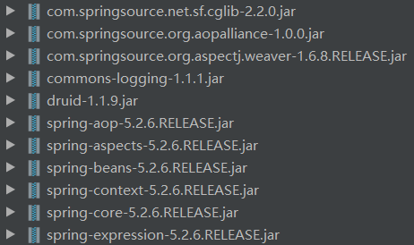

# 1. 基本概念

* AOP是面向切面(方面)编程，利用AOP可以对业务逻辑的各个部分进行隔离，从而使得业务逻辑各部分之间耦合度降低，提高程序的可用性，同时提高了开发的效率。
* 通俗描述：不通过修改源码的方式，在主干功能里添加新功能。

# 2. AOP底层原理

**AOP底层使用动态代理**

* 有接口的情况：使用JDK动态代理    
	* 创建接口实现类代理对象，增强类的方法
* 没有接口的情况：使用CGLIB动态代理    
	* 创建子类的代理对象，增强类的方法

# 3. AOP：JDK动态代理

* 使用JDK动态代理，利用Proxy类里面的方法创建代理对象    
	* 调用newProxyInstance方法
    * newProxyInstance(ClassLoader loader, 类<?>[] interface, InvocationHandler h)：返回指定接口的代理类方法，该接口将方法调用分派给指定的调用处理程序    
		* 第一参数：类加载器
        * 第二参数：增强方法所在的类所实现的接口，支持多个接口
        * 第三参数：实现这个接口InvocationHandler，创建代理对象，书写增强逻辑
* 编写JDK动态代理代码    
	* 创建接口，定义方法
    * 创建接口实现类，实现方法
    * 使用Proxy类创建接口代理对象
	
代码：

```java
// 接口
public interface UserDao {
    int add(int a, int b);
    int sub(int a, int b);
}
```

```java
// 接口实现类(被代理类)，重现方法
public class UserDaoImp1 implements UserDao{
    @Override
    public int add(int a, int b) {
        System.out.printf("a=%d, b=%d\n", a, b);
        return a + b;
    }

    @Override
    public int sub(int a, int b) {
        System.out.printf("a=%d, b=%d\n", a, b);
        return a - b;
    }
}
```

```java
package classDemo.Proxy;

import java.lang.reflect.InvocationHandler;
import java.lang.reflect.Method;
import java.lang.reflect.Proxy;

public class JDKProxy {
    public static void main(String[] args) {
        // 被代理方法所在类的接口，可支持多个接口
        Class[] interfaces = {UserDao.class};
        // 实例化被代理对象，通过构造函数的方法传入代理对象的生成类
        UserDaoImp1 userDaoImp1 = new UserDaoImp1();
        // 创建接口实现类代理对象
        UserDao userDao =
                (UserDao) Proxy.newProxyInstance(JDKProxy.class.getClassLoader(), interfaces, new UserDaoProxy(userDaoImp1));
        // 执行增强后的代码
        int result = userDao.add(1, 2);
        System.out.println(result);
    }
}

class UserDaoProxy implements InvocationHandler {
    // 通过有参构造传递被代理对象
    private Object obj;
    public UserDaoProxy(Object obj) {
        this.obj = obj;
    }
    // 书写增强的逻辑
    @Override
    public Object invoke(Object proxy, Method method, Object[] args) throws Throwable {
        // 执行方法之前
        System.out.println("方法之前执行...");
        // 被增强的方法执行
        if (method.getName().equals("add")) {
            System.out.println("即将执行加法运算...");
        }
        if (method.getName().equals("sub")) {
            System.out.println("即将执行减运算...");
        }
        Object res = method.invoke(obj, args);
        // 执行方法之后
        System.out.println("方法之后执行...");
        return res;
    }
}
```

# 4. AOP：术语

* **连接点**：类里面可以被增强的方法称为连接点
* **切入点**：实际被真正增强的方法称为切入点
* **通知(增强)**：方法中实际增强的逻辑部分称为通知(增强)    
	* 前置通知
    * 后置通知
    * 环绕通知
    * 异常通知
    * 最终通知
* **切面**：把通知应用到切入点的过程
# 5. AOP：准备工作

* Spring框架一般基于AspectJ实现AOP操作    
	* AspectJ不是Spring的组成部分，它独立于AOP框架，一般把AspectJ和Spring框架一起使用，进行AOP操作

* 基于AspectJ实现AOP操作    
	* 基于xml配置文件实现
    * 基于注解方式实现

* 在项目中引入AOP相关依赖



* 切入点表达式    
	* 切入点表达式的作用：知道对哪个类里边的哪个方法进行增强
    * **语法结构：execution([权限修饰符][返回类型][类全路径]\[方法名称]([参数列表]))**    
		* 例1：对com.atguigu.dao.BookDao类中的add进行增强 
        `execution(* com.atguigu.dao.BookDao.add(..))`
        * 例2：对com.atguigu.dao.BookDao类中的所有方法进行增强
        `execution(* com.atguigu.dao.BookDao.*(..))`
        * 例3：对com.atguigu.dao包中的所有类，类中的所有方法进行增强
        `execution(* com.atguigu.dao.*.*(..))`
		
# 6. AOP：AspectJ操作(注解)

* 创建类，在类里面定义方法
* 创建增强类，编写增强逻辑    
	* 在增强类里，创建方法，让不同的方法代表不同的通知类型
* 进行通知的配置    
	* 在spring配置文件中，开启扫描注解
    * 使用注解完成被增强类和增强类的创建
    * 在增强类上添加注解 **@Aspect**
    * 在spring配置文件中开启生成代理对象
* 配置不同类型的通知    
	* **@Before：前置通知**
    * **@AfterReturning：后置通知**
    * **@After：最终通知**
    * **@AfterThrowing：异常通知**
    * **@Around：环绕通知**
	
## 6.1 创建被增强类

```java
@Component
public class User {
    public void show() {
        System.out.println("芜湖大司马~~");
    }
}
```

## 6.2 创建增强类

```java
@Component
@Aspect // 生成代理对象
public class UserProxy {
    public void before() {
        System.out.println("before: 起飞~~");
    }
}
```

## 6.3 进行通知的配置

```xml
<?xml version="1.0" encoding="UTF-8"?>
<beans xmlns="http://www.springframework.org/schema/beans"
       xmlns:xsi="http://www.w3.org/2001/XMLSchema-instance"
       xmlns:context="http://www.springframework.org/schema/context"
       xmlns:aop="http://www.springframework.org/schema/aop"
       xsi:schemaLocation="http://www.springframework.org/schema/beans http://www.springframework.org/schema/beans/spring-beans.xsd
                           http://www.springframework.org/schema/context http://www.springframework.org/schema/context/spring-context.xsd
                           http://www.springframework.org/schema/aop http://www.springframework.org/schema/aop/spring-aop.xsd">
       <context:component-scan base-package="classDemo.aspectj"></context:component-scan>
       <aop:aspectj-autoproxy></aop:aspectj-autoproxy>
</beans>
```

## 6.4 配置不同属性的通知

```java
@Component
@Aspect // 生成代理对象
public class UserProxy {
    // @Before：前置通知
    @Before(value = "execution(* classDemo.aspectj.User.show(..))")
    public void before() {
        System.out.println("before: 起飞~~");
    }

    // @AfterReturning：后置通知
    @AfterReturning(value = "execution(* classDemo.aspectj.User.show(..))")
    public void afterReturning() {
        System.out.println("afterReturning：芜湖~~");
    }

    // @After：最终通知
    @After(value = "execution(* classDemo.aspectj.User.show(..))")
    public void after() {
        System.out.println("after：基地爆炸，问题不大~~");
    }

    // @AfterThrowing：异常通知
    @AfterThrowing(value = "execution(* classDemo.aspectj.User.show(..))")
    public void afterThrowing() {
        System.out.println("异常：歪比歪比，外比巴卜~~");
    }

    // @Around：环绕通知
    @Around(value = "execution(* classDemo.aspectj.User.show(..))")
    public void around(ProceedingJoinPoint proceedingJoinPoint) throws Throwable {
        System.out.println("环绕之前：你以为我在第一层");
        proceedingJoinPoint.proceed();
        System.out.println("环绕之后：其实我在第五层");
    }
}

// 无异常测试结果：
环绕之前：你以为我在第一层
before：起飞~~
芜湖大司马~~
环绕之后：其实我在第五层
after：基地爆炸，问题不大~~
afterReturning：芜湖~~
// 存在异常的测试结果：
环绕之前：你以为我在第一层
before：起飞~~
芜湖大司马~~
after：基地爆炸，问题不大~~
异常：歪比歪比，外比巴卜~~
```

## 6.5 相同切入点的抽取

```java
    // 相同切入点抽取
    @Pointcut(value = "execution(* classDemo.aspectj.User.show(..))")
    public void pointDemo() {
    }

    // @Before：前置通知
    @Before(value = "pointDemo()")
    public void before() {
        System.out.println("before: 起飞~~");
    }
```

## 6.6 多个增强类对同一个方法进行增强：设置增强类优先级

在增强类上使用注解 **@Order(数字)** ，数字的值越小优先级越高

```java
@Component
@Aspect
@Order(1)
public class UserProxy1 {
}
```

## 6.7 完全注解开发

创建配置类，不需要创建xml文件

```java
@Configuration
@ComponentScan(basePackages = {"classDemo.aspectj"})
@EnableAspectJAutoProxy(proxyTargetClass = true)
public class ConfigAop {
}
```

```java
    @Test
    public void testUser2() {
        ApplicationContext context = new AnnotationConfigApplicationContext(ConfigAop.class);
        User user = context.getBean("user", User.class);
        user.show();
    }
```

# 7. AOP：AspectJ(xml配置文件(了解))

* 创建被增强类和增强类
* 在spring配置文件中创建两个类对象
* 在spring配置文件中配置切入点
```java
public class Book {
    public void buy() {
        System.out.println("买买买！");
    }
}
```

```java
public class BookProxy {
    public void price() {
        System.out.println("只要998！买不了吃亏，买不了上当！");
    }
}
```

```java
    <bean id="book" class="classDemo.aspectj.Book"></bean>
    <bean id="bookProxy" class="classDemo.aspectj.BookProxy"></bean>
    <!--配置aop增强-->
    <aop:config>
        <!--切入点-->
        <aop:pointcut id="p" expression="execution(* classDemo.aspectj.Book.buy(..))"/>
        <!--配置切面-->
        <aop:aspect ref="bookProxy">
            <!--增强作用在具体的方法上-->
            <aop:before method="price" pointcut-ref="p"/>
        </aop:aspect>
    </aop:config>
```

```java
    @Test
    public void testBook_aspectj() {
        ApplicationContext context = new ClassPathXmlApplicationContext("bean_aspectj1.xml");
        Book book = context.getBean("book", Book.class);
        book.buy();
 // 测试结果：
只要998！买不了吃亏，买不了上当！
买买买！
```
