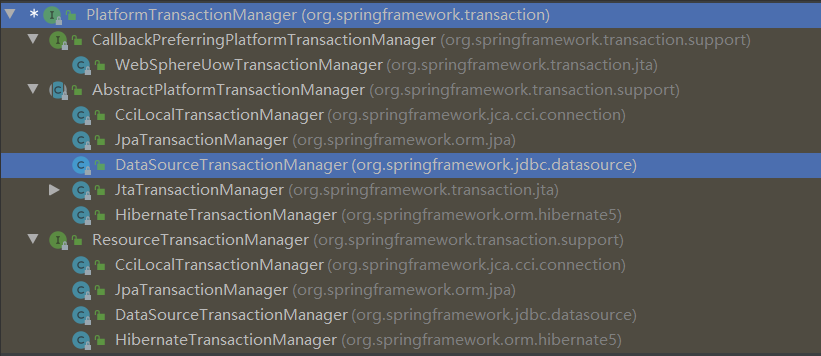
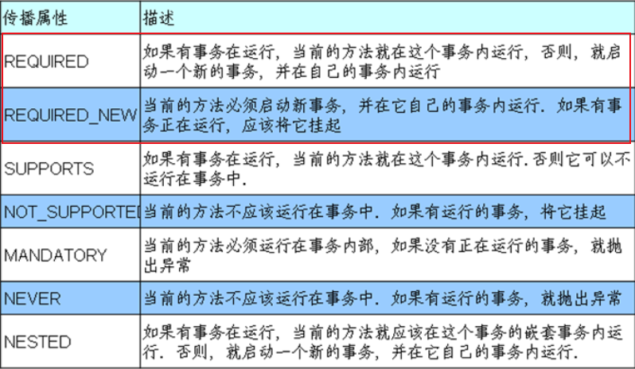

# 1. 基本概念

## 1.1 什么是事务？

事务是数据库操作最基本的单元，逻辑上的一组操作，要么同时成功，要么就全部失败

典型场景：银行转账

## 1.2 事务的四个特性(ACID)

* 原子性：是不可分割的最小单位，要么同时成功，要么同时失败。
* 一致性：事务操作前后，数据总量不变。
* 隔离性：多个事务之间相互独立。
* 持久性：当事务提交或者回滚后，数据库会持久化的保存数据。

# 2. 搭建事务操作环境

* 创建数据库表，添加记录


* 编辑xml配置文件
* 创建service(编辑业务操作)，搭建dao(编辑数据库操作)，完成对象的创建和注入关系
* 在dao创建加钱和减钱的方法，在service创建转账的方法
```xml
<?xml version="1.0" encoding="UTF-8"?>
<beans xmlns="http://www.springframework.org/schema/beans"
       xmlns:xsi="http://www.w3.org/2001/XMLSchema-instance"
       xmlns:context="http://www.springframework.org/schema/context"
       xmlns:aop="http://www.springframework.org/schema/aop"
       xsi:schemaLocation="http://www.springframework.org/schema/beans http://www.springframework.org/schema/beans/spring-beans.xsd
                           http://www.springframework.org/schema/context http://www.springframework.org/schema/context/spring-context.xsd
                           http://www.springframework.org/schema/aop http://www.springframework.org/schema/aop/spring-aop.xsd">
    <!--开启组件扫描-->
    <context:component-scan base-package="classDemo.Shiwu"/>
    <!--配置数据库连接池-->
    <bean id="dataSource" class="com.alibaba.druid.pool.DruidDataSource" destroy-method="close">
        <property name="url" value="jdbc:mysql://localhost:3306/test3?serverTimezone=GMT%2B8"/>
        <property name="username" value="root"/>
        <property name="password" value="961231zqf"/>
        <property name="driverClassName" value="com.mysql.jdbc.Driver"/>
    </bean>
    <!--配置JdbcTemplate对象，注入DataSource-->
    <bean id="jdbcTemplate" class="org.springframework.jdbc.core.JdbcTemplate">
        <!--注入dataSource-->
        <property name="dataSource" ref="dataSource"/>
    </bean>
</beans>
```

```java
public interface AccountDao {
    void addMoney();
    void subMoney();
}
```

```java
@Repository
public class AccountDaoImp implements AccountDao{
    @Autowired
    private JdbcTemplate jdbcTemplate;

    @Override
    public void addMoney() {
        String sql = "update account set money=money+? where id=?";
        jdbcTemplate.update(sql, 500, 2);
    }

    @Override
    public void subMoney() {
        String sql = "update account set money=money-? where id=?";
        jdbcTemplate.update(sql, 500, 1);
    }
}
```

```java
@Service
public class AccountService {
    @Autowired
    private AccountDao accountDao;

    public void account() {
        accountDao.subMoney();
        accountDao.addMoney();
    }
}
```

```java
    @Test
    public void testUser_Shiwu() { // 事务演示
        ApplicationContext context = new ClassPathXmlApplicationContext("bean_Shiwu.xml");
        AccountService accountService = context.getBean("accountService", AccountService.class);
        accountService.account();
    }
```

# 3. Spring事务管理

* **事务添加到JavaEE三层结构里面的Service层(业务逻辑层)**
* 在Spring中进行事务管理有两种操作：    
	* 编程式事务管理
    * **声明式事务管理(常用)**

* 声明事务管理：    
	* **基于注解方式(常用)**
    * 基于xml配置文件方式

* **在Spring中进行声明式事务管理，底层使用AOP原理**
* Spring事务管理API    
	* 提供一个接口，代表事务管理器，这个接口针对不同的框架提供不同的实现类
    * 
## 3.1 注解声明式事务管理

* 在Spring配置文件中配置事务管理器
* 在Spring配置文件中开启事务注解    
	* 引入名称空间tx
    * 开启事务注解

* 在Service类上(或Service类里的方法上)添加事务注解    
	* `@Transactional`：可以添加到类上，也可以添加到方法上
    * 若把该注解添加到类上，该类里面的所有方法都添加事务
    * 若把该注解添加到方法上，只为这个方法添加事务
```xml
    <!--创建事务管理器-->
    <bean id="transactionManager" class="org.springframework.jdbc.datasource.DataSourceTransactionManager">
        <!--注入dataSource-->
        <property name="dataSource" ref="dataSource"/>
    </bean>
    <!--开启事务注解-->
    <tx:annotation-driven transaction-manager="transactionManager"/>
```

```java
@Service
@Transactional
public class AccountService {
    @Autowired
    private AccountDao accountDao;

    public void account() {
        accountDao.subMoney();
        // 模拟异常
        int num = 10/0;
        accountDao.addMoney();
    }
}
```

## 3.2 声明式事务管理：参数配置

### propagation：事务传播行为

* 事务传播行为是指在对个事务方法直接进行调用时，事务是如何进行管理的
* 事务方法：对数据库表的数据进行变化的操作
* Spring框架事务传播行为有7种：重点掌握前两种



### isolation：事务隔离级别

* 事务的隔离性问题：    
	* 脏读：一个未提交事务读取到另一个未提交事务的数据
    * 不可重复读：一个未提交事务读取到另一提交事务修改的数据
    * 虚读：一个未提交事务读取到另一提交事务添加的数据

* 解决：通过设置事务的隔离级别，解决读问题

|  | 脏读 | 不可重复读 | 虚读 |
| --- | --- | --- | --- |
| READ UNCOMMITTED(读未提交) | ✔ | ✔ | ✔ |
| READ COMMITTED(读已提交) | × | ✔ | ✔ |
| REPEATABLE(可重复读) | × | × | ✔ |
| SERIALIZABLE(串行化) | × | × | × |

### timeout：超时时间

* 事务需要在一定时间内进行提交，如果不提交则进行回滚
* 默认值为-1，设置时间以秒为单位计算

### readOnly：是否只读

* 读：查询操作；写：添加修改删除操作
* readOnly默认值为false，表示可以查询，可以进行添加修改删除操作
* 设置为true后，只能查询

### rollbackFor

* 设置出现哪些异常进行事务回滚

### noRollbackFor

* 设置出现哪些异常不进行事务回滚

## 3.3 xml声明式事务管理

* 配置事务管理器
* 配置通知
* 配置切入点和切面
```xml
<?xml version="1.0" encoding="UTF-8"?>
<beans xmlns="http://www.springframework.org/schema/beans"
       xmlns:xsi="http://www.w3.org/2001/XMLSchema-instance"
       xmlns:context="http://www.springframework.org/schema/context"
       xmlns:aop="http://www.springframework.org/schema/aop"
       xmlns:tx="http://www.springframework.org/schema/tx"
       xsi:schemaLocation="http://www.springframework.org/schema/beans http://www.springframework.org/schema/beans/spring-beans.xsd
                           http://www.springframework.org/schema/context http://www.springframework.org/schema/context/spring-context.xsd
                           http://www.springframework.org/schema/aop http://www.springframework.org/schema/aop/spring-aop.xsd
                           http://www.springframework.org/schema/tx http://www.springframework.org/schema/tx/spring-tx.xsd">
    <!--开启组件扫描-->
    <context:component-scan base-package="classDemo.Shiwu"/>
    <!--配置数据库连接池-->
    <bean id="dataSource" class="com.alibaba.druid.pool.DruidDataSource" destroy-method="close">
        <property name="url" value="jdbc:mysql://localhost:3306/test3?serverTimezone=GMT%2B8"/>
        <property name="username" value="root"/>
        <property name="password" value="961231zqf"/>
        <property name="driverClassName" value="com.mysql.jdbc.Driver"/>
    </bean>
    <!--配置JdbcTemplate对象，注入DataSource-->
    <bean id="jdbcTemplate" class="org.springframework.jdbc.core.JdbcTemplate">
        <!--注入dataSource-->
        <property name="dataSource" ref="dataSource"/>
    </bean>
    <!--创建事务管理器-->
    <bean id="transactionManager" class="org.springframework.jdbc.datasource.DataSourceTransactionManager">
        <!--注入dataSource-->
        <property name="dataSource" ref="dataSource"/>
    </bean>
    <!--配置通知-->
    <tx:advice id="txadvice">
        <!--配置事务参数-->
        <tx:attributes>
            <!--指定在哪种规则方法上添加事务-->
            <tx:method name="account" propagation="REQUIRED"/>
        </tx:attributes>
    </tx:advice>
    <!--配置切入点和切面-->
    <aop:config>
        <!--配置切入点-->
        <aop:pointcut id="pt" expression="execution(* classDemo.Shiwu.AccountService.*(..))"/>
        <!--配置切面-->
        <aop:advisor advice-ref="txadvice" pointcut-ref="pt"/>
    </aop:config>
</beans>
```

## 3.4 完全注解声明式事务管理

* 创建配置类，使用配置类替代xml文件
```java
import com.alibaba.druid.pool.DruidDataSource;
import org.springframework.context.annotation.Bean;
import org.springframework.context.annotation.ComponentScan;
import org.springframework.context.annotation.Configuration;
import org.springframework.jdbc.core.JdbcTemplate;
import org.springframework.jdbc.datasource.DataSourceTransactionManager;
import org.springframework.transaction.annotation.EnableTransactionManagement;
import javax.sql.DataSource;

@Configuration // 配置类
@ComponentScan(basePackages = "classDemo.Shiwu") // 组件扫描
@EnableTransactionManagement // 开启事务
public class TxConfig {
    // 创建数据库连接池
    @Bean
    public DruidDataSource getDruidDataSource() {
        DruidDataSource dataSource = new DruidDataSource();
        dataSource.setDriverClassName("com.mysql.jdbc.Driver");
        dataSource.setUrl("jdbc:mysql://localhost:3306/test3?serverTimezone=GMT%2B8");
        dataSource.setUsername("root");
        dataSource.setPassword("961231zqf");
        return dataSource;
    }
    // 创建JdbcTemplate对象
    @Bean
    public JdbcTemplate getJdbcTemplate(DataSource dataSource) {
        JdbcTemplate jdbcTemplate = new JdbcTemplate();
        jdbcTemplate.setDataSource(dataSource);
        return jdbcTemplate;
    }
    // 创建事务管理器
    @Bean
    public DataSourceTransactionManager getDataSourceTransactionManager(DataSource dataSource) {
        DataSourceTransactionManager dataSourceTransactionManager = new DataSourceTransactionManager();
        dataSourceTransactionManager.setDataSource(dataSource);
        return dataSourceTransactionManager;
    }
}

```
