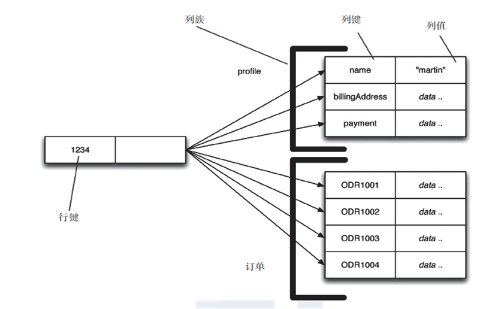
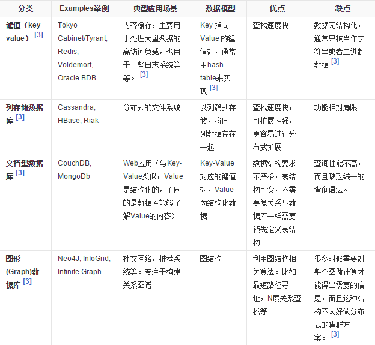
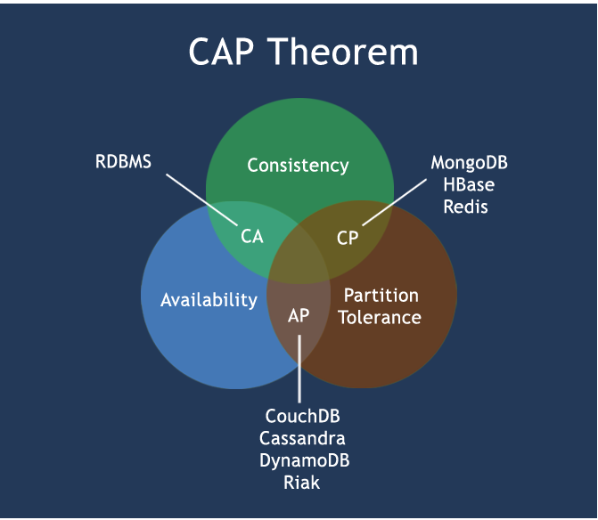
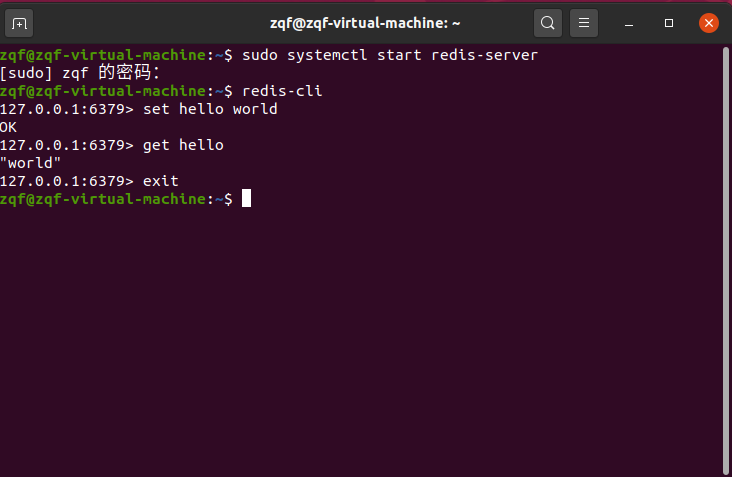

# 1. NoSQL数据模型简介

以一个电商客户、订单、订购、地址模型来对比关系型数据库和非关系型数据库

* 传统关系型数据库：采用ER图（1对1，1对n，n对n）和主外键等
* NOSQL：使用 BSON，一种类json的一种二进制形式的存储格式，简称Binary JSON，它和JSON一样，支持内嵌的文档对象和数组对象

两者对比：为什么要使用聚合模型？

1. 高并发的操作不建议使用关联查询，互联网公司用冗余数据来避免关联查询
2. 分布式事务支持不了太多的并发

## 1.1 聚合模型

1. KV
2. BSON
3. 列族

列族按列存储数据的。其最大的特点是方便存储结构化和半结构化数据，方便做数据压缩，对针对某一列或者某几列的查询有非常大的 IO 优势。



4. 图形


## 1.2 NoSQL数据库的四大分类

1. KV    
	* 新浪：BerkeleyDB + Redis
    * 美团：Redis + tair
    * 阿里、百度：memcache + Redis

2. 文档型数据库（bson格式较多）    
	* CouchDB
    * MongoDB

3. 列存储数据库    
	* Cassandra、HBase
    * 分布式文件系统

4. 图关系数据库    
	* 它不是放图形的、放的是关系，比如：朋友圈社交网络、广告推荐系统
    * 社交网络、推荐系统。专注于构建关系图谱
    * Neo4j、InfoGrid

5. 四者对比



## 1.3 分布式数据库CAP原理

1. 传统关系先行数据库的 ACID 原理

    * A (Atomicity) 原子性
    
    原子性很容易理解，也就是说事务里的所有操作要么全部做完，要么都不做，事务成功的条件是事务里的所有操作都成功，只要有一个操作失败，整个事务就失败，需要回滚。比如银行转账，从A账户转100元至B账户，分为两个步骤：1）从A账户取100元；2）存入100元至B账户。这两步要么一起完成，要么一起不完成，如果只完成第一步，第二步失败，钱会莫名其妙少了100元。
    
	* C (Consistency) 一致性

    一致性也比较容易理解，也就是说数据库要一直处于一致的状态，事务的运行不会改变数据库原本的一致性约束。
  
  * I (Isolation) 独立性

    所谓的独立性是指并发的事务之间不会互相影响，如果一个事务要访问的数据正在被另外一个事务修改，只要另外一个事务未提交，它所访问的数据就不受未提交事务的影响。比如现有有个交易是从A账户转100元至B账户，在这个交易还未完成的情况下，如果此时B查询自己的账户，是看不到新增加的100元的
    
	* D (Durability) 持久性

     持久性是指一旦事务提交后，它所做的修改将会永久的保存在数据库上，即使出现宕机也不会丢失。

2. CAP

    * C：Consistency（强一致性）
    * A：Availability（可用性）
    * P：Partition tolerance（分区容错性）
	
CAP理论就是说在分布式存储系统中，最多只能实现上面的两点。而由于当前的网络硬件肯定会出现延迟丢包等问题，所以**分区容忍性是我们必须需要实现的**。所以我们只能在**一致性和可用性之间进行权衡**，**没有NoSQL系统能同时保证这三点**。

* CA 传统Oracle数据库
* AP 大多数网站架构的选择
* CP Redis、Mongodb

一致性和可用性之间取一个平衡。多余大多数web应用，其实并不需要强一致性。因此牺牲C换取P，这是目前分布式数据库产品的方向。

CAP理论的核心是：一个分布式系统不可能同时很好的满足一致性，可用性和分区容错性这三个需求，**最多只能同时较好的满足两个**。

因此，根据 CAP 原理将 NoSQL 数据库分成了满足 CA 原则、满足 CP 原则和满足 AP 原则三大类：

* CA - 单点集群，满足一致性，可用性的系统，通常在可扩展性上不太强大。
* CP - 满足一致性，分区容忍性的系统，通常性能不是特别高。
* AP - 满足可用性，分区容忍性的系统，通常可能对一致性要求低一些。



## 1.4 BASE

BASE就是为了解决关系数据库强一致性引起的问题而引起的可用性降低而提出的解决方案。

BASE其实是下面三个术语的缩写：

* 基本可用（Basically Available）
* 软状态（Soft state）
* 最终一致（Eventually consistent）

它的思想是通过**让系统放松对某一时刻数据一致性的要求来换取系统整体伸缩性和性能上改观**。为什么这么说呢，缘由就在于大型系统往往由于地域分布和极高性能的要求，不可能采用分布式事务来完成这些指标，要想获得这些指标，我们必须采用另外一种方式来完成，这里BASE就是解决这个问题的办法

## 1.5 分布式+集群简介

分布式系统（distributed system）：

由多台计算机和通信的软件组件通过计算机网络连接（本地网络或广域网）组成。分布式系统是建立在网络之上的软件系统。正是因为软件的特性，所以分布式系统具有高度的内聚性和透明性。因此，网络和分布式系统之间的区别更多的在于高层软件（特别是操作系统），而不是硬件。分布式系统可以应用在在不同的平台上如：PC、工作站、局域网和广域网上等。

简单来讲：

1. 分布式：**不同的多台服务器上面部署不同的服务模块（工程）**，他们之间通过Rpc/Rmi之间通信和调用，对外提供服务和组内协作。
2. 集群：**不同的多台服务器上面部署相同的服务模块**，通过分布式调度软件进行统一的调度，对外提供服务和访问

# 2. Redis 在 Linux 环境下的安装

## 2.1 安装

参考网址：[Ubuntu20.04安装Redis](https://www.cnblogs.com/bubbleboom/p/14185476.html)

**安装 redis**

```
sudo apt install redis-server
```

**安装完成后检查服务的状态**

```
sudo systemctl status redis-server
```

**配置 redis**

安装完成后默认的配置文件在 `/etc/redis/redis.conf`，我们只需要修改该文件实现相应的配置。

```
sudo vim /etc/redis/redis.conf
```

配置完成后，重新启动Redis

```
sudo systemctl restart redis-server
```

**使用 redis-cli 连接**

```
redis-cli
```

**启动 redis 服务**

```
sudo systemctl start redis-server
```

**关闭 redis 服务**

```
sudo systemctl stop redis-server
```

**重启 redis 服务**

```
sudo systemctl restart redis-server
```

## 2.2 Hello World



