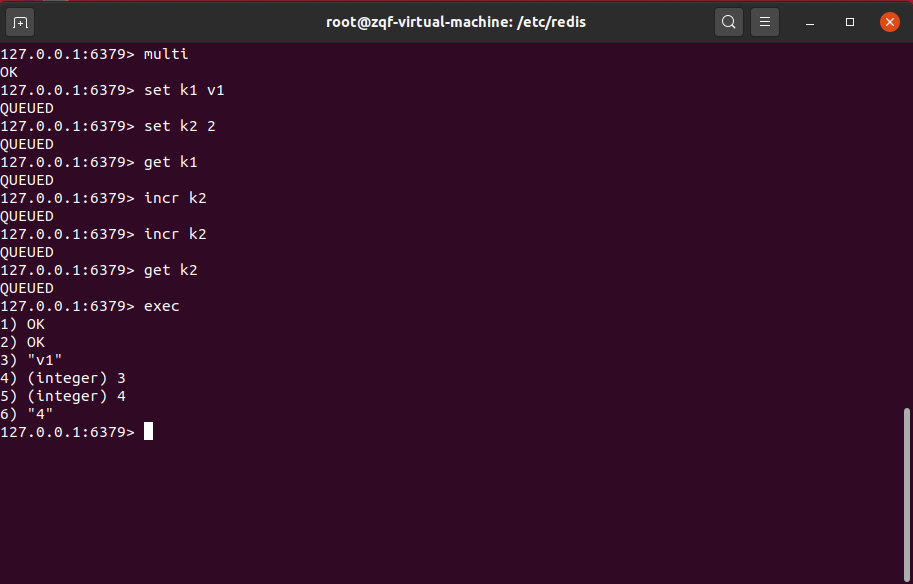
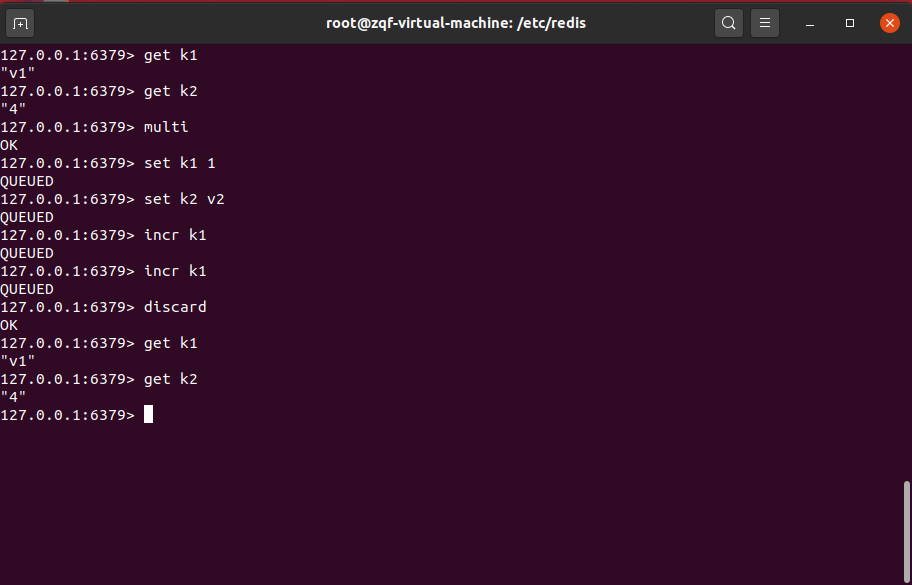
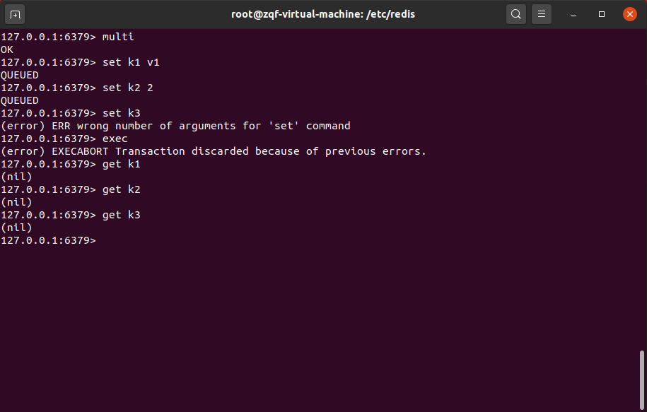
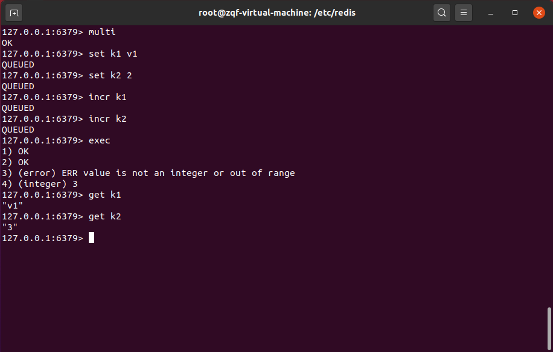
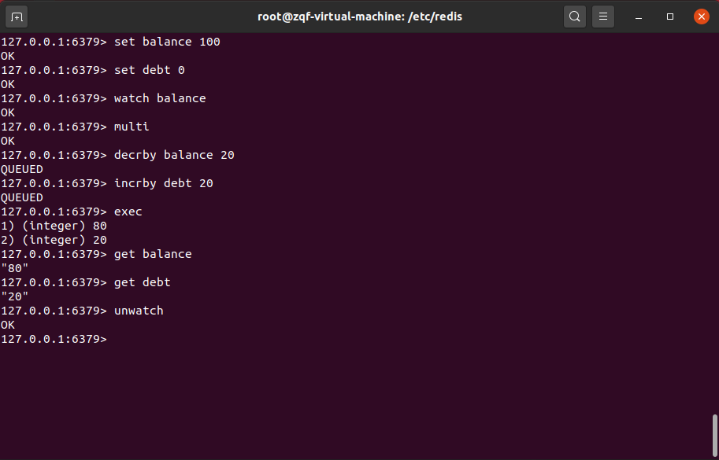
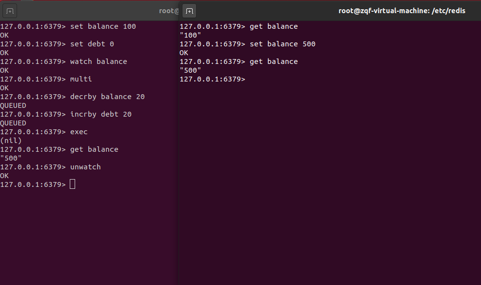

* 事务可以一次执行多个命令，本质是一组命令的集合。一个事务中的所有命令都会序列化，按顺序地串行化执行而不会被其它命令插入，不许加塞。
* 事务再一个队列中，一次性、顺序性、排他性的执行一系列命令。

# 1. 事务常用指令

| 命令 | 描述 |
| --- | --- |
| discard | 取消事务，放弃执行事务块内的所有命令 |
| exec | 执行事务块内的所有命令 |
| multi | 标记一个事务块的开始 |
| unwatch | 取消watch命令对所有key的监视 |
| watch key [key...] | 监视一个或者多个key，如果事务执行之前这些key被其他命令所改动，那么事务将会被打断 |

## 1.1 正常执行

## 1.2 放弃执行

# 2. 基本机制

## 2.1 “全体连坐”

只要在某一事务的队列中有一个错误，则整个事务全体连坐，一条指令都不执行 -- 类似 java 编译时异常

## 2.2 “冤有头债有主”

在某一事务过程中，入队时没有错误的产生，但在顺序执行时产生错误，此时只有当前的错误指令不会被执行，其余在事务队列中的指令顺利执行 -- 类似 java 运行时异常

# 3. watch 监控

## 3.1 悲观锁/乐观锁/CAS(check and set)

* 悲观锁：

顾名思义，悲观思想。认为每次到库中取出数据进行修改的时候都会有人在此期间对该数据进行修改。所以，在每一次取数据的时候，都会对该数据上锁。

传统关系型数据库就用到了很多这种锁机制，比如行锁，表锁，读锁，写锁等，都是在做操作之前先上锁。

* 乐观锁：

顾名思义，乐观思想。认为每次从库中取数据进行修改时都不会有人在此期间对该数据进行修改，所以不会上锁。但是在提交数据的修改的时候，数据库会使用版本号机制判断在此期间别人有没有更新这个数据。

乐观锁适用于多读的应用类型，这样可以提高吞吐量。

乐观锁策略：提交版本必须大于记录当前版本才能执行更新

* CAS：

## 3.2 watch 的使用

正常使用：

监控时数据被修改：如果在监控时数据被修改，则整个事务执行失效

一旦执行了exec之前加的监控锁都会被取消掉了（一次性）

# 4. 小结

## 4.1 事务执行的三阶段

* 开启：以MULTI开始一个事务
* 入队：将多个命令入队到事务中，接到这些命令并不会立即执行，而是放到等待执行的事务队列里面
* 执行：由EXEC命令触发事务

## 4.2 事务执行的三特性

Redis 不遵循传统的 ACID 中的 AI

* **单独的隔离操作**：事务中的所有命令都会序列化、按顺序地执行。事务在执行的过程中，不会被其他客户端发送来的命令请求所打断。
* **没有隔离级别的概念**：队列中的命令没有提交之前都不会实际的被执行，因为事务提交前任何指令都不会被实际执行，也就不存在”事务内的查询要看到事务里的更新，在事务外查询不能看到”这个让人万分头痛的问题
* **不保证原子性**：redis 同一个事务中如果有一条命令执行失败，其后的命令仍然会被执行，没有回滚

