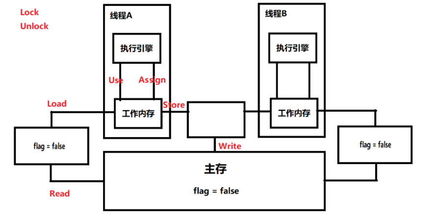

# 1. 线程的 run() 和 start() 有什么区别？
* 每个线程都是通过特定的 Thread 对象所对应的 run() 方法来完成操作的，run() 方法称为线程体；通过调用 Thread 类的 start() 方法来启动一个线程。
* strat() 方法用来启动线程，run() 方法用于执行线程运行时的代码。run() 方法可以重复调用，start() 只能调用一次。
* start() 方法启动一个线程，真正实现了多线程运行。调用 start() 方法无须等待 run 方法体代码执行完毕，可以直接执行其他的代码，此时线程处于就绪状态，并没有运行；
然后通过此 Thread 类的 run() 方法来完成其运行状态；run() 方法运行结束，此线程终止，CPU 继续调度其他线程。
* run() 方法时存在于线程内的，只是线程里的一个函数，若直接调用 run() 则相当于直接调用了一个普通函数，而不是多线程的。直接调用 run() 方法必须等待 run() 方法体执行完毕才能执行下面的代码，故执行路径还是只有一条，不存在线程的特征。
所以在执行多线程时要使用 start() 方法而不是 run()。
  
# 2. 为什么调用 strat() 方法时会执行 run() 方法？为什么不直接调用 run() 方法？
new 一个 Thread，此时线程进入了新建状态。调用其 start() 方法，会启动一个线程并使该线程进入就绪状态，当分配到的时间片后就可以开始运行了。
运行阶段，start() 会执行线程相应的准备工作，然后自动执行 run() 方法的内容，这是真正的多线程工作。

直接执行 run() 方法，会将 run() 方法作为 main 线程下的一个普通方法去执行，并不是开启某一个线程去执行，故并不是多线程工作。

# 3. Sychronized 的原理是什么？
sychronized 又叫做内置锁，因为使用 sychronized 加锁的同步代码块在字节码引擎中执行时，实际上是通过锁对象的 monitor 的取用与释放来实现的。
monitor 内置于任何一个对象，sychronized 利用 monitor 来实现加锁解锁，因此又称为内置锁。

也正因于此，锁对象可以是任意对象：
* sychronized(lock) 加锁时，用到的是 lock 对象内置的 monitor
* 一个对象的 monitor 是唯一的，相当于一个唯一的许可证，获取许可证的线程才可以执行，执行完毕后释放对象的 monitor 后，该 monitor 才能被其他的线程获取

sychronized 加锁的同步块的执行过程：
```java
// 现在假设有代码块：  
    syncrhoized（Object lock）{
        同步代码...;
    }
// 它在字节码文件中被编译为：
    monitorenter; // 获取monitor许可证，进入同步块
    同步代码...
    monitorexit; // 离开同步块后，释放monitor许可证
```


# 4. JVM 对 Java 的原生锁进行了哪些优化？
* 自旋锁：在线程进行阻塞的时候，先让线程自旋等待一段时间，可能在这段时间里其他线程已经解锁，这时就无需再让线程进行阻塞操作了(自选的默认次数是 10)。
* 自适应自旋锁：自旋锁的升级，自旋的次数不在固定，由前一次的自旋次数和锁拥有者的状态决定。
* 锁消除：在动态编译同步代码块的时候，JIT 编译器借助逃逸分析技术来判断锁对象是否只能被一个线程访问，如果是则可以取消锁。
* 锁粗化：当 JIT 编译器发现有一系列的操作都是对同一个对象反复的加锁与解锁，此时会将加锁同步的范围粗化至整个操作系列的外部。

# 5. 为什么 wait()、notify()、notifyAll() 必须在 Object 类中定义？
Java 中，任何对象都可以作为锁，wait() 方法和 notify() 方法用于等待对象的锁或者唤醒线程；在 Java 线程中并没有可供对象使用的锁，故任意对象调用方法一定定义在 Object 类中。

有人说既然是线程放弃对象锁，那可以把 wait() 方法定义在 Thread 类中，新定义的线程继承于 Thread 类，也不需要重新定义 wait() 的实现。但是这种设计存在一个问题：
一个线程可以持有多个锁，而当线程放弃锁的时候就无法判断到底要放弃哪个锁，所以管理起来更加复杂。

# 6. Java 中如何实现多线程之间的同步协作与通信协作？
## 线程的状态以及转化图
* new：新建状态。线程创建完成时为新建状态，即 new Thread(...)，此时还没有调用 start() 方法。
* runnable：就绪状态。当调用线程的 start() 方法后，线程进入就绪状态，等待 CPU 资源。处于就绪状态的线程由 Java 运行时系统的线程调度程序(Thread scheduler)调度。
* running：运行状态。就绪状态的线程获取到 CPU 执行权后进入运行状态，开始执行 run() 方法。
* blocked：阻塞状态。线程没有执行完，但由于某种原因让出 CPU 执行权，自身进入阻塞状态。
* dead：死亡状态。线程执行完成或者执行过程中出现异常，线程进入死亡状态。


## 线程间的同步协作
线程之间的同步可以由下列方法实现： 
* sychronized 同步锁
```java
syncrhoized（Object lock）{
    需要同步的代码...;
}
```
* ReentrantLock 可重入锁
```java
Lock lock = new ReentranLock();

lock.lock();
 　 需要同步的代码；
lock.unlock();
```
* ReadWriteLock 读写锁
```java
ReentranReadWriteLock lock = new ReentranReadWriteLock();

lock.readLock().lock();
 　 需要读锁同步的代码；
lock.readLock().unlock();

lock.writeLock().lock();
 　 需要写锁同步的代码；
lock.writeLock().unlock();
```

## 线程间的通信协作
在线程获得锁而执行的过程中，执行到某一处时需要申请同一把锁的其他线程先执行，此时就需要当前线程让出同步锁以及 CPU (进入阻塞状态)，让其他的线程先获取同步锁以及 CPU 而执行。
等待其他线程执行完毕并释放同步锁之后再通知当前线程唤醒 (就绪态)，继而申请同步锁和 CPU 以继续执行。

在这个过程中线程之间的资源让出、挂起、唤醒等操作就是通过线程的通信来实现的。其主要有下列两种方式：
* sychronized 加锁线程的 `wait() / notify() / notifyAll()`
* ReentrantLock 类加锁线程的 Condition 类的 `await() / signal() / signalAll()`

# 7. Thread 类的 sleep() 和 yield() 方法有什么区别？
* 线程自身可以通过调用 sleep() 方法进入阻塞态，暂时让出 CPU 资源，但是不释放锁。休眠时间过后自动恢复就绪态，等待 CPU 资源调度执行；
* 线程自身可以通过调用 yield() 方法由运行态变为就绪态，这个过程称为让步：即正在运行的线程让出 CPU 资源给其他就绪态的线程先执行，自身则回到就绪态等待 CPU 再次调度执行；
实际过程中 yield() 无法保证实现让步的目的，因为执行让步的线程很有可能被线程调度程序再次选中！
  
# 8. 为什么说 sychronized 是非公平锁？
非公平锁是指多个线程获取锁的顺序并不是按照申请锁的顺序，当锁被释放后，任何一个线程都有机会竞争得到锁，这样做的目的是提高效率，但缺点是可能会产生线程饥饿现象。

线程饥饿是指”线程因无法访问所需资源而无法执行下去的情况“。若采用非公平锁，则优先级低的线程得到执行的机会就会很小，导致线程饥饿；持有锁的线程执行时间过长也可能导致线程饥饿。

解决饥饿的几个方法：
* 保证资源充足
* 公平分配资源
* 避免持有锁的线程长时间执行

# 9. 谈谈 volatile 有什么特点？为什么它可以保证可见性？
volatile 只能作用于变量，其保证操作的可见性和有序性，不保证原子性。

在 Java 内存模型中分为主内存和工作内存。Java 内存模型规定所有的变量存储在主内存中，每个线程都有自己的工作内存。

主内存和工作内存之间的交互可以分为 8 个原子操作：
`lock / unlock / read / load / assign / use / store / write`

volatile 修饰的变量，只有进行 assign 操作，才可以 load；只用 load，才可以 use。这样就保证了在工作内存中操作 volatile 修饰的变量都会同步到主内存中。



# 10. 为什么说 sychronized 是悲观锁？乐观锁的实现原理是什么？什么是 CAS，他有什么特性？
Sychronized 的并发策略是悲观的，无论是否产生竞争，任何数据的操作都必须加锁。

乐观锁的核心是 CAS，CAS 包括内存值、预估值、新值。只有当内存值等于预期值时，才会将内存值修改为新值。

# 11. 乐观锁一定就是好的么？
乐观锁认为对一个对象的操作不会引发冲突，所以每一次操作都不加锁，只是当最后提交更改时验证是否发生冲突。如果冲突则继续尝试，直到成功为止，这个过程称为自旋。

乐观锁没有加锁，但其引入了 ABA 问题，此问题一般采用版本号进行控制；如果产生自旋的次数过多，则不能提升效率，反而降低效率；乐观锁只能保证一个对象的原子性。

# 12. 请对比 Sychronized 和 ReentrantLock 的异同？
两者都是阻塞式的同步，也就是说当一个线程获得了对象锁，进入同步代码块，其他访问该同步代码块的线程都必须阻塞在同步代码块外面等候。

* Sychronized
  * Sychronized 是 Java 的关键字，是在原生语法层面的互斥，需要 JVM 实现。其使用较为便利。
  * Sychronized 会在同步块的前后分别生成 monitorenter 和 monitorexit 两个字节码指令。在执行 monitorenter 指令时，首先尝试获取锁。若锁未被锁定或当前线程已经拥有锁，则将锁的计数器 +1。
    执行相应的 monitorexit 时，计数器 -1。当计数器为 0 时释放锁。若获取锁时失败，则当前线程阻塞，直到对象锁被另一个线程释放。
    
* ReentranLock
  * ReentranLock 是 java.util.concurrent 包下提供的一套互斥锁，需要 lock() 和 unlock() 方法配合 try/finally 代码块来完成。
  * 相比 Synchronized，ReentrantLock 类提供了一些高级功能：
    * 等待可中断。当持有锁的线程长期不释放锁时，正在等待的线程可以选择放弃等待，该功能通过 lock.lockInterruptibly() 实现；
    * 公平锁。多个线程等待同一个锁时，必须按照申请锁的时间顺序获得锁。Sychronized 是非公平锁，ReentranLock 默认也是非公平锁，但可以通过构造函数传参 true 设置为公平锁。但公平锁性能不好。
    * 一个锁可以绑定多个条件。ReentranLock 提供了一个 Condition 类，可以实现分组唤醒需要唤醒的线程。而 Sychronized 只能随即唤醒一个线程或唤醒全部线程。

# 13. Sychronized 和 ReentranLock 是如何实现可重入的？
可重入性：当一个线程持有锁时，其他的线程尝试获取该锁时，会被阻塞；而这个线程尝试获取自己持有的锁时，如果获取成功，则说明该锁是可重入的；反之则不可重入。

Sychronized 实现可重入：synchronized 关键字经过编译后，会在同步块的前后分别形成 monitorenter 和 monitorexit 两个字节码指令。
每个锁对象内部维护一个计数器，该计数器初始值为 0，表示任何线程都可以获取该锁并执行相应的方法。
根据虚拟机规范要求，在执行 monitorenter 指令时，首先要尝试获取对象的锁，如果这个对象没有被锁定，或者当前线程已经拥有了对象的锁，把锁的计数器+1。
相应的在执行 monitorexit 指令后锁计数器 -1，当计数器为0时，锁就被释放。如果获取对象锁失败，那当前线程就要阻塞等待，直到对象锁被另一个线程释放为止。

ReentranLock 实现可重入：ReentrantLock 使用内部类 Sync 来管理锁，所以真正的锁获取是由 Sync 的实现类控制的。
Sync 有两个实现类：NonfairSync（非公平锁）和 FairSync（公平锁）。Sync 通过继承 AQS 实现，在 AQS 中维护了一个`private volatile int state`来计算重入次数，避免频繁的持有释放操作带来的线程问题。

ReentranLock 源码分析：
```java
public class ReentrantLock implements Lock, java.io.Serializable {
    
  private final Sync sync;

  // Sync继承于AQS
  abstract static class Sync extends AbstractQueuedSynchronizer {
    //......
    final boolean nonfairTryAcquire(int acquires) {
      // 当前想要获取锁的线程  
      final Thread current = Thread.currentThread();
      // 当前锁的状态
      int c = getState();
      // state == 0 此时此刻没有线程持有锁
      if (c == 0) {
        // 通过 CAS 尝试获取锁  
        if (compareAndSetState(0, acquires)) {
          // 到这里就是获取到锁了，标记一下，告诉大家，现在是我占用了锁  
          setExclusiveOwnerThread(current);
          return true;
        }
      } else if (current == getExclusiveOwnerThread()) { // 进入该分支说明进行锁的重入
        int nextc = c + acquires;
        if (nextc < 0) // overflow
          throw new Error("Maximum lock count exceeded");
        setState(nextc);
        return true;
      }
      // 进入这里说明锁的获取失败
      return false;
    }
    //......
  }
  
  static final class NonfairSync extends Sync {
    //......
  }
  
  static final class FairSync extends Sync {
    //......
  }
  
  // ReentrantLock默认是非公平锁
  public ReentrantLock() {
    sync = new NonfairSync();
  }
  // 可以通过向构造方法中传true来实现公平锁
  public ReentrantLock(boolean fair) {
    sync = fair ? new FairSync() : new NonfairSync();
  }
  //......
}
```

当一个线程在获取锁过程中，先判断 state 的值是否为0，如果是表示没有线程持有锁，就可以尝试获取锁。当 state 的值不为0时，表示锁已经被一个线程占用了，这时会做一个判断 `current==getExclusiveOwnerThread()`，判断是看当前持有锁的线程是不是自己，如果是自己，那么将 state 的值 +1，表示重入返回即可。

# 14. 什么是锁消除和锁粗化？


