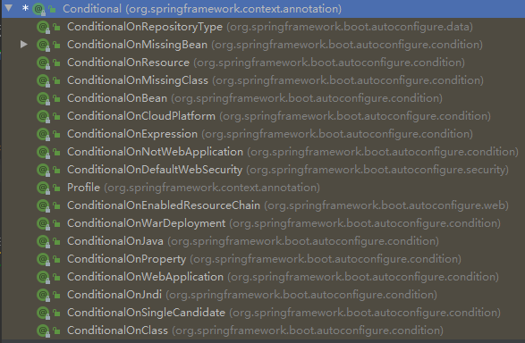

# 1. Springboot 的特点

## 1.1 依赖管理

### 父项目做依赖管理

```xml
依赖管理 
<parent> 
    <groupId>org.springframework.boot</groupId>
    <artifactId>spring-boot-starter-parent</artifactId> 
    <version>2.4.2.RELEASE</version> 
</parent> 

他的父项目 
<parent> 
    <groupId>org.springframework.boot</groupId> 
    <artifactId>spring-boot-dependencies</artifactId> 
    <version>2.4.2.RELEASE</version> 
</parent> 

几乎声明了所有开发中常用的依赖的版本号,自动版本仲裁机制
```

### 开发导入starter场景启动器

1. springboot 提供许多`spring-boot-starter-`表某种场景应用
2. 只要引入 starter ，这个场景的所有常规所需要的依赖都会自动引入
3. springboot 所有支持的场景见[官方文档](https://docs.spring.io/spring-boot/docs/current/reference/html/using-spring-boot.html#using-boot-starter)
4. 项目中的`-spring-boot-starter`为第三方为我们提供的简化开发的场景启动器
5. 所有场景启动器最底层的依赖

```xml
<dependency>  
    <groupId>org.springframework.boot</groupId>  
    <artifactId>spring-boot-starter</artifactId>  
    <version>2.4.2.RELEASE</version>  
    <scope>compile</scope>
</dependency>
```

### 无需关注版本号，版本自动仲裁

1. 引入的依赖默认都可以不写版本号
2. 如果引入非仲裁的 jar ，需要写版本号

### 可以修改默认版本号

1. 查看 spring-boot-dependencies 里面规定的当前依赖的版本所使用的 key
2. 在当前项目的 pom 文件中重写配置，maven 会根据就近原则采用新设置的版本号

```xml
<properties>
    <mysql.version>5.1.43</mysql.version>
</properties>
```

## 1.2 自动配置

### 自动配置好 tomcat

* 引入 tomcat 的依赖
* 配置 toomcat

```java
在 spring-boot-starter-web 中启动了 tomcat 场景
<dependency>
      <groupId>org.springframework.boot</groupId>
      <artifactId>spring-boot-starter-tomcat</artifactId>
      <version>2.4.2</version>
      <scope>compile</scope>
</dependency>
```

### 自动配置好 springMVC

* 引入 springMVC全部组件
* 自动配好 springMVC 的常用组件（功能）

```java
在 spring-boot-starter-web 中引入了 springMVC 
<dependency>
      <groupId>org.springframework</groupId>
      <artifactId>spring-web</artifactId>
      <version>5.3.3</version>
      <scope>compile</scope>
    </dependency>
    <dependency>
      <groupId>org.springframework</groupId>
      <artifactId>spring-webmvc</artifactId>
      <version>5.3.3</version>
      <scope>compile</scope>
    </dependency>
```

### 自动配置好 Web 常见功能

* springboot 帮我们配置好了所有 web 开发的常见场景，如字符编码问题
### 默认的包结构

* 主程序所在的包及其下面的所有子包里面的组件都会被默认扫描
* 不需要 spring 中的包扫描配置
* 如果想要改变扫描路径：使用`@SpringBootApplication(scanBasePackages="com.atguigu"或@ComponentScan` 指定扫描路径
```java
@SpringBootApplication
等同于
@SpringBootConfiguration
@EnableAutoConfiguration
@ComponentScan("com.atguigu.boot")
```

### 各种配置都拥有默认值

* 默认配置最终都会映射到某个类上，如：MultipartProperties
* 配置文件的值最终绑定在每个类上，这个类会在容器中创建对象

### 按需加载所有的自动配置项

* 众多的 starter 中，引入了哪些场景，哪些场景的自动配置才会开启
* springboot 中所有的自动配置功能都在 spring-boot-autoconfigure 包里面

# 2. 容器功能

## 2.1 组件添加

### @Configuration 与 @bean

```java
package com.zqf.springboot01helloworld.config;

import com.zqf.springboot01helloworld.bean.Person;
import com.zqf.springboot01helloworld.bean.Pet;
import org.springframework.context.annotation.Bean;
import org.springframework.context.annotation.Configuration;
/*
1. 在配置类内部使用 @Bean 标注在方法上边给容器注册组件，其默认是单实例的
2. 配置类本身也是容器内的组件
3. @Configuration 可设置的属性 proxyBeanMethods：表示代理 bean 的方法
       Full模式(proxyBeanMethods = true(默认))：每一次调用 @Bean 标注的方法时，首先查询容器内部是否存在该组件，如果存在，就直接调用。该模式会使spring启动变慢，但可以保证单实例。
       Lite模式(proxyBeanMethods = false)：每一次调用 @Bean 标注的方法时，返回的组件都是新创建的。
      当存在组件依赖时，使用Full模式，其他情况使用Lite模式。
**/
@Configuration(proxyBeanMethods = true) // 告诉SpringBoot这是一个配置类 == 配置文件
public class MyConfig {

    @Bean("zqf") // 给容器中添加组件(方法名：组件id  返回类型：组件类型  返回值：组件在容器中的实例)
    public Person person01() {
        return new Person("zqf", 18);
    }

    @Bean("tomcat")
    public Pet pet01() {
        return new Pet("tomcat", 1);
    }
}
```

测试：

```java
package com.zqf.springboot01helloworld;

import org.springframework.boot.SpringApplication;
import org.springframework.boot.autoconfigure.SpringBootApplication;
import org.springframework.context.ConfigurableApplicationContext;

import java.sql.SQLOutput;

@SpringBootApplication
public class SpringBoot01HelloworldApplication {

    public static void main(String[] args) {
        // 1. 返回 IOC 容器
        ConfigurableApplicationContext run = SpringApplication.run(SpringBoot01HelloworldApplication.class, args);
        // 2. 查看容器内的组件
        String[] names = run.getBeanDefinitionNames();
        for (String name: names) {
            System.out.println(name);
        }
        // 3. 查询容器中是否存在相应的组件
        System.out.println("**********************");
        System.out.println(run.getBean("zqf"));
        System.out.println(run.getBean("tomcat"));
    }
}
```

### @Controller、@全家桶.Service、@Repository、@Component

使用方法与 spring 中完全相同

* `@Controller`：用于标注控制层
* `@全家桶.Service`：用于标注服务层，主要用来进行业务的逻辑处理
* `@Repository`：用于标注数据访问层，也可以说用于标注数据访问组件，即DAO组件
* `@Component`：泛指各种组件，就是说当我们的类不属于各种归类的时候（不属于`@Controller、@Services`等的时候），我们就可以使用`@Component`来标注这个类。

### @ComponentScan、@Import

```java
package com.zqf.springboot01helloworld.config;

import com.zqf.springboot01helloworld.bean.Person;
import com.zqf.springboot01helloworld.bean.Pet;
import org.springframework.context.annotation.Bean;
import org.springframework.context.annotation.Configuration;
import org.springframework.context.annotation.Import;
/*
4. @Import({Person.class, Pet.class})：在容器中自动创建出两个类型的组件，组件默认的 id 就是全类名
   IOC注册组件：com.zqf.springboot01helloworld.bean.Person、com.zqf.springboot01helloworld.bean.Pet
 */
@Import({Person.class, Pet.class})
@Configuration(proxyBeanMethods = true) // 告诉SpringBoot这是一个配置类 == 配置文件
public class MyConfig {
}
```

### @Conditional

条件装配：满足 Conditional 指定的条件才进行组件注入



## 2.2 配置绑定

### @ImportResource：原生配置文件的绑定

```xml
<!--beans.xml-->
<?xml version="1.0" encoding="UTF-8"?>
<beans xmlns="http://www.springframework.org/schema/beans"
       xmlns:xsi="http://www.w3.org/2001/XMLSchema-instance"
       xmlns:context="http://www.springframework.org/schema/context"
       xsi:schemaLocation="http://www.springframework.org/schema/beans http://www.springframework.org/schema/beans/spring-beans.xsd http://www.springframework.org/schema/context https://www.springframework.org/schema/context/spring-context.xsd">

    <bean id="szn" class="com.zqf.springboot01helloworld.bean.Person">
        <property name="name" value="szn"></property>
        <property name="age" value="18"></property>
    </bean>

    <bean id="bigson" class="com.zqf.springboot01helloworld.bean.Pet">
        <property name="name" value="dog"></property>
        <property name="age" value="1"></property>
    </bean>
</beans>
```

```java
@ImportResource("classpath:beans.xml") // 使用 @ImportResource 来绑定原生配置文件
public class MyConfig {
}
```

### @Component + @ConfigurationProperties

```java
/*
只有在容器中的组件，才拥有Springboot提供的强大功能
*/
package com.zqf.springboot01helloworld.bean;

import org.springframework.boot.context.properties.ConfigurationProperties;
import org.springframework.stereotype.Component;

@Component
@ConfigurationProperties(prefix = "mycar")
public class Car {
    private String brand;
    private Integer price;

    @Override
    public String toString() {
        return "Car{" +
                "brand='" + brand + '\'' +
                ", price=" + price +
                '}';
    }

    public void setBrand(String brand) {
        this.brand = brand;
    }

    public void setPrice(Integer price) {
        this.price = price;
    }

    public String getBrand() {
        return brand;
    }

    public Integer getPrice() {
        return price;
    }

    public Car() {
    }

    public Car(String brand, Integer price) {
        this.brand = brand;
        this.price = price;
    }
}
```

```yml
mycar.brand = "BYD"
mycar.price = 150000
```

### @EnableConfigurationProperties + @ConfigurationProperties

```java
@EnableConfigurationProperties(Car.class)
// 1. 开启 car 的自动绑定功能
// 2. 把这个 car 组件自动注册到容器中
public class MyConfig {
}
```

```yml
mycar.brand = "YD"
mycar.price = 1000
```

# 3. 自动配置原理入门

## 3.1 引导加载自动配置类

```java
@SpringBootApplication 是一个集合注解，其等价于

@SpringBootConfiguration
@EnableAutoConfiguration
@ComponentScan(
    excludeFilters = {@Filter(
    type = FilterType.CUSTOM,
    classes = {TypeExcludeFilter.class}
), @Filter(
    type = FilterType.CUSTOM,
    classes = {AutoConfigurationExcludeFilter.class}
)}
)
```

### @SpringBootConfiguration

其本身就是一个配置类：`@Configuration`

### @ComponentScan

指定扫描哪些包，详情参考spring注解版视频

### @EnableAutoConfiguration

```java
@AutoConfigurationPackage
@Import({AutoConfigurationImportSelector.class})
public @interface EnableAutoConfiguration {}
```

* `@AutoConfigurationPackage`

自动配置包，指定了默认的包规则
```java
@Import({Registrar.class})
public @interface AutoConfigurationPackage {
// 1. 利用 Registrar 往容器中注入一系列的组件
// 2. 将指定的一个包下的所有组件导入进来，即 MainApplication 所在包下
```

* `@Import({AutoConfigurationImportSelector.class})`
```java
// 1. 利用protected AutoConfigurationImportSelector.AutoConfigurationEntry 
//    getAutoConfigurationEntry(AnnotationMetadata annotationMetadata) {} 往容器中批量注入一些组件
// 2. 利用protected List<String> getCandidateConfigurations(AnnotationMetadata metadata, AnnotationAttributes attributes) {} 获取所有需要导入容器中的配置类
// 3. 利用工厂加载得到所有的组件……2.4.2版本已改名
// 4. 从META-INF/spring.factories位置来加载一个文件。    
//    默认扫描我们当前系统里面所有META-INF/spring.factories位置的文件  
//    spring-boot-autoconfigure-2.4.2.RELEASE.jar包里面也有META-INF/spring.factories
```

```java
文件中写死了 spring-boot 一启动就要给=往容器中注入的所有配置类
# Auto Configure
org.springframework.boot.autoconfigure.EnableAutoConfiguration=\
org.springframework.boot.autoconfigure.admin.SpringApplicationAdminJmxAutoConfiguration,\
org.springframework.boot.autoconfigure.aop.AopAutoConfiguration,\
org.springframework.boot.autoconfigure.amqp.RabbitAutoConfiguration,\
org.springframework.boot.autoconfigure.batch.BatchAutoConfiguration,\
org.springframework.boot.autoconfigure.cache.CacheAutoConfiguration,\
org.springframework.boot.autoconfigure.cassandra.CassandraAutoConfiguration,\
org.springframework.boot.autoconfigure.context.ConfigurationPropertiesAutoConfiguration,\
org.springframework.boot.autoconfigure.context.LifecycleAutoConfiguration,\
org.springframework.boot.autoconfigure.context.MessageSourceAutoConfiguration,\
org.springframework.boot.autoconfigure.context.PropertyPlaceholderAutoConfiguration,\
org.springframework.boot.autoconfigure.couchbase.CouchbaseAutoConfiguration,\
org.springframework.boot.autoconfigure.dao.PersistenceExceptionTranslationAutoConfiguration,\
org.springframework.boot.autoconfigure.data.cassandra.CassandraDataAutoConfiguration,\
org.springframework.boot.autoconfigure.data.cassandra.CassandraReactiveDataAutoConfiguration,\
org.springframework.boot.autoconfigure.data.cassandra.CassandraReactiveRepositoriesAutoConfiguration,\
org.springframework.boot.autoconfigure.data.cassandra.CassandraRepositoriesAutoConfiguration,\
org.springframework.boot.autoconfigure.data.couchbase.CouchbaseDataAutoConfiguration,\
org.springframework.boot.autoconfigure.data.couchbase.CouchbaseReactiveDataAutoConfiguration,\
org.springframework.boot.autoconfigure.data.couchbase.CouchbaseReactiveRepositoriesAutoConfiguration,\
org.springframework.boot.autoconfigure.data.couchbase.CouchbaseRepositoriesAutoConfiguration,\
org.springframework.boot.autoconfigure.data.elasticsearch.ElasticsearchDataAutoConfiguration,\
org.springframework.boot.autoconfigure.data.elasticsearch.ElasticsearchRepositoriesAutoConfiguration,\
org.springframework.boot.autoconfigure.data.elasticsearch.ReactiveElasticsearchRepositoriesAutoConfiguration,\
org.springframework.boot.autoconfigure.data.elasticsearch.ReactiveElasticsearchRestClientAutoConfiguration,\
org.springframework.boot.autoconfigure.data.jdbc.JdbcRepositoriesAutoConfiguration,\
org.springframework.boot.autoconfigure.data.jpa.JpaRepositoriesAutoConfiguration,\
org.springframework.boot.autoconfigure.data.ldap.LdapRepositoriesAutoConfiguration,\
org.springframework.boot.autoconfigure.data.mongo.MongoDataAutoConfiguration,\
org.springframework.boot.autoconfigure.data.mongo.MongoReactiveDataAutoConfiguration,\
org.springframework.boot.autoconfigure.data.mongo.MongoReactiveRepositoriesAutoConfiguration,\
org.springframework.boot.autoconfigure.data.mongo.MongoRepositoriesAutoConfiguration,\
org.springframework.boot.autoconfigure.data.neo4j.Neo4jDataAutoConfiguration,\
org.springframework.boot.autoconfigure.data.neo4j.Neo4jReactiveDataAutoConfiguration,\
org.springframework.boot.autoconfigure.data.neo4j.Neo4jReactiveRepositoriesAutoConfiguration,\
org.springframework.boot.autoconfigure.data.neo4j.Neo4jRepositoriesAutoConfiguration,\
org.springframework.boot.autoconfigure.data.solr.SolrRepositoriesAutoConfiguration,\
org.springframework.boot.autoconfigure.data.r2dbc.R2dbcDataAutoConfiguration,\
org.springframework.boot.autoconfigure.data.r2dbc.R2dbcRepositoriesAutoConfiguration,\
org.springframework.boot.autoconfigure.data.redis.RedisAutoConfiguration,\
org.springframework.boot.autoconfigure.data.redis.RedisReactiveAutoConfiguration,\
org.springframework.boot.autoconfigure.data.redis.RedisRepositoriesAutoConfiguration,\
org.springframework.boot.autoconfigure.data.rest.RepositoryRestMvcAutoConfiguration,\
org.springframework.boot.autoconfigure.data.web.SpringDataWebAutoConfiguration,\
org.springframework.boot.autoconfigure.elasticsearch.ElasticsearchRestClientAutoConfiguration,\
org.springframework.boot.autoconfigure.flyway.FlywayAutoConfiguration,\
org.springframework.boot.autoconfigure.freemarker.FreeMarkerAutoConfiguration,\
org.springframework.boot.autoconfigure.groovy.template.GroovyTemplateAutoConfiguration,\
org.springframework.boot.autoconfigure.gson.GsonAutoConfiguration,\
org.springframework.boot.autoconfigure.h2.H2ConsoleAutoConfiguration,\
org.springframework.boot.autoconfigure.hateoas.HypermediaAutoConfiguration,\
org.springframework.boot.autoconfigure.hazelcast.HazelcastAutoConfiguration,\
org.springframework.boot.autoconfigure.hazelcast.HazelcastJpaDependencyAutoConfiguration,\
org.springframework.boot.autoconfigure.http.HttpMessageConvertersAutoConfiguration,\
org.springframework.boot.autoconfigure.http.codec.CodecsAutoConfiguration,\
org.springframework.boot.autoconfigure.influx.InfluxDbAutoConfiguration,\
org.springframework.boot.autoconfigure.info.ProjectInfoAutoConfiguration,\
org.springframework.boot.autoconfigure.integration.IntegrationAutoConfiguration,\
org.springframework.boot.autoconfigure.jackson.JacksonAutoConfiguration,\
org.springframework.boot.autoconfigure.jdbc.DataSourceAutoConfiguration,\
org.springframework.boot.autoconfigure.jdbc.JdbcTemplateAutoConfiguration,\
org.springframework.boot.autoconfigure.jdbc.JndiDataSourceAutoConfiguration,\
org.springframework.boot.autoconfigure.jdbc.XADataSourceAutoConfiguration,\
org.springframework.boot.autoconfigure.jdbc.DataSourceTransactionManagerAutoConfiguration,\
org.springframework.boot.autoconfigure.jms.JmsAutoConfiguration,\
org.springframework.boot.autoconfigure.jmx.JmxAutoConfiguration,\
org.springframework.boot.autoconfigure.jms.JndiConnectionFactoryAutoConfiguration,\
org.springframework.boot.autoconfigure.jms.activemq.ActiveMQAutoConfiguration,\
org.springframework.boot.autoconfigure.jms.artemis.ArtemisAutoConfiguration,\
org.springframework.boot.autoconfigure.jersey.JerseyAutoConfiguration,\
org.springframework.boot.autoconfigure.jooq.JooqAutoConfiguration,\
org.springframework.boot.autoconfigure.jsonb.JsonbAutoConfiguration,\
org.springframework.boot.autoconfigure.kafka.KafkaAutoConfiguration,\
org.springframework.boot.autoconfigure.availability.ApplicationAvailabilityAutoConfiguration,\
org.springframework.boot.autoconfigure.ldap.embedded.EmbeddedLdapAutoConfiguration,\
org.springframework.boot.autoconfigure.ldap.LdapAutoConfiguration,\
org.springframework.boot.autoconfigure.liquibase.LiquibaseAutoConfiguration,\
org.springframework.boot.autoconfigure.mail.MailSenderAutoConfiguration,\
org.springframework.boot.autoconfigure.mail.MailSenderValidatorAutoConfiguration,\
org.springframework.boot.autoconfigure.mongo.embedded.EmbeddedMongoAutoConfiguration,\
org.springframework.boot.autoconfigure.mongo.MongoAutoConfiguration,\
org.springframework.boot.autoconfigure.mongo.MongoReactiveAutoConfiguration,\
org.springframework.boot.autoconfigure.mustache.MustacheAutoConfiguration,\
org.springframework.boot.autoconfigure.neo4j.Neo4jAutoConfiguration,\
org.springframework.boot.autoconfigure.orm.jpa.HibernateJpaAutoConfiguration,\
org.springframework.boot.autoconfigure.quartz.QuartzAutoConfiguration,\
org.springframework.boot.autoconfigure.r2dbc.R2dbcAutoConfiguration,\
org.springframework.boot.autoconfigure.r2dbc.R2dbcTransactionManagerAutoConfiguration,\
org.springframework.boot.autoconfigure.rsocket.RSocketMessagingAutoConfiguration,\
org.springframework.boot.autoconfigure.rsocket.RSocketRequesterAutoConfiguration,\
org.springframework.boot.autoconfigure.rsocket.RSocketServerAutoConfiguration,\
org.springframework.boot.autoconfigure.rsocket.RSocketStrategiesAutoConfiguration,\
org.springframework.boot.autoconfigure.security.servlet.SecurityAutoConfiguration,\
org.springframework.boot.autoconfigure.security.servlet.UserDetailsServiceAutoConfiguration,\
org.springframework.boot.autoconfigure.security.servlet.SecurityFilterAutoConfiguration,\
org.springframework.boot.autoconfigure.security.reactive.ReactiveSecurityAutoConfiguration,\
org.springframework.boot.autoconfigure.security.reactive.ReactiveUserDetailsServiceAutoConfiguration,\
org.springframework.boot.autoconfigure.security.rsocket.RSocketSecurityAutoConfiguration,\
org.springframework.boot.autoconfigure.security.saml2.Saml2RelyingPartyAutoConfiguration,\
org.springframework.boot.autoconfigure.sendgrid.SendGridAutoConfiguration,\
org.springframework.boot.autoconfigure.session.SessionAutoConfiguration,\
org.springframework.boot.autoconfigure.security.oauth2.client.servlet.OAuth2ClientAutoConfiguration,\
org.springframework.boot.autoconfigure.security.oauth2.client.reactive.ReactiveOAuth2ClientAutoConfiguration,\
org.springframework.boot.autoconfigure.security.oauth2.resource.servlet.OAuth2ResourceServerAutoConfiguration,\
org.springframework.boot.autoconfigure.security.oauth2.resource.reactive.ReactiveOAuth2ResourceServerAutoConfiguration,\
org.springframework.boot.autoconfigure.solr.SolrAutoConfiguration,\
org.springframework.boot.autoconfigure.task.TaskExecutionAutoConfiguration,\
org.springframework.boot.autoconfigure.task.TaskSchedulingAutoConfiguration,\
org.springframework.boot.autoconfigure.thymeleaf.ThymeleafAutoConfiguration,\
org.springframework.boot.autoconfigure.transaction.TransactionAutoConfiguration,\
org.springframework.boot.autoconfigure.transaction.jta.JtaAutoConfiguration,\
org.springframework.boot.autoconfigure.validation.ValidationAutoConfiguration,\
org.springframework.boot.autoconfigure.web.client.RestTemplateAutoConfiguration,\
org.springframework.boot.autoconfigure.web.embedded.EmbeddedWebServerFactoryCustomizerAutoConfiguration,\
org.springframework.boot.autoconfigure.web.reactive.HttpHandlerAutoConfiguration,\
org.springframework.boot.autoconfigure.web.reactive.ReactiveWebServerFactoryAutoConfiguration,\
org.springframework.boot.autoconfigure.web.reactive.WebFluxAutoConfiguration,\
org.springframework.boot.autoconfigure.web.reactive.error.ErrorWebFluxAutoConfiguration,\
org.springframework.boot.autoconfigure.web.reactive.function.client.ClientHttpConnectorAutoConfiguration,\
org.springframework.boot.autoconfigure.web.reactive.function.client.WebClientAutoConfiguration,\
org.springframework.boot.autoconfigure.web.servlet.DispatcherServletAutoConfiguration,\
org.springframework.boot.autoconfigure.web.servlet.ServletWebServerFactoryAutoConfiguration,\
org.springframework.boot.autoconfigure.web.servlet.error.ErrorMvcAutoConfiguration,\
org.springframework.boot.autoconfigure.web.servlet.HttpEncodingAutoConfiguration,\
org.springframework.boot.autoconfigure.web.servlet.MultipartAutoConfiguration,\
org.springframework.boot.autoconfigure.web.servlet.WebMvcAutoConfiguration,\
org.springframework.boot.autoconfigure.websocket.reactive.WebSocketReactiveAutoConfiguration,\
org.springframework.boot.autoconfigure.websocket.servlet.WebSocketServletAutoConfiguration,\
org.springframework.boot.autoconfigure.websocket.servlet.WebSocketMessagingAutoConfiguration,\
org.springframework.boot.autoconfigure.webservices.WebServicesAutoConfiguration,\
org.springframework.boot.autoconfigure.webservices.client.WebServiceTemplateAutoConfiguration
```

## 3.2 按需开启自动配置项

1. 虽然上诉众多的场景启动时的自动配置在 springboot 启动时默认全部加载 `xxxxAutoConfiguration`
2. 但是在装载时会根据条件装配规则(`@Conditional`)，最终会按需分配

## 3.3 修改默认配置

总结：

1. SpringBoot先加载所有的自动配置类
2. `xxxxxAutoConfiguration`每个自动配置类按照条件进行生效，默认都会绑定配置文件指定的值。xxxxProperties里面拿。xxxProperties和配置文件进行了绑定
3. 生效的配置类就会给容器中装配很多组件
4. 只要容器中有这些组件，相当于这些功能就有了
5. 定制化配置    
	* 用户直接自己`@Bean`替换底层的组件
    * 用户去看这个组件是获取的配置文件什么值就去修改。
	
**xxxxxAutoConfiguration ---> 组件  ---> xxxxProperties里面拿值  ----> application.properties**

## 3.4 建立一个Spring-Boot项目的步骤

### 引入场景依赖

[用户手册](https://docs.spring.io/spring-boot/docs/current/reference/html/using-spring-boot.html#using-boot-starter)

### 查看自动配置了哪些

1. 自己分析引入的场景对应的自动配置(一般都生效)
2. 在配置文件中利用 debug=true 语句开启自动配置报告(Negative：不生效 Positive：生效)

### 按照需求决定是否需要修改

1. 参照[文档](https://docs.spring.io/spring-boot/docs/current/reference/html/appendix-application-properties.html#common-application-properties)进行修改
2. 自己分析xxxxProperties绑定了配置文件的哪些
3. 自定义加入或者替换组件（`@Bean、@Component。。。`）
4. 自定义器  XXXXXCustomizer

# 4. 开发小技巧

## 4.1 Lombok

引入依赖

```xml
<dependency>
    <groupId>org.projectlombok</groupId>
    <artifactId>lombok</artifactId>
</dependency>
```

简化 javabean 开发

```java
package com.zqf.springboot01helloworld.bean;

import lombok.*;

@Data
@ToString
@AllArgsConstructor
@NoArgsConstructor
@EqualsAndHashCode
public class Person {
    private String name;
    private Integer age;
}
```

简化日志开发

```java
package com.zqf.springboot01helloworld.controller;

import lombok.extern.slf4j.Slf4j;
import org.springframework.web.bind.annotation.RequestMapping;
import org.springframework.web.bind.annotation.RestController;

@Slf4j
@RestController
public class HelloController {

    @RequestMapping("/hello")
    public String hello(){
        log.info("hello请求进入...");
        return "hello spring-boot 2 !";
    }
}
```

## 4.2 dev-tools

引入依赖

```xml
<dependency>
    <groupId>org.springframework.boot</groupId>
    <artifactId>spring-boot-devtools</artifactId>
    <optional>true</optional>
</dependency>
<!--项目或者页面修改以后：Ctrl+F9；-->
```

## 4.3 Spring Initailizr（项目初始化向导）
