# 1. SpringMVC自动配置概览

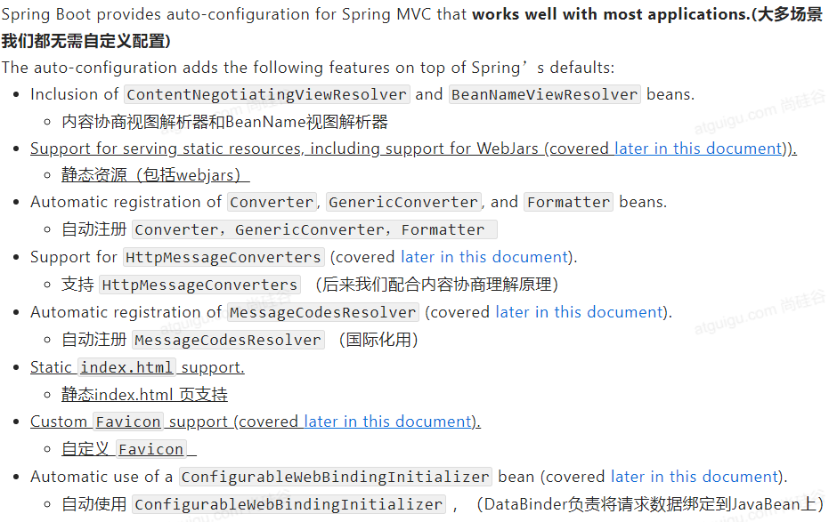

# 2. 简单功能分析

## 2.1 静态资源访问

### 1. 静态资源目录

只要将静态资源放在类路径下：called/static（或/public, /resources, / META-INF/resource）

访问：当前项目根路径(localhost:8080/) + 静态资源名即可访问

原理：静态映射 /**

1. 当一个请求进来，首先去查找 Controller 看能否进行处理。
2. 如果不能处理，就将所有请求交给静态资源处理器。
3. 如果静态资源处理器也找不到响应，则返回404页面
修改默认的静态资源路径（applications.yml）

```yml
# 修改默认静态资源路径
spring:
  web:
    resources:
      static-locations: [classpath:/META-INF/resources/]
```

### 2. 静态资源访问前缀

默认无前缀

```yml
  # 修改静态资源访问前缀
spring:
  mvc:
    static-path-pattern: /res/**
```

修改后访问静态资源的路径为：当前项目根路径(localhost:8080/) + static-path-pattern + 静态资源名

### 3. webjar

项目会自动映射 /webjars/**

当我们的项目引入了 jquery 等资源时，访问地址：http://localhost:8080/webjars/jquery/3.5.1/jquery.js 即可访问对应的静态资源（后面地址要按照依赖里面的包路径）

## 2.2 欢迎页支持

在静态资源目录下，配置 index.html 即可

注意：

* 可以配置静态资源路径
* 不可以配置静态资源访问前缀，配置访问前缀会导致欢迎页功能失效(原因看后面的源码分析)

## 2.3 自定义 Favicon

将 favicon.ico 文件放在静态资源目录下即可

注意：配置静态资源访问前缀同样会导致 Favicon 功能失效

## 2.4 静态资源配置原理

* SpringBoot启动默认加载 xxxAutoConfiguration(自动配置类)
* SpringMVC功能的自动配置类 WebMvcAutoConfiguration 生效

```java
@Configuration(proxyBeanMethods = false)
@ConditionalOnWebApplication(type = Type.SERVLET)
@ConditionalOnClass({Servlet.class, DispatcherServlet.class, WebMvcConfigurer.class})
@ConditionalOnMissingBean({WebMvcConfigurationSupport.class})
@AutoConfigureOrder(-2147483638)
@AutoConfigureAfter({DispatcherServletAutoConfiguration.class, TaskExecutionAutoConfiguration.class, ValidationAutoConfiguration.class})
public class WebMvcAutoConfiguration {}
```

上述自动配置类在容器中配了什么？

```java
@Configuration(proxyBeanMethods = false    )
@Import({WebMvcAutoConfiguration.EnableWebMvcConfiguration.class})
@EnableConfigurationProperties({WebMvcProperties.class, ResourceProperties.class, WebProperties.class})
@Order(0)
public static class WebMvcAutoConfigurationAdapter implements WebMvcConfigurer {}
```

### 1. 配置文件的相关属性和xxx配置文件进行了绑定

```java
// WebMvcProperties == spring.mvc
@ConfigurationProperties(prefix = "spring.mvc")
public class WebMvcProperties {}

// ResourceProperties == spring.resources
@ConfigurationProperties(prefix = "spring.resources", ignoreUnknownFields = false)
public class ResourceProperties extends Resources {}

// WebProperties == spring.web
@ConfigurationProperties("spring.web")
public class WebProperties {}
```

### 2. 配置类只有一个有参构造器

```java
// WebProperties webProperties：获取和 spring.web 绑定的所有值的对象
// WebMvcProperties mvcProperties：获取和 spring.mvc 绑定的所有值的对象
// ListableBeanFactory beanFactory：Spring 的 beanFctory
// ObjectProvider<HttpMessageConverters> messageConvertersProvider：找到所有的 HttpMessageConverters
// ObjectProvider<WebMvcAutoConfiguration.ResourceHandlerRegistrationCustomizer> resourceHandlerRegistrationCustomizerProvider：找到资源处理器的自定义器
// ObjectProvider<DispatcherServletPath> dispatcherServletPath
// ObjectProvider<ServletRegistrationBean<?>> servletRegistrations：给应用注册 Servlet ，Filter ...
public WebMvcAutoConfigurationAdapter(WebProperties webProperties, WebMvcProperties mvcProperties, ListableBeanFactory beanFactory, ObjectProvider<HttpMessageConverters> messageConvertersProvider, ObjectProvider<WebMvcAutoConfiguration.ResourceHandlerRegistrationCustomizer> resourceHandlerRegistrationCustomizerProvider, ObjectProvider<DispatcherServletPath> dispatcherServletPath, ObjectProvider<ServletRegistrationBean<?>> servletRegistrations) {
            this.mvcProperties = mvcProperties;
            this.beanFactory = beanFactory;
            this.messageConvertersProvider = messageConvertersProvider;
            this.resourceHandlerRegistrationCustomizer = (WebMvcAutoConfiguration.ResourceHandlerRegistrationCustomizer)resourceHandlerRegistrationCustomizerProvider.getIfAvailable();
            this.dispatcherServletPath = dispatcherServletPath;
            this.servletRegistrations = servletRegistrations;
            this.mvcProperties.checkConfiguration();
        }
```

### 3. 资源处理的默认规则

```java
protected void addResourceHandlers(ResourceHandlerRegistry registry) {
            super.addResourceHandlers(registry);
            // 首先查看配置文件中静态资源的规则是否被禁用，对应add-mappings，默认为 true
            if (!this.resourceProperties.isAddMappings()) {
                logger.debug("Default resource handling disabled");
            } else {
                ServletContext servletContext = this.getServletContext();
                // webjars的规则
                this.addResourceHandler(registry, "/webjars/**", "classpath:/META-INF/resources/webjars/");
                // 搜寻配置文件中存放静态资源的位置，对应我们所设置的 static-locations
                this.addResourceHandler(registry, this.mvcProperties.getStaticPathPattern(), (registration) -> {
                    registration.addResourceLocations(this.resourceProperties.getStaticLocations());
                    if (servletContext != null) {
                        registration.addResourceLocations(new Resource[]{new ServletContextResource(servletContext, "/")});
                    }
                });
            }
        }
```

由此我们可以更改设置，禁用所有静态资源的规则

```yml
#禁用所有静态资源规则
spring:
  web:
    resources:
      add-mappings: false
```

springboot中规定默认的静态文件位置的源码：2.4.2版本中移动到了 WebProperties 配置类中

```java
@ConfigurationProperties("spring.web")
public class WebProperties {
    public static class Resources {
            private static final String[] CLASSPATH_RESOURCE_LOCATIONS = new String[]{"classpath:/META-INF/resources/", "classpath:/resources/", "classpath:/static/", "classpath:/public/"};
```

### 4. 欢迎页的处理规则

```java
// HandlerMapping：处理器映射，保存了每一个 Handler 能处理那哪些请求
@Bean
        public WelcomePageHandlerMapping welcomePageHandlerMapping(ApplicationContext applicationContext, FormattingConversionService mvcConversionService, ResourceUrlProvider mvcResourceUrlProvider) {
            WelcomePageHandlerMapping welcomePageHandlerMapping = new WelcomePageHandlerMapping(new TemplateAvailabilityProviders(applicationContext), applicationContext, this.getWelcomePage(), this.mvcProperties.getStaticPathPattern());
            welcomePageHandlerMapping.setInterceptors(this.getInterceptors(mvcConversionService, mvcResourceUrlProvider));
            welcomePageHandlerMapping.setCorsConfigurations(this.getCorsConfigurations());
            return welcomePageHandlerMapping;
        }
```

其中 WelcomePageHandlerMapping 类中规定了欢迎页的处理规则

```java
WelcomePageHandlerMapping(TemplateAvailabilityProviders templateAvailabilityProviders, ApplicationContext applicationContext, Resource welcomePage, String staticPathPattern) {
        // 此处代码写死了 staticPathPattern 必须为 /** 才能正确执行欢迎页的处理规则，这也解释了前面更改失效的原因
        if (welcomePage != null && "/**".equals(staticPathPattern)) {
            logger.info("Adding welcome page: " + welcomePage);
            this.setRootViewName("forward:index.html");
        } else if (this.welcomeTemplateExists(templateAvailabilityProviders, applicationContext)) {
            logger.info("Adding welcome page template: index");
            this.setRootViewName("index");
        }
```

# 3. 请求参数处理

## 3.1 请求映射

### 1. rest风格的使用

rest 风格：使用 HTTP 请求方式动词来表示对资源的操作

* 从前：/getUser -- 获取用户、/deleteUser -- 删除用户、/editUser -- 修改用户、/saveUser -- 保存用户
* 现在：/user GET -- 获取用户、DELETE -- 删除用户、PUT -- 修改用户、POST -- 保存用户
**核心 Filter ：HiddenHttpMethodFilter**

使用方法：

1. 首先在 controller 中指定表单发送的方式
```java
package com.zqf.springboot02web.controller;

import org.springframework.web.bind.annotation.*;

@RestController
public class UserController {
    //@RequestMapping(value = "/user", method = RequestMethod.GET)
    @GetMapping("/user")
    public String getUser() {
        return "GET -- ZQF";
    }

    //@RequestMapping(value = "/user", method = RequestMethod.DELETE)
    @DeleteMapping("/user")
    public String deleteUser() {
        return "DELETE -- ZQF";
    }

    //@RequestMapping(value = "/user", method = RequestMethod.PUT)
    @PutMapping("/user")
    public String putUser() {
        return "PUT -- ZQF";
    }

    //@RequestMapping(value = "/user", method = RequestMethod.POST)
    @PostMapping("/user")
    public String postUser() {
        return "POST -- ZQF";
    }
}
```

1. 因为在自动配置中，默认是不使用 rest 风格的。所以需要在配置文件中手动开启
```java
    @Bean
    @ConditionalOnMissingBean({HiddenHttpMethodFilter.class})
    @ConditionalOnProperty(
        prefix = "spring.mvc.hiddenmethod.filter",
        name = {"enabled"},
        matchIfMissing = false
    )
    public OrderedHiddenHttpMethodFilter hiddenHttpMethodFilter() {
        return new OrderedHiddenHttpMethodFilter();
    }
```

```yml
#开启rest风格提交表单
spring:
  mvc:
    hiddenmethod:
      filter:
        enabled: true
```

扩展：如何将 \_method 替换成自己定义的名称（自定义一个过滤器 Filter 注入到容器中即可）

```java
    // 自定义 Filter
    @Bean
    public HiddenHttpMethodFilter hiddenHttpMethodFilter() {
        HiddenHttpMethodFilter hiddenHttpMethodFilter = new HiddenHttpMethodFilter();
        hiddenHttpMethodFilter.setMethodParam("_szn");
        return hiddenHttpMethodFilter;
    }
```

### 2. rest风格的原理

1. 表单提交时会携带 \_method = put 的信息
2. 请求发送到服务器后被 HiddenHttpMethodFilter 拦截
3. 首先获取原生请求，判断请求是否正常，且是否为 POST 请求
4. 然后获取到 \_method 的值，并对该值进行全部大写的处理
5. 对处理后的值进行判断，确定是否是兼容的请求 (PUT/DELETE/PATCH)
6. 通过包装模式 HttpMethodRequestWrapper 重写该请求的 method，替换为表单携带的 PUT 信息
7. 过滤器放行是使用的是 wrapper，即发送方式已经重写的请求

```java
protected void doFilterInternal(HttpServletRequest request, HttpServletResponse response, FilterChain filterChain) throws ServletException, IOException {
        // 获取原生请求
        HttpServletRequest requestToUse = request;
        // 判断请求是否正常，且是否为 POST 请求
        if ("POST".equals(request.getMethod()) && request.getAttribute("javax.servlet.error.exception") == null) {
            // 然后获取到 _method 的值
            String paramValue = request.getParameter(this.methodParam);
            // 对该值进行全部大写的处理
            if (StringUtils.hasLength(paramValue)) {
                String method = paramValue.toUpperCase(Locale.ENGLISH);
                // 对处理后的值进行判断，确定是否是兼容的请求 (PUT/DELETE/PATCH)
                if (ALLOWED_METHODS.contains(method)) {
                    // 通过包装模式 HttpMethodRequestWrapper 重写该请求的 method，替换为表单携带的 PUT 信息
                    requestToUse = new HiddenHttpMethodFilter.HttpMethodRequestWrapper(request, method);
                }
            }
        }
        // 过滤器放行是使用的是 wrapper，即发送方式已经重写的请求
        filterChain.doFilter((ServletRequest)requestToUse, response);
    }

    private static class HttpMethodRequestWrapper extends HttpServletRequestWrapper {
        private final String method;

        public HttpMethodRequestWrapper(HttpServletRequest request, String method) {
            super(request);
            this.method = method;
        }

        public String getMethod() {
            return this.method;
        }
    }
```

注意：

rest使用客户端工具：当使用客户端工具（如PostMan）直接发送 PUT、DELETE 等方式的请求时，无需 Filter

### 3. 请求映射原理

最终在 DispatchServlet 类的 doDispatch 方法中实现对每一个请求响应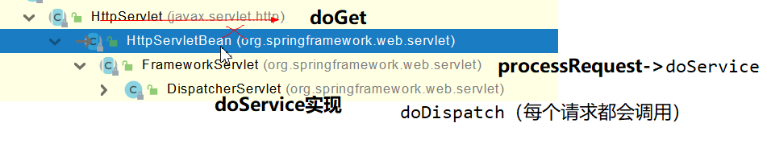

```java
protected void doDispatch(HttpServletRequest request, HttpServletResponse response) throws Exception {
        HttpServletRequest processedRequest = request;
        HandlerExecutionChain mappedHandler = null;
        boolean multipartRequestParsed = false;
        WebAsyncManager asyncManager = WebAsyncUtils.getAsyncManager(request);

        try {
            try {
                ModelAndView mv = null;
                Object dispatchException = null;

                try {
                    processedRequest = this.checkMultipart(request);
                    multipartRequestParsed = processedRequest != request;
                    // 查找当前请求使用哪一个 handler处理 (即 Controller 中的方法)
                    mappedHandler = this.getHandler(processedRequest);
                    if (mappedHandler == null) {
                        this.noHandlerFound(processedRequest, response);
                        return;
                    }
```

```java
@Nullable
    protected HandlerExecutionChain getHandler(HttpServletRequest request) throws Exception {
        // handlerMappings 中保存了所有的 @RequestMapping 和 Handler 的映射规则。所有的映射请求都在handlerMappings中。见下图。
        if (this.handlerMappings != null) {
            // 遍历这个 handlerMappings
            Iterator var2 = this.handlerMappings.iterator();
            while(var2.hasNext()) {
                HandlerMapping mapping = (HandlerMapping)var2.next();
                // 查看当前的 handlerMapping 是否能处理当前的请求。如果能，就找到对应的 Handler；否则就继续查找下一个 handlerMapping
                HandlerExecutionChain handler = mapping.getHandler(request);
                if (handler != null) {
                    return handler;
                }
            }
        }
        return null;
    }
```

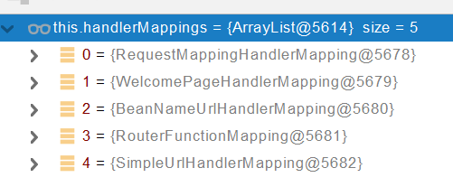

总结：

1. SpringBoot 自动配置欢迎页的 WelconmeMappingHandlerMapping 。能够访问到 index.html
2. SpringBoot 自动配置了默认的 RequestMappingHandlerMapping
3. 当请求进来后，挨个尝试所有的 HandlerMapping 查看是否有对应的请求信息    
	* 如果有，就找到这个请求对应的 handler
    * 如果没有，就继续查找下一个 HandlerMapping
4. 我们可以自定义 HandlerMapping

## 3.2 普通参数与基本注解

### 1. 注解

`@PathVariable、@RequestHeader、@ModelAttribute、@RequestParam、@MatrixVariable、@CookieValue、@RequestBody`

```java
package com.zqf.springboot02web.controller;

import org.springframework.web.bind.annotation.*;

import javax.servlet.http.Cookie;
import java.util.HashMap;
import java.util.List;
import java.util.Map;

// 1. @PathVariable：根据名称从请求路径的对应位置获取数据
// 2. @RequestHeader：获取浏览器发送请求的头部信息
// 3. @RequestParam：根据名称从请求中获取数据 (一般为数组形式，请求为      )
// 4. @RequestBody：从提交的表单中获取数据
// 5. @CookieValue：获取缓存信息
// 6. @RequestBody：从请求体中获取数据（post表单）

@RestController
public class ParameterTestController {

    @GetMapping("/user/{id}/{username}/list")
    public Map<String, Object> getCar(@PathVariable("id") Integer id,
                                      @PathVariable("username") String name,
                                      @PathVariable Map<String, String> parameters,
                                      @RequestHeader("User-Agent") String userAgent,
                                      @RequestHeader Map<String, String> headers,
                                      @RequestParam("age") Integer age,
                                      @RequestParam("inters") List<String> hobbies,
                                      @RequestParam Map<String, String> parameters2,
                                      @CookieValue("max-age") String max_age,
                                      @CookieValue Cookie cookie) {
        Map<String, Object> map = new HashMap<>();
        map.put("id", id);
        map.put("username", name);
        map.put("parameters", parameters);
        map.put("User-Agent", userAgent);
        map.put("Headers", headers);
        map.put("Age", age);
        map.put("Hobbies", hobbies);
        map.put("Parameters", parameters2);
        map.put("max-age", max_age);
        System.out.println(cookie.getName() + "=>" + cookie.getValue());
        return map;
    }

    @PostMapping("/save")
    public Map postMethod(@RequestBody String content) {
        Map<String, Object> map = new HashMap<>();
        map.put("Content", content);
        return map;
    }
}
```

```java
package com.zqf.springboot02web.controller;

import org.springframework.stereotype.Controller;
import org.springframework.web.bind.annotation.GetMapping;
import org.springframework.web.bind.annotation.RequestAttribute;
import org.springframework.web.bind.annotation.ResponseBody;

import javax.servlet.http.HttpServletRequest;
import java.util.HashMap;
import java.util.Map;

// 7. @RequestAttribute：获取 request 域属性(示例中两种方法均可)

@Controller
public class RequestController {

    @GetMapping("/goto")
    public String goToPage(HttpServletRequest httpServletRequest) {
        httpServletRequest.setAttribute("msg", "SUCCESS!");
        httpServletRequest.setAttribute("code", 200);
        return "forward:/success";
    }

    @ResponseBody
    @GetMapping("/success")
    public Map success(@RequestAttribute("msg") String msg,
                       @RequestAttribute("code") Integer code,
                       HttpServletRequest httpServletRequest) {
        Object msg1 = httpServletRequest.getAttribute("msg");
        Map<String, Object> map = new HashMap<>();
        map.put("code", code);
        map.put("msg_RequestAttribute", msg);
        map.put("msg_httpServletRequest", msg1);
        return map;
    }
}
```

```java
// 8. @MatrixVariable：从矩阵变量中获取数据
//    SpringBoot 默认禁用矩阵变量的功能，需要手动开启
//    矩阵变量必须有 url 路径变量才能被解析
    @GetMapping("/cars/{path}")
    public Map carsSell(@MatrixVariable("low") Integer low,
                              @MatrixVariable("brand") List<String> brand,
                              @PathVariable("path") String path) {
        Map<String, Object> map = new HashMap<>();
        map.put("low", low);
        map.put("brand", brand);
        map.put("path", path);
        return map;
    }
//    不同类别的同属性可以指定 pathVar 进行区分
    @GetMapping("/boss/{bossId}/{empId}")
    public Map boss(@MatrixVariable(value = "age", pathVar = "bossId") Integer bossAge,
                    @MatrixVariable(value = "age", pathVar = "empId") Integer empAge) {
        Map<String, Object> map = new HashMap<>();
        map.put("bossAge", bossAge);
        map.put("empAge", empAge);
        return map;
    }
    
/*
    手动开启矩阵变量功能
*/
@Configuration
public class Myconfig {
    @Bean
    public WebMvcConfigurer webMvcConfigurer(){
        return new WebMvcConfigurer() {
            @Override
            public void configurePathMatch(PathMatchConfigurer configurer) {
                UrlPathHelper urlPathHelper = new UrlPathHelper();
                // 不移除；后面的内容。矩阵变量功能就可以生效
                urlPathHelper.setRemoveSemicolonContent(false);
                configurer.setUrlPathHelper(urlPathHelper);
            }
        };
    }
}

/* 
手动开启矩阵变量功能  原理
*/
// PathMatchConfigurer 中设置了 urlPathHelper
public class PathMatchConfigurer {
    public PathMatchConfigurer setUrlPathHelper(UrlPathHelper urlPathHelper) {
        this.urlPathHelper = urlPathHelper;
        return this;
    }
// urlPathHelper 中设置了 removeSemicolonContent 属性，需要重写该方法，自定义 removeSemicolonContent = false
public class UrlPathHelper {
    private boolean removeSemicolonContent = true;
```

### 2. Servlet API

WebRequest、ServletRequest、MultipartRequest、 HttpSession、javax.servlet.http.PushBuilder、Principal、InputStream、Reader、HttpMethod、Locale、TimeZone、ZoneId

ServletRequestMethodArgumentResolver  中处理以上的部分参数

```java
Override
public boolean supportsParameter(MethodParameter parameter) {
        Class<?> paramType = parameter.getParameterType();
        return (WebRequest.class.isAssignableFrom(paramType) ||
        ServletRequest.class.isAssignableFrom(paramType) ||
        MultipartRequest.class.isAssignableFrom(paramType) ||
        HttpSession.class.isAssignableFrom(paramType) ||
        (pushBuilder != null && pushBuilder.isAssignableFrom(paramType)) ||
        Principal.class.isAssignableFrom(paramType) ||
        InputStream.class.isAssignableFrom(paramType) ||
        Reader.class.isAssignableFrom(paramType) ||
        HttpMethod.class == paramType ||
        Locale.class == paramType ||
        TimeZone.class == paramType ||
        ZoneId.class == paramType);
        }
```

### 3. 复杂参数

Map、Model（**map、model里面的数据会被放在request的请求域  request.setAttribute**）、Errors/BindingResult、RedirectAttributes（ 重定向携带数据）、ServletResponse（response）、SessionStatus、UriComponentsBuilder、ServletUriComponentsBuilder

```java
@GetMapping("/params")
    public String params(Map<String, Object> map, Model model) {
        map.put("Hello", "World");
        model.addAttribute("World", "Hello");
        return "forward:/success";
    }

    @ResponseBody
    @GetMapping("/success")
    public Map success(@RequestAttribute(value = "msg", required = false) String msg,
                       @RequestAttribute(value = "code", required = false) Integer code,
                       HttpServletRequest httpServletRequest) {
        Object msg1 = httpServletRequest.getAttribute("msg");
        Map<String, Object> map = new HashMap<>();
        map.put("code", code);
        map.put("msg_RequestAttribute", msg);
        map.put("msg_httpServletRequest", msg1);
        map.put("Hello", httpServletRequest.getAttribute("Hello"));
        map.put("World", httpServletRequest.getAttribute("World"));
        return map;
    }
```

### 4. 自定义参数

```java
package com.zqf.springboot02web.pojo;

import lombok.Data;
import java.util.Date;

@Data
public class Person {
    private String userName;
    private Integer age;
    private Date birth;
    private Pet pet;
}
```

```java
package com.zqf.springboot02web.pojo;

import lombok.Data;

@Data
public class Pet {
    private String name;
    private Integer age;
}
```

```java
    @PostMapping("/saveuser")
    public Person save(Person person) {
        return person;
    }
```

```html
<form action="/saveuser" method="post">
    姓名： <input name="userName" value="zhangsan"/> <br/>
    年龄： <input name="age" value="18"/> <br/>
    生日： <input name="birth" value="2019/12/10"/> <br/>
    宠物姓名：<input name="pet.name" value="阿猫"/><br/>
    宠物年龄：<input name="pet.age" value="5"/>
    <input type="submit" value="保存"/>
</form>
```

#### 扩展：自定义 Converter

应用场景：

```html
<form action="/saveuser" method="post">
    姓名： <input name="userName" value="zhangsan"/> <br/>
    年龄： <input name="age" value="18"/> <br/>
    生日： <input name="birth" value="2019/12/10"/> <br/>
    <!--当前表单提交上来的宠物数据无法自动被转换成 Pet 进行封装，没有对应的 converter-->
    宠物： <input name="pet" value="啊猫,3"/>
    <input type="submit" value="保存"/>
</form>
```

自定义 converter：此时底层会调用我们自定义的 converter 逻辑来进行封装

```java
@Configuration
public class Myconfig {
    @Bean
    public WebMvcConfigurer webMvcConfigurer(){
        return new WebMvcConfigurer() {
            // 自定义 Converter 来进行数据类型的转换封装
            @Override
            public void addFormatters(FormatterRegistry registry) {
                registry.addConverter(new Converter<String, Pet>() {
                    @Override
                    public Pet convert(String s) {
                        if (!StringUtils.isEmpty(s)) {
                            Pet pet = new Pet();
                            String[] split = s.split(",");
                            pet.setName(split[0]);
                            pet.setAge(Integer.parseInt(split[1]));
                            return pet;
                        }
                        return null;
                    }
                });
            }
        };
    }
}
```

## 3.4 参数处理原理

项目的源码追踪从 DispatcherServlet 类中的 doDispatch 方法开始

```java
protected void doDispatch(HttpServletRequest request, HttpServletResponse response) throws Exception {
        HttpServletRequest processedRequest = request;
        HandlerExecutionChain mappedHandler = null;
        boolean multipartRequestParsed = false;
        WebAsyncManager asyncManager = WebAsyncUtils.getAsyncManager(request);

        try {
            try {
                ModelAndView mv = null;
                Object dispatchException = null;

                try {
                    processedRequest = this.checkMultipart(request);
                    multipartRequestParsed = processedRequest != request;
                    // 1. 在 HandlerMapping 中找到能够处理请求的 Handler (即找到处理对应请求的 Controller.method())
                    mappedHandler = this.getHandler(processedRequest);
                    if (mappedHandler == null) {
                        this.noHandlerFound(processedRequest, response);
                        return;
                    }
                    // 2. 为当前的 Handler 寻找一个适配器 HandlerAdapter (在适配器中进行参数的获取等操作)
                    HandlerAdapter ha = this.getHandlerAdapter(mappedHandler.getHandler());
                    String method = request.getMethod();
                    boolean isGet = "GET".equals(method);
                    if (isGet || "HEAD".equals(method)) {
                        long lastModified = ha.getLastModified(request, mappedHandler.getHandler());
                        if ((new ServletWebRequest(request, response)).checkNotModified(lastModified) && isGet) {
                            return;
                        }
                    }

                    if (!mappedHandler.applyPreHandle(processedRequest, response)) {
                        return;
                    }
                    // 3. 执行处理请求的 Handler
                    mv = ha.handle(processedRequest, response, mappedHandler.getHandler());
                    if (asyncManager.isConcurrentHandlingStarted()) {
                        return;
                    }

                    this.applyDefaultViewName(processedRequest, mv);
                    mappedHandler.applyPostHandle(processedRequest, response, mv);
                } catch (Exception var20) {
                    dispatchException = var20;
                } catch (Throwable var21) {
                    dispatchException = new NestedServletException("Handler dispatch failed", var21);
                }

                this.processDispatchResult(processedRequest, response, mappedHandler, mv, (Exception)dispatchException);
            } catch (Exception var22) {
                this.triggerAfterCompletion(processedRequest, response, mappedHandler, var22);
            } catch (Throwable var23) {
                this.triggerAfterCompletion(processedRequest, response, mappedHandler, new NestedServletException("Handler processing failed", var23));
            }

        } finally {
            if (asyncManager.isConcurrentHandlingStarted()) {
                if (mappedHandler != null) {
                    mappedHandler.applyAfterConcurrentHandlingStarted(processedRequest, response);
                }
            } else if (multipartRequestParsed) {
                this.cleanupMultipart(processedRequest);
            }

        }
    }
```

### 1. 在 HandlerMapping 中找到能够处理请求的 Handler (即找到处理对应请求的 Controller.method())

```java
// 1. 在 HandlerMapping 中找到能够处理请求的 Handler (即找到处理对应请求的 Controller.method())
@Nullable
    protected HandlerExecutionChain getHandler(HttpServletRequest request) throws Exception {
        if (this.handlerMappings != null) {
            // 1.1 遍历所有的默认 handlerMappings
            Iterator var2 = this.handlerMappings.iterator();
            // 1.2 若找到能够处理当前请求的 Handler ，则返回
            while(var2.hasNext()) {
                HandlerMapping mapping = (HandlerMapping)var2.next();
                HandlerExecutionChain handler = mapping.getHandler(request);
                if (handler != null) {
                    return handler;
                }
            }
        }
        return null;
    }
```

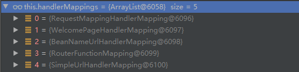

### 2. 为当前的 Handler 寻找一个适配器 HandlerAdapter (在适配器中进行参数的获取等操作)

```java
protected HandlerAdapter getHandlerAdapter(Object handler) throws ServletException {
        if (this.handlerAdapters != null) {
            // 2.1 遍历所有的内置 handlerAdapters
            Iterator var2 = this.handlerAdapters.iterator();
            // 2.2 若找到当前 Handler 的适配器 handlerAdapter，则返回
            while(var2.hasNext()) {
                HandlerAdapter adapter = (HandlerAdapter)var2.next();
                if (adapter.supports(handler)) {
                    return adapter;
                }
            }
        }

        throw new ServletException("No adapter for handler [" + handler + "]: The DispatcherServlet configuration needs to include a HandlerAdapter that supports this handler");
    }
```

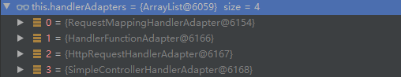

### 3. 执行处理请求的 Handler

```java
protected ModelAndView handleInternal(HttpServletRequest request, HttpServletResponse response, HandlerMethod handlerMethod) throws Exception {
        this.checkRequest(request);
        ModelAndView mav;
        if (this.synchronizeOnSession) {
            HttpSession session = request.getSession(false);
            if (session != null) {
                Object mutex = WebUtils.getSessionMutex(session);
                synchronized(mutex) {
                    mav = this.invokeHandlerMethod(request, response, handlerMethod);
                }
            } else {
                // 3.1 执行 Handler 方法
                mav = this.invokeHandlerMethod(request, response, handlerMethod);
            }
        } else {
            mav = this.invokeHandlerMethod(request, response, handlerMethod);
        }

        if (!response.containsHeader("Cache-Control")) {
            if (this.getSessionAttributesHandler(handlerMethod).hasSessionAttributes()) {
                this.applyCacheSeconds(response, this.cacheSecondsForSessionAttributeHandlers);
            } else {
                this.prepareResponse(response);
            }
        }

        return mav;
    }
```

#### 3.1 执行 Handler 方法

```java
@Nullable
    protected ModelAndView invokeHandlerMethod(HttpServletRequest request, HttpServletResponse response, HandlerMethod handlerMethod) throws Exception {
        ServletWebRequest webRequest = new ServletWebRequest(request, response);

        Object result;
        try {
            WebDataBinderFactory binderFactory = this.getDataBinderFactory(handlerMethod);
            ModelFactory modelFactory = this.getModelFactory(handlerMethod, binderFactory);
            ServletInvocableHandlerMethod invocableMethod = this.createInvocableHandlerMethod(handlerMethod);
            // 3.2 配置参数解析器 HandlerMethodArgumentResolvers
            if (this.argumentResolvers != null) {
                invocableMethod.setHandlerMethodArgumentResolvers(this.argumentResolvers);
            }
            // 3.3 配置返回值处理器 HandlerMethodReturnValueHandlers
            if (this.returnValueHandlers != null) {
                invocableMethod.setHandlerMethodReturnValueHandlers(this.returnValueHandlers);
            }

            invocableMethod.setDataBinderFactory(binderFactory);
            invocableMethod.setParameterNameDiscoverer(this.parameterNameDiscoverer);
            // 实例化 mavContainer 并进行一系列初始化操作
            ModelAndViewContainer mavContainer = new ModelAndViewContainer();
            mavContainer.addAllAttributes(RequestContextUtils.getInputFlashMap(request));
            modelFactory.initModel(webRequest, mavContainer, invocableMethod);
            mavContainer.setIgnoreDefaultModelOnRedirect(this.ignoreDefaultModelOnRedirect);
            AsyncWebRequest asyncWebRequest = WebAsyncUtils.createAsyncWebRequest(request, response);
            asyncWebRequest.setTimeout(this.asyncRequestTimeout);
            WebAsyncManager asyncManager = WebAsyncUtils.getAsyncManager(request);
            asyncManager.setTaskExecutor(this.taskExecutor);
            asyncManager.setAsyncWebRequest(asyncWebRequest);
            asyncManager.registerCallableInterceptors(this.callableInterceptors);
            asyncManager.registerDeferredResultInterceptors(this.deferredResultInterceptors);
            if (asyncManager.hasConcurrentResult()) {
                result = asyncManager.getConcurrentResult();
                mavContainer = (ModelAndViewContainer)asyncManager.getConcurrentResultContext()[0];
                asyncManager.clearConcurrentResult();
                LogFormatUtils.traceDebug(this.logger, (traceOn) -> {
                    String formatted = LogFormatUtils.formatValue(result, !traceOn);
                    return "Resume with async result [" + formatted + "]";
                });
                invocableMethod = invocableMethod.wrapConcurrentResult(result);
            }
            // 4. 执行并处理
            invocableMethod.invokeAndHandle(webRequest, mavContainer, new Object[0]);
            if (!asyncManager.isConcurrentHandlingStarted()) {
                ModelAndView var15 = this.getModelAndView(mavContainer, modelFactory, webRequest);
                return var15;
            }

            result = null;
        } finally {
            webRequest.requestCompleted();
        }

        return (ModelAndView)result;
    }
```

#### 3.2 配置参数解析器 HandlerMethodArgumentResolvers

该解析器确定要执行的目标方法的每一个参数的值是什么。

SpringMVC 目标方法能写多少种参数类型，取决于参数解析器。

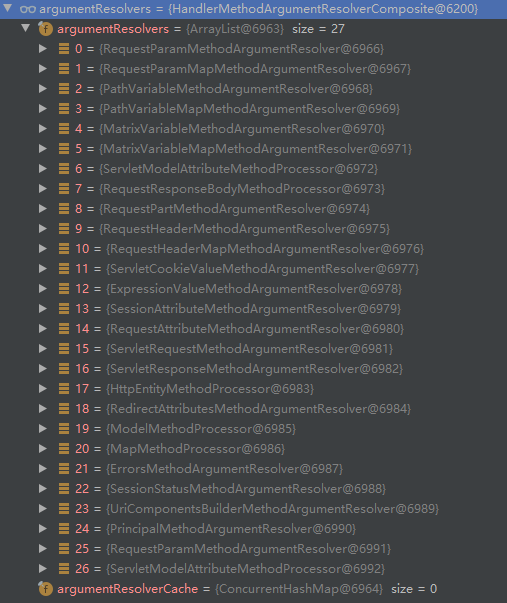

参数解析器调用一个接口：

该接口判断当前的解析器是否能支持解析这种参数，如果支持就返回 resolveArgument

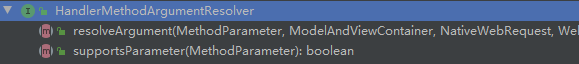

#### 3.3 配置返回值处理器 HandlerMethodReturnValueHandlers

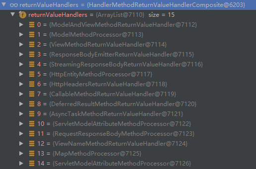

### 4. 执行并处理

```java
public void invokeAndHandle(ServletWebRequest webRequest, ModelAndViewContainer mavContainer, Object... providedArgs) throws Exception {
        // 4.1 获取返回值
        Object returnValue = this.invokeForRequest(webRequest, mavContainer, providedArgs);
        this.setResponseStatus(webRequest);
        if (returnValue == null) {
            if (this.isRequestNotModified(webRequest) || this.getResponseStatus() != null || mavContainer.isRequestHandled()) {
                this.disableContentCachingIfNecessary(webRequest);
                mavContainer.setRequestHandled(true);
                return;
            }
        } else if (StringUtils.hasText(this.getResponseStatusReason())) {
            mavContainer.setRequestHandled(true);
            return;
        }

        mavContainer.setRequestHandled(false);
        Assert.state(this.returnValueHandlers != null, "No return value handlers");

        try {
            this.returnValueHandlers.handleReturnValue(returnValue, this.getReturnValueType(returnValue), mavContainer, webRequest);
        } catch (Exception var6) {
            if (logger.isTraceEnabled()) {
                logger.trace(this.formatErrorForReturnValue(returnValue), var6);
            }

            throw var6;
        }
    }
```

#### 4.1 获取返回值

```java
@Nullable
    public Object invokeForRequest(NativeWebRequest request, @Nullable ModelAndViewContainer mavContainer, Object... providedArgs) throws Exception {
        // 4.2 获取方法的参数值
        Object[] args = this.getMethodArgumentValues(request, mavContainer, providedArgs);
        if (logger.isTraceEnabled()) {
            logger.trace("Arguments: " + Arrays.toString(args));
        }

        return this.doInvoke(args);
    }
```

#### 4.2 获取方法的参数值

```java
protected Object[] getMethodArgumentValues(NativeWebRequest request, @Nullable ModelAndViewContainer mavContainer, Object... providedArgs) throws Exception {
        MethodParameter[] parameters = this.getMethodParameters();
        if (ObjectUtils.isEmpty(parameters)) {
            return EMPTY_ARGS;
        } else {
            Object[] args = new Object[parameters.length];

            for(int i = 0; i < parameters.length; ++i) {
                MethodParameter parameter = parameters[i];
                parameter.initParameterNameDiscovery(this.parameterNameDiscoverer);
                args[i] = findProvidedArgument(parameter, providedArgs);
                if (args[i] == null) {
                    if (!this.resolvers.supportsParameter(parameter)) {
                        throw new IllegalStateException(formatArgumentError(parameter, "No suitable resolver"));
                    }

                    try {
                        // 4.3 解析参数的值，将获取到的数据保存到 args 数组
                        args[i] = this.resolvers.resolveArgument(parameter, mavContainer, request, this.dataBinderFactory);
                    } catch (Exception var10) {
                        if (logger.isDebugEnabled()) {
                            String exMsg = var10.getMessage();
                            if (exMsg != null && !exMsg.contains(parameter.getExecutable().toGenericString())) {
                                logger.debug(formatArgumentError(parameter, exMsg));
                            }
                        }

                        throw var10;
                    }
                }
            }

            return args;
        }
    }
```

#### 4.3 解析参数的值，将获取到的数据保存到 args 数组

```java
@Nullable
    public Object resolveArgument(MethodParameter parameter, @Nullable ModelAndViewContainer mavContainer, NativeWebRequest webRequest, @Nullable WebDataBinderFactory binderFactory) throws Exception {
        // 4.4 获取对应的参数解析器
        HandlerMethodArgumentResolver resolver = this.getArgumentResolver(parameter);
        if (resolver == null) {
            throw new IllegalArgumentException("Unsupported parameter type [" + parameter.getParameterType().getName() + "]. supportsParameter should be called first.");
        } else {
            return resolver.resolveArgument(parameter, mavContainer, webRequest, binderFactory);
        }
    }
```

#### 4.4 获取对应的参数解析器

```java
@Nullable
    private HandlerMethodArgumentResolver getArgumentResolver(MethodParameter parameter) {
        HandlerMethodArgumentResolver result = (HandlerMethodArgumentResolver)this.argumentResolverCache.get(parameter);
        if (result == null) {
            // 4.4.1 遍历所有的参数解析器 argumentResolvers
            Iterator var3 = this.argumentResolvers.iterator();
            // 4.4.2 判断并返回支持解析当前参数的参数解析器
            while(var3.hasNext()) {
                HandlerMethodArgumentResolver resolver = (HandlerMethodArgumentResolver)var3.next();
                if (resolver.supportsParameter(parameter)) {
                    result = resolver;
                    this.argumentResolverCache.put(parameter, resolver);
                    break;
                }
            }
        }
        return result;
    }
```

#### 补充：自动定义参数的获取

在查找参数解析器时，找到 ServletModelAttributeMethodProcessor 这个参数处理器

```java
@Nullable
    private HandlerMethodArgumentResolver getArgumentResolver(MethodParameter parameter) {
        HandlerMethodArgumentResolver result = (HandlerMethodArgumentResolver)this.argumentResolverCache.get(parameter);
        if (result == null) {
            Iterator var3 = this.argumentResolvers.iterator();
            // 1. 遍历找到参数处理器 ServletModelAttributeMethodProcessor 进行解析
            while(var3.hasNext()) {
                HandlerMethodArgumentResolver resolver = (HandlerMethodArgumentResolver)var3.next();
                // 判断当前参数解析器是否能解析当前参数
                if (resolver.supportsParameter(parameter)) {
                    result = resolver;
                    this.argumentResolverCache.put(parameter, resolver);
                    break;
                }
            }
        }
```

判断当前参数解析器是否能解析当前参数

```java
    public boolean supportsParameter(MethodParameter parameter) {
        return parameter.hasParameterAnnotation(ModelAttribute.class) || this.annotationNotRequired && !BeanUtils.isSimpleProperty(parameter.getParameterType()); // 最后一个判断条件判断是否是普通属性
    }
```

判断是否是普通属性

```java
    public static boolean isSimpleProperty(Class<?> type) {
        Assert.notNull(type, "'type' must not be null"); 
        // 最后一个判断条件判断是否为队列或普通数据类型
        return isSimpleValueType(type) || type.isArray() && isSimpleValueType(type.getComponentType());
    }
```

普通数据类型包括

```java
    public static boolean isSimpleValueType(Class<?> type) {
        return Void.class != type && Void.TYPE != type && (ClassUtils.isPrimitiveOrWrapper(type) || Enum.class.isAssignableFrom(type) || CharSequence.class.isAssignableFrom(type) || Number.class.isAssignableFrom(type) || Date.class.isAssignableFrom(type) || Temporal.class.isAssignableFrom(type) || URI.class == type || URL.class == type || Locale.class == type || Class.class == type);
    }
```

查找到对应的参数解析器后需要对各个参数进行赋值，最终进入 ModelAttributeMethodProcessor 类的 resolveArgument 方法

```java
@Nullable
    public final Object resolveArgument(MethodParameter parameter, @Nullable ModelAndViewContainer mavContainer, NativeWebRequest webRequest, @Nullable WebDataBinderFactory binderFactory) throws Exception {
        Assert.state(mavContainer != null, "ModelAttributeMethodProcessor requires ModelAndViewContainer");
        Assert.state(binderFactory != null, "ModelAttributeMethodProcessor requires WebDataBinderFactory");
        String name = ModelFactory.getNameForParameter(parameter);
        ModelAttribute ann = (ModelAttribute)parameter.getParameterAnnotation(ModelAttribute.class);
        if (ann != null) {
            mavContainer.setBinding(name, ann.binding());
        }

        Object attribute = null;
        BindingResult bindingResult = null;
        if (mavContainer.containsAttribute(name)) {
            attribute = mavContainer.getModel().get(name);
        } else {
            try {
                attribute = this.createAttribute(name, parameter, binderFactory, webRequest);
            } catch (BindException var10) {
                if (this.isBindExceptionRequired(parameter)) {
                    throw var10;
                }

                if (parameter.getParameterType() == Optional.class) {
                    attribute = Optional.empty();
                } else {
                    attribute = var10.getTarget();
                }

                bindingResult = var10.getBindingResult();
            }
        }

        if (bindingResult == null) {
            // 获得一个 web 数据绑定器，将请求参数的值绑定到指定的额JavaBean 里面
            WebDataBinder binder = binderFactory.createBinder(webRequest, attribute, name);
            if (binder.getTarget() != null) {
                if (!mavContainer.isBindingDisabled(name)) {
                    this.bindRequestParameters(binder, webRequest);
                }

                this.validateIfApplicable(binder, parameter);
                if (binder.getBindingResult().hasErrors() && this.isBindExceptionRequired(binder, parameter)) {
                    throw new BindException(binder.getBindingResult());
                }
            }

            if (!parameter.getParameterType().isInstance(attribute)) {
                attribute = binder.convertIfNecessary(binder.getTarget(), parameter.getParameterType(), parameter);
            }

            bindingResult = binder.getBindingResult();
        }

        Map<String, Object> bindingResultModel = bindingResult.getModel();
        mavContainer.removeAttributes(bindingResultModel);
        mavContainer.addAllAttributes(bindingResultModel);
        return attribute;
    }
```

获得一个 web 数据绑定器，将请求参数的值绑定到指定的 JavaBean 里面。WebDataBinder 利用它内部的 Converters 将请求数据转换称指定的数据类型，再次封装到 JavaBean 中。

```java
    public final WebDataBinder createBinder(NativeWebRequest webRequest, @Nullable Object target, String objectName) throws Exception {
        // 创建一个 dataBinder 并返回，其中的 target 属性包含了请求的参数
        WebDataBinder dataBinder = this.createBinderInstance(target, objectName, webRequest);
        if (this.initializer != null) {
            this.initializer.initBinder(dataBinder, webRequest);
        }

        this.initBinder(dataBinder, webRequest);
        return dataBinder;
    }
```

Converters：

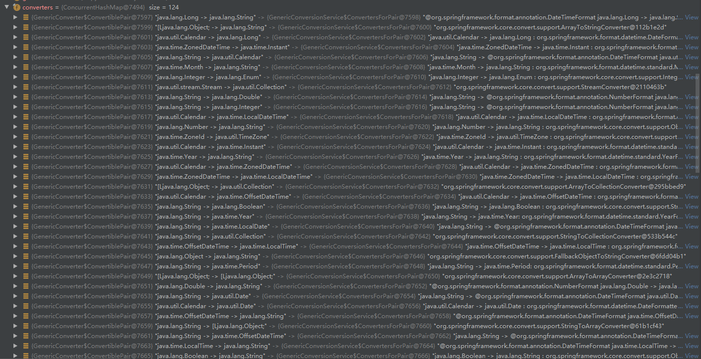

最终返回的到的 binder 为

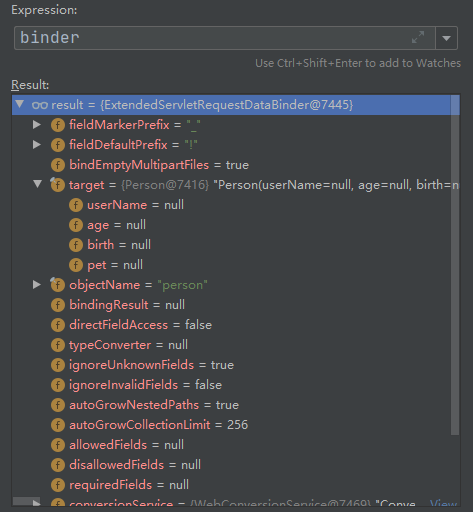

### 5. 目标方法执行完成

所有的数据都放在 ModelAndViewContainer 类型的 mavContainer 实例中。其中包含要去的页面地址 View，还包含 Model 数据。

### 6. 处理派发结果

DispatcherServlet 类中

```java
private void processDispatchResult(HttpServletRequest request, HttpServletResponse response, @Nullable HandlerExecutionChain mappedHandler, @Nullable ModelAndView mv, @Nullable Exception exception) throws Exception {
        boolean errorView = false;
        if (exception != null) {
            if (exception instanceof ModelAndViewDefiningException) {
                this.logger.debug("ModelAndViewDefiningException encountered", exception);
                mv = ((ModelAndViewDefiningException)exception).getModelAndView();
            } else {
                Object handler = mappedHandler != null ? mappedHandler.getHandler() : null;
                mv = this.processHandlerException(request, response, handler, exception);
                errorView = mv != null;
            }
        }

        if (mv != null && !mv.wasCleared()) {
            this.render(mv, request, response);
            if (errorView) {
                WebUtils.clearErrorRequestAttributes(request);
            }
        } else if (this.logger.isTraceEnabled()) {
            this.logger.trace("No view rendering, null ModelAndView returned.");
        }

        if (!WebAsyncUtils.getAsyncManager(request).isConcurrentHandlingStarted()) {
            if (mappedHandler != null) {
                mappedHandler.triggerAfterCompletion(request, response, (Exception)null);
            }

        }
    }
```

# 4. 数据响应和内容协商

## 4.1 数据响应与内容协商原理

### 1. doDispatch 方法

#### 1.1 获得请求对应的处理器 mappedHandler = this.getHandler(processedRequest);

#### 1.2 为 Handler 得到对应的处理器适配器 HandlerAdapter ha = this.getHandlerAdapter(mappedHandler.getHandler());

#### 1.3 执行对应方法 mv = ha.handle(processedRequest, response, mappedHandler.getHandler());

### 2. 真正执行方法 invokeAndHandle

```java
public void invokeAndHandle(ServletWebRequest webRequest, ModelAndViewContainer mavContainer, Object... providedArgs) throws Exception {
        // 获得返回值，内部函数调用 doInvoke(args) 方法通过反射真正执行 Controller 方法
        Object returnValue = this.invokeForRequest(webRequest, mavContainer, providedArgs);
        this.setResponseStatus(webRequest);
        if (returnValue == null) {
            if (this.isRequestNotModified(webRequest) || this.getResponseStatus() != null || mavContainer.isRequestHandled()) {
                this.disableContentCachingIfNecessary(webRequest);
                mavContainer.setRequestHandled(true);
                return;
            }
        } else if (StringUtils.hasText(this.getResponseStatusReason())) {
            mavContainer.setRequestHandled(true);
            return;
        }

        mavContainer.setRequestHandled(false);
        Assert.state(this.returnValueHandlers != null, "No return value handlers");

        try {
            // 3. 返回值处理器
            this.returnValueHandlers.handleReturnValue(returnValue, this.getReturnValueType(returnValue), mavContainer, webRequest);
        } catch (Exception var6) {
            if (logger.isTraceEnabled()) {
                logger.trace(this.formatErrorForReturnValue(returnValue), var6);
            }

            throw var6;
        }
    }
```

### 3. 返回值处理器

```java
public void handleReturnValue(@Nullable Object returnValue, MethodParameter returnType, ModelAndViewContainer mavContainer, NativeWebRequest webRequest) throws Exception {
        // 3.1 获取返回值处理器 HandlerMethodReturnValueHandler
        HandlerMethodReturnValueHandler handler = this.selectHandler(returnValue, returnType);
        if (handler == null) {
            throw new IllegalArgumentException("Unknown return value type: " + returnType.getParameterType().getName());
        } else {
            // 3.2 通过选择出的返回值处理器对返回值进行处理
            handler.handleReturnValue(returnValue, returnType, mavContainer, webRequest);
        }
    }
```

#### 3.1 获取返回值处理器 HandlerMethodReturnValueHandler

```java
@Nullable
    private HandlerMethodReturnValueHandler selectHandler(@Nullable Object value, MethodParameter returnType) {
        // 异步判断
        boolean isAsyncValue = this.isAsyncReturnValue(value, returnType);
        // 遍历选择合适的返回值处理器 HandlerMethodReturnValueHandler 
        Iterator var4 = this.returnValueHandlers.iterator();
        HandlerMethodReturnValueHandler handler;
        do {
            do {
                if (!var4.hasNext()) {
                    return null;
                }

                handler = (HandlerMethodReturnValueHandler)var4.next();
            } while(isAsyncValue && !(handler instanceof AsyncHandlerMethodReturnValueHandler));
        } while(!handler.supportsReturnType(returnType));

        return handler;
    }
```

15 个默认的返回值处理器：分析此处的适配判断可以查找到 SpringMVC 到底支持哪些返回值

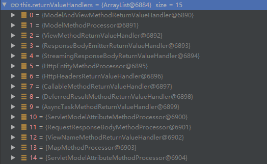

#### 3.2 通过选择出的返回值处理器对返回值进行处理

```java
public void handleReturnValue(@Nullable Object returnValue, MethodParameter returnType, ModelAndViewContainer mavContainer, NativeWebRequest webRequest) throws IOException, HttpMediaTypeNotAcceptableException, HttpMessageNotWritableException {
        mavContainer.setRequestHandled(true);
        // 获取输入消息
        ServletServerHttpRequest inputMessage = this.createInputMessage(webRequest);
        // 获取输出消息
        ServletServerHttpResponse outputMessage = this.createOutputMessage(webRequest);
        // 4. 通过消息转换器 MessageConverters 写返回值
        this.writeWithMessageConverters(returnValue, returnType, inputMessage, outputMessage);
    }
```

### 4. 通过消息转换器 MessageConverters 写返回值

```java
protected <T> void writeWithMessageConverters(@Nullable T value, MethodParameter returnType, ServletServerHttpRequest inputMessage, ServletServerHttpResponse outputMessage) throws IOException, HttpMediaTypeNotAcceptableException, HttpMessageNotWritableException {
        // 部分代码省略...
        
        MediaType selectedMediaType = null;
        MediaType contentType = outputMessage.getHeaders().getContentType();
        boolean isContentTypePreset = contentType != null && contentType.isConcrete();
        if (isContentTypePreset) {
            if (this.logger.isDebugEnabled()) {
                this.logger.debug("Found 'Content-Type:" + contentType + "' in response");
            }

            selectedMediaType = contentType;
        } else {
            HttpServletRequest request = inputMessage.getServletRequest();
            // 4.1 获取浏览器接收的媒体类型 acceptableTypes
            List<MediaType> acceptableTypes = this.getAcceptableMediaTypes(request);
            // 4.2 获取服务器可生成的媒体类型 producibleTypes
            List<MediaType> producibleTypes = this.getProducibleMediaTypes(request, valueType, (Type)targetType);
            if (body != null && producibleTypes.isEmpty()) {
                throw new HttpMessageNotWritableException("No converter found for return value of type: " + valueType);
            }
            // 4.3 排列组合 acceptableTypes 和 producibleTypes，挑选出可用的媒体类型  mediaTypesToUse
            List<MediaType> mediaTypesToUse = new ArrayList();
            Iterator var15 = acceptableTypes.iterator();
            MediaType mediaType;
            while(var15.hasNext()) {
                mediaType = (MediaType)var15.next();
                Iterator var17 = producibleTypes.iterator();
                while(var17.hasNext()) {
                    MediaType producibleType = (MediaType)var17.next();
                    if (mediaType.isCompatibleWith(producibleType)) {
                        mediaTypesToUse.add(this.getMostSpecificMediaType(mediaType, producibleType));
                    }
                }
            }

            if (mediaTypesToUse.isEmpty()) {
                if (body != null) {
                    throw new HttpMediaTypeNotAcceptableException(producibleTypes);
                }

                if (this.logger.isDebugEnabled()) {
                    this.logger.debug("No match for " + acceptableTypes + ", supported: " + producibleTypes);
                }

                return;
            }
            // 4.4 进行内容协商的最佳匹配媒体类型
            MediaType.sortBySpecificityAndQuality(mediaTypesToUse);
            var15 = mediaTypesToUse.iterator();
            while(var15.hasNext()) {
                mediaType = (MediaType)var15.next();
                if (mediaType.isConcrete()) {
                    selectedMediaType = mediaType;
                    break;
                }
                if (mediaType.isPresentIn(ALL_APPLICATION_MEDIA_TYPES)) {
                    selectedMediaType = MediaType.APPLICATION_OCTET_STREAM;
                    break;
                }
            }

            if (this.logger.isDebugEnabled()) {
                this.logger.debug("Using '" + selectedMediaType + "', given " + acceptableTypes + " and supported " + producibleTypes);
            }
        }
        
        HttpMessageConverter converter;
        GenericHttpMessageConverter genericConverter;
        label159: {
            if (selectedMediaType != null) {
                selectedMediaType = selectedMediaType.removeQualityValue();
                Iterator var22 = this.messageConverters.iterator();

                while(var22.hasNext()) {
                    converter = (HttpMessageConverter)var22.next();
                    genericConverter = converter instanceof GenericHttpMessageConverter ? (GenericHttpMessageConverter)converter : null;
                    if (genericConverter != null) {
                        if (((GenericHttpMessageConverter)converter).canWrite((Type)targetType, valueType, selectedMediaType)) {
                            break label159;
                        }
                        // 4.5 调用支持将对象转化为最佳匹配媒体类型的 Converter 进行转化
                    } else if (converter.canWrite(valueType, selectedMediaType)) {
                        break label159;
                    }
                }
            }

           // 部分代码省略...
```

#### 4.1 获取浏览器接收的媒体类型 acceptableTypes

```java
    private List<MediaType> getAcceptableMediaTypes(HttpServletRequest request) throws HttpMediaTypeNotAcceptableException {
        // contentNegotiationManager 内容协商管理器，默认使用基于请求头的策略
        return this.contentNegotiationManager.resolveMediaTypes(new ServletWebRequest(request));
    }
```

此处的contentNegotiationManager：

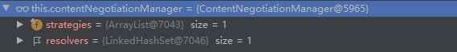

```java
public List<MediaType> resolveMediaTypes(NativeWebRequest request) throws HttpMediaTypeNotAcceptableException {
        // 遍历所有策略，查找适合的策略
        Iterator var2 = this.strategies.iterator();

        List mediaTypes;
        do {
            if (!var2.hasNext()) {
                return MEDIA_TYPE_ALL_LIST;
            }

            ContentNegotiationStrategy strategy = (ContentNegotiationStrategy)var2.next();
            mediaTypes = strategy.resolveMediaTypes(request);
        } while(mediaTypes.equals(MEDIA_TYPE_ALL_LIST));

        return mediaTypes;
    }
```

最终获得可接受的媒体类型：

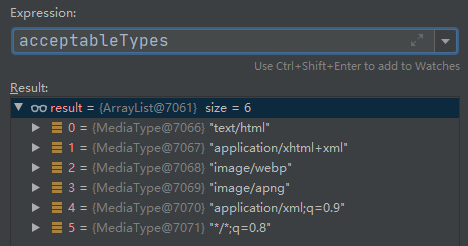

#### 4.2 获取服务器可生成的媒体类型 producibleTypes

```java
protected List<MediaType> getProducibleMediaTypes(HttpServletRequest request, Class<?> valueClass, @Nullable Type targetType) {
        Set<MediaType> mediaTypes = (Set)request.getAttribute(HandlerMapping.PRODUCIBLE_MEDIA_TYPES_ATTRIBUTE);
        if (!CollectionUtils.isEmpty(mediaTypes)) {
            return new ArrayList(mediaTypes);
        } else if (this.allSupportedMediaTypes.isEmpty()) {
            return Collections.singletonList(MediaType.ALL);
        } else {
            List<MediaType> result = new ArrayList();
            // 遍历循环所有当前系统的消息转换器 messageConverters，看谁支持当前的操作对象 (Person)
            Iterator var6 = this.messageConverters.iterator();

            while(true) {
                while(var6.hasNext()) {
                    HttpMessageConverter<?> converter = (HttpMessageConverter)var6.next();
                    if (converter instanceof GenericHttpMessageConverter && targetType != null) {
                        if (((GenericHttpMessageConverter)converter).canWrite(targetType, valueClass, (MediaType)null)) {
                            result.addAll(converter.getSupportedMediaTypes());
                        }
                    } else if (converter.canWrite(valueClass, (MediaType)null)) { // 找到支持的 messageConverters
                        result.addAll(converter.getSupportedMediaTypes()); // 将 messageConverters 支持的媒体类型统计出来并返回
                    }
                }
                return result;
            }
        }
    }
```

系统默认的消息转换器 messageConverters：

最终获得可支持的媒体类型：

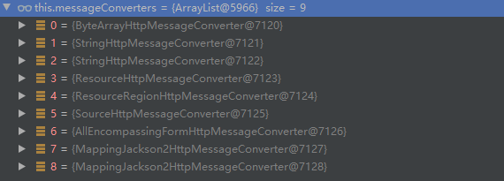

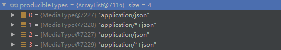

#### 4.3 排列组合 acceptableTypes 和 producibleTypes，挑选出可用的媒体类型 mediaTypesToUse

```java
List<MediaType> mediaTypesToUse = new ArrayList();
Iterator var15 = acceptableTypes.iterator();
MediaType mediaType;
while(var15.hasNext()) {
    mediaType = (MediaType)var15.next();
    Iterator var17 = producibleTypes.iterator();
    while(var17.hasNext()) {
        MediaType producibleType = (MediaType)var17.next();
        if (mediaType.isCompatibleWith(producibleType)) {
            mediaTypesToUse.add(this.getMostSpecificMediaType(mediaType, producibleType));
        }
    }
}
```

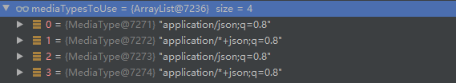

#### 4.4 进行内容协商的最佳匹配媒体类型

```java
MediaType.sortBySpecificityAndQuality(mediaTypesToUse);
var15 = mediaTypesToUse.iterator();
while(var15.hasNext()) {
    mediaType = (MediaType)var15.next();
    if (mediaType.isConcrete()) {
        selectedMediaType = mediaType;
        break;
    }
    if (mediaType.isPresentIn(ALL_APPLICATION_MEDIA_TYPES)) {
        selectedMediaType = MediaType.APPLICATION_OCTET_STREAM;
        break;
    }
}
```

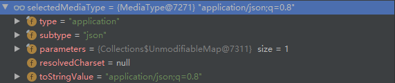

#### 4.5 调用支持将对象转化为最佳匹配媒体类型的 Converter 进行转化

## 4.2 内容协商

内容协商是根据客户端的接受能力不同，返回不同媒体类型的数据

### 1. json 媒体类型

在开启了 web 模块后，jackson.jar 被自动引入。

上述返回值和内容协商的原理部分即返回 json 媒体类型。

### 2. xml 媒体类型

1. 引入 xml 媒体类型的依赖
```xml
<!-- 引入 xml 媒体类型依赖 -->
        <dependency>
            <groupId>com.fasterxml.jackson.dataformat</groupId>
            <artifactId>jackson-dataformat-xml</artifactId>
        </dependency>
```

使用 postman 客户端改变请求头，只接受 xml 媒体类型的数据

结果返回 xml 媒体类型

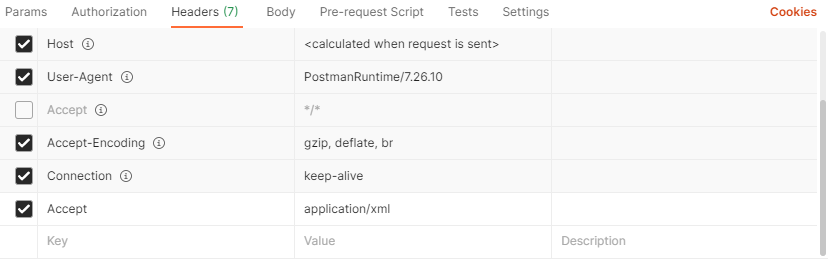

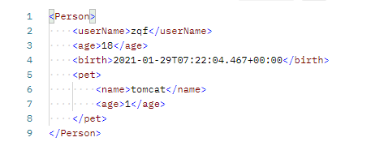

### 3. 开启浏览器参数方式的内容协商功能

```yml
#开启浏览器参数方式内容协商功能
spring:
  mvc:
    contentnegotiation:
      favor-parameter: true
```

开启后，策略变为两种，支持的媒体类型包括 xml(2中开启) 和 json(默认存在)

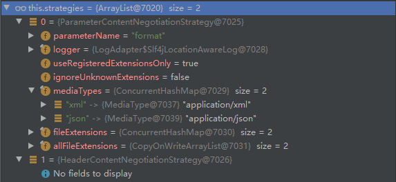

在发送请求时，在地址后面添加 `?format='要求的媒体类型' `即可

测试 json：

测试 xml：

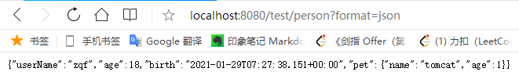

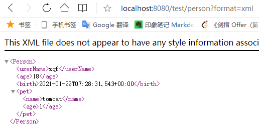

### 4. 自定义 MessageConver

#### 4.1 实现自定义的协议数据兼容—— x-zqf 媒体类型

```java
package com.zqf.springboot02web.converter;

import com.zqf.springboot02web.pojo.Person;
import org.springframework.http.HttpInputMessage;
import org.springframework.http.HttpOutputMessage;
import org.springframework.http.MediaType;
import org.springframework.http.converter.HttpMessageConverter;
import org.springframework.http.converter.HttpMessageNotReadableException;
import org.springframework.http.converter.HttpMessageNotWritableException;

import java.io.IOException;
import java.io.OutputStream;
import java.util.List;

public class ZqfConverterMessage implements HttpMessageConverter {
    @Override
    public boolean canRead(Class aClass, MediaType mediaType) {
        return false;
    }

    @Override
    public boolean canWrite(Class aClass, MediaType mediaType) {
        // 只要是 Person 数据类型就可写
        return aClass.isAssignableFrom(Person.class);
    }

    // 服务器要统计所有MessageConverter都能写出哪些内容类型
    @Override
    public List<MediaType> getSupportedMediaTypes() {
        return MediaType.parseMediaTypes("application/x-zqf");
    }

    @Override
    public Object read(Class aClass, HttpInputMessage httpInputMessage) throws IOException, HttpMessageNotReadableException {
        return null;
    }

    @Override
    public void write(Object o, MediaType mediaType, HttpOutputMessage httpOutputMessage) throws IOException, HttpMessageNotWritableException {
        //自定义协议数据的写出
        String data = "ZQF" + o;
        //写出去
        OutputStream body = httpOutputMessage.getBody();
        body.write(data.getBytes());
    }
}
```

#### 4.2 在配置类中扩展一个新的消息转换器

```java
@Configuration
public class Myconfig {
    @Bean
    public WebMvcConfigurer webMvcConfigurer(){
        return new WebMvcConfigurer() {
            // 扩展一个新的消息转换器
            @Override
            public void extendMessageConverters(List<HttpMessageConverter<?>> converters) {
                converters.add(new ZqfConverterMessage());
            }
        }
    }
}
```

#### 4.3 在配置类中自定义内容协商的策略

```java
@Configuration
public class Myconfig {
    @Bean
    public WebMvcConfigurer webMvcConfigurer(){
        @Override
        public void configureContentNegotiation(ContentNegotiationConfigurer configurer) {
            Map<String, MediaType> mediaTypes = new HashMap<>();
            mediaTypes.put("json", MediaType.APPLICATION_JSON);
            mediaTypes.put("xml", MediaType.APPLICATION_XML);
            mediaTypes.put("ZZ", MediaType.parseMediaType("application/x-zqf"));
            // 指定对应参数方式内容协商中对应字符应该解析的媒体类型
            ParameterContentNegotiationStrategy parameterStrategy = new ParameterContentNegotiationStrategy(mediaTypes);
            // 指定请求头解析策略
            HeaderContentNegotiationStrategy headerStrategy = new HeaderContentNegotiationStrategy();
            configurer.strategies(Arrays.asList(parameterStrategy, headerStrategy));
        }
    }
}
```

#### 4.4 分析

此时的策略中，有两种方式：基于参数的内容协商、基于请求头的内容协商

在基于参数的内容协商中，支持 3 种媒体类型：json、xml、ZZ（自定义）

最后的到的最优的媒体类型

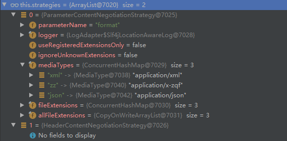

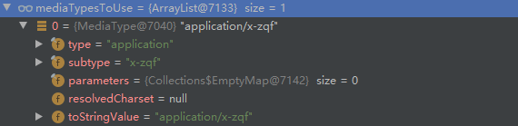

结果演示：

基于参数的内容协商

基于请求头的内容协商

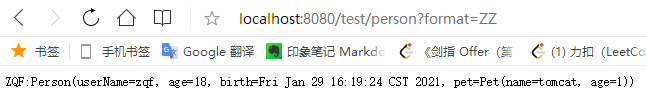

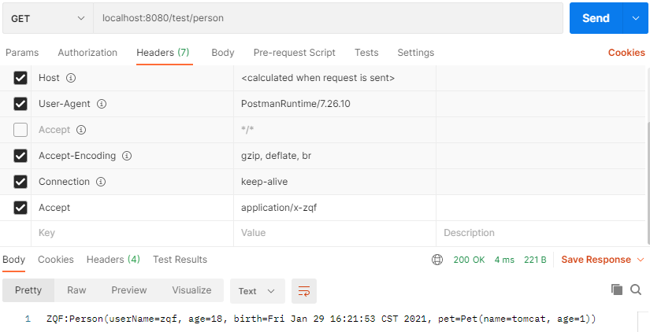

注意：我们添加的自定义功能可能会覆盖许多默认功能，导致失效(比如如果在配置类中自定义内容写上的策略的时候，如果不添加请求头的解析策略，该默认策略就会失效)

# 5. 视图解析与模版引擎

## 5.1 模版引擎-Thymeleaf

### 1. 基本语法

详情查询[网页](https://www.yuque.com/atguigu/springboot/vgzmgh#V14xB)

### 2. thymeleaf 的使用

引入依赖，开启 thymealeaf

```xml
<dependency>
    <groupId>org.springframework.boot</groupId>
    <artifactId>spring-boot-starter-thymeleaf</artifactId>
</dependency>
```

spring 中自动配置好了 thymealeaf

* 所有 thymealeaf 的配置值都在 ThymeleafProperties
* 配置好了 SpringTemplateEngine
* 配置好了 ThymealeafViewResolver
* 我们只需要进行页面的开发
```java
@Configuration(proxyBeanMethods = false)
@EnableConfigurationProperties({ThymeleafProperties.class})
@ConditionalOnClass({TemplateMode.class, SpringTemplateEngine.class})
@AutoConfigureAfter({WebMvcAutoConfiguration.class, WebFluxAutoConfiguration.class})
public class ThymeleafAutoConfiguration {}
```

### 3. 页面开发

```java
    public static final String DEFAULT_PREFIX = "classpath:/templates/";
    public static final String DEFAULT_SUFFIX = ".html";
```

上述两行代码表明：我们的静态网页存放的位置，以及进行跳转和重定向时只需要写文件名即可。

## 5.2 构建后台管理系统

### 1. 项目创建

引入 thymeleaf、web、devtools、lombok

### 2. 静态资源的处理

spring 自动配置好，将静态文件放在 static 文件夹下即可

### 3. 请求处理 Controller

编写对应请求的处理方法 Controller

### 4. Thymeleaf 渲染

包括

* 路径构建（`th: action="@{/login}"`）
* 公共页面的抽取（`th: replace="common :: head"`）
* 数据渲染（表格内容的遍历）

### 5. 基本系统构建

D:\JavaStudy\springboot\Springboot-LFY 路径下的 spring-boot-03-admin 项目

基本功能：

登录页、登录页跳转主页、table 表格中的四个页面

## 5.3 视图解析原理

### 1. 进入 doDispatch 方法的 mav = invokeHandlerMethod(request, response, handlerMethod); 语句，查询数据和视图地址

```java
@Nullable
	protected ModelAndView invokeHandlerMethod(HttpServletRequest request,
			HttpServletResponse response, HandlerMethod handlerMethod) throws Exception {

		ServletWebRequest webRequest = new ServletWebRequest(request, response);
		try {
			WebDataBinderFactory binderFactory = getDataBinderFactory(handlerMethod);
			ModelFactory modelFactory = getModelFactory(handlerMethod, binderFactory);

			ServletInvocableHandlerMethod invocableMethod = createInvocableHandlerMethod(handlerMethod);
			if (this.argumentResolvers != null) {
				invocableMethod.setHandlerMethodArgumentResolvers(this.argumentResolvers);
			}
			if (this.returnValueHandlers != null) {
				invocableMethod.setHandlerMethodReturnValueHandlers(this.returnValueHandlers);
			}
			invocableMethod.setDataBinderFactory(binderFactory);
			invocableMethod.setParameterNameDiscoverer(this.parameterNameDiscoverer);
           
           // 创建一个新的 ModelAndViewContainer，以及一些初始化过程
			ModelAndViewContainer mavContainer = new ModelAndViewContainer();
			mavContainer.addAllAttributes(RequestContextUtils.getInputFlashMap(request));
			modelFactory.initModel(webRequest, mavContainer, invocableMethod);
			mavContainer.setIgnoreDefaultModelOnRedirect(this.ignoreDefaultModelOnRedirect);

			AsyncWebRequest asyncWebRequest = WebAsyncUtils.createAsyncWebRequest(request, response);
			asyncWebRequest.setTimeout(this.asyncRequestTimeout);

			WebAsyncManager asyncManager = WebAsyncUtils.getAsyncManager(request);
			asyncManager.setTaskExecutor(this.taskExecutor);
			asyncManager.setAsyncWebRequest(asyncWebRequest);
			asyncManager.registerCallableInterceptors(this.callableInterceptors);
			asyncManager.registerDeferredResultInterceptors(this.deferredResultInterceptors);

			if (asyncManager.hasConcurrentResult()) {
				Object result = asyncManager.getConcurrentResult();
				mavContainer = (ModelAndViewContainer) asyncManager.getConcurrentResultContext()[0];
				asyncManager.clearConcurrentResult();
				LogFormatUtils.traceDebug(logger, traceOn -> {
					String formatted = LogFormatUtils.formatValue(result, !traceOn);
					return "Resume with async result [" + formatted + "]";
				});
				invocableMethod = invocableMethod.wrapConcurrentResult(result);
			}

           // 2. 执行和处理对应方法
			invocableMethod.invokeAndHandle(webRequest, mavContainer);
			if (asyncManager.isConcurrentHandlingStarted()) {
				return null;
			}
          // 3. 返回最终的 ModelAndView
			return getModelAndView(mavContainer, modelFactory, webRequest);
		}
		finally {
			webRequest.requestCompleted();
		}
	}
```

### 2. 执行和处理对应方法

经过 invokeAndHandle 方法处理后，mavContainer 内包含了数据和视图地址：

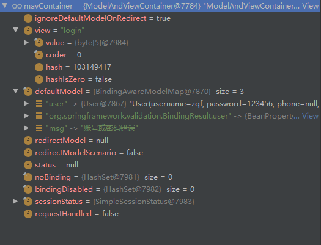

```java
public void invokeAndHandle(ServletWebRequest webRequest, ModelAndViewContainer mavContainer,
			Object... providedArgs) throws Exception {

		Object returnValue = invokeForRequest(webRequest, mavContainer, providedArgs);
		setResponseStatus(webRequest);

		if (returnValue == null) {
			if (isRequestNotModified(webRequest) || getResponseStatus() != null || mavContainer.isRequestHandled()) {
				disableContentCachingIfNecessary(webRequest);
				mavContainer.setRequestHandled(true);
				return;
			}
		}
		else if (StringUtils.hasText(getResponseStatusReason())) {
			mavContainer.setRequestHandled(true);
			return;
		}

		mavContainer.setRequestHandled(false);
		Assert.state(this.returnValueHandlers != null, "No return value handlers");
		try {// 返回值的处理
			this.returnValueHandlers.handleReturnValue(
					returnValue, getReturnValueType(returnValue), mavContainer, webRequest);
		}
		catch (Exception ex) {
			if (logger.isTraceEnabled()) {
				logger.trace(formatErrorForReturnValue(returnValue), ex);
			}
			throw ex;
		}
	}
```

```java
public void handleReturnValue(@Nullable Object returnValue, MethodParameter returnType, ModelAndViewContainer mavContainer, NativeWebRequest webRequest) throws Exception {
        // 选择返回值处理器，详情见 返回值原理 部分
        HandlerMethodReturnValueHandler handler = this.selectHandler(returnValue, returnType);
        if (handler == null) {
            throw new IllegalArgumentException("Unknown return value type: " + returnType.getParameterType().getName());
        } else {
            // 处理返回值
            handler.handleReturnValue(returnValue, returnType, mavContainer, webRequest);
        }
    }
```

```
@Override
	public void handleReturnValue(@Nullable Object returnValue, MethodParameter returnType,
			ModelAndViewContainer mavContainer, NativeWebRequest webRequest) throws Exception {

		if (returnValue instanceof CharSequence) {
			String viewName = returnValue.toString();
			mavContainer.setViewName(viewName); // 设置视图名
			if (isRedirectViewName(viewName)) {
				mavContainer.setRedirectModelScenario(true);
			}
		}
		else if (returnValue != null) {
			throw new UnsupportedOperationException("Unexpected return type: " +
					returnType.getParameterType().getName() + " in method: " + returnType.getMethod());
		}
	}
```

### 3. 通过 mavContainer 返回最终的 ModelAndView

返回的最终的 ModelAndView ：包含所有视图和数据的信息

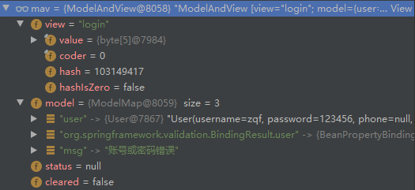

```java
	@Nullable
	private ModelAndView getModelAndView(ModelAndViewContainer mavContainer,
			ModelFactory modelFactory, NativeWebRequest webRequest) throws Exception {

		modelFactory.updateModel(webRequest, mavContainer);
		if (mavContainer.isRequestHandled()) {
			return null;
		}
		ModelMap model = mavContainer.getModel(); // 取出 Model
		ModelAndView mav = new ModelAndView(mavContainer.getViewName(), model, mavContainer.getStatus()); // 重建一个新的 ModelAndView，将视图和数据全部写入
		if (!mavContainer.isViewReference()) {
			mav.setView((View) mavContainer.getView());
		}
		if (model instanceof RedirectAttributes) {
			Map<String, ?> flashAttributes = ((RedirectAttributes) model).getFlashAttributes();
			HttpServletRequest request = webRequest.getNativeRequest(HttpServletRequest.class);
			if (request != null) {
				RequestContextUtils.getOutputFlashMap(request).putAll(flashAttributes);
			}
		}
		return mav; // 返回 ModelAndView
	}
```

### 4. 得到 ModelAndView 后，最终进入 doDispatch 方法的 processDispatchResult(processedRequest, response, mappedHandler, mv, dispatchException); 语句处理派发结果

```java
private void processDispatchResult(HttpServletRequest request, HttpServletResponse response,
			@Nullable HandlerExecutionChain mappedHandler, @Nullable ModelAndView mv,
			@Nullable Exception exception) throws Exception {

		boolean errorView = false;

		if (exception != null) {
			if (exception instanceof ModelAndViewDefiningException) {
				logger.debug("ModelAndViewDefiningException encountered", exception);
				mv = ((ModelAndViewDefiningException) exception).getModelAndView();
			}
			else {
				Object handler = (mappedHandler != null ? mappedHandler.getHandler() : null);
				mv = processHandlerException(request, response, handler, exception);
				errorView = (mv != null);
			}
		}

		if (mv != null && !mv.wasCleared()) {
			render(mv, request, response); // 5. 进行视图的渲染
			if (errorView) {
				WebUtils.clearErrorRequestAttributes(request);
			}
		}
		else {
			if (logger.isTraceEnabled()) {
				logger.trace("No view rendering, null ModelAndView returned.");
			}
		}

		if (WebAsyncUtils.getAsyncManager(request).isConcurrentHandlingStarted()) {
			return;
		}

		if (mappedHandler != null) {
			mappedHandler.triggerAfterCompletion(request, response, null);
		}
	}
```

### 5. 进行视图渲染

```java
protected void render(ModelAndView mv, HttpServletRequest request, HttpServletResponse response) throws Exception {
		Locale locale =
				(this.localeResolver != null ? this.localeResolver.resolveLocale(request) : request.getLocale());
		response.setLocale(locale);

		View view;
		String viewName = mv.getViewName();
		if (viewName != null) {
			view = resolveViewName(viewName, mv.getModelInternal(), locale, request); // 5.1 处理视图名
			if (view == null) {
				throw new ServletException("Could not resolve view with name '" + mv.getViewName() +
						"' in servlet with name '" + getServletName() + "'");
			}
		}
		else {
			view = mv.getView();
			if (view == null) {
				throw new ServletException("ModelAndView [" + mv + "] neither contains a view name nor a " +
						"View object in servlet with name '" + getServletName() + "'");
			}
		}

		if (logger.isTraceEnabled()) {
			logger.trace("Rendering view [" + view + "] ");
		}
		try {
			if (mv.getStatus() != null) {
				response.setStatus(mv.getStatus().value());
			}
			view.render(mv.getModelInternal(), request, response); // 5.2 获取 Model 的值并进行渲染
		}
		catch (Exception ex) {
			if (logger.isDebugEnabled()) {
				logger.debug("Error rendering view [" + view + "]", ex);
			}
			throw ex;
		}
	}
```

#### 5.1 处理视图名

```java
@Nullable
	protected View resolveViewName(String viewName, @Nullable Map<String, Object> model,
			Locale locale, HttpServletRequest request) throws Exception {
       // 遍历所有的视图处理器，看哪一个处理器能处理当前视图名
		if (this.viewResolvers != null) {
			for (ViewResolver viewResolver : this.viewResolvers) {
				View view = viewResolver.resolveViewName(viewName, locale);
				if (view != null) {
					return view;
				}
			}
		}
		return null;
	}
```

SpringBoot 的默认视图处理器：

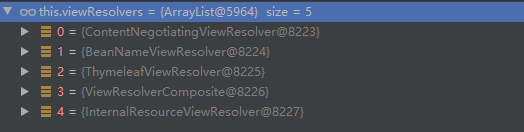

视图的解析：

* 返回值以 forward 开始：new InternalResourceView(forwardUrl); --> 转发request.getRequestDispatcher(path).forward(request, response);
* 返回值以 redirect: 开始： new RedirectView() --> render 就是重定向
* 返回值是普通字符串： new ThymeleafView()

#### 5.2 获取 Model 的值并进行渲染

代码略

# 6. 拦截器

## 6.1 拦截器的使用

### 1. 实现 HandlerInterceptor 接口，编写拦截器逻辑

```java
package com.zqf.springboot03admin.Interceptor;

import lombok.extern.slf4j.Slf4j;
import org.springframework.web.servlet.HandlerInterceptor;
import org.springframework.web.servlet.ModelAndView;

import javax.servlet.http.HttpServletRequest;
import javax.servlet.http.HttpServletResponse;
import javax.servlet.http.HttpSession;

@Slf4j
public class LoginInterceptor implements HandlerInterceptor {
    // 目标方法执行之前执行
    @Override
    public boolean preHandle(HttpServletRequest request, HttpServletResponse response, Object handler) throws Exception {
        // 输出日志
        String requestURI = request.getRequestURI();
        log.info("preHandle拦截的请求为：" + requestURI);
        // 登录检查逻辑
        HttpSession session = request.getSession();
        Object loginUser = session.getAttribute("loginUser");
        if (loginUser != null) return true; // 放行
        // 登录检查失败，返回登录页面
        request.setAttribute("msg", "请重新登录...");
        request.getRequestDispatcher("/").forward(request, response);
        return false;
    }
    // 目标方法执行之后执行
    @Override
    public void postHandle(HttpServletRequest request, HttpServletResponse response, Object handler, ModelAndView modelAndView) throws Exception {

    }
    // 页面渲染之后执行
    @Override
    public void afterCompletion(HttpServletRequest request, HttpServletResponse response, Object handler, Exception ex) throws Exception {

    }
}
```

### 2. 在配置类中配置拦截器

```java
package com.zqf.springboot03admin.Config;

import com.zqf.springboot03admin.Interceptor.LoginInterceptor;
import org.springframework.context.annotation.Configuration;
import org.springframework.web.servlet.config.annotation.InterceptorRegistry;
import org.springframework.web.servlet.config.annotation.WebMvcConfigurer;

@Configuration
public class MyWebConfig implements WebMvcConfigurer {
    @Override
    public void addInterceptors(InterceptorRegistry registry) {
        registry.addInterceptor(new LoginInterceptor()).
                addPathPatterns("/**"). // 设置要拦截哪些请求
                excludePathPatterns("/", "/login", "/css/**", "/fonts/**", "/images/**", "/js/**"); // 设置放过哪些请求 (例如首页以及静态资源)
    }
}
```

## 6.2 拦截器原理

### 1. 根据当前请求，找到 HandlerExecutionChain

HandlerExecutionChain 包括可以处理请求的 handler 以及 handle 的所有拦截器。

```java
protected void doDispatch(HttpServletRequest request, HttpServletResponse response) throws Exception {
		HttpServletRequest processedRequest = request;
		HandlerExecutionChain mappedHandler = null;
		boolean multipartRequestParsed = false;

		WebAsyncManager asyncManager = WebAsyncUtils.getAsyncManager(request);

		try {
			ModelAndView mv = null;
			Exception dispatchException = null;

			try {
				processedRequest = checkMultipart(request);
				multipartRequestParsed = (processedRequest != request);

				// 找到 HandlerExecutionChain
				mappedHandler = getHandler(processedRequest);
				if (mappedHandler == null) {
					noHandlerFound(processedRequest, response);
					return;
				}

				HandlerAdapter ha = getHandlerAdapter(mappedHandler.getHandler());

				String method = request.getMethod();
				boolean isGet = "GET".equals(method);
				if (isGet || "HEAD".equals(method)) {
					long lastModified = ha.getLastModified(request, mappedHandler.getHandler());
					if (new ServletWebRequest(request, response).checkNotModified(lastModified) && isGet) {
						return;
					}
				}
				// 执行拦截器的 preHandle 方法
				if (!mappedHandler.applyPreHandle(processedRequest, response)) {
					return;
				}

				// 真正执行方法
				mv = ha.handle(processedRequest, response, mappedHandler.getHandler());

				if (asyncManager.isConcurrentHandlingStarted()) {
					return;
				}

				applyDefaultViewName(processedRequest, mv);
				// 执行拦截器的 PostHandle 方法
				mappedHandler.applyPostHandle(processedRequest, response, mv);
			}
			catch (Exception ex) {
				dispatchException = ex;
			}
			catch (Throwable err) {
				dispatchException = new NestedServletException("Handler dispatch failed", err);
			}
			processDispatchResult(processedRequest, response, mappedHandler, mv, dispatchException);
		}
		catch (Exception ex) {
			// 页面渲染完成后，执行拦截器的 AfterCompletion 方法
			triggerAfterCompletion(processedRequest, response, mappedHandler, ex);
		}
		catch (Throwable err) {
			triggerAfterCompletion(processedRequest, response, mappedHandler,
					new NestedServletException("Handler processing failed", err));
		}
		finally {
			if (asyncManager.isConcurrentHandlingStarted()) {
				if (mappedHandler != null) {
					mappedHandler.applyAfterConcurrentHandlingStarted(processedRequest, response);
				}
			}
			else {
				if (multipartRequestParsed) {
					cleanupMultipart(processedRequest);
				}
			}
		}
	}
```

得到的 HandlerExecutionChain 包括两个默认拦截器和我们自定义的拦截器：

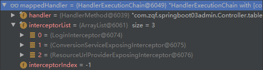

### 2. 在方法执行前、方法执行后、页面渲染后执行对应的拦截器方法

1. 首先顺序执行所有拦截器的 preHandle 方法    
	* 如果当前拦截器的 preHandle 方法返回为 true，则顺序执行下一个拦截器的 preHandle 方法
    * 如果当前拦截器的 preHandle 方法返回为 false，则直接倒序执行所有之前已经通过了的拦截器的 afterCompletion 方法
2. 如果任意一个拦截器的 preHandle 方法返回 false，则直接跳出，不执行方法；如果所有拦截器都返回 true，则执行目标方法
3. 目标方法执行完成后，倒序执行所有的 postHandle 方法
4. 上述任意一个步骤异常都会直接倒序执行 afterCompletion 方法
5. 页面渲染完成后，倒序执行 afterCompletion 方法

图示：

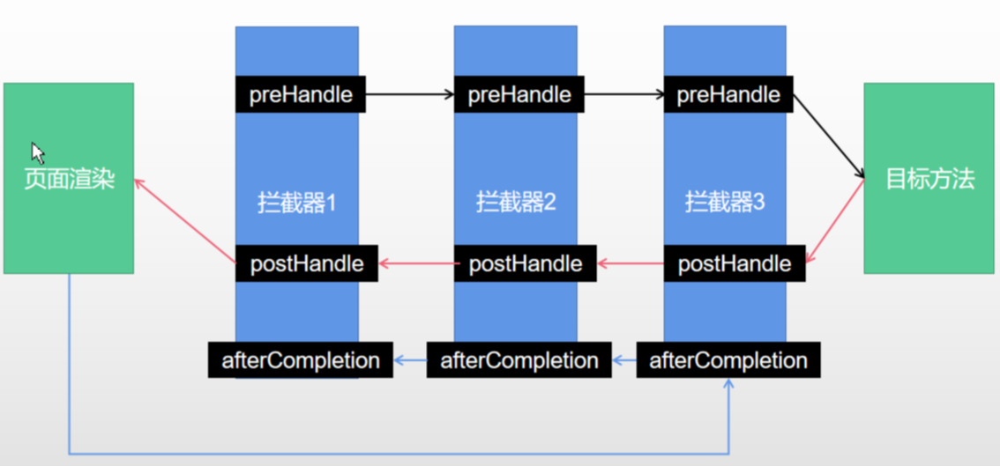

```java
    boolean applyPreHandle(HttpServletRequest request, HttpServletResponse response) throws Exception {
		for (int i = 0; i < this.interceptorList.size(); i++) {
			HandlerInterceptor interceptor = this.interceptorList.get(i);
			if (!interceptor.preHandle(request, response, this.handler)) {
				triggerAfterCompletion(request, response, null);
				return false;
			}
			this.interceptorIndex = i;
		}
		return true;
	}

	void applyPostHandle(HttpServletRequest request, HttpServletResponse response, @Nullable ModelAndView mv)
			throws Exception {

		for (int i = this.interceptorList.size() - 1; i >= 0; i--) {
			HandlerInterceptor interceptor = this.interceptorList.get(i);
			interceptor.postHandle(request, response, this.handler, mv);
		}
	}

	void triggerAfterCompletion(HttpServletRequest request, HttpServletResponse response, @Nullable Exception ex) {
		for (int i = this.interceptorIndex; i >= 0; i--) {
			HandlerInterceptor interceptor = this.interceptorList.get(i);
			try {
				interceptor.afterCompletion(request, response, this.handler, ex);
			}
			catch (Throwable ex2) {
				logger.error("HandlerInterceptor.afterCompletion threw exception", ex2);
			}
		}
	}
```

# 7. 文件上传

## 7.1 文件上传的使用

### 1. 对应表单

```html
<form role="form" th:action="@{/upload}" method="post" enctype="multipart/form-data">
                            <div class="form-group">
                                <label for="exampleInputEmail1">邮箱</label>
                                <input type="email" name="email" class="form-control" id="exampleInputEmail1" placeholder="Email">
                            </div>
                            <div class="form-group">
                                <label for="exampleInputPassword1">电话号码</label>
                                <input type="text" name="phone" class="form-control" id="exampleInputPassword1" placeholder="Telephone">
                            </div>
                            <div class="form-group">
                                <label for="exampleInputFile">头像</label>
                                <input type="file" name="headImg" id="exampleInputFile">
                            </div>
                            <div class="form-group">
                                <label for="exampleInputFile">照片</label>
                                <input type="file" name="photos" multiple>
                            </div>
                            <div class="checkbox">
                                <label>
                                    <input type="checkbox"> Check me out
                                </label>
                            </div>
                            <button type="submit" class="btn btn-primary">上传</button>
                        </form>
```

### 2. 对应 Controller

```java
package com.zqf.springboot03admin.Controller;

import ch.qos.logback.classic.spi.EventArgUtil;
import lombok.extern.slf4j.Slf4j;
import org.springframework.stereotype.Controller;
import org.springframework.web.bind.annotation.GetMapping;
import org.springframework.web.bind.annotation.PostMapping;
import org.springframework.web.bind.annotation.RequestParam;
import org.springframework.web.bind.annotation.RequestPart;
import org.springframework.web.multipart.MultipartFile;

import java.io.File;
import java.io.IOException;

@Controller
@Slf4j
public class formController {

    @GetMapping("/form_layouts")
    public String form_layouts() {
        return "Forms/form_layouts";
    }

    @PostMapping("/upload")
    public String upload(@RequestParam("email") String email,
                         @RequestParam("phone") String phone,
                         @RequestPart("headImg") MultipartFile headImg,
                         @RequestPart("photos") MultipartFile[] photos) throws IOException {
        log.info("接收到上传的信息为：邮箱={}，电话号码={}，头像={}，照片={}",
                email, phone, headImg, photos);
        // 将上传文件保存到服务器
        if (!headImg.isEmpty()) {
            String originalFilename = headImg.getOriginalFilename();
            headImg.transferTo(new File("D:\\BaiduNetdiskDownload\\文件上传目录\\" + originalFilename));
        }
        if (photos.length > 0) {
            for (MultipartFile photo : photos) {
                String originalFilename = photo.getOriginalFilename();
                photo.transferTo(new File("D:\\BaiduNetdiskDownload\\文件上传目录\\" + originalFilename));
            }
        }
        return "redirect:/main.html";
    }
}
```

## 7.2 文件上传原理

### 1. 文件上传自动配置类 MultipartAutoConfiguration

* 绑定了配置文件 MultipartProperties
* 自动配置好了文件上传解析器：StandardServletMultipartResolver multipartResolver
```java
@Configuration(proxyBeanMethods = false)
@ConditionalOnClass({Servlet.class, StandardServletMultipartResolver.class, MultipartConfigElement.class})
@ConditionalOnProperty(
    prefix = "spring.servlet.multipart",
    name = {"enabled"},
    matchIfMissing = true
)
@ConditionalOnWebApplication(type = Type.SERVLET)
@EnableConfigurationProperties({MultipartProperties.class})
public class MultipartAutoConfiguration {
    private final MultipartProperties multipartProperties;

    public MultipartAutoConfiguration(MultipartProperties multipartProperties) {
        this.multipartProperties = multipartProperties;
    }

    @Bean
    @ConditionalOnMissingBean({MultipartConfigElement.class, CommonsMultipartResolver.class})
    public MultipartConfigElement multipartConfigElement() {
        return this.multipartProperties.createMultipartConfig();
    }

    @Bean(name = {"multipartResolver"})
    @ConditionalOnMissingBean({MultipartResolver.class})
    public StandardServletMultipartResolver multipartResolver() {
        StandardServletMultipartResolver multipartResolver = new StandardServletMultipartResolver();
        multipartResolver.setResolveLazily(this.multipartProperties.isResolveLazily());
        return multipartResolver;
    }
}
```

### 2. 执行原理

#### 2.1 请求进来判断是否为文件上传请求

```java
protected void doDispatch(HttpServletRequest request, HttpServletResponse response) throws Exception {
		HttpServletRequest processedRequest = request;
		HandlerExecutionChain mappedHandler = null;
		boolean multipartRequestParsed = false;

		WebAsyncManager asyncManager = WebAsyncUtils.getAsyncManager(request);

		try {
			ModelAndView mv = null;
			Exception dispatchException = null;

			try {
			    // 判断是否为文件上传请求
				processedRequest = checkMultipart(request);
				multipartRequestParsed = (processedRequest != request);
```

#### 2.2 使用文件上传解析器判断并封装

使用 isMultipart 方法判断并将请求封装为 MultipartHttpServletRequest 请求

```java
protected HttpServletRequest checkMultipart(HttpServletRequest request) throws MultipartException {
		// 判断
		if (this.multipartResolver != null && this.multipartResolver.isMultipart(request)) {
			if (WebUtils.getNativeRequest(request, MultipartHttpServletRequest.class) != null) {
				if (request.getDispatcherType().equals(DispatcherType.REQUEST)) {
					logger.trace("Request already resolved to MultipartHttpServletRequest, e.g. by MultipartFilter");
				}
			}
			else if (hasMultipartException(request)) {
				logger.debug("Multipart resolution previously failed for current request - " +
						"skipping re-resolution for undisturbed error rendering");
			}
			else {
				try {// 重新封装成 MultipartHttpServletRequest
					return this.multipartResolver.resolveMultipart(request);
				}
				catch (MultipartException ex) {
					if (request.getAttribute(WebUtils.ERROR_EXCEPTION_ATTRIBUTE) != null) {
						logger.debug("Multipart resolution failed for error dispatch", ex);

					}
					else {
						throw ex;
					}
				}
			}
		}
		// If not returned before: return original request.
		return request;
	}
```

```
    public MultipartHttpServletRequest resolveMultipart(HttpServletRequest request) throws MultipartException {
        return new StandardMultipartHttpServletRequest(request, this.resolveLazily);
    }
```

#### 2.3 使用相应的参数解析器将请求中的文件内容封装成 MulitipartFile

#### 2.4 将请求 request 中的文件信息封装成一个 Map<String, MulitipartFile>

#### 2.5 使用 FileCopyUtils 工具类实现文件流的拷贝

# 8. 异常处理

## 8.1 异常处理的默认规则

在默认情况下，SpringBoot 提供 `/error` 处理所有错误的映射

* 对于机器客户端，它生成一个 JSON 响应，其中包括错误、状态码、异常消息等详细信息

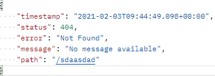

* 对于浏览器客户端，则相应一个 whitelabel 的错误视图，以 HTML 格式呈现相同的内容

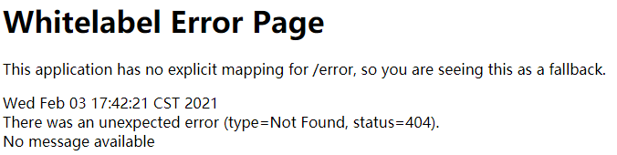

要想定制错误页面，将错误信息的页面放在静态资源下的 error 文件夹中，页面就会被自动解析

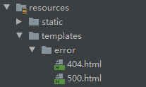

## 8.2 异常处理的自动配置

所有异常处理的自动配置规则在 ErrorMvcAutoConfiguration 类中

自动配置类在容器中注册了以下几个重要的组件：

### 1. DefaultErrorAttributes -- id: errorAttributes

该组件定义了错误页面中可以包含哪些数据

```java
public Map<String, Object> getErrorAttributes(WebRequest webRequest, ErrorAttributeOptions options) {
        Map<String, Object> errorAttributes = this.getErrorAttributes(webRequest, options.isIncluded(Include.STACK_TRACE));
        if (Boolean.TRUE.equals(this.includeException)) {
            options = options.including(new Include[]{Include.EXCEPTION});
        }
        if (!options.isIncluded(Include.EXCEPTION)) {
            errorAttributes.remove("exception");
        }
        if (!options.isIncluded(Include.STACK_TRACE)) {
            errorAttributes.remove("trace");
        }
        if (!options.isIncluded(Include.MESSAGE) && errorAttributes.get("message") != null) {
            errorAttributes.put("message", "");
        }
        if (!options.isIncluded(Include.BINDING_ERRORS)) {
            errorAttributes.remove("errors");
        }
        return errorAttributes;
    }

    /** @deprecated */
    @Deprecated
    public Map<String, Object> getErrorAttributes(WebRequest webRequest, boolean includeStackTrace) {
        Map<String, Object> errorAttributes = new LinkedHashMap();
        errorAttributes.put("timestamp", new Date());
        this.addStatus(errorAttributes, webRequest);
        this.addErrorDetails(errorAttributes, webRequest, includeStackTrace);
        this.addPath(errorAttributes, webRequest);
        return errorAttributes;
    }
```

### 2. BasicErrorController -- id: basicErrorController

该组件处理默认 `/error` 路径的请求，最终返回一个携带错误信息的模型和视图 (new ModelAndView("error", model);)

```java
    public ModelAndView errorHtml(HttpServletRequest request, HttpServletResponse response) {
        HttpStatus status = this.getStatus(request);
        Map<String, Object> model = Collections.unmodifiableMap(this.getErrorAttributes(request, this.getErrorAttributeOptions(request, MediaType.TEXT_HTML)));
        response.setStatus(status.value());
        ModelAndView modelAndView = this.resolveErrorView(request, response, status, model);
        return modelAndView != null ? modelAndView : new ModelAndView("error", model);
    }
```

### 3. View -- id: defaultErrorView

该组件响应默认错误页

### 4. BeanNameViewResolver -- id: beanNameViewResolver

该组件是一个视图解析器，其作用是根据返回的视图名作为组件的 id 去容器中找 View 对象

```java
@Override
	@Nullable
	public View resolveViewName(String viewName, Locale locale) throws BeansException {
		ApplicationContext context = obtainApplicationContext();
		if (!context.containsBean(viewName)) {
			return null;
		}
		if (!context.isTypeMatch(viewName, View.class)) {
			if (logger.isDebugEnabled()) {
				logger.debug("Found bean named '" + viewName + "' but it does not implement View");
			}
			return null;
		}
		return context.getBean(viewName, View.class);
	}
```

### 5. DefaultErrorViewResolver -- id: conventionErrorViewResolver

当发生错误时，该组件会以 HTTP 状态码作为视图页地址 viewName，找到真正的页面

即自动找到我们放在 error 文件夹下的 4xx.html / 5xx.html

```java
    private ModelAndView resolve(String viewName, Map<String, Object> model) {
        String errorViewName = "error/" + viewName;
        TemplateAvailabilityProvider provider = this.templateAvailabilityProviders.getProvider(errorViewName, this.applicationContext);
        return provider != null ? new ModelAndView(errorViewName, model) : this.resolveResource(errorViewName, model);
    }

    private ModelAndView resolveResource(String viewName, Map<String, Object> model) {
        String[] var3 = this.resources.getStaticLocations();
        int var4 = var3.length;

        for(int var5 = 0; var5 < var4; ++var5) {
            String location = var3[var5];

            try {
                Resource resource = this.applicationContext.getResource(location);
                resource = resource.createRelative(viewName + ".html");
                if (resource.exists()) {
                    return new ModelAndView(new DefaultErrorViewResolver.HtmlResourceView(resource), model);
                }
            } catch (Exception var8) {
            }
        }

        return null;
    }
```

## 8.3 异常处理的步骤流程

### 1. 在执行目标方法或者目标方法的运行期间，有任何异常都会被 catch，并且标注当前请求结束

```java
	protected void doDispatch(HttpServletRequest request, HttpServletResponse response) throws Exception {
		// 部分代码省略...
		try {
			ModelAndView mv = null;
			Exception dispatchException = null;

			try {
				processedRequest = checkMultipart(request);
				multipartRequestParsed = (processedRequest != request);

				mappedHandler = getHandler(processedRequest);
				if (mappedHandler == null) {
					noHandlerFound(processedRequest, response);
					return;
				}
                
				HandlerAdapter ha = getHandlerAdapter(mappedHandler.getHandler());

				// 部分代码省略...

				// 真正执行方法，执行过程中有任何异常都会被捕获
				mv = ha.handle(processedRequest, response, mappedHandler.getHandler());

				if (asyncManager.isConcurrentHandlingStarted()) {
					return;
				}

				applyDefaultViewName(processedRequest, mv);
				mappedHandler.applyPostHandle(processedRequest, response, mv);
			}
			catch (Exception ex) {
				// 捕获异常后，记录异常
				dispatchException = ex;
			}
			catch (Throwable err) {
				dispatchException = new NestedServletException("Handler dispatch failed", err);
			}
			// 2. 将异常 dispatchException 传入，处理派发结果
			processDispatchResult(processedRequest, response, mappedHandler, mv, dispatchException);
		}
		catch (Exception ex) {
			triggerAfterCompletion(processedRequest, response, mappedHandler, ex);
		}
		catch (Throwable err) {
			triggerAfterCompletion(processedRequest, response, mappedHandler,
					new NestedServletException("Handler processing failed", err));
		}
```

### 2. 将异常 dispatchException 传入，处理派发结果

异常信息：

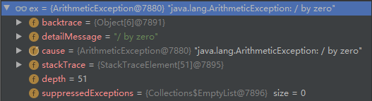

```java
	private void processDispatchResult(HttpServletRequest request, HttpServletResponse response,
			@Nullable HandlerExecutionChain mappedHandler, @Nullable ModelAndView mv,
			@Nullable Exception exception) throws Exception {

		boolean errorView = false;

		if (exception != null) {
			if (exception instanceof ModelAndViewDefiningException) {
				logger.debug("ModelAndViewDefiningException encountered", exception);
				mv = ((ModelAndViewDefiningException) exception).getModelAndView();
			}
			else {
				Object handler = (mappedHandler != null ? mappedHandler.getHandler() : null);
              // 3. 处理异常
				mv = processHandlerException(request, response, handler, exception);
				errorView = (mv != null);
			}
		}
		// 部分代码省略...
```

### 3. 处理异常

SpringBoot 默认的异常处理器

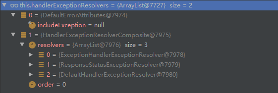

* 其中 DefaultErrorAttributes 先来处理异常，将异常信息保存在 request 域，并返回 null
* 当默认的异常处理器均不能池陆异常时，异常会被抛出    
	* 底层会发出 /error 请求，该请求最终被底层的 BasicErrorController 处理
	
    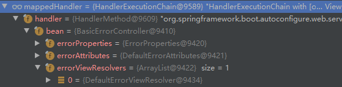
	
    * 解析视图错误：遍历所有的 errorViewResolvers，看谁能解析
    * 默认的 DefaultErrorViewResolvers，其作用是吧响应状态码作为错误页的地址：error/500.html
    * 模版引擎最终响应这个页面 error/500.html
	
```java
	@Nullable
	protected ModelAndView processHandlerException(HttpServletRequest request, HttpServletResponse response,
			@Nullable Object handler, Exception ex) throws Exception {

		request.removeAttribute(HandlerMapping.PRODUCIBLE_MEDIA_TYPES_ATTRIBUTE);

		// 遍历所有的异常处理器，看谁能处理当前异常
		ModelAndView exMv = null;
		if (this.handlerExceptionResolvers != null) {
			for (HandlerExceptionResolver resolver : this.handlerExceptionResolvers) {
				exMv = resolver.resolveException(request, response, handler, ex);
				if (exMv != null) {
					break;
				}
			}
		}
		if (exMv != null) {
			if (exMv.isEmpty()) {
				request.setAttribute(EXCEPTION_ATTRIBUTE, ex);
				return null;
			}
			if (!exMv.hasView()) {
				String defaultViewName = getDefaultViewName(request);
				if (defaultViewName != null) {
					exMv.setViewName(defaultViewName);
				}
			}
			if (logger.isTraceEnabled()) {
				logger.trace("Using resolved error view: " + exMv, ex);
			}
			else if (logger.isDebugEnabled()) {
				logger.debug("Using resolved error view: " + exMv);
			}
			WebUtils.exposeErrorRequestAttributes(request, ex, getServletName());
			return exMv;
		}
		// 默认的异常处理器无法处理当前异常，异常会被抛出
		throw ex;
	}
```

## 8.4 定制错误处理逻辑

### 1. 自定义错误页

error/4xx.html

error/5xx.html

如果有精确的错误状态码，就匹配精确页面；如果没有就触发白页

### 2. @ControllerAdvice + ExceptionHandler 处理全局异常

底层是 ExceptionHandlerExceptionResolver 支持的

```java
package com.zqf.springboot03admin.Exception;

import lombok.extern.slf4j.Slf4j;
import org.springframework.web.bind.annotation.ControllerAdvice;
import org.springframework.web.bind.annotation.ExceptionHandler;

@Slf4j
@ControllerAdvice
public class GlobalExceptionHandler {

    // 自定义处理全局异常（数学计算异常）
    @ExceptionHandler(value = {ArithmeticException.class})
    public String handleArithException(Exception ex) {
        log.info("当前异常为{}", ex);
        return "index";
    }

}
```

### 3. @ResponseStatus + 自定义异常

底层是 ResponseStatuesExceptionResolver 支持的，其将 `@ResponseStatus` 注解的信息在底层调用 response.sendError(statuesCode, resolverReason)，最终由 tomcat 发送 /error 请求

```java
package com.zqf.springboot03admin.Exception;

import org.springframework.http.HttpStatus;
import org.springframework.web.bind.annotation.ResponseStatus;

@ResponseStatus(value = HttpStatus.FORBIDDEN, reason = "用户数量太多")
// 自定义异常
public class UserTooManyException extends RuntimeException{

    public UserTooManyException(){};
    public UserTooManyException(String message) {
        super(message);
    }

}
```

```java
    @GetMapping("/dynamic_table")
    public String dynamic_table(HttpSession session, Model model) {
        List<User> users = Arrays.asList(new User("zzz", "123", "1111111", "1@163.com"),
                new User("qqq", "456", "2222222", "2@128.com"),
                new User("fff", "789", "3333333", "3@qq.com"),
                new User("nnn", "101", "4444444", "4@edu.com"));
        model.addAttribute("users", users);
        // 人为制造异常（自定义的“用户过多”异常）
        if (users.size() > 3) throw new UserTooManyException();
        return "/Tables/dynamic_table";
    }
```

此处选用的错误状态码为 403，/error 文件夹下没有对应匹配的页面，故返回空白页：

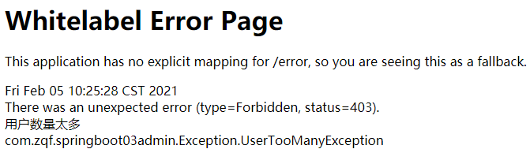

### 4. Spring 底层异常实现: response.sendError()

HttpServletResponse response

### 5. 自定义 HandlerExceptionResolver

注意优先级的设置！

```java
package com.zqf.springboot03admin.Exception;

import org.springframework.core.Ordered;
import org.springframework.core.annotation.Order;
import org.springframework.stereotype.Component;
import org.springframework.web.servlet.HandlerExceptionResolver;
import org.springframework.web.servlet.ModelAndView;

import javax.servlet.http.HttpServletRequest;
import javax.servlet.http.HttpServletResponse;
import java.io.IOException;

@Order(value = Ordered.HIGHEST_PRECEDENCE) // 设置优先级，数字越小优先级越高
// 如果不设置优先级的话，默认优先级低于默认的异常处理器
@Component
public class MyHandlerExceptionResolver implements HandlerExceptionResolver {
    @Override
    public ModelAndView resolveException(HttpServletRequest request,
                                         HttpServletResponse response,
                                         Object handler, Exception ex) {
        try {
            response.sendError(503, "私人订制的错误");
        } catch (IOException e) {
            e.printStackTrace();
        }
        return new ModelAndView();
    }
}
```

配置完成后 HandlerExceptionResolver：自定义的处理器优先级设置为最高，优先遍历

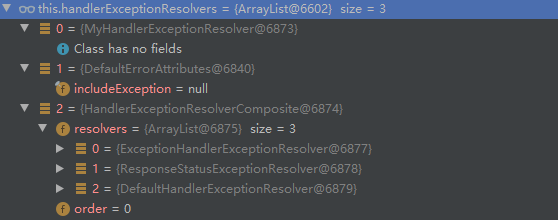

页面效果：

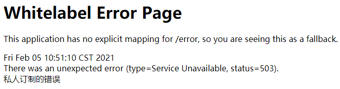

# 9. Web 原生组件的注入

## 9.1 使用 Servlet API

### @ServletComponentScan + @WebServlet

该方法响应的页面反射直接响应，不经过 spring 的拦截器

```java
@ServletComponentScan(basePackages = "com.zqf.springboot03admin") // 设置扫描包
@SpringBootApplication
public class SpringBoot03AdminApplication {

    public static void main(String[] args) {
        SpringApplication.run(SpringBoot03AdminApplication.class, args);
    }
    
}
```

```java
@WebServlet(urlPatterns = "/servlet") // 设置响应的请求地址
public class MyServlet extends HttpServlet {
    @Override
    protected void doGet(HttpServletRequest req, HttpServletResponse resp) throws ServletException, IOException {
        resp.getWriter().write("Hello，MyServlet");
    }
}
```

### @ServletComponentScan + @WebFilter

```java
@ServletComponentScan(basePackages = "com.zqf.springboot03admin") // 设置扫描包
@SpringBootApplication
public class SpringBoot03AdminApplication {

    public static void main(String[] args) {
        SpringApplication.run(SpringBoot03AdminApplication.class, args);
    }
    
}
```

```java
@Slf4j
@WebFilter(urlPatterns = {"/servlet"})
public class MyFilter implements Filter {
    @Override
    public void init(FilterConfig filterConfig) throws ServletException {
        log.info("MyFilter初始化...");
    }

    @Override
    public void destroy() {
        log.info("MyFilter销毁...");
    }

    @Override
    public void doFilter(ServletRequest servletRequest, ServletResponse servletResponse, FilterChain filterChain) throws IOException, ServletException {
        log.info("MyFilter工作...");
        filterChain.doFilter(servletRequest, servletResponse);
    }
}
```

### @ServletComponentScan + @WebListener

```java
@ServletComponentScan(basePackages = "com.zqf.springboot03admin") // 设置扫描包
@SpringBootApplication
public class SpringBoot03AdminApplication {

    public static void main(String[] args) {
        SpringApplication.run(SpringBoot03AdminApplication.class, args);
    }
    
}
```

```java
@Slf4j
@WebListener
public class MyListener implements ServletContextListener {
    @Override
    public void contextInitialized(ServletContextEvent sce) {
        log.info("MyListener 监听到项目初始化完成...");
    }

    @Override
    public void contextDestroyed(ServletContextEvent sce) {
        log.info("MyListener 监听到项目销毁...");
    }
}
```

## 9.2 使用 RegistrationBean

不推荐使用

# 10. 嵌入式 Servlet 容器

## 10.1 嵌入式 Servlet 容器的切换

默认支持的 WebServert ：Tomcat, Jetty, or Undertow

切换服务器，只需要在依赖文件中移除默认的 tomcat 依赖，再引入新的依赖即可（一般不推荐）

原理：

* SpringBoot 应用启动，发现当前应用是一个 web 应用，在 web 场景包中导入了 tomcat
* web 应用会创建一个 web 版的 ioc 容器 ServletWebServerApplicationContext，该容器在启动的时候寻找 ServletWebServerFactory（Servlet 的 web 服务器工厂--> Servlet 的 web 服务器）
* Spring 底层默认有许多 WebServer 工厂：TomcatServletWebServerFactory, JettyServletWebServerFactory, or UndertowServletWebServerFactory
* 底层直接会有一个自动配置类ServletWebServerFactoryAutoConfiguration。该类导入了ServletWebServerFactoryConfiguration（配置类）。该配置类根据动态判断系统中到底导入了那个Web服务器的包。
（默认是web-starter导入tomcat包，容器中就有 TomcatServletWebServerFactory）
* TomcatServletWebServerFactory 创建出 Tomcat 服务器并启动，TomcatWebServer 的构造器拥有初始化方法initialize---this.tomcat.start()
* 内嵌服务器，就是手动把启动服务器的代码调用（tomcat核心jar包存在）

## 10.2 定制 Servlet 容器

### 1. 修改配置文件(推荐使用)

### 2. 实现 `WebServerFactoryCustomizer<ConfigurableServletWebServerFactory>`

xxxxCustomizer 称定制化器，可以改变 xxxx 的默认规则

```java
import org.springframework.boot.web.server.WebServerFactoryCustomizer;
import org.springframework.boot.web.servlet.server.ConfigurableServletWebServerFactory;
import org.springframework.stereotype.Component;
@Componentpublic
class CustomizationBean implements WebServerFactoryCustomizer<ConfigurableServletWebServerFactory> {
    @Override
    public void customize(ConfigurableServletWebServerFactory server) {
        server.setPort(9000);
    }
}
```

### 3. 直接自定义 ConfigurableServletWebServerFactory

# 11. 定制化原理

## 11.1 定制化的常见方式

### 1. 修改配置文件（推荐）

### 2. 编写自定义的配置类 xxxConfiguration + @Bean 替换、增加容器中的默认组件

```java
@Configuration(proxyBeanMethods = false)
public class WebConfig {
// 修改 Rest 风格的默认字符（默认为"_method"）
    @Bean
    public HiddenHttpMethodFilter hiddenHttpMethodFilter(){
        HiddenHttpMethodFilter methodFilter = new HiddenHttpMethodFilter();
        methodFilter.setMethodParam("_m");
        return methodFilter;
    }
}
```

### 3. Web 应用编写一个配置类实现 WebMvcConfigurer 即可实现定制化 web 功能 + @Bean 扩展容器中的默认组件（重点掌握和使用）

```java
@Configuration
public class MyWebConfig implements WebMvcConfigurer {
// 扩展一个登录拦截器
    @Override
    public void addInterceptors(InterceptorRegistry registry) {
        registry.addInterceptor(new LoginInterceptor()).
                addPathPatterns("/**"). // 设置要拦截哪些请求
                excludePathPatterns("/", "/login", "/css/**", "/fonts/**", "/images/**", "/js/**"); // 设置放过哪些请求
    }
}
```

### 4. @EnableWebMvc + WebMvcConfigurer + @Bean 全面接管SpringMVC，所有规则全部自己重新配置以实现定制和扩展功能

原理：

* WebMvcAutoConfiguration  默认的 SpringMVC 的自动配置功能类。配置静态资源、欢迎页.....
* 一旦使用 @EnableWebMvc 会 `@Import(DelegatingWebMvcConfiguration.class)`
* DelegatingWebMvcConfiguration 只保证 SpringMVC 最基本的使用    
	* 把所有系统中的 WebMvcConfigurer 拿过来。所有功能的定制都是这些 WebMvcConfigurer 合起来一起生效
    * 自动配置了一些非常底层的组件，这些组件依赖的组件都是从容器中获取
    * public class DelegatingWebMvcConfiguration extends WebMvcConfigurationSupport 说明 DelegatingWebMvcConfiguration 继承了 WebMvcConfigurationSupport 类

* WebMvcAutoConfiguration 里面的配置要能生效 必须  `@ConditionalOnMissingBean(WebMvcConfigurationSupport.class)`
* `@EnableWebMvc` 添加了 DelegatingWebMvcConfiguration 类，导致了 WebMvcAutoConfiguration 失效

## 11.2 原理分析流程

场景starter --》 xxxxAutoConfiguration --》 导入xxx组件 --》 绑定xxxProperties --》 绑定配置文件项

