# 1. Eureka 基础

## 1.1 什么是服务治理

Spring Cloud 封装了 Netflix 公司开发的 Eureka 模块实现服务治理。

在传统的 RPC 远程调用框架中，每个服务与服务之间的依赖关系比较复杂，管理比较复杂，所以需要使用服务治理，管理服务与服务之间的依赖关系，可以实现服务调用、负载均衡、容错等...实现服务的发现与注册。

## 1.2 什么是服务的发现与注册

Eureka采用了CS的设计架构，Eureka Sever作为服务注册功能的服务器，它是服务注册中心。而系统中的其他微服务，使用Eureka的客户端连接到 Eureka Server并维持心跳连接。这样系统的维护人员就可以通过Eureka Server来监控系统中各个微服务是否正常运行。

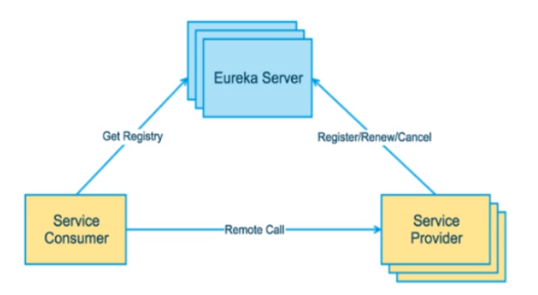

## 1.3 Eureka 的两个组件

* Eureka Server提供服务注册服务
* EurekaClient通过注册中心进行访问

# 2. EurekaServer构建

## 2.1 创建工程：cloud-eureka-server7001

## 2.2 修改POM

```xml
<?xml version="1.0" encoding="UTF-8"?>
<project xmlns="http://maven.apache.org/POM/4.0.0"
         xmlns:xsi="http://www.w3.org/2001/XMLSchema-instance"
         xsi:schemaLocation="http://maven.apache.org/POM/4.0.0 http://maven.apache.org/xsd/maven-4.0.0.xsd">
    <parent>
        <artifactId>springcloud</artifactId>
        <groupId>com.zqf.springcloud</groupId>
        <version>1.0-SNAPSHOT</version>
    </parent>
    <modelVersion>4.0.0</modelVersion>

    <artifactId>cloud-eureka-server7001</artifactId>

    <dependencies>
        <!--eureka-server-->
        <dependency>
            <groupId>org.springframework.cloud</groupId>
            <artifactId>spring-cloud-starter-netflix-eureka-server</artifactId>
        </dependency>
        <!-- 引入自己定义的api通用包 -->
        <dependency>
            <groupId>com.zqf.springcloud</groupId>
            <artifactId>cloud-api-commons</artifactId>
            <version>1.0-SNAPSHOT</version>
        </dependency>
        <!--boot web actuator-->
        <dependency>
            <groupId>org.springframework.boot</groupId>
            <artifactId>spring-boot-starter-web</artifactId>
        </dependency>
        <dependency>
            <groupId>org.springframework.boot</groupId>
            <artifactId>spring-boot-starter-actuator</artifactId>
        </dependency>
        <!--一般通用配置-->
        <dependency>
            <groupId>org.springframework.boot</groupId>
            <artifactId>spring-boot-devtools</artifactId>
            <scope>runtime</scope>
            <optional>true</optional>
        </dependency>
        <dependency>
            <groupId>org.projectlombok</groupId>
            <artifactId>lombok</artifactId>
        </dependency>
        <dependency>
            <groupId>org.springframework.boot</groupId>
            <artifactId>spring-boot-starter-test</artifactId>
            <scope>test</scope>
        </dependency>
        <dependency>
            <groupId>junit</groupId>
            <artifactId>junit</artifactId>
        </dependency>
    </dependencies>

</project>
```

## 2.3 配置yml

```yml
server:
  port: 7001

eureka:
  instance:
    hostname: localhost # eureka服务端的实例名称
  client:
    # false 表示不向注册中心注册自己
    register-with-eureka: false
    # false 表示自己就是注册中心，职责是维护服务器实例，并不需要去检索服务
    fetch-registry: false
    # 设置与 eureka server交互的地址查询服务和注册服务都需要依赖这个地址
    service-url:
      defaultZone: http://${eureka.instance.hostname}:${server.port}/eureka/
```

## 2.4 主启动类

```java
package com.zqf.springcloud;

import org.springframework.boot.SpringApplication;
import org.springframework.boot.autoconfigure.SpringBootApplication;
import org.springframework.cloud.netflix.eureka.server.EnableEurekaServer;

@SpringBootApplication
@EnableEurekaServer
public class EurekaMain7001 {
    public static void main(String[] args) {
        SpringApplication.run(EurekaMain7001.class, args);
    }
}

```

## 2.5 运行测试

启动项目，访问 `http://localhost:7001/`

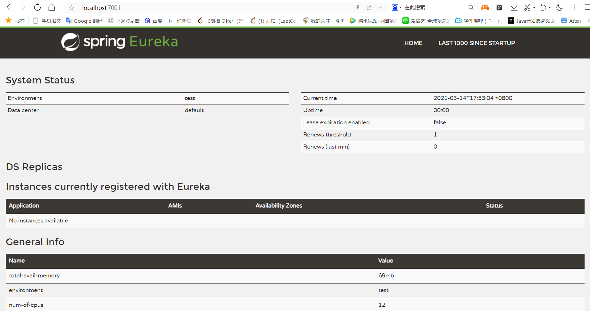

# 3. 支付微服务8001入驻EurekaServer

将EurekaClient 端 cloud-provider-payment8001 注册到 EurekaServer 称为提供者

## 3.1 修改POM

```xml
        <!--添加 eureka-client-->
        <dependency>
            <groupId>org.springframework.cloud</groupId>
            <artifactId>spring-cloud-starter-netflix-eureka-client</artifactId>
        </dependency>
```

## 3.2 修改配置文件yml

```yml
# 添加下述配置
eureka:
  client:
    # 表示是否将自己注册进 Eureka-server，默认为true
    fetch-registry: true
    # 是否从 Eureka-server 住区已有的注册信息，默认为true；单节点无所谓，集群必须设置为true
    register-with-eureka: true
    service-url:
      defaultZone: http://localhost:7001/eureka
```

## 3.3 修改主启动类

```java
package com.zqf.springcloud;

import org.springframework.boot.SpringApplication;
import org.springframework.boot.autoconfigure.SpringBootApplication;
import org.springframework.cloud.netflix.eureka.EnableEurekaClient;

@SpringBootApplication
@EnableEurekaClient // 添加该注解
public class PaymentMain001 {
    public static void main(String[] args) {
        SpringApplication.run(PaymentMain001.class, args);
    }
}

```

## 3.4 启动测试

浏览器访问：`http://localhost:7001/`

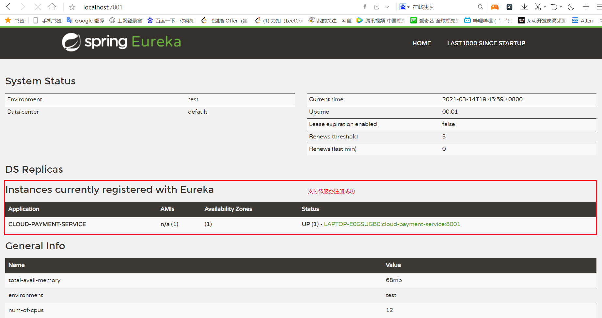

# 4. 订单微服务80入驻进EurekaServer

## 4.1 修改POM

## 4.2 修改配置yml

## 4.3 修改主启动类

## 4.4 启动测试

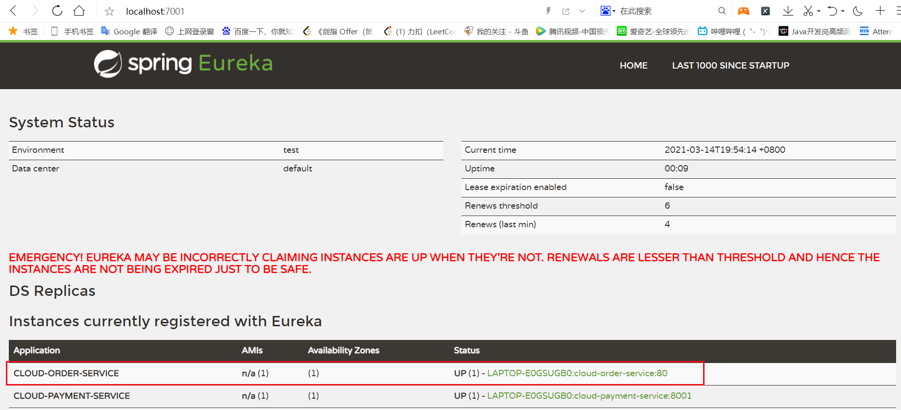

# 5. Eureka 集群原理

采用多个 Eureka 服务器进行服务的注册与发现，防止一台服务器宕机而引起整个系统瘫痪，保证高可用。

核心原理：**互相注册，相互守望**

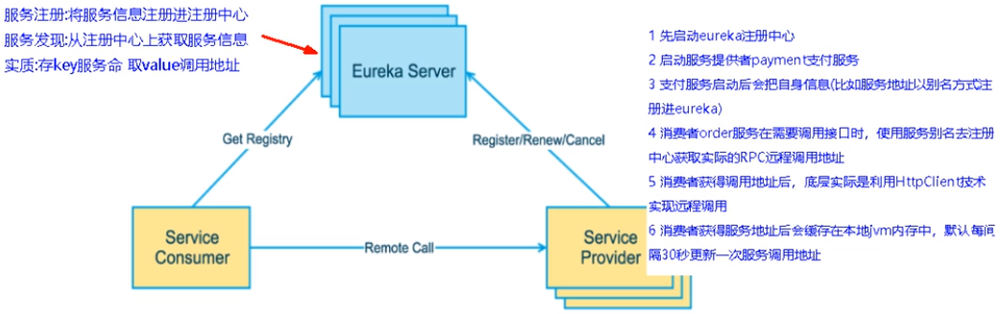

# 6. Eurake 集群搭建

## 6.1 创建项目 cloud-eureka-server7002

操作与构建 cloud-eureka-server7001 相同

## 6.2 修改windows映射配置

找到`C:\Windows\System32\drivers\etc`路径下的hosts文件，修改映射配置添加进hosts文件

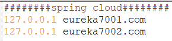

## 6.3 修改配置文件yml

7001

```yml
server:
  port: 7001

eureka:
  instance:
    hostname: eureka7001.com # eureka服务端的实例名称
  client:
    # false 表示不向注册中心注册自己
    register-with-eureka: false
    # false 表示自己就是注册中心，职责是维护服务器实例，并不需要去检索服务
    fetch-registry: false
    # 设置与 eureka server交互的地址查询服务和注册服务都需要依赖这个地址
    service-url:
      # 集群指向其他的eureka
      defaultZone: http://eureka7002.com:7002/eureka
```

7002

```yml
server:
  port: 7002

eureka:
  instance:
    hostname: eureka7002.com # eureka服务端的实例名称
  client:
    # false 表示不向注册中心注册自己
    register-with-eureka: false
    # false 表示自己就是注册中心，职责是维护服务器实例，并不需要去检索服务
    fetch-registry: false
    # 设置与 eureka server交互的地址查询服务和注册服务都需要依赖这个地址
    service-url:
      # 集群指向其他的eureka
      defaultZone: http://eureka7001.com:7001/eureka
```

## 6.4 订单、支付微服务注册进eureka

修改订单微服务的配置文件 application.yml

```yml
server:
  port: 80

spring:
  application:
    name: cloud-order-service

eureka:
  client:
    # 表示是否将自己注册进 Eureka-server，默认为true
    fetch-registry: true
    # 是否从 Eureka-server 住区已有的注册信息，默认为true；单节点无所谓，集群必须设置为true
    register-with-eureka: true
    service-url:
      defaultZone: http://eureka7001.com:7001/eureka, http://eureka7002.com:7002/eureka
```

修改支付微服务的配置文件 application.yml

```yml
server:
  port: 8001

spring:
  application:
    name: cloud-payment-service
  datasource:
    type: com.alibaba.druid.pool.DruidDataSource   # 数据源类型
    driver-class-name: com.mysql.jdbc.Driver       # MySQL驱动包
    url: jdbc:mysql://localhost:3306/springcloud?serverTimezone=GMT%2B8
    username: root
    password: 961231zqf

mybatis:
  mapper-locations: classpath:mapper/*.xml
  type-aliases-package: com.zqf.springcloud.entities

eureka:
  client:
    # 表示是否将自己注册进 Eureka-server，默认为true
    fetch-registry: true
    # 是否从 Eureka-server 住区已有的注册信息，默认为true；单节点无所谓，集群必须设置为true
    register-with-eureka: true
    service-url:
      defaultZone: http://eureka7001.com:7001/eureka, http://eureka7002.com:7002/eureka
```

## 6.5 启动测试

`http://localhost:7001/`

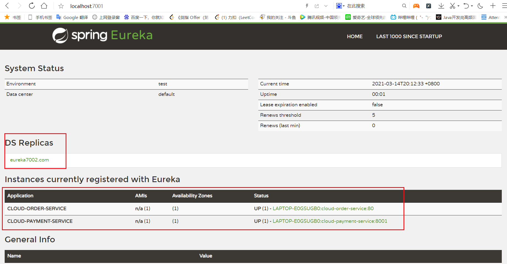

`http://localhost:7002/`

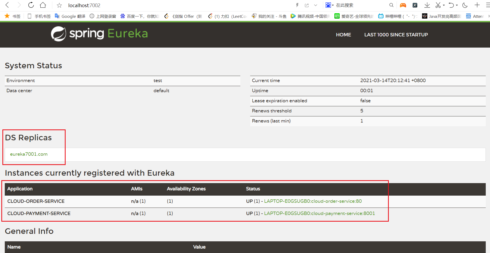

# 7. 支付微服务集群配置

## 7.1 创建cloud-provicer-payment8002

参考 cloud-provicer-payment8001 完成集群配置

在 controller 中添加一个端口号，指示当前服务的端口，区分两个支付微服务

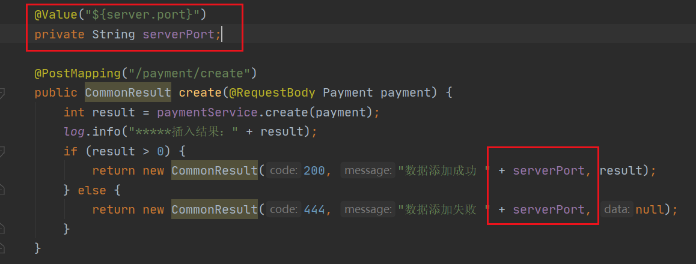

启动支付微服务 8001 与 8002，查看是否注册成功

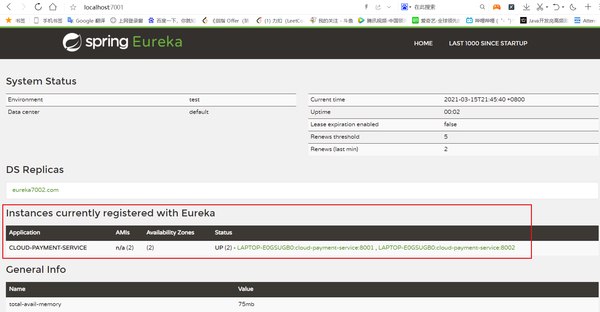

## 7.2 配置负载均衡

开启所有服务，测试功能

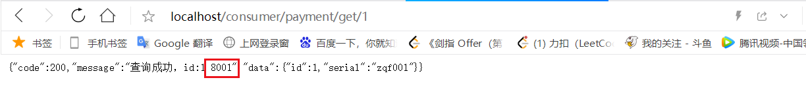

发现无论访问多少次，都是 支付微服务8001 在提供服务。解决：配置负载均衡

首先修改 cloud-consumer-order80订单服务 访问地址不能写死

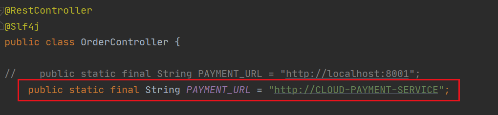

然后修改 cloud-consumer-order80订单服务 中的配置类，添加负载均衡的注解

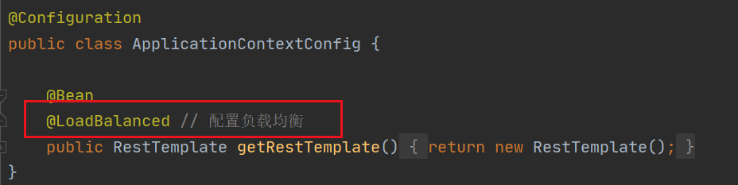

测试：多次访问，交替使用两个支付微服务

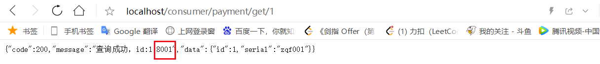

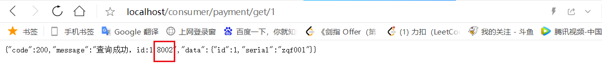

# 8. actuator微服务改善

修改主机名：

```yml
eureka:
  client:
    # 表示是否将自己注册进 Eureka-server，默认为true
    fetch-registry: true
    # 是否从 Eureka-server 住区已有的注册信息，默认为true；单节点无所谓，集群必须设置为true
    register-with-eureka: true
    service-url:
      defaultZone: http://eureka7001.com:7001/eureka, http://eureka7002.com:7002/eureka
  instance:
    instance-id: payment8002 # 设置微服务的名称
    prefer-ip-address: true # 配置访问信息有 ip 提示
```

测试：

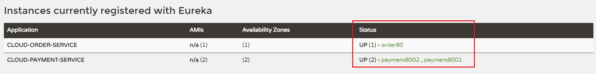

# 9. 服务发现Discovery

对于注册进eureka的服务，可以使用服务发现功能来获得该服务的信息

修改 cloud-provider-payment8001 的 Controller，添加新页面响应

```java
@Resource
    private DiscoveryClient discoveryClient; // org.springframework.cloud.client.discovery.DiscoveryClient 包下的！

    @GetMapping("/payment/discovery")
    public Object discovery() {
        List<String> services = discoveryClient.getServices();
        for (String element : services) {
            log.info("*****element: "+element);
        }

        List<ServiceInstance> instances = discoveryClient.getInstances("CLOUD-PAYMENT-SERVICE");
        for (ServiceInstance instance : instances) {
            log.info(instance.getServiceId()+"\t"+instance.getHost()+"\t"+instance.getPort()+"\t"+instance.getUri());
        }

        return this.discoveryClient;
    }
```

修改 cloud-provider-payment8001 主启动类，开启服务发现

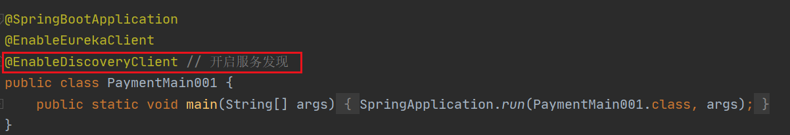

测试：

后台输出

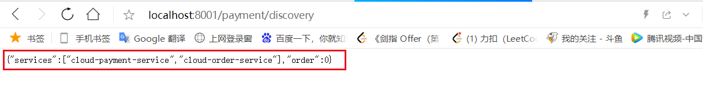

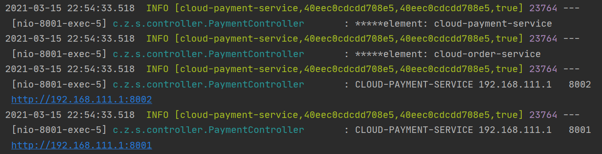

# 10. Eureka自我保护

## 10.1 概述

保护模式主要用于一组客户端和 eureka server 之间存在网络分区场景下的保护。一旦进入保护模式， eureka server 将会尝试保护其服务注册表中的信息，不再删除服务注册表中的数据。

如果在Eureka Server的首页看到以下这段提示，则说明Eureka进入了保护模式:

`EMERGENCY! EUREKA MAY BE INCORRECTLY CLAIMING INSTANCES ARE UP WHEN THEY’RE NOT. RENEWALS ARE LESSER THANTHRESHOLD AND HENCE THE INSTANCES ARE NOT BEING EXPIRED JUSTTO BE SAFE`

## 10.2 为什么会有保护机制

为了 eureka client 的正常运行，防止客户端在与 eureka server 网络不通畅的情况下被立即删除

## 10.3 什么是自我保护机制

默认情况下 eureka client 会定时向 eureka server 端发送心跳包

如果服务端在一定时间内(默认90s)没有收到客户端的心跳包，便会直接从服务注册列表中剔除该服务。

但是如果在短时间(默认90s)中丢失了大量的服务实例的心跳，此时服务端就会开启自我保护机制，不会立即剔除该服务。（保护机制就是为防止因网络问题而立即将服务剔除，是一种对网络异常的安全保护措施）

## 10.4 禁止自我保护

修改 eureka7001 的配置文件

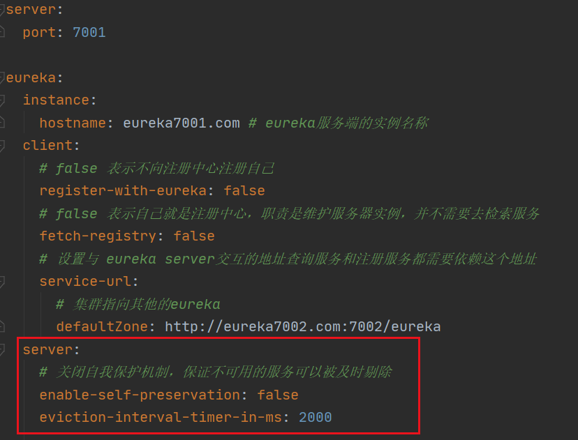

修改 cloud-provider-payment8001 的配置文件

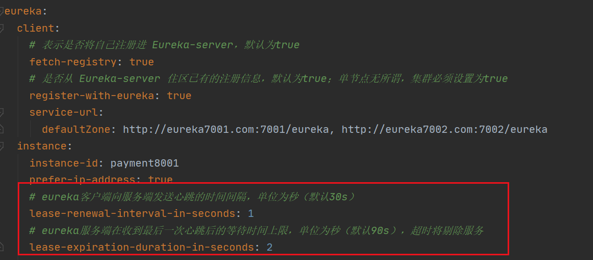

测试：

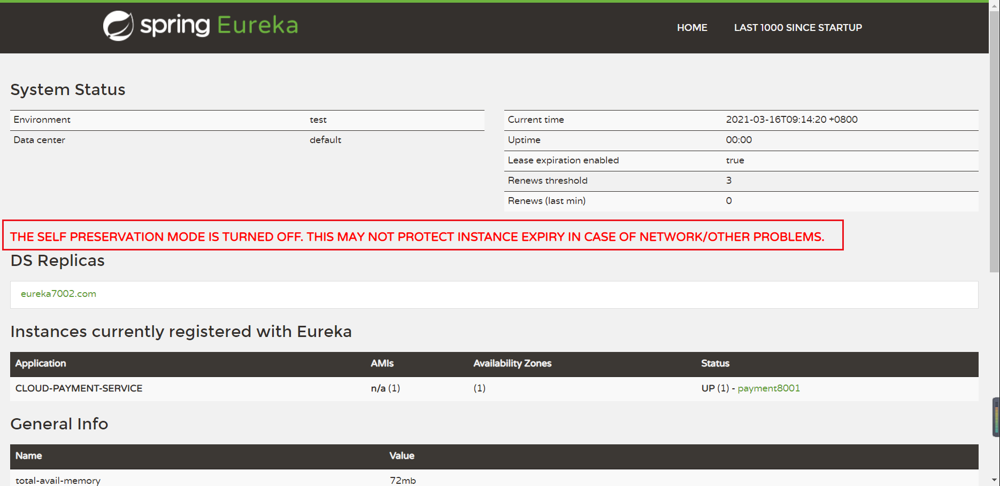
