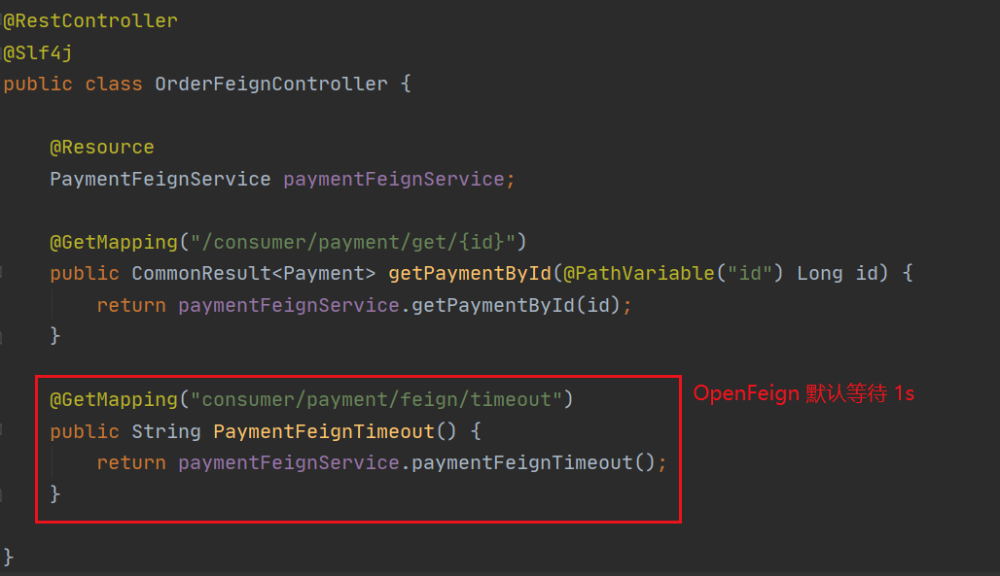
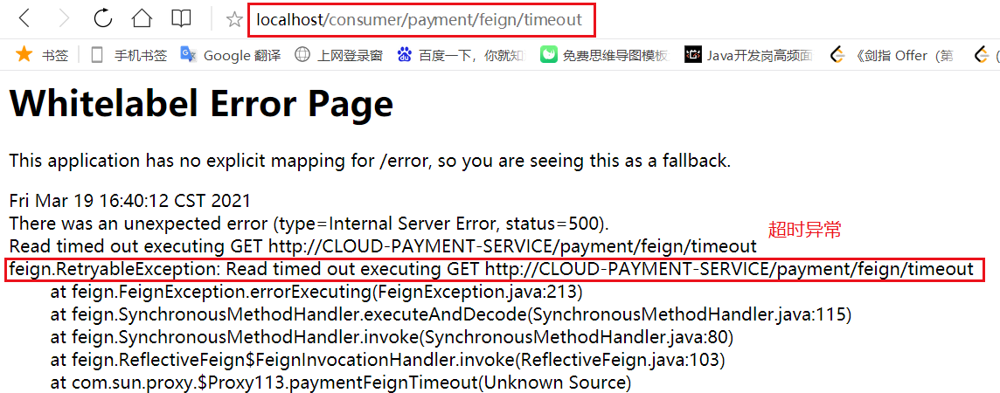

# 1. OpenFeign 简介

Feign 是一个声明式 WebService 客户端。使用 Feign 能让编写 Web 全家桶.Service 客户端更加简单。其使用方法是**定义一个服务接口，然后在上面添加注解**。

Feign 继承了 Ribbon：其利用 Ribbon 维护了 Payment 的服务列表信息，并通过轮询的方式实现了客户端的负载均衡。与 Ribbon 不同的是，**使用 Feign 只需要以声明式的方法定义服务绑定接口**，就可以实现服务调用。

# 2. OpenFeign 的使用

**采用 接口 + 注解：微服务调用接口 + @FeignClient**

## 2.1 新建 cloud-consumer-feign-order80 微服务

## 2.2 修改 POM

```xml
<?xml version="1.0" encoding="UTF-8"?>
<project xmlns="http://maven.apache.org/POM/4.0.0"
         xmlns:xsi="http://www.w3.org/2001/XMLSchema-instance"
         xsi:schemaLocation="http://maven.apache.org/POM/4.0.0 http://maven.apache.org/xsd/maven-4.0.0.xsd">
    <parent>
        <artifactId>springcloud</artifactId>
        <groupId>com.zqf.springcloud</groupId>
        <version>1.0-SNAPSHOT</version>
    </parent>
    <modelVersion>4.0.0</modelVersion>

    <artifactId>cloud-consumer-feign-order80</artifactId>

    <dependencies>
        <!--openfeign-->
        <dependency>
            <groupId>org.springframework.cloud</groupId>
            <artifactId>spring-cloud-starter-openfeign</artifactId>
        </dependency>
        <!--eureka client-->
        <dependency>
            <groupId>org.springframework.cloud</groupId>
            <artifactId>spring-cloud-starter-netflix-eureka-client</artifactId>
        </dependency>
        <!-- 引入自己定义的api通用包，可以使用Payment支付Entity -->
        <dependency>
            <groupId>com.zqf.springcloud</groupId>
            <artifactId>cloud-api-commons</artifactId>
            <version>${project.version}</version>
        </dependency>
        <!--web-->
        <dependency>
            <groupId>org.springframework.boot</groupId>
            <artifactId>spring-boot-starter-web</artifactId>
        </dependency>
        <dependency>
            <groupId>org.springframework.boot</groupId>
            <artifactId>spring-boot-starter-actuator</artifactId>
        </dependency>
        <!--一般基础通用配置-->
        <dependency>
            <groupId>org.springframework.boot</groupId>
            <artifactId>spring-boot-devtools</artifactId>
            <scope>runtime</scope>
            <optional>true</optional>
        </dependency>
        <dependency>
            <groupId>org.projectlombok</groupId>
            <artifactId>lombok</artifactId>
            <optional>true</optional>
        </dependency>
        <dependency>
            <groupId>org.springframework.boot</groupId>
            <artifactId>spring-boot-starter-test</artifactId>
            <scope>test</scope>
        </dependency>
    </dependencies>

</project>
```

## 2.3 配置文件 yml

```yml
server:
  port: 80

eureka:
  client:
    register-with-eureka: false
    service-url:
      defaultZone: http://eureka7001.com:7001/eureka, http://eureka7002.com:7002/eureka
```

## 2.4 主启动类

```java
@SpringBootApplication
@EnableDiscoveryClient
@EnableFeignClients
public class OrderFeignMain80 {
    public static void main(String[] args) {
        SpringApplication.run(OrderFeignMain80.class, args);
    }
}
```

## 2.5 业务类

调用 provider 的服务的接口

```java
package com.zqf.springcloud.service;

import com.zqf.springcloud.entities.CommonResult;
import com.zqf.springcloud.entities.Payment;
import org.springframework.cloud.openfeign.FeignClient;
import org.springframework.stereotype.Component;
import org.springframework.web.bind.annotation.GetMapping;
import org.springframework.web.bind.annotation.PathVariable;

@Component
@FeignClient("CLOUD-PAYMENT-SERVICE")
public interface PaymentFeignService {
    @GetMapping("/payment/get/{id}")
    CommonResult<Payment> getPaymentById(@PathVariable("id") Long id);
}

```

controller

```java
package com.zqf.springcloud.controller;

import com.zqf.springcloud.entities.CommonResult;
import com.zqf.springcloud.entities.Payment;
import com.zqf.springcloud.service.PaymentFeignService;
import lombok.extern.slf4j.Slf4j;
import org.springframework.web.bind.annotation.GetMapping;
import org.springframework.web.bind.annotation.PathVariable;
import org.springframework.web.bind.annotation.RestController;

import javax.annotation.Resource;

@RestController
@Slf4j
public class OrderFeignController {

    @Resource
    PaymentFeignService paymentFeignService;

    @GetMapping("/consumer/payment/get/{id}")
    public CommonResult<Payment> getPaymentById(@PathVariable("id") Long id) {
        return paymentFeignService.getPaymentById(id);
    }

}

```

## 2.6 启动测试

Feign 自带负载均衡


# 3. OpenFeign 超时控制

## 3.1 超时演示

### 编写8001和8002暂停程序


### 消费方80添加超时方法

接口：


controller：



### 启动测试



## 3.2 配置超时控制

OpenFeign 默认等待 1s，超时未得到相应就会报错。

### 修改配置文件

在配置文件中配置 OpenFeign 客户端超时控制：

```yml
server:
  port: 80

eureka:
  client:
    register-with-eureka: false
    service-url:
      defaultZone: http://eureka7001.com:7001/eureka, http://eureka7002.com:7002/eureka

ribbon:
  # 指建立连接所用的时间，适用于网络正常的情况下，两端连接所用的时间
  ReadTimeout: 10000
  # 值建立连接后从服务器读取到可用资源所用的时间
  ConnectTimeout: 10000
```

### 启动测试


# 4. OpenFeign 日志增强

Feign 提供了日志打印功能，我们可以通过配置来调整日志级别，从而了解 Feign 中 Http 请求的细节。

说白了就是对Feign接口的调用情况进行监控和输出。

## 4.1 日志级别

* NONE：默认的，不显示任何日志;
* BASIC：仅记录请求方法、URL、响应状态码及执行时间;
* HEADERS：除了BASIC中定义的信息之外，还有请求和响应的头信息;
* FULL：除了HEADERS中定义的信息之外，还有请求和响应的正文及元数据。

## 4.2 配置日志

### 创建日志配置类

```java
package com.zqf.springcloud.config;

import feign.Logger;
import org.springframework.context.annotation.Bean;
import org.springframework.context.annotation.Configuration;

@Configuration
public class FeignConfig {

    @Bean
    Logger.Level feignLoggerLevel() {
        return Logger.Level.FULL;
    }

}

```

### 在 yml 配置文件中进行配置

```yml
server:
  port: 80

eureka:
  client:
    register-with-eureka: false
    service-url:
      defaultZone: http://eureka7001.com:7001/eureka, http://eureka7002.com:7002/eureka

ribbon:
  # 指建立连接所用的时间，适用于网络正常的情况下，两端连接所用的时间
  ReadTimeout: 10000
  # 值建立连接后从服务器读取到可用资源所用的时间
  ConnectTimeout: 10000

logging:
  level:
    # 指定 feign 日志以什么级别监控哪个接口
    com.zqf.springcloud.service.PaymentFeignService: debug

```

### 启动测试

后台输出更详细的日志
