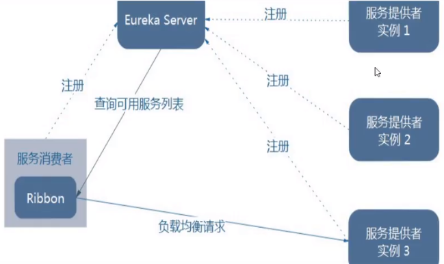
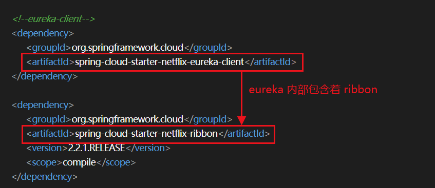
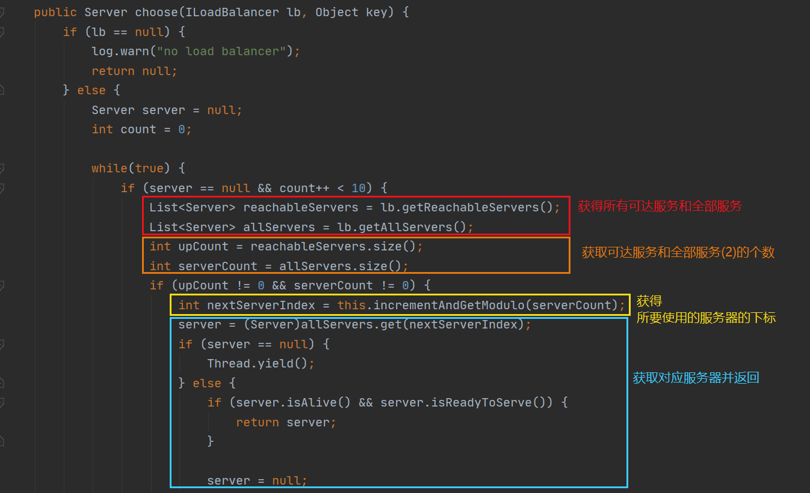
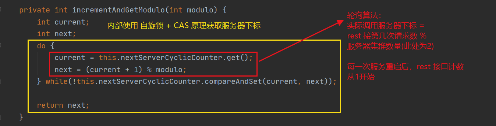
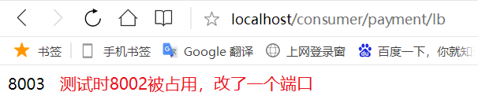
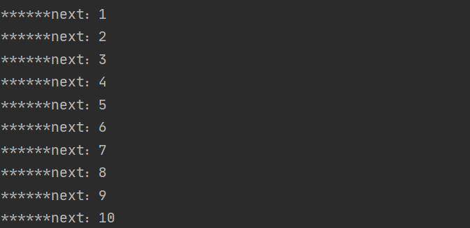

# 1. Ribbon 基础

## 1.1 Ribbon 简介

Ribbon 是基于 Netflix Ribbon 实现的一套**客户端负载均衡**的工具。

其主要功能是提供**客户端的软件负载均衡算法和服务调用**，Ribbon 会自动的基于某种规则（简单轮询、随机连接等...）帮助客户端去连接服务器。

## 1.2 负载均衡

负载均衡指将用户的请求分摊到多台服务器上，从而达到系统的高可用。常见的负载均衡软件有 Nginx（服务器端负载均衡）

## 1.3 本地负载均衡 VS 服务端负载均衡

Nginx 是服务端负载均衡，所有客户端的请求都会交给 Nginx，由 Nginx 实现转发。

Ribbon 是本地负载均衡，在调用微服务的接口时，会在注册中心获取注册的服务列表信息。缓存到 JVM 本地，从而在本地实现 RPC 远程服务调用。

## 1.4 集中式LB VS 进程内LB

集中式LB 在消费方和提供方之间使用独立的 LB 设施（如nginx），由该设施负责吧访问的请求通过某种策略转发到服务方。（医院分诊台）

进程内LB 将负载均衡的逻辑集成到消费方，消费方从注册中心获取哪些服务方可用，然后自主选择合适的服务方。（直接去对应科室自主选择医生）

# 2. Ribbon 的基本使用

Ribbon + RestTemplate



## 2.1 POM 依赖

eureka-client 内部包含着 Ribbon，不需要再次引入



## 2.2 RestTemplate

[RestTemplate文档](https://docs.spring.io/spring-framework/docs/5.2.2.RELEASE/javadoc-api/org/springframework/web/client/RestTemplate.html)

* **getForObject() / getForEntity()**
* **postForObject() / postForEntity()**

cloud-consumer-order80 RestTemplate 配置类

```java
package com.zqf.springcloud.config;

import org.springframework.cloud.client.loadbalancer.LoadBalanced;
import org.springframework.context.annotation.Bean;
import org.springframework.context.annotation.Configuration;
import org.springframework.web.client.RestTemplate;

@Configuration
public class ApplicationContextConfig {

    @Bean
    @LoadBalanced // 配置负载均衡
    public RestTemplate getRestTemplate() {
        return new RestTemplate();
    }
}

```

修改 cloud-consumer-order80 的 controller

```java
package com.zqf.springcloud.controller;

import com.zqf.springcloud.entities.CommonResult;
import com.zqf.springcloud.entities.Payment;
import lombok.extern.slf4j.Slf4j;
import org.springframework.http.ResponseEntity;
import org.springframework.web.bind.annotation.GetMapping;
import org.springframework.web.bind.annotation.PathVariable;
import org.springframework.web.bind.annotation.RestController;
import org.springframework.web.client.RestTemplate;

import javax.annotation.Resource;

@RestController
@Slf4j
public class OrderController {

//    public static final String PAYMENT_URL = "http://localhost:8001";
    public static final String PAYMENT_URL = "http://CLOUD-PAYMENT-SERVICE";

    @Resource
    private RestTemplate restTemplate;

    @GetMapping("/consumer/payment/create")
    public CommonResult create(Payment payment) {
        return  restTemplate.postForObject(PAYMENT_URL + "/payment/create", payment, CommonResult.class);
    }

    @GetMapping("/consumer/payment/createForEntity")
    public CommonResult create2(Payment payment) {
        ResponseEntity<CommonResult> entity = restTemplate.postForEntity(PAYMENT_URL + "/payment/create", payment, CommonResult.class);
        if (entity.getStatusCode().is2xxSuccessful()) {
            return entity.getBody();
        } else {
            return new CommonResult(444, "操作失败");
        }
    }

    @GetMapping("/consumer/payment/get/{id}")
    public CommonResult getPayment(@PathVariable("id") Long id) {
        return restTemplate.getForObject(PAYMENT_URL + "/payment/get/" + id, CommonResult.class);
    }

    @GetMapping("/consumer/payment/getForEntity/{id}")
    public CommonResult getPayment2(@PathVariable("id") Long id) {
        ResponseEntity<CommonResult> entity = restTemplate.getForEntity(PAYMENT_URL + "/payment/get/" + id, CommonResult.class);
        if (entity.getStatusCode().is2xxSuccessful()) {
            return entity.getBody();
        } else {
            return new CommonResult(444, "操作失败");
        }
    }

}

```

# 3. Ribbon 的负载规则

## 3.1 IRule


* RoundRobinRule：轮询（默认）
* RandomRule：随机
* RetryRule：先按照 RoundRobinRule 的策略获取服务，若获取失败则在指定时间内重复
* WeightedResponseTimeRule：对 RoundRobinRule 的扩展，响应速度越大的实例选择权重越大，越容易被选择
* BestAvailableRule：会先过滤掉由于多次访问故障而处于断路器跳闸状态的服务，然后选择一个并发量最小的服务
* AvailabilityFilteringRule：先过滤掉故障实例，再选择并发较小的实例
* ZoneAvoidanceRule：默认规则，复合判断 server 所在区域的性能和可用性选择服务器

## 3.2 负载规则的切换

需要修改 cloud-consumer-order80 微服务

注意，自定义负载规则的配置类不能放在 spring 可扫描的包下！（即不能与主启动类同包）

### 创建 com.zqf.murule 包，编写 mySelfRule

```java
package com.zqf.murule;

import com.netflix.loadbalancer.IRule;
import com.netflix.loadbalancer.RandomRule;
import org.springframework.context.annotation.Bean;
import org.springframework.context.annotation.Configuration;

@Configuration
public class mySelfRule {

    @Bean
    public IRule myRule() {
        return new RandomRule();
    }
}

```

### 修改主启动类，添加注解

```java
package com.zqf.springcloud;

import com.zqf.murule.mySelfRule;
import org.springframework.boot.SpringApplication;
import org.springframework.boot.autoconfigure.SpringBootApplication;
import org.springframework.cloud.netflix.eureka.EnableEurekaClient;
import org.springframework.cloud.netflix.ribbon.RibbonClient;

@SpringBootApplication
@EnableEurekaClient
// 添加 RibbonClient 注解
@RibbonClient(name = "CLOUD-PAYMENT-SERVICE", configuration = mySelfRule.class)
public class OrderMain80 {
    public static void main(String[] args) {
        SpringApplication.run(OrderMain80.class, args);
    }
}

```

测试结果：随机选用服务器

## 3.3 默认轮询算法原理






## 3.4 手写轮询算法

### 改造 8001 和 8002 支付微服务

添加controller用于测试

```java
    @GetMapping("/payment/lb")
    public String getPaymentLB() {
        return serverPort;
    }
```

### 关闭 80 支付微服务的默认 Ribbon

配置类去掉注解 `@LoadBalanced`

```java
@Configuration
public class ApplicationContextConfig {

    @Bean
//    @LoadBalanced // 配置负载均衡
    public RestTemplate getRestTemplate() {
        return new RestTemplate();
    }
}
```

主启动类去掉注解 `@RibbonClient`

```java
@SpringBootApplication
@EnableEurekaClient
// 添加 RibbonClient 注解
//@RibbonClient(name = "CLOUD-PAYMENT-SERVICE", configuration = mySelfRule.class)
public class OrderMain80 {
    public static void main(String[] args) {
        SpringApplication.run(OrderMain80.class, args);
    }
}
```

### 自定义负载均衡规则

主启动类包下创建新包：mylb

创建 LoadBalancer 接口

```java
package com.zqf.springcloud.mylb;

import org.springframework.cloud.client.ServiceInstance;

import java.util.List;

public interface LoadBalancer {
    ServiceInstance instances(List<ServiceInstance> serviceInstances);
}

```

实现 LoadBalancer 接口

```java
package com.zqf.springcloud.mylb;

import org.springframework.cloud.client.ServiceInstance;
import org.springframework.stereotype.Component;

import java.util.List;
import java.util.concurrent.atomic.AtomicInteger;

@Component
public class MyLB implements LoadBalancer {

    private AtomicInteger atomicInteger = new AtomicInteger(0);

    public final int getAndIncrement() {
        int current, next;
        do {
            current = this.atomicInteger.get();
            next = current >= Integer.MAX_VALUE ? 0: current + 1;
        } while (!this.atomicInteger.compareAndSet(current, next));
        System.out.println("******next：" + next);
        return next;
    }

    // 负载轮询算法: rest 接口第几次请求数 % 服务器集群总数量 = 实际调用服务器位置下标
    @Override
    public ServiceInstance instances(List<ServiceInstance> serviceInstances) {
        int index = getAndIncrement() % serviceInstances.size();
        return serviceInstances.get(index);
    }
}

```

### 修改 80 支付微服务 controller

添加下述新的映射用于测试

```java
    @Resource
    private LoadBalancer loadBalancer;

    @Resource
    private DiscoveryClient discoveryClient;

    @GetMapping("consumer/payment/lb")
    public String geyPaymentLB() {
        List<ServiceInstance> instances = discoveryClient.getInstances("CLOUD-PAYMENT-SERVICE");

        if (instances == null || instances.size() <= 0) {
            return null;
        }

        ServiceInstance serviceInstance = loadBalancer.instances(instances);
        URI uri = serviceInstance.getUri();

        return restTemplate.getForObject(uri + "/payment/lb", String.class);
    }
```

### 测试

访问 `/consumer/payment/lb`，8001 和 8002 交替出现




控制台输出：



