[安装](https://www.cnblogs.com/a5idc/p/13772654.html)

单机配置

分布式集群配置

开启ZooKeeper服务端：
```
cd /opt/zookeeper

bin/zkServer.sh start
```

开启ZooKeeper客户端：
```
cd /opt/zookeeper

bin/zkCli
```

注意：

开启失败原因：tomcat与zookeeper都是占用8080端口

解决：关闭tomcat：server tomcat9 stop

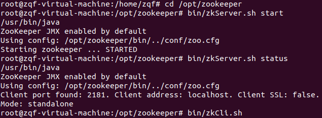

# 1. ZooKeeper 基础

ZooKeeper 是一个开源的为分布式提供协调服务的 Apache 项目。

从设计模式的角度来说，ZooKeeper 是一个基于观察者模式设计的分布式服务管理框架，负责存储和管理数据，接受观察者的注册。一旦这些数据的状态发生变化，ZooKeeper 就会通知注册在其上的观察者，做出相应的反应。

**ZooKeeper=文件系统+通知机制**

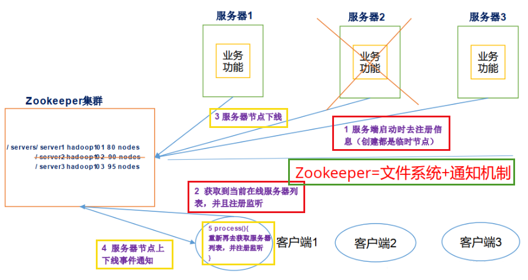

## 1.1 ZooKeeper 特点

1. 一个领导者，多个跟随者
2. 集群中半数以上节点存活，ZooKeeper 集群就能正常服务
3. 全局数据一致：每一个 zkServer 都保存一份相同的数据副本，zkCli 无论连接到哪一个 zkServer，数据都是一致的
4. 更新请求顺序执行：来自同一个 zkCli 的更新请求按照其发送顺序依次执行
5. 数据更新原子性，一次数据更新要么成功，要么失败
6. 实时性：在一定的时间范围内，zkCli 能读到最新的数据

## 1.2 ZooKeeper 数据结构

整体上可以看做一棵树，每一个节点称为一个 ZNode。

每一个 ZNode 默认能够存储 1MB 的数据，每一个 ZNode 都可以通过其路径唯一标识。

## 1.3 ZooKeeper 应用场景

* **统一命名服务**：分布式环境下对应用进行统一命名，便于管理
* **统一配置管理**：配置同步
* **统一集群管理**：ZooKeeper 可以实时监控节点的状态变化
* **服务器节点动态上下线**：客户端能够实时洞察应用服务的上下线变化
* **软负载均衡**：ZooKeeper 可以记录每台服务器的访问数，令访问数最少的服务器去处理最新的客户端请求

## 1.4 ZooKeeper 配置参数

* tickTime=2000：**通信心跳数，ZooKeeper 服务器与客户端心跳时间，单位毫秒**
服务器之间或客户端与服务器之间维持心跳的时间间隔，也就是每个tickTime时间就会发送一个心跳
* initLimit=10：**LF 初始通信时限**
集群中的 Follower 跟随者服务器与 Leader 领导者服务器之间初始连接时能容忍的最多心跳数（tickTime的数量），用它来限定集群中的 Zookeeper 服务器连接到 Leader 的时限
* syncLimit=5：**LF 同步通信时限**
集群中 Leader 与 Follower 之间的最大响应时间单位，假如响应超过 syncLimit \* tickTime， Leader 认为 Follwer 死掉，从服务器列表中删除 Follwer
* dataDir：**数据文件目录+数据持久化路径**
用于保存 Zookeeper 中的数据
* clientPort=2181：**客户端连接端口**

监听客户端连接的端口

## 1.5 Zookeeper 选举机制

假设有 5 台 zkServer，id 分别为1-5

1. 服务器 1 启动，发起选举，为自己投票。此时服务器 1 一票，未超半票(3)，选举无法完成，服务器 1 保持 LOOKING 状态。
2. 服务器 2 启动，发起选举。此时服务器 1 与 2 分别为自己投票，随后 1 发现 2 的 id 大于自身，将票转投给服务器 2，服务器 2 两票，未超半数，服务器 1 和 2 保持 LOOKING 状态。
3. 服务器 3 启动，发起选举，为自己投票。服务器 1 和 2 发现其 id 最大，转投服务器 3，服务器 3 三票，超半数，选举完成，服务器 3 当选 Leader，服务器 1 和 2 更改状态为 FOLLOWING，服务器 3 状态更改为 LEADING。
4. 服务器 4 启动，发起选举，为自己投票。此时服务器 1 2 3 不再是 LOOKING 状态，不会更改选票，故服务器 4 少数服从多数，改投服务器 3，更改状态为 FOLLOWING。
5. 服务器 5 启动同服务器 4。

## 1.6 Zookeeper 节点类型

* **持久化目录节点**：客户端与Zookeeper断开连接后，该节点依旧存在
* **持久化顺序编号目录节点**：客户端与Zookeeper断开连接后， 该节点依旧存在， 只是Zookeeper给该节点名称进行顺序编号
* **临时目录节点**：客户端与Zookeeper断开连接后， 该节点被删除
* **临时顺序编号目录节点**：客户端与Zookeeper断开连接后，该节点被删除，只是Zookeeper给该节点名称进行顺序编号。

## 1.7 Zookeeper 命令操作

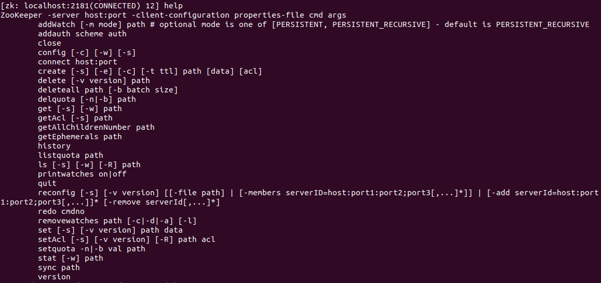

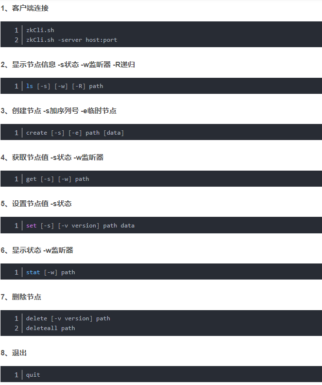

## 1.8 Stat 结构体

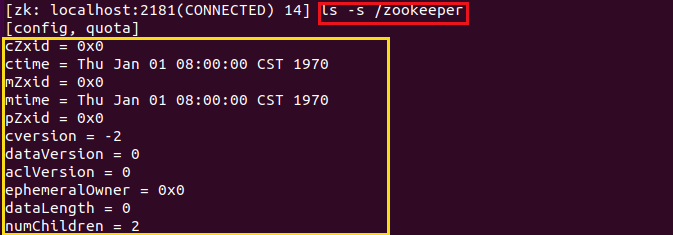

* czxid：创建节点的事务 zxid
每次修改 ZooKeeper 状态都会收到一个 zxid 形式的时间戳，也就是 ZooKeeper 事务 ID。事务 ID 是 ZooKeeper 中所有修改总的次序。每个修改都有唯一的 zxid，如果 zxid1 小于 zxid2，那么 zxid1 在 zxid2 之前发生。
* ctime：znode 被创建的毫秒数(从 1970 年开始)
* mzxid：znode 最后更新的事务 zxid
* mtime：znode 最后修改的毫秒数(从 1970 年开始)
* pZxid：znode 最后更新的子节点 zxid
* cversion：znode 子节点变化号， znode 子节点修改次数
* dataversion：znode 数据变化号
* aclVersion：znode 访问控制列表的变化号
* ephemeralOwner：如果是临时节点，这个是 znode 拥有者的 session id。如果不是临时节点则是 0。
* dataLength：znode 的数据长度
* numChildren：znode 子节点数量

## 1.9 Zookeeper 监听器原理

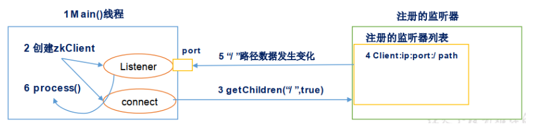

1. 首先创建 Main() 线程
2. mian 线程中创建 Zookeeper 客户端，此时会创建两个线程    
	* connect：负责网络连接通信
    * listener：负责监听
3. 通过 connect 线程将注册的监听事件发送给 Zookeeper
4. 在 Zookeeper 的监听器注册列表中将注册的监听事件添加到列表中
5. Zookeeper 监听到数据发生变化，将这个消息发送给 listener 线程
6. listener 线程内部调用 process() 方法

## 1.10 Zookeeper 写数据流程

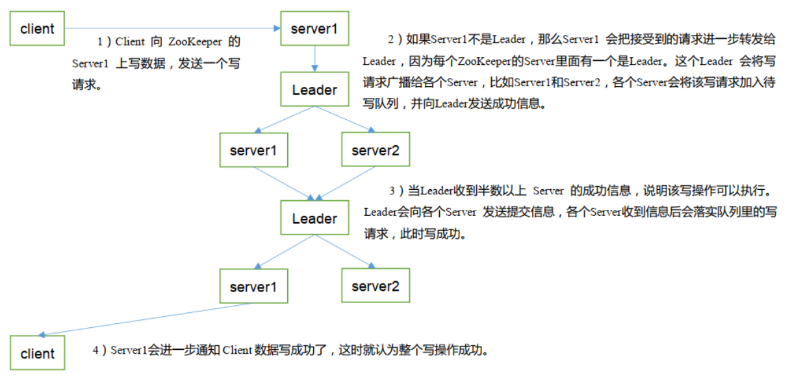

# 2. 支付微服务进驻 Zookeeper

## 2.1 创建微服务cloud-provider-payment8004

## 2.2 修改 POM

```xml
<?xml version="1.0" encoding="UTF-8"?>
<project xmlns="http://maven.apache.org/POM/4.0.0"
         xmlns:xsi="http://www.w3.org/2001/XMLSchema-instance"
         xsi:schemaLocation="http://maven.apache.org/POM/4.0.0 http://maven.apache.org/xsd/maven-4.0.0.xsd">
    <parent>
        <artifactId>springcloud</artifactId>
        <groupId>com.zqf.springcloud</groupId>
        <version>1.0-SNAPSHOT</version>
    </parent>
    <modelVersion>4.0.0</modelVersion>

    <artifactId>cloud-provider-payment8004</artifactId>

    <dependencies>
        <!-- SpringBoot整合Web组件 -->
        <dependency>
            <groupId>org.springframework.boot</groupId>
            <artifactId>spring-boot-starter-web</artifactId>
        </dependency>
        <!-- 引入自己定义的api通用包，可以使用Payment支付Entity -->
        <dependency>
            <groupId>com.zqf.springcloud</groupId>
            <artifactId>cloud-api-commons</artifactId>
            <version>1.0-SNAPSHOT</version>
        </dependency>
        <!-- SpringBoot整合zookeeper客户端 -->
        <dependency>
            <groupId>org.springframework.cloud</groupId>
            <artifactId>spring-cloud-starter-zookeeper-discovery</artifactId>
        </dependency>
        <dependency>
            <groupId>org.springframework.boot</groupId>
            <artifactId>spring-boot-devtools</artifactId>
            <scope>runtime</scope>
            <optional>true</optional>
        </dependency>
        <dependency>
            <groupId>org.projectlombok</groupId>
            <artifactId>lombok</artifactId>
            <optional>true</optional>
        </dependency>
        <dependency>
            <groupId>org.springframework.boot</groupId>
            <artifactId>spring-boot-starter-test</artifactId>
            <scope>test</scope>
        </dependency>
    </dependencies>

</project>
```

## 2.3 配置文件 yml

```yml
server:
  port: 8004

spring:
  application:
    name: cloud-provider-payment
  cloud:
    zookeeper:
      connect-string: 192.168.60.48:2181
```

## 2.4 配置主启动类

```java
@SpringBootApplication
@EnableDiscoveryClient
public class PaymentMain8004 {
    public static void main(String[] args) {
        SpringApplication.run(PaymentMain8004.class, args);
    }
}
```

## 2.5 业务类

Controller：

```java
package com.zqf.springcloud.controller;

import lombok.extern.slf4j.Slf4j;
import org.springframework.beans.factory.annotation.Value;
import org.springframework.web.bind.annotation.GetMapping;
import org.springframework.web.bind.annotation.RestController;

import java.util.UUID;

@RestController
@Slf4j
public class PaymentController {

    @Value("${server.port}")
    private String serverPort;

    @GetMapping("/payment/zk")
    public String paymentZK() {
        return "spring cloud with zookeeper：" + serverPort + "\t" + UUID.randomUUID().toString();
    }

}
```

## 2.6 测试验证

开启zookeeper服务器，启动微服务cloud-provider-payment8004

连接zookeeper客户端查看

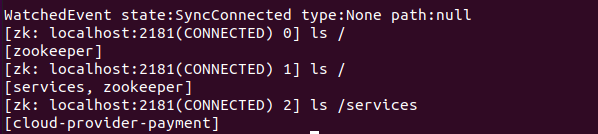

浏览器测试

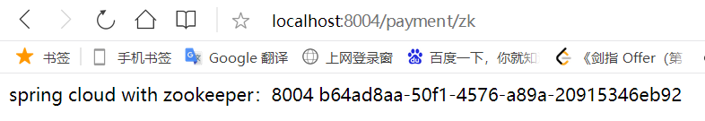

微服务cloud-provider-payment8004 入驻 zookeeper 成功！

注意：zookeeper 服务节点是**临时节点**，服务关闭即删除节点。


# 3. 订单微服务进驻 Zookeeper

## 3.1 创建微服务cloud-consumerzk-order80

## 3.2 修改 POM

```xml
<?xml version="1.0" encoding="UTF-8"?>
<project xmlns="http://maven.apache.org/POM/4.0.0"
         xmlns:xsi="http://www.w3.org/2001/XMLSchema-instance"
         xsi:schemaLocation="http://maven.apache.org/POM/4.0.0 http://maven.apache.org/xsd/maven-4.0.0.xsd">
    <parent>
        <artifactId>springcloud</artifactId>
        <groupId>com.zqf.springcloud</groupId>
        <version>1.0-SNAPSHOT</version>
    </parent>
    <modelVersion>4.0.0</modelVersion>

    <artifactId>cloud-consumerzk-order80</artifactId>

    <dependencies>
        <!-- SpringBoot整合Web组件 -->
        <dependency>
            <groupId>org.springframework.boot</groupId>
            <artifactId>spring-boot-starter-web</artifactId>
        </dependency>
        <!-- SpringBoot整合zookeeper客户端 -->
        <dependency>
            <groupId>org.springframework.cloud</groupId>
            <artifactId>spring-cloud-starter-zookeeper-discovery</artifactId>
        </dependency>
        <dependency>
            <groupId>org.springframework.boot</groupId>
            <artifactId>spring-boot-devtools</artifactId>
            <scope>runtime</scope>
            <optional>true</optional>
        </dependency>
        <dependency>
            <groupId>org.projectlombok</groupId>
            <artifactId>lombok</artifactId>
            <optional>true</optional>
        </dependency>
        <dependency>
            <groupId>org.springframework.boot</groupId>
            <artifactId>spring-boot-starter-test</artifactId>
            <scope>test</scope>
        </dependency>
    </dependencies>

</project>
```

## 3.3 配置文件 yml

```yml
server:
  port: 80

spring:
  application:
    name: cloud-consumer-order
  cloud:
    zookeeper:
      connect-string: 192.168.60.48:2181
```

## 3.4 主启动类

```java
@SpringBootApplication
@EnableDiscoveryClient
public class OrderZKMain80 {
    public static void main(String[] args) {
        SpringApplication.run(OrderZKMain80.class, args);
    }
}
```

## 3.5 业务类

Config

```java
package com.zqf.springcloud.config;

import org.springframework.cloud.client.loadbalancer.LoadBalanced;
import org.springframework.context.annotation.Bean;
import org.springframework.context.annotation.Configuration;
import org.springframework.web.client.RestTemplate;

@Configuration
public class ApplicationContextConfig {
    @Bean
    @LoadBalanced
    public RestTemplate getRestTemplate() {
        return new RestTemplate();
    }
}
```

Controller

```java
package com.zqf.springcloud.controller;

import lombok.extern.slf4j.Slf4j;
import org.springframework.web.bind.annotation.GetMapping;
import org.springframework.web.bind.annotation.RestController;
import org.springframework.web.client.RestTemplate;

import javax.annotation.Resource;

@RestController
@Slf4j
public class OrderController {

    private static final String INVOKE_URL = "http://cloud-provider-payment";

    @Resource
    private RestTemplate restTemplate;

    @GetMapping("/consumer/payment/zk")
    public String paymentInfo() {
        String result = restTemplate.getForObject(INVOKE_URL + "/payment/zk", String.class);
        return result;
    }

}
```

## 3.6 测试验证

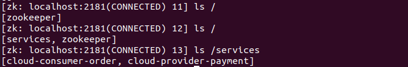

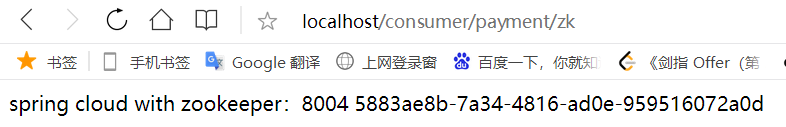

