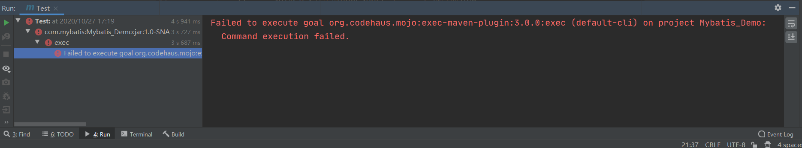
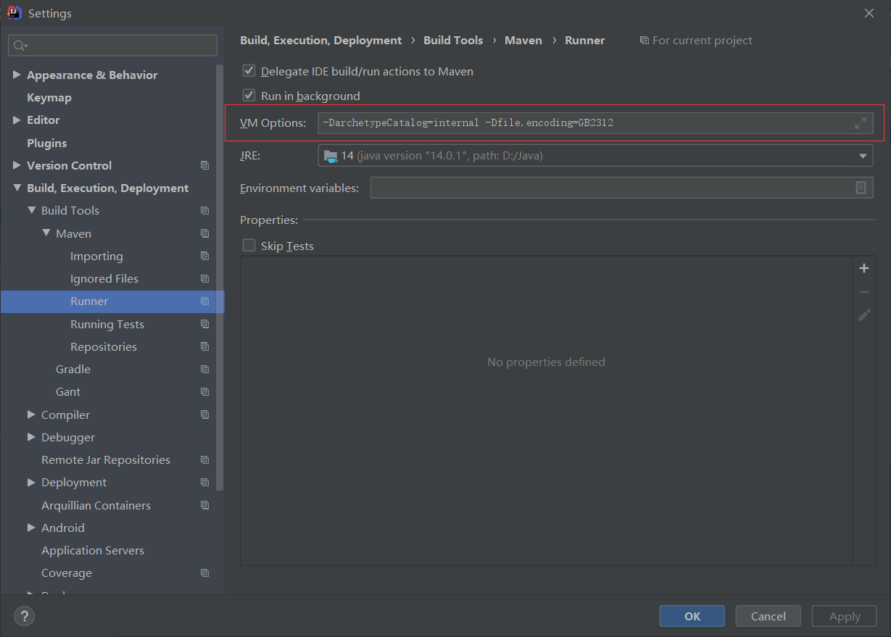
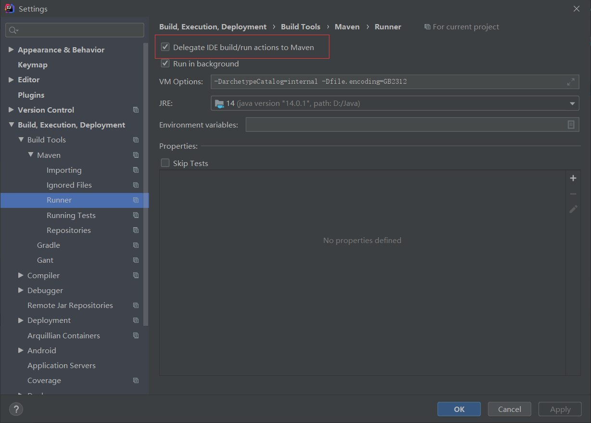
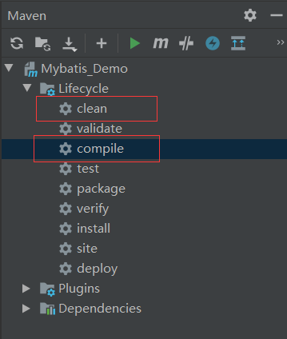

# 1. 在pom.xml中加入mybatis和mysql驱动的坐标

```xml
<?xml version="1.0" encoding="UTF-8"?>

<project xmlns="http://maven.apache.org/POM/4.0.0" xmlns:xsi="http://www.w3.org/2001/XMLSchema-instance"
  xsi:schemaLocation="http://maven.apache.org/POM/4.0.0 http://maven.apache.org/xsd/maven-4.0.0.xsd">
  <modelVersion>4.0.0</modelVersion>

  <groupId>com.mybatis</groupId>
  <artifactId>Mybatis_Demo</artifactId>
  <version>1.0-SNAPSHOT</version>

  <properties>
    <project.build.sourceEncoding>UTF-8</project.build.sourceEncoding>
    <maven.compiler.source>14</maven.compiler.source>
    <maven.compiler.target>14</maven.compiler.target>
  </properties>

  <dependencies>
    <dependency>
      <groupId>junit</groupId>
      <artifactId>junit</artifactId>
      <version>4.11</version>
      <scope>test</scope>
    </dependency>

    <!-- https://mvnrepository.com/artifact/org.mybatis/mybatis -->
    <dependency>
      <groupId>org.mybatis</groupId>
      <artifactId>mybatis</artifactId>
      <version>3.5.1</version>
    </dependency>

    <!-- https://mvnrepository.com/artifact/mysql/mysql-connector-java -->
    <dependency>
      <groupId>mysql</groupId>
      <artifactId>mysql-connector-java</artifactId>
      <version>5.1.9</version>
    </dependency>
  </dependencies>

  <build>
    <resources>
      <resource>
        <directory>src/main/java</directory><!--所在的目录-->
        <includes><!--包括目录下的.properties,.xml 文件都会扫描到-->
          <include>**/*.properties</include>
          <include>**/*.xml</include>
        </includes>
        <filtering>false</filtering>
      </resource>
      <resource>
        <directory>src/main/resources</directory>
        <includes>
          <include>**/*.properties</include>
          <include>**/*.xml</include>
        </includes>
      </resource>
    </resources>
    <plugins>
      <plugin>
        <groupId>org.apache.maven.plugins</groupId>
        <artifactId>maven-compiler-plugin</artifactId>
        <configuration>
          <source>14</source>
          <target>14</target>
        </configuration>
      </plugin>
      <plugin>
        <groupId>org.apache.maven.plugins</groupId>
        <artifactId>maven-surefire-plugin</artifactId>
        <version>2.12.4</version>
        <configuration>
          <skipTests>true</skipTests>
        </configuration>
      </plugin>
    </plugins>
  </build>
  
</project>
```

# 2. 创建实体类：Student

```java
package com.mybatis.entity;

// 封装表的实体类
public class Student {
    private Integer id;
    private String name;
    private Integer age;

    public Student() {
    }
    public Student(Integer id, String name, Integer age) {
        this.id = id;
        this.name = name;
        this.age = age;
    }
    
    @Override
    public String toString() {
        return "Student{" +
                "id=" + id +
                ", name='" + name + '\'' +
                ", age=" + age +
                '}';
    }
    
    public void setId(Integer id) {
        this.id = id;
    }
    public void setName(String name) {
        this.name = name;
    }
    public void setAge(Integer age) {
        this.age = age;
    }
    public Integer getId() {
        return id;
    }
    public String getName() {
        return name;
    }
    public Integer getAge() {
        return age;
    }
}

```

# 3. 创建持久层的dao接口，定义操作数据库的方法：Student.Dao

```java
package com.mybatis.dao;

import com.mybatis.entity.Student;
import java.util.List;

// 操作student表的方法接口
public interface StudentDao {
    // 查询表的所有数据
    public List<Student> findAll();

    // 插入数据的操作
    public int insert(Student student);
}

```

# 4. 创建一个mybatis使用的配置文件(sql映射文件)：StudentDao.xml

sql映射文件，写sql语句，mybatis会执行这些sql

1. 指定约束文件


2. 约束文件的作用：限制和检查在当前文件中出现的标签，属性必须符合mybatis的要求

3. mapper：当前文件的根标签
namespace：命名空间，是唯一值的，可以是自定义的字符串。要求使用dao接口的全路径名称

4. 可以使用特定标签标示数据库的特定操作

    * `<select>`：执行查询操作    
		* id：要执行的sql语法的唯一标识，mybatis根据这个值来查找要执行的sql语句。一般使用接口中的方法名称
        * resultType：表示查询的结果类型的，是sql语句执行后的ResultSet。遍历这个ResultSet得到java对象的类型。 值为类型的全路径名称
    * `<update>`：执行更新操作
    * `<insert>`：执行插入操作
    * `<delete>`：执行删除操作
	
```xml
<?xml version="1.0" encoding="UTF-8" ?>
<!DOCTYPE mapper
        PUBLIC "-//mybatis.org//DTD Mapper 3.0//EN"
        "http://mybatis.org/dtd/mybatis-3-mapper.dtd">
<mapper namespace="com.mybatis.dao.StudentDao">
    <select id="findAll" resultType="com.mybatis.entity.Student">
        select id,name,age from t1 order by id
    </select>
    
    <select id="insert">
        insert into t1 values (#{id}, #{name}, #{age})
    </select>
</mapper>
```

# 5. 创建mybatis的主配置文件：mybatis.xml

mybatis的主配置文件：定义了数据库的配置信息

1. 约束文件

2. configuration    
	* `<environments>`：环境配置，数据库的连接信息    
		* default：必须和某个environment的id值一样。告诉mybatis使用哪个数据库的连接信息，也就是访问哪个数据库。用于切换实际应用和测试项目的数据库
    * `<environment>`：一个数据库信息的配置环境    
		* id：唯一值，表示环境的名称
    * `<transactionManager>`：mybatis的事务类型    
		* type：JDBC(表示使用jdbc中的Connection对象的commit，rollback做事务处理)
    * `<dataSource>`：表示数据源，连接数据库的    
		* type：表示数据源的类型，POOLED表示使用连接池
    * `<mappers>`：sql映射文件的位置。一个mapper标签指定一个文件的位置，从类路径开始的路径信息
	
```xml
<?xml version="1.0" encoding="UTF-8" ?>
<!DOCTYPE configuration
        PUBLIC "-//mybatis.org//DTD Config 3.0//EN"
        "http://mybatis.org/dtd/mybatis-3-config.dtd">
<configuration>
    <environments default="development">
        <environment id="development">
            <transactionManager type="JDBC"/>
            <dataSource type="POOLED">
                <property name="driver" value="com.mysql.jdbc.Driver"/>
                <property name="url" value="jdbc:mysql://localhost:3306/test3?useUnicode=true&amp;characterEncoding=UTF-8"/>
                <property name="username" value="root"/>
                <property name="password" value="961231zqf"/>
            </dataSource>
        </environment>
    </environments>

    <mappers>
        <mapper resource="com\mybatis\dao\StudentDao.xml"/>
    </mappers>
</configuration>
```

# 6. 创建mybatis的测试类：Test

```java
package com.mybatis;

import com.mybatis.entity.Student;
import org.apache.ibatis.io.Resources;
import org.apache.ibatis.session.SqlSession;
import org.apache.ibatis.session.SqlSessionFactory;
import org.apache.ibatis.session.SqlSessionFactoryBuilder;
import org.junit.Test;

import java.io.IOException;
import java.io.InputStream;
import java.util.List;

public class TestDemo {
    @Test
    public void test01() throws IOException {
        // 访问mybatis读取student数据
        // 1. 定义mybatis只配置文件的名称，从类路径的跟开始(target/classes)
        String config = "mybatis.xml";
        // 2. 读取mybatis配置文件
        InputStream in = Resources.getResourceAsStream(config);
        // 3. 创建SqlSessionFactoryBuilder对象
        SqlSessionFactoryBuilder builder = new SqlSessionFactoryBuilder();
        // 4. 创建SqlSessionFactory对象
        SqlSessionFactory factory = builder.build(in);
        // 5. 【重要】从SqlSessionFactory中获取SqlSession对象
        SqlSession sqlSession = factory.openSession();
        // 6. 【重要】指定需要执行的sql语句的标识。
        //     sql映射文件中的namespace + “.” + 标签的id值
        String sqlID = "com.mybatis.dao.StudentDao.findAll";
        // 7. 执行sql语句
        List<Student> studentList = sqlSession.selectList(sqlID);
        // 8. 输出结果
        for (Student stu: studentList) {
            System.out.println(stu);
        }
        // 9. 关闭sqlSession对象
        sqlSession.close();
    }

    @Test
    public void test02() throws IOException {
        // 访问mybatis读取student数据
        // 1. 定义mybatis只配置文件的名称，从类路径的跟开始(target/classes)
        String config = "mybatis.xml";
        // 2. 读取mybatis配置文件
        InputStream in = Resources.getResourceAsStream(config);
        // 3. 创建SqlSessionFactoryBuilder对象
        SqlSessionFactoryBuilder builder = new SqlSessionFactoryBuilder();
        // 4. 创建SqlSessionFactory对象
        SqlSessionFactory factory = builder.build(in);
        // 5. 【重要】从SqlSessionFactory中获取SqlSession对象
        SqlSession sqlSession = factory.openSession();
        // 6. 【重要】指定需要执行的sql语句的标识。
        //     sql映射文件中的namespace + “.” + 标签的id值
        String sqlID = "com.mybatis.dao.StudentDao.insert";
        // 7. 执行sql语句
        Student student = new Student(1, "小凡", 3);
        int result = sqlSession.insert(sqlID, student);
        //    mybatis默认不是自动提交事务，所以在insert、update、delete后要手动提交事务
        sqlSession.commit();
        // 8. 输出结果
        System.out.printf("影响的行数为%d", result);
        // 9. 关闭sqlSession对象
        sqlSession.close();
    }
}
```

# 7. 问题的解决

## 7.1 插件未找到问题

这是`<build>`标签的配置问题


**此处的test的问题只能暂时通过跳过测试来解决，具体原因未知！**(最后的设置)

```xml
<plugin>
        <groupId>org.apache.maven.plugins</groupId>
        <artifactId>maven-surefire-plugin</artifactId>
        <version>2.12.4</version>
        <configuration>
          <skipTests>true</skipTests>
        </configuration>
      </plugin>
</plugins>
```

解决：在pom.xml文件中`<resources>`标签内插入下列代码

```xml
<build>
    <resources>
      <resource>
        <directory>src/main/java</directory><!--所在的目录-->
        <includes><!--包括目录下的.properties,.xml 文件都会扫描到-->
          <include>**/*.properties</include>
          <include>**/*.xml</include>
        </includes>
        <filtering>false</filtering>
      </resource>
      <resource>
        <directory>src/main/resources</directory>
        <includes>
          <include>**/*.properties</include>
          <include>**/*.xml</include>
        </includes>
      </resource>
    </resources>
    <plugins>
      <plugin>
        <groupId>org.apache.maven.plugins</groupId>
        <artifactId>maven-compiler-plugin</artifactId>
        <configuration>
          <source>14</source>
          <target>14</target>
        </configuration>
      </plugin>
      <plugin>
        <groupId>org.apache.maven.plugins</groupId>
        <artifactId>maven-surefire-plugin</artifactId>
        <version>2.12.4</version>
        <configuration>
          <skipTests>true</skipTests>
        </configuration>
      </plugin>
    </plugins>
  </build>
```

## 7.2 读取数据的乱码问题

添加：`-Dfile.encoding=GB2312`



## 7.3 重复插入数据的问题

取消方框内的勾选



## 7.4 Class not found: "com.mybatis.TestDemo"

尝试清理后重新编译


