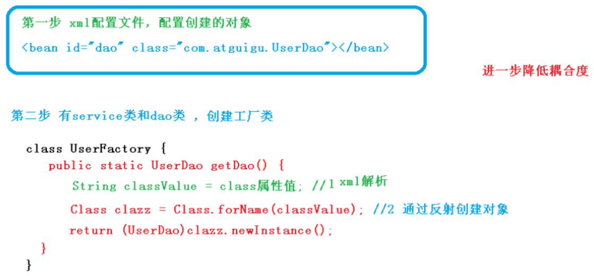
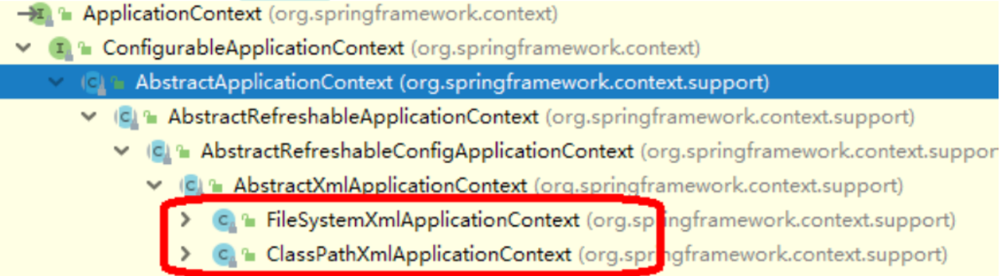

# 1. 概念和原理

## 1.1 什么是IOC

* 控制反转：把对象创建和对象之间的调用过程交给Spring管理
* 使用IOC的目的：降低耦合度
## 1.2 IOC底层原理

xml解析 + 工厂模式 + 反射

过程：



# 2. BeanFactory接口

* IOC思想基于IOC容器完成，IOC容器底层就是对象工厂
* Spring提供IOC容器实现的两种方式(两个接口)：    
	* BeanFactory：IOC容器基本实现，是Spring内部的使用接口，不提供开发人员进行使用；加载配置文件时不会创建对象，在获取对象(使用)时才去创建对象
    * ApplicationContext：BeanFactory接口的子接口，提供更多更强大的功能，一般由开发人员进行使用；加载配置文件时就会把配置文件的对象进行创建
* ApplicationContext接口的两个重要实现类    
	* FileSystemXmlApplication
    * ClassPathXmlApplication
    * 
# 3. IOC操作bean管理(xml)

## 3.1 概述

* 什么是Bean管理？
Bean管理指两个操作：**Spring创建对象、Spring注入属性**
* Bean管理操作的两种方式    
	* 基于xml配置文件方式实现
    * 基于注解方式实现
## 3.2 IOC操作Bean管理：基于xml方式

### 基于xml方式创建对象

* 在spring配置文件中，使用bean标签，标签里添加对应属性，就可以实现对象的创建
* bean标签中有很多属性，常用属性有：    
	* **id属性：唯一标识**
    * **class属性：类全路径(包类路径)**
* 创建对象时，默认执行无参数构造的方法完成对象创建

### 基于xml方式注入属性

* 注入方式1：使用set方法进行注入
	* 创建类，定义属性和对应的set方法
    * 在spring配置文件配置对象时创建，配置属性注入    
		* 使用**property**完成属性注入    
			* **name：类里面的属性名称**
            * **value：向属性注入的值**

* 注入方式2：使用有参数构造进行注入
	* 创建类，定义属性，创建属性对应的有参数构造方法
    * 在spring配置文件中进行配置    
		* 采用**constructor-arg**标签    
			* **name：属性名称**
            * **value：要给属性注入的值**
```java
// 注入方式1：使用set方法进行注入
public class Book {
    // 创建属性
    private String bname;
    private String bauthor;
    // 创建属性对应的set方法
    public void setBname(String bname) {
        this.bname = bname;
    }
    public void setBauthor(String bauthor) {
        this.bauthor = bauthor;
    }
    // 设置测试方法
    public void show() {
        System.out.println(bname + "：" + bauthor);
    }
}
```

```xml
<!--set方法注入属性-->
    <bean id="book" class="classDemo.Book">
        <property name="bname" value="三国演义"></property>
        <property name="bauthor" value="罗贯中"></property>
    </bean>
```

```java
// 注入方式2：使用有参数构造进行注入
public class Order {
    // 属性
    private String oname;
    private String address;
    // 有参数构造方法
    public Order(String oname, String address) {
        this.oname = oname;
        this.address = address;
    }
}
```

```xml
<!--有参数构造注入属性-->
    <bean id="order" class="classDemo.Order">
        <constructor-arg name="oname" value="computer"></constructor-arg>
        <constructor-arg name="address" value="China"></constructor-arg>
    </bean>
```

### p名称空间注入(了解)

使用p名称空间注入，可以简化基于xml配置方式

* 添加p名称空间在配置文件中
* 进行属性注入，在bean标签里进行操作
```xml
<?xml version="1.0" encoding="UTF-8"?>
<beans xmlns="http://www.springframework.org/schema/beans"
       xmlns:xsi="http://www.w3.org/2001/XMLSchema-instance"
       xmlns:p="http://www.springframework.org/schema/p"
       xsi:schemaLocation="http://www.springframework.org/schema/beans http://www.springframework.org/schema/beans/spring-beans.xsd">

    <bean id="book" class="classDemo.Book" p:bname="水浒传" p:bauthor="施耐庵"></bean>
</beans>
```

## 3.3 IOC操作Bean管理：xml注入其他类型属性

### 字面量

* null值
* 属性值包含特殊符号    
	* 将<>进行转义： &lt &gt
    * 把带特殊符号的内容写到CDATA
```xml
<!--null值-->
<property name="bname">
    <null/>
</property>
<!--属性值包含特殊符号-->
<property name="bname">
    <value><![CDATA[<<三国演义>>]]></value>
</property>
```

### 注入属性：外部bean

* 创建两个类student类和study类
* 在student中调用study的方法
* 在spring配置文件中进行配置    
	* **name：类里面的属性名称**
    * **ref：创建该类对象bean标签的id值**
```java
public class Student {
    // 创建Study类属性，生成set方法
    private Study study;
    public void setStudy(Study study) {
        this.study = study;
    }
    public void English() {
        System.out.println("这节课是英语课！");
        study.study();
    }
}
```

```xml
<bean id="student" class="classDemo.Student">
    <property name="study" ref="studyEnglish"></property>
</bean>
<bean id="studyEnglish" class="classDemo.StudyEnglish"></bean>
```

### 注入属性：内部bean

* 在实体类之间表示一对多关系，员工表示所属部门，使用对象类型属性表示
* 在spring配置文件中进行配置
```java
public class Dept {
    private String dname;

    public void setDname(String dname) {
        this.dname = dname;
    }

    @Override
    public String toString() {
        return "Dept{" +
                "dname='" + dname + '\'' +
                '}';
    }
}

public class Emp {
    private String ename;
    private String gender;
    private Dept dept;

    public void setEname(String ename) {
        this.ename = ename;
    }

    public void setGender(String gender) {
        this.gender = gender;
    }

    public void setDept(Dept dept) {
        this.dept = dept;
    }

    public void show() {
        System.out.println(ename + "   " + gender + "：" + dept);
    }
}
```

```xml
<!--内部bean-->
<bean id="emp" class="classDemo.Emp">
    <!--设置两个普通属性-->
    <property name="ename" value="楠楠"></property>
    <property name="gender" value="女"></property>
    <!--设置对象类型属性-->
    <property name="dept">
        <bean id="dept" class="classDemo.Dept">
            <property name="dname" value="银行部"></property>
        </bean>
    </property>
</bean>
```

### 注入属性：级联赋值

* 方式一
```xml
<bean id="emp" class="classDemo.Emp">
    <property name="ename" value="楠楠"></property>
    <property name="gender" value="女"></property>
    <property name="dept" ref="dept"></property>
</bean>
<bean id="dept" class="classDemo.Dept">
    <property name="dname" value="银行部"></property>
</bean>
```

* 方式二：
```xml
<bean id="emp" class="classDemo.Emp">
    <property name="ename" value="楠楠"></property>
    <property name="gender" value="女"></property>
    <property name="dept" ref="dept"></property>
    <!--注意：使用该方法需要emp中有getDept方法，不然读取不到-->
    <property name="dept.dname" value="银行部"></property>
</bean>
<bean id="dept" class="classDemo.Dept"></bean>
```

## 3.4 IOC操作Bean管理：xml注入集合属性

### 注入数组、List、Map

* 创建类，定义数组、list、map、set类型属性，生成对应的set方法
* 在spring配置文件中进行配置
```java
public class Stu {
    // 定义数组类型
    private String[] courses;
    // 定义list集合类型
    private List<String> list;
    // 定义map集合类型
    private Map<String, String> maps;
    // 定义set集合类型
    private Set<String> sets;

    // 生成set方法
    public void setCourses(String[] courses) {
        this.courses = courses;
    }
    public void setList(List<String> list) {
        this.list = list;
    }
    public void setMaps(Map<String, String> maps) {
        this.maps = maps;
    }
    public void setSets(Set<String> sets) {
        this.sets = sets;
    }

    @Override
    public String toString() {
        return "Stu{" +
                "courses=" + Arrays.toString(courses) +
                ", list=" + list +
                ", maps=" + maps +
                ", sets=" + sets +
                '}';
    }
}
```

```xml
<!--集合属性注入-->
<bean id="stu" class="classDemo.Stu">
    <!--数组类型属性注入-->
    <property name="courses">
        <array>
            <value>系统建模与仿真</value>
            <value>数字通信</value>
            <value>通信网基础</value>
        </array>
    </property>
    <!--list类型属性注入-->
    <property name="list">
        <list>
            <value>孙悟空</value>
            <value>猪悟能</value>
            <value>沙悟净</value>
        </list>
    </property>
    <!--map类型属性注入-->
    <property name="maps">
        <map>
            <entry key="及时雨" value="宋江"></entry>
            <entry key="豹子头" value="林冲"></entry>
            <entry key="小李广" value="花荣"></entry>
        </map>
    </property>
    <!--set类型属性注入-->
    <property name="sets">
        <set>
            <value>曹操</value>
            <value>刘备</value>
            <value>孙权</value>
        </set>
    </property>
</bean>
```

### 在集合里面设置对象类型值

```xml
private List<Course> courseList;
public void setCourseList(List<Course> courseList) {
    this.courseList = courseList;
}

<bean name="course1" class="classDemo.Course">
    <property name="cname" value="Spring5 框架"></property>
</bean>
<bean name="course2" class="classDemo.Course">
    <property name="cname" value="MyBatis 框架"></property>
</bean>

<property name="courseList">
    <list>
        <ref bean="course1"></ref>
        <ref bean="course2"></ref>
    </list>
</property>
```

### 把集合注入部分提取出来

* 在spring配置文件中引入名称空间util    
	* **xmlns:util="http://www.springframework.org/schema/util"**
    
    xsi:schemaLocation="http://www.springframework.org/schema/beans http://www.springframework.org/schema/beans/spring-beans.xsd
    
    
    **http://www.springframework.org/schema/util http://www.springframework.org/schema/util/spring-util.xsd">**

* 使用util标签完成list集合的注入提取
```java
public class Book1 {
    private List<String> books;
    public void setBooks(List<String> books) {
        this.books = books;
    }
    public List<String> getBooks() {
        return books;
    }
    @Override
    public String toString() {
        return "Book1{" +
                "books=" + books +
                '}';
    }
}
```

```xml
<?xml version="1.0" encoding="UTF-8"?>
<beans xmlns="http://www.springframework.org/schema/beans"
       xmlns:xsi="http://www.w3.org/2001/XMLSchema-instance"
       xmlns:util="http://www.springframework.org/schema/util"
       xsi:schemaLocation="http://www.springframework.org/schema/beans           http://www.springframework.org/schema/beans/spring-beans.xsd
       http://www.springframework.org/schema/util http://www.springframework.org/schema/util/spring-util.xsd">

    <util:list id="books">
        <value>三国演义</value>
        <value>水浒传</value>
        <value>西游记</value>
        <value>红楼梦</value>
    </util:list>
    <bean id="book1" class="classDemo.Book1">
        <property name="books" ref="books"></property>
    </bean>
</beans>
```

## 3.5 IOC操作Bean管理：FactoryBean

Spring有两种类型bean，一种普通bean，另外一种是工厂bean(FactoryBean)：

* 普通bean：在配置文件中定义的bean的类型就是返回类型
* 工厂bean：在配置文件中定义的bean的类型可以和返回类型不一样    
	* 第一步：创建类，让这个类作为工厂bean，实现接口FactoryBean
    * 第二步：实现接口里面的方法，在实现的方法中定义返回的bean类型
```java
import org.springframework.beans.factory.FactoryBean;

// 创建类
public class MyBean implements FactoryBean<Course> {
    @Override
    public boolean isSingleton() {
        return false;
    }

    @Override
    public Course getObject() throws Exception {
        Course course = new Course();
        course.setCname("通信网理论基础");
        return course;
    }

    @Override
    public Class<?> getObjectType() {
        return null;
    }
}
```

```xml
// xml配置文件
<bean id="myBean" class="classDemo.MyBean"></bean>
```

```java
// 测试
@Test
    public void testMyBean() {
        ApplicationContext context = new ClassPathXmlApplicationContext("bean_7.xml");
        Course course = context.getBean("myBean", Course.class);
        System.out.println(course);
    }
```

## 3.6 IOC操作Bean管理：Bean的作用域

在spring中，可以设置bean实例是单实例(无论创建几个实例对象，其都是相同的，即内存地址相同)还是多实例

spring中，默认情况下，bean是单实例对象：

示例：

```java
@Test
    public void testBook() {
        ApplicationContext context = new ClassPathXmlApplicationContext("bean_1.xml");
        Book book1 = context.getBean("book", Book.class);
        Book book2 = context.getBean("book", Book.class);
        System.out.println(book1);
        System.out.println(book2);
    }
// 结果：内存地址相同
classDemo.Book@4c12331b
classDemo.Book@4c12331b
```

### 单实例、多实例的设置

* 在spring配置文件bean标签中有scope属性用于设置单实例还是多实例
* scope属性值    
	* singleton(默认值)：表示单实例对象
    * prototype：表示多实例对象
```xml
<bean id="book" class="classDemo.Book" scope="prototype">
    <property name="bname" value="三国演义"></property>
    <property name="bauthor" value="罗贯中"></property>
</bean>
<!--结果：内存地址不同-->
classDemo.Book@5b12b668
classDemo.Book@1165b38
```

### singleton和prototype的区别

* singleton为单实例，prototype为多实例
* scope的值设置为singleton时，加载spring配置文件时就会创建单实例对象

scope的值设置为prototype时，不是在加载spring配置文件时创建对象，而是在调用getBean方法时创建多实例对象

## 3.7 IOC操作Bean管理：Bean的生命周期

生命周期：从对象创建到对象销毁的过程

### bean的生命周期

1. 通过构造器创建bean实例（无参数构造）
2. 为bean的属性设置值和对其他bean的引用（调用set方法）
3. 调用bean的初始化方法（需要配置初始化的方法initMethod）
4. 使用bean（对象获取完成）
5. 当容器关闭时，调用bean的销毁方法（需要配置销毁的方法destroyMethod）
代码演示：

```java
public class Order {
    private String oname;
    // 无参数构造器
    public Order() {
        System.out.println("第一步：执行无参构造方法创建bean实例");
    }
    // set方法注入属性
    public void setOname(String oname) {
        this.oname = oname;
        System.out.println("第二步：调用set方法设置属性值");
    }
    // 创建执行初始化的方法
    public void initMethod() {
        System.out.println("第三步：执行初始化方法");
    }
    // 创建执行销毁的方法
    public void destroyMethod() {
        System.out.println("第五步：执行销毁的方法");
    }
}
```

```xml
<bean id="order" class="classDemo.Order" init-method="initMethod" destroy-method="destroyMethod">
    <property name="oname" value="手机"></property>
</bean>
```

```java
@Test
    public void testOrder() {
        ClassPathXmlApplicationContext context = new ClassPathXmlApplicationContext("bean_1.xml");
        Order order = context.getBean("order", Order.class);
        System.out.print("第四步：获取bean实例对象");
        System.out.println(order);
        // 手动销毁bean实例
        context.close();
    }
// 执行结果：
第一步：执行无参构造方法创建bean实例
第二步：调用set方法设置属性值
第三步：执行初始化方法
第四步：获取bean实例对象classDemo.Order@71d44a3
第五步：执行销毁的方法
```

### bean的后置处理器

配置bean的后置处理器，bean的生命周期为七步：

1. 通过构造器创建bean实例（无参数构造）
2. 为bean的属性设置值和对其他bean的引用（调用set方法）
3. **把bean实例传递给bean后置处理器方法postProcessBeforeInitialization**
4. 调用bean的初始化方法（需要配置初始化的方法initMethod）
5. **把bean实例传递给bean后置处理器方法postProcessAfterInitialization**
6. 使用bean（对象获取完成）
7. 当容器关闭时，调用bean的销毁方法（需要配置销毁的方法destroyMethod）
创建和添加后置处理器：

* 创建类实现接口BeanPostProcessor，创建后置处理器
* 在spring配置文件中配置后置处理器
```java
// 创建类实现接口BeanPostProcessor，创建后置处理器
public class MyBeanPost implements BeanPostProcessor {
    @Override
    public Object postProcessBeforeInitialization(Object bean, String beanName) throws BeansException {
        System.out.println("添加步骤：在初始化之前执行的方法");
        return null;
    }

    @Override
    public Object postProcessAfterInitialization(Object bean, String beanName) throws BeansException {
        System.out.println("添加步骤：在初始化之后执行的方法");
        return null;
    }
}
```

```xml
<!--在spring配置文件中配置后置处理器-->
<bean id="myBeanPost" class="classDemo.MyBeanPost"></bean>
<!--运行结果-->
第一步：执行无参构造方法创建bean实例
第二步：调用set方法设置属性值
添加步骤：在初始化之前执行的方法
第三步：执行初始化方法
添加步骤：在初始化之后执行的方法
第四步：获取bean实例对象classDemo.Order@34123d65
第五步：执行销毁的方法
```

## 3.8 IOC操作Bean管理：xml自动装配

自动装配：根据指定装配规则(属性名称或者属性类型)，spring自动将匹配的属性值进行注入

自动装配的实现：benan标签的属性autowire，配置自动装配

* autowire常用的两个值：    
	* **byName：根据属性名称注入，要求注入bean的id值和类属性的名称一样**
    * **byType：根据类型注入**
### 根据属性名称自动注入

```xml
<bean id="emp" class="classDemo.Emp" autowire="byName"></bean>
<bean id="dept" class="classDemo.Dept">
    <property name="dname" value="银行部"></property>
</bean>
```

### 根据属性类型自动注入

```xml
<bean id="emp" class="classDemo.Emp" autowire="byType"></bean>
<bean id="dept" class="classDemo.Dept">
    <property name="dname" value="银行部"></property>
</bean>
```

## 3.9 IOC操作Bean管理：外部属性文件

以配置数据库信息为例

### 直接配置连接池

```xml
<bean id="dataSource" class="com.alibaba.druid.pool.DruidDataSource">
    <property name="driverClassName" value="com.mysql.jdbc.Driver"></property>
    <property name="url" value="jdbc:mysql://localhost:3306/test3"></property>
    <property name="username" value="root"></property>
    <property name="password" value="961231zqf"></property>
</bean>
```

### 引入外部文件配置连接池

* 创建外部properties格式属性文件，写数据库信息
* 把外部properties属性文件引入spring配置文件中    
	* 引入context名称空间    
		* xmlns:context="http://www.springframework.org/schema/context"
        * http://www.springframework.org/schema/context http://www.springframework.org/schema/context/spring-context.xsd"
    * 在spring配置文件中使用标签引入外部属性文件
```xml
// 创建外部属性文件
prop.driverClass=com.mysql,jdbc.Driver
prop.url=jdbc:mysql://localhost:3306/test3
prop.username=root
prop.password=961231zqf
```

```xml
<?xml version="1.0" encoding="UTF-8"?>
<beans xmlns="http://www.springframework.org/schema/beans"
       xmlns:xsi="http://www.w3.org/2001/XMLSchema-instance"
       xmlns:context="http://www.springframework.org/schema/context"
       xsi:schemaLocation="http://www.springframework.org/schema/beans http://www.springframework.org/schema/beans/spring-beans.xsd
                           http://www.springframework.org/schema/context http://www.springframework.org/schema/context/spring-context.xsd">

    <!--引入外部属性文件-->
    <context:property-placeholder location="jdbc.properties"/>
    <!--配置连接池-->
    <bean id="dataSource" class="com.alibaba.druid.pool.DruidDataSource">
        <property name="driverClassName" value="${prop.driverClass}"></property>
        <property name="url" value="${prop.url}"></property>
        <property name="username" value="${prop.username}"></property>
        <property name="password" value="${prop.password}"></property>
    </bean>
</beans>
```

# 4. IOC操作Bean管理(注解)

## 4.1 概述

* 什么是注解？    
	* 注解是代码的特殊标记，格式：@注解名称(属性名称=属性值，属性名称=属性值...)
    * 使用注解，注解可以作用在类、方法、属性上面
    * 使用注解的目的：简化xml配置
## 4.2 基于注解方式实现对象创建

* Spring针对Bean管理中创建对象提供的注解(下述四个注解功能相同)    
	* @Component
    * @全家桶.Service
    * @Controller
    * @Repository

* 实现步骤    
	* 引入依赖
    * 开启组件扫描    
		* 如果扫描多个包，用逗号隔开
        * 或者扫描包的上层目录
    * 创建类，在类上面添加创建对象的注解
```xml
<?xml version="1.0" encoding="UTF-8"?>
<beans xmlns="http://www.springframework.org/schema/beans"
       xmlns:xsi="http://www.w3.org/2001/XMLSchema-instance"
       xmlns:context="http://www.springframework.org/schema/context"
       xsi:schemaLocation="http://www.springframework.org/schema/beans http://www.springframework.org/schema/beans/spring-beans.xsd
                           http://www.springframework.org/schema/context http://www.springframework.org/schema/context/spring-context.xsd">
    <!--开启组件扫描-->
    <context:component-scan base-package="classDemo.scan"></context:component-scan>
</beans>
```

```java
// 注解中的value属性值可以省略不写，默认值为首字母小写的类名称
@Component(value = "userService") // <bean />
public class UserService {
    public void show() {
        System.out.println("芜湖~~起飞~~");
    }
}
```

## 4.3 开启组件扫描的细节配置

* **use-default-filters="false"表示现在不使用默认的filter，自己配置filter**
* **context: include-filter设置扫描哪些内容**
```xml
<context:component-scan base-package="classDemo.scan" use-default-filters="false">
    <context:include-filter type="annotation" expression="org.springframework.stereotype.Controller"/>
</context:component-scan>
```

* **context: exclude-filter设置哪些内容不进行扫描**
```xml
<context:component-scan base-package="classDemo.scan">
    <context:exclude-filter type="annotation" expression="org.springframework.stereotype.Controller"/>
</context:component-scan>
```

## 4.4 基于注解方式实现属性注入

### @Autowired：根据属性类型进行自动装配

* 首先创建两个类，在两个类上添加创建对象注解
* 在一个类中添加另一个类的属性，在属性上使用注解
```java
@Component
public class Fly implements Study {
    @Override
    public void study() {
        System.out.println("起飞~~");
    }
}

@Component(value = "userService") // <bean />
public class UserService {
    @Autowired
    private Fly fly;

    public void show() {
        System.out.println("芜湖~~");
        fly.study();
    }
}
```

### @Qualifier：根据名称进行注入

**这个@Qualifier注解要和@Autowired一起使用**

```java
@Component(value = "flyWuhu")
public class Fly implements Study {
    @Override
    public void study() {
        System.out.println("起飞~~");
    }
}

@Component(value = "userService") // <bean />
public class UserService {
    @Autowired
    @Qualifier(value = "flyWuhu")
    private Fly fly;

    public void show() {
        System.out.println("芜湖~~");
        fly.study();
    }
}
```

### @Resource：可以根据类型注入，也可以根据名称注入(不推荐使用)

### @Value：注入普通类型属性

```java
@Value(value = "芜湖大司马")
private String name;
```

## 4.5 完全注解开发

* 创建配置类，替代xml配置文件    
	* @Configuration
    * @ComponentScan(basePackages = {""})
* 生成context对象时，使用    
	* **ApplicationContext context = new AnnotationConfigApplicationContext();**
```java
// 创建配置类，替代xml配置文件
@Configuration
@ComponentScan(basePackages = {"classDemo.scan"})
public class SpringConfig {
}

// 测试
@Test
public void testUserService2() {
    ApplicationContext context = new AnnotationConfigApplicationContext(SpringConfig.class);
    UserService userService = context.getBean("userService", UserService.class);
    userService.show();
}
```
