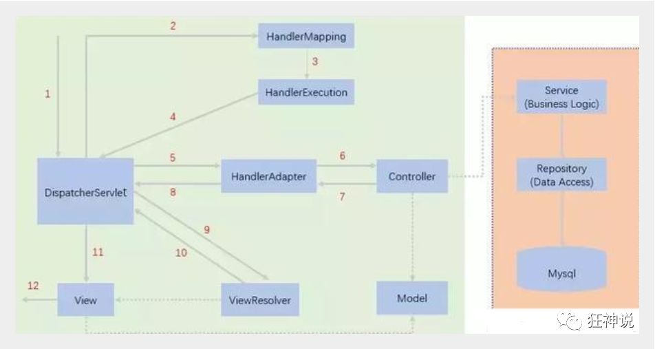
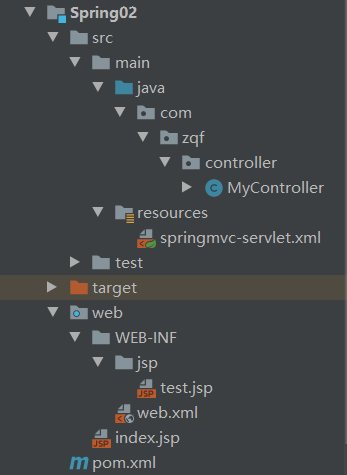
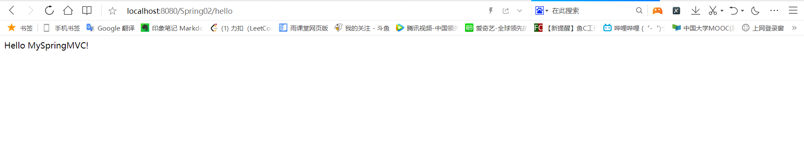
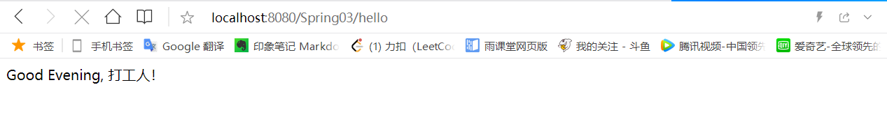
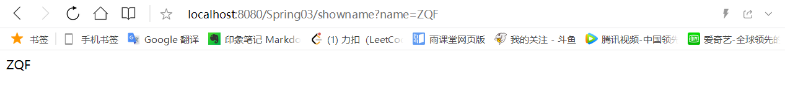
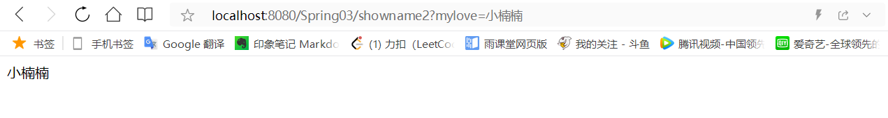
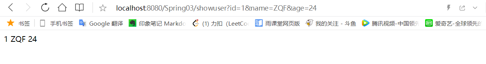

# 1. 执行原理

实线表示SpringMVC框架提供的技术，不需要开发者实现；虚线表示需要开发者实现


1. DispatcherServlet表示前置控制器，是整个SpringMVC的控制中心。用户发出请求，DispatcherServlet接收请求并拦截请求。
假设请求的URL为`http://localhost:8080/Spring01/hello`，将被拆解为三部分
    * http://localhost:8080 表示服务器域名
    * Spring01 表示部署在服务器上的web站点
    * hello 表示控制器
故上述的URL表示为：请求位于服务器`http://localhost:8080`上的Spring01站点的hello控制器

2. HandlerMapping为处理器映射。DispatcherServlet调用HandlerMapping，HandlerMapping根据请求url查找Handler。

3. HandlerExecution表示具体的Handler，其主要作用是根据url查找控制器。如上述url被查找的控制器为hello。

4. HandlerExecution将解析后的信息传递给DispatcherServlet。

5. HandlerAdapter表示处理器适配器，其按照特定的规则去执行Handler。

6. Handler让具体的Controller执行。

7. Controller将具体的执行信息返回给HandlerAdapter，如ModelAndView。

8. HandlerAdapter将视图逻辑名或模型传递给DispatcherServlet。

9. DispatcherServlet调用ViewResolver(视图解析器)来解析HandlerAdapter传递的逻辑视图名。

10. ViewResolver将解析的逻辑视图名返回给DispatcherServlet。

11. DispatcherServlet根据ViewResolver解析的视图结果，调用具体的视图。

12. 最终视图呈现给用户。

# 2. 执行代码(配置文件)

工程结构



引入相关依赖，配置编译器版本

```xml
    <properties>
        <project.build.sourceEncoding>UTF-8</project.build.sourceEncoding>
        <maven.compiler.source>14</maven.compiler.source>
        <maven.compiler.target>14</maven.compiler.target>
    </properties>

    <dependencies>
        <dependency>
            <groupId>junit</groupId>
            <artifactId>junit</artifactId>
            <version>4.12</version>
        </dependency>
        <dependency>
            <groupId>org.springframework</groupId>
            <artifactId>spring-webmvc</artifactId>
            <version>5.2.10.RELEASE</version>
        </dependency>
        <dependency>
            <groupId>javax.servlet</groupId>
            <artifactId>servlet-api</artifactId>
            <version>2.5</version>
        </dependency>
        <dependency>
            <groupId>javax.servlet.jsp</groupId>
            <artifactId>jsp-api</artifactId>
            <version>2.2</version>
        </dependency>
        <dependency>
            <groupId>javax.servlet</groupId>
            <artifactId>jstl</artifactId>
            <version>1.2</version>
        </dependency>
    </dependencies>
```

配置web.xml

```xml
<?xml version="1.0" encoding="UTF-8"?>
<web-app xmlns="http://xmlns.jcp.org/xml/ns/javaee"
         xmlns:xsi="http://www.w3.org/2001/XMLSchema-instance"
         xsi:schemaLocation="http://xmlns.jcp.org/xml/ns/javaee http://xmlns.jcp.org/xml/ns/javaee/web-app_4_0.xsd"
         version="4.0">

    <!--配置DispatcherServlet：这个是SpringMVC的核心，称为请求分发器或前端控制器-->
    <servlet>
        <servlet-name>springmvc</servlet-name>
        <servlet-class>org.springframework.web.servlet.DispatcherServlet</servlet-class>
        <!--DispatcherServlet要绑定Spring的配置文件-->
        <init-param>
            <param-name>contextConfigLocation</param-name>
            <param-value>classpath:springmvc-servlet.xml</param-value>
        </init-param>
        <!--启动级别：1-->
        <load-on-startup>1</load-on-startup>
    </servlet>

    <!--
        SpringMVC中，/和/*的区别
        /：只匹配所有的请求，不会去匹配jsp页面
        /*：匹配所有的请求，包括jsp页面
    -->
    <servlet-mapping>
        <servlet-name>springmvc</servlet-name>
        <url-pattern>/</url-pattern>
    </servlet-mapping>

</web-app>
```

配置springmvc-servlet.xml文件

```xml
<?xml version="1.0" encoding="UTF-8"?>
<beans xmlns="http://www.springframework.org/schema/beans"
       xmlns:xsi="http://www.w3.org/2001/XMLSchema-instance"
       xsi:schemaLocation="http://www.springframework.org/schema/beans
       http://www.springframework.org/schema/beans/spring-beans.xsd">

    <!--处理器映射器-->
    <bean class="org.springframework.web.servlet.handler.BeanNameUrlHandlerMapping"/>
    <!--处理器适配器-->
    <bean class="org.springframework.web.servlet.mvc.SimpleControllerHandlerAdapter"/>
    <!--视图解析器-->
    <bean class="org.springframework.web.servlet.view.InternalResourceViewResolver" id="internalResourceViewResolver">
        <!--前缀-->
        <property name="prefix" value="/WEB-INF/jsp/"/>
        <!--后缀-->
        <property name="suffix" value=".jsp"/>
    </bean>

    <bean id="/hello" class="com.zqf.controller.MyController"/>
    
</beans>
```

创建Controller

编写一个Java控制类：com.zqf.controller.MyController

```java
package com.zqf.controller;

import org.springframework.web.servlet.ModelAndView;
import org.springframework.web.servlet.mvc.Controller;

import javax.servlet.http.HttpServletRequest;
import javax.servlet.http.HttpServletResponse;

public class MyController implements Controller {
    @Override
    public ModelAndView handleRequest(HttpServletRequest httpServletRequest, HttpServletResponse httpServletResponse) throws Exception {
        ModelAndView mv = new ModelAndView();

        // 业务逻辑代码
        String res = "Hello MySpringMVC!";
        mv.addObject("msg", res);
        // 视图跳转
        mv.setViewName("test");

        return mv;
    }
}
```

创建视图层hello.jsp

```html
<%@ page contentType="text/html;charset=UTF-8" language="java" %>
<html>
<head>
    <title>ZQF</title>
</head>
<body>
${msg}
</body>
</html>
```

配置Tomcat，运行



# 3. 执行代码(基于注解)

Maven可能存在资源过滤的问题，在pom.xml中完善配置，并引入相关依赖。（父依赖中已经引入）

```xml
<?xml version="1.0" encoding="UTF-8"?>
<project xmlns="http://maven.apache.org/POM/4.0.0"
         xmlns:xsi="http://www.w3.org/2001/XMLSchema-instance"
         xsi:schemaLocation="http://maven.apache.org/POM/4.0.0 http://maven.apache.org/xsd/maven-4.0.0.xsd">
    <parent>
        <artifactId>SpringMVC</artifactId>
        <groupId>org.example</groupId>
        <version>1.0-SNAPSHOT</version>
    </parent>
    <modelVersion>4.0.0</modelVersion>

    <groupId>com.zqf</groupId>
    <artifactId>Spring03-annotation</artifactId>

    <build>
        <resources>
            <resource>
                <directory>src/main/java</directory>
                <includes>
                    <include>**/*.properties</include>
                    <include>**/*.xml</include>
                </includes>
                <filtering>false</filtering>
            </resource>
            <resource>
                <directory>src/main/resources</directory>
                <includes>
                    <include>**/*.properties</include>
                    <include>**/*.xml</include>
                </includes>
                <filtering>false</filtering>
            </resource>
        </resources>
    </build>
</project>
```

配置web.xml（这一部分都是固定代码，基本不用改变）

```xml
<?xml version="1.0" encoding="UTF-8"?>
<web-app xmlns="http://xmlns.jcp.org/xml/ns/javaee"
         xmlns:xsi="http://www.w3.org/2001/XMLSchema-instance"
         xsi:schemaLocation="http://xmlns.jcp.org/xml/ns/javaee http://xmlns.jcp.org/xml/ns/javaee/web-app_4_0.xsd"
         version="4.0">

    <!--1.注册servlet-->
    <servlet>
        <servlet-name>SpringMVC</servlet-name>
        <servlet-class>org.springframework.web.servlet.DispatcherServlet</servlet-class>
        <!--通过初始化参数指定SpringMVC配置文件的位置，进行关联-->
        <init-param>
            <param-name>contextConfigLocation</param-name>
            <param-value>classpath:springmvc-servlet.xml</param-value>
        </init-param>
        <!-- 启动顺序，数字越小，启动越早 -->
        <load-on-startup>1</load-on-startup>
    </servlet>

    <!--所有请求都会被springmvc拦截 -->
    <servlet-mapping>
        <servlet-name>SpringMVC</servlet-name>
        <url-pattern>/</url-pattern>
    </servlet-mapping>

</web-app>
```

配置SpringMVC配置文件springmvc-servlet.xml

```xml
<?xml version="1.0" encoding="UTF-8"?>
<beans xmlns="http://www.springframework.org/schema/beans"
       xmlns:xsi="http://www.w3.org/2001/XMLSchema-instance"
       xmlns:context="http://www.springframework.org/schema/context"
       xmlns:mvc="http://www.springframework.org/schema/mvc"
       xsi:schemaLocation="http://www.springframework.org/schema/beans
       http://www.springframework.org/schema/beans/spring-beans.xsd
       http://www.springframework.org/schema/context
       https://www.springframework.org/schema/context/spring-context.xsd
       http://www.springframework.org/schema/mvc
       https://www.springframework.org/schema/mvc/spring-mvc.xsd">

    <!-- 自动扫描包，让指定包下的注解生效,由IOC容器统一管理 -->
    <context:component-scan base-package="com.zqf.controller"/>
    <!-- 让Spring MVC不处理静态资源 -->
    <mvc:default-servlet-handler />
    <!--
        支持mvc注解驱动
        在spring中一般采用@RequestMapping注解来完成映射关系
        要想使@RequestMapping注解生效
        必须向上下文中注册DefaultAnnotationHandlerMapping
        和一个AnnotationMethodHandlerAdapter实例
        这两个实例分别在类级别和方法级别处理。
        而annotation-driven配置帮助我们自动完成上述两个实例的注入。
     -->
    <mvc:annotation-driven />

    <!-- 视图解析器 -->
    <bean class="org.springframework.web.servlet.view.InternalResourceViewResolver"
          id="internalResourceViewResolver">
        <!-- 前缀 -->
        <property name="prefix" value="/WEB-INF/jsp/" />
        <!-- 后缀 -->
        <property name="suffix" value=".jsp" />
    </bean>

</beans>
```

创建Controller，使用注解进行注册

```java
package com.zqf.controller;

import org.springframework.stereotype.Controller;
import org.springframework.ui.Model;
import org.springframework.web.bind.annotation.RequestMapping;

@Controller
public class HelloController_Annotation {

    @RequestMapping("/hello")
    public String hello(Model model) {
        // 封装数据
        model.addAttribute("msg", "Good Evening, 打工人！");
        return "hello"; // 会被视图解析器处理
    }

}
```

创建视图层

```html
<%@ page contentType="text/html;charset=UTF-8" language="java" %>
<html>
<head>
    <title>ZQF</title>
</head>
<body>
${msg}
</body>
</html>
```

配置Tomcat并运行



使用步骤小结：

1. 新建web项目
2. 导入相关的jar包
3. 编写web.xml，注册DispatcherServlet
4. 编写springmvc配置文件
5. 创建对应的控制类controller
6. 完善前端视图和controller之间的对应
7. 测试运行调试
使用springMVC必须配置的三大件：**处理器映射器、处理器适配器、视图解析器**

通常，我们只需要手动配置视图解析器，而处理器映射器和持利器适配器只需要开启注解驱动即可！

# 4. 数据处理

## 4.1 处理提交数据

### 提交的域名称和处理方法的参数名一致

提交数据：`http://localhost:8080/Spring03/showname?name=ZQF`

处理方法：

```java
    @RequestMapping("/showname")
    public String showName(String name, Model model) {
        model.addAttribute("msg", name);
        return "hello";
    }
```

输出：



### 提交的域名称和处理方法的参数名不一致

提交数据：`http://localhost:8080/Spring03/showname2?mylove=小楠楠`

处理方法：

```java
    @RequestMapping("/showname2")
    public String showName2(@RequestParam("mylove") String name, Model model) {
        model.addAttribute("msg", name);
        return "hello";
    }
```

输出：



### 提交的是一个对象

要求提交的表单域和对象的属性名一致，参数使用对象即可

实体类：

```java
package com.zqf.entity;

public class User {

    private int id;
    private String name;
    private int age;

    @Override
    public String toString() {
        return "User{" +
                "id=" + id +
                ", name='" + name + '\'' +
                ", age=" + age +
                '}';
    }
    public void setId(int id) {
        this.id = id;
    }
    public void setName(String name) {
        this.name = name;
    }
    public void setAge(int age) {
        this.age = age;
    }
    public int getId() {
        return id;
    }
    public String getName() {
        return name;
    }
    public int getAge() {
        return age;
    }
}
```

提交数据：`http://localhost:8080/Spring03/showuser?id=1&name=ZQF&age=24`

处理方法：

```java
    @RequestMapping("/showuser")
    public String showUser(User user, Model model) {
        model.addAttribute("msg1", user.getId());
        model.addAttribute("msg2", user.getName());
        model.addAttribute("msg3", user.getAge());
        return "hello2";
    }
```

输出：



## 4.2 数据显示到前端

### ModelAndView

```java
public class HelloController implements Controller {
    public ModelAndView handleRequest(HttpServletRequest request, HttpServletResponse response) throws Exception {
        //ModelAndView 模型和视图
        ModelAndView mv = new ModelAndView();

        //封装对象，放在ModelAndView中。Model
        mv.addObject("msg","HelloSpringMVC!");
        //封装要跳转的视图，放在ModelAndView中
        mv.setViewName("hello"); //: /WEB-INF/jsp/hello.jsp
        return mv;
    }
}
```

### 通过ModelMap

```java
    @RequestMapping("/hello")
    public String hello(ModelMap model) {
        // 封装数据
        model.addAttribute("msg", "Good Evening, 打工人！");
        return "hello"; // 会被视图解析器处理
    }
```

### 通过Model

```java
    @RequestMapping("/hello")
    public String hello(Model model) {
        // 封装数据
        model.addAttribute("msg", "Good Evening, 打工人！");
        return "hello"; // 会被视图解析器处理
    }
```
