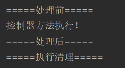

# 1. 概述

SpringMVC的处理器拦截器类似于Servlet开发中的过滤器Filter，用于对处理器进行预处理和后处理。开发者可以自定义一些拦截器来实现特定的功能。

过滤器与拦截器的区别：拦截器是AOP思想的具体应用

* 过滤器    
	* servlet规范中的一部分，任何java web工程都可以使用
    * 在utl-pattern中配置了/*之后，可以对所有要访问的资源进行拦截

* 拦截器    
	* 拦截器是SpringMVC框架自己的，只有使用MVC框架的工程才能使用
    * 拦截器只会拦截访问的控制器方法，如果访问的是jsp/html/css/image/js是不会进行拦截的
	
# 2. 自定义拦截器

1. 创建新的Moudule，添加web支持，配置web.xml和springmvc配置文件
2. 编写一个拦截器
```java
package com.zqf.Interceptor;

import org.springframework.web.servlet.HandlerInterceptor;
import org.springframework.web.servlet.ModelAndView;

import javax.servlet.http.HttpServletRequest;
import javax.servlet.http.HttpServletResponse;

public class Interceptor implements HandlerInterceptor {
    // 在请求处理方法前执行，若返回true则执行下一个拦截器，返回false则不执行下一个拦截器
    @Override
    public boolean preHandle(HttpServletRequest request, HttpServletResponse response, Object handler) throws Exception {
        System.out.println("=====处理前=====");
        return true;
    }
    // 在请求处理方法之后执行
    @Override
    public void postHandle(HttpServletRequest request, HttpServletResponse response, Object handler, ModelAndView modelAndView) throws Exception {
        System.out.println("=====处理后=====");
    }
    // 在dispatcherServlet处理后执行，做清理工作
    @Override
    public void afterCompletion(HttpServletRequest request, HttpServletResponse response, Object handler, Exception ex) throws Exception {
        System.out.println("=====执行清理=====");
    }
}

```

3. 在springmvc配置文件中配置拦截器
```xml
    <!--配置拦截器-->
    <mvc:interceptors>
        <mvc:interceptor>
            <!--/**包括拦截包括路径及其子路径-->
            <mvc:mapping path="/**"/>
            <!--bean配置的就是拦截器-->
            <bean class="com.zqf.Interceptor.Interceptor"/>
        </mvc:interceptor>
    </mvc:interceptors>
```

4. 编写Controller接收请求
```java
@Controller
public class InterceptorController {

    @RequestMapping("/interceptor")
    @ResponseBody
    public String testInterceptor() {
        System.out.println("控制器方法执行！");
        return "拦截器测试";
    }
}
```

5. 前端页面
```html
<a href="${pageContext.request.contextPath}/interceptor">拦截器测试</a>
```

6. 启动Tomcat执行测试


