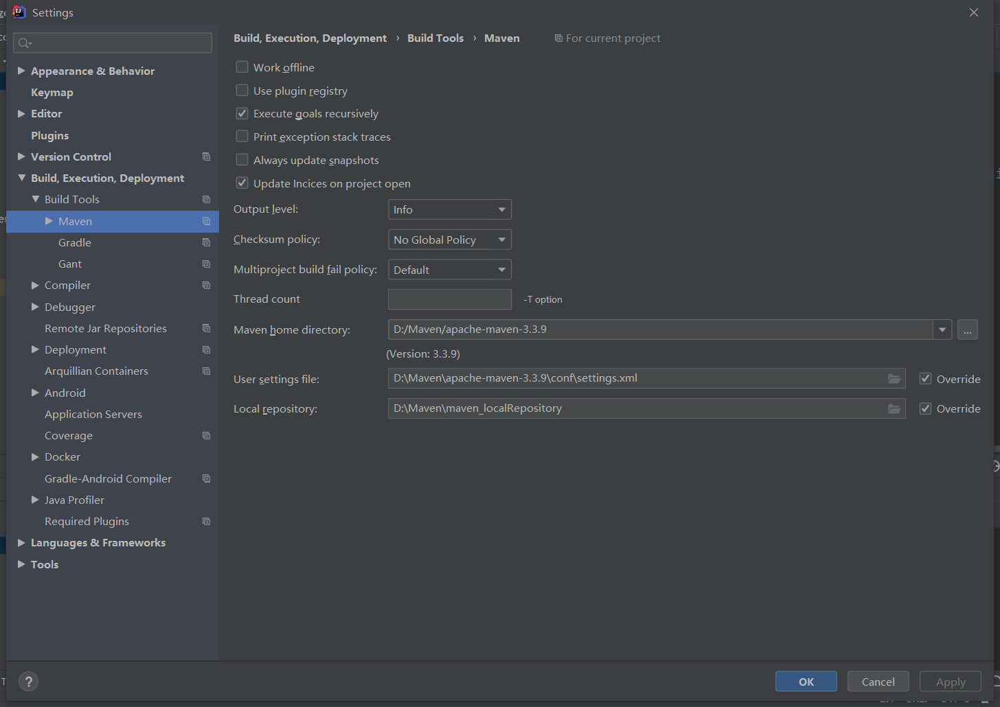
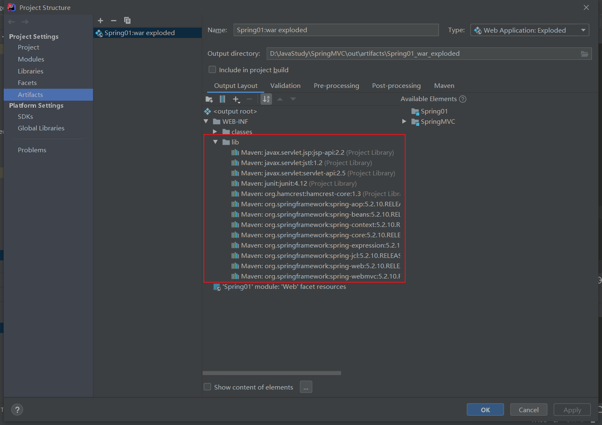
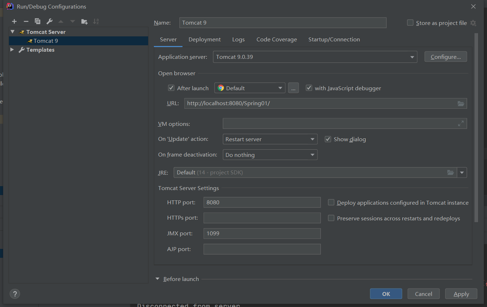
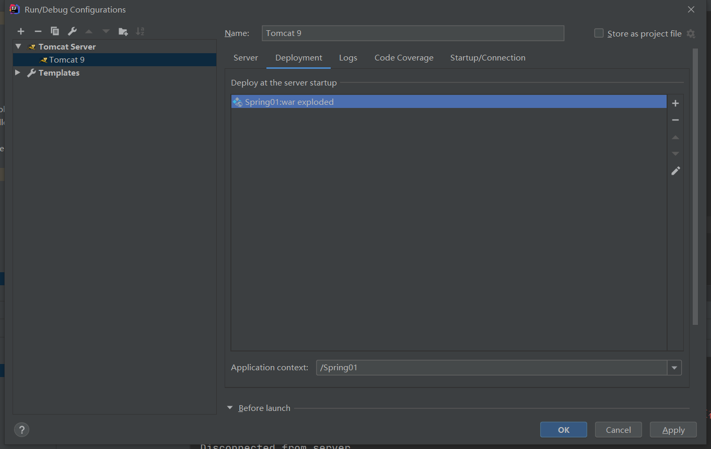
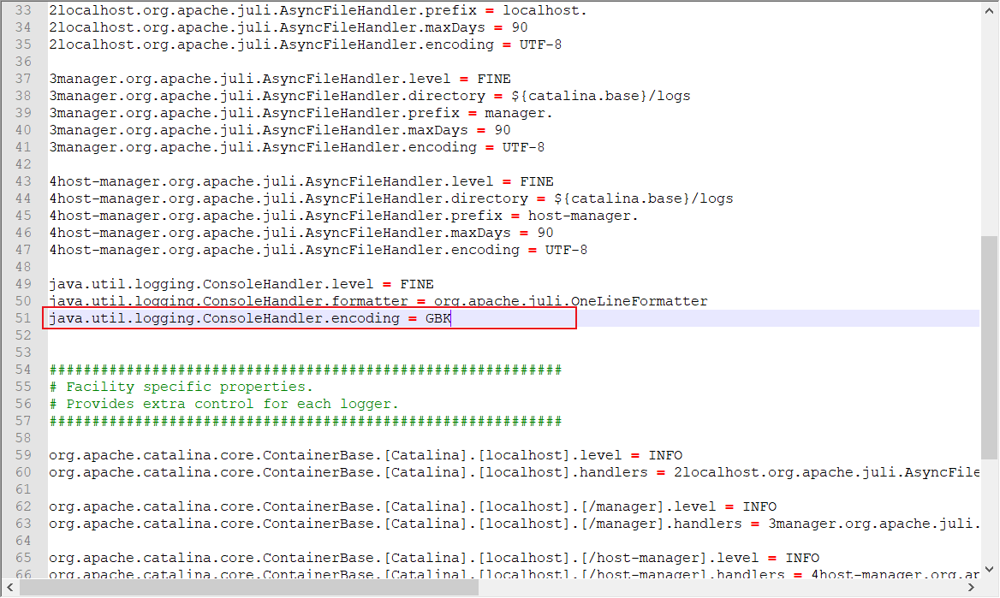

# 1. maven仓库中存在jar包却找不到

解决方法：

* 注释掉maven的settings.xml中的本地仓库地址，在idea中配置
* 在idea的setting中配置maven的仓库地址，如下图



# 2. pom.xml配置文件中注意添加jdk版本信息

```xml
    <properties>
        <project.build.sourceEncoding>UTF-8</project.build.sourceEncoding>
        <maven.compiler.source>14</maven.compiler.source>
        <maven.compiler.target>14</maven.compiler.target>
    </properties>
```

# 3. 在项目发布中添加lib依赖



# 4. 配置tomcat





# 5. tomcat控制台中文乱码问题

`D:\Tomcat\apache-tomcat-9.0.39\conf`路径下的logging.properties文件

修改其中的



