# 1. 索引概述

索引(index)是帮助MySQL高效获取数据的数据结构。

一般来说索引本身也很大，不可能全部存储在内存中，因此索引往往以文件的形式存储在磁盘上。索引是数据库中用来提高性能的最常用的工具。

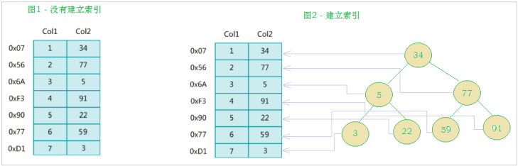

# 2. 索引的优劣分析

优势：

* 索引可以提高数据检索的效率，降低数据库的IO成本
* 通过索引列对数据进行排序，降低数据排序的成本，降低CPU的消耗

劣势：

* 索引实际上也是一张表，表中保存了主键与索引字段，并指向实体类的记录。因此索引也需要占用空间。
* 索引提升了查询效率却降低了更新表的速度。因为在更新表(增删改)时，MySQL不仅要保存数据，还要保存索引文件。

# 3. 索引结构

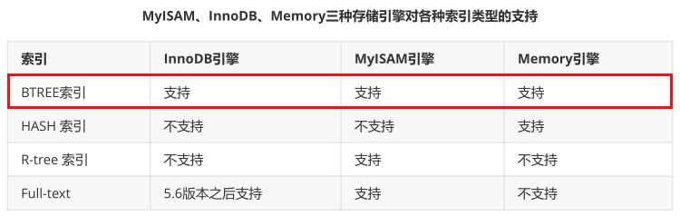

## 3.1 BTREE结构

BTREE又称多路平衡搜索树，一棵m叉的BTREE特性如下：

* 树中的每个节点最多包含m个子节点
* 除根节点与叶子结点外，每个节点至少有`[ceil(m/2)]`个子节点
* 若根节点不是叶子节点，则至少有两个子节点
* 所有的叶子结点都在一层
* 每个非叶子结点由n个key与n+1个指针组成，其中`[ceil(m/2)-1]<=n<=m-1`

示例：以插入 C N G A H E K Q M F W L T Z D P R X Y S 数据为例

插入前四个字母 C N G A

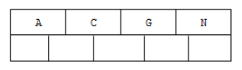

插入 H


插入 E K Q，不需要分裂

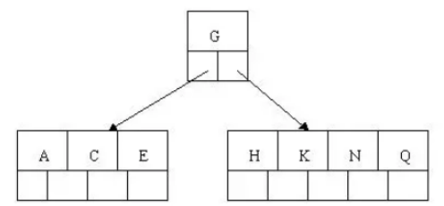

插入 M

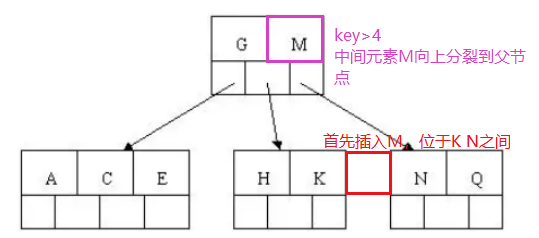

插入 F W L T，不需要分裂


插入 Z

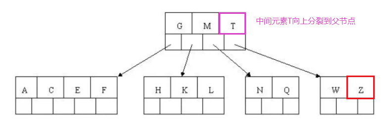

插入 D，在插入P R X Y

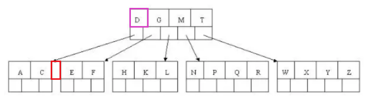

插入 S

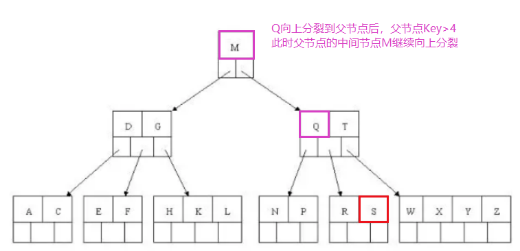


至此BTREE的构建完成。BTREE相对于二叉树来说，查询效率更高（层级结构小，搜索速度快）

## 3.2 B+TREE结构

B+TREE是BTREE的变种，他们的区别为：

* n叉B+TREE最多含有n个Key，而BTREE最多含有n-1个
* B+TREE的叶子结点保存所有的Key信息，依照Key的大小进行排序
* 所有的非叶子结点都可以看做是Key的索引部分
* 由于B+TREE只有叶子结点保存Key信息，查询任何Key都需要从根节点走到叶子结点，所以B+TREE的查询效率更加稳定

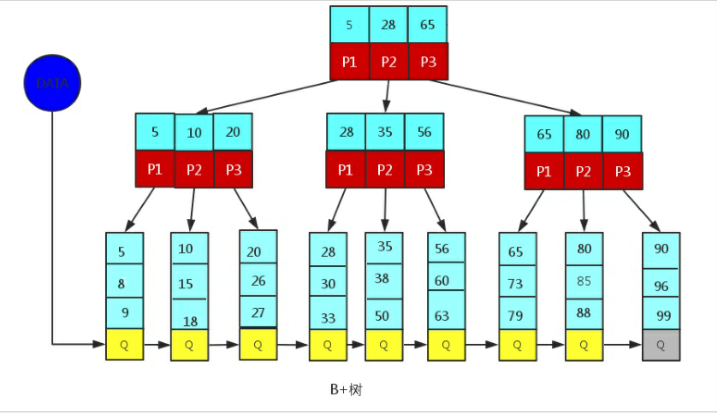

## 3.3 MySQL中的B+TREE

MySQL对经典的B+TREE做了优化。在原来的B+TREE的基础上，增加了一个指向相邻叶子结点的链表指针，这样就形成了带有顺序指针的B+TREE，提高区间访问的性能。

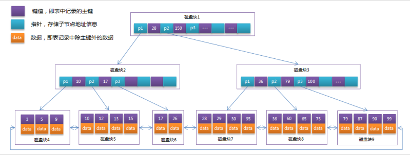

# 4. 索引分类

* 单值索引：索引只包含单个列，一个表可以有多个单值索引
* 唯一索引：索引列的值必须唯一，但允许有空值
* 复合索引：一个索引包含多个列

# 5. 索引语法

准备环境：

```sql
CREATE TABLE `city` (
  `city_id` int(11) NOT NULL AUTO_INCREMENT,
  `city_name` varchar(50) NOT NULL,
  `country_id` int(11) NOT NULL,
  PRIMARY KEY (`city_id`)
) ENGINE=InnoDB DEFAULT CHARSET=utf8;

CREATE TABLE `country` (
  `country_id` int(11) NOT NULL AUTO_INCREMENT,
  `country_name` varchar(100) NOT NULL,
  PRIMARY KEY (`country_id`)
) ENGINE=InnoDB DEFAULT CHARSET=utf8;

insert into `city` (`city_id`, `city_name`, `country_id`) values(1,'西安',1);
insert into `city` (`city_id`, `city_name`, `country_id`) values(2,'NewYork',2);
insert into `city` (`city_id`, `city_name`, `country_id`) values(3,'北京',1);
insert into `city` (`city_id`, `city_name`, `country_id`) values(4,'上海',1);

insert into `country` (`country_id`, `country_name`) values(1,'China');
insert into `country` (`country_id`, `country_name`) values(2,'America');
insert into `country` (`country_id`, `country_name`) values(3,'Japan');
insert into `country` (`country_id`, `country_name`) values(4,'UK');
```

## 5.1 创建索引

语法：

```sql
CREATE  [UNIQUE|FULLTEXT|SPATIAL]  INDEX index_name 
[USING  index_type]
ON tbl_name(index_col_name,...);
```

示例：

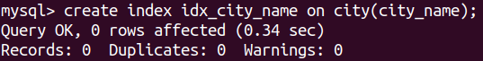

## 5.2 查看索引

```sql
show index from table_name;
```

示例：

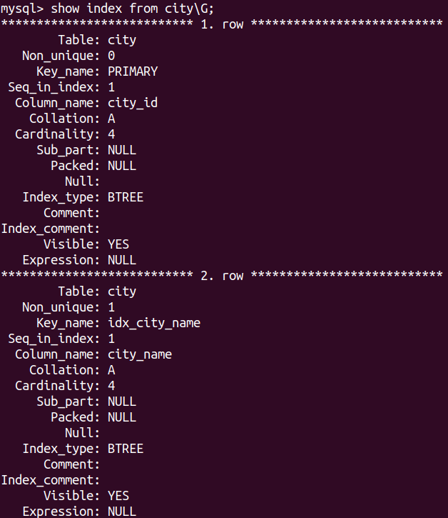

## 5.3 删除索引

```sql
drop index index_name on table_name;
```

示例：


## 5.4 ALTER命令

```sql
# 添加一个主键，这意味着索引值必须是惟一的，且不能为null
alter table tbl_name add primary key(column_list);

# 添加唯一索引：索引的值必须是唯一的(除了NULL)
alter table tbl_name add unique index_name(column_list);

# 添加普通索引：索引值可以出现多次
alter table tbl_name add index index_name(column_list);

# 该语句指定索引为FULLTEXT，用于全文索引
alter table tbl_name add fulltext index_name(column_list);
```

# 6. 索引的设计原则

* 对于查询频次较高，数据量较大的表建立索引
* 最佳索引字段的选择应该从where字段的条件中提取
* 尽量使用唯一索引。区分度越高，使用索引的效率越高
* 索引不是多多益善。索引越多，维护索引的代价越高
* 尽量使用段索引。索引创建之后使用硬盘来存储，因此提升索引访问的IO效率，也可以提升总体的访问效率
* 利用最左索引。N个列组合而成的组合索引，相当于创建了N个索引

示例：
```sql
创建复合索引:
CREATE INDEX idx_name_email_status ON tb_seller(NAME,email,STATUS);
 
就相当于
    对name 创建索引 ;
    对name , email 创建了索引 ;
    对name , email, status 创建了索引 ;
```

