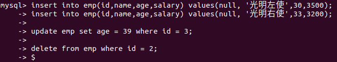
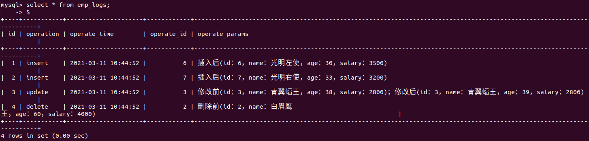
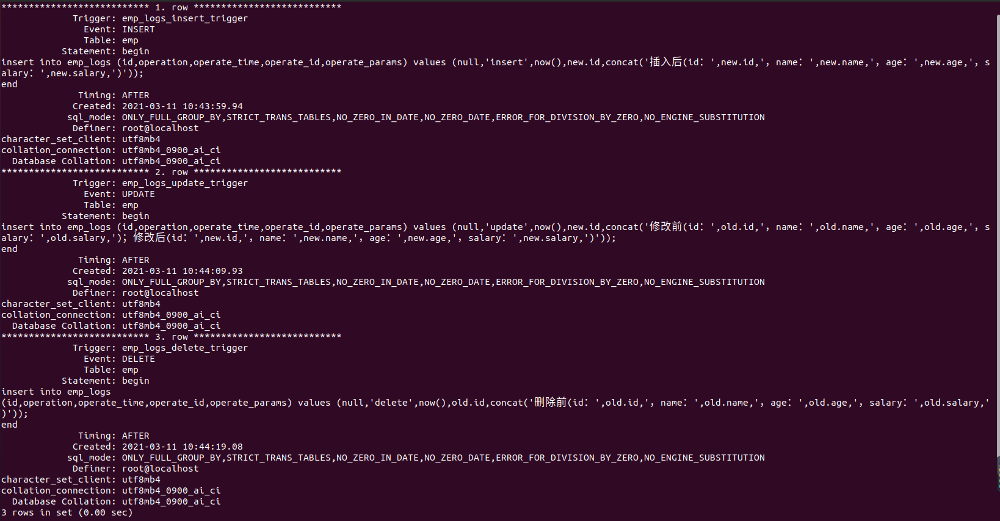

# 1. 触发器概述

触发器是与表有关的数据库对象，是指在 insert/update/delete 之前或者之后，触发并执行触发器中定义的SQL语句集合。

触发器的这种特性可以协助应用在数据库端确保数据的完整性、日志记录、数据校验等操作。

目前触发器只支持行级触发，不支持语句级触发。

触发器类型：
| 触发器类型 | new 和 old 的使用 |
| --- | --- |
| insert 型触发器 | new 表示将要或者已经新增的数据 |
| update 型触发器 | old 表示修改之前的数据，new 表示将要或者已经修改的数据 |
| delete 型触发器 | old表示将要或者已经删除的触数据 |

# 2. 创建触发器

语法结构：

```sql
create trigger trigger_name

before/after insert/updete/delete

on table_name 

for each row

begin

    trigger_statement
    
end;
```

需求：通过触发器记录 emp 表的数据变更日志，包括增加，修改，删除操作。

数据准备

```sql
create table emp(
  id int(11) not null auto_increment ,
  name varchar(50) not null comment '姓名',
  age int(11) comment '年龄',
  salary int(11) comment '薪水',
  primary key(`id`)
)engine=innodb default charset=utf8 ;

insert into emp(id,name,age,salary) values(null,'金毛狮王',55,3800),(null,'白眉鹰
王',60,4000),(null,'青翼蝠王',38,2800),(null,'紫衫龙王',42,1800);
```

创建日志表

```sql
create table emp_logs(
  id int(11) not null auto_increment,
  operation varchar(20) not null comment '操作类型, insert/update/delete',
  operate_time datetime not null comment '操作时间',
  operate_id int(11) not null comment '操作表的ID',
  operate_params varchar(500) comment '操作参数',
  primary key(`id`)
)engine=innodb default charset=utf8;
```

创建 insert 型触发器

```sql
create trigger emp_logs_insert_trigger
after insert
on emp
for each row
begin
insert into emp_logs (id,operation,operate_time,operate_id,operate_params) values (null,'insert',now(),new.id,concat('插入后(id：',new.id,'，name：',new.name,'，age：',new.age,'，salary：',new.salary,')'));
end$ -- 使用触发器需要将结束符改变  语法：delimiter $
```

创建 update 型触发器

```sql
create trigger emp_logs_update_trigger
after update
on emp
for each row
begin
insert into emp_logs (id,operation,operate_time,operate_id,operate_params) values (null,'update',now(),new.id,concat('修改前(id：',old.id,'，name：',old.name,'，age：',old.age,'，salary：',old.salary,')；修改后(id：',new.id,'，name：',new.name,'，age：',new.age,'，salary：',new.salary,')'));
end $
```

创建 delete 型触发器

```sql
create trigger emp_logs_delete_trigger
after delete
on emp
for each row
begin 
insert into emp_logs
(id,operation,operate_time,operate_id,operate_params) values (null,'delete',now(),old.id,concat('删除前(id：',old.id,'，name：',old.name,'，age：',old.age,'，salary：',old.salary,')'));
end$
```

测试：





# 3. 查看触发器

语法结构：

```sql
drop trigger trigger_name;
```

# 4. 删除触发器

语法结构：

```sql
show triggers;
```



